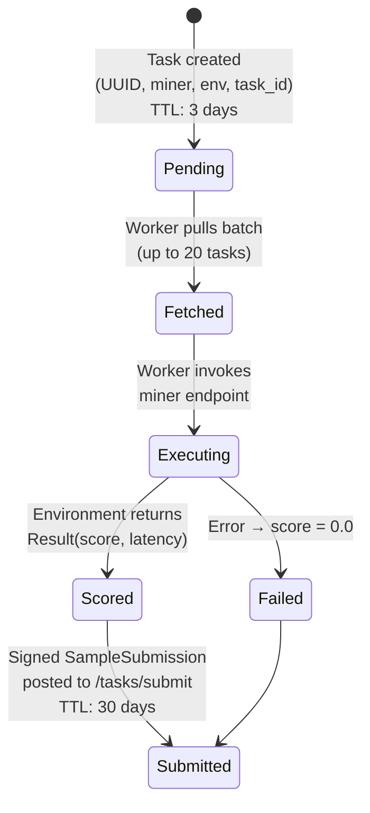

With the participants and their roles established in [Section 3.1](/mechanism/system-participants/), this section traces a single task from creation through final submission — the operational core of the evaluation pipeline.

The evaluation pipeline is driven by a pull-based task pool architecture backed by DynamoDB. Figure 1 illustrates the full task lifecycle.

**Figure 1. Task Lifecycle**

> **How to read this diagram:** Each box represents a task state; arrows show transitions triggered by system actions. A task moves left-to-right from creation to final submission, with a failure branch for error cases.

The lifecycle proceeds through four stages:

### 1. Task Creation

The system generates evaluation tasks for each active miner across all environments. Each task is identified by a unique UUID and keyed by:

- Miner hotkey
- Model revision
- Environment
- Task ID

Tasks are created with `pending` status and a three-day time-to-live.

### 2. Task Fetch

Each executor worker subprocess runs a continuous fetch loop, pulling batches of up to 20 pending tasks from the `/tasks/fetch` API endpoint. Fetching is demand-driven: the worker only requests new tasks when its internal queue falls below the concurrency limit.

### 3. Task Execution

Execution workers pull tasks from an internal asyncio queue and invoke the target miner's inference endpoint through the environment SDK. The environment returns a `Result` object containing:

- **Score** — which may be negative for some environments
- **Latency**
- **Success status**
- **Optional metadata**

Failed executions are recorded with a score of 0.0 and an error description.

### 4. Result Submission

Each result is packaged into a cryptographically signed `SampleSubmission` containing:

- Task UUID
- Score
- Latency
- Metadata

The submission is posted to the `/tasks/submit` endpoint. Submitted samples are persisted in the `sample_results` table with a 30-day TTL. The executor's main process monitors worker liveness and automatically restarts dead subprocesses.

> **Key implication:** The pull-based architecture with demand-driven fetching and automatic subprocess recovery ensures the evaluation pipeline remains live even when individual workers fail — a critical property for continuous, unattended operation.
