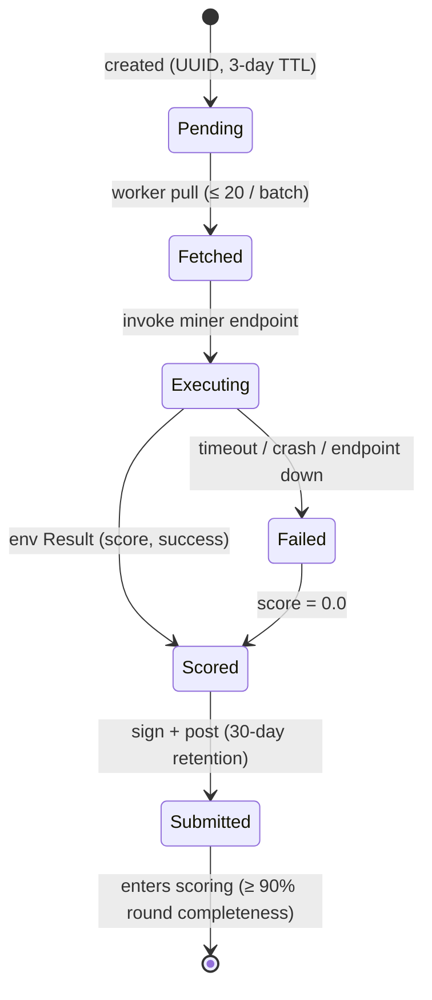

Every task moves through the same five stages: created, fetched, executed, scored, submitted. The lifecycle is pull-based and cryptographically signed end to end, so any settled weight can be traced back to the task that produced it.

**Creation.** Tasks are keyed on `(miner hotkey, model revision, environment, task_id)` and written into a DynamoDB-backed pool with a three-day TTL. The UUID assigned at creation is what makes later stages replayable.

**Fetch.** Execution workers pull pending tasks on demand, up to twenty at a time. A dropped task is simply picked up by the next worker with capacity; no coordinator is required for failure recovery.

**Execution.** The worker invokes the miner's Chutes endpoint through the environment SDK and receives a `Result` containing `score`, `latency`, `success`, and optional metadata. Any execution failure — endpoint down, environment crash, timeout — is recorded as `score = 0.0`. Scores may be negative; downstream normalization handles per-environment range shifts.

**Submission.** The result is wrapped in a `SampleSubmission`, signed with the executor's hotkey, and posted to the backend. Samples are retained for thirty days, which is enough history for the scoring pipeline and any downstream audit.

**Sampling integrity.** Two cross-cutting controls apply. Per-environment rotation caps any single environment at ≈80% of its dataset window before the pool refreshes, preventing miners from overfitting to a frozen slice. Common-task alignment restricts pairwise comparisons in [[§3.3](/mechanism/evaluation-loop/)](3.3-scoring.md) to tasks both miners completed, giving the Pareto filter a shared denominator. A miner must complete ≥ 90% of its assigned tasks in a round to enter scoring at all.

---

**Figure 3.2.** Task lifecycle state machine.

