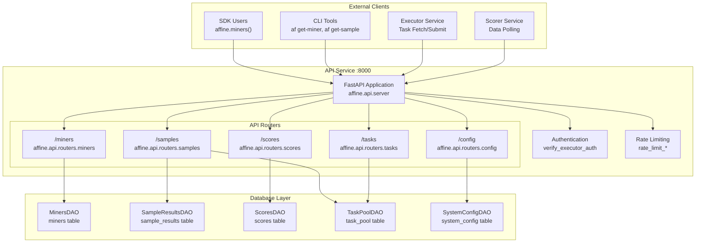
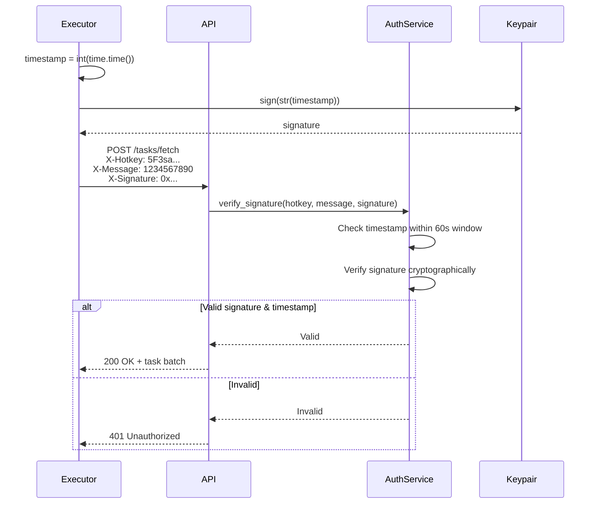
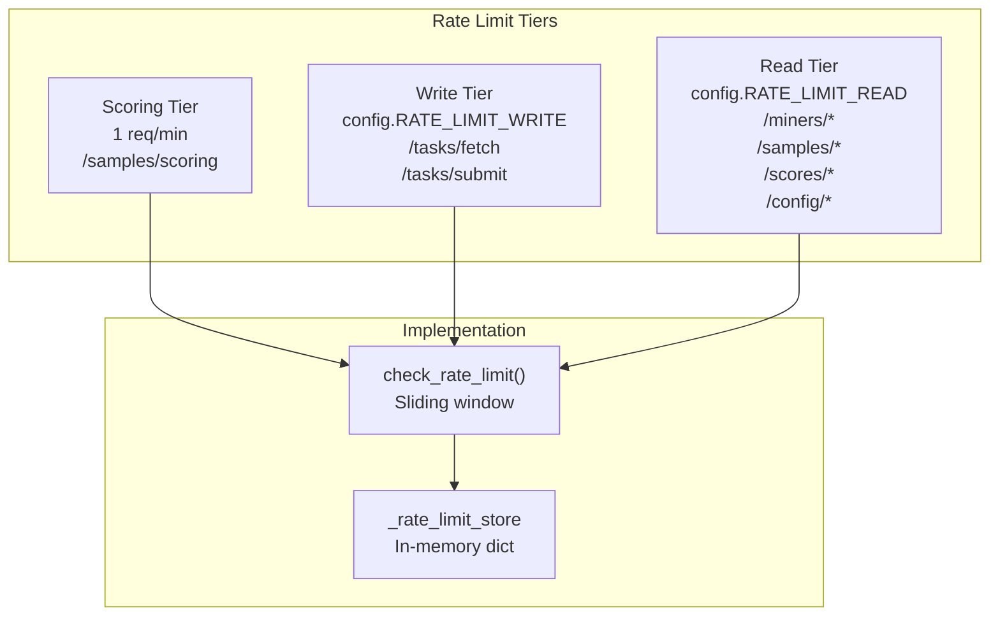
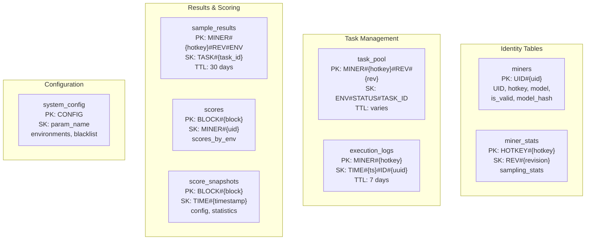
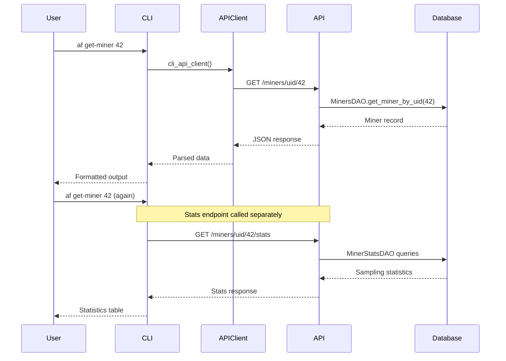
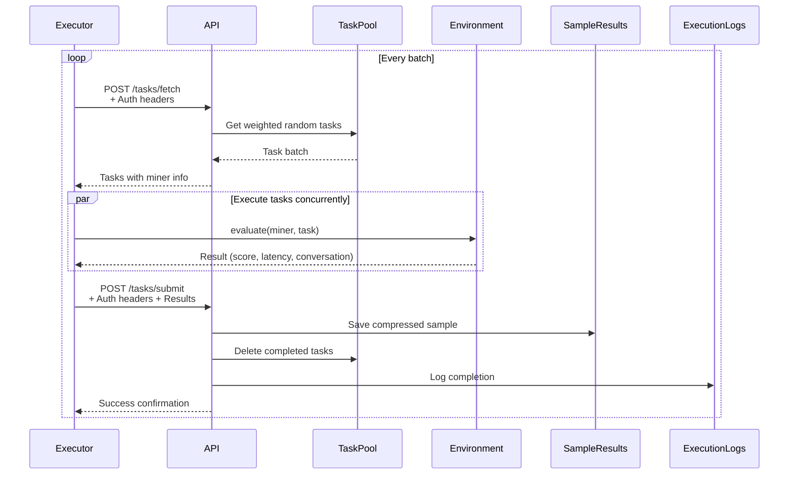
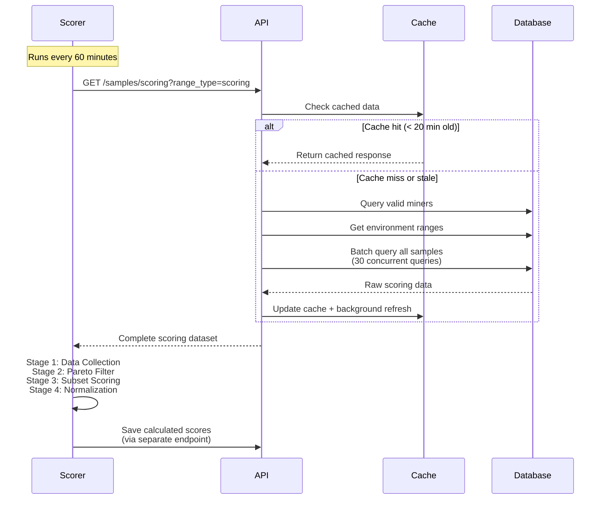

import CollapsibleAside from '../../../components/CollapsibleAside.astro';
import SourceLink from '../../../components/SourceLink.astro';
import Table from '../../../components/Table.astro';

<CollapsibleAside title="Relevant Source Files">
  <SourceLink text="affine/api/dependencies.py" href="https://github.com/AffineFoundation/affine-cortex/blob/main/affine/api/dependencies.py" />
  <SourceLink text="affine/api/routers/samples.py" href="https://github.com/AffineFoundation/affine-cortex/blob/main/affine/api/routers/samples.py" />
  <SourceLink text="affine/cli/main.py" href="https://github.com/AffineFoundation/affine-cortex/blob/main/affine/cli/main.py" />
  <SourceLink text="affine/cli/types.py" href="https://github.com/AffineFoundation/affine-cortex/blob/main/affine/cli/types.py" />
  <SourceLink text="affine/database/dao/__init__.py" href="https://github.com/AffineFoundation/affine-cortex/blob/main/affine/database/dao/__init__.py" />
  <SourceLink text="affine/database/dao/execution_logs.py" href="https://github.com/AffineFoundation/affine-cortex/blob/main/affine/database/dao/execution_logs.py" />
  <SourceLink text="affine/database/dao/sample_results.py" href="https://github.com/AffineFoundation/affine-cortex/blob/main/affine/database/dao/sample_results.py" />
  <SourceLink text="affine/database/schema.py" href="https://github.com/AffineFoundation/affine-cortex/blob/main/affine/database/schema.py" />
  <SourceLink text="affine/database/tables.py" href="https://github.com/AffineFoundation/affine-cortex/blob/main/affine/database/tables.py" />
  <SourceLink text="affine/src/miner/commands.py" href="https://github.com/AffineFoundation/affine-cortex/blob/main/affine/src/miner/commands.py" />
  <SourceLink text="affine/src/miner/main.py" href="https://github.com/AffineFoundation/affine-cortex/blob/main/affine/src/miner/main.py" />
  <SourceLink text="compose/docker-compose.backend.yml" href="https://github.com/AffineFoundation/affine-cortex/blob/main/compose/docker-compose.backend.yml" />
</CollapsibleAside>

This document provides complete reference documentation for Affine's REST API service. The API enables programmatic access to miner data, sample results, scores, task management, and system configuration.

The API service runs on port 8000 (configurable via `API_HOST` and `API_PORT` environment variables) and provides endpoints for:

- **Miner Management** - Query miner status, validation state, and statistics
- **Sample Results** - Access completed task evaluations and scoring data
- **Task Pool** - Query and manage pending task assignments
- **Scores** - Retrieve calculated weights and score snapshots
- **Configuration** - Access environment settings and blacklists

For SDK usage, see [SDK Reference](/subnets/sdk-reference#6). For CLI commands, see [CLI Reference](/subnets/cli-reference#9). For deployment configuration, see [Configuration](/subnets/getting-started/configuration#2.2).

---

## API Architecture Overview

The REST API service acts as the central gateway for all backend services and external clients:



**Sources:** [affine/api/routers/samples.py:1-344](), [affine/api/dependencies.py:1-264](), [compose/docker-compose.backend.yml:1-105]()

---

## REST API Endpoints

The API exposes endpoints grouped into five functional areas. All endpoints return JSON responses and use standard HTTP status codes.

### Base URL and Versioning

- **Base URL**: `http://{host}:8000/api/v1`
- **Default Host**: `0.0.0.0` (configurable via `API_HOST`)
- **Default Port**: `8000` (configurable via `API_PORT`)
- **API Version**: `v1` (stable)

### Endpoint Categories

```mermaid
graph TB
    BaseURL["http://api:8000/api/v1"]
    
    subgraph "Miner Endpoints"
        GetMiner["/miners/uid/{uid}<br/>GET: Miner details + stats"]
        GetMinerStats["/miners/uid/{uid}/stats<br/>GET: Sampling statistics"]
    end
    
    subgraph "Sample Endpoints"
        GetSample["/samples/{hotkey}/{env}/{task_id}<br/>GET: Sample by hotkey"]
        GetSampleUID["/samples/uid/{uid}/{env}/{task_id}<br/>GET: Sample by UID"]
        GetScoring["/samples/scoring<br/>GET: Batch scoring data"]
        GetPool["/samples/pool/uid/{uid}/{env}<br/>GET: Task pool status"]
    end
    
    subgraph "Score Endpoints"
        GetScoresLatest["/scores/latest<br/>GET: Latest scores"]
        GetWeights["/scores/weights/latest<br/>GET: Latest weights"]
        GetScoreUID["/scores/uid/{uid}<br/>GET: Score for miner"]
    end
    
    subgraph "Task Endpoints"
        FetchTasks["/tasks/fetch<br/>POST: Get task batch"]
        SubmitResult["/tasks/submit<br/>POST: Submit result"]
    end
    
    subgraph "Config Endpoints"
        GetEnvs["/config/environments<br/>GET: Environment configs"]
        GetBlacklist["/config/blacklist<br/>GET: Blacklisted miners"]
    end
    
    BaseURL --> GetMiner
    BaseURL --> GetSample
    BaseURL --> GetScoresLatest
    BaseURL --> FetchTasks
    BaseURL --> GetEnvs
```



**Sources:** [affine/api/routers/samples.py:27-344](), [affine/cli/main.py:194-323]()

### Miner Endpoints

#### GET /miners/uid/&#123;uid&#125;

Retrieve complete miner information including validation status, model metadata, and sampling statistics.

**Path Parameters:**
- `uid` (integer): Miner UID (0-255, or negative values like -1)

**Response Fields:**
```json
{
  "uid": 42,
  "hotkey": "5F3sa2TJAWMqDhXG6jhV...",
  "model": "username/model-name",
  "revision": "abc123...",
  "chute_id": "uuid-string",
  "is_valid": true,
  "first_block": 12345,
  "last_updated": 1234567890,
  "model_hash": "sha256...",
  "template_check_result": "safe"
}
```

**CLI Usage:**
```bash
af get-miner 42
af get-miner n1  # -1 in 'n' notation
```

#### GET /miners/uid/&#123;uid&#125;/stats

Retrieve detailed sampling statistics with time-windowed metrics.

**Response Includes:**
- Global sampling statistics (last 15min, 1hr, 6hrs, 24hrs)
- Per-environment statistics
- Success rates, samples/min, error counts
- Rate limit errors, timeout errors, other errors

**Sources:** [affine/src/miner/commands.py:486-545](), [affine/cli/main.py:208-224]()

---

### Sample Result Endpoints

#### GET /samples/&#123;hotkey&#125;/&#123;env&#125;/&#123;task_id&#125;

Retrieve sample result by hotkey and environment. Requires exact model revision.

**Path Parameters:**
- `hotkey` (string): Miner's hotkey (SS58 format)
- `env` (string): Environment name (e.g., `affine:sat`)
- `task_id` (string): Task identifier

**Query Parameters:**
- `model_revision` (string, required): Model revision hash

**Response:** Returns `SampleFullResponse` with conversation data or `TaskPoolResponse` if still pending.

**Sources:** [affine/api/routers/samples.py:30-90]()

#### GET /samples/uid/&#123;uid&#125;/&#123;env&#125;/&#123;task_id&#125;

Retrieve sample result by UID (automatically resolves hotkey and revision).

**Path Parameters:**
- `uid` (integer): Miner UID
- `env` (string): Environment name (supports shorthand like `sat` or full name like `affine:sat`)
- `task_id` (string): Task identifier

**Environment Shorthand Resolution:**
- `sat` → `affine:sat`
- `alfworld` → `agentgym:alfworld`
- `webshop` → `agentgym:webshop`

**CLI Usage:**
```bash
af get-sample 42 affine task_123
af get-sample n1 sat 456  # Shorthand env
```

**Sources:** [affine/api/routers/samples.py:92-189](), [affine/src/miner/commands.py:465-484]()

#### GET /samples/scoring

Retrieve batch scoring data for all valid miners. **Strictly rate-limited to 1 request per minute.**

**Query Parameters:**
- `range_type` (string): `"scoring"` (default) or `"sampling"` - determines task range used

**Response Structure:**
```json
{
  "block_number": 12345,
  "valid_miners": [
    {
      "uid": 42,
      "hotkey": "5F3sa...",
      "model": "username/model",
      "revision": "abc123..."
    }
  ],
  "env_ranges": {
    "affine:sat": [0, 100],
    "agentgym:webshop": [0, 500]
  },
  "samples": {
    "hotkey#revision": {
      "affine:sat": [
        {"task_id": 1, "score": 0.95, "timestamp": 1234567890}
      ]
    }
  }
}
```

**Implementation Details:**
- Uses proactive caching with background refresh every 20 minutes
- Cache prewarmed at startup
- Returns hot cache (&lt; 100ms response time)
- Scorer service is primary consumer

**Sources:** [affine/api/routers/samples.py:191-219]()

#### GET /samples/pool/uid/&#123;uid&#125;/&#123;env&#125;

Query task pool status showing pending, completed, and missing tasks.

**Response Fields:**
```json
{
  "uid": 42,
  "hotkey": "5F3sa...",
  "model_revision": "abc123...",
  "env": "agentgym:webshop",
  "sampling_config": {
    "sampling_count": 100,
    "rotation_rate": 10
  },
  "total_tasks": 500,
  "sampled_count": 450,
  "pool_count": 10,
  "missing_count": 40,
  "sampled_task_ids": [1, 2, 3, ...],
  "pool_task_ids": [451, 452, ...],
  "missing_task_ids": [461, 462, ...]
}
```

**CLI Usage:**
```bash
af get-pool 100 agentgym:webshop
af get-pool 100 webshop --full  # Full output
```

**Sources:** [affine/api/routers/samples.py:221-343](), [affine/src/miner/commands.py:590-641]()

---

### Score Endpoints

#### GET /scores/latest

Retrieve latest scores for top N miners at the most recent calculated block.

**Query Parameters:**
- `top` (integer, default: 32): Number of top miners to return

**Response Includes:**
- Block number
- Timestamp
- Top miners with scores
- Per-environment score breakdown
- Score calculation metadata

**CLI Usage:**
```bash
af get-scores
af get-scores --top 10
```

#### GET /scores/weights/latest

Retrieve normalized weights suitable for on-chain weight setting.

**Response Structure:**
```json
{
  "block_number": 12345,
  "timestamp": 1234567890,
  "weights": {
    "0": 0.0123,
    "1": 0.0456,
    "42": 0.0789
  },
  "config": {
    "min_weight_threshold": 0.01
  }
}
```

**CLI Usage:**
```bash
af get-weights
```

#### GET /scores/uid/&#123;uid&#125;

Retrieve score details for a specific miner from the latest snapshot.

**CLI Usage:**
```bash
af get-score 42
af get-score n1
```

**Sources:** [affine/src/miner/commands.py:548-588](), [affine/cli/main.py:226-273]()

---

### Task Management Endpoints

#### POST /tasks/fetch

Fetch a batch of pending tasks for execution. **Requires executor authentication.**

**Request Headers:**
- `X-Hotkey`: Executor's hotkey
- `X-Signature`: Signature of timestamp message
- `X-Message`: Current timestamp (integer string)

**Request Body:**
```json
{
  "batch_size": 10,
  "env_filter": ["affine:sat", "agentgym:webshop"]
}
```

**Response:**
```json
{
  "tasks": [
    {
      "task_uuid": "uuid-string",
      "miner_hotkey": "5F3sa...",
      "model_revision": "abc123...",
      "env": "affine:sat",
      "task_id": 42,
      "dataset_index": 42
    }
  ]
}
```

**Implementation:**
- Uses weighted random selection from task pool
- Automatically marks tasks as `assigned`
- Implements fairness via anti-starvation mechanisms

#### POST /tasks/submit

Submit completed task result. **Requires executor authentication.**

**Request Body:**
```json
{
  "task_uuid": "uuid-string",
  "miner_hotkey": "5F3sa...",
  "model_revision": "abc123...",
  "env": "affine:sat",
  "task_id": 42,
  "score": 0.95,
  "latency_ms": 1500,
  "extra": {
    "conversation": [...],
    "request": {...}
  },
  "validator_hotkey": "5F4ab...",
  "block_number": 12345,
  "signature": "0x..."
}
```

**Response:**
```json
{
  "success": true,
  "sample_id": "MINER#5F3sa...#REV#abc...#ENV#affine:sat#TASK#42"
}
```

**Implementation:**
- Saves to `sample_results` table with 30-day TTL
- Compresses `extra` field for storage efficiency
- Deletes task from `task_pool` atomically
- Logs execution event to `execution_logs`

**Sources:** [affine/database/dao/sample_results.py:62-128](), [affine/database/dao/execution_logs.py:34-98]()

---

### Configuration Endpoints

#### GET /config/environments

Retrieve all environment configurations including sampling settings, rotation settings, and enabled flags.

**Response Structure:**
```json
{
  "environments": {
    "affine:sat": {
      "enabled": true,
      "sampling_config": {
        "sampling_count": 100,
        "rotation_rate": 10
      },
      "scoring_config": {
        "scoring_count": 50
      },
      "dataset_range_source": "sampling_list"
    }
  }
}
```

**CLI Usage:**
```bash
af get-envs
```

#### GET /config/blacklist

Retrieve list of blacklisted miner hotkeys.

**Response:**
```json
{
  "blacklist": [
    "5Fabc...",
    "5Fdef..."
  ]
}
```

**Sources:** [affine/src/miner/commands.py:643-655](), [affine/cli/main.py:309-323]()

---

## Authentication & Rate Limiting

The API implements two security layers: signature-based authentication for write operations and IP-based rate limiting for all endpoints.

### Authentication Flow

Executor services must authenticate write operations (task fetch/submit) using timestamp-based signature verification:



**Sources:** [affine/api/dependencies.py:114-181]()

### Authentication Headers

Write endpoints (`/tasks/fetch`, `/tasks/submit`) require three headers:

<Table>

| Header | Type | Description |
|--------|------|-------------|
| `X-Hotkey` | string | Executor's hotkey (SS58 format) |
| `X-Message` | string | Current Unix timestamp as integer string |
| `X-Signature` | string | Hex-encoded signature of the timestamp |

</Table>


**Signature Generation Example:**
```python
import time
import bittensor as bt

wallet = bt.Wallet(name="coldkey", hotkey="hotkey")
timestamp = str(int(time.time()))
signature = wallet.hotkey.sign(timestamp.encode()).hex()

headers = {
    "X-Hotkey": wallet.hotkey.ss58_address,
    "X-Message": timestamp,
    "X-Signature": f"0x{signature}"
}
```

**Validation Rules:**
1. Message must be a valid integer timestamp
2. Timestamp must be within **60 seconds** of server time (prevents replay attacks)
3. Signature must be cryptographically valid for the hotkey
4. Hotkey must be in authorized validators list (in strict mode)

**Sources:** [affine/api/dependencies.py:140-180]()

### Rate Limiting

The API implements three-tier rate limiting based on endpoint sensitivity:



**Rate Limit Configuration:**

<Table>

| Tier | Limit | Window | Endpoints | Enforcement |
|------|-------|--------|-----------|-------------|
| **Scoring** | 1 request | 60 seconds | `/samples/scoring` | Hardcoded (strict) |
| **Write** | `RATE_LIMIT_WRITE` | 60 seconds | `/tasks/fetch`, `/tasks/submit` | Configurable |
| **Read** | `RATE_LIMIT_READ` | 60 seconds | All GET endpoints | Configurable |

</Table>


**Default Values** (from `affine/api/config.py`):
- `RATE_LIMIT_ENABLED`: `True`
- `RATE_LIMIT_READ`: `100` requests per minute
- `RATE_LIMIT_WRITE`: `50` requests per minute

**Rate Limit Algorithm:**
- Uses sliding window approach
- Tracks requests in `_rate_limit_store` dictionary
- Key: Client IP address
- Value: List of timestamps within window
- Old timestamps automatically pruned on each check

**Response on Limit Exceeded:**
```http
HTTP/1.1 429 Too Many Requests
Content-Type: application/json

{
  "detail": "Rate limit exceeded"
}
```

For scoring endpoint specifically:
```json
{
  "detail": "Rate limit exceeded for scoring endpoint (1 request per minute)"
}
```

**Disabling Rate Limiting:**
Set `API_RATE_LIMIT_ENABLED=false` in environment (not recommended for production).

**Sources:** [affine/api/dependencies.py:182-259]()

### Authentication Modes

The `AuthService` supports two operational modes:

**Non-Strict Mode** (default for development):
- Validates signature cryptographically
- Allows any valid hotkey
- Logs warnings for unauthorized validators
- Useful for testing and local development

**Strict Mode** (production):
- Validates signature cryptographically
- Requires hotkey in `authorized_validators` set
- Returns 403 Forbidden for unauthorized validators
- Configured via `strict_mode=True` parameter

**Creating Auth Service from Chain:**
```python
from affine.api.services.auth import create_auth_service_from_chain

auth_service = await create_auth_service_from_chain(
    netuid=64,
    strict_mode=True
)
```

**Sources:** [affine/api/dependencies.py:92-103](), [affine/api/dependencies.py:114-181]()

---

## API Data Models

The API uses Pydantic models for request/response validation. Key models include:

### SampleFullResponse

Represents a completed sample with full conversation data.

**Fields:**
- `pk`, `sk`: DynamoDB keys
- `miner_hotkey`, `model_revision`, `env`, `task_id`: Identity fields
- `score`: Float (0.0 - 1.0)
- `latency_ms`: Execution latency in milliseconds
- `extra`: Dict containing `conversation` and `request` data
- `timestamp`: Unix timestamp (milliseconds)
- `validator_hotkey`, `block_number`, `signature`: Verification fields

**Sources:** [affine/database/dao/sample_results.py:62-128]()

### TaskPoolResponse

Represents a task still pending in the task pool.

**Fields:**
- `pk`, `sk`: DynamoDB keys
- `miner_hotkey`, `model_revision`, `env`, `task_id`: Identity fields
- `status`: `"pending"` or `"assigned"`
- `gsi1_pk`, `gsi1_sk`: GSI index keys
- `created_at`: Task creation timestamp
- `assigned_at`: Assignment timestamp (if assigned)
- `ttl`: Time-to-live for automatic cleanup

**Sources:** [affine/database/schema.py:94-117]()

### Database Schema Overview

The API queries eight DynamoDB tables:



**Table Access Patterns:**

<Table>

| Table | Read Operations | Write Operations |
|-------|----------------|------------------|
| **miners** | Get by UID, query by is_valid, scan by model_hash | Monitor service |
| **sample_results** | Query by miner+env, batch query by range | Executor service |
| **task_pool** | Query by miner, GSI query by env+status | Scheduler service |
| **scores** | Query latest by block, get by UID | Scorer service |
| **system_config** | Get param by name | Database CLI |

</Table>


**Sources:** [affine/database/schema.py:1-305]()

---

## Common API Usage Patterns

### Pattern 1: CLI Query Workflow

CLI commands interact with the API via `cli_api_client()` wrapper:



**Sources:** [affine/src/miner/commands.py:486-545](), [affine/utils/api_client.py]()

### Pattern 2: Executor Task Execution Workflow

The Executor service continuously fetches and processes tasks:



**Implementation Details:**
- Uses `aiohttp.ClientSession` with connection pooling (1000 concurrent)
- Batch size typically 10-50 tasks depending on load
- Automatic retry with exponential backoff on failures
- Task assignment prevents double-execution via status field

**Sources:** [affine/api/routers/samples.py:1-344](), [compose/docker-compose.backend.yml:38-63]()

### Pattern 3: Scorer Data Collection

The Scorer service polls the scoring endpoint to collect evaluation data:



**Caching Strategy:**
- Cache prewarmed at startup
- Background refresh every 20 minutes
- Proactive updates prevent scorer from waiting
- Cache stores both `scoring` and `sampling` range types

**Sources:** [affine/api/routers/samples.py:191-219]()

---

## Error Handling

All APIs follow consistent error handling patterns:

### SDK Errors

<Table>

| Error Type | When Raised | Handling |
|------------|-------------|----------|
| `ConnectionError` | Network failures to Chutes/R2 | Retry with exponential backoff |
| `ValueError` | Invalid parameters or data format | Fix input and retry |
| `KeyError` | Missing required environment variables | Configure environment |
| `asyncio.TimeoutError` | Operation timeout | Increase timeout or check network |

</Table>


### HTTP API Errors

<Table>

| Status Code | Meaning | Example |
|-------------|---------|---------|
| 200 | Success | Normal response |
| 404 | Not Found | `/status/miners/{uid}` with invalid UID |
| 500 | Internal Error | Scheduler component failure |

</Table>


**Sources:** [affine/scheduler/api.py:66-316]()

---

## API Versioning

Current API versions:

- **SDK**: Version tracked in `affine.__version__` (currently `0.0.0`)
- **Monitoring API**: Version `1.0.0` (stable)
- **Signer API**: Internal service, no versioning

The Monitoring API follows semantic versioning and maintains backward compatibility within major versions.

**Sources:** [affine/__init__.py:3](), [affine/scheduler/api.py:27]()

---

For detailed documentation of each API:

- **Core SDK API**: See [Core API](#12.1) for function signatures, parameters, and examples
- **Monitoring API**: See [Monitoring API](#12.2) for endpoint details and response schemas
- **Signer API**: See [Signer API](#12.3) for authentication and usage patterns

For practical usage examples, see [SDK Reference](/subnets/sdk-reference#6) and [Quick Start Examples](/subnets/getting-started/quick-start-examples#2.3).
