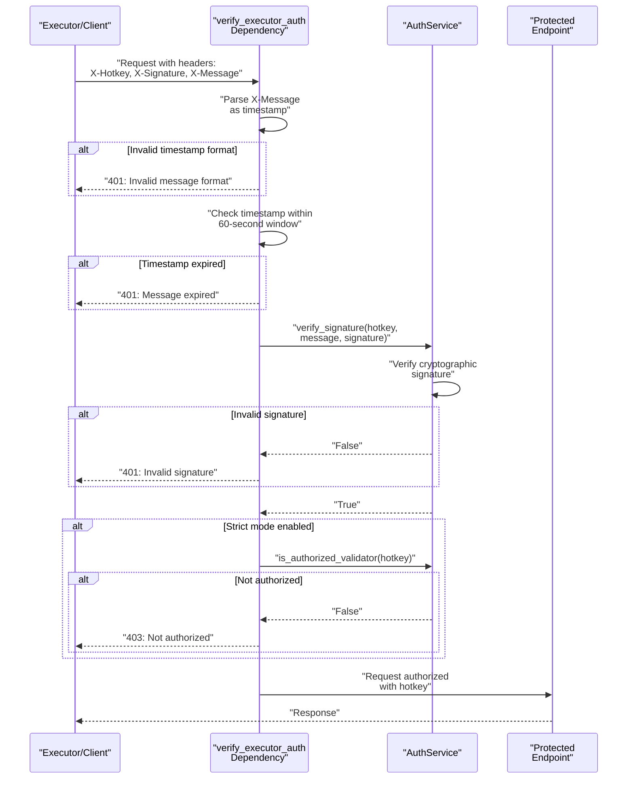
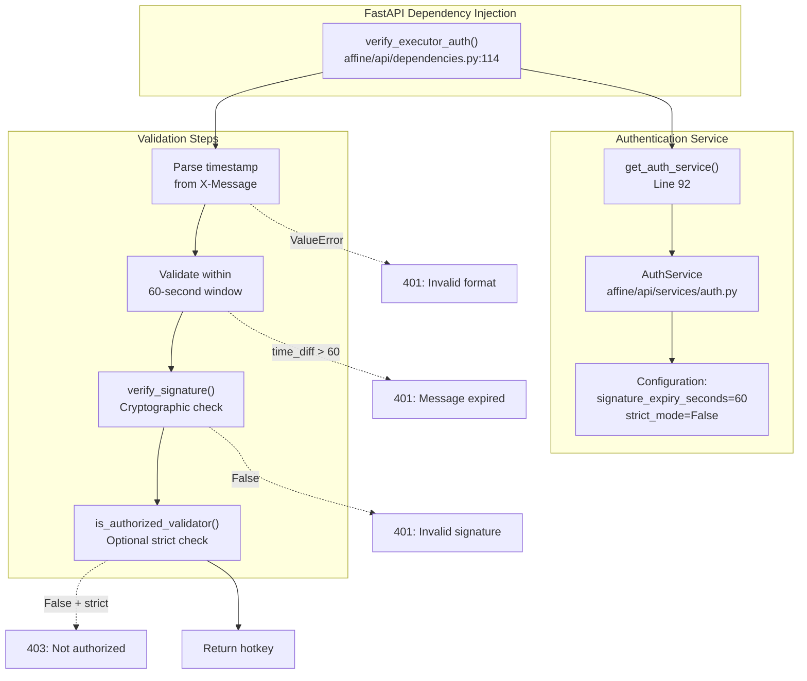
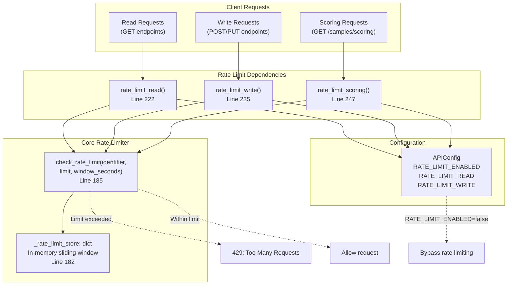
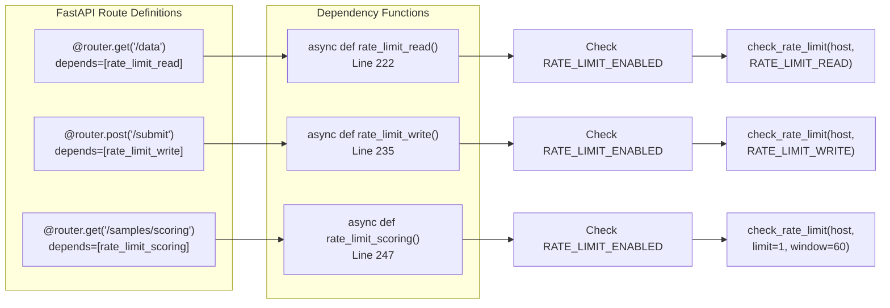

import CollapsibleAside from '../../../../components/CollapsibleAside.astro';
import SourceLink from '../../../../components/SourceLink.astro';
import Table from '../../../../components/Table.astro';

<CollapsibleAside title="Relevant Source Files">
  <SourceLink text="affine/api/dependencies.py" href="https://github.com/AffineFoundation/affine-cortex/blob/main/affine/api/dependencies.py" />
  <SourceLink text="affine/database/dao/__init__.py" href="https://github.com/AffineFoundation/affine-cortex/blob/main/affine/database/dao/__init__.py" />
  <SourceLink text="affine/database/dao/execution_logs.py" href="https://github.com/AffineFoundation/affine-cortex/blob/main/affine/database/dao/execution_logs.py" />
  <SourceLink text="affine/database/dao/sample_results.py" href="https://github.com/AffineFoundation/affine-cortex/blob/main/affine/database/dao/sample_results.py" />
  <SourceLink text="affine/database/schema.py" href="https://github.com/AffineFoundation/affine-cortex/blob/main/affine/database/schema.py" />
  <SourceLink text="affine/database/tables.py" href="https://github.com/AffineFoundation/affine-cortex/blob/main/affine/database/tables.py" />
  <SourceLink text="compose/docker-compose.backend.yml" href="https://github.com/AffineFoundation/affine-cortex/blob/main/compose/docker-compose.backend.yml" />
</CollapsibleAside>

This document describes the authentication and rate limiting mechanisms that protect the Affine API from unauthorized access and abuse. Authentication ensures that only authorized validators can submit task results, while rate limiting prevents excessive requests from degrading system performance.

For information about API endpoints and their usage patterns, see [REST API Endpoints](/subnets/api-reference/rest-api-endpoints#13.1). For details on the broader API service architecture, see [API Service](/subnets/backend-services-deep-dive/api-service#11.1).

---

## Overview

The Affine API implements two key security mechanisms:

1. **Header-Based Authentication**: Timestamp-signed authentication using Bittensor keypairs to verify executor identity
2. **Three-Tier Rate Limiting**: Configurable request throttling with specialized limits for read, write, and scoring operations

Both systems are implemented as FastAPI dependencies that can be selectively applied to endpoints and disabled for development environments.

**Sources:** [affine/api/dependencies.py:1-264]()

---

## Authentication System

### Authentication Flow

The authentication system uses cryptographic signatures to verify that API requests originate from authorized validators. The flow prevents replay attacks through timestamp validation and ensures data integrity through signature verification.



**Title:** Authentication Request Flow

**Sources:** [affine/api/dependencies.py:114-180]()

---

### Authentication Headers

Every authenticated request must include three HTTP headers:

<Table>

| Header | Description | Format |
|--------|-------------|--------|
| `X-Hotkey` | Executor's Bittensor hotkey | String (SS58 address) |
| `X-Signature` | Cryptographic signature of message | Hex-encoded signature |
| `X-Message` | Unix timestamp at signature time | Integer string (seconds) |

</Table>


The timestamp in `X-Message` must be within **60 seconds** of the server's current time to prevent replay attacks. The signature must be generated by signing the timestamp string with the private key corresponding to `X-Hotkey`.

**Sources:** [affine/api/dependencies.py:115-117](), [affine/api/dependencies.py:149-157]()

---

### Authentication Implementation



**Title:** Authentication Code Architecture

The authentication system is implemented in [affine/api/dependencies.py:114-180]() as a FastAPI dependency function. Key implementation details:

1. **Timestamp Validation** [141-157](): Parses `X-Message` as integer timestamp and validates it's within 60 seconds of current time
2. **Signature Verification** [160-164](): Delegates to `AuthService.verify_signature()` for cryptographic validation
3. **Authorization Check** [173-178](): Optional strict mode validates hotkey is in authorized validators set
4. **Error Handling**: Returns HTTP 401 for authentication failures, HTTP 403 for authorization failures

The `AuthService` singleton is created with non-strict mode by default [95-102](), allowing any valid signature to pass. In production, validators should initialize with a list of authorized validator hotkeys from the blockchain.

**Sources:** [affine/api/dependencies.py:92-103](), [affine/api/dependencies.py:114-180]()

---

### Signature Storage for Data Integrity

Authenticated sample submissions include the signature in the stored data for audit trail purposes. When the executor submits task results via `save_sample()`, the signature is stored in the `sample_results` table:

```python
# From save_sample method signature
signature: str  # Line 74
# ...
item = {
    # ...
    'signature': signature,  # Line 124
    # ...
}
```

This allows future verification that results were submitted by the claimed validator, creating an immutable audit trail.

**Sources:** [affine/database/dao/sample_results.py:62-128]()

---

## Rate Limiting System

### Three-Tier Rate Limit Architecture

The API implements three distinct rate limiting tiers based on endpoint sensitivity:



**Title:** Rate Limiting Architecture and Dependency Flow

**Sources:** [affine/api/dependencies.py:182-258]()

---

### Rate Limit Configuration

Rate limits are applied per client identifier (typically IP address) with sliding time windows:

<Table>

| Tier | Limit | Window | Configuration | Applied To |
|------|-------|--------|---------------|------------|
| **Read** | Configurable | 60 seconds | `config.RATE_LIMIT_READ` | GET endpoints |
| **Write** | Configurable | 60 seconds | `config.RATE_LIMIT_WRITE` | POST/PUT endpoints |
| **Scoring** | 1 request | 60 seconds | Hardcoded | `/samples/scoring` |

</Table>


The scoring endpoint has the strictest limit (1 request per minute, hardcoded) because it returns computationally expensive aggregated data used for weight calculation. This prevents abuse while allowing legitimate periodic polling by scorer services.

**Configuration Options:**
- `API_RATE_LIMIT_ENABLED=false` - Disables all rate limiting (default in production)
- `RATE_LIMIT_READ` - Max read requests per 60-second window
- `RATE_LIMIT_WRITE` - Max write requests per 60-second window

**Sources:** [affine/api/dependencies.py:222-258](), [compose/docker-compose.backend.yml:17]()

---

### Rate Limiting Algorithm

The rate limiting implementation uses a sliding window algorithm stored in memory:

```python
_rate_limit_store: dict = {}  # Line 182

def check_rate_limit(
    identifier: str,
    limit: int,
    window_seconds: int = 60,
) -> bool:
    """
    Check if rate limit is exceeded.
    
    Returns:
        True if within limit, False if exceeded
    """
    current_time = int(time.time())
    window_start = current_time - window_seconds
    
    # Get or create request history
    if identifier not in _rate_limit_store:
        _rate_limit_store[identifier] = []
    
    # Remove old requests outside the window
    _rate_limit_store[identifier] = [
        ts for ts in _rate_limit_store[identifier] if ts > window_start
    ]
    
    # Check if limit is exceeded
    if len(_rate_limit_store[identifier]) >= limit:
        return False
    
    # Add current request
    _rate_limit_store[identifier].append(current_time)
    return True
```

**Algorithm Characteristics:**
1. **Sliding Window**: Only requests within the time window count toward the limit
2. **Per-Identifier**: Each client (IP address) has independent rate limits
3. **In-Memory Storage**: Fast access but resets on service restart
4. **Automatic Cleanup**: Old timestamps are pruned on each check

**Sources:** [affine/api/dependencies.py:182-219]()

---

### Rate Limit Dependencies

Each rate limiting tier is implemented as a FastAPI dependency that can be applied to endpoints:



**Title:** Rate Limiting Dependency Implementation

The dependencies extract the client identifier from `request.client.host` and call `check_rate_limit()` with tier-specific parameters. If rate limiting is disabled via configuration, the dependencies return immediately without checking limits.

**Scoring Endpoint Special Case:**
The scoring endpoint uses hardcoded values (`limit=1, window_seconds=60`) [254]() instead of reading from configuration, ensuring strict control over this computationally expensive endpoint regardless of other settings.

**Sources:** [affine/api/dependencies.py:222-258]()

---

## Development vs Production Configuration

Rate limiting behavior differs between environments:

### Production Configuration

```yaml
# compose/docker-compose.backend.yml
api:
  environment:
    - API_RATE_LIMIT_ENABLED=false  # Line 17
```

Rate limiting is **disabled by default** in production deployments. This is because:
1. The Affine network has a limited number of validators (max 256)
2. Validators are authenticated via signatures, providing security
3. Rate limiting could interfere with legitimate executor workers
4. The system is designed for high-throughput task execution

**Sources:** [compose/docker-compose.backend.yml:14-18]()

### Development Configuration

For local development and testing, rate limiting can be enabled to simulate production-like conditions and test rate limit handling:

```python
# In .env or environment variables
API_RATE_LIMIT_ENABLED=true
RATE_LIMIT_READ=100
RATE_LIMIT_WRITE=50
```

---

## Error Responses

Both authentication and rate limiting return standard HTTP error responses:

<Table>

| Status Code | Condition | Response |
|-------------|-----------|----------|
| **401 Unauthorized** | Invalid timestamp format | `{"detail": "Invalid message format: expected timestamp"}` |
| **401 Unauthorized** | Timestamp outside 60s window | `{"detail": "Message expired (timestamp diff: Xs, max: 60s)"}` |
| **401 Unauthorized** | Invalid signature | `{"detail": "Invalid executor signature"}` |
| **403 Forbidden** | Unauthorized validator (strict mode) | `{"detail": "Executor not authorized"}` |
| **429 Too Many Requests** | Rate limit exceeded | `{"detail": "Rate limit exceeded"}` |
| **429 Too Many Requests** | Scoring endpoint limit exceeded | `{"detail": "Rate limit exceeded for scoring endpoint (1 request per minute)"}` |

</Table>


**Sources:** [affine/api/dependencies.py:144-178](), [affine/api/dependencies.py:229-258]()

---

## Integration with API Endpoints

Authentication and rate limiting are applied via FastAPI's dependency injection system. Example endpoint usage:

```python
@router.post("/tasks/submit")
async def submit_task_result(
    result: TaskResult,
    executor_hotkey: str = Depends(verify_executor_auth),  # Authentication
    _: None = Depends(rate_limit_write),  # Rate limiting
    dao: SampleResultsDAO = Depends(get_sample_results_dao),
):
    """Submit a completed task result (authenticated + rate limited)."""
    # executor_hotkey is validated by verify_executor_auth
    # rate_limit_write ensures write throughput limits
    await dao.save_sample(
        validator_hotkey=executor_hotkey,
        signature=result.signature,
        # ... other fields
    )
```

This pattern allows fine-grained control over which endpoints require authentication, which require rate limiting, and which tier of rate limiting applies.

**Sources:** [affine/api/dependencies.py:114-258]()

---

## Related Components

- **AuthService**: Implements signature verification logic (referenced but not shown in provided files)
- **Task Submission**: Requires authentication via `verify_executor_auth` dependency
- **Score Snapshot API**: Protected by strict scoring rate limits
- **Configuration**: Rate limiting can be toggled via environment variables

For API endpoint documentation including which endpoints use these dependencies, see [REST API Endpoints](/subnets/api-reference/rest-api-endpoints#13.1).
