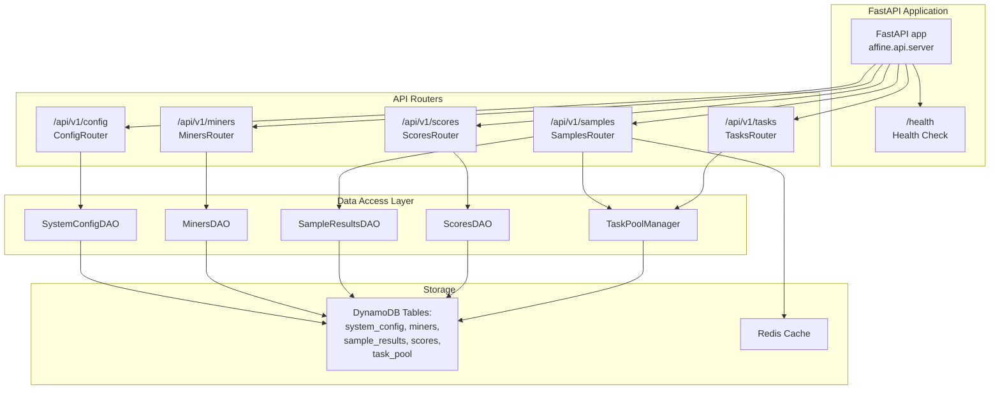
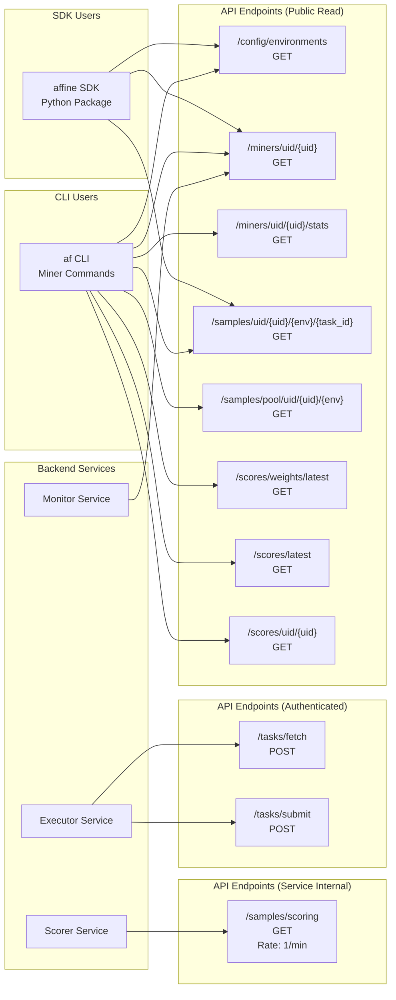

import CollapsibleAside from '../../../../components/CollapsibleAside.astro';
import SourceLink from '../../../../components/SourceLink.astro';
import Table from '../../../../components/Table.astro';

<CollapsibleAside title="Relevant Source Files">
  <SourceLink text="affine/api/routers/samples.py" href="https://github.com/AffineFoundation/affine-cortex/blob/main/affine/api/routers/samples.py" />
  <SourceLink text="affine/cli/main.py" href="https://github.com/AffineFoundation/affine-cortex/blob/main/affine/cli/main.py" />
  <SourceLink text="affine/cli/types.py" href="https://github.com/AffineFoundation/affine-cortex/blob/main/affine/cli/types.py" />
  <SourceLink text="affine/src/miner/commands.py" href="https://github.com/AffineFoundation/affine-cortex/blob/main/affine/src/miner/commands.py" />
  <SourceLink text="affine/src/miner/main.py" href="https://github.com/AffineFoundation/affine-cortex/blob/main/affine/src/miner/main.py" />
</CollapsibleAside>

This document provides comprehensive documentation of all REST API endpoints exposed by the Affine API service. The API serves as the central gateway for service-to-service communication, SDK integration, and CLI operations.

For authentication mechanisms and rate limiting policies, see [Authentication & Rate Limiting](/subnets/api-reference/authentication-rate-limiting#13.2). For the API service architecture and implementation details, see [API Service](/subnets/backend-services-deep-dive/api-service#11.1).

---

## API Service Overview

The Affine API service exposes RESTful HTTP endpoints organized into five functional domains:

- **Config** - System configuration and environment definitions
- **Miners** - Miner metadata, validation status, and statistics
- **Samples** - Sample results, task pools, and scoring data
- **Scores** - Weight calculations and scoring snapshots
- **Tasks** - Task allocation and result submission

The API runs on port 8000 by default and is deployed as a Docker container with health check monitoring at `/health`.

**Sources:** [affine/cli/main.py:72-88](), [affine/api/routers/samples.py:1-344]()

---

## API Router Architecture



**Sources:** [affine/api/routers/samples.py:27]()

---

## Endpoint Reference by Domain

### Config Endpoints

Configuration endpoints provide access to system-wide parameters including environment definitions, blacklists, and sampling configurations.

<Table>

| HTTP Method | Endpoint | Auth Required | Rate Limit | Purpose |
|-------------|----------|---------------|------------|---------|
| `GET` | `/api/v1/config/environments` | No | Read | Get all environment configurations |

</Table>


#### GET /config/environments

Returns all environment configurations from `system_config` table.

**Query Parameters:** None

**Response Format:**
```json
{
  "affine:sat": {
    "sampling_config": {
      "sampling_count": 100,
      "sampling_list": [1, 2, 3, ...]
    },
    "scoring_config": {...},
    "enabled": true
  },
  "agentgym:alfworld": {...},
  ...
}
```

**Example:**
```bash
curl http://localhost:8000/api/v1/config/environments
```

**Sources:** [affine/src/miner/commands.py:643-655](), [affine/api/routers/samples.py:116-117]()

---

### Miners Endpoints

Miner endpoints provide access to miner metadata, validation status, and sampling statistics.

<Table>

| HTTP Method | Endpoint | Auth Required | Rate Limit | Purpose |
|-------------|----------|---------------|------------|---------|
| `GET` | `/api/v1/miners/uid/{uid}` | No | Read | Get miner info by UID |
| `GET` | `/api/v1/miners/uid/{uid}/stats` | No | Read | Get miner sampling statistics |

</Table>


#### GET /miners/uid/&#123;uid&#125;

Returns complete miner information including hotkey, model, revision, chute_id, validation status, and timestamps.

**Path Parameters:**
- `uid` (integer): Miner UID (0-255, or negative for system miners)

**Response Format:**
```json
{
  "uid": 42,
  "hotkey": "5F3sa2TJ...",
  "model": "username/model-name",
  "revision": "abc123def456...",
  "chute_id": "550e8400-e29b-41d4-a716-446655440000",
  "is_valid": true,
  "model_hash": "sha256:...",
  "first_block": 1234567,
  "last_updated": "2025-01-15T10:30:00Z"
}
```

**Example:**
```bash
curl http://localhost:8000/api/v1/miners/uid/42
```

**Sources:** [affine/src/miner/commands.py:486-497]()

#### GET /miners/uid/&#123;uid&#125;/stats

Returns sampling statistics across multiple time windows (15 minutes, 1 hour, 6 hours, 24 hours).

**Path Parameters:**
- `uid` (integer): Miner UID

**Response Format:**
```json
{
  "sampling_stats": {
    "last_15min": {
      "samples": 10,
      "success": 9,
      "success_rate": 0.9,
      "samples_per_min": 0.67,
      "rate_limit_errors": 0,
      "timeout_errors": 1,
      "other_errors": 0
    },
    "last_1hour": {...},
    "last_6hours": {...},
    "last_24hours": {...}
  },
  "env_stats": {
    "affine:sat": {
      "last_15min": {...},
      ...
    },
    ...
  }
}
```

**Sources:** [affine/src/miner/commands.py:498-544]()

---

### Samples Endpoints

Sample endpoints provide access to completed task results, task pool status, and scoring data aggregation.

<Table>

| HTTP Method | Endpoint | Auth Required | Rate Limit | Purpose |
|-------------|----------|---------------|------------|---------|
| `GET` | `/api/v1/samples/{hotkey}/{env}/{task_id}?model_revision=...` | No | Read | Get sample by hotkey (natural key) |
| `GET` | `/api/v1/samples/uid/{uid}/{env}/{task_id}` | No | Read | Get sample by UID (auto-resolves hotkey) |
| `GET` | `/api/v1/samples/scoring?range_type=...` | No | Scoring (1/min) | Get scoring data for all valid miners |
| `GET` | `/api/v1/samples/pool/uid/{uid}/{env}` | No | Read | Get task pool status for miner |

</Table>


#### GET /samples/&#123;hotkey&#125;/&#123;env&#125;/&#123;task_id&#125;

Retrieves a specific sample using the natural composite key. Returns data from `sample_results` if completed, otherwise queries `task_pool` for pending tasks.

**Path Parameters:**
- `hotkey` (string): Miner hotkey (SS58 address)
- `env` (string): Environment name (e.g., `affine:sat`)
- `task_id` (string): Task identifier

**Query Parameters:**
- `model_revision` (string, required): Model revision SHA

**Response Format (completed sample):**
```json
{
  "miner_hotkey": "5F3sa2TJ...",
  "model_revision": "abc123...",
  "env": "affine:sat",
  "task_id": "task_001",
  "score": 0.85,
  "latency_seconds": 12.5,
  "conversation": [...],
  "extra": {...},
  "timestamp": "2025-01-15T10:30:00Z"
}
```

**Response Format (pending task):**
```json
{
  "miner_hotkey": "5F3sa2TJ...",
  "model_revision": "abc123...",
  "env": "affine:sat",
  "task_id": 123,
  "status": "pending",
  "created_at": "2025-01-15T10:30:00Z",
  "retry_count": 0
}
```

**Sources:** [affine/api/routers/samples.py:30-89]()

#### GET /samples/uid/&#123;uid&#125;/&#123;env&#125;/&#123;task_id&#125;

Convenience endpoint that auto-resolves the miner's current hotkey and revision from the UID.

**Path Parameters:**
- `uid` (integer): Miner UID
- `env` (string): Environment name (supports shorthand, e.g., `sat` → `affine:sat`)
- `task_id` (string): Task identifier

**Environment Name Resolution:**
The endpoint supports shorthand environment names. If `env` doesn't contain a colon and isn't found directly, it attempts to match as a suffix (e.g., `alfworld` matches `agentgym:alfworld`). Returns 400 if ambiguous.

**Response Format:** Same as `/samples/{hotkey}/{env}/{task_id}`

**Example:**
```bash
# Full environment name
curl http://localhost:8000/api/v1/samples/uid/42/affine:sat/task_001

# Shorthand (auto-resolves to affine:sat)
curl http://localhost:8000/api/v1/samples/uid/42/sat/task_001
```

**Sources:** [affine/api/routers/samples.py:92-188](), [affine/src/miner/commands.py:465-484]()

#### GET /samples/scoring

Retrieves aggregated scoring data for all valid miners. This endpoint uses a proactive cache with background refresh every 20 minutes.

**Query Parameters:**
- `range_type` (string, optional): `"scoring"` or `"sampling"` (default: `"scoring"`)

**Rate Limiting:**
This endpoint has strict rate limiting (1 request per minute) via `rate_limit_scoring` dependency to prevent abuse by the scorer service.

**Response Format:**
```json
{
  "uid_1": {
    "samples": {
      "affine:sat": [
        {
          "task_id": "task_001",
          "score": 0.85,
          "latency_seconds": 12.5,
          ...
        },
        ...
      ],
      ...
    },
    "metadata": {
      "hotkey": "5F3sa2TJ...",
      "model": "username/model",
      ...
    }
  },
  ...
}
```

**Cache Behavior:**
- Startup: Cache prewarmed during API initialization
- Runtime: Background refresh every 20 minutes
- Access: Always returns hot cache (&lt; 100ms response time)

**Sources:** [affine/api/routers/samples.py:191-218]()

#### GET /samples/pool/uid/&#123;uid&#125;/&#123;env&#125;

Returns task pool status for a specific miner in an environment, showing which tasks are completed, pending, or missing.

**Path Parameters:**
- `uid` (integer): Miner UID
- `env` (string): Environment name (supports shorthand)

**Response Format:**
```json
{
  "uid": 42,
  "hotkey": "5F3sa2TJ...",
  "model_revision": "abc123...",
  "env": "affine:sat",
  "sampling_config": {
    "sampling_count": 100,
    "sampling_list": [1, 2, 3, ...]
  },
  "total_tasks": 100,
  "sampled_count": 45,
  "pool_count": 30,
  "missing_count": 25,
  "sampled_task_ids": [1, 2, 3, ...],
  "pool_task_ids": [46, 47, 48, ...],
  "missing_task_ids": [76, 77, 78, ...]
}
```

**Task ID Categories:**
- `sampled_task_ids`: Completed tasks in `sample_results`
- `pool_task_ids`: Tasks currently in `task_pool` (pending/assigned)
- `missing_task_ids`: Tasks from `sampling_list` not yet in pool or results

**Sources:** [affine/api/routers/samples.py:221-343](), [affine/src/miner/commands.py:590-641]()

---

### Scores Endpoints

Score endpoints provide access to calculated weights, scoring snapshots, and per-miner score details.

<Table>

| HTTP Method | Endpoint | Auth Required | Rate Limit | Purpose |
|-------------|----------|---------------|------------|---------|
| `GET` | `/api/v1/scores/weights/latest` | No | Read | Get latest normalized weights for on-chain setting |
| `GET` | `/api/v1/scores/latest?top=N` | No | Read | Get latest scores for top N miners |
| `GET` | `/api/v1/scores/uid/{uid}` | No | Read | Get score details for specific miner |

</Table>


#### GET /scores/weights/latest

Returns the most recent score snapshot with normalized weights suitable for setting on-chain via `set_weights()`.

**Query Parameters:** None

**Response Format:**
```json
{
  "block": 1234567,
  "timestamp": "2025-01-15T10:30:00Z",
  "weights": {
    "0": 0.0234,
    "1": 0.0189,
    "42": 0.0456,
    ...
  },
  "config": {
    "min_threshold": 0.01,
    ...
  }
}
```

**Sources:** [affine/src/miner/commands.py:548-560]()

#### GET /scores/latest

Returns top N miners by score from the latest scoring calculation.

**Query Parameters:**
- `top` (integer, optional): Number of top miners to return (default: 32)

**Response Format:**
```json
{
  "block": 1234567,
  "timestamp": "2025-01-15T10:30:00Z",
  "scores": [
    {
      "uid": 42,
      "score": 0.0456,
      "scores_by_env": {
        "affine:sat": 0.85,
        "agentgym:alfworld": 0.72,
        ...
      },
      "scores_by_layer": {
        "L1": 0.78,
        "L2": 0.81,
        ...
      }
    },
    ...
  ]
}
```

**Sources:** [affine/src/miner/commands.py:562-574]()

#### GET /scores/uid/&#123;uid&#125;

Returns detailed score breakdown for a specific miner.

**Path Parameters:**
- `uid` (integer): Miner UID

**Response Format:**
```json
{
  "uid": 42,
  "score": 0.0456,
  "scores_by_env": {
    "affine:sat": 0.85,
    "agentgym:alfworld": 0.72,
    ...
  },
  "scores_by_layer": {
    "L1": 0.78,
    "L2": 0.81,
    "L3": 0.83,
    ...
  },
  "block": 1234567,
  "timestamp": "2025-01-15T10:30:00Z"
}
```

**Sources:** [affine/src/miner/commands.py:576-588]()

---

### Tasks Endpoints

Task endpoints handle task allocation and result submission for the executor service. These endpoints require authentication.

<Table>

| HTTP Method | Endpoint | Auth Required | Rate Limit | Purpose |
|-------------|----------|---------------|------------|---------|
| `POST` | `/api/v1/tasks/fetch` | Yes | Write | Fetch batch of pending tasks |
| `POST` | `/api/v1/tasks/submit` | Yes | Write | Submit completed task results |

</Table>


#### POST /tasks/fetch

Fetches a batch of pending tasks for execution. Tasks are randomly shuffled for fairness and marked as `assigned` to prevent double-execution.

**Authentication Required:** Yes (X-Hotkey, X-Signature)

**Request Body:**
```json
{
  "batch_size": 10,
  "worker_id": "worker_0"
}
```

**Response Format:**
```json
{
  "tasks": [
    {
      "miner_hotkey": "5F3sa2TJ...",
      "model_revision": "abc123...",
      "env": "affine:sat",
      "task_id": 123,
      "status": "assigned",
      "created_at": "2025-01-15T10:30:00Z"
    },
    ...
  ]
}
```

**Sources:** Referenced in [affine/cli/main.py:92-99]()

#### POST /tasks/submit

Submits completed task results to `sample_results` table and atomically deletes the task from `task_pool`.

**Authentication Required:** Yes (X-Hotkey, X-Signature)

**Request Body:**
```json
{
  "miner_hotkey": "5F3sa2TJ...",
  "model_revision": "abc123...",
  "env": "affine:sat",
  "task_id": 123,
  "score": 0.85,
  "latency_seconds": 12.5,
  "conversation": [...],
  "extra": {...}
}
```

**Response Format:**
```json
{
  "success": true,
  "message": "Task submitted successfully"
}
```

**Atomic Operations:**
1. Write to `sample_results` table with compression for `extra` field
2. Delete from `task_pool` using composite key (prevents duplicate execution)
3. Log to `execution_logs` with 7-day TTL

**Sources:** Referenced in [affine/cli/main.py:92-99]()

---

## Endpoint Organization by Consumer



**Sources:** [affine/src/miner/commands.py:465-655](), [affine/api/routers/samples.py:1-344]()

---

## Common Response Patterns

### Error Response Format

All endpoints return consistent error responses following FastAPI's HTTPException format:

```json
{
  "detail": "Error message describing what went wrong"
}
```

**Common HTTP Status Codes:**

<Table>

| Status Code | Meaning | Common Causes |
|-------------|---------|---------------|
| 400 | Bad Request | Invalid parameters, ambiguous environment name |
| 401 | Unauthorized | Missing or invalid authentication headers |
| 404 | Not Found | UID not found, environment not configured, sample not found |
| 429 | Too Many Requests | Rate limit exceeded |
| 500 | Internal Server Error | Database errors, unexpected exceptions |

</Table>


**Sources:** [affine/api/routers/samples.py:78-89]()

### Environment Name Resolution

Many endpoints support both full environment names and shorthand notation:

**Full Names:** `affine:sat`, `agentgym:alfworld`, `agentgym:webshop`

**Shorthand:** `sat`, `alfworld`, `webshop`

**Resolution Logic:**
1. Check if provided name exists in `environments` config
2. If not found and no colon present, search for suffix match
3. Return 404 if no match, 400 if multiple matches

**Sources:** [affine/api/routers/samples.py:116-138]()

### UID Parameter Support

UID parameters support negative values for system miners using the `n` prefix:

- `42` → UID 42
- `n1` → UID -1 (system miner)
- `n10` → UID -10

This is implemented via the custom `UIDParamType` click parameter type.

**Sources:** [affine/cli/types.py:8-54]()

---

## Query Parameter Reference

### Pagination and Filtering

Currently, the API does not implement pagination for list endpoints. The `/scores/latest` endpoint supports a `top` parameter for limiting results.

### Range Type Parameter

The `/samples/scoring` endpoint accepts a `range_type` query parameter:

- `range_type=scoring`: Use `scoring_range` from environment config
- `range_type=sampling`: Use `sampling_range` from environment config

This allows the scorer service to operate on different task subsets than what gets sampled.

**Sources:** [affine/api/routers/samples.py:191-218]()

---

## Rate Limiting Tiers

The API implements three-tier rate limiting via dependency injection:

<Table>

| Rate Limit Tier | Endpoints | Requests/Second | Purpose |
|-----------------|-----------|-----------------|---------|
| `rate_limit_read` | All public GET endpoints | Higher | General read access |
| `rate_limit_write` | `/tasks/fetch`, `/tasks/submit` | Moderate | Executor operations |
| `rate_limit_scoring` | `/samples/scoring` | 1 per 60 seconds | Scorer service protection |

</Table>


For detailed rate limiting implementation, see [Authentication & Rate Limiting](/subnets/api-reference/authentication-rate-limiting#13.2).

**Sources:** [affine/api/routers/samples.py:18-20]()

---

## Health Check Endpoint

### GET /health

The health check endpoint is used by Docker Compose for container health monitoring.

**Path:** `/health` (not under `/api/v1/` prefix)

**Authentication Required:** No

**Response Format:**
```json
{
  "status": "healthy"
}
```

**Docker Compose Configuration:**
```yaml
healthcheck:
  test: ["CMD", "curl", "-f", "http://localhost:8000/health"]
  interval: 60s
  timeout: 10s
  retries: 3
  start_period: 180s
```

**Sources:** Referenced in high-level diagrams
