import CollapsibleAside from '../../../components/CollapsibleAside.astro';
import SourceLink from '../../../components/SourceLink.astro';
import Table from '../../../components/Table.astro';

<CollapsibleAside title="Relevant Source Files">
  <SourceLink text="docker-compose.local.yml" href="https://github.com/AffineFoundation/affine-cortex/blob/main/docker-compose.local.yml" />
  <SourceLink text="docker-compose.yml" href="https://github.com/AffineFoundation/affine-cortex/blob/main/docker-compose.yml" />
  <SourceLink text="pyproject.toml" href="https://github.com/AffineFoundation/affine-cortex/blob/main/pyproject.toml" />
  <SourceLink text="uv.lock" href="https://github.com/AffineFoundation/affine-cortex/blob/main/uv.lock" />
</CollapsibleAside>

## Purpose and Scope

This document provides a comprehensive architectural overview of the six backend microservices that comprise the Affine Cortex validator infrastructure. It covers service topology, deployment patterns, inter-service communication, configuration management, and the orchestration layer that coordinates these services.

For detailed implementation specifics of individual services, see:
- API Service internals: [API Service](/subnets/backend-services-deep-dive/api-service#11.1)
- Monitor Service validation pipeline: [Monitor Service](/subnets/backend-services-deep-dive/monitor-service#11.2)
- Scheduler Service task allocation: [Scheduler Service](/subnets/backend-services-deep-dive/scheduler-service#11.3)
- Executor Service worker architecture: [Executor Service](/subnets/backend-services-deep-dive/executor-service#11.4)
- Scorer Service weight calculation: [Scorer Service](/subnets/backend-services-deep-dive/scorer-service#11.5)

For deployment configuration and scaling considerations, see [Docker Deployment](/subnets/deployment-guide/docker-deployment#10.1).

---

## Service Architecture Overview

The backend infrastructure consists of six independent microservices, each with a specific responsibility in the validator workflow. Services coordinate through a shared API gateway and DynamoDB database, with strict startup ordering to ensure proper initialization.

### Service Topology

```mermaid
graph TB
    subgraph "External Dependencies"
        BT["Bittensor Blockchain<br/>set_weights, metagraph"]
        ST["Subtensor Node<br/>block info, commitments"]
        HF["HuggingFace<br/>model inspection"]
        Chutes["Chutes Platform<br/>deployment status"]
    end
    
    subgraph "Data Layer"
        DB["DynamoDB<br/>8 Tables"]
        Redis["Redis Cache<br/>rate limiting"]
    end
    
    subgraph "Backend Services"
        API["affine.api<br/>FastAPI app<br/>Port 8000<br/>/health endpoint"]
        
        Monitor["affine.monitor<br/>MonitorService<br/>MinerValidator"]
        
        Scheduler["affine.scheduler<br/>SamplingScheduler<br/>PerMinerSamplingScheduler"]
        
        Executor["affine.executor<br/>ExecutorManager<br/>ExecutorWorker pool"]
        
        Scorer["affine.scorer<br/>ScorerService<br/>4-stage algorithm"]
        
        Validator["affine.validator<br/>ValidatorService<br/>WeightSetter"]
    end
    
    subgraph "Shared Resources"
        Wallets["~/.bittensor/wallets<br/>read-only mount"]
        DockerSock["/var/run/docker.sock<br/>affinetes runtime"]
        Logs["/var/log/affine/*<br/>persistent logs"]
    end
    
    API --> DB
    API --> Redis
    
    Monitor -->|"health_check()"| API
    Monitor --> DB
    Monitor --> HF
    Monitor --> Chutes
    Monitor --> ST
    Monitor --> Wallets
    
    Scheduler -->|"depends_on: api healthy"| API
    Scheduler --> DB
    
    Executor -->|"depends_on: api healthy"| API
    Executor --> DB
    Executor --> DockerSock
    
    Scorer -->|"depends_on: api healthy"| API
    Scorer --> DB
    Scorer --> ST
    
    Validator --> DB
    Validator --> BT
    Validator --> ST
    Validator --> Wallets
    Validator --> Logs


```

**Sources:** [docker-compose.yml:1-26](), [pyproject.toml:1-53]()

---

## Service Inventory

<Table>

| Service | Module Path | Primary Class | Port | External Dependencies | Purpose |
|---------|-------------|---------------|------|----------------------|---------|
| **API** | `affine.api` | `FastAPI()` | 8000 | DynamoDB, Redis | REST gateway for all service-to-service communication and external SDK access |
| **Monitor** | `affine.monitor` | `MonitorService`, `MinerValidator` | N/A | HuggingFace, Chutes, Subtensor | Discovers miners via metagraph, validates models, performs anti-plagiarism checks |
| **Scheduler** | `affine.scheduler` | `SamplingScheduler`, `PerMinerSamplingScheduler` | N/A | DynamoDB (via API) | Generates task assignments using weighted allocation and anti-starvation logic |
| **Executor** | `affine.executor` | `ExecutorManager`, `ExecutorWorker` | N/A | Docker socket, Affinetes | Executes tasks in isolated containers, manages worker pool |
| **Scorer** | `affine.scorer` | `ScorerService` | N/A | DynamoDB (via API), Subtensor | Implements 4-stage scoring algorithm with Pareto filtering |
| **Validator** | `affine.validator` | `ValidatorService`, `WeightSetter` | N/A | Bittensor blockchain, Subtensor | Sets on-chain weights based on scores |

</Table>


**Sources:** [pyproject.toml:41-42](), High-level system diagrams

---

## Deployment Architecture

### Docker Compose Configuration

Services are orchestrated using Docker Compose with two deployment modes: production and local development. The production configuration uses pre-built images, while local development builds from source.

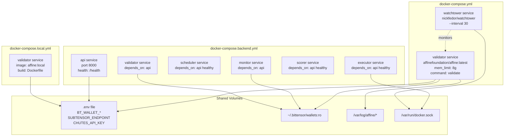

**Production Deployment:**
- Use: `docker compose -f docker-compose.yml up`
- Images pulled from `affinefoundation/affine:latest`
- Watchtower monitors and auto-updates every 30 seconds

**Local Development:**
- Use: `docker compose -f docker-compose.yml -f docker-compose.local.yml up --build`
- Builds from local Dockerfile
- Watchtower disabled via profile

**Sources:** [docker-compose.yml:1-26](), [docker-compose.local.yml:1-15]()

---

## Service Configuration Patterns

### Environment Variables

All services share a common configuration pattern using environment variables from the `.env` file, with service-specific overrides.

<Table>

| Variable Category | Examples | Used By | Purpose |
|------------------|----------|---------|---------|
| **Bittensor Credentials** | `BT_WALLET_COLD`, `BT_WALLET_HOT` | Monitor, Validator | Blockchain authentication |
| **Network Endpoints** | `SUBTENSOR_ENDPOINT`, `SUBTENSOR_CHAIN_ENDPOINT` | Monitor, Scorer, Validator | Bittensor network connection |
| **External APIs** | `CHUTES_API_KEY`, `HF_TOKEN` | Monitor | Platform access tokens |
| **Service Mode** | `SERVICE_MODE=true` | Scheduler, Scorer | Enable continuous loop execution |
| **API Configuration** | `API_URL=http://api:8000/api/v1` | Scheduler, Executor, Scorer | Internal service-to-service communication |
| **Database** | `DYNAMODB_*`, `REDIS_*` | API, All services (via API) | Data persistence configuration |
| **Scoring Parameters** | `SCORER_INTERVAL_MINUTES=60`, `SCORER_SAVE_TO_DB=true` | Scorer | Algorithm tuning |

</Table>


**Configuration Injection Pattern:**

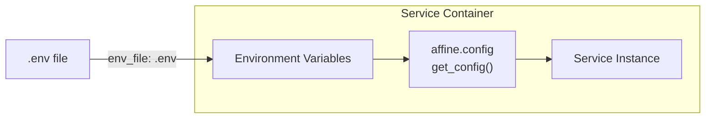

**Sources:** [docker-compose.yml:10-12](), High-level system diagrams

---

## Inter-Service Communication

### Dependency Chain

Services have explicit dependencies enforced through Docker Compose `depends_on` with health checks. This ensures proper initialization ordering and prevents race conditions.

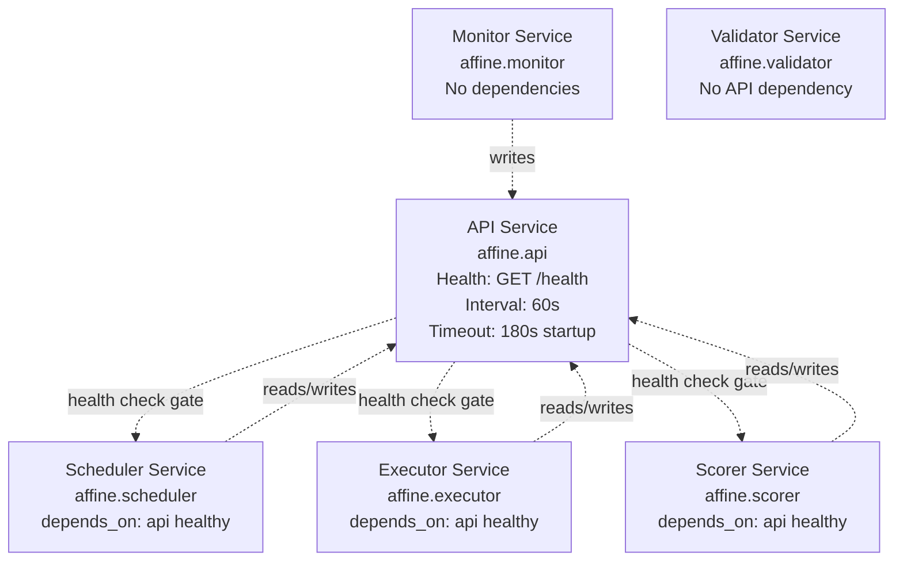

**Health Check Implementation:**

The API service exposes a `/health` endpoint that other services poll before starting their main loops. This ensures the database is initialized and connections are ready.

**Sources:** High-level system diagrams (Diagram 6)

---

## Service Communication Patterns

### Request Flow Through API Gateway

All inter-service data exchange flows through the API gateway, which provides unified access to the database layer, authentication, and rate limiting.

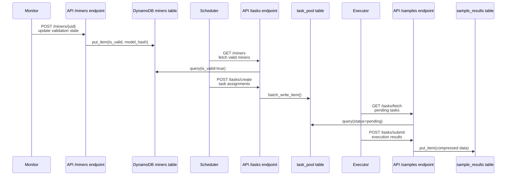

**API Router Organization:**

<Table>

| Router Module | Endpoints | Primary DAO | Purpose |
|--------------|-----------|-------------|---------|
| `affine.api.routers.miners` | `/miners/*` | `MinersDAO` | Miner metadata and validation state |
| `affine.api.routers.tasks` | `/tasks/*` | `TaskPoolDAO` | Task creation, fetching, submission |
| `affine.api.routers.samples` | `/samples/*` | `SampleResultsDAO` | Completed task results |
| `affine.api.routers.scores` | `/scores/*` | `ScoresDAO` | Weight calculations and snapshots |
| `affine.api.routers.config` | `/config/*` | `SystemConfigDAO` | Environment and system parameters |

</Table>


**Sources:** High-level system diagrams (Diagram 4)

---

## Service Lifecycle Management

### Startup Sequence

The initialization order is critical to prevent data corruption and ensure all dependencies are available when services start their main loops.

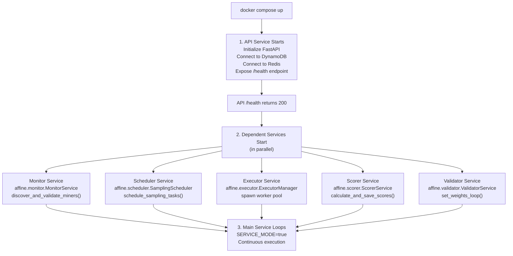

**Startup Grace Period:**

The API service has a 180-second startup grace period configured in Docker Compose health checks, allowing sufficient time for database initialization and connection establishment.

**Sources:** High-level system diagrams (Diagram 6)

---

## Code Structure Mapping

### Service Entry Points

Each service has a consistent entry point structure that can be invoked via the CLI or directly in Docker containers.

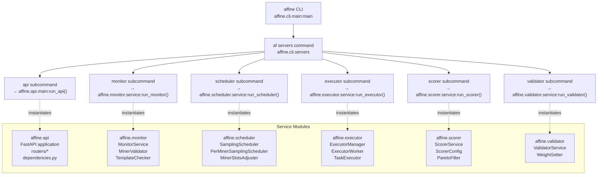

**CLI Script Definition:**

The `af` command is registered in `pyproject.toml` as:
```
[project.scripts]
af = "affine.cli.main:main"
```

This allows invoking services via:
- `af servers api`
- `af servers monitor`
- `af servers scheduler`
- `af servers executor`
- `af servers scorer`
- `af validate` (validator service)

**Sources:** [pyproject.toml:41-42]()

---

## Database Access Patterns

### Data Access Object (DAO) Layer

All services interact with DynamoDB through a consistent DAO abstraction layer, preventing direct table access and ensuring proper connection pooling.

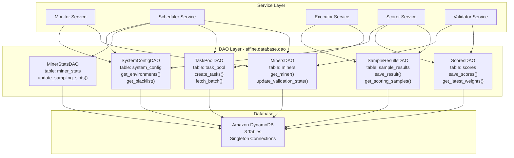

**Connection Pooling:**

DAOs are instantiated as singletons in the API service using FastAPI dependency injection. Services accessing the API inherit these pooled connections, preventing connection exhaustion.

**Sources:** High-level system diagrams (Diagram 3)

---

## Resource Management

### Shared Resource Access

Services require access to various host resources through Docker volume mounts. Access permissions are carefully controlled to maintain security.

<Table>

| Resource | Mount Path | Access Mode | Used By | Purpose |
|----------|-----------|-------------|---------|---------|
| **Bittensor Wallets** | `~/.bittensor/wallets:/root/.bittensor/wallets` | `ro` (read-only) | Monitor, Validator | Blockchain signing |
| **Docker Socket** | `/var/run/docker.sock:/var/run/docker.sock` | `rw` (read-write) | Executor | Container orchestration via Affinetes |
| **Log Volumes** | `/var/log/affine/*` | `rw` (read-write) | Validator, API | Persistent logging |
| **Environment File** | `.env` | `ro` (env_file) | All services | Configuration injection |

</Table>


**Security Considerations:**

- Wallet mounts are read-only to prevent accidental modification
- Docker socket access is restricted to Executor service only
- Watchtower has Docker socket access for image updates but runs with `restart: unless-stopped` to prevent excessive restarts

**Sources:** [docker-compose.yml:14-16](), High-level system diagrams (Diagram 6)

---

## Service Restart Policies

All services are configured with `restart: unless-stopped`, ensuring automatic recovery from crashes while allowing manual intervention when needed.

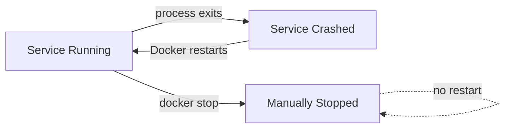

**Restart Policy Implications:**

- Services automatically recover from transient failures
- Manual stops (via `docker stop` or `docker compose down`) are respected
- System reboots automatically restart all services
- Watchtower can safely update and restart containers

**Sources:** [docker-compose.yml:7]()

---

## Monitoring and Observability

### Log Aggregation

Services write structured logs to both stdout (captured by Docker) and persistent volume mounts for long-term analysis.

**Log Locations:**
- **Container stdout:** Captured by Docker, viewable via `docker logs`
- **Persistent logs:** `/var/log/affine/validator/` for Validator service
- **API logs:** Managed by FastAPI/Uvicorn, includes request/response cycles

### Health Monitoring

The API service health endpoint provides a simple liveness check:

```
GET http://api:8000/health
Response: 200 OK
```

Other services do not expose health endpoints directly but can be monitored via:
- Docker container status (`docker ps`)
- Database activity (DynamoDB CloudWatch metrics)
- Log output volume

**Sources:** [docker-compose.yml:16](), High-level system diagrams (Diagram 6)

---

## Memory and Resource Limits

### Configured Limits

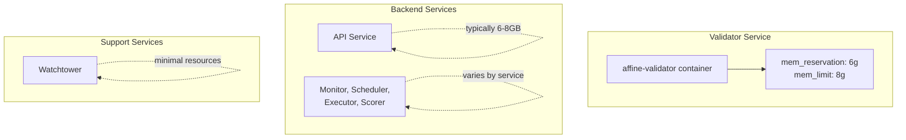

**Memory Configuration:**

The Validator service has explicit memory limits:
- **Reservation:** 6GB (guaranteed minimum)
- **Limit:** 8GB (hard maximum)

Other backend services in `docker-compose.backend.yml` have service-specific limits configured separately. These limits should be tuned based on:
- Number of concurrent executor workers
- Scoring sample size and batch processing
- API request volume and caching strategy

**Sources:** [docker-compose.yml:8-9]()

---

## Auto-Update Mechanism

### Watchtower Integration

The Watchtower service monitors containers and automatically pulls and restarts services when new images are available.

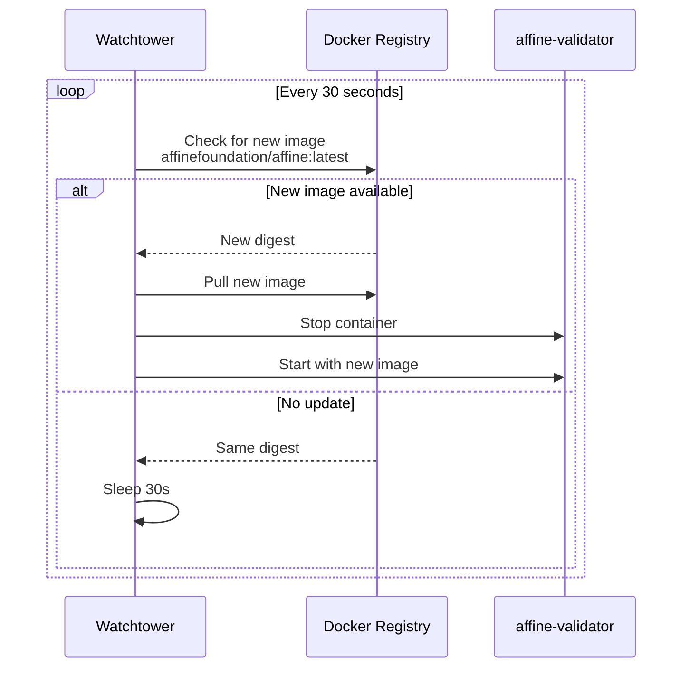

**Watchtower Configuration:**

```
watchtower:
  image: nickfedor/watchtower
  command: --interval 30 affine-validator
  volumes:
    - /var/run/docker.sock:/var/run/docker.sock
```

- **Interval:** 30 seconds
- **Monitored container:** `affine-validator` (explicitly specified)
- **Scope:** Only monitors validator in production, disabled in local development via profiles

**Zero-Downtime Updates:**

While Watchtower performs a stop-start cycle, the brief downtime is acceptable for validator services. For production deployments requiring true zero-downtime:
1. Run multiple validator replicas
2. Use rolling updates with orchestration tools (Kubernetes, Swarm)
3. Implement load balancing across replicas

**Sources:** [docker-compose.yml:19-25](), [docker-compose.local.yml:13-15]()

---

## Common Service Patterns

### Service Mode Flag

Services support two execution modes controlled by the `SERVICE_MODE` environment variable:

<Table>

| Mode | `SERVICE_MODE` | Behavior | Use Case |
|------|---------------|----------|----------|
| **One-shot** | `false` or unset | Execute once and exit | Testing, manual runs via CLI |
| **Continuous** | `true` | Loop indefinitely with intervals | Production deployment |

</Table>


**Implementation Pattern:**

```python
# Typical service main loop structure
while SERVICE_MODE:
    execute_task()
    sleep(INTERVAL)
    
if not SERVICE_MODE:
    execute_task()
    exit(0)
```

**Sources:** [docker-compose.yml:13]()

---

## Summary

The Affine backend services architecture provides:

1. **Separation of Concerns:** Six independent services with clear responsibilities
2. **Dependency Management:** Health-check-based startup ordering prevents race conditions
3. **Unified Data Access:** API gateway provides consistent interface to database layer
4. **Resource Isolation:** Docker containers with explicit memory limits and volume mounts
5. **Automatic Updates:** Watchtower ensures services run latest code
6. **Configuration Flexibility:** Environment-based configuration supports multiple deployment modes
7. **Observability:** Structured logging and health checks enable monitoring

For implementation details of each service's internal logic, algorithms, and data processing pipelines, refer to the individual service documentation pages ([11.1](#11.1) - [11.5](#11.5)).

**Sources:** All sections above, High-level system diagrams (Complete system topology, Service orchestration and deployment)
