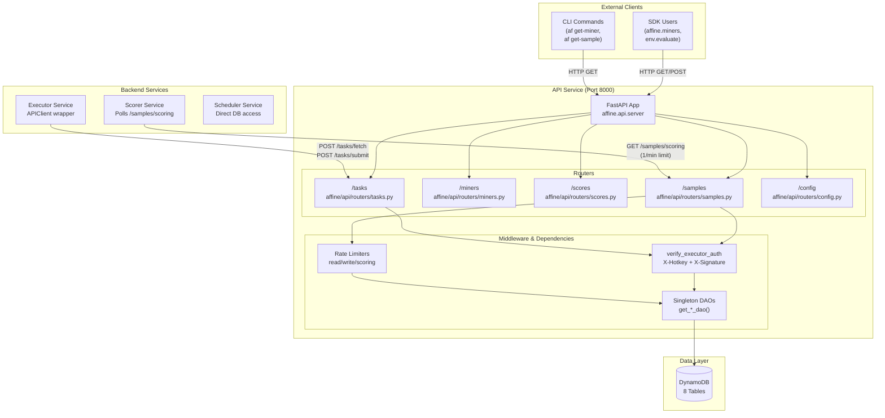
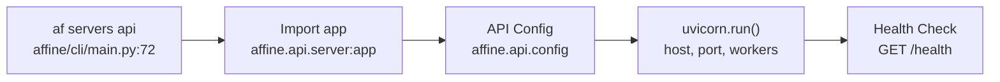
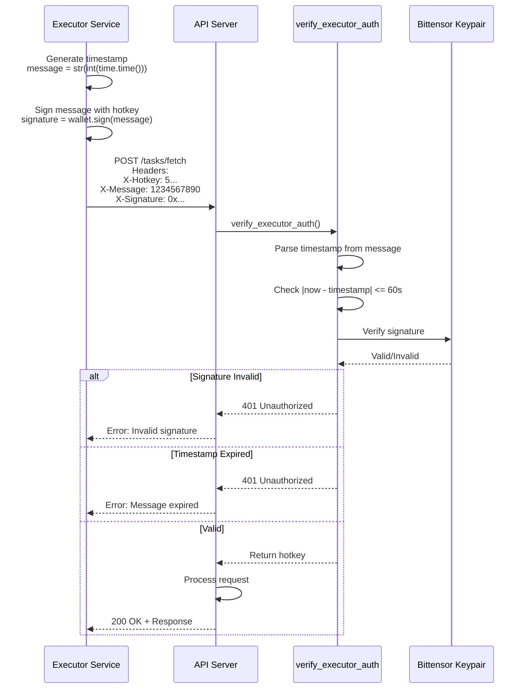
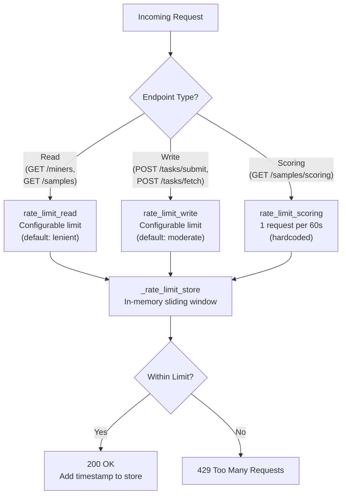
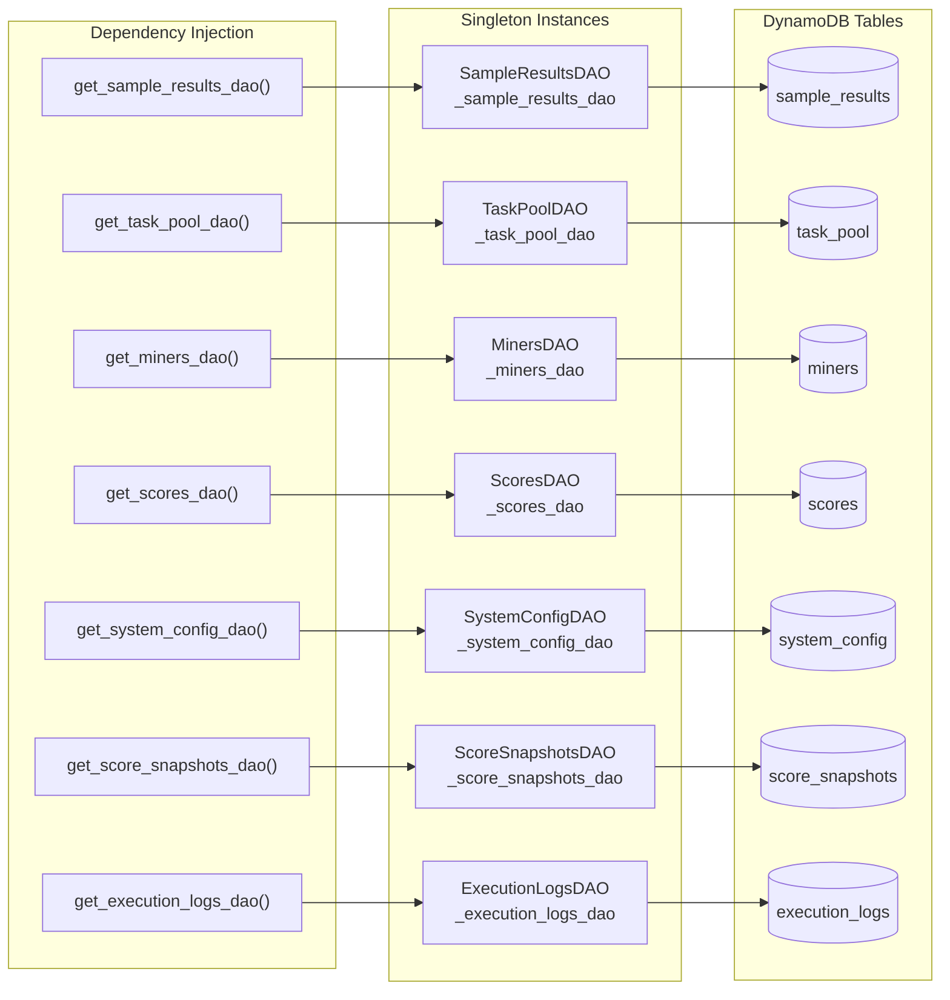

import CollapsibleAside from '../../../../components/CollapsibleAside.astro';
import SourceLink from '../../../../components/SourceLink.astro';
import Table from '../../../../components/Table.astro';

<CollapsibleAside title="Relevant Source Files">
  <SourceLink text="affine/api/dependencies.py" href="https://github.com/AffineFoundation/affine-cortex/blob/main/affine/api/dependencies.py" />
  <SourceLink text="affine/api/routers/samples.py" href="https://github.com/AffineFoundation/affine-cortex/blob/main/affine/api/routers/samples.py" />
  <SourceLink text="affine/cli/main.py" href="https://github.com/AffineFoundation/affine-cortex/blob/main/affine/cli/main.py" />
  <SourceLink text="affine/cli/types.py" href="https://github.com/AffineFoundation/affine-cortex/blob/main/affine/cli/types.py" />
  <SourceLink text="affine/database/dao/__init__.py" href="https://github.com/AffineFoundation/affine-cortex/blob/main/affine/database/dao/__init__.py" />
  <SourceLink text="affine/database/dao/execution_logs.py" href="https://github.com/AffineFoundation/affine-cortex/blob/main/affine/database/dao/execution_logs.py" />
  <SourceLink text="affine/database/dao/sample_results.py" href="https://github.com/AffineFoundation/affine-cortex/blob/main/affine/database/dao/sample_results.py" />
  <SourceLink text="affine/database/schema.py" href="https://github.com/AffineFoundation/affine-cortex/blob/main/affine/database/schema.py" />
  <SourceLink text="affine/database/tables.py" href="https://github.com/AffineFoundation/affine-cortex/blob/main/affine/database/tables.py" />
  <SourceLink text="affine/src/miner/commands.py" href="https://github.com/AffineFoundation/affine-cortex/blob/main/affine/src/miner/commands.py" />
  <SourceLink text="affine/src/miner/main.py" href="https://github.com/AffineFoundation/affine-cortex/blob/main/affine/src/miner/main.py" />
  <SourceLink text="compose/docker-compose.backend.yml" href="https://github.com/AffineFoundation/affine-cortex/blob/main/compose/docker-compose.backend.yml" />
</CollapsibleAside>

The API Service is the central REST API gateway for the Affine Cortex system, running on port 8000 and providing unified access to all system data and operations. It serves three primary client types: the SDK (for programmatic access), the CLI (for miner/validator operations), and internal backend services (Executor, Scorer, Scheduler).

This document covers the API server implementation, endpoint structure, authentication mechanisms, rate limiting, and database access patterns. For deployment configuration, see [Deployment Guide](/subnets/deployment-guide#10). For individual backend service implementations, see [Backend Services Deep Dive](/subnets/backend-services-deep-dive#11).

---

## Architecture & Integration Points

The API Service acts as a central hub with multiple integration points:



**Sources:** [affine/cli/main.py:72-88](), [affine/api/dependencies.py:23-111](), [compose/docker-compose.backend.yml:1-105]()

---

## Server Startup & Configuration

The API server is started via the CLI command `af servers api`, which configures and launches a uvicorn server:



**Configuration Parameters:**

<Table>

| Parameter | Environment Variable | Default | Description |
|-----------|---------------------|---------|-------------|
| `HOST` | `API_HOST` | `0.0.0.0` | Server bind address |
| `PORT` | `API_PORT` | `8000` | Server port |
| `WORKERS` | `API_WORKERS` | `1` | Uvicorn worker processes |
| `RELOAD` | `API_RELOAD` | `False` | Auto-reload on code changes |
| `LOG_LEVEL` | `API_LOG_LEVEL` | `INFO` | Logging level |
| `RATE_LIMIT_ENABLED` | `API_RATE_LIMIT_ENABLED` | `True` | Enable rate limiting |

</Table>


**Docker Deployment:**
- Container name: `affine-api`
- Memory limit: 2-4GB
- Health check: `curl -fsS http://localhost:8000/` every 60s
- Start period: 180s (allows for initialization)
- Dependent services wait for `service_healthy` condition

**Sources:** [affine/cli/main.py:72-88](), [compose/docker-compose.backend.yml:2-25]()

---

## REST API Endpoints

### Samples Router (`/api/v1/samples`)

Provides access to sample results and task pool status.

**Endpoint: `GET /samples/{hotkey}/{env}/{task_id}`**

Get a sample by its natural key (hotkey, revision, env, task_id).

- **Path Parameters:**
  - `hotkey`: Miner's SS58 hotkey
  - `env`: Environment name (e.g., `affine:sat`, `agentgym:webshop`)
  - `task_id`: Task identifier (integer string)
- **Query Parameters:**
  - `model_revision`: Model revision SHA (required)
- **Response:** `SampleFullResponse` or `TaskPoolResponse`
- **Rate Limit:** Read limit (configurable, default: lenient)
- **Fallback:** If not found in `sample_results`, queries `task_pool`

**Endpoint: `GET /samples/uid/{uid}/{env}/{task_id}`**

Get a sample by UID, with automatic hotkey/revision lookup.

- **Path Parameters:**
  - `uid`: Miner UID (0-255, supports negative UIDs)
  - `env`: Environment name or shorthand (e.g., `sat`, `alfworld`)
  - `task_id`: Task identifier
- **Response:** `SampleFullResponse` or `TaskPoolResponse`
- **Environment Resolution:** Supports shorthand names (e.g., `alfworld` → `agentgym:alfworld`)
- **Rate Limit:** Read limit

**Endpoint: `GET /samples/scoring`**

Get scoring data for all valid miners across all environments.

- **Query Parameters:**
  - `range_type`: `scoring` or `sampling` (default: `scoring`)
- **Response:** Cached scoring data (proactive cache, &lt;100ms)
- **Rate Limit:** 1 request per 60 seconds (strict)
- **Cache Strategy:**
  - Startup: Cache prewarmed
  - Runtime: Background refresh every 20 minutes
  - Access: Always returns hot cache

**Endpoint: `GET /samples/pool/uid/{uid}/{env}`**

Get task pool status for a miner in an environment.

- **Path Parameters:**
  - `uid`: Miner UID
  - `env`: Environment name or shorthand
- **Response:**
  - `sampled_task_ids`: Completed tasks in `sample_results`
  - `pool_task_ids`: Pending/assigned tasks in `task_pool`
  - `missing_task_ids`: Tasks not yet sampled or in pool
  - `sampling_config`: Environment sampling configuration
- **Rate Limit:** Read limit

**Sources:** [affine/api/routers/samples.py:1-344]()

---

### Tasks Router (`/api/v1/tasks`)

Handles task fetching and result submission for the Executor service.

**Endpoint: `POST /tasks/fetch`**

Fetch a batch of pending tasks for execution (executor-only).

- **Authentication:** Required (`verify_executor_auth`)
- **Request Body:**
  ```json
  {
    "count": 10,
    "env": "affine:sat"
  }
  ```
- **Response:** List of tasks with miner info, environment, task_id
- **Rate Limit:** Write limit

**Endpoint: `POST /tasks/submit`**

Submit task execution results (executor-only).

- **Authentication:** Required (`verify_executor_auth`)
- **Request Body:**
  ```json
  {
    "miner_hotkey": "5...",
    "model_revision": "abc123",
    "env": "affine:sat",
    "task_id": "42",
    "score": 0.85,
    "latency_ms": 1234,
    "extra": {
      "conversation": [...],
      "request": {...}
    }
  }
  ```
- **Actions:**
  1. Save to `sample_results` table (compressed)
  2. Delete from `task_pool` table
  3. Log to `execution_logs` table
- **Rate Limit:** Write limit

**Sources:** Referenced in [affine/api/dependencies.py:114-180]() (authentication pattern)

---

### Miners Router (`/api/v1/miners`)

Provides miner information and validation status.

**Endpoint: `GET /miners/uid/{uid}`**

Get miner details by UID.

- **Path Parameters:**
  - `uid`: Miner UID (0-255)
- **Response:**
  - `hotkey`, `model`, `revision`, `chute_id`
  - `is_valid`, `invalid_reason`
  - `model_hash`, `template_check_result`
  - `first_block`, timestamps
- **Rate Limit:** Read limit

**Endpoint: `GET /miners/uid/{uid}/stats`**

Get miner sampling statistics (global and per-environment).

- **Path Parameters:**
  - `uid`: Miner UID
- **Response:**
  - `sampling_stats`: Statistics for last 15min, 1h, 6h, 24h
  - `env_stats`: Per-environment statistics
  - Metrics: samples, success, success_rate, samples_per_min, error counts

**Sources:** [affine/src/miner/commands.py:486-544]() (CLI usage), [affine/database/dao/miners.py]() (data access)

---

### Scores Router (`/api/v1/scores`)

Provides access to calculated scores and weights.

**Endpoint: `GET /scores/latest`**

Get latest scores for top N miners.

- **Query Parameters:**
  - `top`: Number of miners to return (default: 256)
- **Response:** Score snapshot with miner scores

**Endpoint: `GET /scores/weights/latest`**

Get latest normalized weights for on-chain weight setting.

- **Response:** Normalized weights suitable for Bittensor `set_weights`

**Endpoint: `GET /scores/uid/{uid}`**

Get score details for a specific miner.

- **Path Parameters:**
  - `uid`: Miner UID
- **Response:** Detailed score breakdown by environment and layer

**Sources:** [affine/src/miner/commands.py:548-587]() (CLI usage)

---

### Config Router (`/api/v1/config`)

Provides system configuration data.

**Endpoint: `GET /config/environments`**

Get all environment configurations.

- **Response:**
  - Environment names and settings
  - `sampling_config`: sampling_count, rotation settings
  - `scoring_config`: scoring ranges
  - `enabled`: Environment enabled flag

**Sources:** [affine/src/miner/commands.py:643-654]() (CLI usage)

---

## Authentication & Security

### Executor Authentication

The API uses timestamp-based signature authentication for executor endpoints (task fetch/submit):



**Authentication Flow:**

1. **Message Generation:** Executor generates current Unix timestamp as string
2. **Signature:** Signs message with Bittensor wallet hotkey
3. **Headers:** Sends `X-Hotkey`, `X-Message`, `X-Signature` headers
4. **Timestamp Validation:** API checks `|current_time - message_timestamp| &lt;= 60s`
5. **Signature Verification:** Uses Bittensor keypair to verify signature
6. **Authorization Check:** Optionally checks if hotkey is in authorized validators list

**Security Properties:**
- **Replay Attack Prevention:** 60-second expiry window
- **Cryptographic Authentication:** Ed25519 signatures via Bittensor
- **No Shared Secrets:** Public key cryptography only
- **Flexible Authorization:** Strict mode can enforce validator whitelist

**Implementation:** [affine/api/dependencies.py:114-180]()

**Sources:** [affine/api/dependencies.py:114-180]()

---

### AuthService Class

The `AuthService` manages signature verification and validator authorization:

<Table>

| Property | Type | Description |
|----------|------|-------------|
| `authorized_validators` | `set[str]` | Set of authorized validator hotkeys |
| `signature_expiry_seconds` | `int` | Signature validity window (default: 60s) |
| `strict_mode` | `bool` | Enforce validator whitelist |

</Table>


**Methods:**
- `verify_signature(hotkey, message, signature)`: Verify Ed25519 signature
- `is_authorized_validator(hotkey)`: Check if hotkey is authorized

**Instantiation:**
- Development: `strict_mode=False`, empty validator set
- Production: Should use `create_auth_service_from_chain()` to populate from metagraph

**Sources:** [affine/api/dependencies.py:92-103]()

---

## Rate Limiting

The API implements a sliding window rate limiter with three tiers:



**Rate Limit Tiers:**

<Table>

| Tier | Endpoints | Limit | Window | Rationale |
|------|-----------|-------|--------|-----------|
| **Scoring** | `/samples/scoring` | 1 req | 60s | Heavy computation, scorer uses cache |
| **Write** | `/tasks/fetch`, `/tasks/submit` | Configurable | 60s | Mutation operations, fraud prevention |
| **Read** | `/miners/*`, `/samples/*`, `/scores/*` | Configurable | 60s | Query operations, protect DB |

</Table>


**Implementation Details:**

- **Storage:** In-memory dictionary `_rate_limit_store[identifier] = [timestamps]`
- **Identifier:** Client IP address (`request.client.host`)
- **Cleanup:** Automatic removal of expired timestamps on each check
- **Algorithm:** Sliding window with timestamp array
- **Bypass:** Set `API_RATE_LIMIT_ENABLED=false` to disable

**Code:** [affine/api/dependencies.py:182-259]()

**Sources:** [affine/api/dependencies.py:182-259]()

---

## Database Access Layer

The API uses singleton Data Access Objects (DAOs) for all database operations:



**DAO Singleton Pattern:**

All DAOs are instantiated once and reused across requests:

```python
# Global singleton instances
_sample_results_dao: Optional[SampleResultsDAO] = None
_miners_dao: Optional[MinersDAO] = None
# ... etc

def get_sample_results_dao() -> SampleResultsDAO:
    global _sample_results_dao
    if _sample_results_dao is None:
        _sample_results_dao = SampleResultsDAO()
    return _sample_results_dao
```

**Dependency Injection in Endpoints:**

```python
@router.get("/samples/uid/{uid}/{env}/{task_id}")
async def get_sample_by_uid(
    uid: int,
    env: str,
    task_id: str,
    sample_dao: SampleResultsDAO = Depends(get_sample_results_dao),
    miners_dao: MinersDAO = Depends(get_miners_dao),
):
    # Use dao instances
    miner = await miners_dao.get_miner_by_uid(uid)
    sample = await sample_dao.get_sample_by_task_id(...)
```

**Benefits:**
- **Connection Pooling:** Single DynamoDB client per DAO
- **Lazy Initialization:** Only instantiate DAOs when needed
- **Testability:** Easy to mock dependencies
- **Resource Efficiency:** No repeated initialization overhead

**Sources:** [affine/api/dependencies.py:23-111](), [affine/api/routers/samples.py:30-90]()

---

## TaskPoolManager Service

The `TaskPoolManager` provides business logic for task pool operations:

<Table>

| Component | Purpose |
|-----------|---------|
| `TaskPoolManager` | Weighted random task selection, miner-specific queries |
| `TaskPoolDAO` | Low-level DynamoDB access for task_pool table |

</Table>


**Key Methods:**
- `fetch_weighted_random_tasks(env, count)`: Select tasks with probability ∝ miner task count
- `get_tasks_by_miner(hotkey, revision, env)`: Get all tasks for a miner
- `delete_all_tasks_for_miner(hotkey, revision)`: Cleanup on invalid miner

**Singleton Access:**
```python
def get_task_pool_manager() -> TaskPoolManager:
    global _task_pool_manager
    if _task_pool_manager is None:
        _task_pool_manager = TaskPoolManager()
    return _task_pool_manager
```

**Sources:** [affine/api/dependencies.py:106-111]()

---

## Error Handling

The API uses FastAPI's exception system with HTTP status codes:

<Table>

| Status Code | Scenario | Example |
|-------------|----------|---------|
| **400 Bad Request** | Invalid parameters | Ambiguous environment shorthand |
| **401 Unauthorized** | Auth failure | Invalid signature, expired timestamp |
| **403 Forbidden** | Authorization failure | Non-authorized validator (strict mode) |
| **404 Not Found** | Resource missing | Miner not found, sample not found |
| **429 Too Many Requests** | Rate limit exceeded | More than 1/min on `/samples/scoring` |
| **500 Internal Server Error** | Server failure | Database query failure, unexpected error |

</Table>


**Error Response Format:**
```json
{
  "detail": "Error message describing what went wrong"
}
```

**Exception Handling Pattern:**
```python
try:
    # Query database
    item = await dao.get_item(...)
    if not item:
        raise HTTPException(status_code=404, detail="Item not found")
    return item
except HTTPException:
    raise  # Re-raise HTTP exceptions
except Exception as e:
    raise HTTPException(status_code=500, detail=f"Internal error: {str(e)}")
```

**Sources:** [affine/api/routers/samples.py:78-89](), [affine/api/dependencies.py:143-180]()

---

## Health Checks & Monitoring

**Health Check Endpoint:**
- **URL:** `GET /health` or `GET /`
- **Response:** `200 OK` if server is running
- **Used By:** Docker health checks, load balancers

**Docker Health Check Configuration:**
```yaml
healthcheck:
  test: ["CMD", "curl", "-fsS", "http://localhost:8000/"]
  interval: 60s
  timeout: 3s
  retries: 3
  start_period: 180s
```

**Service Dependencies:**
- Scheduler, Executor, Scorer services depend on API health
- Docker Compose condition: `service_healthy`
- Ensures database is initialized before workers start

**Sources:** [compose/docker-compose.backend.yml:19-24](), [compose/docker-compose.backend.yml:59-62]()

---

## Deployment Considerations

**Container Specifications:**
- **Image:** `affinefoundation/affine:latest`
- **Memory:** 2GB reservation, 4GB limit
- **Port:** 8000 exposed
- **Restart Policy:** `unless-stopped`

**Environment Variables:**
- `API_HOST=0.0.0.0` - Bind to all interfaces
- `API_SERVICES_ENABLED=true` - Enable service features
- `API_RATE_LIMIT_ENABLED=false` - Disable rate limiting (optional)
- `API_LOG_LEVEL=INFO` - Logging verbosity

**Volume Mounts:**
- `/var/log/affine/api` - Persistent logs
- `/var/lib/affine/sampling_stats` - Sampling statistics cache

**Network:**
- Internal network: `affine-backend`
- Services communicate via `http://api:8000/api/v1`

**Auto-Updates:**
- Watchtower monitors API container
- Pulls `latest` image every 30 seconds
- Zero-downtime restarts

**Sources:** [compose/docker-compose.backend.yml:2-25](), [compose/docker-compose.backend.yml:95-101]()
