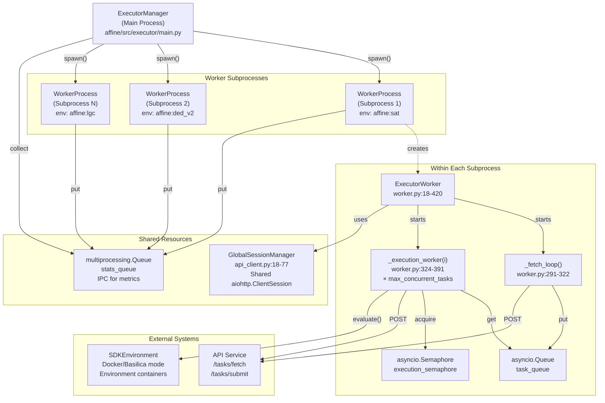
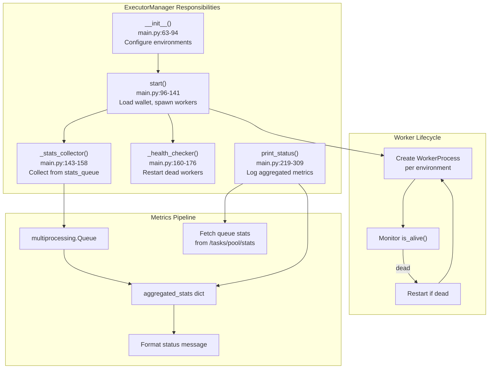
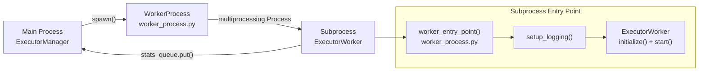
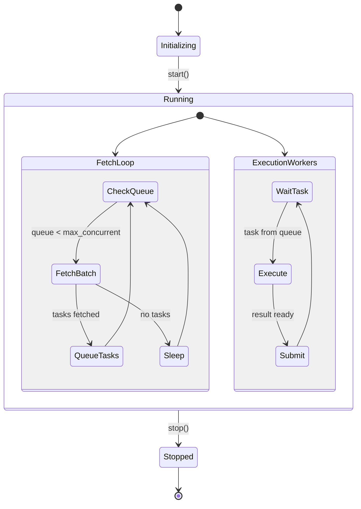
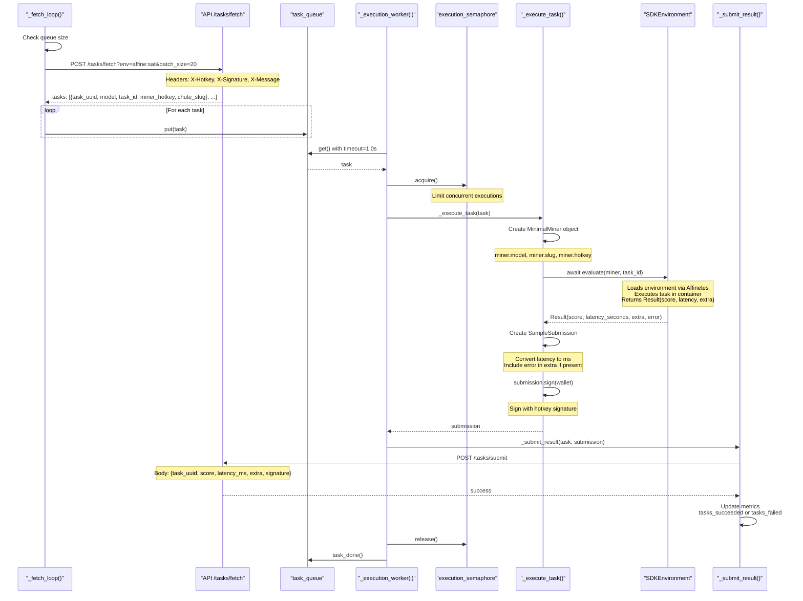
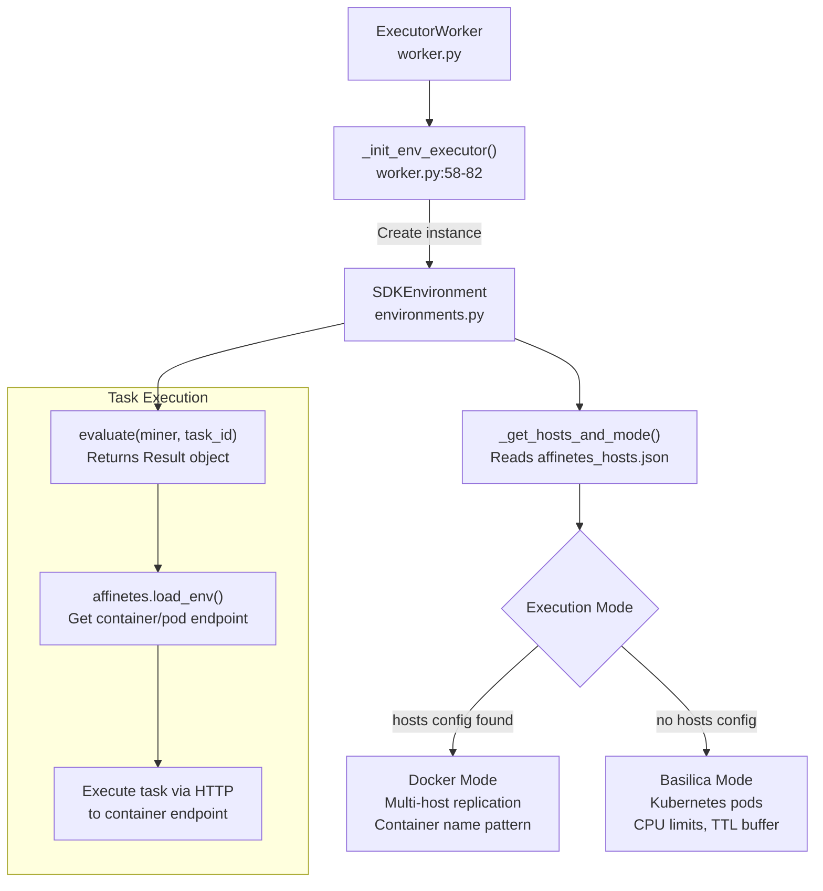
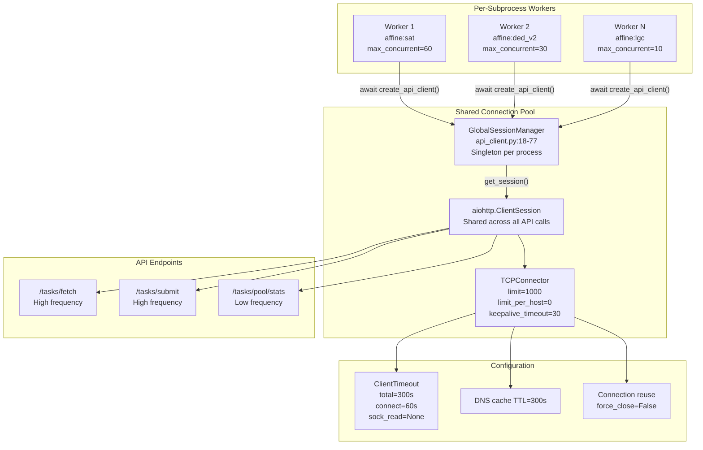
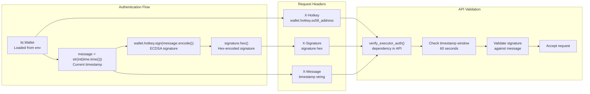
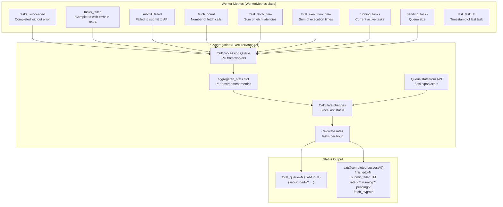
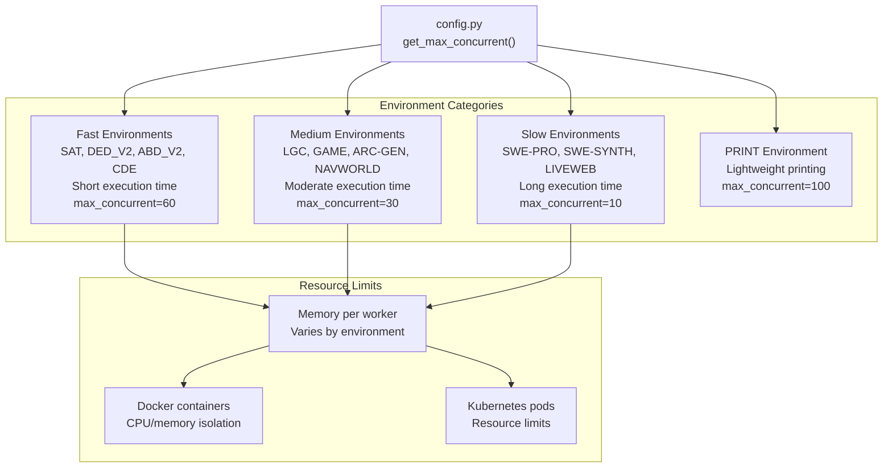

import CollapsibleAside from '../../../../components/CollapsibleAside.astro';
import SourceLink from '../../../../components/SourceLink.astro';
import Table from '../../../../components/Table.astro';

<CollapsibleAside title="Relevant Source Files">
  <SourceLink text="affine/src/executor/main.py" href="https://github.com/AffineFoundation/affine-cortex/blob/main/affine/src/executor/main.py" />
  <SourceLink text="affine/src/executor/worker.py" href="https://github.com/AffineFoundation/affine-cortex/blob/main/affine/src/executor/worker.py" />
  <SourceLink text="affine/utils/api_client.py" href="https://github.com/AffineFoundation/affine-cortex/blob/main/affine/utils/api_client.py" />
</CollapsibleAside>

## Purpose and Scope

The Executor Service is a backend microservice responsible for executing sampling tasks across multiple RL environments. It operates as a distributed task worker that fetches tasks from the API, evaluates miner models using isolated environment containers, and submits results back to the database. The service implements a multiprocess architecture where each environment runs in its own subprocess with independent resources and event loops.

For information about how tasks are created and allocated, see [Scheduler Service](/subnets/backend-services-deep-dive/scheduler-service#11.3). For details on how execution results are scored, see [Scorer Service](/subnets/backend-services-deep-dive/scorer-service#11.5). For environment implementation details, see [Environment System Architecture](/subnets/evaluation-environments/environment-system-architecture#7.1).

---

## Architecture Overview

The Executor Service uses a three-layer multiprocess architecture to achieve isolation, parallelism, and fault tolerance:



**Key Design Principles:**

<Table>

| Layer | Component | Purpose | Process Boundary |
|-------|-----------|---------|------------------|
| **Management** | `ExecutorManager` | Spawn workers, aggregate stats, health checks | Main process |
| **Process** | `WorkerProcess` | Subprocess wrapper, lifecycle management | One per environment |
| **Execution** | `ExecutorWorker` | Task fetch/execute/submit logic, metrics | Inside subprocess |
| **Concurrency** | `_execution_worker()` | Individual task execution coroutines | Asyncio tasks (×N per worker) |

</Table>


**Sources:** [affine/src/executor/main.py:60-310](), [affine/src/executor/worker.py:18-56]()

---

## Components

### ExecutorManager

The `ExecutorManager` class runs in the main process and orchestrates all worker subprocesses. It handles lifecycle management, metrics aggregation, and periodic status reporting.



**Key Methods:**

<Table>

| Method | Purpose | Invocation |
|--------|---------|------------|
| `start()` | Initialize wallet, create API client, spawn worker processes | Once at startup |
| `_stats_collector()` | Background task that reads from `stats_queue` | Continuous loop |
| `_health_checker()` | Monitor worker process health, restart if dead | Every 10 seconds |
| `print_status()` | Fetch queue stats from API, calculate deltas, log formatted status | Every 60 seconds |
| `_fetch_queue_stats()` | Parallel API calls to get pending task counts per environment | Called by `print_status()` |

</Table>


**Configuration Discovery:**

If `--envs` is not specified, the manager fetches enabled environments from the API:

```python
# affine/src/executor/main.py:312-329
async def fetch_system_config() -> dict:
    api_client = await create_api_client()
    config = await api_client.get("/config/environments")
    # Extracts environments where enabled_for_sampling=true
```

**Sources:** [affine/src/executor/main.py:60-310](), [affine/src/executor/main.py:312-329]()

---

### WorkerProcess

The `WorkerProcess` class is a thin wrapper around `multiprocessing.Process` that handles subprocess spawning and IPC communication via the shared `stats_queue`.



**Purpose:**
- Isolate each environment in its own process (memory isolation, independent event loops)
- Enable independent failure recovery (if one environment crashes, others continue)
- Support multiprocessing start method `spawn` for cross-platform compatibility

**Sources:** Referenced in [affine/src/executor/main.py:119-133]()

---

### ExecutorWorker

The `ExecutorWorker` class implements the core task execution logic within each subprocess. It manages a fetch loop, execution workers, and environment integration.



**Initialization:**

[affine/src/executor/worker.py:84-94]()

```python
async def initialize(self):
    """Initialize the worker (environment and API client)."""
    self.api_client = await create_api_client()  # Shared session
    await self._init_env_executor()  # Load SDKEnvironment
```

The worker initializes two critical components:
1. **API Client:** Uses `GlobalSessionManager` for shared connection pooling
2. **Environment Executor:** Creates `SDKEnvironment` instance that handles Docker/Basilica mode selection

**Fetch Loop:**

[affine/src/executor/worker.py:291-322]()

The fetch loop monitors queue size and fetches new tasks when space is available:

```python
async def _fetch_loop(self):
    while self.running:
        current_queue_size = self.task_queue.qsize()
        
        if current_queue_size >= self.max_concurrent_tasks:
            await asyncio.sleep(1)
            continue
        
        tasks = await self._fetch_tasks_batch()  # Fetch batch_size tasks
        
        for task in tasks:
            await self.task_queue.put(task)
```

**Execution Workers:**

[affine/src/executor/worker.py:324-391]()

Multiple execution workers (`max_concurrent_tasks` coroutines) run concurrently, each processing tasks from the queue:

```python
async def _execution_worker(self, worker_idx: int):
    while self.running:
        task = await asyncio.wait_for(self.task_queue.get(), timeout=1.0)
        
        async with self.execution_semaphore:
            submission = await self._execute_task(task)
            await self._submit_result(task, submission)
            self.task_queue.task_done()
```

**Sources:** [affine/src/executor/worker.py:18-420]()

---

## Task Execution Flow

The following diagram traces the complete flow from task fetch to result submission, including all key method calls and data transformations:



**Task Data Structure:**

Tasks fetched from the API contain:

<Table>

| Field | Type | Purpose |
|-------|------|---------|
| `task_uuid` | str | Unique task identifier (UUID) |
| `task_id` | int | Environment-specific task ID |
| `model` | str | HuggingFace model name |
| `miner_hotkey` | str | Miner's hotkey address |
| `miner_uid` | int | Miner's UID on subnet |
| `chute_slug` | str | Chutes deployment slug (required) |
| `env` | str | Environment name (e.g., "affine:sat") |

</Table>


**Result Submission Structure:**

[affine/src/executor/worker.py:230-238]()

```python
submission = SampleSubmission(
    task_uuid=task_uuid,
    score=float(result.score),
    latency_ms=int(result.latency_seconds * 1000),
    extra=extra,  # Dict with conversation, error, etc.
    signature="",  # Filled by sign()
)
submission.sign(self.wallet)  # Cryptographic signature
```

**Sources:** [affine/src/executor/worker.py:148-177](), [affine/src/executor/worker.py:184-258](), [affine/src/executor/worker.py:260-289]()

---

## Environment Integration

The Executor Service delegates environment execution to the `SDKEnvironment` class, which handles container orchestration via Affinetes:



**Initialization:**

[affine/src/executor/worker.py:58-82]()

```python
async def _init_env_executor(self):
    from affine.core.environments import SDKEnvironment
    
    self.env_executor = SDKEnvironment(self.env)
    
    # Log the mode being used
    _, execution_mode = self.env_executor._get_hosts_and_mode()
    safe_log(
        f"[{self.env}] Environment initialized using {execution_mode} mode "
        f"(via SDKEnvironment)",
        "INFO"
    )
```

**Evaluation:**

[affine/src/executor/worker.py:207-221]()

The worker creates a minimal miner object and calls `SDKEnvironment.evaluate()`:

```python
class MinimalMiner:
    def __init__(self, model, slug, hotkey):
        self.model = model
        self.slug = chute_slug.replace('.chutes.ai', '').replace('https://', '')
        self.hotkey = hotkey
        self.revision = ""

miner = MinimalMiner(model, chute_slug, miner_hotkey)

result = await self.env_executor.evaluate(
    miner=miner,
    task_id=task_id,
)
```

The `evaluate()` method returns a `Result` object with:
- `score`: Task performance score (float)
- `latency_seconds`: Execution time (float)
- `extra`: Dict with conversation history, debug info, etc.
- `error`: Error message if task failed (str or None)

**Sources:** [affine/src/executor/worker.py:58-82](), [affine/src/executor/worker.py:184-258]()

---

## API Client and Connection Pooling

The Executor Service uses a sophisticated connection pooling strategy to handle high concurrency across multiple workers:



**GlobalSessionManager:**

[affine/utils/api_client.py:18-77]()

The singleton manager ensures all HTTP requests within a subprocess share a single `ClientSession`:

```python
@classmethod
async def get_session(cls) -> aiohttp.ClientSession:
    async with cls._lock:
        if cls._session is None or cls._session.closed:
            connector = aiohttp.TCPConnector(
                limit=1000,  # Total connection limit
                limit_per_host=0,  # No per-host limit
                ttl_dns_cache=300,
                force_close=False,  # Allow connection reuse
                enable_cleanup_closed=True,
                keepalive_timeout=30,
            )
            
            timeout = aiohttp.ClientTimeout(
                total=300,
                connect=60,  # Wait up to 60s for connection
                sock_read=None
            )
            
            cls._session = aiohttp.ClientSession(
                connector=connector,
                timeout=timeout,
                connector_owner=True
            )
        
        return cls._session
```

**Design Rationale:**

<Table>

| Configuration | Value | Reason |
|---------------|-------|--------|
| `limit=1000` | 1000 connections | Support 8 workers × 60 concurrent tasks = 480 potential connections + buffer |
| `limit_per_host=0` | No limit | All requests go to single API host, use total limit |
| `keepalive_timeout=30` | 30 seconds | Balance between connection reuse and preventing stale connections |
| `connect=60` | 60 seconds | Allow waiting for available connection from pool during high load |
| `force_close=False` | Reuse connections | Minimize connection overhead for high-frequency requests |

</Table>


**APIClient Usage:**

[affine/src/executor/worker.py:91](), [affine/src/executor/worker.py:154-158]()

```python
# Worker initialization
self.api_client = await create_api_client()

# Fetch tasks
response = await self.api_client.post(
    "/tasks/fetch",
    params={"env": self.env, "batch_size": self.batch_size},
    headers=headers
)
```

**Sources:** [affine/utils/api_client.py:18-77](), [affine/utils/api_client.py:129-249](), [affine/utils/api_client.py:354-370]()

---

## Authentication

All API requests are authenticated using cryptographic signatures to prevent unauthorized task submission:



**Implementation:**

[affine/src/executor/worker.py:127-146]()

```python
def _sign_message(self, message: str) -> str:
    """Sign a message using the wallet."""
    signature = self.wallet.hotkey.sign(message.encode())
    return signature.hex()

def _get_auth_headers(self, message: Optional[str] = None) -> Dict[str, str]:
    """Get authentication headers for API requests."""
    if message is None:
        message = str(int(time.time()))
    
    signature = self._sign_message(message)
    
    return {
        "X-Hotkey": self.hotkey,
        "X-Signature": signature,
        "X-Message": message,
    }
```

**Usage in Requests:**

[affine/src/executor/worker.py:148-158](), [affine/src/executor/worker.py:260-277]()

```python
# Fetch tasks
headers = self._get_auth_headers()
response = await self.api_client.post(
    "/tasks/fetch",
    params={"env": self.env, "batch_size": self.batch_size},
    headers=headers
)

# Submit result
headers = self._get_auth_headers()
await self.api_client.post(
    "/tasks/submit",
    json=submit_data,
    headers=headers
)
```

**Security Properties:**

- **Timestamp-based replay prevention:** Message contains current timestamp, API validates within 60-second window
- **Cryptographic authentication:** Signature proves possession of private key corresponding to hotkey
- **Non-repudiation:** Signed results can be verified by validators

**Sources:** [affine/src/executor/worker.py:127-146](), [affine/src/executor/worker.py:148-177](), [affine/src/executor/worker.py:260-289]()

---

## Metrics and Monitoring

The Executor Service implements comprehensive metrics tracking at both worker and manager levels:



**WorkerMetrics Class:**

[affine/src/executor/worker.py:46-49]()

```python
self.metrics = WorkerMetrics(
    worker_id=worker_id,
    env=env,
)
```

Tracks per-worker performance:
- Task completion counts (succeeded/failed)
- Submission failures
- Average fetch and execution times
- Current queue and semaphore state

**Metrics Collection:**

[affine/src/executor/worker.py:393-420]()

```python
def get_metrics(self) -> Dict[str, Any]:
    """Get worker metrics."""
    total_tasks = self.metrics.tasks_succeeded + self.metrics.tasks_failed
    avg_time = (
        self.metrics.total_execution_time / total_tasks
        if total_tasks > 0
        else 0
    )
    
    avg_fetch_time = (
        self.metrics.total_fetch_time / self.metrics.fetch_count
        if self.metrics.fetch_count > 0
        else 0
    )
    
    running_tasks = self.max_concurrent_tasks - self.execution_semaphore._value
    pending_tasks = self.task_queue.qsize()
```

**Status Logging:**

[affine/src/executor/main.py:219-309]()

The manager periodically logs comprehensive status:

```
[STATUS] total_queue=450(-30 in 60s) (sat=120(-10) ded=80(-5) lgc=250(-15)) 
[sat@1234(98% finished:+25 submit_failed:+2 rate:1500/h running:15 pending:5 fetch_avg:45ms) 
 ded@890(95% finished:+12 submit_failed:+1 rate:720/h running:8 pending:2 fetch_avg:38ms) 
 lgc@2341(99% finished:+40 submit_failed:+0 rate:2400/h running:10 pending:0 fetch_avg:52ms)]
```

**Log Format Components:**

<Table>

| Component | Meaning | Example |
|-----------|---------|---------|
| `total_queue=N` | Total pending tasks across all environments | 450 |
| `(+/-M in Ts)` | Change in queue size over time delta | (-30 in 60s) |
| `(sat=X ded=Y ...)` | Per-environment queue sizes with changes | sat=120(-10) |
| `env@completed` | Completed task count for environment | sat@1234 |
| `(success%)` | Success rate (tasks without errors) | (98%) |
| `finished:+N` | New completions since last status | +25 |
| `submit_failed:+M` | Failed submissions since last status | +2 |
| `rate:X/h` | Completion rate (tasks per hour) | 1500/h |
| `running:Y` | Currently executing tasks | 15 |
| `pending:Z` | Tasks in local queue | 5 |
| `fetch_avg:Ms` | Average fetch latency | 45ms |

</Table>


**Sources:** [affine/src/executor/worker.py:393-420](), [affine/src/executor/main.py:219-309](), [affine/src/executor/main.py:25-58]()

---

## Configuration

The Executor Service supports per-environment concurrency configuration to optimize resource usage based on environment characteristics:



**Configuration Mapping:**

<Table>

| Environment | max_concurrent_tasks | Rationale |
|-------------|----------------------|-----------|
| `affine:sat` | 60 | Fast boolean satisfiability, lightweight |
| `affine:ded_v2` | 60 | Fast deductive reasoning, minimal state |
| `affine:abd_v2` | 60 | Fast abductive reasoning, similar to DED |
| `affine:cde` | 60 | Fast code debugging, quick iterations |
| `affine:lgc` | 30 | Complex logic puzzles, moderate time |
| `affine:game` | 30 | Game playing, moderate episodes |
| `affine:arc-gen` | 30 | ARC puzzle generation, moderate compute |
| `affine:navworld` | 30 | Navigation tasks, moderate episodes |
| `affine:swe-pro` | 10 | Complex SWE tasks on production repos, slow |
| `affine:swe-synth` | 10 | Complex SWE tasks on synthetic repos, slow |
| `affine:liveweb` | 10 | Web browsing with network requests, slow |
| `affine:print` | 100 | Lightweight print output validation |

</Table>


**Environment-Specific Configuration:**

[affine/src/executor/main.py:89-94]()

```python
env_config_str = ", ".join([f"{env}={get_max_concurrent(env)}" for env in envs])
logger.info(
    f"ExecutorManager initialized for {len(envs)} environments "
    f"({env_config_str})"
)
```

Example output:
```
ExecutorManager initialized for 8 environments (affine:sat=60, affine:ded_v2=60, 
affine:lgc=30, affine:swe-pro=10, affine:game=30, affine:arc-gen=30, 
affine:liveweb=10, affine:print=100)
```

**Worker Process Configuration:**

[affine/src/executor/main.py:119-133]()

```python
for idx, env in enumerate(self.envs):
    max_concurrent = get_max_concurrent(env)
    worker_proc = WorkerProcess(
        worker_id=idx,
        env=env,
        wallet_name=coldkey,
        wallet_hotkey=hotkey,
        max_concurrent_tasks=max_concurrent,  # Environment-specific
        batch_size=20,  # Fixed for all environments
        stats_queue=self.stats_queue,
        verbosity=self.verbosity,
    )
    worker_proc.start()
```

**Batch Size:**

The `batch_size=20` parameter controls how many tasks are fetched per API request. This is kept constant across environments to balance between:
- Reducing API round-trip overhead
- Avoiding over-fetching tasks that might become stale
- Maintaining fair task distribution

**Sources:** [affine/src/executor/config.py]() (referenced), [affine/src/executor/main.py:89-94](), [affine/src/executor/main.py:119-133]()

---

## Service Deployment

The Executor Service is deployed as a Docker container in the backend service stack:

**Docker Compose Configuration:**

```yaml
# docker-compose.backend.yml (excerpt)
executor:
  image: affinefoundation/affine:latest
  command: af servers executor -v 1
  environment:
    - SERVICE_MODE=true
    - API_URL=http://api:8000/api/v1
  volumes:
    - /var/run/docker.sock:/var/run/docker.sock  # For Docker mode execution
    - /var/log/affine:/var/log/affine
  depends_on:
    api:
      condition: service_healthy
  restart: unless-stopped
```

**Environment Variables:**

<Table>

| Variable | Value | Purpose |
|----------|-------|---------|
| `SERVICE_MODE` | `true` | Enable continuous service mode |
| `API_URL` | `http://api:8000/api/v1` | Internal API endpoint |
| `BT_WALLET_COLD` | `default` | Bittensor coldkey name |
| `BT_WALLET_HOT` | `default` | Bittensor hotkey name |
| `EXECUTOR_VERBOSITY` | `1` | Logging verbosity (0-3) |

</Table>


**Volume Mounts:**

- `/var/run/docker.sock`: Required for Docker mode (affinetes container orchestration)
- `/var/log/affine`: Persistent logs beyond container lifecycle

**CLI Command:**

[affine/src/executor/main.py:380-413]()

```bash
af servers executor --envs affine:sat affine:ded_v2 -v 1
```

Options:
- `--envs`: Specify environments (if omitted, fetches from API config)
- `-v, --verbosity`: Logging level (0=CRITICAL, 1=INFO, 2=DEBUG, 3=TRACE)

**Sources:** [affine/src/executor/main.py:380-413](), [docker-compose.backend.yml]() (referenced)
