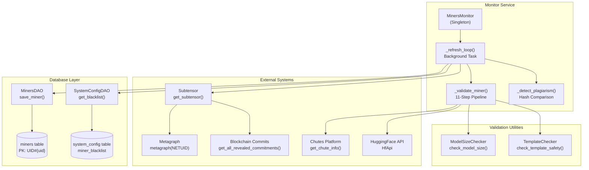
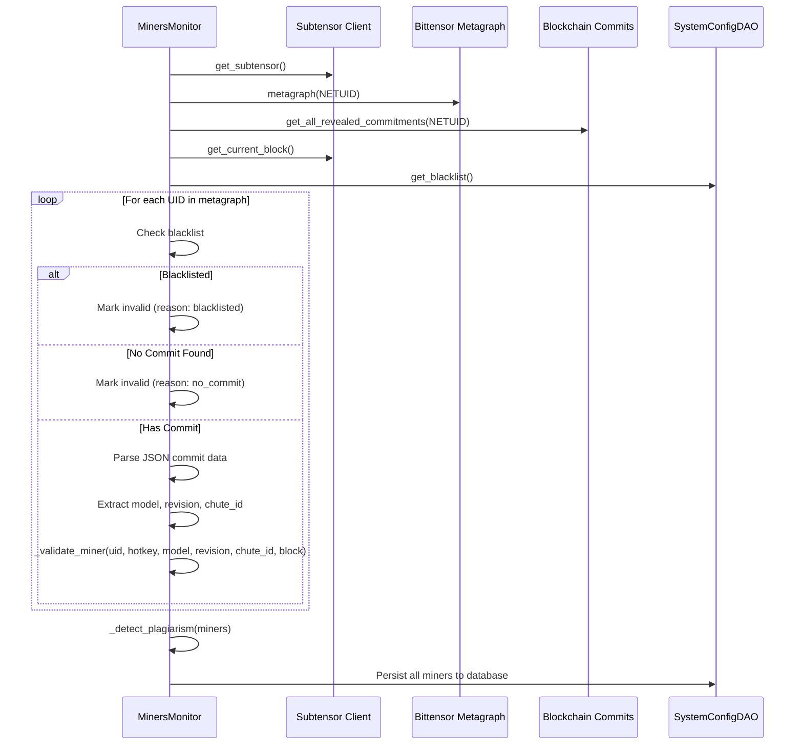
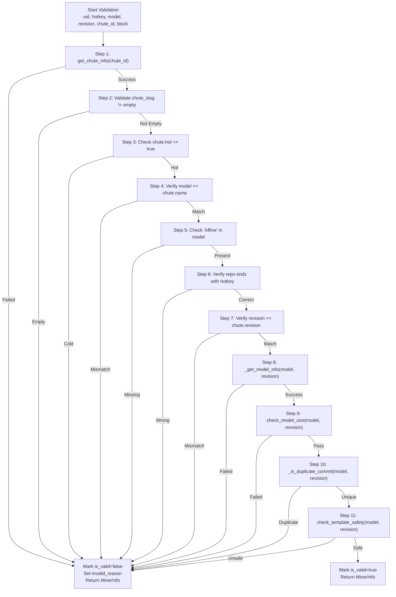
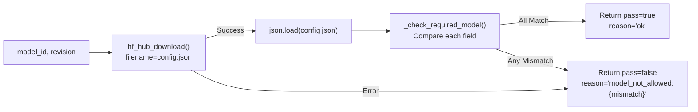
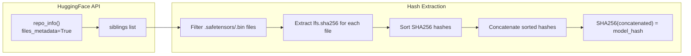
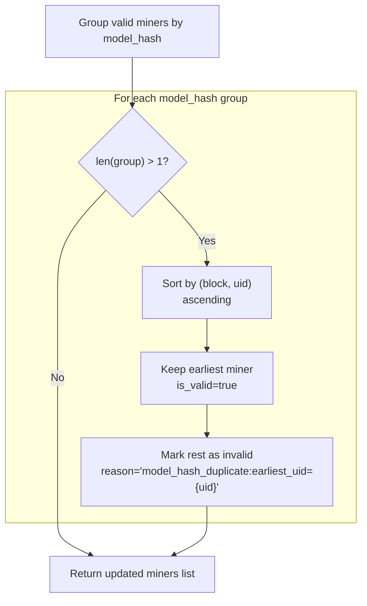
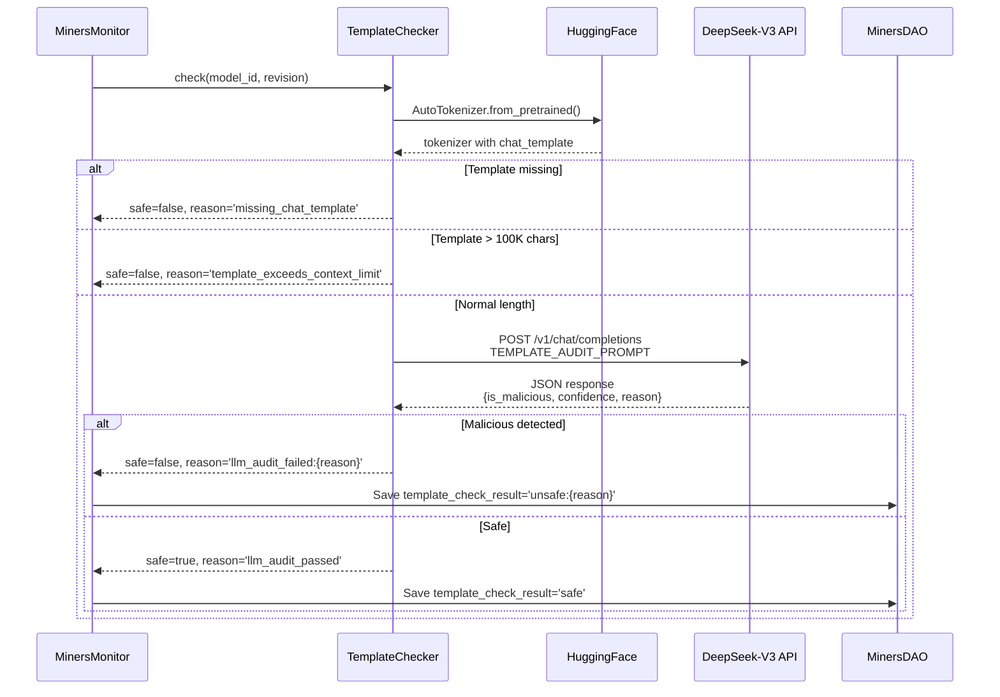
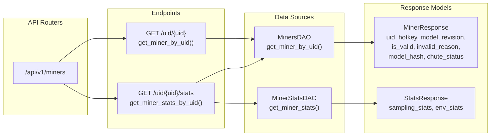
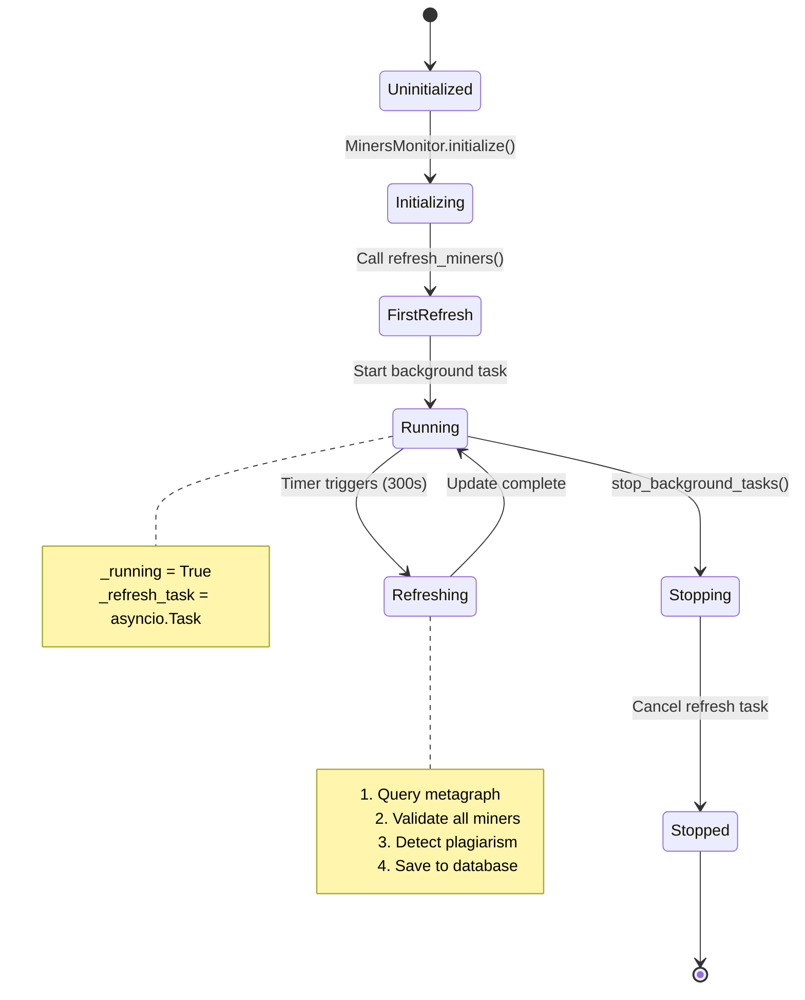

import CollapsibleAside from '../../../../components/CollapsibleAside.astro';
import SourceLink from '../../../../components/SourceLink.astro';
import Table from '../../../../components/Table.astro';

<CollapsibleAside title="Relevant Source Files">
  <SourceLink text="affine/api/routers/miners.py" href="https://github.com/AffineFoundation/affine-cortex/blob/main/affine/api/routers/miners.py" />
  <SourceLink text="affine/database/dao/miners.py" href="https://github.com/AffineFoundation/affine-cortex/blob/main/affine/database/dao/miners.py" />
  <SourceLink text="affine/database/dao/scores.py" href="https://github.com/AffineFoundation/affine-cortex/blob/main/affine/database/dao/scores.py" />
  <SourceLink text="affine/database/dao/system_config.py" href="https://github.com/AffineFoundation/affine-cortex/blob/main/affine/database/dao/system_config.py" />
  <SourceLink text="affine/src/monitor/miners_monitor.py" href="https://github.com/AffineFoundation/affine-cortex/blob/main/affine/src/monitor/miners_monitor.py" />
  <SourceLink text="affine/utils/model_size_checker.py" href="https://github.com/AffineFoundation/affine-cortex/blob/main/affine/utils/model_size_checker.py" />
  <SourceLink text="affine/utils/template_checker.py" href="https://github.com/AffineFoundation/affine-cortex/blob/main/affine/utils/template_checker.py" />
</CollapsibleAside>

## Purpose and Scope

The Monitor Service is responsible for discovering miners from the Bittensor metagraph, validating their deployments, detecting plagiarism, and persisting validation state to the database. This service acts as the entry gate for miners before they receive task assignments.

For information about task generation after validation, see [Scheduler Service](/subnets/backend-services-deep-dive/scheduler-service#11.3). For weight calculation based on validated miners, see [Scorer Service](/subnets/backend-services-deep-dive/scorer-service#11.5).

**Core Responsibilities:**

- Discover miners from Bittensor metagraph and blockchain commits
- Validate Chutes deployment status and model architecture
- Detect plagiarism via model weight hash comparison
- Audit chat templates for malicious benchmark-cheating code
- Manage blacklist and system miners configuration
- Persist validation results to `miners` table in DynamoDB

**Sources:** [affine/src/monitor/miners_monitor.py:1-764]()

---

## Service Architecture

The Monitor Service operates as a singleton background service that periodically refreshes miner validation state. It integrates with multiple external systems and internal DAOs.



**Singleton Pattern:** The `MinersMonitor` class uses a singleton pattern with `get_instance()` and `initialize()` methods to ensure only one instance runs globally. The background refresh loop runs every 300 seconds (configurable) by default.

**Caching Strategy:** Model weight hashes and duplicate detection results are cached in memory with a 30-minute TTL to avoid redundant HuggingFace API calls.

**Sources:** [affine/src/monitor/miners_monitor.py:50-131](), [affine/src/monitor/miners_monitor.py:159-287]()

---

## Miner Discovery Process

The monitor discovers miners by querying the Bittensor metagraph and extracting commit data from the blockchain.



**Commit Data Structure:** Each miner's commit contains:
```json
{
  "model": "username/Affine-Qwen3-32B-hotkey",
  "revision": "a1b2c3d4...",
  "chute_id": "550e8400-e29b-41d4-a716-446655440000"
}
```

**Multi-Commit Enforcement:** Starting at block 7679000, miners with more than one commit are disqualified (unless their first commit was before 7678012 - grandfathered). This prevents miners from changing models to game the system.

**Sources:** [affine/src/monitor/miners_monitor.py:536-735](), [affine/src/monitor/miners_monitor.py:132-157]()

---

## Validation Pipeline

Each miner undergoes an 11-step validation pipeline. Failure at any step marks the miner as invalid with a specific `invalid_reason`.

### Validation Steps Overview

<Table>

| Step | Check | Invalid Reason Example | Skipped For |
|------|-------|------------------------|-------------|
| 1 | Fetch chute info | `chute_fetch_failed` | None |
| 2 | Chute slug not empty | `chute_slug_empty` | None |
| 3 | Chute is "hot" | `chute_not_hot` | None |
| 4 | Model name matches chute | `model_mismatch:chute={name}` | UID 0 |
| 5 | Model name contains "Affine" | `model_name_missing_affine` | UID 0 |
| 6 | Repo name ends with hotkey | `repo_name_not_ending_with_hotkey` | UID 0, block &lt; 7290000 |
| 7 | Revision matches chute | `revision_mismatch:chute={rev}` | None |
| 8 | HuggingFace model exists | `hf_model_fetch_failed` | None |
| 9 | Model is Qwen3-32B | `model_check:{reason}` | UID 0, UID > 1000 |
| 10 | Not duplicate commit | `duplicate_repo:from={repo}` | UID 0 |
| 11 | Chat template is safe | `malicious_template:{reason}` | UID 0 |

</Table>




**Template Check Caching:** The `template_check_result` field is cached in the database to avoid redundant LLM audits. If the model and revision haven't changed, the cached result is reused.

**Sources:** [affine/src/monitor/miners_monitor.py:288-491]()

---

## Model Architecture Validation

The `ModelSizeChecker` validates that miners use exactly the Qwen3-32B architecture by inspecting `config.json` from HuggingFace.

### Required Architecture Parameters

```python
REQUIRED_MODEL_CONFIG = {
    "model_type": "qwen3",
    "hidden_size": 5120,
    "num_hidden_layers": 64,
    "intermediate_size": 25600,
    "vocab_size": 151936,
    "num_attention_heads": 64,
    "num_key_value_heads": 8,
}
```

**Quantization-Proof:** This method checks architecture fields rather than file sizes, so quantized models (INT4, INT8) with the correct architecture pass validation.

**Manipulation-Resistant:** Faking these config fields would break model loading in vLLM, so there's no incentive to cheat. The validator's executor would fail to load the model.



**Example Rejection:**
- Input: `Qwen/Qwen2.5-7B-Instruct`
- Reason: `model_not_allowed:num_hidden_layers=28 (expected 64)`

**Sources:** [affine/utils/model_size_checker.py:1-123]()

---

## Anti-Plagiarism Detection

The monitor detects plagiarism by comparing model weight hashes. For each unique hash, only the miner with the earliest `first_block` is kept as valid.

### Hash Calculation Process



### Duplicate Detection Logic



**Temporal Priority:** The `first_block` field determines priority. A miner who committed at block 7000000 beats a miner with the same model hash who committed at block 7000001.

**Cache Duration:** Model hashes are cached for 30 minutes (`weights_ttl = 1800`) to avoid redundant API calls.

**Duplicate Commit Detection:** If a HuggingFace commit message starts with "Duplicate from", the monitor automatically rejects the miner with reason `duplicate_repo:from={source_repo}`.

**Sources:** [affine/src/monitor/miners_monitor.py:159-286](), [affine/src/monitor/miners_monitor.py:493-534]()

---

## Template Safety Auditing

The `TemplateChecker` uses an LLM (DeepSeek-V3) to detect malicious code in chat templates that could give miners an unfair advantage on benchmarks.

### Audit Process



### LLM Audit Prompt Structure

The audit prompt instructs the LLM to detect five categories of cheating:

1. **Built-in solvers:** Algorithms for sudoku, game of 24, cryptarithmetic
2. **Problem detection:** Logic to identify benchmark problem types
3. **Answer injection:** Directly outputting answers based on problem type
4. **Complex algorithms:** Backtracking, permutation, brute-force search
5. **Excessive complexity:** Many nested loops, recursive logic, complex math

**Expected Response Format:**
```json
{
  "is_malicious": true,
  "confidence": 0.95,
  "reason": "Contains sudoku solving algorithm",
  "detected_issues": ["backtracking_solver", "grid_validation"]
}
```

### Caching Strategy

Template check results are persisted in the `miners` table with three possible values:

<Table>

| Value | Meaning | Behavior |
|-------|---------|----------|
| `"safe"` | Previously passed audit | Skip check, use cached result |
| `"unsafe:{reason}"` | Previously failed audit | Mark invalid immediately |
| `null` | Not yet checked or audit skipped | Execute check |

</Table>


**Audit Skipping:** If the Chutes API key is missing or the LLM call fails, the audit is skipped with reason `llm_audit_skipped:{error}` and validation continues. The `template_check_result` remains `null` for retry on next refresh.

**Sources:** [affine/utils/template_checker.py:1-323](), [affine/src/monitor/miners_monitor.py:443-491]()

---

## Database Schema

The monitor persists validation state to the `miners` table and queries configuration from `system_config`.

### Miners Table Schema

```mermaid
erDiagram
    MINERS {
        string pk "PK: UID#1"
        int uid "0-255 regular, >1000 system"
        string hotkey "SS58 address or SYSTEM-N"
        string model "HuggingFace repo"
        string revision "Git commit hash"
        string chute_id "UUID"
        string chute_slug "Chutes URL slug"
        string model_hash "SHA256 of weights"
        string chute_status "hot or cold"
        string is_valid "true or false (for GSI)"
        string invalid_reason "Rejection reason if invalid"
        int block_number "Current block at update"
        int first_block "Block at first commit"
        string template_check_result "safe, unsafe:reason, or null"
    }
```

**Key Design Decisions:**

- **Single Record per UID:** No history tracking. Each UID has exactly one record that gets overwritten on refresh.
- **GSI for Valid Miners:** The `is-valid-index` GSI enables efficient queries for `get_valid_miners()` and `get_invalid_miners()`.
- **String Boolean:** The `is_valid` field is stored as `"true"` or `"false"` (string) to work with DynamoDB GSI key conditions.

### System Config Table Schema

```mermaid
erDiagram
    SYSTEM_CONFIG {
        string pk "CONFIG"
        string sk "PARAM#miner_blacklist"
        string param_name "miner_blacklist"
        list param_value "List of hotkey strings"
        string param_type "list"
        string description "Blacklisted miner hotkeys"
        int updated_at "Unix timestamp"
        string updated_by "cli or system"
        int version "Incremented on update"
    }
```

**Blacklist Merge:** The monitor loads blacklist from two sources and merges them:
1. `AFFINE_MINER_BLACKLIST` environment variable (comma-separated)
2. `system_config.miner_blacklist` database parameter

**System Miners Config:** System miners (UID > 1000) are stored in `system_config.system_miners`:
```json
{
  "1001": {"model": "openai/gpt-4o"},
  "1002": {"model": "anthropic/claude-3.5-sonnet"}
}
```

**Sources:** [affine/database/dao/miners.py:1-227](), [affine/database/dao/system_config.py:225-365]()

---

## API Integration

The Monitor Service exposes miner validation data through REST API endpoints.

### Available Endpoints



### GET /miners/uid/&#123;uid&#125;

Returns complete miner validation information.

**Response Fields:**

<Table>

| Field | Type | Description |
|-------|------|-------------|
| `uid` | int | Miner UID (0-255, or >1000 for system) |
| `hotkey` | string | Miner's SS58 hotkey |
| `model` | string | HuggingFace model repository |
| `revision` | string | Git commit hash |
| `chute_id` | string | Chutes deployment UUID |
| `chute_slug` | string | Chutes URL slug identifier |
| `model_hash` | string | SHA256 hash of model weights |
| `chute_status` | string | "hot" or "cold" |
| `is_valid` | string | "true" or "false" |
| `invalid_reason` | string | Rejection reason if invalid |
| `block_number` | int | Current block at last update |
| `first_block` | int | Block when first committed |
| `template_check_result` | string | "safe", "unsafe:reason", or null |

</Table>


**Example Usage:**
```bash
curl http://localhost:8000/api/v1/miners/uid/42
```

**Sources:** [affine/api/routers/miners.py:19-62]()

---

## Configuration Management

The monitor supports dynamic configuration through environment variables and database parameters.

### Blacklist Configuration

**Environment Variable:**
```bash
AFFINE_MINER_BLACKLIST="5D1Qa...,5E2Rb...,5F3Sc..."
```

**Database CLI Commands:**
```bash
# Add hotkeys to blacklist
af db blacklist --add 5D1Qa... 5E2Rb...

# Remove hotkeys from blacklist
af db blacklist --remove 5D1Qa...

# List all blacklisted hotkeys
af db blacklist --list
```

**Merge Behavior:** The monitor merges environment and database blacklists, removing duplicates:
```python
env_blacklist = set(os.getenv("AFFINE_MINER_BLACKLIST", "").split(","))
db_blacklist = set(await config_dao.get_blacklist())
merged = env_blacklist | db_blacklist
```

### Refresh Interval Configuration

**Default:** 300 seconds (5 minutes)

**Customization:**
```python
monitor = await MinersMonitor.initialize(refresh_interval_seconds=600)
```

### System Miners Configuration

System miners (benchmark models like GPT-4o) use UIDs > 1000 and skip all validation checks.

**Adding a System Miner:**
```bash
af db add-system-miner --uid 1001 --model "openai/gpt-4o"
```

**Database Structure:**
```json
{
  "param_name": "system_miners",
  "param_value": {
    "1001": {"model": "openai/gpt-4o"},
    "1002": {"model": "anthropic/claude-3.5-sonnet"}
  }
}
```

**Virtual Properties:** System miners get virtual hotkeys (`SYSTEM-1`, `SYSTEM-2`) and revisions (`SYSTEM-1`) that are used internally for tracking but don't correspond to real Bittensor identities.

**Sources:** [affine/src/monitor/miners_monitor.py:132-157](), [affine/database/dao/system_config.py:289-365](), [affine/src/monitor/miners_monitor.py:668-697]()

---

## Service Lifecycle

The Monitor Service runs as a background task with automatic refresh.



### Initialization Sequence

```python
# Initialize singleton and start background refresh
monitor = await MinersMonitor.initialize(refresh_interval_seconds=300)

# Or get existing instance
monitor = MinersMonitor.get_instance()
```

### Manual Refresh

```python
# Force immediate refresh (bypasses timer)
valid_miners = await monitor.refresh_miners()
```

### Graceful Shutdown

```python
# Stop background tasks before application shutdown
await monitor.stop_background_tasks()
```

**Error Handling:** If `refresh_miners()` raises an exception, it's logged but the background loop continues. The service remains available with stale data until the next successful refresh.

**Sources:** [affine/src/monitor/miners_monitor.py:85-131](), [affine/src/monitor/miners_monitor.py:536-735]()
