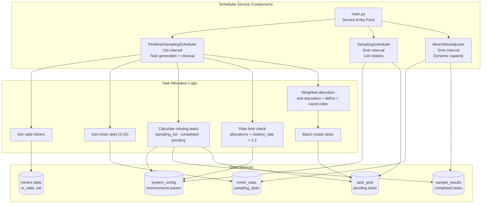
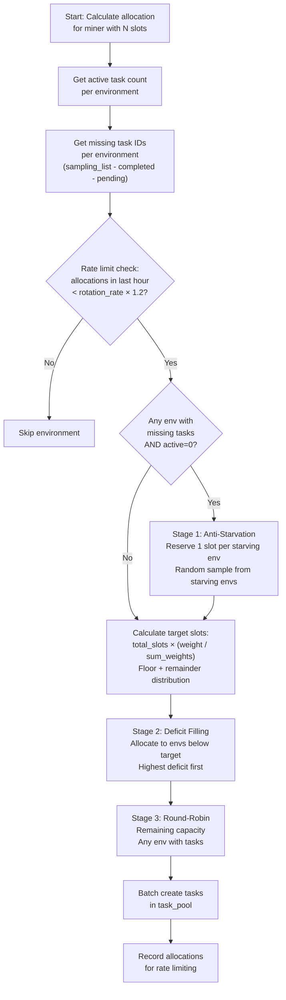
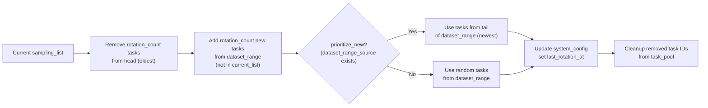
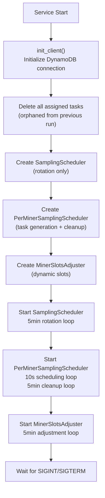

import CollapsibleAside from '../../../../components/CollapsibleAside.astro';
import SourceLink from '../../../../components/SourceLink.astro';
import Table from '../../../../components/Table.astro';

<CollapsibleAside title="Relevant Source Files">
  <SourceLink text="affine/database/cli.py" href="https://github.com/AffineFoundation/affine-cortex/blob/main/affine/database/cli.py" />
  <SourceLink text="affine/src/scheduler/__init__.py" href="https://github.com/AffineFoundation/affine-cortex/blob/main/affine/src/scheduler/__init__.py" />
  <SourceLink text="affine/src/scheduler/main.py" href="https://github.com/AffineFoundation/affine-cortex/blob/main/affine/src/scheduler/main.py" />
  <SourceLink text="affine/src/scheduler/sampling_scheduler.py" href="https://github.com/AffineFoundation/affine-cortex/blob/main/affine/src/scheduler/sampling_scheduler.py" />
</CollapsibleAside>

## Purpose and Scope

The Scheduler Service is a backend microservice responsible for generating and distributing sampling tasks to miners. It implements weighted task allocation, anti-starvation mechanisms, rate limiting, and sampling list rotation. The service runs continuously, checking every 10 seconds to allocate tasks across environments based on miner capacity and performance.

For information about task execution, see [Executor Service](/subnets/backend-services-deep-dive/executor-service#11.4). For scoring results, see [Scorer Service](/subnets/backend-services-deep-dive/scorer-service#11.5). For environment configuration details, see [Environment Configuration](/subnets/evaluation-environments/environment-configuration#7.3).

**Sources:** [affine/src/scheduler/main.py:1-137](), [affine/src/scheduler/__init__.py:1-18]()

---

## Architecture Overview

The Scheduler Service consists of three main components that run as independent async loops:



**Diagram: Scheduler Service Architecture and Data Flow**

The service orchestrates task generation through three synchronized components. `PerMinerSamplingScheduler` handles the core scheduling logic, while `SamplingScheduler` manages list rotation and `MinerSlotsAdjuster` tunes miner capacity based on performance.

**Sources:** [affine/src/scheduler/main.py:19-109](), [affine/src/scheduler/sampling_scheduler.py:22-949]()

---

## Core Components

### PerMinerSamplingScheduler

The primary scheduler responsible for per-miner task allocation. Runs in a 10-second loop.

**Key Responsibilities:**
- Query valid miners from `miners` table where `is_valid=true`
- Calculate missing tasks: `sampling_list - completed_task_ids - pending_task_ids`
- Apply rate limiting to prevent memorization attacks
- Allocate tasks using weighted strategy with anti-starvation
- Create tasks in `task_pool` table
- Cleanup invalid tasks and removed miners

**Class Definition:** [affine/src/scheduler/sampling_scheduler.py:22-949]()

**Configuration Constants:**
<Table>

| Constant | Value | Purpose |
|----------|-------|---------|
| `DEFAULT_SLOTS` | 6 | Default slots per miner |
| `MIN_SLOTS` | 3 | Minimum allowed slots |
| `MAX_SLOTS` | 10 | Maximum allowed slots |
| `RATE_MARGIN` | 1.2 | Rate limit multiplier |
| `scheduling_interval` | 10 | Loop interval (seconds) |

</Table>


**Sources:** [affine/src/scheduler/sampling_scheduler.py:22-76](), [affine/src/scheduler/sampling_scheduler.py:138-188]()

---

### SamplingScheduler

Manages sampling list rotation and size adjustment. Runs in a 5-minute loop.

**Key Responsibilities:**
- Check if `rotation_interval` has elapsed since `last_rotation_at`
- Rotate sampling lists when enabled (`rotation_enabled=true`)
- Adjust list size when `sampling_count` changes
- Re-resolve dynamic `dataset_range` from remote sources
- Cleanup pending tasks for removed task IDs

**Class Definition:** [affine/src/scheduler/sampling_scheduler.py:951-1179]()

**Rotation Parameters:**
<Table>

| Parameter | Type | Purpose |
|-----------|------|---------|
| `rotation_enabled` | boolean | Enable/disable rotation |
| `rotation_count` | int | Tasks to rotate per cycle |
| `rotation_interval` | int | Seconds between rotations |
| `last_rotation_at` | timestamp | Last rotation time |
| `prioritize_new` | boolean | Prioritize new task IDs (when `dataset_range_source` exists) |

</Table>


**Sources:** [affine/src/scheduler/sampling_scheduler.py:951-1179](), [affine/src/scheduler/sampling_scheduler.py:1000-1067]()

---

### MinerSlotsAdjuster

Dynamically adjusts miner slot allocation (3-10) based on success rate in recent time windows.

**Import Reference:** [affine/src/scheduler/__init__.py:9]()

This component monitors miner performance metrics stored in `miner_stats.sampling_stats` and adjusts `sampling_slots` accordingly. Slots increase for miners with high success rates and decrease for those with frequent errors.

**Sources:** [affine/src/scheduler/__init__.py:9](), [affine/src/scheduler/main.py:68-71]()

---

## Task Allocation Strategy

The scheduler uses a three-stage weighted allocation algorithm with anti-starvation guarantees:



**Diagram: Three-Stage Task Allocation Algorithm**

**Sources:** [affine/src/scheduler/sampling_scheduler.py:355-469](), [affine/src/scheduler/sampling_scheduler.py:554-716]()

---

### Stage 1: Anti-Starvation Reservation

Prevents environment starvation by ensuring every environment with missing tasks gets at least one task if it has zero active tasks.

**Algorithm:** [affine/src/scheduler/sampling_scheduler.py:611-633]()

```python
starving_envs = [e for e in eligible_envs if planned_active_counts.get(e, 0) == 0]
reserved = min(slots_available, len(starving_envs))

if reserved > 0:
    k = min(reserved, len(starving_envs))
    chosen_envs = random.sample(starving_envs, k)
    # Allocate 1 task to each chosen env
```

**Capacity Overflow Policy:** If all envs have active tasks (no starvation), pool cannot exceed `total_slots`. If starvation detected, temporary overflow allowed up to `total_slots + min(num_starving, ceil(0.5 × total_slots))`.

**Sources:** [affine/src/scheduler/sampling_scheduler.py:426-450](), [affine/src/scheduler/sampling_scheduler.py:611-633]()

---

### Stage 2: Weighted Target Allocation

Calculates target slots per environment based on `scheduling_weight` configuration, then fills deficits (target - active).

**Target Calculation:** [affine/src/scheduler/sampling_scheduler.py:636-663]()

```python
# Floor allocation
target_slots[env] = floor(total_slots × (weight / sum_weights))

# Remainder distribution (deterministic tie-breaking)
# 1. Larger remainder first
# 2. Higher weight first  
# 3. Environment name ascending
remainder_pool.sort(key=lambda x: (-x[1], -weight(x[0]), x[0]))
```

**Deficit Filling:** [affine/src/scheduler/sampling_scheduler.py:665-688]()

Allocates to environments below their targets, prioritizing largest deficit. Tie-breaking: deficit > weight > env name.

**Example:**

<Table>

| Environment | Weight | Target | Active | Deficit | Allocation |
|-------------|--------|--------|--------|---------|------------|
| game-v2 | 2.0 | 3 | 1 | 2 | 2 |
| lgc-v2 | 1.0 | 2 | 0 | 2 | 2 |
| print-v2 | 1.0 | 1 | 2 | 0 | 0 |

</Table>


**Sources:** [affine/src/scheduler/sampling_scheduler.py:554-688]()

---

### Stage 3: Round-Robin Allocation

Distributes remaining slots via round-robin among environments with available tasks. Used when some environments have exhausted their deficit but capacity remains.

**Algorithm:** [affine/src/scheduler/sampling_scheduler.py:690-706]()

**Sources:** [affine/src/scheduler/sampling_scheduler.py:690-716]()

---

## Rate Limiting Mechanism

Rate limiting prevents answer memorization attacks by restricting task allocation rate to slightly above the rotation rate. Uses internal allocation timestamp tracking for real-time enforcement.

### Rate Limit Calculation

**Formula:** [affine/src/scheduler/sampling_scheduler.py:326-336]()

```
rotation_rate = rotation_count × (3600 / rotation_interval) × RATE_MARGIN
min_rate = sampling_count / 48  # Completes within 2 days
allowed_per_hour = max(rotation_rate, min_rate)
```

**Exemptions:** [affine/src/scheduler/sampling_scheduler.py:309-319]()
- System miners (`uid == 0` or `uid > 1000`)
- Miners active for >48 hours (`block_number - first_block > 14400`)

### Allocation Tracking

The scheduler maintains a sliding window of allocation timestamps per `(hotkey, revision, env)`:

**Data Structure:** [affine/src/scheduler/sampling_scheduler.py:70-72]()
```python
self._allocation_timestamps: Dict[str, List[float]] = {}
# Key: "{hotkey}#{revision}#{env}"
# Value: list of unix timestamps
```

**Recording:** [affine/src/scheduler/sampling_scheduler.py:265-284]()
- Timestamps appended on each task allocation
- Expired timestamps (older than 1 hour) cleaned automatically

**Checking:** [affine/src/scheduler/sampling_scheduler.py:226-263]()
- Count valid timestamps in last hour window
- Compare against `allowed_per_hour` threshold
- Skip environment if limit exceeded

**Sources:** [affine/src/scheduler/sampling_scheduler.py:286-353](), [affine/src/scheduler/sampling_scheduler.py:226-284]()

---

## Sampling List Management

### Sampling List Structure

Each environment in `system_config.environments` has a `sampling_config`:

```json
{
  "env_name": {
    "enabled_for_sampling": true,
    "sampling_config": {
      "sampling_list": [12, 45, 78, ...],
      "sampling_count": 100,
      "dataset_range": [[0, 200]],
      "dataset_range_source": "https://...",
      "rotation_enabled": true,
      "rotation_count": 10,
      "rotation_interval": 3600,
      "last_rotation_at": 1704067200,
      "scheduling_weight": 1.5
    }
  }
}
```

**Sources:** [affine/database/cli.py:151-271]()

---

### Rotation Process

**Rotation Trigger:** [affine/src/scheduler/sampling_scheduler.py:1000-1067]()

Checks every 5 minutes if `current_time - last_rotation_at >= rotation_interval`.

**Rotation Logic:** [affine/src/scheduler/sampling_scheduler.py:1069-1094]()



**Diagram: Sampling List Rotation Process**

**Sources:** [affine/src/scheduler/sampling_scheduler.py:1069-1147]()

---

### Size Adjustment

When `sampling_count` changes (e.g., via `af db load-config`), the scheduler detects size mismatch and adjusts:

**Detection:** [affine/src/scheduler/sampling_scheduler.py:1035-1047]()
```python
current_size = len(sampling_config.get('sampling_list', []))
target_size = sampling_config.get('sampling_count', 0)

if current_size != target_size:
    await self._adjust_sampling_list_size(env_name, sampling_config)
```

**Adjustment:** [affine/src/scheduler/sampling_scheduler.py:1117-1147]()
- If expanding: Add random tasks from `dataset_range`
- If shrinking: Remove oldest tasks (head of list)
- Cleanup removed tasks from `task_pool`

**Sources:** [affine/src/scheduler/sampling_scheduler.py:1035-1147]()

---

### Dynamic Dataset Range Resolution

Supports dynamic dataset ranges from remote sources (e.g., API endpoints returning latest task IDs):

**Resolution:** [affine/src/scheduler/sampling_scheduler.py:1013-1033]()
```python
range_source = sampling_config.get('dataset_range_source')
if range_source:
    old_range = sampling_config.get('dataset_range')
    resolved_range = await resolve_dataset_range_source(
        range_source, old_range=old_range
    )
    if resolved_range is not None:
        sampling_config['dataset_range'] = resolved_range
```

When `dataset_range_source` exists, rotation uses `prioritize_new=True` to prefer tasks from the tail of the range (newest tasks).

**Sources:** [affine/src/scheduler/sampling_scheduler.py:1013-1033](), [affine/database/cli.py:168-186]()

---

## Cleanup Operations

The scheduler performs multiple cleanup operations to maintain data integrity:

### 1. Orphaned Assigned Tasks Cleanup

**Trigger:** Service startup [affine/src/scheduler/main.py:31-38]()

Deletes all `status=assigned` tasks, as these represent incomplete executions from a previous run. Executors are stateless and will refetch tasks.

```python
deleted_count = await task_pool_dao.delete_all_assigned_tasks()
```

---

### 2. Removed Miner Cleanup

**Trigger:** Miner validation state change (on every scheduling cycle) [affine/src/scheduler/sampling_scheduler.py:152-163]()

When a miner's `is_valid` flag changes to `false`, all pending tasks are deleted. Assigned tasks are kept to allow graceful completion.

**Implementation:** [affine/src/scheduler/sampling_scheduler.py:744-805]()

```python
removed_miners = self._last_valid_miners - current_valid_miners

for hotkey, revision in removed_miners:
    # Query all pending tasks
    # Delete via batch operation
    deleted_count += await task_pool_dao._batch_delete_tasks(tasks_to_delete)
```

---

### 3. Invalid Sampling Tasks Cleanup

**Trigger:** Every 5 minutes [affine/src/scheduler/sampling_scheduler.py:820-823]()

Deletes pending tasks where:
- Environment has `enabled_for_sampling=false`, OR
- `task_id` not in environment's current `sampling_list`

**Implementation:** [affine/src/scheduler/sampling_scheduler.py:833-948]()

Builds valid task set `{(env, task_id)}` from configuration, then scans all miners' pending tasks and deletes mismatches.

---

### 4. Expired Paused Tasks Cleanup

**Trigger:** Every 5 minutes [affine/src/scheduler/sampling_scheduler.py:823]()

Tasks with `status=paused` have TTL. Deletes tasks past expiration.

**Implementation:** `task_pool_dao.cleanup_expired_paused_tasks()`

---

### 5. Sampling List Rotation Cleanup

**Trigger:** After rotation completes [affine/src/scheduler/sampling_scheduler.py:1094]()

Deletes pending tasks for task IDs removed from sampling list during rotation.

**Implementation:** [affine/src/scheduler/sampling_scheduler.py:1149-1179]()

**Sources:** [affine/src/scheduler/main.py:31-38](), [affine/src/scheduler/sampling_scheduler.py:152-163](), [affine/src/scheduler/sampling_scheduler.py:807-948]()

---

## Service Lifecycle

### Startup Sequence



**Diagram: Scheduler Service Startup Sequence**

**Sources:** [affine/src/scheduler/main.py:19-75]()

---

### Shutdown Sequence

**Signal Handling:** [affine/src/scheduler/main.py:41-49]()
```python
def handle_shutdown(sig):
    logger.info(f"Received signal {sig}, initiating shutdown...")
    shutdown_event.set()
```

**Graceful Shutdown:** [affine/src/scheduler/main.py:79-108]()
1. Stop `MinerSlotsAdjuster`
2. Stop `PerMinerSamplingScheduler` (cancels both loops)
3. Stop `SamplingScheduler`
4. Close database client

All async tasks use `asyncio.CancelledError` handling for clean termination.

**Sources:** [affine/src/scheduler/main.py:41-108]()

---

## Configuration Parameters

### Environment Configuration

Environment-level parameters in `system_config.environments[env_name]`:

<Table>

| Parameter | Type | Default | Description |
|-----------|------|---------|-------------|
| `enabled_for_sampling` | boolean | `false` | Enable task generation for this env |
| `sampling_list` | int[] | `[]` | Current list of task IDs to sample |
| `sampling_count` | int | `0` | Target size of sampling list |
| `dataset_range` | int[][] | `[[0,0]]` | Available task ID ranges |
| `dataset_range_source` | string | `null` | URL for dynamic range resolution |
| `rotation_enabled` | boolean | `true` | Enable/disable list rotation |
| `rotation_count` | int | `0` | Tasks to rotate per cycle |
| `rotation_interval` | int | `3600` | Seconds between rotations |
| `last_rotation_at` | timestamp | `0` | Last rotation time (unix) |
| `scheduling_weight` | float | `1.0` | Weight for allocation priority |

</Table>


---

### Service Environment Variables

<Table>

| Variable | Default | Description |
|----------|---------|-------------|
| `SCHEDULER_CLEANUP_INTERVAL` | `300` | Cleanup interval in seconds |

</Table>


---

### Per-Miner Parameters

Stored in `miner_stats` table:

<Table>

| Field | Type | Range | Description |
|-------|------|-------|-------------|
| `sampling_slots` | int | 3-10 | Concurrent task capacity |
| `sampling_stats` | dict | - | Success/error counts per env |
| `first_seen_at` | timestamp | - | First sample timestamp |
| `last_updated_at` | timestamp | - | Most recent sample timestamp |

</Table>


**Sources:** [affine/database/cli.py:151-276](), [affine/src/scheduler/main.py:130]()

---

## Database Interactions

### Read Operations

<Table>

| Table | Query Pattern | Purpose |
|-------|---------------|---------|
| `system_config` | `get_param_value('environments')` | Load env configurations |
| `miners` | `get_valid_miners()` (filter: `is_valid=true`) | Get active miners |
| `miner_stats` | `get_miner_slots(hotkey, revision)` | Get slot allocation |
| `sample_results` | `get_completed_task_ids(hotkey, revision, env)` | Find completed tasks |
| `task_pool` | `get_pending_task_ids_for_miner(hotkey, revision, env)` | Find pending tasks |

</Table>


---

### Write Operations

<Table>

| Table | Operation | Purpose |
|-------|-----------|---------|
| `task_pool` | `batch_create_tasks(task_list)` | Create new tasks |
| `task_pool` | `delete(pk, sk)` | Delete single task |
| `task_pool` | `_batch_delete_tasks(tasks)` | Bulk task deletion |
| `task_pool` | `delete_all_assigned_tasks()` | Startup cleanup |
| `task_pool` | `cleanup_expired_paused_tasks()` | TTL cleanup |
| `system_config` | `set_param('environments', ...)` | Update after rotation |

</Table>


**Sources:** [affine/src/scheduler/sampling_scheduler.py:502-516](), [affine/src/scheduler/sampling_scheduler.py:718-741](), [affine/src/scheduler/sampling_scheduler.py:744-805]()

---

## CLI Integration

The scheduler is managed via the `af` CLI:

### Starting the Service

```bash
# Via Docker Compose (production)
docker-compose -f docker-compose.backend.yml up scheduler

# Standalone (development)
af servers scheduler --verbosity 2
```

### Configuration Management

```bash
# Load environment configuration
af db load-config --json-file system_config.json

# View current configuration
af db get-config

# Adjust sampling count (triggers size adjustment)
# Edit system_config.json and reload
```

### Monitoring

```bash
# View task pool statistics
af get-pool --uid 123

# View environment sampling stats
af db get-stats
```

**Sources:** [affine/src/scheduler/main.py:111-133](), [affine/database/cli.py:106-276]()
