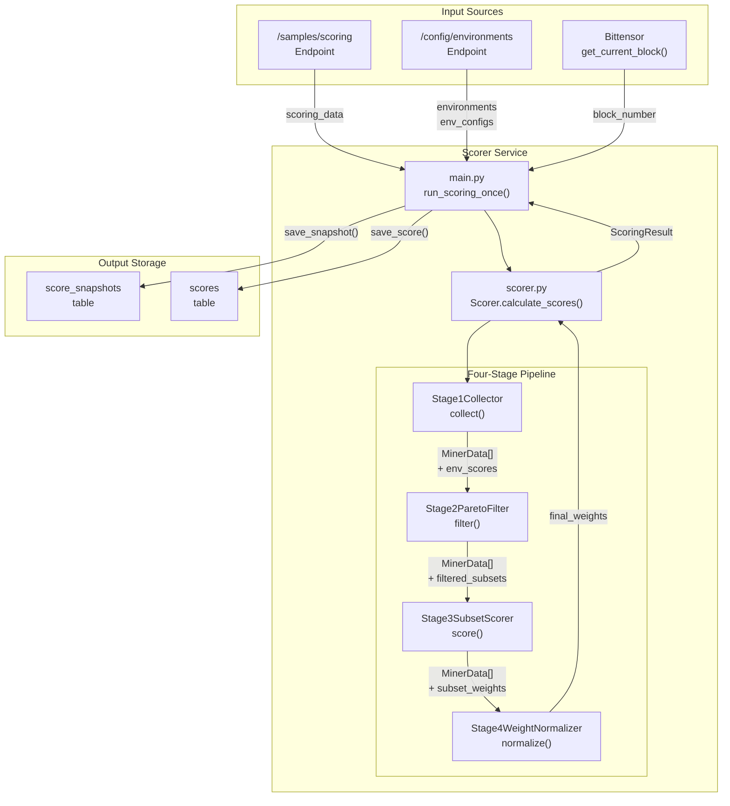
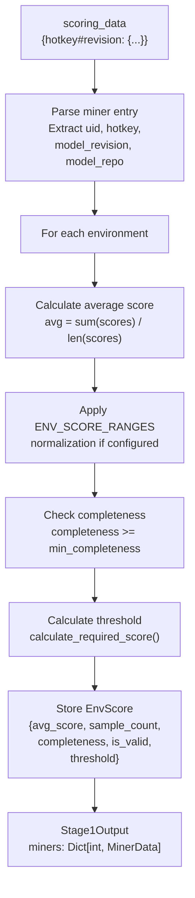
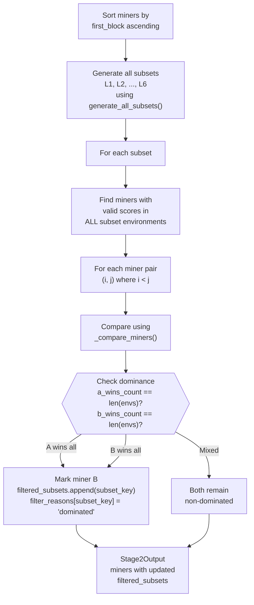
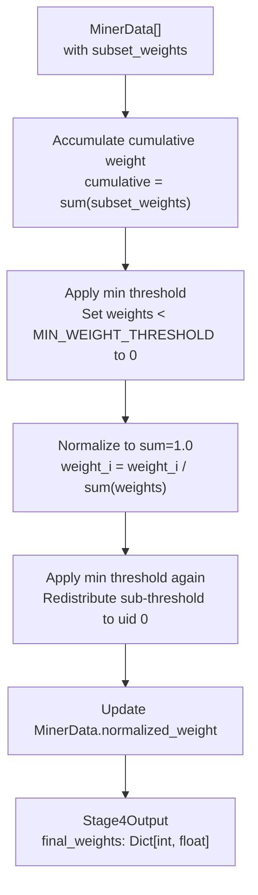

import CollapsibleAside from '../../../../components/CollapsibleAside.astro';
import SourceLink from '../../../../components/SourceLink.astro';
import Table from '../../../../components/Table.astro';

<CollapsibleAside title="Relevant Source Files">
  <SourceLink text="affine/api/config.py" href="https://github.com/AffineFoundation/affine-cortex/blob/main/affine/api/config.py" />
  <SourceLink text="affine/api/models.py" href="https://github.com/AffineFoundation/affine-cortex/blob/main/affine/api/models.py" />
  <SourceLink text="affine/api/routers/scores.py" href="https://github.com/AffineFoundation/affine-cortex/blob/main/affine/api/routers/scores.py" />
  <SourceLink text="affine/src/miner/rank.py" href="https://github.com/AffineFoundation/affine-cortex/blob/main/affine/src/miner/rank.py" />
  <SourceLink text="affine/src/scorer/config.py" href="https://github.com/AffineFoundation/affine-cortex/blob/main/affine/src/scorer/config.py" />
  <SourceLink text="affine/src/scorer/main.py" href="https://github.com/AffineFoundation/affine-cortex/blob/main/affine/src/scorer/main.py" />
  <SourceLink text="affine/src/scorer/models.py" href="https://github.com/AffineFoundation/affine-cortex/blob/main/affine/src/scorer/models.py" />
  <SourceLink text="affine/src/scorer/scorer.py" href="https://github.com/AffineFoundation/affine-cortex/blob/main/affine/src/scorer/scorer.py" />
  <SourceLink text="affine/src/scorer/stage1_collector.py" href="https://github.com/AffineFoundation/affine-cortex/blob/main/affine/src/scorer/stage1_collector.py" />
  <SourceLink text="affine/src/scorer/stage2_pareto.py" href="https://github.com/AffineFoundation/affine-cortex/blob/main/affine/src/scorer/stage2_pareto.py" />
  <SourceLink text="affine/src/scorer/stage4_weights.py" href="https://github.com/AffineFoundation/affine-cortex/blob/main/affine/src/scorer/stage4_weights.py" />
  <SourceLink text="affine/src/scorer/utils.py" href="https://github.com/AffineFoundation/affine-cortex/blob/main/affine/src/scorer/utils.py" />
</CollapsibleAside>

## Purpose and Scope

The Scorer Service calculates normalized weights for miners using a sophisticated four-stage scoring algorithm. It fetches completed sample results from the API, applies multi-environment performance analysis with Pareto dominance filtering, and produces normalized weights suitable for on-chain distribution. The service can run as a one-time calculation or as a continuous background service.

This page documents the scoring algorithm implementation, configuration parameters, and integration points. For information about how weights are used by validators, see [Validator Overview](/subnets/for-validators/validator-overview#5.1). For details about task execution that produces the sample data, see [Executor Service](/subnets/backend-services-deep-dive/executor-service#11.4).

**Sources:** [affine/src/scorer/main.py:1-283](), [affine/src/scorer/scorer.py:1-232]()

---

## Service Architecture

### Execution Modes

The Scorer supports two execution modes controlled by the `SERVICE_MODE` environment variable:

<Table>

| Mode | Behavior | Use Case |
|------|----------|----------|
| **One-time** (default) | Executes scoring once and exits | Manual scoring calculations, testing, debugging |
| **Service** (`SERVICE_MODE=true`) | Runs continuously at configured intervals | Production validator deployment |

</Table>


**Configuration Environment Variables:**

<Table>

| Variable | Default | Description |
|----------|---------|-------------|
| `SCORER_SAVE_TO_DB` | `false` | Enable database persistence of results |
| `SERVICE_MODE` | `false` | Run as continuous service vs one-time |
| `SCORER_INTERVAL_MINUTES` | `10` | Minutes between scoring runs in service mode |

</Table>


The service uses the CLI API client context manager for automatic connection cleanup in both modes.

**Sources:** [affine/src/scorer/main.py:94-215](), [affine/src/scorer/main.py:217-280]()

---

### Data Flow



**Data Structures:**

- **`scoring_data`**: Dict mapping `"hotkey#revision"` to miner entries with environment samples
- **`MinerData`**: Dataclass tracking scores, filtering, and weights for a single miner
- **`ScoringResult`**: Complete output containing all miners, final weights, and metadata

**Sources:** [affine/src/scorer/main.py:94-159](), [affine/src/scorer/scorer.py:46-108]()

---

## Four-Stage Scoring Algorithm

### Algorithm Overview

```mermaid
graph LR
    subgraph "Stage 1: Data Collection"
        S1Input["scoring_data<br/>from API"]
        S1Process["Calculate avg_score<br/>Validate completeness<br/>Calculate thresholds"]
        S1Output["MinerData.env_scores<br/>{env: EnvScore}"]
        S1Input --> S1Process --> S1Output
    end
    
    subgraph "Stage 2: Pareto Filter"
        S2Input["MinerData[]<br/>sorted by first_block"]
        S2Process["Pairwise comparisons<br/>Threshold-based dominance<br/>Filter dominated miners"]
        S2Output["MinerData.filtered_subsets[]"]
        S2Input --> S2Process --> S2Output
    end
    
    subgraph "Stage 3: Subset Scoring"
        S3Input["Generate subsets<br/>L1, L2, ..., L6"]
        S3Process["Geometric mean<br/>Rank decay<br/>Weight distribution"]
        S3Output["MinerData.subset_weights<br/>MinerData.layer_weights"]
        S3Input --> S3Process --> S3Output
    end
    
    subgraph "Stage 4: Normalization"
        S4Input["Sum subset_weights"]
        S4Process["Apply MIN_WEIGHT_THRESHOLD<br/>Normalize to sum=1.0<br/>Redistribute to uid 0"]
        S4Output["final_weights<br/>{uid: weight}"]
        S4Input --> S4Process --> S4Output
    end
    
    S1Output --> S2Input
    S2Output --> S3Input
    S3Output --> S4Input
```



The algorithm processes miners through four distinct stages, each building on the previous stage's output. All stages use the `ScorerConfig` class for parameter configuration.

**Sources:** [affine/src/scorer/scorer.py:20-108](), [affine/src/scorer/config.py:11-163]()

---

## Stage 1: Data Collection

### Purpose

Stage 1 collects sample results from the API and calculates average scores per environment for each miner. It validates sample completeness and computes sample-size-aware thresholds for later stages.

### Implementation

**Class:** `Stage1Collector` in [affine/src/scorer/stage1_collector.py:20-230]()

**Key Method:** `collect(scoring_data, environments, env_configs)` returns `Stage1Output`

### Data Processing Steps



### Completeness Validation

Miners must achieve minimum completeness per environment to be considered valid:

- **Global Default:** `MIN_COMPLETENESS = 0.9` (90%)
- **Environment-Specific:** Can override via `env_configs[env_name]["min_completeness"]`

The completeness check prevents miners from gaming the system by selectively completing only easy tasks.

**Sources:** [affine/src/scorer/stage1_collector.py:39-229](), [affine/src/scorer/config.py:109-111]()

---

### Threshold Calculation

Thresholds are calculated using a sample-size-aware statistical approach:

```python
def calculate_required_score(
    prior_score: float,
    prior_sample_count: int,
    z_score: float = 1.5,
    min_improvement: float = 0.02,
    max_improvement: float = 0.10
) -> float
```

**Formula:**

1. Calculate standard error: `SE = sqrt(p * (1-p) / n)`
2. Calculate gap: `gap = z_score * SE`
3. Apply bounds: `gap = clamp(gap, min_improvement, max_improvement)`
4. Return threshold: `threshold = min(prior_score + gap, 1.0)`

**Behavior:**

<Table>

| Sample Count | SE | Gap (z=1.5) | Interpretation |
|-------------|-----|-------------|----------------|
| 50 | 0.0707 | 0.10 (capped) | Harder to beat (less data) |
| 100 | 0.05 | 0.075 | Moderate |
| 500 | 0.0224 | 0.0336 | Easier to beat (more data) |

</Table>


This adaptive threshold makes it progressively easier to beat miners with larger sample counts, incentivizing consistent performance across all tasks.

**Environment-Specific Overrides:**

The `ENV_THRESHOLD_CONFIGS` dictionary allows per-environment difficulty tuning:

```python
ENV_THRESHOLD_CONFIGS = {
    'GAME': {'z_score': 1},      # easier to beat
    'PRINT': {'z_score': 2.0},   # harder to beat
    'SWE-SYNTH': {'z_score': 2.0}
}
```

**Sources:** [affine/src/scorer/utils.py:160-224](), [affine/src/scorer/stage1_collector.py:178-191](), [affine/src/scorer/config.py:119-127]()

---

### Score Normalization

Some environments return scores outside the [0, 1] range. The `ENV_SCORE_RANGES` configuration enables normalization:

```python
ENV_SCORE_RANGES = {
    'agentgym:sciworld': (-100, 100.0)
}
```

Normalized score: `(raw_score - min_score) / (max_score - min_score)`

**Sources:** [affine/src/scorer/config.py:113-117](), [affine/src/scorer/stage1_collector.py:165-169]()

---

## Stage 2: Pareto Filtering

### Purpose

Stage 2 applies Pareto dominance-based anti-plagiarism filtering. It detects models that were copied (or fine-tuned from copies) and submitted later by comparing their performance across all environments in each subset.

### Dominance Rule

For miners A and B where A registered first (`first_block_A &lt; first_block_B`):

**B is dominated by A (and filtered) if:**
- A wins in **ALL** environments within the subset

**Winner determination per environment:**
- **B wins** if `score_B > threshold_A` (exceeds A's sample-size-aware threshold)
- **A wins** otherwise

This strict "all environments" requirement prevents filtering based on partial improvements. A later miner must genuinely outperform across the board to avoid being classified as plagiarism.

**Sources:** [affine/src/scorer/stage2_pareto.py:19-215]()

---

### Implementation

**Class:** `Stage2ParetoFilter` in [affine/src/scorer/stage2_pareto.py:19-215]()

**Key Method:** `filter(miners, subsets)` returns `Stage2Output`



### Comparison Logic

Per-environment comparison in `_compare_miners()`:

```python
# Get scores
score_a = miner_a.env_scores[env].avg_score
score_b = miner_b.env_scores[env].avg_score
threshold = miner_a.env_scores[env].threshold  # Pre-calculated in Stage 1

# Determine winner (with epsilon for floating point safety)
b_wins_env = score_b > (threshold + 1e-9)

# Aggregate across all environments
a_dominates_b = (a_wins_count == len(envs))  # A wins ALL
b_dominates_a = (b_wins_count == len(envs))  # B wins ALL
```

The `ParetoComparison` dataclass stores detailed results for each comparison, including per-environment scores and thresholds for debugging.

**Sources:** [affine/src/scorer/stage2_pareto.py:42-137](), [affine/src/scorer/stage2_pareto.py:139-214]()

---

### Filtered Subsets Tracking

Each `MinerData` object maintains:

- **`filtered_subsets: List[str]`**: List of subset keys where miner was dominated
- **`filter_reasons: Dict[str, str]`**: Reason for each filtering (always `"dominated"`)

Miners filtered from a subset do not contribute to that subset's scoring in Stage 3, but can still participate in other subsets where they are not dominated.

**Sources:** [affine/src/scorer/models.py:39-40](), [affine/src/scorer/stage2_pareto.py:118-126]()

---

## Stage 3: Subset Scoring

### Purpose

Stage 3 calculates weighted scores for miners across all environment subsets. It uses geometric means for robustness, applies rank-based decay to reward top performers, and distributes exponentially increasing weights to higher-layer subsets.

### Subset Generation

**Function:** `generate_all_subsets(envs, max_layers)` in [affine/src/scorer/utils.py:12-61]()

Generates all possible combinations of environments up to `MAX_LAYERS`:

<Table>

| Layer | Description | Example (3 envs) | Count |
|-------|-------------|------------------|-------|
| L1 | Single environments | `["SAT"]`, `["DED"]`, `["LGC"]` | 3 |
| L2 | Pairs | `["SAT", "DED"]`, `["SAT", "LGC"]`, ... | 3 |
| L3 | All three | `["SAT", "DED", "LGC"]` | 1 |

</Table>


**MAX_LAYERS Limiting:**

When `total_envs > MAX_LAYERS` (e.g., 8 envs but MAX_LAYERS=6):
- Only top 6 layers are evaluated (L3, L4, L5, L6, L7, L8)
- Skip lower layers (L1, L2) to prevent exponential growth

This exponential weight distribution (explained below) ensures that performance on higher layers dominates the final weight.

**Sources:** [affine/src/scorer/utils.py:12-61](), [affine/src/scorer/config.py:65-66]()

---

### Layer Weight Distribution

**Function:** `calculate_layer_weights(n_envs, base, start_layer)` in [affine/src/scorer/utils.py:64-84]()

Layer weights grow exponentially:

```
layer_weight = N × base^(layer_index)
where layer_index = layer - start_layer
```

**Example (6 environments, base=2, start_layer=1):**

<Table>

| Layer | Formula | Weight | Ratio to L1 |
|-------|---------|--------|-------------|
| L1 | 6 × 2^0 | 6 | 1× |
| L2 | 6 × 2^1 | 12 | 2× |
| L3 | 6 × 2^2 | 24 | 4× |
| L4 | 6 × 2^3 | 48 | 8× |
| L5 | 6 × 2^4 | 96 | 16× |
| L6 | 6 × 2^5 | 192 | 32× |

</Table>


This design heavily rewards miners that perform well across many environments simultaneously.

**Subset Weight Distribution:**

Each subset within a layer receives an equal share:

```
subset_weight = layer_weight / num_subsets_in_layer
```

**Sources:** [affine/src/scorer/utils.py:64-117](), [affine/src/scorer/config.py:68-72]()

---

### Geometric Mean Scoring

For each subset, calculate the geometric mean of environment scores:

```python
def geometric_mean(values, epsilon=0.0):
    if epsilon > 0:
        # Smoothed: GM = ((v1+ε) × (v2+ε) × ... × (vn+ε))^(1/n) - ε
        product = 1.0
        for v in values:
            product *= (v + epsilon)
        return max(product ** (1.0 / n) - epsilon, 0.0)
    else:
        # Standard: any zero collapses to 0
        if any(v <= 0 for v in values):
            return 0.0
        product = 1.0
        for v in values:
            product *= v
        return product ** (1.0 / n)
```

**Why Geometric Mean?**

- **Robustness:** Penalizes miners that excel in some environments but fail in others
- **Balance:** Encourages consistent performance across all environments
- **Smoothing:** The `GEOMETRIC_MEAN_EPSILON = 0.01` parameter prevents new environments with zero initial scores from collapsing all scores to zero

**Sources:** [affine/src/scorer/utils.py:120-158](), [affine/src/scorer/config.py:74-89]()

---

### Rank-Based Decay

Within each subset, miners are ranked by their geometric mean scores. The rank-based decay applies:

```
adjusted_score = geometric_mean × decay_factor^(rank - 1)
```

**Example (decay_factor=0.5):**

<Table>

| Rank | Geometric Mean | Multiplier | Adjusted Score |
|------|---------------|------------|----------------|
| 1 | 0.85 | 1.0 | 0.85 |
| 2 | 0.80 | 0.5 | 0.40 |
| 3 | 0.75 | 0.25 | 0.1875 |
| 4 | 0.70 | 0.125 | 0.0875 |

</Table>


**Final Weight Contribution:**

```
subset_weight_contribution = adjusted_score × subset_weight × (1 / sum_adjusted_scores)
```

This rank decay creates a "winner takes most" effect within each subset, incentivizing miners to optimize for top performance rather than mediocrity.

**Sources:** [affine/src/scorer/config.py:91-102]()

---

### Stage 3 Output

Each `MinerData` object is updated with:

- **`subset_scores: Dict[str, float]`**: Geometric mean score for each subset
- **`subset_ranks: Dict[str, int]`**: Rank within each subset (1 = best)
- **`subset_weights: Dict[str, float]`**: Weight contribution from each subset
- **`layer_weights: Dict[int, float]`**: Aggregated weight by layer number

The `Stage3Output` also includes `subsets: Dict[str, SubsetInfo]` with metadata about each subset's participants.

**Sources:** [affine/src/scorer/models.py:42-45]()

---

## Stage 4: Weight Normalization

### Purpose

Stage 4 aggregates subset weight contributions, applies a minimum weight threshold to remove low-performing miners, and normalizes final weights to sum to 1.0 for on-chain distribution.

### Implementation

**Class:** `Stage4WeightNormalizer` in [affine/src/scorer/stage4_weights.py:22-198]()

**Key Method:** `normalize(miners)` returns `Stage4Output`

### Normalization Steps



**Sources:** [affine/src/scorer/stage4_weights.py:41-102]()

---

### Minimum Weight Threshold

**Configuration:** `MIN_WEIGHT_THRESHOLD = 0.01` (1%)

The threshold is applied **twice**:

1. **Before normalization:** Remove miners with cumulative weight &lt; 1%
2. **After normalization:** Remove miners with normalized weight &lt; 1%, redistribute to uid 0

**Redistribution Logic:**

```python
def apply_min_threshold(
    weights: Dict[int, float],
    threshold: float = 0.01,
    redistribute_to_uid_zero: bool = False
) -> Dict[int, float]
```

When `redistribute_to_uid_zero=True` (second application):
- Calculate total weight from miners below threshold (excluding uid 0)
- Set their weights to 0
- Add redistributed weight to uid 0

This ensures no weight is lost and the validator's uid 0 captures value from negligible contributors.

**Sources:** [affine/src/scorer/utils.py:243-281](), [affine/src/scorer/stage4_weights.py:65-89](), [affine/src/scorer/config.py:105-106]()

---

### Output Table

Stage 4 generates a detailed summary table via `print_detailed_table()`:

**Table Structure:**

```
Hotkey   | UID | Model                | FirstBlk | SAT                  | DED                  | ... | L1     | L2     | ... | Total    | Weight    | V
-------- | --- | -------------------- | -------- | -------------------- | -------------------- | --- | ------ | ------ | --- | -------- | --------- | -
5abc...  |   5 | model-name           |  1234567 | 92.30[94.84]/500     | 85.12[87.44]/498     | ... | 0.1234 | 0.2456 | ... | 0.4567   | 0.123456  | ✓
```

**Column Definitions:**

- **Hotkey:** First 8 characters of miner hotkey
- **UID:** Miner UID (0-255)
- **Model:** Model repository name (truncated to 20 chars)
- **FirstBlk:** Block number when miner first registered
- **Environment Columns:** `score[threshold]/count(!)`
  - Score: Average score × 100 (percentage)
  - Threshold: Required threshold × 100 (percentage)
  - Count: Number of completed samples
  - `!` suffix: Insufficient completeness (&lt; min_completeness)
- **Layer Columns (L1, L2, ...)**: Weight contribution from each layer
- **Total:** Cumulative weight (sum of subset weights)
- **Weight:** Normalized final weight (0 to 1, sums to 1.0 across all miners)
- **V:** Valid indicator (✓ if has any valid environment)

**Sources:** [affine/src/scorer/stage4_weights.py:105-198]()

---

## Configuration Reference

### ScorerConfig Class

All scoring parameters are defined as class constants in [affine/src/scorer/config.py:11-163]().

**Stage 2: Pareto Filtering**

<Table>

| Parameter | Default | Description |
|-----------|---------|-------------|
| `Z_SCORE` | 1.5 | Confidence level for threshold calculation (~87% confidence) |
| `MIN_IMPROVEMENT` | 0.02 | Minimum gap to prevent noise (2%) |
| `MAX_IMPROVEMENT` | 0.10 | Maximum gap cap (10%) |
| `SCORE_PRECISION` | 3 | Decimal places for score comparison |

</Table>


**Stage 3: Subset Scoring**

<Table>

| Parameter | Default | Description |
|-----------|---------|-------------|
| `MAX_LAYERS` | 6 | Maximum number of layers (prevents exponential growth) |
| `SUBSET_WEIGHT_BASE` | 1 | Base weight multiplier (N for L1) |
| `SUBSET_WEIGHT_EXPONENT` | 2 | Exponent base (weight = N × 2^(layer-1)) |
| `GEOMETRIC_MEAN_EPSILON` | 0.01 | Smoothing offset for geometric mean |
| `DECAY_FACTOR` | 0.5 | Rank-based decay (0.5 = 50% per rank) |

</Table>


**Stage 4: Normalization**

<Table>

| Parameter | Default | Description |
|-----------|---------|-------------|
| `MIN_WEIGHT_THRESHOLD` | 0.01 | Minimum weight threshold (1%) |

</Table>


**Stage 1: Data Collection**

<Table>

| Parameter | Default | Description |
|-----------|---------|-------------|
| `MIN_COMPLETENESS` | 0.9 | Default minimum sample completeness (90%) |

</Table>


**Environment-Specific Overrides**

<Table>

| Parameter | Type | Description |
|-----------|------|-------------|
| `ENV_SCORE_RANGES` | `Dict[str, tuple]` | Score normalization ranges |
| `ENV_THRESHOLD_CONFIGS` | `Dict[str, Dict]` | Per-environment threshold difficulty |

</Table>


**Database & Storage**

<Table>

| Parameter | Default | Description |
|-----------|---------|-------------|
| `SCORE_RECORD_TTL_DAYS` | 30 | TTL for score_snapshots table |

</Table>


**Sources:** [affine/src/scorer/config.py:11-163]()

---

### Configuration Export

The `ScorerConfig.to_dict()` method exports all parameters for storage in score snapshots:

```python
config_snapshot = {
    'z_score': 1.5,
    'min_improvement': 0.02,
    'max_improvement': 0.10,
    'score_precision': 3,
    'max_layers': 6,
    'subset_weight_base': 1,
    'subset_weight_exponent': 2,
    'decay_factor': 0.5,
    'min_weight_threshold': 0.01,
    'min_completeness': 0.9,
    'geometric_mean_epsilon': 0.01,
}
```

This ensures reproducibility by storing the exact configuration used for each scoring calculation.

**Sources:** [affine/src/scorer/config.py:133-148]()

---

## Database Storage

### Tables Written

The Scorer saves results to two DynamoDB tables:

#### 1. score_snapshots Table

Stores high-level metadata about each scoring calculation.

**Key Method:** `ScoreSnapshotsDAO.save_snapshot()` called from [affine/src/scorer/scorer.py:140-145]()

**Structure:**

```python
{
    'block_number': 12345,
    'scorer_hotkey': 'scorer_service',
    'calculated_at': 1234567890,  # Unix timestamp
    'config': {
        'z_score': 1.5,
        'min_improvement': 0.02,
        # ... all ScorerConfig parameters
    },
    'statistics': {
        'total_miners': 50,
        'valid_miners': 42,
        'invalid_miners': 8,
        'miner_final_scores': {
            '0': 0.15,
            '1': 0.12,
            '2': 0.10,
            # ... normalized weights for all miners
        }
    }
}
```

**Purpose:** Quick lookup of latest weights for validator weight setting.

**Sources:** [affine/src/scorer/scorer.py:129-145]()

---

#### 2. scores Table

Stores detailed scoring data for each miner, including per-environment scores, layer weights, subset contributions, and filter information.

**Key Method:** `ScoresDAO.save_score()` called from [affine/src/scorer/scorer.py:199-215]()

**Structure:**

```python
{
    'block_number': 12345,
    'miner_hotkey': '5abc...',
    'uid': 5,
    'model_revision': 'abc123...',
    'model': 'username/model-name',
    'first_block': 1234567,
    'overall_score': 0.123456,  # Normalized weight
    'average_score': 0.85,      # Average across environments
    'scores_by_layer': {
        'L1': 0.0234,
        'L2': 0.0456,
        'L3': 0.0567,
        # ... weights from each layer
    },
    'scores_by_env': {
        'affine:sat': {
            'score': 0.9230,
            'sample_count': 500,
            'completeness': 0.996,
            'threshold': 0.9484
        },
        'affine:ded': {
            'score': 0.8512,
            'sample_count': 498,
            'completeness': 0.992,
            'threshold': 0.8744
        },
        # ... all environments
    },
    'total_samples': 2994,
    'subset_contributions': {
        'L1_sat': {
            'score': 0.9230,
            'rank': 2,
            'weight': 0.0234
        },
        'L2_sat_ded': {
            'score': 0.8856,
            'rank': 1,
            'weight': 0.0456
        },
        # ... all subsets
    },
    'cumulative_weight': 0.4567,  # Sum before normalization
    'filter_info': {
        'filtered_subsets': ['L2_sat_game'],
        'filter_reasons': {
            'L2_sat_game': 'dominated'
        }
    }
}
```

**Purpose:** Detailed analysis, debugging, and historical record of scoring calculations.

**Sources:** [affine/src/scorer/scorer.py:148-216]()

---

### TTL Policy

The `score_snapshots` table has a TTL of 30 days configured via `SCORE_RECORD_TTL_DAYS`. This automatically removes old snapshots to manage storage costs.

**Sources:** [affine/src/scorer/config.py:130-131]()

---

## API Integration

### Data Fetching

The Scorer fetches data from two API endpoints:

#### GET /samples/scoring

Returns aggregated sample results for all miners with completeness information.

**Function:** `fetch_scoring_data(api_client, range_type)` in [affine/src/scorer/main.py:23-40]()

**Query Parameters:**
- `range_type`: `"scoring"` (default) or `"sampling"`
  - Controls which dataset range to use (scoring vs sampling environments)

**Response Format:**

```python
{
    "5abc...#revision123": {
        "uid": 5,
        "hotkey": "5abc...",
        "model_revision": "revision123",
        "model_repo": "username/model-name",
        "first_block": 1234567,
        "env": {
            "affine:sat": {
                "samples": [
                    {"task_id": 1, "score": 0.95, ...},
                    {"task_id": 2, "score": 0.90, ...},
                    # ...
                ],
                "total_count": 500,
                "completed_count": 498,
                "completeness": 0.996
            },
            "affine:ded": {
                # ...
            }
        }
    },
    # ... more miners
}
```

**Error Handling:**

The function checks for API error responses and raises `RuntimeError` if unsuccessful.

**Sources:** [affine/src/scorer/main.py:23-40]()

---

#### GET /config/environments

Returns system configuration with enabled environments.

**Function:** `fetch_system_config(api_client, range_type)` in [affine/src/scorer/main.py:43-91]()

**Query Parameters:**
- `range_type`: Filters environments by `enabled_for_scoring` (default) or `enabled_for_sampling`

**Response Format:**

```python
{
    "param_value": {
        "affine:sat": {
            "enabled_for_scoring": true,
            "enabled_for_sampling": true,
            "min_completeness": 0.9,
            # ... other env config
        },
        "affine:ded": {
            # ...
        }
    }
}
```

**Returned Structure:**

```python
{
    "environments": ["affine:sat", "affine:ded", ...],
    "env_configs": {
        "affine:sat": {"min_completeness": 0.9, ...},
        "affine:ded": {"min_completeness": 0.95, ...}
    }
}
```

**Sources:** [affine/src/scorer/main.py:43-91]()

---

### Weight Retrieval

Validators query the latest weights via the API:

#### GET /scores/weights/latest

Returns the most recent normalized weights suitable for on-chain setting.

**Endpoint:** [affine/api/routers/scores.py:158-225]()

**Response Format:**

```python
{
    "block_number": 12345,
    "config": {
        "z_score": 1.5,
        "min_improvement": 0.02,
        # ... all configuration parameters
    },
    "weights": {
        "0": {"weight": 0.15},
        "1": {"weight": 0.12},
        "2": {"weight": 0.10},
        # ... all UIDs with non-zero weights
    }
}
```

**Usage:**

Validators use this endpoint to fetch weights before calling `set_weights()` on the Bittensor blockchain.

**Sources:** [affine/api/routers/scores.py:158-225]()

---

#### GET /scores/latest

Returns detailed scores for top N miners.

**Endpoint:** [affine/api/routers/scores.py:25-86]()

**Query Parameters:**
- `top`: Number of miners to return (default: 32, max: 256)

**Response Model:** `ScoresResponse` in [affine/api/models.py:96-102]()

```python
{
    "block_number": 12345,
    "calculated_at": 1234567890,
    "scores": [
        {
            "miner_hotkey": "5abc...",
            "uid": 5,
            "model_revision": "revision123",
            "model": "username/model-name",
            "first_block": 1234567,
            "overall_score": 0.123456,
            "average_score": 0.85,
            "scores_by_layer": {
                "L1": 0.0234,
                "L2": 0.0456,
                # ...
            },
            "scores_by_env": {
                "affine:sat": {
                    "score": 0.9230,
                    "sample_count": 500,
                    "completeness": 0.996,
                    "threshold": 0.9484
                },
                # ...
            },
            "total_samples": 2994,
            "cumulative_weight": 0.4567
        },
        # ... more miners
    ]
}
```

**Sources:** [affine/api/routers/scores.py:25-86](), [affine/api/models.py:80-94]()

---

## Scoring Result Data Model

### ScoringResult Class

The `ScoringResult` dataclass encapsulates the complete output of the scoring algorithm.

**Definition:** [affine/src/scorer/models.py:109-163]()

**Fields:**

<Table>

| Field | Type | Description |
|-------|------|-------------|
| `block_number` | int | Current block number from Bittensor |
| `calculated_at` | int | Unix timestamp of calculation |
| `environments` | List[str] | List of environment names |
| `config` | Dict[str, Any] | Snapshot of ScorerConfig parameters |
| `miners` | Dict[int, MinerData] | All miner data with scores |
| `pareto_comparisons` | List[ParetoComparison] | Stage 2 comparison results |
| `subsets` | Dict[str, SubsetInfo] | Stage 3 subset metadata |
| `final_weights` | Dict[int, float] | Stage 4 normalized weights |
| `total_miners` | int | Total miners in scoring data |
| `valid_miners` | int | Miners with valid environments |
| `invalid_miners` | int | Miners with no valid environments |

</Table>


**Helper Methods:**

```python
# Get weights for on-chain setting
weights = result.get_weights_for_chain()  # Returns Dict[int, float]

# Get summary statistics
summary = result.get_summary()  # Returns Dict[str, Any]
```

**Sources:** [affine/src/scorer/models.py:109-163]()

---

### MinerData Class

Tracks complete scoring state for a single miner.

**Definition:** [affine/src/scorer/models.py:26-62]()

**Stage-Specific Fields:**

<Table>

| Stage | Fields | Description |
|-------|--------|-------------|
| Stage 1 | `env_scores: Dict[str, EnvScore]` | Average scores per environment |
| Stage 2 | `filtered_subsets: List[str]`<br/>`filter_reasons: Dict[str, str]` | Pareto filtering results |
| Stage 3 | `subset_scores: Dict[str, float]`<br/>`subset_ranks: Dict[str, int]`<br/>`subset_weights: Dict[str, float]` | Geometric means, ranks, weight contributions |
| Stage 4 | `layer_weights: Dict[str, float]`<br/>`cumulative_weight: float`<br/>`normalized_weight: float` | Aggregated and normalized weights |

</Table>


**Helper Methods:**

```python
# Check if miner has any valid environment
is_valid = miner.is_valid_for_scoring()  # Returns bool

# Get list of valid environment names
valid_envs = miner.get_valid_envs()  # Returns List[str]
```

**Sources:** [affine/src/scorer/models.py:26-62]()

---

## CLI and Rank Display

### Miner Rank Command

The `af miner get-rank` command fetches and displays the scoring table in the same format as the Scorer's internal `print_detailed_table()`.

**Implementation:** [affine/src/miner/rank.py:117-261]()

**Function Call Chain:**

```
get_rank_command()
  → print_rank_table()
    → fetch_latest_scores(client)  # GET /scores/latest?top=256
    → fetch_environments(client)   # GET /config/environments
    → fetch_scorer_config(client)  # GET /scores/weights/latest
```

**Output Format:**

Identical to Stage 4's `print_detailed_table()` with the same column structure:
- Hotkey, UID, Model, FirstBlk
- Per-environment scores with `score[threshold]/count(!)`
- Layer weights (L1, L2, ...)
- Total cumulative weight
- Normalized final weight
- Valid indicator (✓/✗)

This allows miners to view their ranking without running the full scoring algorithm.

**Sources:** [affine/src/miner/rank.py:117-261]()

---

## Performance Considerations

### Computational Complexity

**Stage 1:** O(M × E) - Linear in miners and environments

**Stage 2:** O(S × M²) - Quadratic in miners, linear in subsets
- Most expensive stage
- Number of comparisons: `S × (M × (M-1)) / 2`
- Example: 50 miners, 63 subsets → ~78,750 comparisons

**Stage 3:** O(S × M × log(M)) - Subset scoring with sorting

**Stage 4:** O(M) - Linear normalization

**Overall:** Dominated by Stage 2's O(S × M²) complexity.

---

### Optimization Strategies

**Caching:**
- `EnvScore.threshold` is calculated once in Stage 1 and reused in Stage 2
- API client uses `aiohttp.ClientSession` for connection pooling

**Lazy Evaluation:**
- Subsets are only generated for miners with valid scores in all subset environments
- Early termination in Pareto comparisons when non-dominance is detected

**Batch Processing:**
- All miners processed in a single scoring run
- Results saved to database in batch

**Sources:** [affine/src/scorer/stage1_collector.py:178-191](), [affine/src/scorer/stage2_pareto.py:78-91]()

---

## Error Handling

### API Error Responses

All API fetching functions check for error response format:

```python
if isinstance(data, dict) and "success" in data and data.get("success") is False:
    error_msg = data.get("error", "Unknown API error")
    status_code = data.get("status_code", "unknown")
    raise RuntimeError(f"Failed to fetch data: {error_msg}")
```

This prevents the scorer from processing invalid data and provides clear error messages.

**Sources:** [affine/src/scorer/main.py:33-38](), [affine/src/scorer/stage1_collector.py:80-85]()

---

### Validation Checks

**Stage 1:**
- Validates UID is present and numeric
- Checks required fields (hotkey, model_revision, model_repo)
- Validates completeness percentage is in [0, 1]

**Stage 2:**
- Skips subsets with fewer than 2 valid miners
- Handles floating-point comparison with epsilon (1e-9)

**Stage 4:**
- Ensures final weights sum to 1.0 (within floating-point precision)
- Validates threshold is in [0, 1]

**Configuration:**
- `ScorerConfig.validate()` runs on import to catch invalid parameters

**Sources:** [affine/src/scorer/stage1_collector.py:103-125](), [affine/src/scorer/stage2_pareto.py:89-91](), [affine/src/scorer/config.py:151-162]()

---

## Service Deployment

### Docker Compose Configuration

The Scorer runs as a Docker service defined in `docker-compose.backend.yml`.

**Service Configuration:**

```yaml
scorer:
  image: affinefoundation/affine:latest
  command: af servers scorer
  environment:
    - SERVICE_MODE=true
    - SCORER_SAVE_TO_DB=true
    - SCORER_INTERVAL_MINUTES=60
    - API_URL=http://api:8000/api/v1
  depends_on:
    api:
      condition: service_healthy
  restart: unless-stopped
```

**Key Points:**

- **Dependency:** Waits for API service health check before starting
- **Service Mode:** Runs continuously with 60-minute intervals
- **Database Saving:** Persists results to DynamoDB
- **Internal API:** Uses internal Docker network (http://api:8000)

**Sources:** Referenced from high-level diagram and general Docker deployment patterns

---

### Manual Execution

For one-time scoring calculations:

```bash
# Run once and exit (default)
af -v servers scorer

# Use sampling environments instead of scoring environments
af -v servers scorer --sampling

# Enable database saving
SCORER_SAVE_TO_DB=true af servers scorer

# Run in service mode with custom interval
SERVICE_MODE=true SCORER_INTERVAL_MINUTES=30 af servers scorer
```

**Sources:** [affine/src/scorer/main.py:217-279]()

---

## Troubleshooting

### Common Issues

**Issue:** No miners scored

**Causes:**
- No sample results in database
- All miners below minimum completeness threshold
- API endpoint unreachable

**Solution:**
- Check API logs for `/samples/scoring` endpoint errors
- Verify sample results exist in database
- Review `min_completeness` thresholds in environment configs

---

**Issue:** All weights are zero

**Causes:**
- All miners filtered by Pareto dominance
- Cumulative weights below `MIN_WEIGHT_THRESHOLD`
- Invalid environment scores (NaN or negative)

**Solution:**
- Check Stage 2 debug logs for dominance filtering
- Review `MIN_WEIGHT_THRESHOLD` configuration
- Validate sample data quality

---

**Issue:** Scoring takes too long

**Causes:**
- Large number of miners (Stage 2 complexity is O(M²))
- Many environments (exponential subset growth)
- Network latency to API

**Solution:**
- Increase `SCORER_INTERVAL_MINUTES` in service mode
- Reduce `MAX_LAYERS` to limit subset count
- Use local API deployment

**Sources:** Based on algorithm complexity analysis and common deployment scenarios
