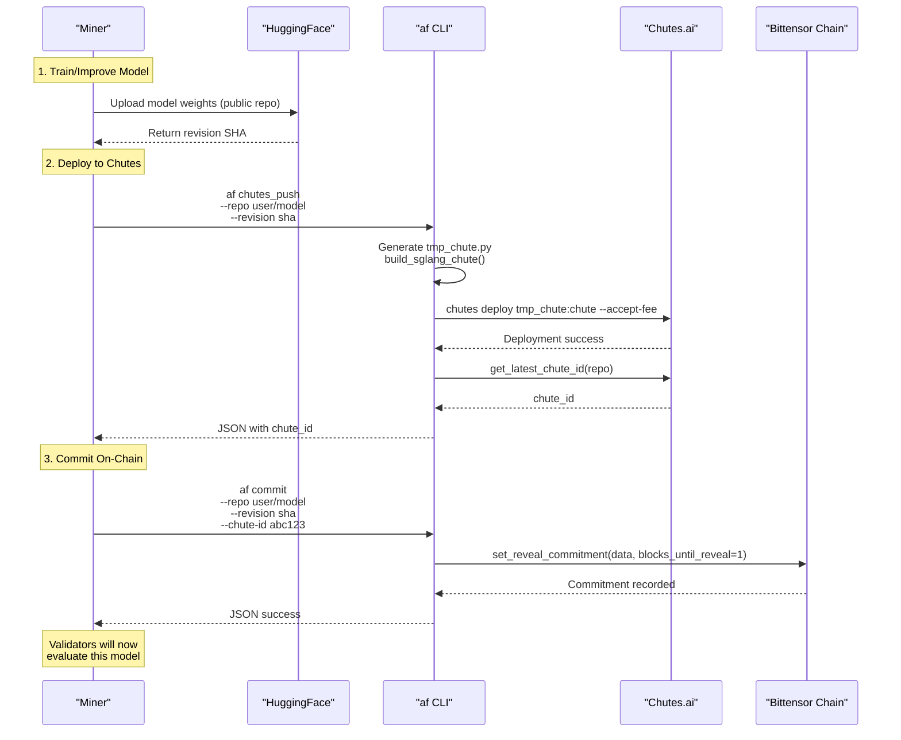
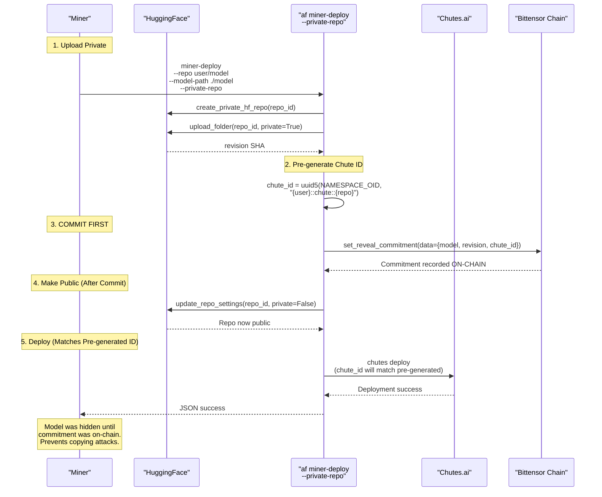

import CollapsibleAside from '../../../components/CollapsibleAside.astro';
import SourceLink from '../../../components/SourceLink.astro';
import Table from '../../../components/Table.astro';

<CollapsibleAside title="Relevant Source Files">
  <SourceLink text="affine/api/routers/samples.py" href="https://github.com/AffineFoundation/affine-cortex/blob/main/affine/api/routers/samples.py" />
  <SourceLink text="affine/cli/main.py" href="https://github.com/AffineFoundation/affine-cortex/blob/main/affine/cli/main.py" />
  <SourceLink text="affine/cli/types.py" href="https://github.com/AffineFoundation/affine-cortex/blob/main/affine/cli/types.py" />
  <SourceLink text="affine/database/cli.py" href="https://github.com/AffineFoundation/affine-cortex/blob/main/affine/database/cli.py" />
  <SourceLink text="affine/src/miner/commands.py" href="https://github.com/AffineFoundation/affine-cortex/blob/main/affine/src/miner/commands.py" />
  <SourceLink text="affine/src/miner/main.py" href="https://github.com/AffineFoundation/affine-cortex/blob/main/affine/src/miner/main.py" />
  <SourceLink text="affine/src/scheduler/sampling_scheduler.py" href="https://github.com/AffineFoundation/affine-cortex/blob/main/affine/src/scheduler/sampling_scheduler.py" />
</CollapsibleAside>

This page provides comprehensive documentation for all command-line interface (CLI) commands available in the Affine system. The `af` CLI is the primary interface for validators, miners, and developers to interact with the Affine decentralized machine learning evaluation platform.

For validator-specific operational guides, see [For Validators](/subnets/for-validators#5). For miner deployment workflows, see [For Miners](/subnets/for-miners#4). For programmatic access, see [SDK Reference](/subnets/sdk-reference#6).

---

## Overview

The Affine CLI is implemented as a Click-based command group that provides distinct commands for different roles in the network:

- **Server Commands** (`af servers`): api, executor, monitor, scorer, scheduler, validator - for operating backend services
- **Miner Commands**: commit, pull, chutes_push, miner-deploy, get-sample, get-miner, get-pool, get-weights, get-scores, get-rank, get-envs - for deploying and managing models
- **Database Commands** (`af db`): init, reset, load-config, blacklist, get-stats, cleanup-inactive-miners - for database management
- **Docker Commands**: deploy, down - for container deployment
- **Evaluation Command**: eval - for local model evaluation

All commands share a common entry point `af` with global options for logging configuration.

**Sources:** [affine/cli/main.py:1-33]()

---

## Global CLI Options

The `af` command group accepts global options that apply to all subcommands:

```bash
af [OPTIONS] COMMAND [ARGS]
```

<Table>

| Option | Short | Type | Description |
|--------|-------|------|-------------|
| `--verbosity` | `-v` | count | Increase verbosity level. `-v` = INFO, `-vv` = DEBUG, `-vvv` = TRACE |

</Table>


The verbosity flag can be stacked to increase logging detail:
- No flag: WARNING level
- `-v`: INFO level (verbosity=1)
- `-vv`: DEBUG level (verbosity=2)
- `-vvv`: TRACE level (verbosity=3)

**Sources:** [affine/cli/main.py:44-59]()

---

## Command Architecture

```mermaid
graph TB
    CLI["af CLI<br/>(Click Group)"]
    
    subgraph "Server Commands Group"
        API["servers api<br/>FastAPI Service"]
        EXECUTOR["servers executor<br/>Task Execution"]
        MONITOR["servers monitor<br/>Miner Validation"]
        SCORER["servers scorer<br/>Score Calculation"]
        SCHEDULER["servers scheduler<br/>Task Generation"]
        VALIDATOR["servers validator<br/>Weight Setting"]
    end
    
    subgraph "Miner Commands"
        COMMIT["commit<br/>Blockchain Commit"]
        PULL["pull<br/>Download Model"]
        PUSH["chutes_push<br/>Deploy to Chutes"]
        DEPLOY["miner-deploy<br/>One-Command Deploy"]
        GET_SAMPLE["get-sample<br/>Query Sample"]
        GET_MINER["get-miner<br/>Query Miner Info"]
        GET_POOL["get-pool<br/>Query Task Pool"]
        GET_WEIGHTS["get-weights<br/>Query Weights"]
        GET_SCORES["get-scores<br/>Query Scores"]
        GET_RANK["get-rank<br/>Query Rankings"]
    end
    
    subgraph "Database Commands Group"
        DB_INIT["db init<br/>Initialize Tables"]
        DB_RESET["db reset<br/>Reset Tables"]
        DB_LOAD["db load-config<br/>Load System Config"]
        DB_BLACKLIST["db blacklist<br/>Manage Blacklist"]
        DB_STATS["db get-stats<br/>Query Statistics"]
        DB_CLEANUP["db cleanup-inactive-miners"]
    end
    
    subgraph "Docker Commands"
        DOCKER_DEPLOY["deploy<br/>Start Services"]
        DOCKER_DOWN["down<br/>Stop Services"]
    end
    
    CLI --> API
    CLI --> EXECUTOR
    CLI --> MONITOR
    CLI --> SCORER
    CLI --> SCHEDULER
    CLI --> VALIDATOR
    CLI --> COMMIT
    CLI --> PULL
    CLI --> PUSH
    CLI --> DEPLOY
    CLI --> GET_SAMPLE
    CLI --> GET_MINER
    CLI --> GET_POOL
    CLI --> GET_WEIGHTS
    CLI --> GET_SCORES
    CLI --> GET_RANK
    CLI --> DB_INIT
    CLI --> DB_RESET
    CLI --> DB_LOAD
    CLI --> DB_BLACKLIST
    CLI --> DB_STATS
    CLI --> DB_CLEANUP
    CLI --> DOCKER_DEPLOY
    CLI --> DOCKER_DOWN
    
    DEPLOY -->|1. Upload| HF["HuggingFace"]
    DEPLOY -->|2. Deploy| CHUTES["Chutes.ai"]
    DEPLOY -->|3. Commit| BT["Bittensor Chain"]
    
    GET_SAMPLE -->|Query| API_SVC["API Service<br/>:8000"]
    GET_MINER -->|Query| API_SVC
    GET_POOL -->|Query| API_SVC
    GET_WEIGHTS -->|Query| API_SVC
    GET_SCORES -->|Query| API_SVC
    
    DB_LOAD -->|Update| DYNAMODB["DynamoDB<br/>system_config"]
```



**Sources:** [affine/cli/main.py:62-495](), [affine/database/cli.py:1-5]()

---

## Server Commands

The `af servers` command group provides subcommands for starting backend microservices. These commands are typically hidden from regular users (controlled by `AFFINE_SHOW_ADMIN_COMMANDS` environment variable) and primarily used in production deployment via Docker Compose.

### `af servers api`

Starts the FastAPI REST API service that provides unified access to all system data.

```bash
af servers api
```

**Behavior:**

1. Loads configuration from `affine.api.config`
2. Starts uvicorn server with configured host, port, and workers
3. Exposes REST endpoints for miners, samples, scores, tasks, and configuration
4. Implements rate limiting and authentication middleware

**Default Configuration:**

<Table>

| Parameter | Default | Description |
|-----------|---------|-------------|
| Host | `0.0.0.0` | Bind address |
| Port | `8000` | Service port |
| Workers | `1` | Number of worker processes |
| Log Level | `info` | Logging verbosity |

</Table>


For API endpoint documentation, see [API Reference](/subnets/api-reference#13).

**Sources:** [affine/cli/main.py:72-88]()

---

### `af servers executor`

Starts the executor service that fetches tasks from the API and executes them in isolated environments.

```bash
af servers executor [OPTIONS]
```

**Behavior:**

1. Forwards all arguments to the executor's main entry point
2. Initializes `ExecutorManager` with configured workers
3. Continuously fetches tasks from API via `APIClient`
4. Executes tasks in Docker containers or Basilica pods via `affinetes`
5. Submits results back to API

For detailed architecture, see [Executor Service](/subnets/backend-services-deep-dive/executor-service#11.4).

**Sources:** [affine/cli/main.py:91-99]()

---

### `af servers monitor`

Starts the monitor service that validates miners and detects plagiarism.

```bash
af servers monitor [OPTIONS]
```

**Behavior:**

1. Forwards arguments to monitor's main entry point
2. Continuously queries Bittensor metagraph for new miners
3. Validates model architecture, naming conventions, and templates
4. Computes model hashes for plagiarism detection
5. Updates `miners` table with validation status

For validation pipeline details, see [Monitor Service](/subnets/backend-services-deep-dive/monitor-service#11.2).

**Sources:** [affine/cli/main.py:102-109]()

---

### `af servers scorer`

Starts the scorer service that calculates miner scores using the 4-stage algorithm.

```bash
af servers scorer [OPTIONS]
```

**Behavior:**

1. Forwards arguments to scorer's main entry point
2. Periodically fetches sample results from API
3. Applies 4-stage scoring algorithm:
   - Stage 1: Data collection and normalization
   - Stage 2: Pareto dominance filtering
   - Stage 3: Subset scoring with geometric means
   - Stage 4: Weight normalization
4. Saves scores to database

For scoring algorithm details, see [Weight Calculation System](/subnets/for-validators/weight-calculation-system#5.4).

**Sources:** [affine/cli/main.py:112-119]()

---

### `af servers scheduler`

Starts the scheduler service that generates sampling tasks for miners.

```bash
af servers scheduler [OPTIONS]
```

**Behavior:**

1. Forwards arguments to scheduler's main entry point
2. Implements weighted task allocation across environments
3. Ensures fairness with anti-starvation mechanisms
4. Applies rate limiting to prevent memorization attacks
5. Creates tasks in `task_pool` table

For task allocation strategy, see [Task Scheduling System](/subnets/for-validators/task-scheduling-system#5.3).

**Sources:** [affine/cli/main.py:122-129]()

---

### `af servers validator`

Starts the validator service that sets weights on the Bittensor blockchain.

```bash
af servers validator [OPTIONS]
```

**Behavior:**

1. Forwards arguments to validator's main entry point
2. Fetches latest scores from database
3. Normalizes weights with burn percentage
4. Sets weights on Bittensor via `set_weights()` API call
5. Runs on blockchain tempo (synchronized to blocks)

**Sources:** [affine/cli/main.py:132-139]()

---

### `af validate`

Alias for `af servers validator` that directly starts the validator service without the `servers` prefix.

```bash
af validate [OPTIONS]
```

This command provides backward compatibility and convenience for operators.

**Sources:** [affine/cli/main.py:142-149]()

---

## Miner Commands

### `af commit`

Commits model deployment information to the Bittensor blockchain using reveal commitments.

```bash
af commit [OPTIONS]
```

**Options:**

<Table>

| Option | Type | Required | Description |
|--------|------|----------|-------------|
| `--repo` | str | Yes | HF repository ID |
| `--revision` | str | Yes | HF commit SHA |
| `--chute-id` | str | Yes | Chutes deployment ID |
| `--coldkey` | str | No | Cold wallet name (env: `BT_WALLET_COLD`) |
| `--hotkey` | str | No | Hot wallet name (env: `BT_WALLET_HOT`) |

</Table>


**Behavior:**

1. Loads wallet using `bt.Wallet(name=cold, hotkey=hot)`
2. Creates JSON commitment data: `{"model": repo, "revision": revision, "chute_id": chute_id}`
3. Calls `subtensor.set_reveal_commitment()` with:
   - `netuid`: NETUID (Affine subnet)
   - `data`: JSON commitment
   - `blocks_until_reveal`: 1 (immediate reveal)
4. Retries on `SpaceLimitExceeded` error by waiting for next block via `subtensor.wait_for_block()`
5. Returns JSON success/failure response

**Output Format:**

```json
// Success
{
  "success": true,
  "repo": "user/model-name",
  "revision": "a1b2c3d4...",
  "chute_id": "abc123"
}

// Failure
{
  "success": false,
  "error": "MetadataError: ..."
}
```

**Sources:** [affine/cli/main.py:164-171](), [affine/src/miner/commands.py:396-462]()

---

### `af pull`

Downloads a model from a miner's Hugging Face repository to local storage.

```bash
af pull UID [OPTIONS]
```

**Arguments:**

<Table>

| Argument | Type | Description |
|----------|------|-------------|
| `UID` | int/str | Miner UID (supports negative with 'n' prefix, e.g., n1 = -1) |

</Table>


**Options:**

<Table>

| Option | Short | Type | Default | Description |
|--------|-------|------|---------|-------------|
| `--model-path` | `-p` | path | `./model_path` | Local directory to save model |
| `--hf-token` | | str | env `HF_TOKEN` | Hugging Face API token |

</Table>


**Behavior:**

1. Queries subtensor metagraph directly to get miner's hotkey
2. Retrieves blockchain commitment data for the hotkey
3. Extracts `model` and `revision` from commitment JSON
4. Calls `snapshot_download()` from `huggingface_hub` with:
   - `repo_id`: Miner's model repository
   - `revision`: Miner's committed SHA
   - `local_dir`: Specified model path
   - `resume_download=True`: Supports interrupted downloads
5. Returns JSON with download details

**UID Format:** The `UID` parameter uses custom `UIDParamType` that supports:
- Regular integers: `42`, `0`, `100`
- Negative prefix: `n1` → `-1`, `n10` → `-10`

**Example:**

```bash
# Pull model from UID 160
af pull 160 --model-path ./my_model

# Pull from negative UID (system model)
af pull n1 -p ./system_model

# Using environment variable for token
export HF_TOKEN=hf_abc...
af pull 160 -p ./downloaded_model
```

**Sources:** [affine/cli/main.py:174-181](), [affine/src/miner/commands.py:168-238](), [affine/cli/types.py:8-54]()

---

### `af chutes_push`

Deploys an existing Hugging Face model repository to Chutes.ai serverless inference platform.

```bash
af chutes_push [OPTIONS]
```

**Options:**

<Table>

| Option | Type | Required | Description |
|--------|------|----------|-------------|
| `--repo` | str | Yes | HF repository ID (e.g., `user/model-name`) |
| `--revision` | str | Yes | HF commit SHA to deploy |
| `--chutes-api-key` | str | No | Chutes API key (env: `CHUTES_API_KEY`) |
| `--chute-user` | str | No | Chutes username (env: `CHUTE_USER`) |

</Table>


**Behavior:**

1. Validates `CHUTES_API_KEY` and `CHUTE_USER` configuration
2. Generates Chute configuration with `build_sglang_chute()` template
3. Writes temporary configuration to `tmp_chute.py`
4. Executes `chutes deploy tmp_chute:chute --accept-fee` subprocess
5. Automatically sends `y\n` to stdin to accept deployment fee
6. Parses output for errors using regex pattern
7. Queries `get_latest_chute_id()` to retrieve deployment ID
8. Fetches chute metadata using `get_chute_info()`
9. Cleans up temporary file and returns JSON result

**Default Chute Configuration:**

```python
# Generated in chutes_push_command()
build_sglang_chute(
    username="{chute_user}",
    readme="{repo}",
    model_name="{repo}",
    image="chutes/sglang:nightly-2025081600",
    concurrency=40,
    revision="{revision}",
    node_selector=NodeSelector(
        gpu_count=4,
        include=["h200"],
    ),
    scaling_threshold=0.5,
    max_instances=2,
    shutdown_after_seconds=28800,
)
```

**Output Format:**

```json
{
  "success": true,
  "chute_id": "abc123",
  "chute": {
    "chute_id": "abc123",
    "status": "active"
  },
  "repo": "user/model-name",
  "revision": "a1b2c3d4..."
}
```

**Sources:** [affine/cli/main.py:184-191](), [affine/src/miner/commands.py:277-393]()

---

### `af miner-deploy`

One-command deployment workflow that combines upload, Chutes deployment, and blockchain commit.

```bash
af miner-deploy [OPTIONS]
```

**Options:**

<Table>

| Option | Short | Type | Description |
|--------|-------|------|-------------|
| `--repo` | `-r` | str | HuggingFace repository ID (required) |
| `--model-path` | `-p` | path | Path to local model directory |
| `--revision` | | str | HF revision SHA (if skipping upload) |
| `--chute-id` | | str | Chutes deployment ID (if skipping Chutes) |
| `--message` | `-m` | str | Commit message (default: "Model update") |
| `--dry-run` | | flag | Show plan without executing |
| `--skip-upload` | | flag | Skip HF upload (requires `--revision`) |
| `--skip-chutes` | | flag | Skip Chutes deployment (requires `--chute-id`) |
| `--skip-commit` | | flag | Skip blockchain commit |
| `--private-repo` | | flag | Use private repo workflow |
| `--chutes-api-key` | | str | Chutes API key (env: `CHUTES_API_KEY`) |
| `--chute-user` | | str | Chutes username (env: `CHUTE_USER`) |
| `--coldkey` | | str | Wallet coldkey (env: `BT_WALLET_COLD`) |
| `--hotkey` | | str | Wallet hotkey (env: `BT_WALLET_HOT`) |
| `--hf-token` | | str | HuggingFace token (env: `HF_TOKEN`) |

</Table>


**Normal Workflow:**

1. **Upload**: Upload model to HuggingFace (public repo)
2. **Deploy**: Deploy to Chutes.ai
3. **Commit**: Commit to Bittensor blockchain

**Private Repo Workflow (`--private-repo`):**

Security-focused workflow that prevents model theft before commitment:

1. **Upload Private**: Create private HF repo and upload model
2. **Commit First**: Commit to blockchain with pre-generated `chute_id`
3. **Make Public**: Make HF repo public after commit confirmation
4. **Deploy**: Deploy to Chutes (matches pre-generated ID)

This ensures the model stays hidden until your commitment is on-chain, preventing competitors from copying and committing before you.

**Private Repo Implementation:**

The private workflow uses deterministic chute ID generation:
```python
# Pre-generate chute_id before deployment (UUID5)
chute_id = uuid5(NAMESPACE_OID, f"{username}::chute::{repo}")
```

This allows committing to blockchain before Chutes deployment, as the ID is deterministic and will match when actually deployed.

**Examples:**

```bash
# Full public deployment
af miner-deploy -r myuser/model -p ./my_model

# Private repo workflow (recommended)
af miner-deploy -r myuser/model -p ./my_model --private-repo

# Skip upload (model already on HF)
af miner-deploy -r myuser/model --skip-upload --revision abc123

# Skip Chutes (already deployed)
af miner-deploy -r myuser/model --skip-upload --revision abc123 \
  --skip-chutes --chute-id xyz

# Dry run (show plan)
af miner-deploy -r myuser/model -p ./my_model --dry-run
```

**Sources:** [affine/cli/main.py:326-344](), [affine/src/miner/commands.py:657-866]()

---

### `af get-sample`

Queries a specific sample result by UID, environment, and task ID.

```bash
af get-sample UID ENV TASK_ID
```

**Arguments:**

<Table>

| Argument | Type | Description |
|----------|------|-------------|
| `UID` | int/str | Miner UID (supports 'n' prefix for negative) |
| `ENV` | str | Environment name (e.g., `affine:sat`, `sat`) |
| `TASK_ID` | str | Task identifier |

</Table>


**Behavior:**

1. Calls API endpoint `/samples/uid/{uid}/{env}/{task_id}`
2. Returns full sample details including conversation data
3. If not found in `sample_results`, queries `task_pool` table
4. Supports environment name shorthand (e.g., `sat` → `agentgym:sat`)

**Output:** JSON with sample data including score, latency, conversation history, and metadata.

**Examples:**

```bash
af get-sample 42 sat task_123
af get-sample n1 agentgym:webshop task_456
```

**Sources:** [affine/cli/main.py:194-205](), [affine/src/miner/commands.py:465-483]()

---

### `af get-miner`

Queries miner status and information by UID.

```bash
af get-miner UID
```

**Arguments:**

<Table>

| Argument | Type | Description |
|----------|------|-------------|
| `UID` | int/str | Miner UID (supports 'n' prefix) |

</Table>


**Behavior:**

1. Queries API endpoint `/miners/uid/{uid}` for miner metadata
2. Queries `/miners/uid/{uid}/stats` for sampling statistics
3. Displays global sampling stats across time windows (15min, 1hr, 6hrs, 24hrs)
4. Shows per-environment statistics with success rates and error counts

**Output Fields:**

- Miner metadata: hotkey, model, revision, chute_id, validation status
- Global sampling stats: total samples, success rate, samples/min, error types
- Per-environment stats: samples, success rate, rate limit errors, timeout errors

**Example:**

```bash
af get-miner 42
# Shows complete miner info plus sampling statistics
```

**Sources:** [affine/cli/main.py:208-223](), [affine/src/miner/commands.py:486-544]()

---

### `af get-pool`

Queries task pool status for a miner in a specific environment.

```bash
af get-pool UID ENV [OPTIONS]
```

**Arguments:**

<Table>

| Argument | Type | Description |
|----------|------|-------------|
| `UID` | int/str | Miner UID |
| `ENV` | str | Environment name |

</Table>


**Options:**

<Table>

| Option | Description |
|--------|-------------|
| `--full` | Print full task_ids lists without truncation |

</Table>


**Behavior:**

1. Queries API endpoint `/samples/pool/uid/{uid}/{env}`
2. Returns breakdown of tasks:
   - `sampled_task_ids`: Already completed
   - `pool_task_ids`: Currently in task pool (pending/assigned)
   - `missing_task_ids`: Not yet sampled or in pool
3. Shows sampling configuration for the environment
4. By default, truncates long lists to first/last 5 items

**Output:**

```json
{
  "uid": 100,
  "env": "agentgym:webshop",
  "total_tasks": 500,
  "sampled_count": 450,
  "pool_count": 30,
  "missing_count": 20,
  "sampled_task_ids": "[1, 2, 3, 4, 5, ..., 446, 447, 448, 449, 450] (total: 450)",
  "pool_task_ids": "[451, 452, ..., 479, 480] (total: 30)",
  "missing_task_ids": "[481, 482, ..., 499, 500] (total: 20)"
}
```

**Example:**

```bash
af get-pool 100 agentgym:webshop
af get-pool 100 webshop --full  # Full task_ids without truncation
```

**Sources:** [affine/cli/main.py:276-289](), [affine/src/miner/commands.py:590-640]()

---

### `af get-weights`

Queries latest normalized weights for on-chain weight setting.

```bash
af get-weights
```

**Behavior:**

1. Queries API endpoint `/scores/weights/latest`
2. Returns most recent score snapshot with normalized weights
3. Includes burn percentage and per-UID weight allocations

**Output:** JSON with normalized weights ready for blockchain submission.

**Sources:** [affine/cli/main.py:226-240](), [affine/src/miner/commands.py:548-559]()

---

### `af get-scores`

Queries latest scores for top N miners.

```bash
af get-scores [OPTIONS]
```

**Options:**

<Table>

| Option | Short | Type | Default | Description |
|--------|-------|------|---------|-------------|
| `--top` | `-t` | int | 10 | Number of top miners to return |

</Table>


**Behavior:**

1. Queries API endpoint `/scores/latest?top={top}`
2. Returns top N miners by score at latest calculated block
3. Includes per-environment scores and overall rankings

**Example:**

```bash
af get-scores
af get-scores --top 20
```

**Sources:** [affine/cli/main.py:243-257](), [affine/src/miner/commands.py:562-573]()

---

### `af get-score`

Queries score for a specific miner by UID.

```bash
af get-score UID
```

**Arguments:**

<Table>

| Argument | Type | Description |
|----------|------|-------------|
| `UID` | int/str | Miner UID |

</Table>


**Behavior:**

1. Queries API endpoint `/scores/uid/{uid}`
2. Returns detailed score breakdown for specified miner
3. Shows per-environment scores and overall ranking

**Example:**

```bash
af get-score 42
```

**Sources:** [affine/cli/main.py:260-273](), [affine/src/miner/commands.py:576-587]()

---

### `af get-rank`

Queries and displays miner ranking table in detailed format.

```bash
af get-rank
```

**Behavior:**

1. Fetches latest score snapshot from API
2. Displays ranking table matching scorer's output format
3. Shows per-environment scores and overall rankings

**Output:** Formatted ranking table with all miners and their scores.

**Sources:** [affine/cli/main.py:292-306]()

---

### `af get-envs`

Queries current environment configurations.

```bash
af get-envs
```

**Behavior:**

1. Queries API endpoint `/config/environments`
2. Returns all environment configurations including:
   - Sampling settings (sampling_list, rotation settings)
   - Scoring weights
   - Enabled flags (enabled_for_sampling, enabled_for_scoring)

**Output:** JSON with complete environment configuration.

**Sources:** [affine/cli/main.py:309-323](), [affine/src/miner/commands.py:643-654]()

---

## Complete Miner Workflow Diagrams

### Normal Workflow



**Sources:** [affine/cli/main.py:164-191](), [affine/src/miner/commands.py:277-462]()

---

### Private Repo Workflow (Recommended)



**Sources:** [affine/cli/main.py:326-344](), [affine/src/miner/commands.py:657-866]()

---

## Database Commands

The `af db` command group provides database management operations for DynamoDB tables. These commands are typically used by administrators for system maintenance and configuration.

### `af db init`

Initializes all DynamoDB tables with proper schemas.

```bash
af db init
```

**Behavior:**

1. Calls `init_client()` to establish DynamoDB connection
2. Calls `init_tables()` to create all required tables:
   - `sample_results`: Task execution results
   - `task_pool`: Active task queue
   - `execution_logs`: Execution event history
   - `scores`: Detailed miner scores
   - `score_snapshots`: Block-level score metadata
   - `miners`: Miner validation state
   - `miner_stats`: Performance tracking
   - `system_config`: Global parameters
3. Tables are created with proper partition keys, sort keys, and GSIs

**Sources:** [affine/database/cli.py:26-35]()

---

### `af db reset`

Deletes and recreates all DynamoDB tables (requires confirmation).

```bash
af db reset
```

**Behavior:**

1. Prompts for confirmation: `Type 'yes' to confirm`
2. Calls `reset_tables()` to delete all existing tables
3. Recreates tables with `init_tables()`
4. **Warning:** Permanently deletes all data

**Sources:** [affine/database/cli.py:51-65]()

---

### `af db reset-table`

Resets a single DynamoDB table (requires confirmation).

```bash
af db reset-table --table TABLE_NAME
```

**Options:**

<Table>

| Option | Required | Description |
|--------|----------|-------------|
| `--table` | Yes | Table name (e.g., `task_pool`, `sample_results`) |

</Table>


**Behavior:**

1. Resolves full table name with environment prefix via `get_table_name()`
2. Prompts for confirmation
3. Deletes specified table
4. Recreates table with original schema

**Sources:** [affine/database/cli.py:68-95]()

---

### `af db load-config`

Loads system configuration from JSON file into `system_config` table.

```bash
af db load-config [--json-file PATH]
```

**Options:**

<Table>

| Option | Default | Description |
|--------|---------|-------------|
| `--json-file` | `system_config.json` | Path to configuration file |

</Table>


**Behavior:**

1. Loads JSON configuration file
2. Processes environment configurations:
   - Resolves dynamic dataset ranges from remote sources
   - Preserves existing sampling_list from database if no `initial_range`
   - Generates new sampling_list if `initial_range` provided
3. Loads validator burn percentage if present
4. Saves to `system_config` table via `SystemConfigDAO`

**Configuration File Structure:**

```json
{
  "validator_burn_percentage": 0.0,
  "environments": {
    "affine:sat": {
      "enabled_for_sampling": true,
      "enabled_for_scoring": true,
      "sampling_config": {
        "sampling_count": 500,
        "dataset_range": [[0, 1000]],
        "rotation_enabled": true,
        "rotation_count": 10,
        "rotation_interval": 3600,
        "scheduling_weight": 1.0
      },
      "scoring_config": {
        "weights": {"score": 1.0}
      }
    }
  }
}
```

**Sampling List Management:**

- If `initial_range` present: Generates new sampling_list from range
- If `initial_range` absent: Preserves existing sampling_list from database
- This enables smooth transitions without disrupting active sampling

**Sources:** [affine/database/cli.py:106-276]()

---

### `af db blacklist`

Manages the miner blacklist stored in `system_config` table.

**Subcommands:**

#### `af db blacklist list`

Lists all blacklisted hotkeys.

```bash
af db blacklist list
```

**Sources:** [affine/database/cli.py:279-296]()

#### `af db blacklist add`

Adds hotkeys to the blacklist.

```bash
af db blacklist add HOTKEY1 HOTKEY2 ...
```

**Example:**

```bash
af db blacklist add 5F3sa2TJAWMq... 5GrwvaEF5z...
```

**Sources:** [affine/database/cli.py:299-322]()

#### `af db blacklist remove`

Removes hotkeys from the blacklist.

```bash
af db blacklist remove HOTKEY1 HOTKEY2 ...
```

**Sources:** [affine/database/cli.py:325-348]()

#### `af db blacklist clear`

Clears the entire blacklist (requires confirmation).

```bash
af db blacklist clear
```

**Sources:** [affine/database/cli.py:351-373]()

---

### `af db set-burn`

Sets validator burn percentage (weight allocated to UID 0).

```bash
af db set-burn PERCENTAGE
```

**Arguments:**

<Table>

| Argument | Type | Range | Description |
|----------|------|-------|-------------|
| `PERCENTAGE` | float | 0.0-1.0 | Burn percentage (e.g., 0.05 = 5%) |

</Table>


**Example:**

```bash
af db set-burn 0.05  # Allocate 5% to UID 0
```

**Sources:** [affine/database/cli.py:376-399]()

---

### `af db get-burn`

Gets current validator burn percentage.

```bash
af db get-burn
```

**Output:**

```
Current burn percentage: 5.0%
Last updated: 2025-01-15 12:34:56
Updated by: cli_set_burn_percentage
```

**Sources:** [affine/database/cli.py:402-420]()

---

### `af db get-config`

Displays complete system configuration in formatted output.

```bash
af db get-config
```

**Output Sections:**

1. **Validator Burn Percentage**: Current burn allocation
2. **Blacklist**: List of blacklisted hotkeys
3. **Environments Configuration**: Detailed environment settings with:
   - Sampling configuration (dataset range, sampling list, rotation settings)
   - Scoring configuration (weights)
   - Enabled flags (sampling, scoring)

**Example Output:**

```
================================================================================
VALIDATOR BURN PERCENTAGE
================================================================================
Value: 5.0%
Updated: 2025-01-15 12:34:56
Updated by: cli_set_burn_percentage

================================================================================
BLACKLIST
================================================================================
Count: 2 hotkey(s)
  1. 5F3sa2TJAWMq...
  2. 5GrwvaEF5z...

================================================================================
ENVIRONMENTS CONFIGURATION
================================================================================
Total environments: 12

────────────────────────────────────────────────────────────────────────────────
Environment: affine:sat
────────────────────────────────────────────────────────────────────────────────
Status: [sampling+scoring]

Sampling Configuration:
  Dataset range: [[0, 1000]]
  Sampling count: 500
  Sampling list: 500 tasks
    Tasks: [0, 1, 2, 3, 4, ..., 995, 996, 997, 998, 999]
  Rotation enabled: True
  Rotation count: 10 tasks/rotation
  Rotation interval: 3600s (1.0 hours)
  Last rotation: 1234s ago (0.3 hours)

Scoring Configuration:
  Weights: {
    "score": 1.0
  }
```

**Sources:** [affine/database/cli.py:423-540]()

---

### `af db delete-samples-by-range`

Deletes sample results within a task_id range.

```bash
af db delete-samples-by-range --env ENV --start START --end END [OPTIONS]
```

**Options:**

<Table>

| Option | Required | Description |
|--------|----------|-------------|
| `--hotkey` | No | Filter by specific miner hotkey |
| `--revision` | No | Filter by specific model revision |
| `--env` | Yes | Environment name |
| `--start-task-id` | Yes | Start of task_id range (inclusive) |
| `--end-task-id` | Yes | End of task_id range (exclusive) |

</Table>


**Behavior:**

- If `hotkey` and `revision` provided: Deletes samples for specific miner
- If not provided: Deletes ALL samples in environment and range
- Requires confirmation before deletion

**Example:**

```bash
# Delete specific miner's samples
af db delete-samples-by-range \
  --hotkey 5F3sa2... --revision abc123 \
  --env affine:sat --start-task-id 0 --end-task-id 100

# Delete all samples in range
af db delete-samples-by-range \
  --env affine:sat --start-task-id 0 --end-task-id 100
```

**Sources:** [affine/database/cli.py:543-594]()

---

### `af db delete-samples-empty-conversation`

Scans entire database and deletes all samples with empty conversation.

```bash
af db delete-samples-empty-conversation
```

**Behavior:**

1. Scans entire `sample_results` table
2. Identifies samples with empty conversation arrays
3. Batch deletes invalid samples
4. Requires confirmation before deletion

**Use Case:** Cleanup of malformed samples from executor failures.

**Sources:** [affine/database/cli.py:597-619]()

---

### `af db cleanup-inactive-miners`

Removes long-inactive miners with zero weight.

```bash
af db cleanup-inactive-miners --days DAYS
```

**Options:**

<Table>

| Option | Required | Default | Description |
|--------|----------|---------|-------------|
| `--days` | Yes | - | Number of days of inactivity threshold |

</Table>


**Behavior:**

1. Queries `miner_stats` for miners matching criteria:
   - Not updated for specified number of days
   - `best_weight == 0` (never had any weight)
2. Displays preview of miners to be deleted (first 10)
3. Requires confirmation before deletion
4. Removes records from `miner_stats` table

**Example:**

```bash
af db cleanup-inactive-miners --days 30

# Output:
# Found 15 inactive miners (>30 days, zero weight):
#
# 1. 5F3sa2TJAWMq...#abc12345... (last_updated: 2024-11-15, weight: 0)
# 2. 5GrwvaEF5z...#def67890... (last_updated: 2024-11-20, weight: 0)
# ...
#
# WARNING: Delete 15 miners? Type 'yes' to confirm:
```

**Sources:** [affine/database/cli.py:622-670]()

---

### `af db update-miners`

Initializes or updates `miner_stats` table from `sample_results` using batch scanning.

```bash
af db update-miners
```

**Behavior:**

1. Checks if `miner_stats` table exists (creates if missing)
2. Batch scans `sample_results` table (1000 samples per batch)
3. For each unique (hotkey, revision) pair:
   - Creates new record if not exists
   - Updates `first_seen_at` with earliest sample timestamp
   - Updates `last_updated_at` with latest sample timestamp
4. Does NOT update `best_rank` or `best_weight` (requires online data)
5. Displays progress: batch number, samples processed, unique miners found

**Use Case:** Bootstrap `miner_stats` from historical data or repair missing records.

**Example Output:**

```
Initializing miner_stats from sample_results...
Note: Only updates timestamps (first_seen_at, last_updated_at)
      Historical best_rank is not updated (requires online data)

Scanning sample_results table in batches...
  Batch 1: Processed 1000 samples (total: 1000, unique miners: 45, created: 45, updated: 0)
  Batch 2: Processed 1000 samples (total: 2000, unique miners: 67, created: 22, updated: 0)
  ...

✓ Initialization complete:
  - Total samples scanned: 150000
  - Total batches: 150
  - Unique miners found: 234
  - New records created: 234
  - Existing records updated: 0

Note: Only timestamps were updated. Historical best_rank requires online miner data.
```

**Sources:** [affine/database/cli.py:673-886]()

---

## Docker Deployment Commands

Commands for managing Docker Compose deployments.

### `af deploy`

Deploys Docker containers for validator, backend, or api services.

```bash
af deploy SERVICE [OPTIONS]
```

**Arguments:**

<Table>

| Argument | Type | Choices | Description |
|----------|------|---------|-------------|
| `SERVICE` | str | `validator`, `backend`, `api` | Service to deploy |

</Table>


**Options:**

<Table>

| Option | Description |
|--------|-------------|
| `--local` | Use local build mode (docker-compose.local.yml) |
| `--recreate` | Force recreate containers |
| `--restart` | Restart containers without recreating |

</Table>


**Behavior:**

1. Determines compose files based on service:
   - `validator`: `docker-compose.yml` (+ `docker-compose.local.yml` if `--local`)
   - `backend`: `compose/docker-compose.backend.yml` (+ `backend.local.yml`)
   - `api`: `compose/docker-compose.api.yml` (+ `api.local.yml`)
2. Builds command: `docker compose --project-directory {affine_dir} -f ... up -d`
3. Adds `--force-recreate` if `--recreate` flag set
4. Adds `--build` if `--local` flag set (builds images locally)
5. Uses `restart` command if `--restart` flag set

**Examples:**

```bash
# Deploy validator with local build
af deploy validator --local --recreate

# Deploy backend services
af deploy backend

# Restart API service
af deploy api --restart --local
```

**Note:** These commands are hidden by default (requires `AFFINE_SHOW_ADMIN_COMMANDS=true`).

**Sources:** [affine/cli/main.py:371-439]()

---

### `af down`

Stops and removes Docker containers.

```bash
af down SERVICE [OPTIONS]
```

**Arguments:**

<Table>

| Argument | Type | Choices | Description |
|----------|------|---------|-------------|
| `SERVICE` | str | `validator`, `backend`, `api` | Service to stop |

</Table>


**Options:**

<Table>

| Option | Short | Description |
|--------|-------|-------------|
| `--volumes` | `-v` | Remove volumes as well |

</Table>


**Behavior:**

1. Determines compose files for service
2. Builds command: `docker compose --project-directory {affine_dir} -f ... down`
3. Adds `--volumes` if flag set (removes persistent data)

**Examples:**

```bash
# Stop validator
af down validator

# Stop backend and remove volumes
af down backend --volumes

# Stop API
af down api
```

**Sources:** [affine/cli/main.py:442-494]()

---

## Evaluation Command

### `af eval`

Runs local model evaluation using SDK environments.

```bash
af eval [OPTIONS]
```

This command is imported from `affine.src.miner.eval` and provides utilities for testing models locally before deployment. For detailed usage, see the evaluation module documentation.

**Sources:** [affine/cli/main.py:156-157]()

---

## CLI Code Entity Mapping

```mermaid
graph TB
    subgraph "CLI Entry Point"
        CLI_GROUP["@click.group()<br/>cli(verbosity)<br/>affine.cli.main"]
    end
    
    subgraph "Server Commands Group"
        SERVERS_GROUP["@cli.group()<br/>servers()"]
        API_CMD["@servers.command()<br/>api()"]
        EXECUTOR_CMD["@servers.command()<br/>executor()"]
        MONITOR_CMD["@servers.command()<br/>monitor()"]
        SCORER_CMD["@servers.command()<br/>scorer()"]
        SCHEDULER_CMD["@servers.command()<br/>scheduler()"]
        VALIDATOR_CMD["@servers.command()<br/>validator()"]
    end
    
    subgraph "Miner Commands"
        COMMIT_CMD["@cli.command()<br/>commit()"]
        PULL_CMD["@cli.command()<br/>pull()"]
        PUSH_CMD["@cli.command()<br/>chutes_push()"]
        DEPLOY_CMD["@cli.command()<br/>miner-deploy()"]
        GET_SAMPLE_CMD["@cli.command('get-sample')<br/>get_sample()"]
        GET_MINER_CMD["@cli.command('get-miner')<br/>get_miner()"]
        GET_POOL_CMD["@cli.command('get-pool')<br/>get_pool()"]
        GET_WEIGHTS_CMD["@cli.command('get-weights')<br/>get_weights()"]
        GET_SCORES_CMD["@cli.command('get-scores')<br/>get_scores()"]
        GET_RANK_CMD["@cli.command('get-rank')<br/>get_rank()"]
    end
    
    subgraph "Database Commands Group"
        DB_GROUP["@cli.group()<br/>db()<br/>affine.database.cli"]
        DB_INIT["@db.command()<br/>init()"]
        DB_RESET["@db.command()<br/>reset()"]
        DB_LOAD["@db.command('load-config')<br/>load_config()"]
        DB_BLACKLIST["@db.group()<br/>blacklist()"]
    end
    
    subgraph "Implementation Modules"
        MINER_COMMANDS["affine.src.miner.commands<br/>commit_command()<br/>pull_command()<br/>chutes_push_command()<br/>deploy_command()"]
        API_CLIENT["affine.utils.api_client<br/>cli_api_client()"]
        SETUP["affine.core.setup<br/>setup_logging()"]
        SUBTENSOR["affine.utils.subtensor<br/>get_subtensor()"]
        DAOS["affine.database.dao<br/>SystemConfigDAO<br/>MinersDAO<br/>SampleResultsDAO"]
    end
    
    CLI_GROUP --> SERVERS_GROUP
    CLI_GROUP --> COMMIT_CMD
    CLI_GROUP --> PULL_CMD
    CLI_GROUP --> PUSH_CMD
    CLI_GROUP --> DEPLOY_CMD
    CLI_GROUP --> GET_SAMPLE_CMD
    CLI_GROUP --> GET_MINER_CMD
    CLI_GROUP --> GET_POOL_CMD
    CLI_GROUP --> GET_WEIGHTS_CMD
    CLI_GROUP --> GET_SCORES_CMD
    CLI_GROUP --> GET_RANK_CMD
    CLI_GROUP --> DB_GROUP
    
    SERVERS_GROUP --> API_CMD
    SERVERS_GROUP --> EXECUTOR_CMD
    SERVERS_GROUP --> MONITOR_CMD
    SERVERS_GROUP --> SCORER_CMD
    SERVERS_GROUP --> SCHEDULER_CMD
    SERVERS_GROUP --> VALIDATOR_CMD
    
    DB_GROUP --> DB_INIT
    DB_GROUP --> DB_RESET
    DB_GROUP --> DB_LOAD
    DB_GROUP --> DB_BLACKLIST
    
    COMMIT_CMD --> MINER_COMMANDS
    PULL_CMD --> MINER_COMMANDS
    PUSH_CMD --> MINER_COMMANDS
    DEPLOY_CMD --> MINER_COMMANDS
    
    GET_SAMPLE_CMD --> API_CLIENT
    GET_MINER_CMD --> API_CLIENT
    GET_POOL_CMD --> API_CLIENT
    GET_WEIGHTS_CMD --> API_CLIENT
    GET_SCORES_CMD --> API_CLIENT
    
    MINER_COMMANDS --> SUBTENSOR
    DB_INIT --> DAOS
    DB_LOAD --> DAOS
    
    CLI_GROUP --> SETUP
```



**Sources:** [affine/cli/main.py:1-503](), [affine/database/cli.py:1-892](), [affine/src/miner/commands.py:1-866]()

---

## Environment Variables Reference

The CLI commands respect the following environment variables:

### Global Configuration

<Table>

| Variable | Used By | Default | Description |
|----------|---------|---------|-------------|
| `BT_WALLET_COLD` | `commit`, `servers validator` | `default` | Cold wallet name |
| `BT_WALLET_HOT` | `commit`, `servers validator` | `default` | Hot wallet name |
| `AFFINE_SHOW_ADMIN_COMMANDS` | all | `false` | Show hidden admin commands |

</Table>


### Service Configuration

<Table>

| Variable | Used By | Default | Description |
|----------|---------|---------|-------------|
| `SERVICE_MODE` | `scheduler`, `scorer` | `false` | Enable continuous service loops |
| `API_URL` | `executor`, `scorer` | `http://localhost:8000/api/v1` | API endpoint URL |
| `SCORER_INTERVAL_MINUTES` | `scorer` | `60` | Scoring calculation interval |
| `SCORER_SAVE_TO_DB` | `scorer` | `true` | Enable database persistence |

</Table>


### Database Configuration

<Table>

| Variable | Used By | Default | Description |
|----------|---------|---------|-------------|
| `AWS_REGION` | all database commands | `us-west-2` | DynamoDB region |
| `DYNAMODB_ENDPOINT` | all database commands | - | Custom DynamoDB endpoint (for local testing) |
| `TABLE_PREFIX` | all database commands | `affine_` | Table name prefix |

</Table>


### Miner Configuration

<Table>

| Variable | Used By | Default | Description |
|----------|---------|---------|-------------|
| `HF_TOKEN` | `pull`, `miner-deploy` | - | Hugging Face API token |
| `CHUTES_API_KEY` | `chutes_push`, `miner-deploy` | - | Required for Chutes deployment |
| `CHUTE_USER` | `chutes_push`, `miner-deploy` | - | Chutes username |

</Table>


### Docker Configuration

<Table>

| Variable | Used By | Default | Description |
|----------|---------|---------|-------------|
| `DOCKER_HOST` | `executor` | - | Docker daemon socket |
| `AFFINETES_MODE` | `executor` | `docker` | Container orchestration mode (docker/basilica) |

</Table>


**Sources:** [affine/cli/main.py:40-42](), [affine/src/miner/commands.py:23-25](), [affine/database/cli.py:10-22]()

---

## Docker Deployment Integration

All server commands can be run in Docker containers using the provided docker-compose configurations:

```bash
# Deploy all backend services
af deploy backend --local

# Deploy validator service
af deploy validator

# Deploy API service
af deploy api --local

# Stop services
af down backend
```

**Docker Compose Structure:**

- `docker-compose.yml`: Validator service
- `docker-compose.local.yml`: Local development overrides for validator
- `compose/docker-compose.backend.yml`: All backend services (api, executor, monitor, scorer, scheduler)
- `compose/docker-compose.backend.local.yml`: Local development overrides for backend
- `compose/docker-compose.api.yml`: Standalone API service
- `compose/docker-compose.api.local.yml`: Local development overrides for API

**Service Mappings:**

<Table>

| Docker Service | CLI Command | Description |
|----------------|-------------|-------------|
| `api` | `af servers api` | REST API service |
| `executor` | `af servers executor` | Task execution service |
| `monitor` | `af servers monitor` | Miner validation service |
| `scorer` | `af servers scorer` | Score calculation service |
| `scheduler` | `af servers scheduler` | Task generation service |
| `validator` | `af servers validator` | Weight setting service |

</Table>


The Docker deployment includes:
- Automatic restart on failure
- Volume mounting for wallets and logs
- Health checks for API service
- Watchtower auto-updates (optional)
- Resource limits and reservations

For detailed deployment guide, see [Docker Deployment](/subnets/deployment-guide/docker-deployment#10.1).

**Sources:** [affine/cli/main.py:371-494]()

---

## Common Usage Patterns

### Validator Setup

```bash
# 1. Configure environment
cp .env.example .env
# Edit .env with required keys

# 2. Test locally
af -vv validate

# 3. Deploy with Docker
docker-compose up -d affine-validator affine-signer
docker-compose logs -f affine-validator
```

### Miner Deployment

```bash
# 1. Pull existing model
af pull 160 --model_path ./base_model

# 2. Train/improve model
# ... your training code ...

# 3. Upload to Hugging Face
# ... manual upload process ...

# 4. Deploy to Chutes
af chutes_push \
  --repo myuser/my-model \
  --revision a1b2c3d4e5f6... \
  --chutes-api-key $CHUTES_API_KEY

# 5. Commit to blockchain
af commit \
  --repo myuser/my-model \
  --revision a1b2c3d4e5f6... \
  --chute-id abc123 \
  --coldkey default \
  --hotkey default
```

### Monitoring Validator Health

```bash
# Start runner with monitoring
af runner --enable-monitoring --monitor-port 8765

# Check status (in another terminal)
curl http://localhost:8765/status
curl http://localhost:8765/status/miners
curl http://localhost:8765/status/queue
```

**Sources:** [README.md:39-137]()
