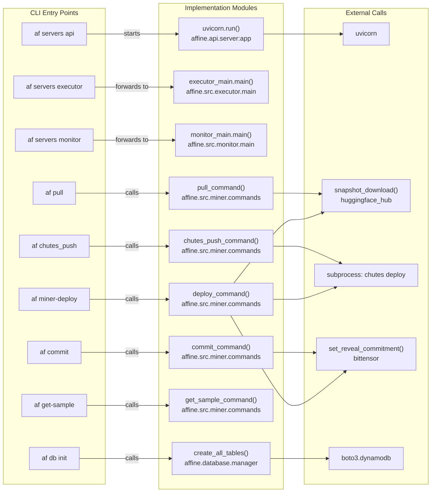
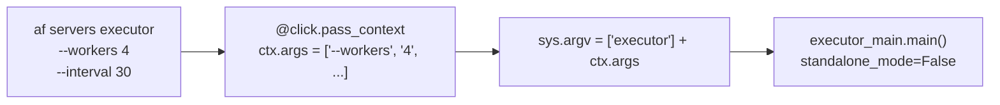

import CollapsibleAside from '../../../../components/CollapsibleAside.astro';
import SourceLink from '../../../../components/SourceLink.astro';
import Table from '../../../../components/Table.astro';

<CollapsibleAside title="Relevant Source Files">
  <SourceLink text="affine/api/routers/samples.py" href="https://github.com/AffineFoundation/affine-cortex/blob/main/affine/api/routers/samples.py" />
  <SourceLink text="affine/cli/main.py" href="https://github.com/AffineFoundation/affine-cortex/blob/main/affine/cli/main.py" />
  <SourceLink text="affine/cli/types.py" href="https://github.com/AffineFoundation/affine-cortex/blob/main/affine/cli/types.py" />
  <SourceLink text="affine/src/miner/commands.py" href="https://github.com/AffineFoundation/affine-cortex/blob/main/affine/src/miner/commands.py" />
  <SourceLink text="affine/src/miner/main.py" href="https://github.com/AffineFoundation/affine-cortex/blob/main/affine/src/miner/main.py" />
</CollapsibleAside>

## Purpose and Scope

The Affine CLI (`af`) is the unified command-line interface for all Affine components. It provides commands for:

- **Backend Services**: Starting API, executor, monitor, scorer, scheduler, and validator services
- **Miner Operations**: Deploying models, querying status, and managing commitments
- **Database Management**: Initializing tables, loading configurations, and managing system state
- **Docker Deployment**: Deploying and managing containerized services

This page provides an overview of the CLI structure, global options, and command organization. For detailed documentation of specific command groups, see:
- [Server Commands](/subnets/cli-reference/server-commands#9.2) - Backend service management
- [Miner Commands](/subnets/cli-reference/miner-commands#9.3) - Model deployment and status queries
- [Database Commands](/subnets/cli-reference/database-commands#9.4) - Database administration

For programmatic access without the CLI, see [SDK Reference](/subnets/sdk-reference#6).

**Sources:** [affine/cli/main.py:1-32]()

## Command Structure

The CLI is built using the Click framework and follows a group-command pattern. The main entry point is the `af` command, which contains both direct subcommands and nested command groups.

### CLI Entry Point

The CLI is defined in the `cli()` function decorated with `@click.group()`:

[affine/cli/main.py:44-59]()

```bash
af [OPTIONS] COMMAND [ARGS]...
```

The CLI supports a global verbosity flag that affects logging across all commands. Commands can be either direct subcommands or nested within groups (e.g., `af servers api` or `af db init`).

**Sources:** [affine/cli/main.py:44-59]()

## Global Options

### Verbosity Control

The `-v/--verbosity` flag controls logging verbosity and can be specified multiple times (up to 3 times):

<Table>

| Flag | Verbosity Level | Log Level | Description |
|------|----------------|-----------|-------------|
| (none) | 0 | WARNING | Default - only warnings and errors |
| `-v` | 1 | INFO | Basic operational information |
| `-vv` | 2 | DEBUG | Detailed debugging information |
| `-vvv` | 3 | TRACE | Extensive trace-level logging |

</Table>


The verbosity flag is counted and converted to a verbosity level (0-3), which is then passed to `setup_logging(verbosity_level)` to configure the logging system before command execution.

**Examples:**
```bash
af -v servers api        # Run API server with INFO logging
af -vv commit --repo ... # Run commit with DEBUG logging
af -vvv get-miner 42     # Query miner with TRACE logging
```

**Sources:** [affine/cli/main.py:44-59]()

## Command Categories

The CLI commands are organized into five functional categories:

### Server Services Group

Backend service commands (hidden by default, visible with `AFFINE_SHOW_ADMIN_COMMANDS=1`):

<Table>

| Command | Purpose | Implementation |
|---------|---------|----------------|
| `af servers api` | Start FastAPI REST server | `affine.api.server` |
| `af servers executor` | Start task execution worker | `affine.src.executor.main` |
| `af servers monitor` | Start miner validation service | `affine.src.monitor.main` |
| `af servers scorer` | Start scoring calculation service | `affine.src.scorer.main` |
| `af servers scheduler` | Start task scheduling service | `affine.src.scheduler.main` |
| `af servers validator` | Start weight-setting validator | `affine.src.validator.main` |

</Table>


These commands forward arguments to their respective service entry points using Click's context forwarding mechanism.

**Sources:** [affine/cli/main.py:66-139]()

### Miner Commands

Commands for miner operations and status queries:

<Table>

| Command | Purpose | Implementation |
|---------|---------|----------------|
| `af commit` | Commit model to blockchain | `affine.src.miner.commands.commit_command` |
| `af pull` | Pull model from HuggingFace | `affine.src.miner.commands.pull_command` |
| `af chutes_push` | Deploy model to Chutes | `affine.src.miner.commands.chutes_push_command` |
| `af miner-deploy` | One-command full deployment | `affine.src.miner.commands.deploy_command` |
| `af get-sample` | Query sample by UID/env/task_id | `affine.src.miner.commands.get_sample_command` |
| `af get-miner` | Query miner status by UID | `affine.src.miner.commands.get_miner_command` |
| `af get-weights` | Query latest normalized weights | `affine.src.miner.commands.get_weights_command` |
| `af get-scores` | Query top N miner scores | `affine.src.miner.commands.get_scores_command` |
| `af get-score` | Query score for specific UID | `affine.src.miner.commands.get_score_command` |
| `af get-pool` | Query task pool for UID/env | `affine.src.miner.commands.get_pool_command` |
| `af get-rank` | Display miner ranking table | `affine.src.miner.rank.get_rank_command` |
| `af get-envs` | Query environment configurations | `affine.src.miner.commands.get_envs_command` |
| `af eval` | Evaluate miner with specific task | `affine.src.miner.eval.eval_cmd` |

</Table>


**Sources:** [affine/cli/main.py:142-324]()

### Database Management Group

Database administration commands (hidden by default, visible with `AFFINE_SHOW_ADMIN_COMMANDS=1`):

The `af db` command group is imported from `affine.database.cli` and provides table initialization, configuration management, and maintenance operations. See [Database Commands](/subnets/cli-reference/database-commands#9.4) for details.

**Sources:** [affine/cli/main.py:352-354]()

### Docker Deployment Commands

Container orchestration commands (hidden by default, visible with `AFFINE_SHOW_ADMIN_COMMANDS=1`):

<Table>

| Command | Purpose | Service Options |
|---------|---------|----------------|
| `af deploy` | Deploy docker containers | `validator`, `backend`, `api` |
| `af down` | Stop docker containers | `validator`, `backend`, `api` |

</Table>


These commands manage docker-compose deployments with options for local builds, container recreation, and volume management.

**Sources:** [affine/cli/main.py:371-494]()

### Special Administrative Commands

Additional management commands (hidden by default):

<Table>

| Command | Purpose | Implementation |
|---------|---------|----------------|
| `af miner_stats` | Manage miner statistics | `affine.cli.miner_stats` |
| `af validate` | Legacy validator entry point | `affine.src.validator.main` |

</Table>


**Sources:** [affine/cli/main.py:142-149](), [affine/cli/main.py:362-364]()

## CLI Command Hierarchy

```mermaid
graph TB
    CLI["cli()<br/>@click.group()<br/>affine/cli/main.py:44-59"]
    
    subgraph "Server Services Group"
        SERVERS["servers<br/>@cli.group()<br/>Hidden Admin"]
        API["api<br/>affine.api.server"]
        EXEC["executor<br/>affine.src.executor.main"]
        MON["monitor<br/>affine.src.monitor.main"]
        SCOR["scorer<br/>affine.src.scorer.main"]
        SCHED["scheduler<br/>affine.src.scheduler.main"]
        VAL["validator<br/>affine.src.validator.main"]
    end
    
    subgraph "Miner Commands"
        COMMIT["commit<br/>commands.commit_command"]
        PULL["pull<br/>commands.pull_command"]
        PUSH["chutes_push<br/>commands.chutes_push_command"]
        DEPLOY["miner-deploy<br/>commands.deploy_command"]
        GETSAMP["get-sample<br/>commands.get_sample_command"]
        GETMIN["get-miner<br/>commands.get_miner_command"]
        GETPOOL["get-pool<br/>commands.get_pool_command"]
        GETRANK["get-rank<br/>rank.get_rank_command"]
    end
    
    subgraph "Database Group"
        DB["db<br/>affine.database.cli<br/>Hidden Admin"]
        DBINIT["init"]
        DBRESET["reset"]
        DBCONF["load-config"]
    end
    
    subgraph "Docker Commands"
        DPDEPLOY["deploy<br/>Hidden Admin"]
        DPDOWN["down<br/>Hidden Admin"]
    end
    
    CLI --> SERVERS
    CLI --> COMMIT
    CLI --> PULL
    CLI --> PUSH
    CLI --> DEPLOY
    CLI --> GETSAMP
    CLI --> GETMIN
    CLI --> GETPOOL
    CLI --> GETRANK
    CLI --> DB
    CLI --> DPDEPLOY
    CLI --> DPDOWN
    
    SERVERS --> API
    SERVERS --> EXEC
    SERVERS --> MON
    SERVERS --> SCOR
    SERVERS --> SCHED
    SERVERS --> VAL
    
    DB --> DBINIT
    DB --> DBRESET
    DB --> DBCONF
```



**Sources:** [affine/cli/main.py:44-494]()

## CLI to Implementation Mapping

This diagram shows how CLI commands map to their implementation modules and key functions:



**Sources:** [affine/cli/main.py:72-139](), [affine/cli/main.py:164-324]()

## Configuration via Environment Variables

CLI commands read configuration from environment variables, typically loaded from a `.env` file. The `get_conf()` helper function in command implementations loads these values with optional defaults.

### Authentication & Identity

<Table>

| Variable | Used By | Purpose |
|----------|---------|---------|
| `BT_WALLET_COLD` | commit, deploy | Bittensor cold wallet name (default: "default") |
| `BT_WALLET_HOT` | commit, deploy | Bittensor hot wallet name (default: "default") |
| `HF_TOKEN` | pull, deploy | HuggingFace API token for model access |
| `CHUTES_API_KEY` | chutes_push, deploy | Chutes.ai API key for deployment |
| `CHUTE_USER` | chutes_push, deploy | Chutes username for deployment |

</Table>


### Network Configuration

<Table>

| Variable | Used By | Purpose |
|----------|---------|---------|
| `SUBTENSOR_ENDPOINT` | All blockchain commands | Subtensor node endpoint URL |
| `NETUID` | commit, monitor | Network UID for Bittensor subnet (default: 64) |

</Table>


### API Configuration

<Table>

| Variable | Used By | Purpose |
|----------|---------|---------|
| `API_URL` | get-* commands | Base URL for API queries (default: http://localhost:8000) |
| `API_HOST` | servers api | FastAPI host binding (default: 0.0.0.0) |
| `API_PORT` | servers api | FastAPI port binding (default: 8000) |

</Table>


### Administrative Flags

<Table>

| Variable | Purpose |
|----------|---------|
| `AFFINE_SHOW_ADMIN_COMMANDS` | When set to "1", "true", or "yes", reveals hidden admin commands (`servers`, `db`, `deploy`, `down`) |

</Table>


**Sources:** [affine/cli/main.py:40-41](), [affine/src/miner/commands.py:23-25]()

## Typical Command Workflows

This diagram illustrates common workflows for different roles:

```mermaid
graph TB
    subgraph "Validator Deployment Workflow"
        V1["1. af db init<br/>Initialize database tables"]
        V2["2. af deploy backend --local<br/>Start all backend services"]
        V3["3. Services auto-start:<br/>API, Executor, Monitor,<br/>Scheduler, Scorer, Validator"]
        
        V1 --> V2
        V2 --> V3
    end
    
    subgraph "Miner Deployment Workflow (Standard)"
        M1["1. Train model locally"]
        M2["2. af miner-deploy<br/>--repo user/model<br/>--model-path ./model"]
        M3["Automatically:<br/>- Upload to HuggingFace<br/>- Deploy to Chutes<br/>- Commit on blockchain"]
        
        M1 --> M2
        M2 --> M3
    end
    
    subgraph "Miner Deployment Workflow (Private Repo)"
        P1["1. Train model locally"]
        P2["2. af miner-deploy<br/>--repo user/model<br/>--model-path ./model<br/>--private-repo"]
        P3["Automatically:<br/>- Upload to PRIVATE HF repo<br/>- Pre-generate chute_id<br/>- Commit on blockchain<br/>- Make HF repo public<br/>- Deploy to Chutes"]
        
        P1 --> P2
        P2 --> P3
    end
    
    subgraph "Miner Status Monitoring"
        Q1["af get-miner UID<br/>Check miner validation status"]
        Q2["af get-pool UID ENV<br/>View pending tasks"]
        Q3["af get-score UID<br/>Check current score"]
        Q4["af get-rank<br/>View full leaderboard"]
        
        Q1 --> Q2
        Q2 --> Q3
        Q3 --> Q4
    end
```



**Sources:** [affine/cli/main.py:326-344](), [affine/src/miner/commands.py:657-1143]()

## Context Forwarding Pattern

Server and database commands use Click's context forwarding to pass through arguments to their underlying implementations. This allows each service to define its own command-line options while still being accessible through the unified `af` CLI.

### Context Forwarding Implementation



This pattern is used for:
- `af servers *` commands: Forward to service-specific CLIs
- `af db *` commands: Forward to database CLI group

**Example:**
```python
@servers.command(context_settings={"ignore_unknown_options": True, "allow_extra_args": True})
@click.pass_context
def executor(ctx):
    from affine.src.executor.main import main as executor_main
    sys.argv = ["executor"] + ctx.args
    executor_main.main(standalone_mode=False)
```

**Sources:** [affine/cli/main.py:91-99](), [affine/cli/main.py:102-139]()

## Common Implementation Patterns

### Async Command Execution

Miner commands use `asyncio.run()` to execute asynchronous operations from synchronous Click callbacks:

```python
@cli.command()
@click.argument("uid", type=UID)
def get_miner(uid):
    """Query miner status by UID."""
    asyncio.run(get_miner_command(uid=uid))
```

This pattern bridges the synchronous Click framework with async implementation code.

**Sources:** [affine/cli/main.py:208-223](), [affine/src/miner/main.py:98-112]()

### Configuration Helper

Commands use the `get_conf()` helper to load environment variables with optional defaults:

```python
def get_conf(key: str, default: Optional[str] = None) -> Optional[str]:
    """Get configuration value from environment variable."""
    return os.getenv(key, default)
```

**Example usage:**
```python
hf_token = hf_token or get_conf("HF_TOKEN")
coldkey = coldkey or get_conf("BT_WALLET_COLD", "default")
```

**Sources:** [affine/src/miner/commands.py:23-25]()

### UID Type Conversion

The `UID` custom Click parameter type supports both regular integers and negative notation:

```python
# Usage in commands:
@click.argument("uid", type=UID)

# Accepts:
# - Regular: af get-miner 42      -> uid=42
# - Negative: af get-miner n1     -> uid=-1
```

The `UIDParamType` class converts "n" prefix notation to negative integers for convenience.

**Sources:** [affine/cli/types.py:8-54](), [affine/src/miner/main.py:34-46]()

### Docker Compose Integration

Docker commands build and execute `docker compose` commands with dynamic file selection:

```python
if service == "validator":
    compose_files = ["-f", "docker-compose.yml"]
    if local:
        compose_files.extend(["-f", "docker-compose.local.yml"])
```

Commands support:
- Service selection: `validator`, `backend`, `api`
- Local build mode: `--local` flag
- Container management: `--recreate`, `--restart`, `--volumes`

**Sources:** [affine/cli/main.py:376-440](), [affine/cli/main.py:442-494]()

## Error Handling and Output Formats

### JSON Output for Programmatic Access

Miner commands return structured JSON output for easy parsing:

```python
# Success response
print(json.dumps({
    "success": True,
    "uid": uid,
    "repo": repo_name,
    "revision": revision,
    "path": model_path
}))

# Error response
print(json.dumps({
    "success": False,
    "error": "No model configured"
}))
sys.exit(1)
```

Commands that output JSON: `pull`, `chutes_push`, `commit`, `miner-deploy`, `get-sample`, `get-miner`, `get-weights`, etc.

**Sources:** [affine/src/miner/commands.py:225-238](), [affine/src/miner/commands.py:379-393](), [affine/src/miner/commands.py:450-462]()

### Docker Command Error Handling

Docker commands use `subprocess.run()` with error propagation:

```python
try:
    result = subprocess.run(cmd, cwd=affine_dir, check=True, capture_output=False)
    logger.info(f"✓ {service.capitalize()} services deployed successfully")
except subprocess.CalledProcessError as e:
    logger.error(f"✗ Failed to deploy {service} services")
    sys.exit(e.returncode)
```

**Sources:** [affine/cli/main.py:428-439]()

### HTTP Exceptions in Query Commands

Query commands that use the API client handle HTTP errors via the `cli_api_client()` context manager, which internally converts HTTP errors to appropriate exit codes.

**Sources:** [affine/src/miner/commands.py:477-484](), [affine/src/miner/commands.py:554-559]()

## Next Steps

For detailed documentation of individual commands and their options:
- [Validator Commands](#9.2) - Deep dive into validate, runner, and signer
- [Miner Commands](/subnets/cli-reference/miner-commands#9.3) - Complete reference for pull, chutes_push, and commit
- [Utility Commands](#9.4) - Documentation of weights and other utilities

For programmatic access without the CLI, see [SDK Reference](/subnets/sdk-reference#6).
