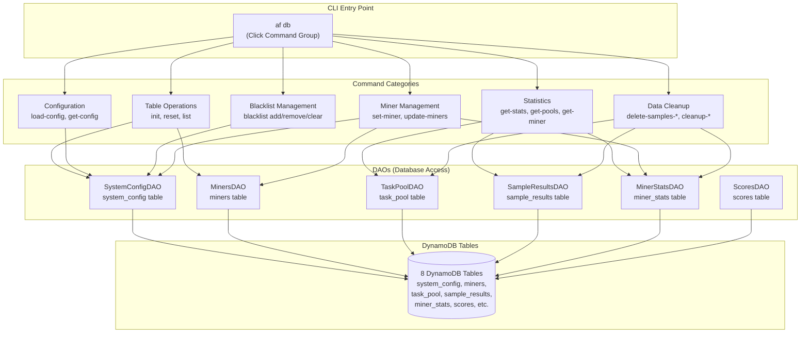
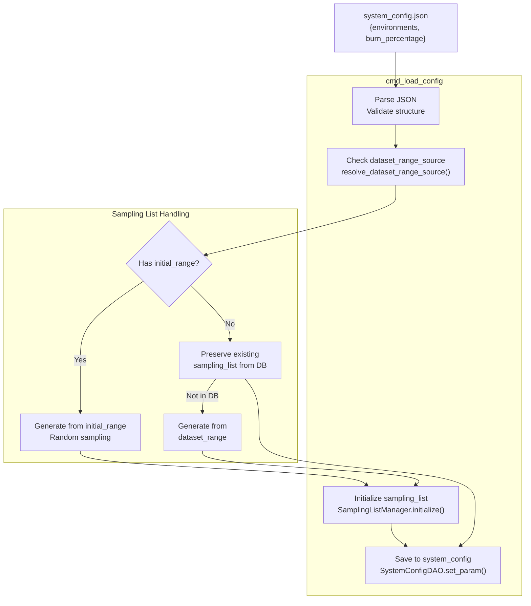
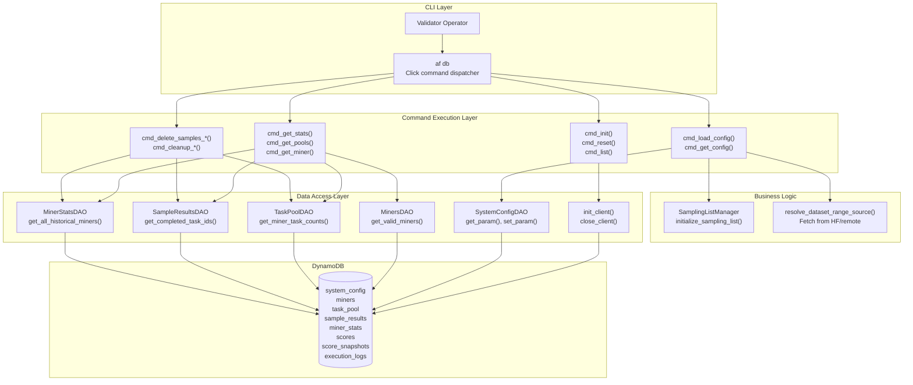

import CollapsibleAside from '../../../../components/CollapsibleAside.astro';
import SourceLink from '../../../../components/SourceLink.astro';
import Table from '../../../../components/Table.astro';

<CollapsibleAside title="Relevant Source Files">
  <SourceLink text="affine/database/cli.py" href="https://github.com/AffineFoundation/affine-cortex/blob/main/affine/database/cli.py" />
  <SourceLink text="affine/src/scheduler/sampling_scheduler.py" href="https://github.com/AffineFoundation/affine-cortex/blob/main/affine/src/scheduler/sampling_scheduler.py" />
</CollapsibleAside>

The database commands provide administrative control over the DynamoDB tables and system configuration in Affine Cortex. These commands are accessed via the `af db` CLI group and enable validators to initialize tables, manage configuration, monitor system state, and perform maintenance operations.

For information about the database schema and table structures, see [Database Schema](/subnets/database-storage/database-schema#8.1). For information about running backend services that use these tables, see [Server Commands](/subnets/cli-reference/server-commands#9.2).

**Sources:** [affine/database/cli.py:1-157]()

---

## Command Architecture

The database CLI is organized into functional command groups that operate on different aspects of the system. All commands follow the pattern `af db <command>` and interact with DynamoDB through Data Access Objects (DAOs).



**Sources:** [affine/database/cli.py:889-2157]()

---

## Table Operations

Commands for initializing, resetting, and managing DynamoDB table lifecycle.

### Command Reference

<Table>

| Command | Description | Confirmation Required |
|---------|-------------|----------------------|
| `af db init` | Initialize all DynamoDB tables with schemas | No |
| `af db list` | List all existing DynamoDB tables | No |
| `af db reset` | Delete and recreate all tables (data loss) | Yes |
| `af db reset-table --table <name>` | Reset a single table | Yes |

</Table>


### Usage Examples

```bash
# First-time setup: Initialize all tables
af db init

# List tables to verify initialization
af db list

# Reset a single table (e.g., after schema change)
af db reset-table --table task_pool

# WARNING: Reset all tables (complete data wipe)
af db reset
```

### Implementation Details

The `cmd_init()` function creates tables using schema definitions from `affine.database.schema`. Tables are created with environment prefixes (e.g., `dev_`, `prod_`) based on the `DB_ENV` environment variable. The initialization process:

1. Calls `init_client()` to establish DynamoDB connection
2. Invokes `init_tables()` to create tables with GSIs and TTL configurations
3. Handles idempotent creation (skips existing tables)
4. Closes client connection in finally block

**Sources:** [affine/database/cli.py:26-66]()

---

## Configuration Management

Commands for loading and querying system configuration including environment parameters, blacklists, and validator settings.

### Load Configuration from JSON

The `load-config` command loads environment configurations from `system_config.json` (or specified file) into the `system_config` table. This includes:

- Environment definitions (enabled flags, sampling/scoring configs)
- Sampling lists (with optional `initial_range` for first-time generation)
- Dataset ranges (with dynamic resolution from remote sources)
- Validator burn percentage

```bash
# Load default configuration file
af db load-config

# Load custom configuration
af db load-config --json-file /path/to/custom_config.json
```

**Configuration Processing Flow:**



**Key Features:**

1. **Dynamic Dataset Range Resolution**: If `dataset_range_source` is specified, the command fetches the range from a remote source (e.g., HuggingFace dataset) while preserving existing expanded ranges in the database.

2. **Smooth Sampling List Transition**: The `initial_range` field (if present) initializes the sampling list, then is removed to keep config clean. Subsequent loads preserve the existing sampling list unless `initial_range` is provided again.

3. **Idempotent Updates**: Can be run multiple times; only updates changed fields.

**Sources:** [affine/database/cli.py:106-276]()

### Query Configuration

```bash
# View complete system configuration
af db get-config

# Get validator burn percentage
af db get-burn

# Set burn percentage (0.0 to 1.0)
af db set-burn 0.05
```

The `get-config` command displays:
- Validator burn percentage (weight allocation to UID 0)
- Blacklist (list of blocked hotkeys)
- Per-environment configuration with sampling/scoring settings
- Sampling list sizes and rotation parameters

**Sources:** [affine/database/cli.py:423-540]()

---

## Blacklist Management

Commands for managing the miner blacklist, which prevents specific hotkeys from participating in validation and scoring.

### Command Reference

<Table>

| Command | Description | Example |
|---------|-------------|---------|
| `af db blacklist list` | List all blacklisted hotkeys | `af db blacklist list` |
| `af db blacklist add <hotkey>...` | Add one or more hotkeys | `af db blacklist add 5C5Dzx... 5DjHkQ...` |
| `af db blacklist remove <hotkey>...` | Remove hotkeys from list | `af db blacklist remove 5C5Dzx...` |
| `af db blacklist clear` | Clear entire blacklist | `af db blacklist clear` |

</Table>


### Usage Example

```bash
# Add multiple hotkeys to blacklist
af db blacklist add 5C5DzxZyjzN9... 5DJHkQEio6qS...

# Verify blacklist
af db blacklist list
# Output:
# Blacklist contains 2 hotkey(s):
#   1. 5C5DzxZyjzN9...
#   2. 5DJHkQEio6qS...

# Remove a hotkey
af db blacklist remove 5C5DzxZyjzN9...

# Clear all entries (requires confirmation)
af db blacklist clear
```

### Implementation

Blacklist operations modify the `blacklist` parameter in the `system_config` table through `SystemConfigDAO`. The Monitor service queries this list to filter miners during validation cycles.

**Sources:** [affine/database/cli.py:279-373]()

---

## Statistics and Monitoring

Commands for querying system state, task pools, and miner performance metrics.

### Get Environment Statistics

Display sampling statistics aggregated across all miners for each environment:

```bash
af db get-stats
```

**Output Structure:**

```
==============================================================================
GLOBAL SAMPLING STATISTICS (ALL ENVIRONMENTS)
==============================================================================

last_15min:
  Total samples: 1250
  Success: 1180 (94.4%)
  Rate limit errors: 12
  Timeout errors: 45
  Other errors: 13
  Samples/min: 83.33

[... 1hour, 6hours, 24hours windows ...]

==============================================================================
PER-ENVIRONMENT SAMPLING STATISTICS
==============================================================================

agentgym:alfworld:
--------------------------------------------------------------------------------

  last_15min:
    Total samples: 215
    Success: 198 (92.1%)
    [... error breakdown ...]
```

This command scans `miner_stats` table and aggregates `env_stats` across all miners for time windows: 15min, 1hour, 6hours, 24hours.

**Sources:** [affine/database/cli.py:1062-1175]()

### Get Task Pool Statistics

Display task counts per miner across all environments:

```bash
af db get-pools
```

**Output Format:**

```
==============================================================================
GLOBAL TASK POOL SUMMARY
==============================================================================

UID   Hotkey             Rev        Pend   Assg   Paus   Miss   Slots  15m        1h         6h         24h
--------------------------------------------------------------------------------------------------------------------------------
42    5C5Dzx...          7b4a3a...  18     4      0      145    6      24/22      98/89      542/498    1980/1820
100   5DJHkQ...          abc123...  12     2      1      87     8      32/30      125/118    670/640    2450/2280
1001  SYSTEM-1           -          25     0      0      0      10     50/48      200/192    1100/1050  4200/4000

PER-ENVIRONMENT TASK POOL BREAKDOWN
==============================================================================

agentgym:alfworld:
--------------------------------------------------------------------------------
  UID   Hotkey             Rev        Pend   Assg   Paus   Miss   Slots  [...]
  42    5C5Dzx...          7b4a3a...  6      1      0      45     6      [...]
```

**Columns:**
- **Pend**: Pending tasks (ready for execution)
- **Assg**: Assigned tasks (currently executing)
- **Paus**: Paused tasks (exceeded retry limit)
- **Miss**: Missing tasks (not yet created in pool)
- **Slots**: Current sampling slot allocation
- **15m, 1h, 6h, 24h**: Sampling stats as `samples/success` format

This command queries:
1. `TaskPoolDAO.get_miner_task_counts()` for pending/assigned/paused counts
2. `SampleResultsDAO.get_completed_task_ids()` to calculate missing tasks
3. `MinerStatsDAO.get_all_historical_miners()` for sampling statistics

**Sources:** [affine/database/cli.py:1192-1490]()

### Get Miner-Specific Pool Status

Query detailed task pool status for a single miner:

```bash
# Show all environments for UID 42
af db get-pool 42

# Show specific environment (supports shorthand)
af db get-pool 42 webshop
af db get-pool 1001 agentgym:alfworld

# Print full task_id lists without truncation
af db get-pool 42 --full
```

**Output:**

```
Miner: UID=42, Hotkey=5C5Dzx..., Revision=7b4a3a...
Model: hf://org/affine-model

==============================================================================
Environment: agentgym:alfworld
==============================================================================

Sampling list size: 200
Total tasks in range: 200

Status:
  Sampled:    125
  Pending:     18
  Assigned:     4
  Paused:       0
  Missing:     53

Sampled task_ids: [0, 1, 2, 3, 5, 7, 8, 9, ...]
Pending task_ids: [127, 128, 130, 131, 135, ...]
Missing task_ids: [145, 146, 148, 150, 152, ...]
```

**Sources:** [affine/database/cli.py:1506-1633]()

### Get Miner Performance Details

Query comprehensive performance metrics for a specific miner:

```bash
# Get stats for all revisions of a hotkey
af db get-miner --hotkey 5DJHkQEio6qSayH3

# Get stats for specific revision
af db get-miner --hotkey 5DJHkQEio6qSayH3 --revision 7b4a3a20
```

**Output Sections:**

1. **Basic Info**: UID, hotkey, revision, model, timestamps, rank, weight
2. **Sampling Slots**: Current allocation (3-10) and last adjustment time
3. **Global Sampling Statistics**: Aggregated across all environments
4. **Per-Environment Statistics**: Breakdown for each environment

This command reads from `miner_stats` table which tracks:
- `sampling_stats`: Global aggregated metrics
- `env_stats`: Per-environment breakdown
- `sampling_slots`: Dynamic slot allocation (adjusted by MinerSlotsAdjuster)
- Historical best rank/weight

**Sources:** [affine/database/cli.py:1658-1858]()

---

## Miner Management

Commands for managing miner records, system miners, and slot allocations.

### Update Miner Statistics

Initialize or backfill `miner_stats` table from `sample_results`:

```bash
af db update-miners
```

This command performs a batch scan of `sample_results` to:
1. Extract all unique `(hotkey, revision)` combinations
2. Create `miner_stats` records for new miners
3. Update `first_seen_at` and `last_updated_at` timestamps
4. Process 1000 samples per batch to avoid memory overflow

**Note:** Historical `best_rank` and `best_weight` are not populated (requires online metagraph data).

**Sources:** [affine/database/cli.py:673-886]()

### System Miners

System miners are benchmark models (e.g., GPT-4o, Claude) that participate in scoring but don't receive rewards. Their UIDs are > 1000 and their weights are burned (allocated to UID 0).

```bash
# Add a system miner (small numbers auto-convert: 3 -> 1003)
af db set-miner --uid 1001 --model "zai-org/GLM-4.7"
af db set-miner --uid 3 --model "deepseek-ai/DeepSeek-V3"

# List all system miners
af db list-system-miners

# Delete a system miner
af db delete-miner --uid 1001
```

System miner configuration is stored in `system_config` table under the `system_miners` parameter. The Monitor service creates entries in the `miners` table with:
- `hotkey`: `SYSTEM-<N>` (e.g., `SYSTEM-1`)
- `revision`: `SYSTEM-<N>`
- `uid`: 1000 + N

**Sources:** [affine/database/cli.py:1882-2066]()

### Sampling Slots Management

Adjust dynamic slot allocation for individual miners:

```bash
# Set slots for UID 42 (range: 3-10)
af db set-slots 42 8

# Set slots for system miner
af db set-slots 1001 10
```

Sampling slots control how many concurrent tasks a miner can have in the task pool. The `MinerSlotsAdjuster` service automatically adjusts slots based on performance (see [Task Scheduling System](/subnets/for-validators/task-scheduling-system#5.3)), but manual overrides are useful for:
- Testing new miners with higher capacity
- Throttling problematic miners
- Ensuring system miners get sufficient sampling

**Sources:** [affine/database/cli.py:1938-1975](), [affine/src/scheduler/sampling_scheduler.py:36-42]()

---

## Data Cleanup and Maintenance

Commands for removing invalid data and managing database hygiene.

### Delete Samples by Range

Remove samples within a specific task ID range:

```bash
# Delete for specific miner and environment
af db delete-samples-by-range \
  --hotkey 5C5Dzx... \
  --revision 7b4a3a... \
  --env agentgym:alfworld \
  --start-task-id 0 \
  --end-task-id 100

# Delete for ALL miners in environment (no hotkey/revision)
af db delete-samples-by-range \
  --env agentgym:alfworld \
  --start-task-id 0 \
  --end-task-id 100
```

This is useful when:
- A bug caused invalid samples to be stored
- Dataset range was adjusted and old samples should be removed
- Re-evaluation is needed for specific tasks

**Sources:** [affine/database/cli.py:543-594]()

### Delete Invalid Samples

Remove all samples with empty conversation field (invalid results):

```bash
af db delete-samples-empty-conversation
```

This command scans the entire `sample_results` table and deletes entries where the `conversation` field is null or empty. These typically result from execution errors where the environment failed to produce output.

**Sources:** [affine/database/cli.py:597-619]()

### Cleanup Inactive Miners

Remove long-inactive miners from `miner_stats` table:

```bash
# Find miners inactive for 30+ days with zero weight
af db cleanup-inactive-miners --days 30

# Longer threshold for aggressive cleanup
af db cleanup-inactive-miners --days 90
```

**Deletion Criteria:**
- `last_updated_at` > `days` threshold
- `best_weight` == 0 (never received any weight)

This prevents `miner_stats` table growth from transient test miners that never participated meaningfully.

**Sources:** [affine/database/cli.py:622-670]()

### Delete Paused Tasks

Remove paused tasks (exceeded retry limit) to allow re-sampling:

```bash
# Delete paused tasks for specific miner and environment
af db delete-paused 42 agentgym:alfworld

# Use environment shorthand
af db delete-paused 1001 webshop
```

Paused tasks occur when sampling fails repeatedly (e.g., rate limiting, model timeout). Deleting them allows the scheduler to create fresh tasks for those task IDs.

**Sources:** [affine/database/cli.py:2069-2148]()

---

## Command Execution Flow

The following diagram illustrates how database commands interact with the broader system:



**Sources:** [affine/database/cli.py:1-2157]()

---

## Best Practices

### Initialization Workflow

For first-time validator setup:

```bash
# 1. Initialize tables
af db init

# 2. Load configuration
af db load-config

# 3. Verify configuration
af db get-config

# 4. Monitor system state
af db get-stats
af db get-pools
```

### Configuration Updates

When updating environment configuration:

```bash
# 1. Edit system_config.json
# 2. Load new configuration (idempotent)
af db load-config

# 3. Verify changes
af db get-config

# 4. Monitor scheduler adaptation
# The PerMinerSamplingScheduler will detect changes
# and adjust task allocation automatically
```

### Maintenance Schedule

Recommended periodic maintenance:

```bash
# Weekly: Check for inactive miners (30+ days)
af db cleanup-inactive-miners --days 30

# Monthly: Review and update blacklist
af db blacklist list

# As needed: Clean up invalid samples
af db delete-samples-empty-conversation
```

### Troubleshooting

Common diagnostic commands:

```bash
# Check if miner is receiving tasks
af db get-pool <uid>

# Verify miner has valid samples
af db get-miner --hotkey <hotkey>

# Check environment statistics
af db get-stats

# Inspect system configuration
af db get-config
```

**Sources:** [affine/database/cli.py:26-276](), [affine/src/scheduler/sampling_scheduler.py:125-188]()

---

## Related Commands

- For running the backend services that use these tables, see [Server Commands](/subnets/cli-reference/server-commands#9.2)
- For miner-specific operations like deployment and sample retrieval, see [Miner Commands](/subnets/cli-reference/miner-commands#9.3)
- For detailed schema documentation, see [Database Schema](/subnets/database-storage/database-schema#8.1)
- For task pool lifecycle management, see [Task Pool Management](/subnets/database-storage/task-pool-management#8.3)
