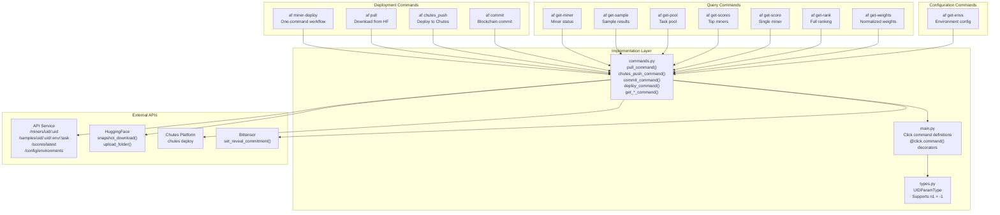
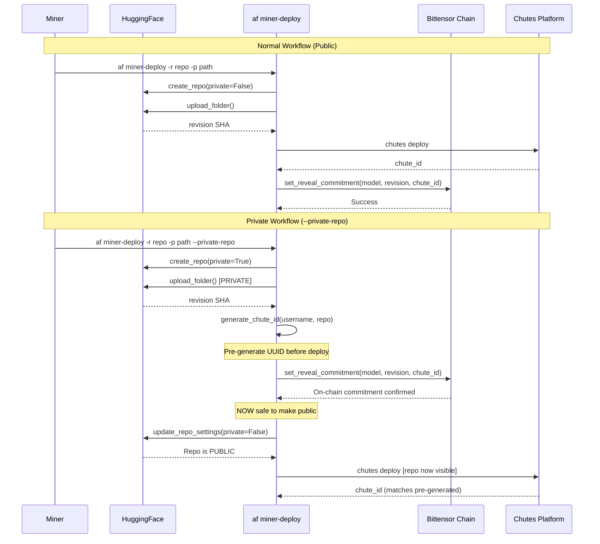
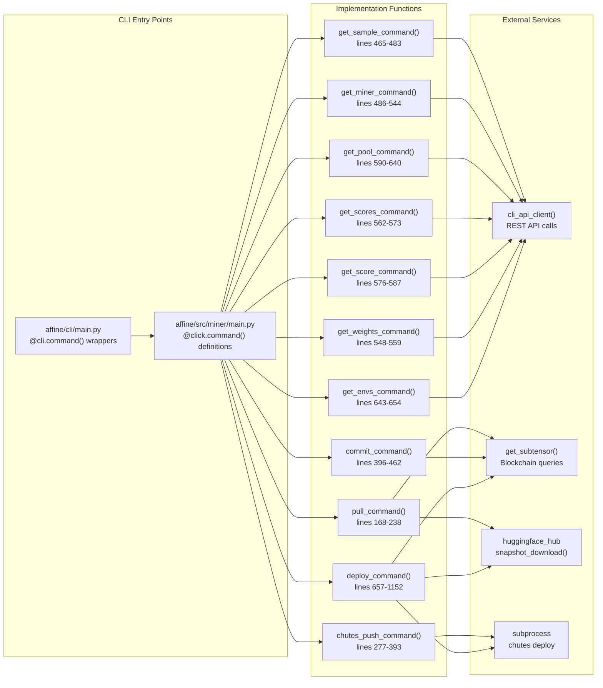

import CollapsibleAside from '../../../../components/CollapsibleAside.astro';
import SourceLink from '../../../../components/SourceLink.astro';
import Table from '../../../../components/Table.astro';

<CollapsibleAside title="Relevant Source Files">
  <SourceLink text="affine/api/routers/samples.py" href="https://github.com/AffineFoundation/affine-cortex/blob/main/affine/api/routers/samples.py" />
  <SourceLink text="affine/cli/main.py" href="https://github.com/AffineFoundation/affine-cortex/blob/main/affine/cli/main.py" />
  <SourceLink text="affine/cli/types.py" href="https://github.com/AffineFoundation/affine-cortex/blob/main/affine/cli/types.py" />
  <SourceLink text="affine/src/miner/commands.py" href="https://github.com/AffineFoundation/affine-cortex/blob/main/affine/src/miner/commands.py" />
  <SourceLink text="affine/src/miner/main.py" href="https://github.com/AffineFoundation/affine-cortex/blob/main/affine/src/miner/main.py" />
</CollapsibleAside>

This page documents the CLI commands available for miners participating in the Affine Cortex network. These commands handle the complete miner lifecycle: model deployment (uploading to HuggingFace, deploying to Chutes, committing to blockchain) and status monitoring (querying samples, scores, and task pools).

For information about validator-specific commands, see [Server Commands](/subnets/cli-reference/server-commands#9.2). For database administration commands, see [Database Commands](/subnets/cli-reference/database-commands#9.4). For conceptual information about the miner role and requirements, see [For Miners](/subnets/for-miners#4).

---

## Command Overview

The miner commands are grouped into three categories:

1. **Deployment Commands**: Upload, deploy, and commit models
   - `af miner-deploy` - One-command deployment workflow
   - `af pull` - Pull model from HuggingFace
   - `af chutes_push` - Deploy model to Chutes
   - `af commit` - Commit model metadata to blockchain

2. **Query Commands**: Monitor miner status and performance
   - `af get-miner` - Query miner information by UID
   - `af get-sample` - Query sample results by UID/env/task
   - `af get-pool` - Query task pool status
   - `af get-scores` - Query top miner scores
   - `af get-score` - Query specific miner score
   - `af get-rank` - Display full ranking table
   - `af get-weights` - Query normalized weights

3. **Configuration Commands**: Query system configuration
   - `af get-envs` - Query environment configurations

All commands use the `af` CLI entry point and support the global `-v`, `-vv`, `-vvv` verbosity flags for logging control.

**Sources:** [affine/cli/main.py:162-365](), [affine/src/miner/main.py:1-270]()

---

## Command Flow Architecture



**Sources:** [affine/cli/main.py:162-344](), [affine/src/miner/commands.py:1-1308](), [affine/src/miner/main.py:1-270]()

---

## Deployment Commands

### af miner-deploy

**Purpose:** One-command deployment that combines upload, deploy, and commit into a single workflow with support for private repository patterns.

**Usage:**
```bash
af miner-deploy -r <repo> -p <model_path> [options]
```

**Options:**

<Table>

| Option | Required | Description |
|--------|----------|-------------|
| `-r, --repo` | Yes | HuggingFace repository ID (e.g., `username/model-name`) |
| `-p, --model-path` | Conditional | Path to local model directory (required unless `--skip-upload`) |
| `--revision` | Conditional | HuggingFace revision SHA (required if `--skip-upload`) |
| `--chute-id` | Conditional | Chutes deployment ID (required if `--skip-chutes`) |
| `-m, --message` | No | Commit message for HuggingFace upload (default: "Model update") |
| `--dry-run` | No | Show what would be done without executing |
| `--skip-upload` | No | Skip HuggingFace upload (requires `--revision`) |
| `--skip-chutes` | No | Skip Chutes deployment (requires `--chute-id`) |
| `--skip-commit` | No | Skip on-chain commit |
| `--private-repo` | No | Use private HF repo workflow (commit before deploy) |
| `--chutes-api-key` | No | Chutes API key (defaults to `CHUTES_API_KEY` env var) |
| `--chute-user` | No | Chutes username (defaults to `CHUTE_USER` env var) |
| `--coldkey` | No | Wallet coldkey name (defaults to `BT_WALLET_COLD` env var) |
| `--hotkey` | No | Wallet hotkey name (defaults to `BT_WALLET_HOT` env var) |
| `--hf-token` | No | HuggingFace token (defaults to `HF_TOKEN` env var) |

</Table>


**Normal Workflow:**
1. Upload model to HuggingFace (public repo)
2. Deploy to Chutes
3. Commit metadata to blockchain

**Private Repo Workflow (`--private-repo` flag):**
1. Upload to **private** HuggingFace repo
2. Pre-generate `chute_id` deterministically
3. **Commit to blockchain first** (before deployment visible)
4. Make HuggingFace repo public
5. Deploy to Chutes

The private workflow prevents timing attacks where competitors could copy and commit your model before you do.

**Examples:**

```bash
# Full deployment (public workflow)
af miner-deploy -r myuser/model -p ./my_model

# Private repo workflow (recommended for competitive advantage)
af miner-deploy -r myuser/model -p ./my_model --private-repo

# Skip upload (model already on HuggingFace)
af miner-deploy -r myuser/model --skip-upload --revision abc123def

# Skip Chutes (already deployed)
af miner-deploy -r myuser/model --skip-upload --revision abc123 --skip-chutes --chute-id xyz-uuid

# Dry run to preview steps
af miner-deploy -r myuser/model -p ./my_model --dry-run
```

**Implementation Details:**

The command is implemented in [affine/src/miner/commands.py:657-1152]() as `deploy_command()`. Key logic includes:

- **Private Repo Workflow**: Uses `generate_chute_id()` [affine/src/miner/commands.py:40-54]() to pre-generate the chute ID using `uuid.uuid5(NAMESPACE_OID, f"{username}::chute::{repo}")`, matching Chutes' internal formula
- **Upload Functions**: `create_private_hf_repo()`, `upload_to_private_repo()`, `make_hf_repo_public()` [affine/src/miner/commands.py:57-138]()
- **Chutes Deployment**: Creates a temporary `tmp_chute.py` file with `build_sglang_chute()` configuration [affine/src/miner/commands.py:927-950]()
- **Blockchain Commit**: Uses `subtensor.set_reveal_commitment()` with retry logic for `SpaceLimitExceeded` errors [affine/src/miner/commands.py:878-892]()

**Sources:** [affine/cli/main.py:326-344](), [affine/src/miner/main.py:197-265](), [affine/src/miner/commands.py:657-1152]()

---

### af pull

**Purpose:** Download a miner's model from HuggingFace by UID. Automatically resolves the miner's current model repository and revision from blockchain commitments.

**Usage:**
```bash
af pull <uid> [options]
```

**Arguments:**

<Table>

| Argument | Type | Description |
|----------|------|-------------|
| `uid` | UID | Miner UID (supports `n1` syntax for `-1`) |

</Table>


**Options:**

<Table>

| Option | Required | Description |
|--------|----------|-------------|
| `-p, --model-path` | No | Local directory to save model (default: `./model_path`) |
| `--hf-token` | No | HuggingFace API token (defaults to `HF_TOKEN` env var) |

</Table>


**Examples:**

```bash
# Pull model for UID 42
af pull 42 -p ./models/uid42

# Pull model for UID -1 (use n prefix)
af pull n1 -p ./models/uid_minus1

# Pull with explicit HF token
af pull 100 --hf-token hf_abc123xyz
```

**Implementation Flow:**

1. Query subtensor metagraph to get hotkey for UID
2. Query revealed commitments to get model repo and revision
3. Download using `huggingface_hub.snapshot_download()`
4. Output JSON result with success status

The command implementation at [affine/src/miner/commands.py:168-238]() includes error handling for invalid UIDs, missing commits, and download failures.

**Sources:** [affine/cli/main.py:174-181](), [affine/src/miner/main.py:33-46](), [affine/src/miner/commands.py:168-238]()

---

### af chutes_push

**Purpose:** Deploy a model to the Chutes platform for inference serving.

**Usage:**
```bash
af chutes_push --repo <repo> --revision <revision> [options]
```

**Options:**

<Table>

| Option | Required | Description |
|--------|----------|-------------|
| `--repo` | Yes | HuggingFace repository ID |
| `--revision` | Yes | HuggingFace commit SHA |
| `--chutes-api-key` | No | Chutes API key (defaults to `CHUTES_API_KEY` env var) |
| `--chute-user` | No | Chutes username (defaults to `CHUTE_USER` env var) |

</Table>


**Examples:**

```bash
af chutes_push --repo myuser/model --revision abc123def456
```

**Deployment Configuration:**

The command generates a temporary `tmp_chute.py` file with the following Chutes configuration:

```python
chute = build_sglang_chute(
    username="{chute_user}",
    readme="{repo}",
    model_name="{repo}",
    image="chutes/sglang:nightly-2025081600",
    concurrency=40,
    revision="{revision}",
    node_selector=NodeSelector(
        gpu_count=4,
        include=["h200"],
    ),
    scaling_threshold=0.5,
    max_instances=2,
    shutdown_after_seconds=28800,
)
```

The deployment runs `chutes deploy tmp_chute:chute --accept-fee` via subprocess and automatically confirms with `y\n` input [affine/src/miner/commands.py:341-356]().

After deployment, the command queries the Chutes API to retrieve the `chute_id` by finding the most recent chute matching the repository name [affine/src/miner/commands.py:376-377]().

**Sources:** [affine/cli/main.py:184-191](), [affine/src/miner/main.py:49-61](), [affine/src/miner/commands.py:277-393]()

---

### af commit

**Purpose:** Commit model metadata to the Bittensor blockchain. This registers the model's HuggingFace repository, revision, and Chutes deployment ID on-chain.

**Usage:**
```bash
af commit --repo <repo> --revision <revision> --chute-id <chute_id> [options]
```

**Options:**

<Table>

| Option | Required | Description |
|--------|----------|-------------|
| `--repo` | Yes | HuggingFace repository ID |
| `--revision` | Yes | HuggingFace commit SHA |
| `--chute-id` | Yes | Chutes deployment ID (UUID) |
| `--coldkey` | No | Wallet coldkey name (defaults to `BT_WALLET_COLD` env var) |
| `--hotkey` | No | Wallet hotkey name (defaults to `BT_WALLET_HOT` env var) |

</Table>


**Examples:**

```bash
af commit --repo myuser/model --revision abc123 --chute-id 550e8400-e29b-41d4-a716-446655440000
```

**On-Chain Data Structure:**

The commit stores a JSON object in the blockchain metadata:

```json
{
  "model": "myuser/model",
  "revision": "abc123def456...",
  "chute_id": "550e8400-e29b-41d4-a716-446655440000"
}
```

**Implementation Details:**

- Uses `subtensor.set_reveal_commitment()` with `blocks_until_reveal=1` for immediate revealing [affine/src/miner/commands.py:433-437]()
- Implements retry logic for `SpaceLimitExceeded` errors by waiting for the next block [affine/src/miner/commands.py:440-445]()
- Outputs JSON result indicating success or failure

**Sources:** [affine/cli/main.py:164-171](), [affine/src/miner/main.py:64-78](), [affine/src/miner/commands.py:396-462]()

---

## Private Repo Workflow Diagram



The key difference: in private workflow, the blockchain commitment happens **before** the model becomes publicly visible, preventing race conditions where competitors could copy and commit your model first.

**Sources:** [affine/src/miner/commands.py:29-162](), [affine/src/miner/commands.py:746-916]()

---

## Query Commands

### af get-miner

**Purpose:** Query comprehensive miner information including validation status, model details, and sampling statistics.

**Usage:**
```bash
af get-miner <uid>
```

**Arguments:**

<Table>

| Argument | Type | Description |
|----------|------|-------------|
| `uid` | UID | Miner UID (supports `n1` syntax for `-1`) |

</Table>


**Example Output:**

```json
{
  "uid": 42,
  "hotkey": "5GrwvaEF5zXb26Fz9rcQpDWS57CtERHpNehXCPcNoHGKutQY",
  "model": "username/model-name",
  "revision": "abc123def456...",
  "chute_id": "550e8400-e29b-41d4-a716-446655440000",
  "is_valid": true,
  "model_hash": "sha256:...",
  "template_check_result": "safe",
  "first_block": 1234567,
  "last_updated_at": "2024-01-15T10:30:00Z"
}
```

**Sampling Statistics:**

The command also displays detailed sampling statistics across multiple time windows:

```
================================================================================
GLOBAL SAMPLING STATISTICS
================================================================================

last_15min:
  Samples: 45
  Success: 42
  Success rate: 93.33%
  Samples/min: 3.00
  Rate limit errors: 2
  Timeout errors: 1
  Other errors: 0

last_1hour:
  Samples: 180
  Success: 165
  Success rate: 91.67%
  ...

================================================================================
PER-ENVIRONMENT STATISTICS
================================================================================

[affine:sat]
  last_15min:
    Samples: 15
    Success: 14
    Success rate: 93.33%
    ...
```

The implementation fetches miner info from `/miners/uid/:uid` and sampling stats from `/miners/uid/:uid/stats` [affine/src/miner/commands.py:486-544]().

**Sources:** [affine/cli/main.py:208-223](), [affine/src/miner/main.py:98-112](), [affine/src/miner/commands.py:486-544]()

---

### af get-sample

**Purpose:** Query a specific sample result by UID, environment, and task ID.

**Usage:**
```bash
af get-sample <uid> <env> <task_id>
```

**Arguments:**

<Table>

| Argument | Type | Description |
|----------|------|-------------|
| `uid` | UID | Miner UID |
| `env` | string | Environment name (e.g., `affine:sat` or shorthand `sat`) |
| `task_id` | string | Task identifier |

</Table>


**Examples:**

```bash
# Query sample for UID 42
af get-sample 42 affine:sat task_123

# Use shorthand environment name
af get-sample 100 sat task_456

# Query for UID -1
af get-sample n1 affine:sat task_789
```

**API Endpoint:** `/samples/uid/{uid}/{env}/{task_id}` with automatic hotkey and revision resolution [affine/api/routers/samples.py:92-188]()

**Behavior:**
- First checks `sample_results` table for completed samples
- Falls back to `task_pool` table if sample not yet completed
- Resolves environment shorthand (e.g., `sat` → `affine:sat`)
- Returns full sample details including conversation data

**Sources:** [affine/cli/main.py:194-205](), [affine/src/miner/main.py:81-96](), [affine/src/miner/commands.py:465-483](), [affine/api/routers/samples.py:92-188]()

---

### af get-pool

**Purpose:** Query task pool status for a specific miner in an environment, showing pending tasks, completed tasks, and missing tasks.

**Usage:**
```bash
af get-pool <uid> <env> [--full]
```

**Arguments:**

<Table>

| Argument | Type | Description |
|----------|------|-------------|
| `uid` | UID | Miner UID |
| `env` | string | Environment name (e.g., `agentgym:webshop` or shorthand `webshop`) |

</Table>


**Options:**

<Table>

| Option | Description |
|--------|-------------|
| `--full` | Print full task ID lists without truncation |

</Table>


**Examples:**

```bash
# Query pool for UID 100
af get-pool 100 agentgym:webshop

# Use shorthand environment name
af get-pool 100 webshop

# Show full task ID lists
af get-pool 100 webshop --full
```

**Output Structure:**

```json
{
  "uid": 100,
  "hotkey": "5GrwvaEF...",
  "model_revision": "abc123...",
  "env": "agentgym:webshop",
  "sampling_config": {
    "sampling_count": 100,
    "rotation_rate": 0.1
  },
  "total_tasks": 500,
  "sampled_count": 75,
  "pool_count": 25,
  "missing_count": 400,
  "sampled_task_ids": "[1, 2, 3, 4, 5, ..., 71, 72, 73, 74, 75] (total: 75)",
  "pool_task_ids": "[76, 77, 78, ..., 98, 99, 100] (total: 25)",
  "missing_task_ids": "[101, 102, 103, ..., 498, 499, 500] (total: 400)"
}
```

**Task Status Categories:**

1. **Sampled Tasks**: Completed and stored in `sample_results` table
2. **Pool Tasks**: Currently in `task_pool` with status `pending` or `assigned`
3. **Missing Tasks**: Not yet sampled and not in pool (calculated as: `all_task_ids - sampled - pool`)

The command uses the API endpoint `/samples/pool/uid/{uid}/{env}` which aggregates data from multiple tables [affine/api/routers/samples.py:221-343]().

**Sources:** [affine/cli/main.py:276-289](), [affine/src/miner/main.py:153-168](), [affine/src/miner/commands.py:590-640](), [affine/api/routers/samples.py:221-343]()

---

### af get-scores

**Purpose:** Query the latest scores for the top N miners, sorted by descending score.

**Usage:**
```bash
af get-scores [--top N]
```

**Options:**

<Table>

| Option | Default | Description |
|--------|---------|-------------|
| `-t, --top` | 10 | Number of top miners to return |

</Table>


**Examples:**

```bash
# Get top 10 miners (default)
af get-scores

# Get top 50 miners
af get-scores --top 50
```

**Output:** JSON array of miner scores from the latest score snapshot, ordered by score descending.

**API Endpoint:** `/scores/latest?top=N`

**Sources:** [affine/cli/main.py:243-257](), [affine/src/miner/main.py:127-138](), [affine/src/miner/commands.py:562-573]()

---

### af get-score

**Purpose:** Query the detailed score breakdown for a specific miner by UID.

**Usage:**
```bash
af get-score <uid>
```

**Arguments:**

<Table>

| Argument | Type | Description |
|----------|------|-------------|
| `uid` | UID | Miner UID |

</Table>


**Examples:**

```bash
af get-score 42
af get-score n1
```

**Output:** JSON object containing the miner's score details including per-environment scores, per-layer scores, and overall normalized score.

**API Endpoint:** `/scores/uid/{uid}`

**Sources:** [affine/cli/main.py:260-273](), [affine/src/miner/main.py:140-151](), [affine/src/miner/commands.py:576-587]()

---

### af get-weights

**Purpose:** Query the latest normalized weights suitable for on-chain weight setting. Returns the most recent score snapshot with all miners' weights.

**Usage:**
```bash
af get-weights
```

**Output:** JSON object containing the complete weight vector for all miners, formatted for direct use with Bittensor's `set_weights()` function.

**API Endpoint:** `/scores/weights/latest`

**Sources:** [affine/cli/main.py:226-240](), [affine/src/miner/main.py:115-125](), [affine/src/miner/commands.py:548-559]()

---

### af get-rank

**Purpose:** Display a formatted ranking table of all miners with their scores, matching the scorer's detailed output format.

**Usage:**
```bash
af get-rank
```

**Output:** ASCII table showing miner rankings with columns for UID, hotkey, score, per-environment scores, and validation status.

The implementation is in `affine/src/miner/rank.py` (not shown in provided files) and queries the API's score snapshot endpoint.

**Sources:** [affine/cli/main.py:292-306](), [affine/src/miner/main.py:171-181]()

---

## Configuration Commands

### af get-envs

**Purpose:** Query the current environment configurations including sampling settings, rotation rates, and enabled flags.

**Usage:**
```bash
af get-envs
```

**Output Example:**

```json
{
  "environments": {
    "affine:sat": {
      "enabled": true,
      "sampling_config": {
        "sampling_count": 100,
        "rotation_rate": 0.1
      },
      "scoring_config": {
        "score_weight": 1.0
      }
    },
    "agentgym:webshop": {
      "enabled": true,
      "sampling_config": {
        "sampling_count": 50,
        "rotation_rate": 0.2
      }
    }
  }
}
```

**API Endpoint:** `/config/environments`

**Sources:** [affine/cli/main.py:309-323](), [affine/src/miner/main.py:184-194](), [affine/src/miner/commands.py:643-654]()

---

## UID Parameter Type

All miner commands that accept UID arguments use a custom `UID` parameter type that supports negative values with an `n` prefix.

**Custom Type Definition:**

The `UIDParamType` class [affine/cli/types.py:8-51]() provides special handling:

```python
class UIDParamType(click.ParamType):
    name = "uid"
    
    def convert(self, value, param, ctx):
        # Handle 'n' prefix for negative numbers (e.g., n1 -> -1)
        if value_str.lower().startswith('n') and len(value_str) > 1:
            return -int(value_str[1:])
        return int(value_str)
```

**Usage Examples:**

<Table>

| Input | Interpreted As | Description |
|-------|---------------|-------------|
| `42` | `42` | Regular positive integer |
| `0` | `0` | Zero |
| `n1` | `-1` | Negative one (last miner) |
| `n10` | `-10` | Negative ten |

</Table>


This syntax is particularly useful for querying validators or system miners that may have negative UIDs in the metagraph.

**Sources:** [affine/cli/types.py:1-54]()

---

## Command Implementation Mapping



**Sources:** [affine/cli/main.py:164-323](), [affine/src/miner/main.py:1-270](), [affine/src/miner/commands.py:1-1308]()

---

## Error Handling

All commands implement consistent error handling patterns:

1. **JSON Output:** All commands output JSON for machine-readable results
2. **Exit Codes:** Non-zero exit codes on failure (`sys.exit(1)`)
3. **Logging:** Uses the `logger` from `affine.core.setup` with verbosity control
4. **Validation:** Input validation before execution
5. **Retry Logic:** Blockchain operations retry on `SpaceLimitExceeded` errors

**Common Error Patterns:**

```python
try:
    # Command logic
    result = {"success": True, ...}
    print(json.dumps(result))
except Exception as e:
    logger.error(f"Operation failed: {e}")
    print(json.dumps({"success": False, "error": str(e)}))
    sys.exit(1)
```

**Sources:** [affine/src/miner/commands.py:168-1308]()

---

## Environment Variables

Miner commands respect the following environment variables (all optional if provided via CLI flags):

<Table>

| Variable | Purpose | Commands |
|----------|---------|----------|
| `HF_TOKEN` | HuggingFace API token | `pull`, `miner-deploy` |
| `CHUTES_API_KEY` | Chutes API key | `chutes_push`, `miner-deploy` |
| `CHUTE_USER` | Chutes username | `chutes_push`, `miner-deploy` |
| `BT_WALLET_COLD` | Bittensor coldkey name | `commit`, `miner-deploy` |
| `BT_WALLET_HOT` | Bittensor hotkey name | `commit`, `miner-deploy` |
| `SUBTENSOR_ENDPOINT` | Subtensor RPC endpoint | `pull`, `commit` |
| `API_URL` | API base URL | All query commands |

</Table>


These are retrieved using `get_conf(key, default)` in [affine/src/miner/commands.py:23-25]().

**Sources:** [affine/src/miner/commands.py:23-25]()
