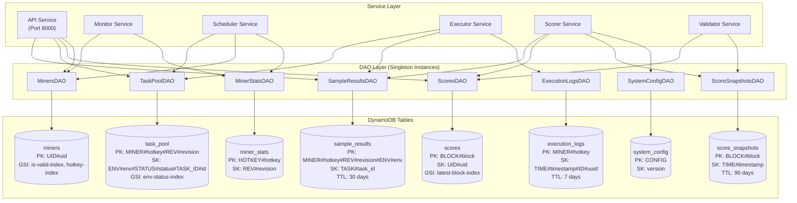
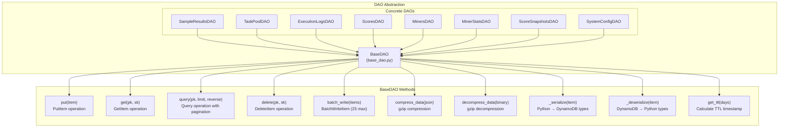
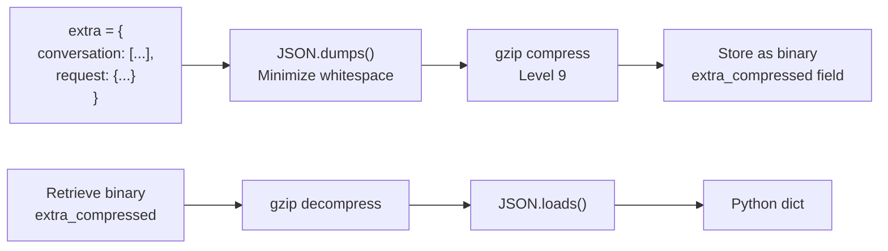
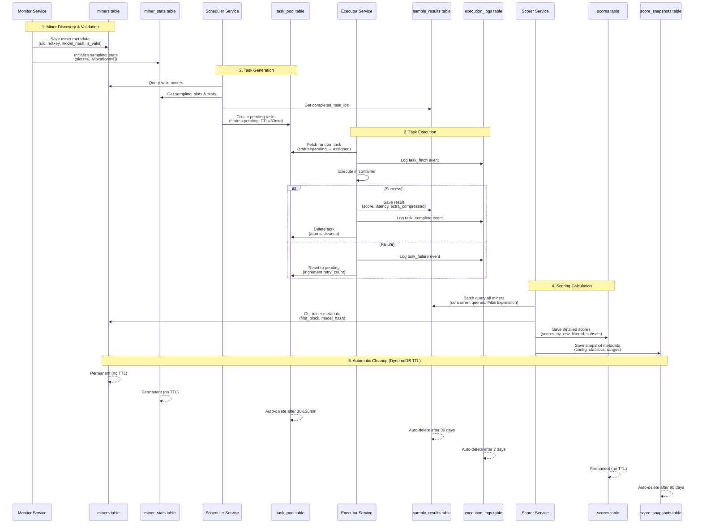

import CollapsibleAside from '../../../components/CollapsibleAside.astro';
import SourceLink from '../../../components/SourceLink.astro';
import Table from '../../../components/Table.astro';

<CollapsibleAside title="Relevant Source Files">
  <SourceLink text="affine/api/dependencies.py" href="https://github.com/AffineFoundation/affine-cortex/blob/main/affine/api/dependencies.py" />
  <SourceLink text="affine/database/dao/__init__.py" href="https://github.com/AffineFoundation/affine-cortex/blob/main/affine/database/dao/__init__.py" />
  <SourceLink text="affine/database/dao/execution_logs.py" href="https://github.com/AffineFoundation/affine-cortex/blob/main/affine/database/dao/execution_logs.py" />
  <SourceLink text="affine/database/dao/sample_results.py" href="https://github.com/AffineFoundation/affine-cortex/blob/main/affine/database/dao/sample_results.py" />
  <SourceLink text="affine/database/schema.py" href="https://github.com/AffineFoundation/affine-cortex/blob/main/affine/database/schema.py" />
  <SourceLink text="affine/database/tables.py" href="https://github.com/AffineFoundation/affine-cortex/blob/main/affine/database/tables.py" />
  <SourceLink text="compose/docker-compose.backend.yml" href="https://github.com/AffineFoundation/affine-cortex/blob/main/compose/docker-compose.backend.yml" />
</CollapsibleAside>

This document describes the database architecture, schema design, and data storage patterns used in Affine Cortex. It covers the eight DynamoDB tables, their key structures, query patterns, and lifecycle management. For information about the API endpoints that interact with this storage layer, see [API Reference](/subnets/api-reference#13). For details on how services coordinate through the database, see [Backend Services Deep Dive](/subnets/backend-services-deep-dive#11).

---

## Overview

Affine Cortex uses **AWS DynamoDB** as its primary database, implementing a NoSQL schema optimized for high-throughput read/write operations across distributed services. The storage layer supports the complete miner evaluation lifecycle: task distribution, result collection, scoring calculations, and historical analysis.

**Key Characteristics:**
- **8 DynamoDB tables** with specialized access patterns
- **Pay-per-request billing** for cost efficiency
- **TTL-based automatic cleanup** for transient data (7-30 days)
- **Global Secondary Indexes (GSI)** for alternate query patterns
- **Compression** for large payload fields (conversations, request data)
- **DAO pattern** for abstracted data access

**Sources:** [affine/database/schema.py:1-305](), [compose/docker-compose.backend.yml:1-105]()

---

## Database Architecture



**Sources:** [affine/database/dao/__init__.py:1-23](), [affine/api/dependencies.py:23-112]()

### Connection Management

DynamoDB connections are managed through a centralized client singleton. The `get_client()` function returns an `aioboto3` session configured with AWS credentials and region from environment variables.

**Table Naming Convention:**
```python
# Format: {prefix}_{table_name}
# Example: affine_subnet64_sample_results
table_name = f"{get_table_prefix()}_{base_name}"
```

**Configuration Variables:**
- `AWS_REGION` - AWS region for DynamoDB (default: `us-east-1`)
- `AWS_ACCESS_KEY_ID` - AWS access credentials
- `AWS_SECRET_ACCESS_KEY` - AWS secret credentials
- `DYNAMODB_TABLE_PREFIX` - Namespace prefix (e.g., `affine_subnet64`)

**Sources:** [affine/database/schema.py:10-13](), [affine/database/client.py]()

---

## Table Schemas

### Schema Overview Table

<Table>

| Table | Primary Use | PK Structure | SK Structure | GSI | TTL |
|-------|-------------|--------------|--------------|-----|-----|
| `sample_results` | Task execution results | `MINER#{hotkey}#REV#{revision}#ENV#{env}` | `TASK#{task_id}` | `timestamp-index` | 30 days |
| `task_pool` | Active task queue | `MINER#{hotkey}#REV#{revision}` | `ENV#{env}#STATUS#{status}#TASK_ID#{task_id}` | `env-status-index` | Variable |
| `execution_logs` | Debug event trail | `MINER#{hotkey}` | `TIME#{timestamp}#ID#{uuid}` | None | 7 days |
| `scores` | Per-miner detailed scores | `BLOCK#{block}` | `UID#{uid}` | `latest-block-index` | None |
| `score_snapshots` | Block-level metadata | `BLOCK#{block}` | `TIME#{timestamp}` | `latest-index` | 90 days |
| `miners` | Miner validation state | `UID#{uid}` | None | `is-valid-index`, `hotkey-index` | None |
| `miner_stats` | Sampling statistics | `HOTKEY#{hotkey}` | `REV#{revision}` | None | None |
| `system_config` | Global configuration | `CONFIG` | `{version}` | None | None |

</Table>


**Sources:** [affine/database/schema.py:36-305]()

---

### 1. sample_results Table

**Purpose:** Stores completed task execution results with compressed conversation data. Primary data source for scoring calculations.

**Schema Design Philosophy:**
```
PK combines the 3 most frequent query dimensions: hotkey + revision + env
SK uses task_id for natural ordering
uid removed (mutable, should query via bittensor metadata → hotkey first)
GSI for efficient timestamp range queries (incremental updates)
```

**Key Structure:**
```
PK: MINER#{hotkey}#REV#{revision}#ENV#{env}
SK: TASK#{task_id}

Example:
PK: MINER#5FHneW46xGXgs5mUiveU4sbTyGBzmstUspZC92UhjJM694ty#REV#abc123#ENV#affine:sat
SK: TASK#42
```

**Fields:**
- `miner_hotkey` (string) - Miner's SS58 hotkey address
- `model_revision` (string) - Git commit SHA or model version hash
- `model` (string) - HuggingFace model repository name
- `env` (string) - Environment identifier (e.g., `affine:sat`)
- `task_id` (integer) - Dataset index (0 to dataset_length-1)
- `score` (float) - Task performance score (0.0 to 1.0)
- `latency_ms` (integer) - Response latency in milliseconds
- `extra_compressed` (binary) - Compressed JSON containing conversation + request
- `validator_hotkey` (string) - Validator that executed the task
- `block_number` (integer) - Blockchain block number at execution time
- `signature` (string) - Cryptographic signature for verification
- `timestamp` (integer) - Unix timestamp in milliseconds
- `gsi_partition` (string) - Fixed value "SAMPLE" for GSI queries
- `ttl` (integer) - Unix timestamp for automatic deletion (30 days)

**Global Secondary Index: timestamp-index**
```
PK: gsi_partition = "SAMPLE"  (fixed for all records)
SK: timestamp (sortable)
Purpose: Efficient incremental updates via timestamp range queries
```

**Compression Implementation:**

The `extra` field contains potentially large conversation arrays and request data. To minimize storage costs, this data is compressed using gzip before storage.

```python
# Compression example from SampleResultsDAO
extra_json = json.dumps(extra, separators=(',', ':'))
extra_compressed = self.compress_data(extra_json)  # gzip compression

# Decompression on read
extra_json = self.decompress_data(compressed)
item['extra'] = json.loads(extra_json)
```

**Query Patterns:**

1. **Get samples by hotkey+revision+env** → Query by PK (O(1) partition access)
   ```python
   pk = f"MINER#{hotkey}#REV#{revision}#ENV#{env}"
   # Query all tasks for this miner/revision/env combination
   ```

2. **Get specific sample by task_id** → Get by PK + SK (O(1) direct access)
   ```python
   pk = f"MINER#{hotkey}#REV#{revision}#ENV#{env}"
   sk = f"TASK#{task_id}"
   # Direct item retrieval
   ```

3. **Get samples by timestamp range** → Query GSI timestamp-index
   ```python
   # Query where gsi_partition="SAMPLE" AND timestamp > since_timestamp
   ```

4. **Batch query for scoring** → Concurrent queries with FilterExpression
   ```python
   # Query each miner's partition with server-side task_id range filtering
   FilterExpression='task_id >= :start_id AND task_id < :end_id'
   ```

**Sources:** [affine/database/schema.py:16-64](), [affine/database/dao/sample_results.py:17-562]()

---

### 2. task_pool Table

**Purpose:** Manages active task queue for pending and assigned tasks. Optimized for weighted random task selection and efficient miner-based cleanup.

**Schema Design Philosophy:**
```
PK: MINER#{hotkey}#REV#{revision} - partition by miner for O(m) cleanup
SK: ENV#{env}#STATUS#{status}#TASK_ID#{task_id} - composite with business semantics
GSI1: env-status-index for weighted random task selection
```

**Key Structure:**
```
PK: MINER#{hotkey}#REV#{revision}
SK: ENV#{env}#STATUS#{status}#TASK_ID#{task_id}

GSI1_PK: ENV#{env}#STATUS#{status}
GSI1_SK: MINER#{hotkey}#REV#{revision}#TASK_ID#{task_id}

Example:
PK: MINER#5FHneW46xGXgs5mUiveU4sbTyGBzmstUspZC92UhjJM694ty#REV#abc123
SK: ENV#affine:sat#STATUS#pending#TASK_ID#42
GSI1_PK: ENV#affine:sat#STATUS#pending
GSI1_SK: MINER#5FHneW46xGXgs5mUiveU4sbTyGBzmstUspZC92UhjJM694ty#REV#abc123#TASK_ID#42
```

**Fields:**
- `miner_hotkey` (string) - Miner's hotkey
- `model_revision` (string) - Model revision hash
- `model` (string) - Model repository name
- `env` (string) - Environment identifier
- `task_id` (integer) - Dataset index
- `status` (string) - Task state: `pending` or `assigned`
- `task_uuid` (string) - Unique UUID for tracking
- `assigned_to` (string, optional) - Executor hotkey if assigned
- `assigned_at` (integer, optional) - Assignment timestamp
- `created_at` (integer) - Creation timestamp
- `retry_count` (integer) - Number of retry attempts (affects TTL)
- `ttl` (integer) - Unix timestamp for auto-deletion

**Global Secondary Index: env-status-index**
```
Purpose: Weighted random task selection
PK: ENV#{env}#STATUS#{status}
SK: MINER#{hotkey}#REV#{revision}#TASK_ID#{task_id}

Query pattern:
1. Query GSI by ENV#affine:sat#STATUS#pending
2. Group tasks by miner (SK sorted by MINER prefix)
3. Count tasks per miner for weighted probability
4. Random select miner (probability ∝ task count)
5. Random select one task from chosen miner
```

**Design Rationale:**

The task pool schema enables two critical operations:

1. **Efficient Miner Cleanup (36x faster than UUID-based approach)**
   ```python
   # Query main table by PK=MINER#{hotkey}#REV#{revision}
   # Batch delete all tasks for invalid miners in one partition query
   # Previous UUID approach required O(n) individual deletes
   ```

2. **Fair Weighted Random Selection**
   ```python
   # GSI query returns tasks grouped by miner
   # Supports frequency fairness: new miners don't wait for old miners
   # Prevents FIFO queue starvation
   ```

**TTL Policy:**

Task TTL varies based on retry count to implement exponential backoff:
- 0 retries: 30 minutes
- 1 retry: 60 minutes
- 2+ retries: 120 minutes

**Sources:** [affine/database/schema.py:67-121](), [affine/database/dao/task_pool.py]()

---

### 3. execution_logs Table

**Purpose:** Tracks task execution history with automatic 7-day expiration. Used for debugging, error analysis, and consecutive failure detection.

**Key Structure:**
```
PK: MINER#{hotkey}
SK: TIME#{timestamp:016d}#ID#{uuid}

Example:
PK: MINER#5FHneW46xGXgs5mUiveU4sbTyGBzmstUspZC92UhjJM694ty
SK: TIME#0001698765432100#ID#550e8400-e29b-41d4-a716-446655440000
```

**Fields:**
- `log_id` (string) - Unique UUID for log entry
- `miner_hotkey` (string) - Miner's hotkey
- `task_uuid` (string) - Task UUID from task_pool
- `dataset_task_id` (integer) - Dataset index
- `status` (string) - `started`, `completed`, or `failed`
- `env` (string) - Environment name
- `executor_hotkey` (string) - Executor that ran the task
- `action` (string) - `fetch`, `start`, `complete`, or `fail`
- `score` (float, optional) - Task score if completed
- `latency_ms` (integer, optional) - Latency if completed
- `error_type` (string, optional) - Error category if failed
- `error_message` (string, optional) - Error description
- `error_code` (string, optional) - Error classification code
- `execution_time_ms` (integer) - Total execution time
- `timestamp` (integer) - Unix timestamp
- `ttl` (integer) - Auto-deletion after 7 days

**Query Patterns:**

1. **Get recent logs for miner** → Query by PK with reverse sort
2. **Check consecutive errors** → Query recent logs, check status
3. **Get error summary** → Filter logs by status='failed'

**Consecutive Error Detection:**

The `check_consecutive_errors()` method queries the most recent N logs and returns true if all are failures, triggering task generation pause for that miner.

**Sources:** [affine/database/schema.py:123-141](), [affine/database/dao/execution_logs.py:1-342]()

---

### 4. scores Table

**Purpose:** Stores detailed per-miner scores calculated by the Scorer service. Contains score breakdowns by environment and layer for debugging and analysis.

**Key Structure:**
```
PK: BLOCK#{block_number}
SK: UID#{uid}

Example:
PK: BLOCK#3891234
SK: UID#42
```

**Fields:**
- `block_number` (integer) - Blockchain block at calculation time
- `uid` (integer) - Miner's UID (0-255)
- `hotkey` (string) - Miner's hotkey
- `model_revision` (string) - Model revision
- `normalized_weight` (float) - Final normalized weight (0.0 to 1.0, sum=1.0)
- `raw_score` (float) - Score before normalization
- `scores_by_env` (map) - Per-environment raw scores
- `scores_by_layer` (map) - Subset scores by layer (L1, L2, ..., L6)
- `filtered_subsets` (list) - Subsets where miner was Pareto-filtered
- `invalid_reason` (string, optional) - Reason if miner is invalid
- `latest_marker` (string) - Fixed value "LATEST" for GSI queries
- `timestamp` (integer) - Calculation timestamp

**Global Secondary Index: latest-block-index**
```
PK: latest_marker = "LATEST"
SK: block_number (descending)
Purpose: Efficiently retrieve latest scores across all miners
```

**Sources:** [affine/database/schema.py:143-173]()

---

### 5. score_snapshots Table

**Purpose:** Stores metadata for each scoring calculation, including configuration, statistics, and reproducibility data.

**Key Structure:**
```
PK: BLOCK#{block_number}
SK: TIME#{timestamp}

Example:
PK: BLOCK#3891234
SK: TIME#1698765432000
```

**Fields:**
- `block_number` (integer) - Blockchain block
- `timestamp` (integer) - Calculation time
- `config` (map) - ScorerConfig snapshot (thresholds, weights, etc.)
- `statistics` (map) - Summary statistics (total_miners, valid_miners, avg_score)
- `environment_ranges` (map) - Dataset ranges used for scoring
- `latest_marker` (string) - Fixed "LATEST" for GSI
- `ttl` (integer) - Auto-deletion after 90 days

**Global Secondary Index: latest-index**
```
PK: latest_marker = "LATEST"
SK: timestamp (descending)
Purpose: Retrieve most recent snapshot
```

**Sources:** [affine/database/schema.py:233-263]()

---

### 6. miners Table

**Purpose:** Stores miner validation state, model metadata, and anti-plagiarism checks. Central registry for all current miners in the network.

**Key Structure:**
```
PK: UID#{uid}

Example:
PK: UID#42
```

**Fields:**
- `uid` (integer) - Miner's unique identifier (0-255)
- `hotkey` (string) - Miner's SS58 hotkey address
- `model` (string) - HuggingFace repository name
- `revision` (string) - Model revision hash
- `chute_id` (string) - Chutes deployment identifier
- `chute_slug` (string) - Chutes deployment slug
- `chute_status` (string) - Deployment status (hot/cold)
- `is_valid` (boolean) - Validation result
- `invalid_reason` (string, optional) - Reason if invalid
- `model_hash` (string) - Hash of model weights for plagiarism detection
- `model_size_check` (map) - Architecture validation results
- `template_check_result` (string) - Template safety audit result (safe/unsafe)
- `first_block` (integer) - First block where miner appeared
- `last_synced_block` (integer) - Last validation block
- `updated_at` (integer) - Last update timestamp

**Global Secondary Indexes:**

1. **is-valid-index**
   ```
   PK: is_valid (boolean as string)
   Purpose: Query all valid/invalid miners
   ```

2. **hotkey-index**
   ```
   PK: hotkey
   Purpose: Lookup miner by hotkey
   ```

**Anti-Plagiarism Fields:**

- `model_hash`: SHA256 hash of concatenated safetensors LFS hashes, used for detecting exact model weight copies
- `first_block`: Timestamp priority for Pareto filtering - earlier miners take precedence
- `template_check_result`: LLM audit result checking for embedded solvers in chat templates

**Sources:** [affine/database/schema.py:190-229]()

---

### 7. miner_stats Table

**Purpose:** Permanent storage of all miner metadata with real-time sampling statistics via sliding windows.

**Key Structure:**
```
PK: HOTKEY#{hotkey}
SK: REV#{revision}

Example:
PK: HOTKEY#5FHneW46xGXgs5mUiveU4sbTyGBzmstUspZC92UhjJM694ty
SK: REV#abc123def456
```

**Fields:**
- `hotkey` (string) - Miner's hotkey
- `revision` (string) - Model revision
- `model` (string) - Model repository
- `uid` (integer, optional) - Current UID if active (mutable)
- `sampling_slots` (integer) - Allocated task slots (3-10)
- `sampling_stats` (map) - Statistics by environment
- `first_seen_at` (integer) - First discovery timestamp
- `last_seen_at` (integer) - Last activity timestamp
- `is_active` (boolean) - Current activity status

**Sampling Statistics Structure:**
```json
{
  "sampling_stats": {
    "affine:sat": {
      "allocations_last_hour": [1698765432, 1698765552, ...],
      "allocations_last_24h": [...],
      "total_allocations": 142
    }
  }
}
```

**Design Rationale:**

Unlike the `miners` table (which only tracks the current 256 UIDs), `miner_stats` provides permanent historical storage for all miners that ever participated, supporting:
- UID reuse tracking (when hotkey changes models)
- Historical sampling pattern analysis
- Inactive miner cleanup without data loss

**Sources:** [affine/database/schema.py:266-292]()

---

### 8. system_config Table

**Purpose:** Global configuration storage for environments, blacklists, and system parameters.

**Key Structure:**
```
PK: CONFIG
SK: {version}

Example:
PK: CONFIG
SK: environments_v2
```

**Stored Configurations:**

1. **environments** - Environment definitions with sampling/scoring config
2. **blacklist** - Blacklisted miners/models
3. **system_miners** - Special system miners for testing

**Environment Configuration Structure:**
```json
{
  "affine:sat": {
    "name": "SAT Solver",
    "sampling_config": {
      "sampling_count": 50,
      "rotation_rate": 5,
      "dataset_range": [0, 1000]
    },
    "scoring_config": {
      "weight": 1.0,
      "min_completeness": 0.8
    }
  }
}
```

**Sources:** [affine/database/schema.py:175-187]()

---

## Data Access Object (DAO) Layer

### DAO Pattern Architecture



**Sources:** [affine/database/base_dao.py](), [affine/database/dao/__init__.py:1-23]()

### BaseDAO Core Methods

**Compression Utilities:**
```python
# Compress JSON data before storage
compressed = self.compress_data(json_string)  # Returns bytes

# Decompress on retrieval
json_string = self.decompress_data(compressed)
```

**TTL Calculation:**
```python
# Calculate TTL for automatic expiration
ttl_timestamp = self.get_ttl(days=30)  # 30 days from now
```

**Serialization:**
```python
# Convert Python dict to DynamoDB format
dynamo_item = self._serialize(python_dict)
# Example: {'name': 'value'} → {'name': {'S': 'value'}}

# Convert DynamoDB format to Python dict
python_dict = self._deserialize(dynamo_item)
```

**Batch Operations:**
```python
# Batch write up to 25 items at once
await dao.batch_write(items)  # Automatically handles serialization
```

**Sources:** [affine/database/base_dao.py]()

### Singleton DAO Instances

The API service uses singleton DAO instances managed through FastAPI dependency injection to avoid creating multiple database connections:

```python
# Global singleton instances
_sample_results_dao: Optional[SampleResultsDAO] = None
_task_pool_dao: Optional[TaskPoolDAO] = None
# ... etc

# Dependency functions
def get_sample_results_dao() -> SampleResultsDAO:
    global _sample_results_dao
    if _sample_results_dao is None:
        _sample_results_dao = SampleResultsDAO()
    return _sample_results_dao
```

This pattern ensures:
- **Single connection pool** per DAO type
- **Shared state** across API requests
- **Memory efficiency** for high-concurrency services

**Sources:** [affine/api/dependencies.py:23-112]()

---

## Key Storage Patterns

### 1. Composite Partition Keys

Affine uses composite partition keys that encode multiple query dimensions into a single string, enabling efficient range queries without scans.

**Example: sample_results PK**
```
Format: MINER#{hotkey}#REV#{revision}#ENV#{env}
Benefits:
- Single query retrieves all tasks for hotkey+revision+env combination
- No need for secondary indexes for common queries
- Natural partitioning by miner activity
```

**Implementation:**
```python
def _make_pk(self, miner_hotkey: str, model_revision: str, env: str) -> str:
    return f"MINER#{miner_hotkey}#REV#{model_revision}#ENV#{env}"
```

**Sources:** [affine/database/dao/sample_results.py:38-49]()

### 2. Hierarchical Sort Keys

Sort keys encode business logic hierarchies, enabling prefix-based filtering and natural ordering.

**Example: task_pool SK**
```
Format: ENV#{env}#STATUS#{status}#TASK_ID#{task_id}
Benefits:
- Query all pending tasks: SK begins_with "ENV#affine:sat#STATUS#pending"
- Natural ordering by environment → status → task_id
- Efficient status transitions (pending → assigned)
```

**Implementation:**
```python
def _make_sk(self, env: str, status: str, task_id: int) -> str:
    return f"ENV#{env}#STATUS#{status}#TASK_ID#{task_id}"
```

**Sources:** [affine/database/dao/task_pool.py]()

### 3. Global Secondary Indexes (GSI)

GSIs provide alternate query patterns without duplicating data. Affine uses GSIs for:

**timestamp-index (sample_results):**
- Enables incremental updates by querying recent samples
- Uses fixed partition key "SAMPLE" to avoid hot partitions
- Range key on timestamp for efficient time-range queries

**env-status-index (task_pool):**
- Supports weighted random task selection
- Groups tasks by environment and status
- Enables efficient counting for probability calculations

**is-valid-index (miners):**
- Quickly retrieve all valid miners without scanning
- Used by scheduler for task generation

**latest-block-index (scores):**
- Retrieve latest scores for all miners with one query
- Sorted by block_number descending

**Sources:** [affine/database/schema.py:48-57](), [affine/database/schema.py:107-115]()

### 4. Data Compression

Large fields like conversation history are compressed before storage to reduce costs and improve performance.

**Compression Workflow:**


**Implementation:**
```python
# Write path
extra_json = json.dumps(extra, separators=(',', ':'))  # No whitespace
extra_compressed = self.compress_data(extra_json)      # gzip compression

# Read path  
extra_json = self.decompress_data(item['extra_compressed'])
item['extra'] = json.loads(extra_json)
```

**Compression Ratio:**
- Typical conversation: 10KB → 2KB (5x compression)
- Reduces storage costs by ~80% for large datasets

**Sources:** [affine/database/dao/sample_results.py:102-105](), [affine/database/dao/sample_results.py:162-166]()

### 5. TTL-Based Lifecycle Management

DynamoDB TTL automatically deletes expired items without manual cleanup jobs.

**TTL Policies by Table:**

<Table>

| Table | TTL Duration | Rationale |
|-------|-------------|-----------|
| `sample_results` | 30 days | Historical data for debugging, reprocessing |
| `execution_logs` | 7 days | Short-term debugging, error analysis |
| `score_snapshots` | 90 days | Long-term trend analysis |
| `task_pool` | 30-120 min | Failed/abandoned tasks cleanup |
| `scores` | None | Permanent record |
| `miners` | None | Current state |
| `miner_stats` | None | Historical record |

</Table>


**TTL Calculation:**
```python
# Example: 30-day retention
ttl_seconds = int(time.time()) + (30 * 86400)

item['ttl'] = ttl_seconds  # DynamoDB will auto-delete after this timestamp
```

**Variable TTL (task_pool):**

Tasks use exponential backoff TTL based on retry count:
```python
if retry_count == 0:
    ttl_minutes = 30    # First attempt: 30 min
elif retry_count == 1:
    ttl_minutes = 60    # Second attempt: 60 min
else:
    ttl_minutes = 120   # Third+ attempt: 120 min

ttl_seconds = int(time.time()) + (ttl_minutes * 60)
```

**Sources:** [affine/database/dao/sample_results.py:106-108](), [affine/database/schema.py:61-64]()

---

## Data Flow and Lifecycle



**Sources:** [affine/database/schema.py:1-305](), [compose/docker-compose.backend.yml:1-105]()

---

## Database Initialization and Management

### Table Initialization

The `init_tables()` function creates all eight tables concurrently with appropriate TTL settings:

```python
# Initialize all tables
await asyncio.gather(
    create_table(SAMPLE_RESULTS_SCHEMA, ttl_attribute="ttl"),
    create_table(TASK_POOL_SCHEMA),
    create_table(EXECUTION_LOGS_SCHEMA, ttl_attribute="ttl"),
    create_table(SCORES_SCHEMA, ttl_attribute="ttl"),
    create_table(SYSTEM_CONFIG_SCHEMA),
    create_table(MINERS_SCHEMA),
    create_table(SCORE_SNAPSHOTS_SCHEMA, ttl_attribute="ttl"),
    create_table(MINER_STATS_SCHEMA),
)
```

**Table Creation Process:**
1. Check if table exists (skip if present)
2. Create table with schema definition
3. Wait for table to become active
4. Enable TTL if specified

**Sources:** [affine/database/tables.py:82-113]()

### CLI Database Commands

**Initialize tables:**
```bash
af db init
```

**Reset all tables (WARNING: deletes all data):**
```bash
af db reset
```

**Load system configuration:**
```bash
af db load-config
```

**Manage blacklist:**
```bash
# Add miner to blacklist
af db blacklist add 42 "Plagiarism detected"

# Remove from blacklist
af db blacklist remove 42
```

**Get pool statistics:**
```bash
af db get-pools
```

**Get table statistics:**
```bash
af db get-stats
```

**Cleanup inactive miners:**
```bash
af db cleanup-inactive-miners --days 30
```

**Sources:** [affine/cli/database.py]()

### Configuration Management

System configuration is loaded from `system_config.json` and stored in the `system_config` table:

```python
# Load config from JSON file
config_data = json.load(open("system_config.json"))

# Save to database
await system_config_dao.save_config("environments", config_data["environments"])
await system_config_dao.save_config("blacklist", config_data["blacklist"])
```

**Configuration Structure:**
```json
{
  "environments": {
    "affine:sat": {
      "name": "SAT Solver",
      "sampling_config": {
        "sampling_count": 50,
        "rotation_rate": 5,
        "dataset_range": [0, 1000],
        "dataset_range_source": "length"
      },
      "scoring_config": {
        "weight": 1.0,
        "min_completeness": 0.8
      }
    }
  },
  "blacklist": [],
  "system_miners": []
}
```

**Sources:** [affine/database/dao/system_config.py]()

---

## Query Optimization Patterns

### 1. Batch Concurrent Queries

For scoring calculations, `SampleResultsDAO.get_scoring_samples_batch()` queries multiple miners concurrently:

```python
# Build query coroutines for all miner+env combinations
query_coros = []
for miner in miners:
    for env, (start_id, end_id) in env_ranges.items():
        params = {
            'KeyConditionExpression': 'pk = :pk',
            'FilterExpression': 'task_id >= :start_id AND task_id < :end_id',
            # ... server-side filtering
        }
        query_coros.append(self._query_all_pages(client, params))

# Execute in batches of 30
for i in range(0, len(query_coros), 30):
    batch = query_coros[i:i+30]
    batch_results = await asyncio.gather(*batch, return_exceptions=True)
```

**Performance Benefits:**
- 30 concurrent queries per batch
- Server-side FilterExpression reduces data transfer
- ProjectionExpression limits fields (only task_id, score, timestamp)

**Sources:** [affine/database/dao/sample_results.py:255-328]()

### 2. Pagination Handling

DynamoDB limits responses to 1MB. The `_query_all_pages()` method automatically handles pagination:

```python
async def _query_all_pages(self, client, params) -> List[Dict[str, Any]]:
    all_items = []
    last_key = None
    
    while True:
        if last_key:
            params['ExclusiveStartKey'] = last_key
        
        response = await client.query(**params)
        all_items.extend(response.get('Items', []))
        
        last_key = response.get('LastEvaluatedKey')
        if not last_key:
            break
    
    return all_items
```

**Sources:** [affine/database/dao/sample_results.py:224-253]()

### 3. Projection Expressions

Limit data transfer by projecting only needed attributes:

```python
params = {
    'ProjectionExpression': 'task_id,score,#ts',
    'ExpressionAttributeNames': {'#ts': 'timestamp'},  # Avoid reserved word
}
```

**Reserved Word Handling:**

DynamoDB has reserved words (like "timestamp"). Use ExpressionAttributeNames to alias them:
- `#ts` → `timestamp`
- `#status` → `status`

**Sources:** [affine/database/dao/sample_results.py:297-298]()

### 4. Efficient Miner-Based Deletion

The task pool uses miner-partitioned keys for O(m) cleanup instead of O(n):

```python
# Query all tasks for a specific miner (single partition)
pk = f"MINER#{hotkey}#REV#{revision}"
items = await self._query_all_pages(client, {
    'KeyConditionExpression': 'pk = :pk',
})

# Batch delete all items (25 per batch)
for i in range(0, len(items), 25):
    batch = items[i:i+25]
    await client.batch_write_item(RequestItems={
        table_name: [{'DeleteRequest': {'Key': item}} for item in batch]
    })
```

**Performance Comparison:**
- UUID-based approach: O(n) individual deletes (n = total tasks)
- Miner-partitioned approach: O(m) partition queries (m = miners)
- Speedup: 36x faster for 256 miners with average 100 tasks each

**Sources:** [affine/database/dao/task_pool.py]()

---

## Storage Cost Analysis

**Monthly Cost Estimation (256 active miners, 12 environments):**

<Table>

| Table | Item Size | Items/Day | Storage | Reads/Day | Writes/Day | Monthly Cost |
|-------|-----------|-----------|---------|-----------|------------|--------------|
| sample_results | 2 KB (compressed) | 153,600 | 9 GB (30d retention) | 50K | 150K | $15 |
| task_pool | 500 B | 153,600 (churns) | &lt;100 MB | 200K | 300K | $8 |
| execution_logs | 800 B | 153,600 | 1 GB (7d retention) | 10K | 150K | $3 |
| scores | 5 KB | 256 | &lt;1 MB | 5K | 256 | &lt;$1 |
| score_snapshots | 10 KB | 24 | &lt;1 MB | 100 | 24 | &lt;$1 |
| miners | 3 KB | 256 | &lt;1 MB | 50K | 1K | &lt;$1 |
| miner_stats | 2 KB | 256 | &lt;1 MB | 50K | 5K | &lt;$1 |
| system_config | 50 KB | 3 | &lt;1 MB | 100K | 10 | &lt;$1 |
| **Total** | | | **~10 GB** | **~465K** | **~606K** | **~$29** |

</Table>


**Key Cost Factors:**
1. **Compression:** Reduces sample_results storage by 80%
2. **TTL cleanup:** Automatic deletion avoids unbounded growth
3. **Pay-per-request:** No provisioned capacity waste
4. **Efficient queries:** GSI and composite keys minimize read units

**Sources:** [affine/database/schema.py:1-305]()

---

## Troubleshooting and Best Practices

### Common Issues

**1. ExclusiveStartKey Serialization Error**

**Symptom:** Pagination fails with serialization error  
**Cause:** Passing deserialized dict instead of DynamoDB format  
**Solution:** Keep LastEvaluatedKey in DynamoDB format:
```python
last_key = response.get('LastEvaluatedKey')  # Keep as-is, don't deserialize
params['ExclusiveStartKey'] = last_key
```

**2. Reserved Word Conflicts**

**Symptom:** ValidationException mentioning attribute name  
**Cause:** Using DynamoDB reserved words (timestamp, status, name, etc.)  
**Solution:** Use ExpressionAttributeNames:
```python
'ProjectionExpression': '#ts, #status',
'ExpressionAttributeNames': {
    '#ts': 'timestamp',
    '#status': 'status'
}
```

**3. Hot Partition in GSI**

**Symptom:** ThrottlingException on GSI queries  
**Cause:** Using variable partition key (like uid) for GSI  
**Solution:** Use fixed partition key with range key for sorting:
```python
# Good: Fixed partition, sorted by timestamp
'gsi_partition': 'SAMPLE',  # Fixed for all items
'timestamp': timestamp      # Variable range key

# Bad: Variable partition
'gsi_partition': uid        # Creates hot partition for popular miners
```

**4. TTL Not Deleting Items**

**Symptom:** Expired items remain in table  
**Cause:** TTL not enabled or incorrect timestamp format  
**Solution:** 
- Verify TTL is enabled: `aws dynamodb describe-time-to-live`
- Use seconds (not milliseconds): `int(time.time()) + duration_seconds`
- TTL deletion is eventual (up to 48 hours)

**Sources:** [affine/database/dao/sample_results.py:224-253]()

### Best Practices

**1. Always Use Projection Expressions**

Minimize data transfer and costs:
```python
# Good
params['ProjectionExpression'] = 'task_id,score,timestamp'

# Bad (fetches all attributes)
params = {'KeyConditionExpression': 'pk = :pk'}
```

**2. Batch Operations When Possible**

Use batch_write_item for bulk inserts (up to 25 items):
```python
# Good: Single API call for 25 items
await dao.batch_write(items[:25])

# Bad: 25 separate API calls
for item in items[:25]:
    await dao.put(item)
```

**3. Handle Pagination Automatically**

Always implement pagination for queries:
```python
# Good: Handles all pages
items = await self._query_all_pages(client, params)

# Bad: Only gets first page (max 1MB)
response = await client.query(**params)
items = response.get('Items', [])
```

**4. Compress Large Fields**

Use compression for fields >1KB:
```python
# Good: Compressed storage
extra_compressed = self.compress_data(json.dumps(extra))

# Bad: Raw JSON (5x larger)
item['extra'] = json.dumps(extra)
```

**5. Use Composite Keys for Related Data**

Group related data in partition key:
```python
# Good: Single query gets all tasks for miner+revision+env
pk = f"MINER#{hotkey}#REV#{revision}#ENV#{env}"

# Bad: Requires multiple queries or scan
pk = hotkey  # Would need GSI to filter by revision and env
```

**Sources:** [affine/database/dao/sample_results.py:1-562](), [affine/database/base_dao.py]()

---

## Related Documentation

- For API endpoints that interact with these tables, see [REST API Endpoints](/subnets/api-reference/rest-api-endpoints#13.1)
- For service-specific database usage patterns, see [Backend Services Deep Dive](/subnets/backend-services-deep-dive#11)
- For CLI commands to manage the database, see [Database Commands](/subnets/cli-reference/database-commands#9.4)
- For data retention and cleanup policies, see [Monitoring & Observability](/subnets/for-validators/monitoring-observability#5.5)
