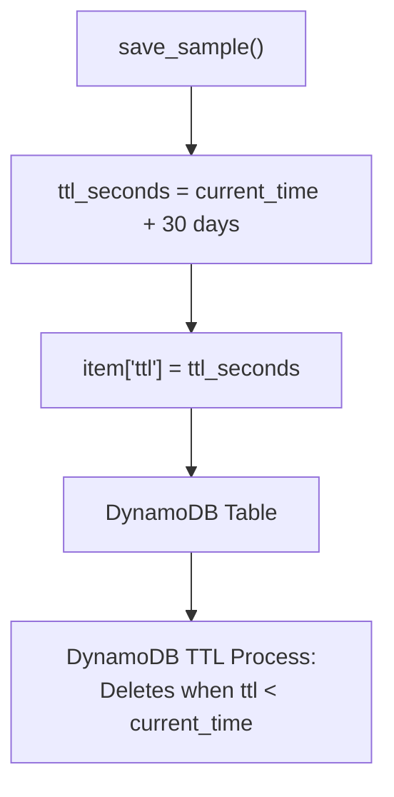
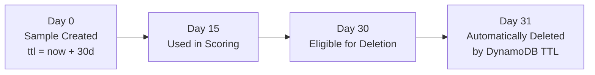
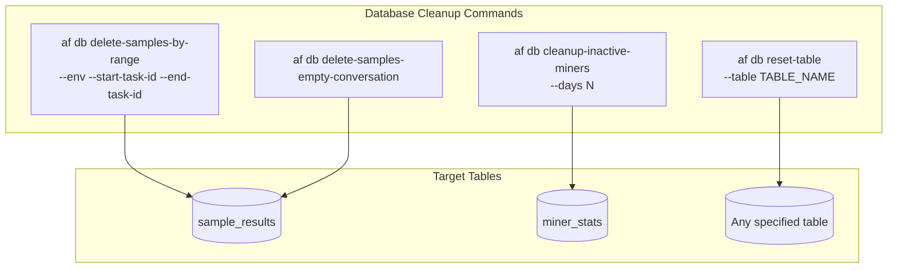
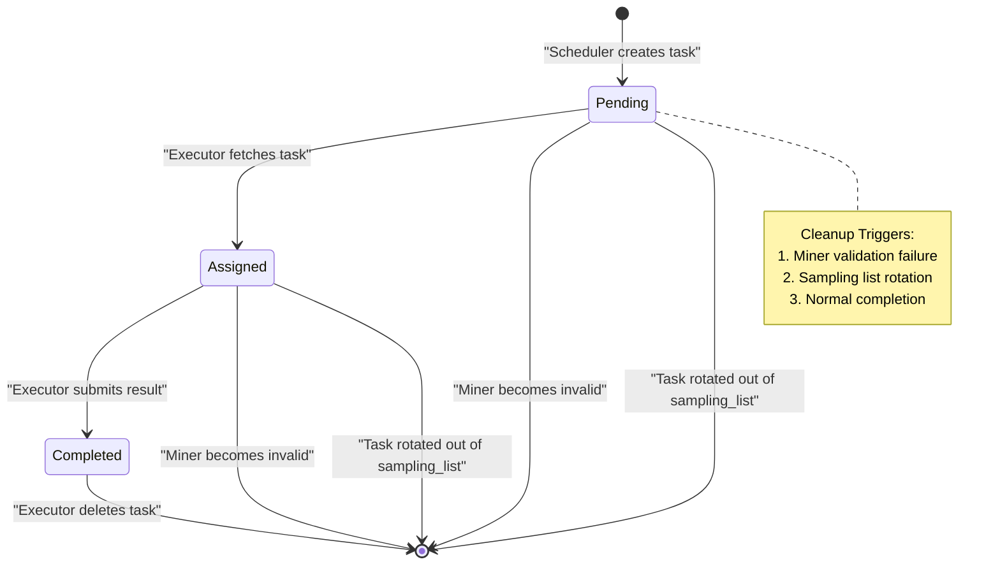
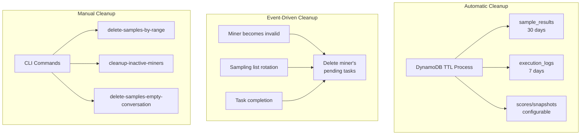

import CollapsibleAside from '../../../../components/CollapsibleAside.astro';
import SourceLink from '../../../../components/SourceLink.astro';
import Table from '../../../../components/Table.astro';

<CollapsibleAside title="Relevant Source Files">
  <SourceLink text="affine/api/dependencies.py" href="https://github.com/AffineFoundation/affine-cortex/blob/main/affine/api/dependencies.py" />
  <SourceLink text="affine/database/cli.py" href="https://github.com/AffineFoundation/affine-cortex/blob/main/affine/database/cli.py" />
  <SourceLink text="affine/database/dao/__init__.py" href="https://github.com/AffineFoundation/affine-cortex/blob/main/affine/database/dao/__init__.py" />
  <SourceLink text="affine/database/dao/execution_logs.py" href="https://github.com/AffineFoundation/affine-cortex/blob/main/affine/database/dao/execution_logs.py" />
  <SourceLink text="affine/database/dao/sample_results.py" href="https://github.com/AffineFoundation/affine-cortex/blob/main/affine/database/dao/sample_results.py" />
  <SourceLink text="affine/database/schema.py" href="https://github.com/AffineFoundation/affine-cortex/blob/main/affine/database/schema.py" />
  <SourceLink text="affine/database/tables.py" href="https://github.com/AffineFoundation/affine-cortex/blob/main/affine/database/tables.py" />
  <SourceLink text="affine/src/scheduler/sampling_scheduler.py" href="https://github.com/AffineFoundation/affine-cortex/blob/main/affine/src/scheduler/sampling_scheduler.py" />
  <SourceLink text="compose/docker-compose.backend.yml" href="https://github.com/AffineFoundation/affine-cortex/blob/main/compose/docker-compose.backend.yml" />
</CollapsibleAside>

**Purpose**: This page documents the data retention policies and cleanup mechanisms used throughout the Affine system. It covers automatic Time-To-Live (TTL) expiration, manual cleanup procedures, and lifecycle management of transient data.

For information about database schema design, see [Database Schema](/subnets/database-storage/database-schema#8.1). For task pool management operations, see [Task Pool Management](/subnets/database-storage/task-pool-management#8.3).

---

## Overview

The Affine system implements a multi-tiered data retention strategy to balance operational requirements with storage costs:

1. **Permanent Storage**: Configuration data and miner metadata (no expiration)
2. **Medium-Term Storage**: Sample results (30-day TTL)
3. **Short-Term Storage**: Execution logs (7-day TTL), score snapshots (configurable)
4. **Transient Storage**: Task pool entries (dynamic lifecycle)

All cleanup operations are designed to preserve data integrity while enabling efficient storage management at scale.

**Sources**: [affine/database/schema.py:1-305]()

---

## TTL-Based Automatic Cleanup

DynamoDB's Time-To-Live (TTL) feature automatically deletes expired items without consuming write capacity. The system uses TTL for three tables:

### TTL Configuration by Table

<Table>

| Table | TTL Duration | TTL Attribute | Purpose |
|-------|--------------|---------------|----------|
| `sample_results` | 30 days | `ttl` | Limit storage costs while maintaining scoring window |
| `execution_logs` | 7 days | `ttl` | Short-term debugging and monitoring |
| `scores` | Configurable | `ttl` | Historical score records |
| `score_snapshots` | Configurable | `ttl` | Scoring calculation metadata |

</Table>


### TTL Calculation Logic



**Diagram: TTL Assignment Flow**

Sample results TTL is calculated at write time:

```python
# Sample Results: 30 days from creation
ttl_seconds = int(time.time()) + (30 * 86400)
```

Execution logs use a helper method:

```python
# Execution Logs: 7 days from creation
'ttl': self.get_ttl(7)  # BaseDAO helper, returns unix timestamp
```

**Sources**: [affine/database/dao/sample_results.py:62-128](), [affine/database/dao/execution_logs.py:34-98](), [affine/database/schema.py:61-64]()

---

## Table-Specific Retention Policies

### Sample Results Table

**Retention**: 30 days  
**Rationale**: Supports scoring calculations across multiple rotations while limiting unbounded growth  
**TTL Field**: `ttl` (unix timestamp in seconds)

The 30-day window ensures:
- Sufficient data for Pareto filtering across scoring periods
- Historical context for debugging miner behavior
- Automatic cleanup prevents storage from scaling linearly with participation



**Diagram: Sample Results Lifecycle**

**Sources**: [affine/database/dao/sample_results.py:96-128](), [affine/database/schema.py:61-64]()

### Execution Logs Table

**Retention**: 7 days  
**Rationale**: Debug trail for recent executor activity without long-term storage burden  
**TTL Field**: `ttl` (unix timestamp in seconds)

Execution logs track:
- Task fetch events (`action='fetch'`)
- Completion events (`action='complete'`, includes score/latency)
- Failure events (`action='fail'`, includes error details)

The 7-day retention provides adequate visibility for:
- Debugging recent execution failures
- Monitoring executor performance
- Investigating timing-related issues

**Sources**: [affine/database/dao/execution_logs.py:14-98](), [affine/database/schema.py:138-140]()

### Scores and Score Snapshots

**Retention**: Configurable (default 30 days)  
**Rationale**: Historical weight calculations for reproducibility and auditing

Score snapshots store metadata for each scoring calculation:
- Block number when calculated
- Scorer configuration parameters
- Pareto filtering statistics
- Environment-level completeness data

While scores are primarily transient (only latest matters for weight setting), retaining snapshots enables:
- Historical analysis of weight evolution
- Debugging scoring algorithm changes
- Reproducing past calculations

**Sources**: [affine/database/schema.py:233-263]()

---

## Manual Cleanup Procedures

The CLI provides commands for administrative cleanup operations beyond automatic TTL.

### CLI Cleanup Commands



**Diagram: Manual Cleanup Commands**

**Sources**: [affine/database/cli.py:543-670]()

### Delete Samples by Range

Removes samples for specific task ID ranges, useful when:
- Rotating out old dataset ranges
- Fixing corrupted task batches
- Cleaning up after environment changes

**Usage**:
```bash
# Delete specific miner's samples in range
af db delete-samples-by-range \
  --hotkey HOTKEY \
  --revision REVISION \
  --env affine:sat \
  --start-task-id 0 \
  --end-task-id 1000

# Delete ALL miners' samples in range
af db delete-samples-by-range \
  --env affine:sat \
  --start-task-id 0 \
  --end-task-id 1000
```

**Implementation**: Uses DynamoDB `FilterExpression` for server-side filtering by task_id range, then batch deletes in chunks of 25 items.

**Sources**: [affine/database/cli.py:543-594](), [affine/database/dao/sample_results.py:394-561]()

### Delete Samples with Empty Conversation

Scans the entire `sample_results` table to remove invalid samples with empty conversation arrays.

**Usage**:
```bash
af db delete-samples-empty-conversation
```

**Warning**: This is a full table scan operation. Use during low-traffic periods.

**Sources**: [affine/database/cli.py:597-619]()

### Cleanup Inactive Miners

Removes miner records that haven't been updated for N days and have never received weight (`best_weight == 0`).

**Criteria**:
- `last_updated_at` older than specified threshold
- `best_weight == 0` (never scored above minimum threshold)
- Prevents accumulation of abandoned test miners

**Usage**:
```bash
# Dry-run (preview what would be deleted)
af db cleanup-inactive-miners --days 30

# Confirm deletion when prompted
```

**Output Example**:
```
Found 15 inactive miners (>30 days, zero weight):

1. 5GrwvaEF5zXb26...#a3c4d7e... (last_updated: 2024-01-15, weight: 0.0)
2. 5HpG9w8EBLe5XC...#b7f2a1c... (last_updated: 2024-01-18, weight: 0.0)
...

WARNING: Delete 15 miners? Type 'yes' to confirm:
```

**Sources**: [affine/database/cli.py:622-670]()

---

## Task Pool Lifecycle Management

Unlike persistent tables, the task pool (`task_pool` table) contains transient work items with dynamic cleanup based on business logic.

### Task Pool Cleanup Triggers



**Diagram: Task Pool State Machine with Cleanup**

**Sources**: [affine/database/schema.py:67-120]()

### Miner Removal Cleanup

When the Monitor service marks a miner as invalid (`is_valid=false`), the Scheduler detects the change and removes all pending tasks:

**Detection Logic** (runs every 10 seconds):
```python
# Build current valid miners set
current_valid_miners = {
    (m['hotkey'], m['revision']) for m in miners
}

# Detect removed miners
removed_miners = self._last_valid_miners - current_valid_miners

if removed_miners:
    await self._cleanup_removed_miners(removed_miners)
```

**Cleanup Implementation**:
1. Query all tasks for the miner (partition key: `MINER#{hotkey}#REV#{revision}`)
2. Filter to `status=pending` (keep assigned tasks for executor to complete)
3. Batch delete in chunks of 25

This design enables **O(m) cleanup** (where m = number of removed miners) instead of O(n) full table scans.

**Sources**: [affine/src/scheduler/sampling_scheduler.py:152-163](), [affine/src/scheduler/sampling_scheduler.py:744-797]()

### Sampling List Rotation Cleanup

When the sampling list changes (rotation or manual update), obsolete tasks are cleaned up:

**Change Detection**:
```python
# Compare lists directly to catch rotations
last_list = self._last_sampling_lists.get(env, [])
if sampling_list != last_list:
    await self._handle_sampling_list_change(env, last_list, sampling_list)
    self._last_sampling_lists[env] = sampling_list
```

**Cleanup Strategy**:
- Removed task IDs are no longer allocated
- Existing pending tasks for removed IDs naturally expire (no proactive deletion needed)
- Prevents unbounded task pool growth during rotation

**Sources**: [affine/src/scheduler/sampling_scheduler.py:496-552]()

### Completion-Based Cleanup

Upon successful task execution, the executor atomically deletes the task from the pool:

**Flow**:
1. Executor fetches task (status changes to `assigned`)
2. Executor evaluates miner model
3. Executor submits result to `/tasks/submit`
4. API saves result to `sample_results` table
5. API deletes task from `task_pool` table

This ensures each task is executed exactly once (no duplicate execution).

**Sources**: [affine/database/dao/sample_results.py:62-128]()

---

## Miner Stats Lifecycle

The `miner_stats` table stores permanent metadata for all miners (current and historical).

### Initialization from Historical Data

The `af db update-miners` command rebuilds `miner_stats` from `sample_results`:

**Process**:
1. Batch scan `sample_results` table (1000 samples per batch)
2. Track earliest and latest timestamps per (hotkey, revision)
3. Update or create `miner_stats` records
4. Only updates timestamps (`first_seen_at`, `last_updated_at`)
5. Preserves immutable fields like `best_rank` (requires online data)

**Usage**:
```bash
af db update-miners
```

**Output Example**:
```
Scanning sample_results table in batches...
  Batch 1: Processed 1000 samples (total: 1000, unique miners: 47, created: 5, updated: 42)
  Batch 2: Processed 1000 samples (total: 2000, unique miners: 63, created: 3, updated: 60)
  ...

✓ Initialization complete:
  - Total samples scanned: 145,837
  - Total batches: 146
  - Unique miners found: 98
  - New records created: 15
  - Existing records updated: 83
```

**Sources**: [affine/database/cli.py:673-886]()

### Cleanup Inactive Miners

See [Cleanup Inactive Miners](#cleanup-inactive-miners) section above. This operation uses:
- `last_updated_at` threshold (e.g., 30 days)
- `best_weight == 0` filter (never achieved meaningful score)

**Sources**: [affine/database/cli.py:622-670]()

---

## Storage Cost Optimization

### Compression

Sample results use gzip compression for the `extra` field:

```python
# Compress extra data (contains conversation + request)
extra_json = json.dumps(extra, separators=(',', ':'))
extra_compressed = self.compress_data(extra_json)

item = {
    ...
    'extra_compressed': extra_compressed,  # Binary blob
    ...
}
```

**Compression Ratio**: Typically 5-10x reduction for JSON conversation data.

**Sources**: [affine/database/dao/sample_results.py:102-104]()

### TTL vs. Manual Deletion

<Table>

| Approach | Use Case | Write Capacity | Latency |
|----------|----------|----------------|---------|
| **TTL** | Routine expiration of old data | Zero (background process) | ~48 hours after expiration |
| **Manual Delete** | Immediate cleanup, targeted removal | Consumes write units | Immediate |

</Table>


**Best Practice**: Use TTL for routine cleanup; use manual deletion for emergency corrections or data quality issues.

---

## Cleanup Monitoring

### Database Statistics

Monitor table sizes and cleanup effectiveness:

```bash
# View table statistics
af db get-stats
```

**Output**:
```
Table: affine_sample_results
  Item Count: 1,456,789
  Size: 12.3 GB
  Oldest Item: 2024-02-15 (28 days ago)
  Newest Item: 2024-03-14 (today)
```

### Execution Logs Analysis

Check recent cleanup operations via execution logs:

```bash
# View recent executor activity
af get-sample --uid UID --env ENV
```

**Sources**: [affine/database/cli.py:1-50]()

---

## Cleanup Operation Summary



**Diagram: Complete Cleanup System Overview**

**Sources**: [affine/database/schema.py:1-305](), [affine/src/scheduler/sampling_scheduler.py:744-797](), [affine/database/cli.py:543-886]()

---

## Best Practices

1. **Monitor TTL Lag**: DynamoDB TTL deletion typically occurs within 48 hours of expiration. Do not rely on TTL for immediate cleanup.

2. **Batch Manual Deletions**: When deleting large ranges, use `delete-samples-by-range` with targeted ranges rather than full table scans.

3. **Test Cleanup Impact**: Use dry-run mode (`cleanup-inactive-miners`) to preview deletions before executing.

4. **Preserve Active Data**: Never manually delete samples within the 30-day scoring window unless correcting data quality issues.

5. **Monitor Storage Costs**: Track DynamoDB table sizes via CloudWatch or `af db get-stats` to detect unexpected growth.

6. **Backup Before Reset**: Use `af db reset-table` with extreme caution; this permanently deletes all table data.

**Sources**: [affine/database/cli.py:51-96](), [affine/database/cli.py:622-670]()
