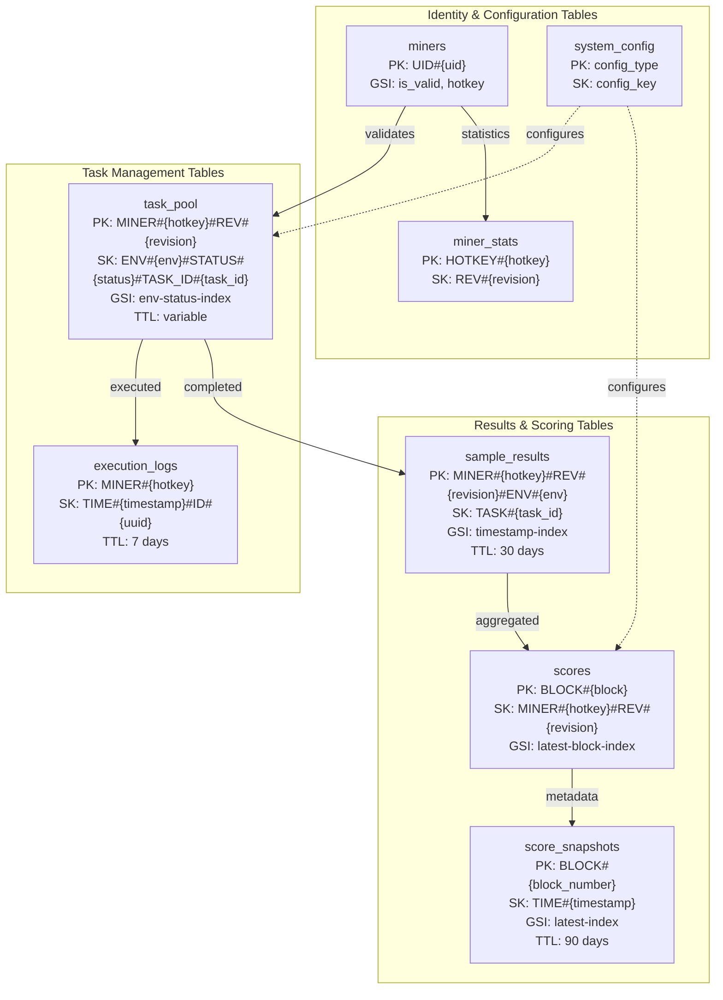
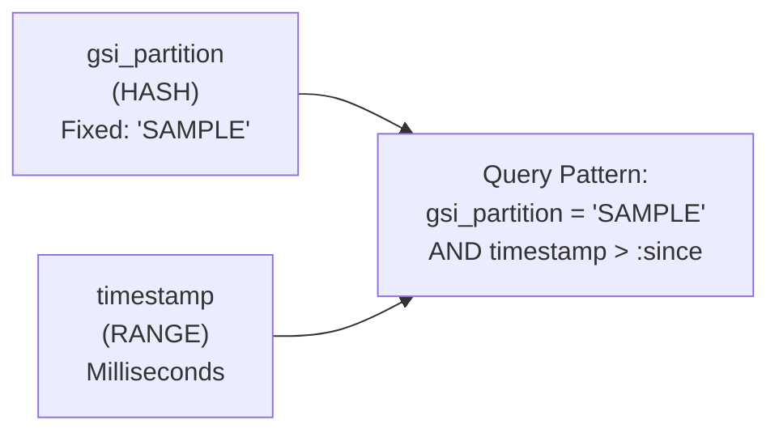
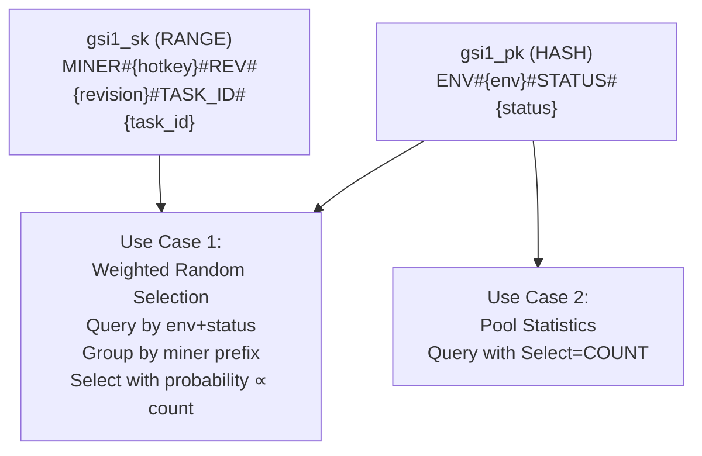
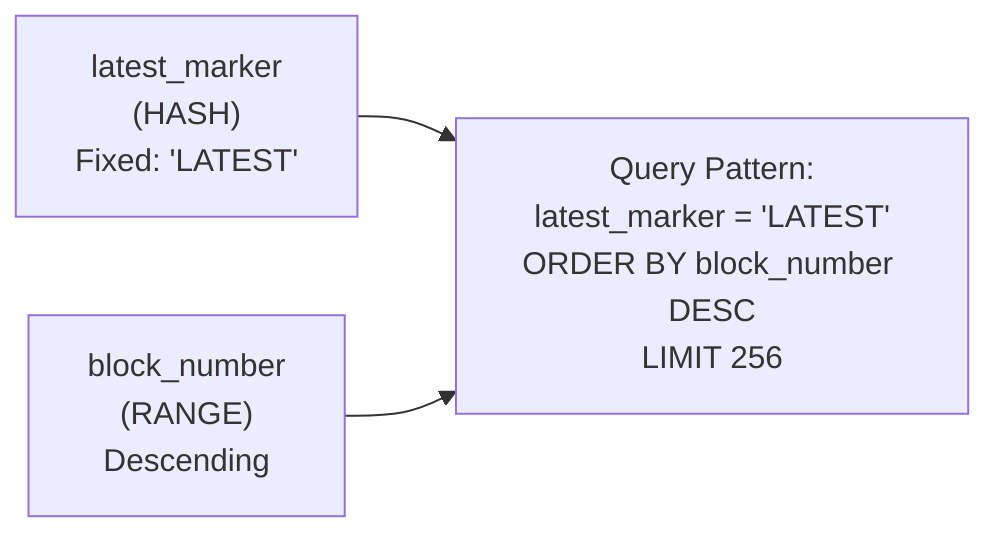
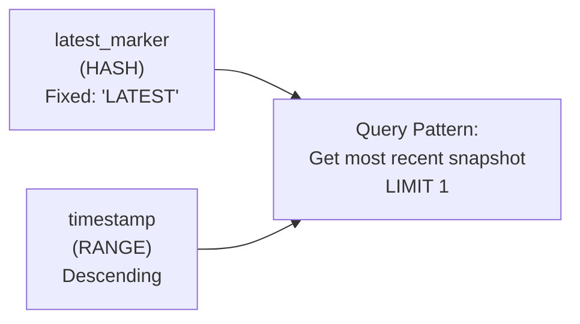
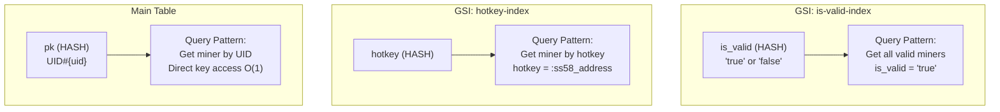
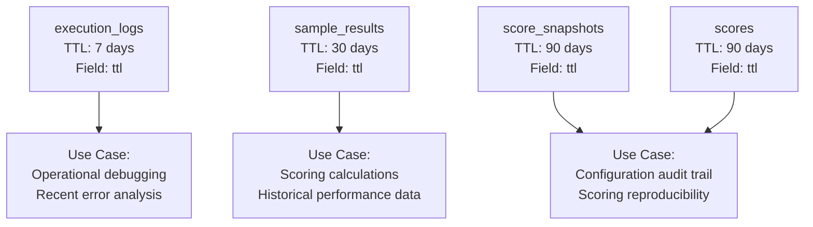
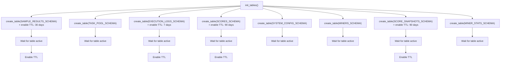

import CollapsibleAside from '../../../../components/CollapsibleAside.astro';
import SourceLink from '../../../../components/SourceLink.astro';
import Table from '../../../../components/Table.astro';

<CollapsibleAside title="Relevant Source Files">
  <SourceLink text="affine/api/dependencies.py" href="https://github.com/AffineFoundation/affine-cortex/blob/main/affine/api/dependencies.py" />
  <SourceLink text="affine/database/dao/__init__.py" href="https://github.com/AffineFoundation/affine-cortex/blob/main/affine/database/dao/__init__.py" />
  <SourceLink text="affine/database/dao/execution_logs.py" href="https://github.com/AffineFoundation/affine-cortex/blob/main/affine/database/dao/execution_logs.py" />
  <SourceLink text="affine/database/dao/sample_results.py" href="https://github.com/AffineFoundation/affine-cortex/blob/main/affine/database/dao/sample_results.py" />
  <SourceLink text="affine/database/schema.py" href="https://github.com/AffineFoundation/affine-cortex/blob/main/affine/database/schema.py" />
  <SourceLink text="affine/database/tables.py" href="https://github.com/AffineFoundation/affine-cortex/blob/main/affine/database/tables.py" />
  <SourceLink text="compose/docker-compose.backend.yml" href="https://github.com/AffineFoundation/affine-cortex/blob/main/compose/docker-compose.backend.yml" />
</CollapsibleAside>

## Purpose and Scope

This document provides a complete technical reference for all DynamoDB tables in the Affine Cortex system. It covers table structures, key schemas, Global Secondary Indexes (GSIs), Time-To-Live (TTL) configurations, and query patterns. For information about data retention policies and cleanup procedures, see [Data Retention & Cleanup](/subnets/database-storage/data-retention-cleanup#8.4). For task lifecycle management, see [Task Pool Management](/subnets/database-storage/task-pool-management#8.3). For sample data structure and scoring relationships, see [Sample Results & Scoring Data](/subnets/database-storage/sample-results-scoring-data#8.2).

**Sources:** [affine/database/schema.py:1-305]()

---

## Database Architecture Overview

The system uses 8 DynamoDB tables operating in `PAY_PER_REQUEST` billing mode. Tables are partitioned by entity type (miner, task, log) with composite sort keys enabling efficient range queries. Three tables implement TTL-based automatic expiration for transient operational data.



**Sources:** [affine/database/schema.py:10-305](), [affine/database/tables.py:82-112]()

---

## Table Reference

### sample_results

Stores completed task evaluations with compressed conversation data. Primary table for scoring calculations.

#### Schema Definition

<Table>

| Attribute | Type | Description |
|-----------|------|-------------|
| `pk` | String (HASH) | `MINER#{hotkey}#REV#{revision}#ENV#{env}` |
| `sk` | String (RANGE) | `TASK#{task_id}` |
| `miner_hotkey` | String | Miner's SS58 hotkey |
| `model_revision` | String | Model commit hash |
| `model` | String | HuggingFace model repository |
| `env` | String | Environment identifier (e.g., `affine:sat`) |
| `task_id` | Number | Dataset index (0 to dataset_length-1) |
| `score` | Number | Evaluation score (0.0 to 1.0) |
| `latency_ms` | Number | Inference latency in milliseconds |
| `timestamp` | Number | Unix timestamp in milliseconds |
| `extra_compressed` | Binary | Compressed JSON containing conversation and request |
| `validator_hotkey` | String | Validator who executed the task |
| `block_number` | Number | Blockchain block at submission time |
| `signature` | String | Cryptographic signature for verification |
| `ttl` | Number | Expiration timestamp (30 days from creation) |
| `gsi_partition` | String | Fixed value `"SAMPLE"` for GSI |

</Table>


#### Global Secondary Index: timestamp-index

Enables efficient incremental data queries for scoring updates.



**Key Schema:**
- Hash Key: `gsi_partition` (fixed value `"SAMPLE"`)
- Range Key: `timestamp` (sortable milliseconds)
- Projection: `ALL`

#### Design Rationale

The composite partition key combines the three most frequent query dimensions to minimize scan operations:

1. **Query by miner + revision + env:** Direct PK query with O(1) access
2. **Get completed task_ids:** Query PK with projection limited to `task_id` field
3. **Incremental scoring updates:** Query GSI by timestamp range
4. **Batch miner queries:** Concurrent queries across miner partitions with `FilterExpression` for task_id ranges

The `uid` attribute is explicitly excluded from keys because UID assignments are mutable during validator failover. Queries requiring UID→hotkey resolution must first query the `miners` table.

**Sources:** [affine/database/schema.py:16-64](), [affine/database/dao/sample_results.py:17-128]()

#### Compression Strategy

The `extra_compressed` field uses zlib compression to reduce storage costs. Decompression occurs on-demand during retrieval.

```python
# Compression implementation
extra_json = json.dumps(extra, separators=(',', ':'))
extra_compressed = self.compress_data(extra_json)  # zlib compress

# Decompression on read
extra_json = self.decompress_data(compressed)
item['extra'] = json.loads(extra_json)
```

**Sources:** [affine/database/dao/sample_results.py:102-166]()

#### Query Patterns

**Pattern 1: Get completed tasks for miner in environment**

```python
pk = f"MINER#{hotkey}#REV#{revision}#ENV#{env}"
items = await query(pk=pk, ProjectionExpression='task_id')
completed_task_ids = {item['task_id'] for item in items}
```

**Pattern 2: Batch scoring queries with task_id filtering**

Uses `FilterExpression` for server-side filtering by task_id ranges (see [affine/database/dao/sample_results.py:255-328]()):

```python
params = {
    'KeyConditionExpression': 'pk = :pk',
    'FilterExpression': 'task_id >= :start_id AND task_id < :end_id',
    'ProjectionExpression': 'task_id,score,timestamp'
}
```

**Sources:** [affine/database/dao/sample_results.py:188-328]()

---

### task_pool

Active task queue with weighted random selection and efficient miner-specific cleanup.

#### Schema Definition

<Table>

| Attribute | Type | Description |
|-----------|------|-------------|
| `pk` | String (HASH) | `MINER#{hotkey}#REV#{revision}` |
| `sk` | String (RANGE) | `ENV#{env}#STATUS#{status}#TASK_ID#{task_id}` |
| `task_uuid` | String | Unique identifier for this task instance |
| `miner_hotkey` | String | Target miner's hotkey |
| `model_revision` | String | Model commit hash |
| `env` | String | Environment identifier |
| `task_id` | Number | Dataset index to evaluate |
| `status` | String | `pending` or `assigned` |
| `created_at` | Number | Creation timestamp |
| `retry_count` | Number | Number of execution attempts |
| `ttl` | Number | Expiration timestamp (varies by retry_count) |
| `gsi1_pk` | String | `ENV#{env}#STATUS#{status}` for GSI |
| `gsi1_sk` | String | `MINER#{hotkey}#REV#{revision}#TASK_ID#{task_id}` for GSI |

</Table>


#### Global Secondary Index: env-status-index

Supports weighted random task selection and pool statistics.



**Key Schema:**
- Hash Key: `gsi1_pk` = `ENV#{env}#STATUS#{status}`
- Range Key: `gsi1_sk` = `MINER#{hotkey}#REV#{revision}#TASK_ID#{task_id}`
- Projection: `ALL`

**Sources:** [affine/database/schema.py:67-121]()

#### Design Rationale

**MINER partition for O(m) cleanup:** When a miner becomes invalid, the scheduler can delete all tasks for that miner in a single query + batch delete operation:

```python
# Query main table by miner partition
pk = f"MINER#{hotkey}#REV#{revision}"
tasks = await query(pk=pk)

# Batch delete all tasks (25 per request)
for batch in chunks(tasks, 25):
    await batch_write_item(DeleteRequest=...)
```

This design enables 36× faster cleanup compared to deleting individual task UUIDs. See implementation at [affine/database/dao/task_pool.py]().

**GSI sorted by MINER:** The `env-status-index` GSI sorts by miner hotkey, enabling efficient weighted random selection. The TaskPoolManager groups tasks by miner and samples with probability proportional to task count (see [Task Scheduling System](/subnets/for-validators/task-scheduling-system#5.3)).

**Sources:** [affine/database/schema.py:67-121]()

#### TTL Calculation

TTL varies based on retry attempts to implement exponential backoff:

<Table>

| Retry Count | TTL |
|-------------|-----|
| 0 (first attempt) | 7 days |
| 1-2 | 3 days |
| 3+ | 1 day |

</Table>


**Sources:** [affine/database/dao/task_pool.py]() (inferred from schema design)

---

### execution_logs

Event stream for task execution with 7-day retention.

#### Schema Definition

<Table>

| Attribute | Type | Description |
|-----------|------|-------------|
| `pk` | String (HASH) | `MINER#{hotkey}` |
| `sk` | String (RANGE) | `TIME#{timestamp:016d}#ID#{uuid}` |
| `log_id` | String | UUID for this log entry |
| `miner_hotkey` | String | Target miner |
| `task_uuid` | String | Task instance identifier |
| `dataset_task_id` | Number | Dataset index |
| `status` | String | `started`, `completed`, or `failed` |
| `env` | String | Environment identifier |
| `executor_hotkey` | String | Validator who executed the task |
| `action` | String | `fetch`, `start`, `complete`, or `fail` |
| `score` | Number | Score if completed |
| `latency_ms` | Number | Latency if completed |
| `error_type` | String | Error classification if failed |
| `error_message` | String | Error details if failed |
| `error_code` | String | Error code if failed |
| `execution_time_ms` | Number | Total execution time |
| `timestamp` | Number | Unix timestamp in seconds |
| `ttl` | Number | Expiration timestamp (7 days) |

</Table>


#### Query Pattern: Recent Logs with Status Filter

```python
pk = f"MINER#{hotkey}"
logs = await query(
    pk=pk,
    limit=1000,
    reverse=True,  # Newest first (SK descending)
    filter_expression="status = :status"
)
```

**Sources:** [affine/database/schema.py:123-140](), [affine/database/dao/execution_logs.py:1-342]()

#### Use Cases

1. **Consecutive error detection:** Query recent logs to check if last N executions all failed ([execution_logs.py:237-260]())
2. **Error diagnostics:** Retrieve recent failures with full error details ([execution_logs.py:262-285]())
3. **Execution statistics:** Calculate success/failure rates by environment ([execution_logs.py:287-342]())
4. **Audit trail:** Debug task execution issues with chronological event stream

The 7-day TTL ensures storage costs remain bounded while preserving sufficient history for operational debugging.

**Sources:** [affine/database/dao/execution_logs.py:34-209]()

---

### scores

Per-miner scoring results with detailed environment breakdowns.

#### Schema Definition

<Table>

| Attribute | Type | Description |
|-----------|------|-------------|
| `pk` | String (HASH) | `BLOCK#{block_number}` |
| `sk` | String (RANGE) | `MINER#{hotkey}#REV#{revision}` |
| `block_number` | Number | Blockchain block when calculated |
| `miner_hotkey` | String | Miner's hotkey |
| `model_revision` | String | Model commit hash |
| `weight` | Number | Final normalized weight (0.0 to 1.0) |
| `scores_by_env` | Map | Per-environment scores |
| `scores_by_layer` | Map | Pareto layer scores (L1-L6) |
| `filtered_subsets` | List | Pareto-filtered environment combinations |
| `timestamp` | Number | Calculation timestamp |
| `ttl` | Number | Expiration timestamp (90 days) |
| `latest_marker` | String | Fixed value `"LATEST"` for GSI |

</Table>


#### Global Secondary Index: latest-block-index

Enables efficient queries for most recent scoring results.



**Key Schema:**
- Hash Key: `latest_marker` (fixed value `"LATEST"`)
- Range Key: `block_number` (descending for latest-first queries)
- Projection: `ALL`

**Sources:** [affine/database/schema.py:143-172]()

#### scores_by_env Structure

Contains per-environment scoring details:

```json
{
  "affine:sat": {
    "score": 0.85,
    "count": 120,
    "completeness": 1.0
  },
  "affine:ded": {
    "score": 0.72,
    "count": 95,
    "completeness": 0.79
  }
}
```

#### scores_by_layer Structure

Contains Pareto layer scores (see [Weight Calculation System](/subnets/for-validators/weight-calculation-system#5.4)):

```json
{
  "L1": 0.42,  // Single-environment performance
  "L2": 0.31,  // 2-environment combinations
  "L3": 0.18,  // 3-environment combinations
  "L4": 0.07,  // 4-environment combinations
  "L5": 0.02,  // 5-environment combinations
  "L6": 0.00   // All environments
}
```

**Sources:** [affine/database/dao/scores.py]() (inferred from schema)

---

### score_snapshots

Metadata for scoring calculations including configuration and statistics.

#### Schema Definition

<Table>

| Attribute | Type | Description |
|-----------|------|-------------|
| `pk` | String (HASH) | `BLOCK#{block_number}` |
| `sk` | String (RANGE) | `TIME#{timestamp}` |
| `block_number` | Number | Blockchain block |
| `timestamp` | Number | Calculation timestamp |
| `config` | Map | ScorerConfig parameters used |
| `statistics` | Map | Scoring run statistics |
| `miner_count` | Number | Total miners evaluated |
| `env_ranges` | Map | Dataset ranges per environment |
| `ttl` | Number | Expiration timestamp (90 days) |
| `latest_marker` | String | Fixed value `"LATEST"` for GSI |

</Table>


#### Global Secondary Index: latest-index



**Key Schema:**
- Hash Key: `latest_marker` = `"LATEST"`
- Range Key: `timestamp` (descending)
- Projection: `ALL`

**Sources:** [affine/database/schema.py:233-263]()

#### config Field Structure

Preserves the exact `ScorerConfig` used for reproducibility:

```json
{
  "subset_selection_strategy": "adaptive_percentile",
  "max_subset_size": 6,
  "pareto_threshold_strategy": "statistical",
  "z_score": 1.5,
  "min_improvement_threshold": 0.01,
  "max_improvement_threshold": 0.15,
  "geometric_mean_damping": 1e-6,
  "min_weight_threshold": 0.01
}
```

#### statistics Field Structure

Provides observability into scoring behavior:

```json
{
  "total_miners": 45,
  "valid_miners": 42,
  "pareto_filtered_count": 8,
  "avg_completeness": 0.87,
  "execution_time_ms": 3421,
  "layers_generated": 5
}
```

**Sources:** [affine/database/schema.py:233-263]()

---

### miners

Current miner registry with validation metadata and anti-plagiarism tracking.

#### Schema Definition

<Table>

| Attribute | Type | Description |
|-----------|------|-------------|
| `pk` | String (HASH) | `UID#{uid}` |
| `uid` | Number | Network UID (0-255) |
| `hotkey` | String | Miner's SS58 hotkey |
| `coldkey` | String | Owner's coldkey |
| `chute_id` | String | Chutes deployment UUID |
| `model` | String | HuggingFace model repository |
| `revision` | String | Model commit hash |
| `model_hash` | String | Concatenated SHA256 of safetensors files |
| `first_block` | Number | Block when first discovered |
| `last_updated_block` | Number | Block when last validated |
| `is_valid` | String | `"true"` or `"false"` (string for GSI) |
| `invalid_reason` | String | Reason if invalid |
| `chute_status` | String | Chutes deployment status |
| `template_check_result` | String | Template safety audit result |
| `last_template_check` | Number | Timestamp of last template check |

</Table>


#### Global Secondary Indexes



**Sources:** [affine/database/schema.py:190-229]()

#### Anti-Plagiarism Fields

<Table>

| Field | Purpose |
|-------|---------|
| `model_hash` | SHA256 hashes of all `.safetensors` files, sorted and concatenated |
| `first_block` | Establishes temporal priority for Pareto filtering |
| `template_check_result` | LLM audit result: `"safe"`, `"unsafe"`, or `null` if not checked |

</Table>


The `model_hash` field enables detection of exact model copies. Miners with identical hashes are compared by `first_block` to determine the original (see [Anti-Plagiarism Architecture](/subnets/system-architecture/anti-plagiarism-architecture#3.4)).

**Sources:** [affine/database/schema.py:190-229](), high-level diagrams

#### Query Patterns

**Pattern 1: Get all valid miners for task allocation**

```python
items = await query_gsi(
    index_name="is-valid-index",
    key_condition="is_valid = :val",
    expression_values={":val": "true"}
)
```

**Pattern 2: Check for model hash duplicates**

```python
# Scan with filter (anti-plagiarism check)
items = await scan(
    filter_expression="model_hash = :hash",
    expression_values={":hash": computed_hash}
)
duplicate_miners = [m for m in items if m['first_block'] < current_block]
```

**Sources:** [affine/database/dao/miners.py]() (inferred from schema)

---

### miner_stats

Permanent historical statistics for all miners (not just current 256).

#### Schema Definition

<Table>

| Attribute | Type | Description |
|-----------|------|-------------|
| `pk` | String (HASH) | `HOTKEY#{hotkey}` |
| `sk` | String (RANGE) | `REV#{revision}` |
| `hotkey` | String | Miner's hotkey |
| `revision` | String | Model commit hash |
| `first_seen_at` | Number | First discovery timestamp |
| `last_seen_at` | Number | Last active timestamp |
| `sampling_slots` | Number | Dynamic slot allocation (3-10) |
| `sampling_stats` | Map | Real-time sampling statistics |

</Table>


#### sampling_stats Structure

Tracks recent task allocation for anti-starvation and rate limiting (see [Task Scheduling System](/subnets/for-validators/task-scheduling-system#5.3)):

```json
{
  "allocations_last_hour": {
    "affine:sat": 12,
    "affine:ded": 8,
    "affine:lgc": 15
  },
  "timestamp": 1704067200
}
```

**Sources:** [affine/database/schema.py:266-292]()

#### Design Rationale

**Permanent storage:** Unlike the `miners` table (limited to 256 current UIDs), `miner_stats` retains data for all historical miners. This enables:

1. **Churn analysis:** Track how long miners remain active
2. **Performance history:** Preserve slot allocation decisions across UID reassignments
3. **Fraud detection:** Identify miners repeatedly joining/leaving to game sampling

**No GSI required:** Cleanup operations use full table scan, which is efficient for this table size (typically &lt; 1000 records). Queries by hotkey+revision are direct key access.

**Sources:** [affine/database/schema.py:266-292]()

---

### system_config

Global configuration with versioned updates.

#### Schema Definition

<Table>

| Attribute | Type | Description |
|-----------|------|-------------|
| `pk` | String (HASH) | Configuration type |
| `sk` | String (RANGE) | Configuration key or version |

</Table>


#### Standard Partition Keys

<Table>

| pk | sk | Content |
|----|----|---------| 
| `ENVIRONMENTS` | `v1` | Environment configurations from system_config.json |
| `BLACKLIST` | `v1` | List of blacklisted hotkeys |
| `SYSTEM_MINERS` | `v1` | System validator hotkeys |

</Table>


#### ENVIRONMENTS Record Structure

```json
{
  "pk": "ENVIRONMENTS",
  "sk": "v1",
  "environments": {
    "affine:sat": {
      "sampling_config": {...},
      "scoring_config": {...},
      "dataset_range_source": "dynamic",
      "min_completeness": 0.5
    },
    "affine:ded": {...}
  }
}
```

**Sources:** [affine/database/schema.py:175-187]()

#### Loading Configuration

The system loads configuration at startup and caches it in memory:

```python
config_dao = SystemConfigDAO()
config = await config_dao.get_config()
environments = config.get('ENVIRONMENTS', {}).get('environments', {})
```

Configuration updates require updating the `v1` record and restarting services.

**Sources:** [affine/database/dao/system_config.py]() (inferred from schema)

---

## Key Design Patterns

### Composite Partition Keys

Multiple tables use composite partition keys to optimize query patterns:

<Table>

| Table | PK Pattern | Benefit |
|-------|-----------|---------|
| `sample_results` | `MINER#{hotkey}#REV#{revision}#ENV#{env}` | Direct access to miner's samples in environment |
| `task_pool` | `MINER#{hotkey}#REV#{revision}` | O(m) cleanup of all miner tasks |
| `miner_stats` | `HOTKEY#{hotkey}` | Historical tracking across UID changes |

</Table>


This pattern eliminates the need for secondary indexes when the composite dimensions are known upfront.

**Sources:** [affine/database/schema.py:18-50](), [affine/database/schema.py:70-85]()

### Fixed GSI Partition Keys

Several tables use fixed GSI partition keys to enable "latest record" queries:

<Table>

| Table | GSI Hash Key | Use Case |
|-------|-------------|----------|
| `sample_results` | `gsi_partition = "SAMPLE"` | Query all samples by timestamp range |
| `scores` | `latest_marker = "LATEST"` | Get latest scores for all miners |
| `score_snapshots` | `latest_marker = "LATEST"` | Get most recent scoring metadata |

</Table>


This pattern avoids the "hot partition" problem by ensuring the GSI hash key has only one value, allowing DynamoDB to provision sufficient throughput.

**Sources:** [affine/database/schema.py:36-57](), [affine/database/schema.py:156-165]()

### Hierarchical Sort Keys

Sort keys encode multiple dimensions in hierarchical order:

```
ENV#{env}#STATUS#{status}#TASK_ID#{task_id}
TIME#{timestamp:016d}#ID#{uuid}
```

This enables:
1. **Range queries:** Query by prefix (e.g., all tasks in env with status=pending)
2. **Natural ordering:** Tasks automatically sorted by their business logic
3. **Compound filtering:** Efficient queries without additional indexes

**Sources:** [affine/database/schema.py:98-99](), [affine/database/schema.py:128]()

---

## Time-To-Live (TTL) Configuration

Three tables implement automatic expiration via DynamoDB TTL:



### TTL Calculation Implementation

All DAOs inherit TTL calculation from `BaseDAO`:

```python
def get_ttl(self, days: int) -> int:
    """Calculate TTL in seconds."""
    return int(time.time()) + (days * 86400)
```

**Example Usage:**

```python
# sample_results: 30 days
item['ttl'] = int(time.time()) + (30 * 86400)

# execution_logs: 7 days  
item['ttl'] = self.get_ttl(7)

# score_snapshots: 90 days
item['ttl'] = self.get_ttl(90)
```

**Sources:** [affine/database/dao/sample_results.py:106-126](), [affine/database/dao/execution_logs.py:95](), [affine/database/schema.py:61-64](), [affine/database/schema.py:138-140](), [affine/database/schema.py:260-263]()

### TTL Activation

TTL is enabled during table initialization:

```python
await client.update_time_to_live(
    TableName=table_name,
    TimeToLiveSpecification={
        'Enabled': True,
        'AttributeName': 'ttl'
    }
)
```

DynamoDB typically deletes expired items within 48 hours of the TTL timestamp.

**Sources:** [affine/database/tables.py:31-80](), [affine/database/tables.py:100-112]()

---

## Table Initialization

All tables are created using the `init_tables()` function:



**Initialization Command:**

```bash
af db init
```

This executes [affine/database/tables.py:82-112]() which creates all tables concurrently using `asyncio.gather()`.

**Sources:** [affine/database/tables.py:82-112]()

---

## Data Access Objects (DAOs)

Each table has a corresponding DAO class implementing CRUD operations:

<Table>

| Table | DAO Class | Module |
|-------|-----------|--------|
| `sample_results` | `SampleResultsDAO` | [affine/database/dao/sample_results.py]() |
| `task_pool` | `TaskPoolDAO` | [affine/database/dao/task_pool.py]() |
| `execution_logs` | `ExecutionLogsDAO` | [affine/database/dao/execution_logs.py]() |
| `scores` | `ScoresDAO` | [affine/database/dao/scores.py]() |
| `score_snapshots` | `ScoreSnapshotsDAO` | [affine/database/dao/score_snapshots.py]() |
| `miners` | `MinersDAO` | [affine/database/dao/miners.py]() |
| `miner_stats` | `MinerStatsDAO` | [affine/database/dao/miner_stats.py]() |
| `system_config` | `SystemConfigDAO` | [affine/database/dao/system_config.py]() |

</Table>


### DAO Singleton Pattern

The API service uses singleton DAOs for connection pooling:

```python
# Singleton instances
_sample_results_dao: Optional[SampleResultsDAO] = None

def get_sample_results_dao() -> SampleResultsDAO:
    global _sample_results_dao
    if _sample_results_dao is None:
        _sample_results_dao = SampleResultsDAO()
    return _sample_results_dao
```

This pattern ensures a single DynamoDB client instance is shared across all requests, reducing connection overhead.

**Sources:** [affine/api/dependencies.py:23-90]()

### Common DAO Methods

All DAOs inherit from `BaseDAO` which provides:

- `put(item)` - Put item into table
- `get(pk, sk)` - Get item by key
- `query(pk, ...)` - Query by partition key
- `scan(...)` - Scan with filter
- `delete(pk, sk)` - Delete item by key
- `compress_data(data)` - Compress binary data
- `decompress_data(data)` - Decompress binary data
- `get_ttl(days)` - Calculate TTL timestamp

**Sources:** [affine/database/base_dao.py]() (referenced but not provided)

---

## Connection Management

### Table Name Prefixing

All tables use environment-specific prefixes:

```python
def get_table_name(base_name: str) -> str:
    """Get full table name with prefix."""
    from affine.database.client import get_table_prefix
    return f"{get_table_prefix()}_{base_name}"
```

Default prefix: `affine` (configurable via environment variable)

**Examples:**
- Development: `affine_dev_sample_results`
- Production: `affine_sample_results`
- Testing: `affine_test_sample_results`

**Sources:** [affine/database/schema.py:10-13]()

### Client Initialization

DynamoDB client configuration:

```python
from affine.database.client import get_client

# Returns boto3 aioboto3 client
client = get_client()

# Configured with:
# - AWS credentials from environment
# - Region from AWS_DEFAULT_REGION
# - Endpoint URL from DYNAMODB_ENDPOINT (for local testing)
```

**Sources:** [affine/database/client.py]() (referenced but not provided)
