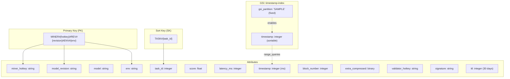
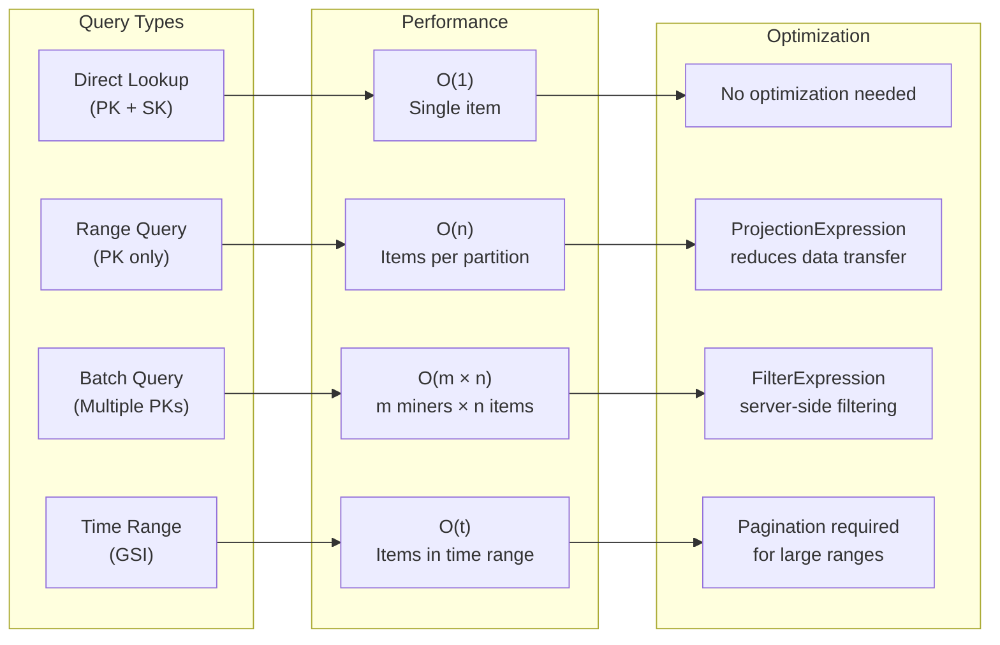
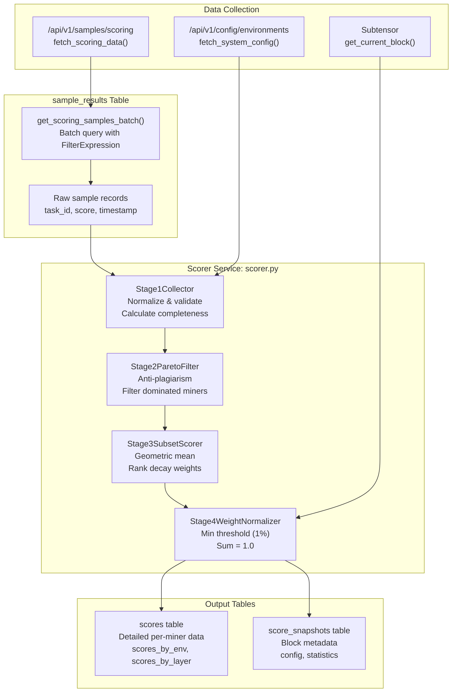
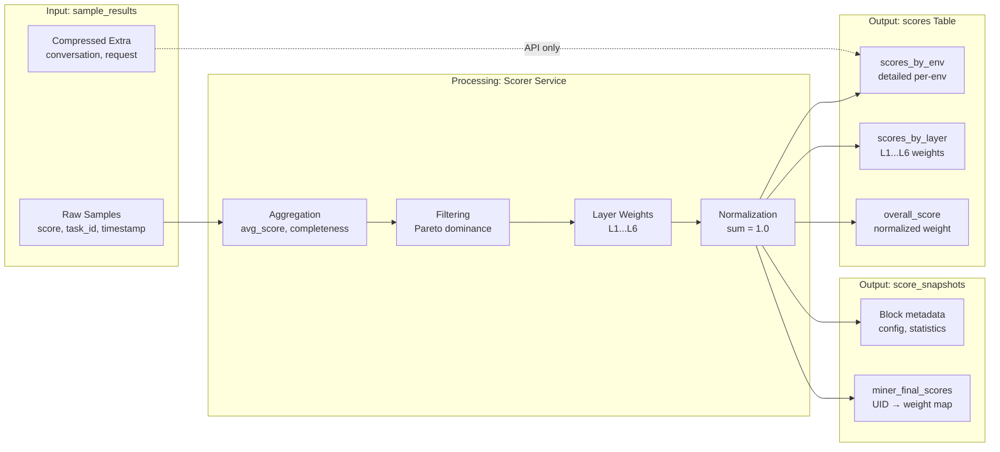

import CollapsibleAside from '../../../../components/CollapsibleAside.astro';
import SourceLink from '../../../../components/SourceLink.astro';
import Table from '../../../../components/Table.astro';

<CollapsibleAside title="Relevant Source Files">
  <SourceLink text="affine/api/config.py" href="https://github.com/AffineFoundation/affine-cortex/blob/main/affine/api/config.py" />
  <SourceLink text="affine/api/dependencies.py" href="https://github.com/AffineFoundation/affine-cortex/blob/main/affine/api/dependencies.py" />
  <SourceLink text="affine/api/models.py" href="https://github.com/AffineFoundation/affine-cortex/blob/main/affine/api/models.py" />
  <SourceLink text="affine/api/routers/scores.py" href="https://github.com/AffineFoundation/affine-cortex/blob/main/affine/api/routers/scores.py" />
  <SourceLink text="affine/database/dao/__init__.py" href="https://github.com/AffineFoundation/affine-cortex/blob/main/affine/database/dao/__init__.py" />
  <SourceLink text="affine/database/dao/execution_logs.py" href="https://github.com/AffineFoundation/affine-cortex/blob/main/affine/database/dao/execution_logs.py" />
  <SourceLink text="affine/database/dao/sample_results.py" href="https://github.com/AffineFoundation/affine-cortex/blob/main/affine/database/dao/sample_results.py" />
  <SourceLink text="affine/database/schema.py" href="https://github.com/AffineFoundation/affine-cortex/blob/main/affine/database/schema.py" />
  <SourceLink text="affine/database/tables.py" href="https://github.com/AffineFoundation/affine-cortex/blob/main/affine/database/tables.py" />
  <SourceLink text="affine/src/miner/rank.py" href="https://github.com/AffineFoundation/affine-cortex/blob/main/affine/src/miner/rank.py" />
  <SourceLink text="affine/src/scorer/main.py" href="https://github.com/AffineFoundation/affine-cortex/blob/main/affine/src/scorer/main.py" />
  <SourceLink text="affine/src/scorer/scorer.py" href="https://github.com/AffineFoundation/affine-cortex/blob/main/affine/src/scorer/scorer.py" />
  <SourceLink text="compose/docker-compose.backend.yml" href="https://github.com/AffineFoundation/affine-cortex/blob/main/compose/docker-compose.backend.yml" />
</CollapsibleAside>

This page documents the `sample_results` table structure, data compression mechanisms, and how sample data flows into the scoring system. For information about the complete database schema, see [Database Schema](/subnets/database-storage/database-schema#8.1). For task lifecycle management, see [Task Pool Management](/subnets/database-storage/task-pool-management#8.3).

---

## Overview

The `sample_results` table stores completed task evaluation results submitted by the Executor service. Each record represents a single miner's performance on a specific environment task, including the achieved score, latency, conversation history, and execution metadata. This data serves as the primary input for the Scorer service's four-stage weight calculation algorithm.

Key characteristics:
- **TTL**: 30-day automatic expiration for storage efficiency
- **Compression**: Conversation and request data compressed with zlib
- **Partition Key**: Combines hotkey, model revision, and environment for efficient querying
- **Primary Consumer**: Scorer service (via `/api/v1/samples/scoring` endpoint)

**Sources:** [affine/database/dao/sample_results.py:1-31](), [affine/database/schema.py:16-65]()

---

## Table Schema

### Primary Key Structure

The `sample_results` table uses a composite key optimized for the three most frequent query dimensions:

```
PK: MINER#{hotkey}#REV#{revision}#ENV#{env}
SK: TASK#{task_id}
```

This design enables O(1) direct lookups by full key and efficient range queries for all samples belonging to a specific miner-revision-environment combination.

**Diagram: sample_results Schema Design**



**Sources:** [affine/database/schema.py:36-59](), [affine/database/dao/sample_results.py:32-60]()

### Schema Fields Reference

<Table>

| Field | Type | Description |
|-------|------|-------------|
| `pk` | String | Partition key: `MINER#{hotkey}#REV#{revision}#ENV#{env}` |
| `sk` | String | Sort key: `TASK#{task_id}` |
| `miner_hotkey` | String | Miner's SS58 hotkey address |
| `model_revision` | String | Model revision hash from HuggingFace |
| `model` | String | Model repository name (e.g., `AffineFoundation/Affine-...`) |
| `env` | String | Environment name (e.g., `affine:sat`, `agentgym:webshop`) |
| `task_id` | Integer | Dataset index (0 to dataset_length-1) |
| `score` | Float | Task performance score (0.0 to 1.0) |
| `latency_ms` | Integer | Model inference latency in milliseconds |
| `timestamp` | Integer | Submission timestamp in milliseconds since epoch |
| `block_number` | Integer | Bittensor block number at submission time |
| `extra_compressed` | Binary | Compressed JSON containing conversation and request data |
| `validator_hotkey` | String | Validator hotkey that executed the task |
| `signature` | String | Cryptographic signature for verification |
| `ttl` | Integer | TTL timestamp (30 days from creation) |
| `gsi_partition` | String | Fixed value `"SAMPLE"` for GSI partition key |

</Table>


**Sources:** [affine/database/dao/sample_results.py:76-126]()

### Global Secondary Index (GSI)

The `timestamp-index` GSI enables efficient incremental data fetching for scoring calculations:

- **GSI PK**: `gsi_partition = "SAMPLE"` (fixed value for all records)
- **GSI SK**: `timestamp` (milliseconds since epoch, sortable)
- **Projection**: ALL (includes all attributes)

This design allows queries like "fetch all samples created since timestamp X" without scanning the main table.

**Sources:** [affine/database/schema.py:48-57]()

---

## Data Compression

### Extra Data Field

The `extra` field contains large objects that would exceed DynamoDB item size limits if stored uncompressed:

```json
{
  "conversation": [
    {"role": "user", "content": "..."},
    {"role": "assistant", "content": "..."},
    ...
  ],
  "request": {
    "model": "AffineFoundation/...",
    "messages": [...],
    "temperature": 0.7,
    ...
  },
  "image": "affinefoundation/env-sat:latest"
}
```

**Sources:** [affine/api/models.py:18-35]()

### Compression Process

The DAO automatically compresses `extra` data before storage:

1. **Serialization**: Convert dict to compact JSON string (no whitespace)
2. **Compression**: Apply zlib compression with default level
3. **Storage**: Store as binary in `extra_compressed` field

```python
# Compression (write)
extra_json = json.dumps(extra, separators=(',', ':'))
extra_compressed = self.compress_data(extra_json)

# Decompression (read)
extra_json = self.decompress_data(compressed)
extra = json.loads(extra_json)
```

This reduces storage costs by ~70-80% for typical conversation data.

**Sources:** [affine/database/dao/sample_results.py:102-104](), [affine/database/dao/sample_results.py:162-166]()

---

## Query Patterns

The schema supports multiple query patterns optimized for different use cases:

### Pattern 1: Direct Task Lookup (O(1))

Get a specific sample by full key:

```python
sample = await dao.get_sample_by_task_id(
    miner_hotkey=hotkey,
    model_revision=revision,
    env="affine:sat",
    task_id="42",
    include_extra=True
)
```

**Use Case**: API endpoint `/samples/uid/:uid/:env/:task`  
**Implementation**: [affine/database/dao/sample_results.py:130-168]()

### Pattern 2: All Samples for Miner+Env

Query all samples for a specific miner-revision-environment:

```python
pk = f"MINER#{hotkey}#REV#{revision}#ENV#{env}"
samples = await dao.query(pk=pk, limit=1000)
```

**Use Case**: Calculate completeness for scoring  
**Implementation**: [affine/database/dao/sample_results.py:188-222]()

### Pattern 3: Batch Query with Task ID Range

Efficiently fetch samples within a task_id range using server-side filtering:

```python
samples = await dao.get_scoring_samples_batch(
    miners=[{"hotkey": h, "revision": r}, ...],
    env_ranges={"affine:sat": (0, 100), ...},
    batch_size=30
)
```

**Use Case**: Scorer service fetches data for weight calculation  
**Implementation**: [affine/database/dao/sample_results.py:255-328]()  
**Optimization**: FilterExpression for server-side range filtering [affine/database/dao/sample_results.py:287-300]()

### Pattern 4: Completed Task IDs

Get set of completed task_ids to determine missing tasks:

```python
completed_ids = await dao.get_completed_task_ids(
    miner_hotkey=hotkey,
    model_revision=revision,
    env="affine:sat"
)
# Returns: {0, 1, 5, 7, ...}
```

**Use Case**: Scheduler determines which tasks to generate  
**Implementation**: [affine/database/dao/sample_results.py:188-222]()

**Diagram: Query Pattern Performance Characteristics**



**Sources:** [affine/database/dao/sample_results.py:130-393]()

---

## Scoring Data Flow

### API Endpoint: `/samples/scoring`

The Scorer service fetches sample data through this specialized endpoint:

**Request Parameters:**
- `range_type`: `"scoring"` (uses `enabled_for_scoring` environments) or `"sampling"` (uses `enabled_for_sampling`)

**Response Structure:**

```json
{
  "hotkey1#revision1": {
    "affine:sat": [
      {"task_id": 0, "score": 0.95, "timestamp": 1234567890},
      {"task_id": 1, "score": 0.87, "timestamp": 1234567891},
      ...
    ],
    "affine:ded": [...]
  },
  "hotkey2#revision2": {...}
}
```

**Implementation:** The API constructs this by:
1. Querying `miners` table for all valid miners
2. Fetching system config for enabled environments
3. Determining task_id ranges from config (e.g., `scoring_range` or `sampling_range`)
4. Batch querying `sample_results` with concurrent execution (30 queries per batch)
5. Deserializing and grouping results by miner and environment

**Sources:** [affine/src/scorer/main.py:23-40](), [affine/src/scorer/main.py:43-91]()

### Scorer Service Workflow

**Diagram: Sample Data to Scoring Weights Flow**



**Sources:** [affine/src/scorer/main.py:94-158](), [affine/src/scorer/scorer.py:46-108]()

### Stage 1: Data Collection from Samples

The `Stage1Collector` processes raw sample data into normalized miner records:

**Input:** Raw sample dict from API response
```json
{
  "hotkey#revision": {
    "affine:sat": [
      {"task_id": 0, "score": 0.95, "timestamp": 1234567890},
      ...
    ]
  }
}
```

**Processing:**
1. Group samples by environment
2. Calculate average score per environment
3. Compute completeness (sample_count / required_count)
4. Validate against `min_completeness` threshold from env config
5. Generate statistical thresholds for Pareto filtering

**Output:** `MinerData` objects with:
- `env_scores`: Dict mapping env → `EnvironmentScore(avg_score, sample_count, completeness, threshold)`
- Validation flags for insufficient samples

**Sources:** [affine/src/scorer/main.py:114-120]()

---

## Relationship to Scores Tables

### scores Table

After scoring calculation, detailed results are saved to the `scores` table (one record per miner per block):

<Table>

| Field | Source | Description |
|-------|--------|-------------|
| `overall_score` | Stage 4 output | Normalized weight (sum=1.0 across network) |
| `average_score` | Stage 1 output | Mean score across all environments |
| `scores_by_env` | Stage 1 output | `{env: {score, sample_count, completeness, threshold}}` |
| `scores_by_layer` | Stage 3 output | `{"L1": 0.0, "L2": 0.05, ..., "L6": 0.82}` |
| `total_samples` | Stage 1 output | Sum of sample counts across all environments |
| `subset_contributions` | Stage 3 output | Detailed subset scores and ranks |
| `cumulative_weight` | Stage 4 output | Weight before normalization |
| `filter_info` | Stage 2 output | Filtered subsets and reasons |

</Table>


**Sources:** [affine/src/scorer/scorer.py:148-217](), [affine/api/models.py:80-94]()

### score_snapshots Table

Stores metadata for each scoring calculation:

```json
{
  "block_number": 12345,
  "calculated_at": 1234567890,
  "scorer_hotkey": "scorer_service",
  "config": {
    "error_rate_reduction": 0.2,
    "min_improvement": 0.02,
    "min_completeness": 0.99,
    ...
  },
  "statistics": {
    "total_miners": 256,
    "valid_miners": 200,
    "invalid_miners": 56,
    "miner_final_scores": {
      "0": 0.15,
      "1": 0.12,
      ...
    }
  }
}
```

**Sources:** [affine/src/scorer/scorer.py:129-145](), [affine/database/schema.py:233-263]()

**Diagram: Data Lineage from Samples to Weights**



**Sources:** [affine/src/scorer/scorer.py:110-217]()

---

## Data Lifecycle and TTL

### Automatic Expiration

The `sample_results` table uses DynamoDB TTL for automatic cleanup:

```python
# Set TTL to 30 days from now
ttl_seconds = int(time.time()) + (30 * 86400)
item['ttl'] = ttl_seconds
```

**Behavior:**
- Records automatically deleted after 30 days
- No manual cleanup required
- Deletion typically occurs within 48 hours of TTL expiration
- Does not affect scoring (scores are pre-calculated and stored separately)

**Sources:** [affine/database/dao/sample_results.py:106-107](), [affine/database/schema.py:61-64]()

### Manual Cleanup Operations

For administrative purposes, the DAO provides methods to delete samples by task range:

**Delete for Single Miner:**
```python
deleted_count = await dao.delete_samples_by_task_range(
    miner_hotkey=hotkey,
    model_revision=revision,
    env="affine:sat",
    start_task_id=0,
    end_task_id=100
)
```

**Delete for All Miners (Environment Rotation):**
```python
deleted_count = await dao.delete_all_samples_by_task_range(
    env="affine:sat",
    start_task_id=0,
    end_task_id=100
)
```

This method:
1. Queries `miners` table for all miners (max 256, fast)
2. For each miner, queries their partition with task_id filter
3. Batch deletes in chunks of 25 items
4. Uses Query (not Scan) for efficiency

**Sources:** [affine/database/dao/sample_results.py:394-561]()

---

## Sample Submission Flow

### Executor → API → sample_results

When the Executor service completes a task evaluation, it submits results via POST `/tasks/submit`:

**Request Body:**
```json
{
  "task_uuid": "uuid-string",
  "score": 0.95,
  "latency_ms": 1500,
  "extra": {
    "conversation": [...],
    "request": {...}
  }
}
```

**API Processing:**
1. Verify executor authentication (X-Hotkey, X-Signature headers)
2. Fetch task metadata from `task_pool` table
3. Get current block number from Subtensor
4. Call `SampleResultsDAO.save_sample()` with compression
5. Delete task from `task_pool` (mark as completed)
6. Log to `execution_logs` table

**Sources:** [affine/database/dao/sample_results.py:62-128]()

### Signature Verification

Each sample includes cryptographic verification:

```python
item = {
    'validator_hotkey': validator_hotkey,  # Who executed the task
    'signature': signature,                # Cryptographic proof
    'block_number': block_number,          # Chain state anchor
    ...
}
```

This enables auditability and prevents result tampering.

**Sources:** [affine/database/dao/sample_results.py:122-124]()

---

## Performance Considerations

### Batch Query Optimization

The `get_scoring_samples_batch()` method implements several optimizations:

1. **Server-Side Filtering:** Uses FilterExpression to filter by task_id range at DynamoDB level
   ```python
   'FilterExpression': 'task_id >= :start_id AND task_id < :end_id'
   ```

2. **Concurrent Execution:** Queries 30 miners in parallel using `asyncio.gather()`
   ```python
   for i in range(0, len(query_coros), batch_size):
       batch_results = await asyncio.gather(*batch)
   ```

3. **Projection Optimization:** Only fetches necessary fields (task_id, score, timestamp)
   ```python
   'ProjectionExpression': 'task_id,score,#ts'
   ```

**Performance:** Can fetch 200+ miners × 10 environments × 100 samples in ~5-10 seconds.

**Sources:** [affine/database/dao/sample_results.py:255-328]()

### Query Pattern Trade-offs

<Table>

| Operation | Complexity | Read Capacity | Use Case |
|-----------|-----------|---------------|----------|
| Direct lookup (PK+SK) | O(1) | 0.5 RCU | API endpoint for single sample |
| Range query (PK) | O(n) | 0.5 RCU per 4KB | Completeness calculation |
| Batch query (multiple PKs) | O(m×n) | 0.5 RCU per item | Scorer data collection |
| GSI timestamp scan | O(t) | 0.5 RCU per item | Incremental updates (not used) |

</Table>


**Design Decision:** The scorer fetches all required samples in one batch operation rather than using incremental GSI queries, as scoring requires complete data for Pareto filtering.

**Sources:** [affine/database/dao/sample_results.py:130-393]()
