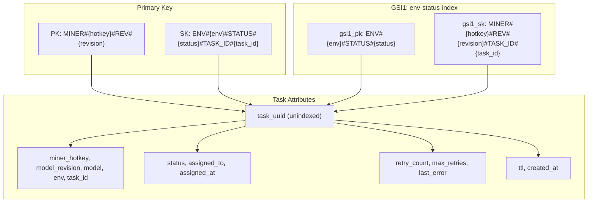
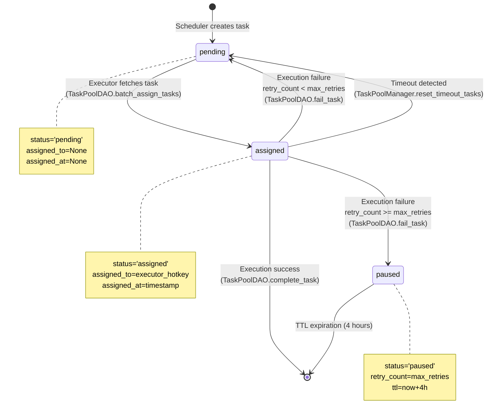
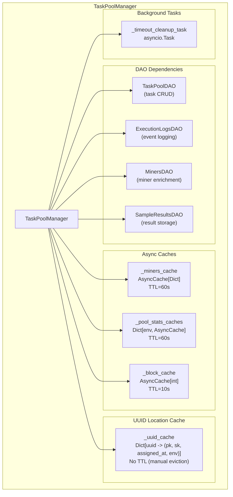
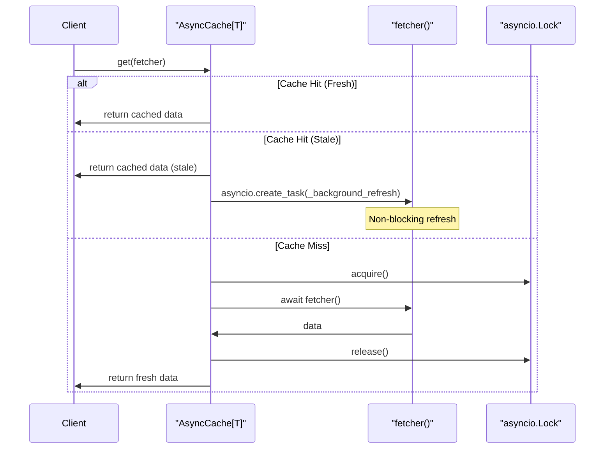
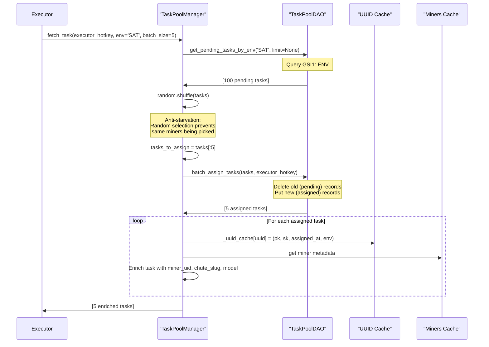
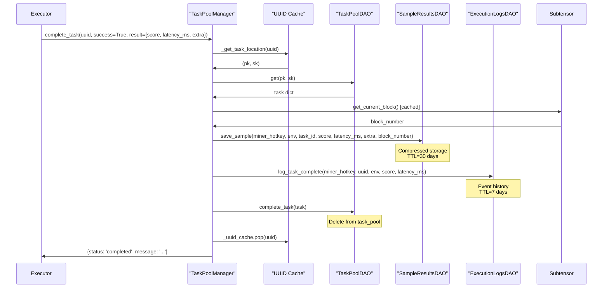
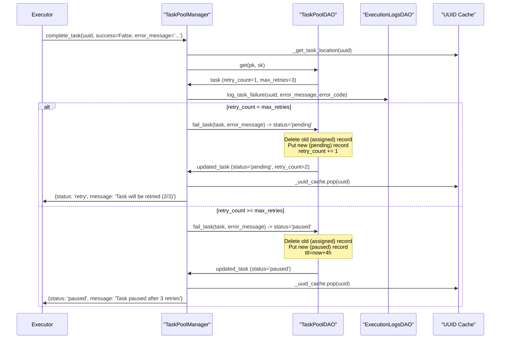
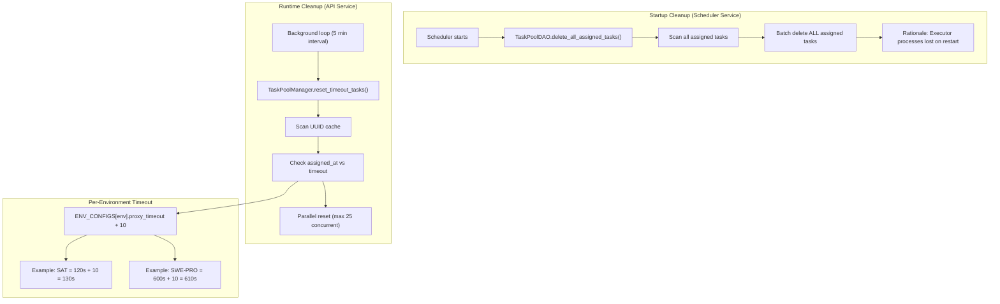
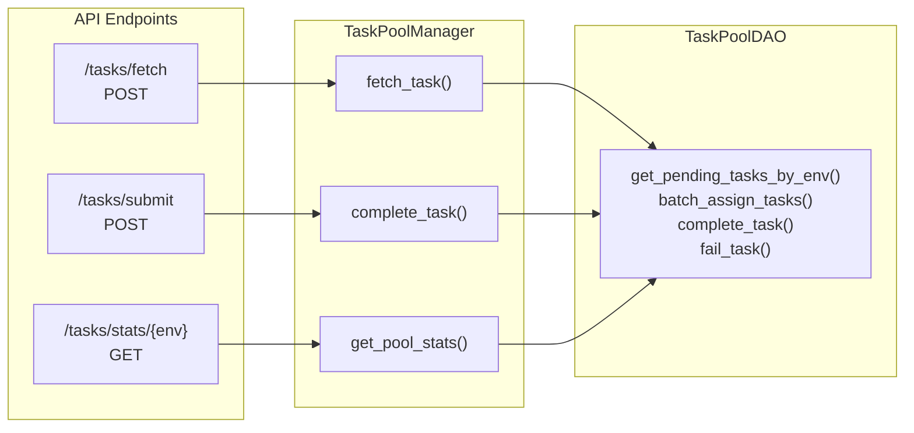

import CollapsibleAside from '../../../../components/CollapsibleAside.astro';
import SourceLink from '../../../../components/SourceLink.astro';
import Table from '../../../../components/Table.astro';

<CollapsibleAside title="Relevant Source Files">
  <SourceLink text="affine/api/services/task_pool.py" href="https://github.com/AffineFoundation/affine-cortex/blob/main/affine/api/services/task_pool.py" />
  <SourceLink text="affine/database/dao/task_pool.py" href="https://github.com/AffineFoundation/affine-cortex/blob/main/affine/database/dao/task_pool.py" />
</CollapsibleAside>

## Purpose and Scope

This document describes the **Task Pool Management** system, which handles the lifecycle of evaluation tasks as they move from creation to completion. The task pool is a DynamoDB table that acts as a work queue, enabling executors to fetch pending tasks, process them, and report results.

**Scope:**
- Task pool database schema and access patterns
- `TaskPoolManager` service class for task operations
- `TaskPoolDAO` data access layer
- Task lifecycle state transitions
- Timeout detection and cleanup mechanisms
- Performance optimizations (UUID caching, batch operations)

**Related Pages:**
- For task creation and scheduling logic, see [Task Scheduling System](/subnets/for-validators/task-scheduling-system#5.3)
- For database schema overview, see [Database Schema](/subnets/database-storage/database-schema#8.1)
- For task result storage, see [Sample Results & Scoring Data](/subnets/database-storage/sample-results-scoring-data#8.2)
- For cleanup policies, see [Data Retention & Cleanup](/subnets/database-storage/data-retention-cleanup#8.4)

---

## Task Pool Schema

The `task_pool` table uses a composite key design optimized for efficient per-miner queries and environment-based task fetching.

### Key Structure



**Sources:** [affine/database/dao/task_pool.py:10-42]()

### Key Design Rationale

<Table>

| Key Component | Purpose | Query Pattern |
|--------------|---------|---------------|
| **PK: MINER#&#123;hotkey&#125;#REV#&#123;revision&#125;** | Partition by miner | O(m) cleanup for invalid miners (where m = tasks per miner) |
| **SK: ENV#&#123;env&#125;#STATUS#&#123;status&#125;#TASK_ID#&#123;task_id&#125;** | Sort by environment and status | Single-miner queries: pending tasks, assigned tasks |
| **GSI1: ENV#&#123;env&#125;#STATUS#&#123;status&#125;** | Environment-based queries | Fetch pending tasks across all miners for an environment |
| **GSI1 SK: MINER#&#123;hotkey&#125;#...** | Miner grouping in GSI1 results | Weighted task counting, fairness distribution |
| **task_uuid (unindexed)** | Executor-facing identifier | O(1) cache lookup, O(n) DB scan on cache miss |

</Table>


This design enables:
- **Per-Miner Cleanup:** Query all tasks for a miner with `pk = MINER#{hotkey}#REV#{revision}` [affine/database/dao/task_pool.py:606-652]()
- **Environment Task Fetching:** Query all pending tasks for an environment via GSI1 [affine/database/dao/task_pool.py:105-151]()
- **Efficient Counting:** Count tasks per miner using GSI1 SK parsing [affine/database/dao/task_pool.py:691-749]()

**Sources:** [affine/database/dao/task_pool.py:10-42](), [affine/api/services/task_pool.py:1-15]()

---

## Task Lifecycle

Tasks transition through multiple states from creation to completion:

### State Transition Diagram



**Sources:** [affine/database/dao/task_pool.py:265-303](), [affine/database/dao/task_pool.py:390-486](), [affine/api/services/task_pool.py:195-319]()

### Task Status Values

<Table>

| Status | Description | Lifecycle |
|--------|-------------|-----------|
| `pending` | Task available for execution | Created by scheduler, returned to by retry logic |
| `assigned` | Task assigned to an executor | Set during `fetch_task`, includes `assigned_to` and `assigned_at` |
| `paused` | Task failed after max retries | Set by `fail_task` when `retry_count >= max_retries`, TTL = 4 hours |
| *deleted* | Task completed successfully | Removed from table by `complete_task` |

</Table>


**Sources:** [affine/database/dao/task_pool.py:265-486]()

### Task Attributes

```python
{
    'pk': 'MINER#{hotkey}#REV#{revision}',
    'sk': 'ENV#{env}#STATUS#{status}#TASK_ID#{task_id}',
    'task_uuid': str,           # UUID v4, unindexed
    'task_id': int,             # Dataset task ID (0-indexed)
    'miner_hotkey': str,
    'model_revision': str,
    'model': str,               # HuggingFace model identifier
    'env': str,                 # Environment name (e.g., 'SAT', 'DED_V2')
    'chute_id': str,            # Chutes deployment ID
    'status': str,              # 'pending' | 'assigned' | 'paused'
    'created_at': int,          # Unix timestamp
    'assigned_to': str | None,  # Executor hotkey
    'assigned_at': int | None,  # Unix timestamp
    'retry_count': int,         # Current retry count
    'max_retries': int,         # Maximum retries (default: 3)
    'last_error': str | None,
    'last_error_code': str | None,
    'last_failed_at': int | None,
    'ttl': int,                 # DynamoDB TTL (3 days for pending/assigned, 4 hours for paused)
    'gsi1_pk': str,             # GSI1 partition key
    'gsi1_sk': str,             # GSI1 sort key
}
```

**Sources:** [affine/database/dao/task_pool.py:44-103]()

---

## TaskPoolManager Architecture

The `TaskPoolManager` service class provides high-level task operations with caching optimizations.

### Class Structure



**Sources:** [affine/api/services/task_pool.py:111-156]()

### Caching Strategy

The `TaskPoolManager` implements a three-tier caching system:

#### 1. AsyncCache (Background Refresh)



**Sources:** [affine/api/services/task_pool.py:36-109]()

**Key Features:**
- **Non-blocking refresh:** Stale data is returned immediately, refresh happens in background
- **Cold start handling:** First fetch blocks until data is available
- **Generic implementation:** Used for miners, pool stats, and block numbers

**Cache Instances:**

<Table>

| Cache | TTL | Purpose | Fetcher |
|-------|-----|---------|---------|
| `_miners_cache` | 60s | Miner metadata for task enrichment | `MinersDAO.get_all_miners()` |
| `_pool_stats_caches[env]` | 60s | Task counts per environment | `TaskPoolDAO.get_pool_stats(env)` |
| `_block_cache` | 10s | Current block number for sample results | `Subtensor.get_current_block()` |

</Table>


**Sources:** [affine/api/services/task_pool.py:118-172]()

#### 2. UUID Location Cache

The UUID cache maps `task_uuid` to `(pk, sk, assigned_at, env)` for O(1) task lookups:

```python
self._uuid_cache: Dict[str, Tuple[str, str, int, str]] = {}
# Example: {'uuid1': ('MINER#hotkey#REV#rev', 'ENV#SAT#STATUS#assigned#...', 1234567890, 'SAT')}
```

**Rationale:** `task_uuid` is not indexed in DynamoDB (to avoid GSI overhead), so cache prevents expensive table scans.

**Cache Operations:**

<Table>

| Operation | Cache Behavior |
|-----------|----------------|
| `fetch_task` | Add UUID after successful assignment [affine/api/services/task_pool.py:456-465]() |
| `complete_task` | Remove UUID after task completion/deletion [affine/api/services/task_pool.py:644-645]() |
| `reset_timeout_tasks` | Remove UUID after timeout reset [affine/api/services/task_pool.py:296-298]() |
| `_get_task_location` | Check cache first, scan DB on miss [affine/api/services/task_pool.py:357-395]() |

</Table>


**Sources:** [affine/api/services/task_pool.py:147-151](), [affine/api/services/task_pool.py:357-395]()

---

## Task Operations

### Fetch Task (Executor → API)

Executors fetch tasks by requesting batches from a specific environment. The system implements **random shuffling** to prevent miner starvation.

#### Fetch Flow



**Sources:** [affine/api/services/task_pool.py:397-513](), [affine/database/dao/task_pool.py:304-388]()

#### Why No Limit on Pending Query?

From [affine/api/services/task_pool.py:409-420]():

> **Rationale for no limit:**
> - Total task pool size is bounded (~few thousand across all miners)
> - Sampling pool controls per-miner concurrency (~10 tasks per miner)
> - Without full sampling, GSI1 ordering causes miner starvation (tasks are sorted by `MINER#hotkey`, so limited query returns same miners)

**Trade-off:** Fetch all pending tasks and shuffle vs. fetch limited and risk starvation. The former is chosen because:
- Task pool size is bounded (typically &lt; 100k tasks)
- Random shuffling ensures fairness across miners
- Per-miner concurrency is controlled by scheduler

**Sources:** [affine/api/services/task_pool.py:425-442]()

#### Task Enrichment

Fetched tasks are enriched with miner metadata from the cached miners table:

```python
enriched_task = {
    **result,                        # Original task attributes
    'miner_uid': miner_uid,          # From miners table
    'chute_slug': chute_slug,        # Chutes deployment slug
    'model': model,                  # HuggingFace model identifier
}
```

This enrichment enables executors to:
- Route tasks to the correct Chutes deployment via `chute_slug`
- Include miner UID in execution logs
- Handle system miners with custom API endpoints via `model`

**Sources:** [affine/api/services/task_pool.py:467-501]()

### Complete Task (Executor → API)

#### Success Case



**Sources:** [affine/api/services/task_pool.py:515-655]()

#### Failure Case (Retry Logic)



**Sources:** [affine/api/services/task_pool.py:619-691](), [affine/database/dao/task_pool.py:401-486]()

**Retry Strategy:**

<Table>

| Retry Count | Action | New Status | TTL |
|-------------|--------|------------|-----|
| 1-2 | Reset to pending | `pending` | 3 days |
| 3 (max) | Pause task | `paused` | 4 hours |

</Table>


**Sources:** [affine/database/dao/task_pool.py:422-486]()

---

## Timeout Management

Tasks that exceed their execution timeout are automatically reset to `pending` status by a background cleanup loop.

### Timeout Detection Strategy



**Sources:** [affine/api/services/task_pool.py:195-355](), [affine/database/dao/task_pool.py:891-940]()

### Startup Cleanup (Orphaned Tasks)

When the scheduler service starts, it deletes **all assigned tasks** because executor processes are lost on restart:

```python
# Called by scheduler on startup
deleted_count = await task_pool_dao.delete_all_assigned_tasks()
# Scans for status='assigned', batch deletes all
```

**Rationale:** Assigned tasks from previous runs are orphaned (executors no longer exist), so they must be removed to allow scheduler to recreate them.

**Sources:** [affine/database/dao/task_pool.py:891-940]()

### Runtime Timeout Cleanup

During normal operation, the API service runs a background loop to detect and reset tasks that exceed their execution timeout:

```python
# API service background task
async def cleanup_loop():
    cleanup_interval = int(os.getenv('TASK_TIMEOUT_CLEANUP_INTERVAL', '300'))  # 5 minutes
    while True:
        await self.reset_timeout_tasks()
        await asyncio.sleep(cleanup_interval)
```

**Sources:** [affine/api/services/task_pool.py:321-355]()

#### Timeout Calculation

Each task's timeout is determined by its environment's configuration:

```python
timeout_seconds = ENV_CONFIGS[env].proxy_timeout + 10
timeout_threshold = current_time - timeout_seconds

if assigned_at < timeout_threshold:
    # Task has timed out, reset to pending
```

**Example Timeouts:**

<Table>

| Environment | proxy_timeout | Total Timeout |
|-------------|---------------|---------------|
| SAT | 120s | 130s |
| DED_V2 | 180s | 190s |
| SWE-PRO | 600s | 610s |
| NAVWORLD | 300s | 310s |

</Table>


**Sources:** [affine/api/services/task_pool.py:209-228]()

#### Reset Process

```mermaid
sequenceDiagram
    participant Loop as "Cleanup Loop"
    participant Cache as "UUID Cache"
    participant DAO as "TaskPoolDAO"
    
    loop Every 5 minutes
        Loop->>Cache: Scan _uuid_cache
        Note over Cache: Find (uuid, pk, sk, assigned_at, env)<br/>where assigned_at < timeout_threshold
        
        Cache->>Loop: [timeout_tasks]
        
        par Parallel Reset (max 25 concurrent)
            Loop->>DAO: get(pk, sk)
            DAO->>Loop: task
            
            alt Status still 'assigned'
                Loop->>DAO: Conditional delete (status='assigned')
                Loop->>DAO: Put new (status='pending')
                Loop->>Cache: _uuid_cache.pop(uuid)
            else Status changed (race condition)
                Loop->>Cache: _uuid_cache.pop(uuid)
                Note over Loop: Task completed/reset by another process
            end
        end
    end
```

**Sources:** [affine/api/services/task_pool.py:236-319]()

**Key Optimizations:**
- **UUID cache scan:** Avoids expensive DB scan by checking cached `(assigned_at, env)` tuples
- **Parallel reset:** Processes up to 25 tasks concurrently with semaphore
- **Conditional delete:** Uses DynamoDB condition expression to prevent race conditions

**Sources:** [affine/api/services/task_pool.py:236-304]()

---

## Performance Optimizations

### Batch Operations

The DAO implements batch operations to reduce DynamoDB API calls:

#### batch_create_tasks

```python
await task_pool_dao.batch_create_tasks(tasks=[...])
# Creates up to 100 tasks per BatchWriteItem request
# Uses BaseDAO.batch_write() which handles batching of 25 items
```

**Sources:** [affine/database/dao/task_pool.py:44-103]()

#### batch_assign_tasks

```python
updated_tasks = await task_pool_dao.batch_assign_tasks(tasks, executor_hotkey)
# For each task: Delete old (pending) + Put new (assigned)
# Batches 25 operations per BatchWriteItem request
```

**Efficiency:** Assigning 10 tasks requires 20 operations (10 deletes + 10 puts), sent as 1 BatchWriteItem request instead of 20 individual calls.

**Sources:** [affine/database/dao/task_pool.py:304-388]()

### Composite Key Design

The miner-partitioned key design enables O(m) cleanup instead of O(n):

```python
# Old approach: O(n) scan of entire table
all_tasks = await scan_all_tasks()
invalid_tasks = [t for t in all_tasks if t['miner_hotkey'] not in valid_set]

# New approach: O(m) query per invalid miner
for invalid_hotkey in invalid_miners:
    pk = f"MINER#{invalid_hotkey}#REV#{revision}"
    miner_tasks = await query(pk=pk)  # O(m) where m = tasks per miner
    await batch_delete(miner_tasks)
```

**Sources:** [affine/database/dao/task_pool.py:552-652]()

### GSI1 Efficiency

The `env-status-index` GSI enables efficient environment-based queries:

<Table>

| Query Type | Index Used | Complexity |
|------------|-----------|------------|
| Get pending tasks for env | GSI1 | O(k) where k = pending tasks in env |
| Count tasks per miner | GSI1 with projection | O(k) with gsi1_sk parsing |
| Get pool stats | GSI1 with SELECT=COUNT | O(1) for each status |

</Table>


**Example: get_miner_task_counts**

```python
# Query GSI1: ENV#SAT#STATUS#pending
# Project only gsi1_sk: MINER#{hotkey}#REV#{revision}#TASK_ID#{id}
# Parse gsi1_sk to extract hotkey and revision
# Count tasks per miner
```

This approach avoids fetching full task records, reducing data transfer.

**Sources:** [affine/database/dao/task_pool.py:691-749]()

### UUID Cache Performance

<Table>

| Operation | Without Cache | With Cache |
|-----------|---------------|------------|
| `_get_task_location` | O(n) Scan | O(1) Dict lookup |
| Cache miss frequency | N/A | Low after warmup (tasks stay assigned briefly) |
| Cache memory | N/A | ~100-200 bytes per task |

</Table>


**Trade-off:** The cache adds ~100KB memory overhead for 1000 concurrent tasks, but avoids expensive table scans on every task completion.

**Sources:** [affine/api/services/task_pool.py:147-151](), [affine/api/services/task_pool.py:357-395]()

---

## API Integration

The task pool is accessed via REST endpoints in the API service:



**Sources:** [affine/api/services/task_pool.py:111-156]()

**Authentication:** Task endpoints require executor authentication via X-Hotkey and X-Signature headers (see [Authentication & Rate Limiting](/subnets/api-reference/authentication-rate-limiting#13.2)).

**Rate Limiting:** Task fetch/submit operations have moderate rate limits (higher than scoring endpoints).

---

## Summary Table

<Table>

| Component | Purpose | Key Methods |
|-----------|---------|-------------|
| **TaskPoolDAO** | Database access layer | `batch_create_tasks`, `get_pending_tasks_by_env`, `batch_assign_tasks`, `complete_task`, `fail_task` |
| **TaskPoolManager** | Service layer with caching | `fetch_task`, `complete_task`, `reset_timeout_tasks`, `get_pool_stats` |
| **AsyncCache** | Background refresh cache | `get(fetcher)` with TTL-based expiration |
| **UUID Cache** | O(1) task location lookup | Dict mapping `task_uuid` to `(pk, sk, assigned_at, env)` |
| **Timeout Cleanup** | Runtime timeout detection | Background loop scanning UUID cache every 5 minutes |

</Table>


**Sources:** [affine/api/services/task_pool.py:1-698](), [affine/database/dao/task_pool.py:1-1015]()
