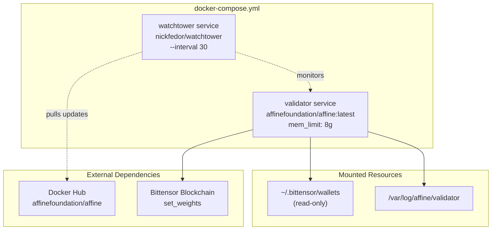
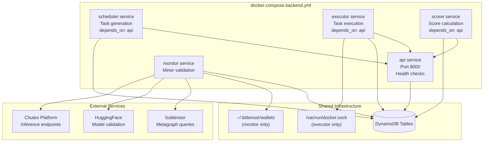
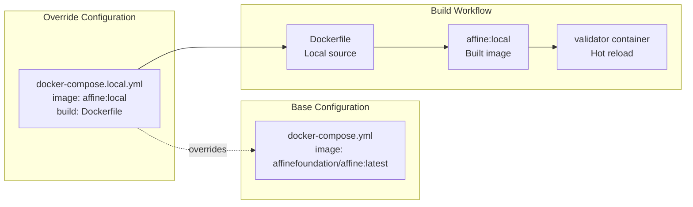
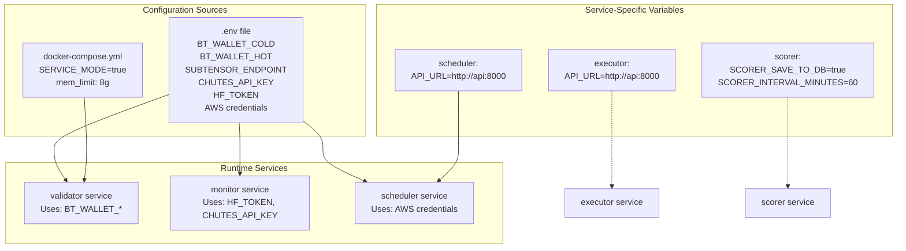
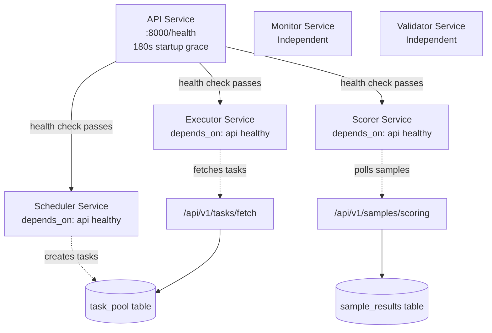
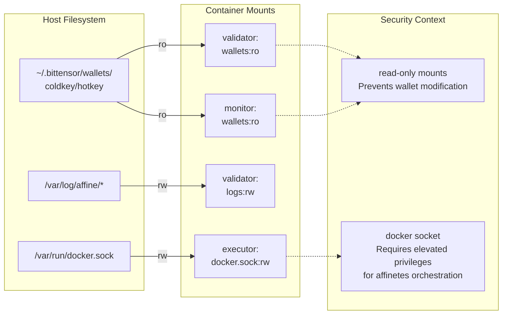
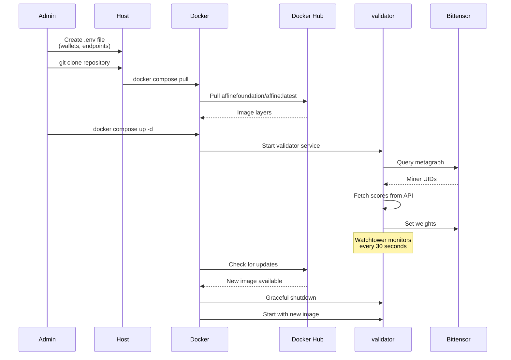
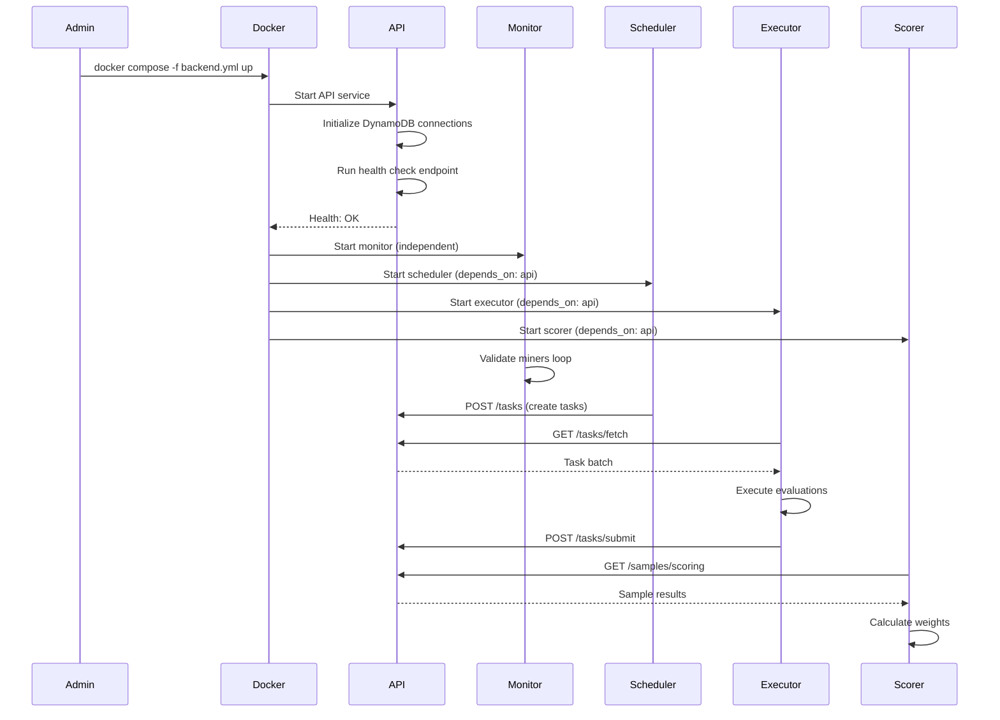

import CollapsibleAside from '../../../components/CollapsibleAside.astro';
import SourceLink from '../../../components/SourceLink.astro';
import Table from '../../../components/Table.astro';

<CollapsibleAside title="Relevant Source Files">
  <SourceLink text="docker-compose.local.yml" href="https://github.com/AffineFoundation/affine-cortex/blob/main/docker-compose.local.yml" />
  <SourceLink text="docker-compose.yml" href="https://github.com/AffineFoundation/affine-cortex/blob/main/docker-compose.yml" />
  <SourceLink text="pyproject.toml" href="https://github.com/AffineFoundation/affine-cortex/blob/main/pyproject.toml" />
  <SourceLink text="uv.lock" href="https://github.com/AffineFoundation/affine-cortex/blob/main/uv.lock" />
</CollapsibleAside>

This page provides an overview of deployment strategies and configurations for running Affine Cortex infrastructure. It covers the architectural patterns, configuration requirements, and deployment workflows for both validators and miners.

**Scope:** This document focuses on deployment architecture and configuration. For step-by-step production deployment instructions, see [Docker Deployment](/subnets/deployment-guide/docker-deployment#10.1). For local development setup, see [Local Development Setup](/subnets/deployment-guide/local-development-setup#10.2). For hardware specifications, see [Resource Requirements & Scaling](/subnets/deployment-guide/resource-requirements-scaling#10.3).

---

## Deployment Roles

Affine supports two primary deployment roles with different operational requirements:

<Table>

| Role | Services Required | Resource Profile | Blockchain Interaction |
|------|------------------|------------------|----------------------|
| **Validator** | validator service only | Medium (6-8GB RAM) | Sets weights on-chain |
| **Backend Operator** | 5 microservices + API | High (varies by service) | Read-only metagraph access |
| **Miner** | CLI tools only | Minimal | Commits model metadata |

</Table>


**Validators** run a single service that queries the scoring system, fetches weights, and commits them to the Bittensor blockchain. This is the minimum viable validator deployment.

**Backend Operators** run the complete microservices stack (API, Monitor, Scheduler, Executor, Scorer) that validates miners, generates tasks, executes evaluations, and calculates scores. Most validators rely on shared backend infrastructure rather than operating their own.

**Miners** do not run persistent services; they use CLI commands to deploy models and commit metadata, then serve inference via Chutes platform.

---

## Deployment Configurations

Affine provides three Docker Compose configurations for different use cases:

### Production Validator (`docker-compose.yml`)



**Use Case:** Production validator deployment with zero-downtime updates  
**Command:** `docker compose up -d`  
**Auto-Updates:** Watchtower checks for new images every 30 seconds  
**Environment Variables:** Set via `.env` file (wallets, endpoints, API keys)

**Sources:** [docker-compose.yml:1-26]()

---

### Backend Services (`docker-compose.backend.yml`)



**Use Case:** Complete backend infrastructure for validators running their own stack  
**Command:** `docker compose -f docker-compose.backend.yml up -d`  
**Service Count:** 5 independent microservices + API gateway  
**Startup Order:** API starts first (health gate), then dependent services

**Sources:** Diagram 6 from system architecture overview

---

### Local Development (`docker-compose.local.yml`)



**Use Case:** Rapid iteration on code changes before production deployment  
**Command:** `docker compose -f docker-compose.yml -f docker-compose.local.yml up --build`  
**Image Source:** Builds `affine:local` from Dockerfile instead of pulling from registry  
**Watchtower:** Disabled via profile (prevents auto-updates during development)

**Sources:** [docker-compose.local.yml:1-15]()

---

## Configuration Architecture

### Environment Variable Flow



**Configuration Layers:**

1. **`.env` file** - Shared secrets and credentials (Bittensor wallets, API keys, AWS credentials)
2. **`docker-compose.yml`** - Common service settings (memory limits, restart policies)
3. **Service-specific environment** - Operational parameters (`SERVICE_MODE`, `API_URL`, intervals)

**Key Variables:**

<Table>

| Variable | Required By | Purpose |
|----------|------------|---------|
| `BT_WALLET_COLD` | validator, monitor | Blockchain wallet name |
| `BT_WALLET_HOT` | validator, monitor | Hotkey name |
| `SUBTENSOR_ENDPOINT` | validator, monitor, scorer | Blockchain RPC endpoint |
| `CHUTES_API_KEY` | monitor | Model deployment validation |
| `HF_TOKEN` | monitor | HuggingFace model access |
| `AWS_ACCESS_KEY_ID` | api, scheduler, scorer | DynamoDB access |
| `AWS_SECRET_ACCESS_KEY` | api, scheduler, scorer | DynamoDB access |
| `SERVICE_MODE` | scheduler, scorer | Enable continuous loops |

</Table>


**Sources:** Diagram 6 from system architecture overview, [docker-compose.yml:10-13]()

---

## Service Dependencies

### Startup Sequence



**Health Gate Pattern:** The API service acts as a health gate for dependent services. Scheduler, Executor, and Scorer will not start until API's `/health` endpoint returns success, ensuring database connections and initialization are complete.

**Independent Services:** Monitor and Validator services start independently because:
- **Monitor** - Directly accesses DynamoDB and Bittensor, does not require API
- **Validator** - Queries scorer service for weights, can retry on failure

**Restart Policies:** All services use `restart: unless-stopped`, enabling independent recovery without cascading restarts.

**Sources:** Diagram 6 from system architecture overview

---

## Resource Mounting

### Persistent Storage and Sockets



**Mount Patterns:**

1. **Bittensor Wallets** (`:ro`)
   - Mounted read-only in validator and monitor services
   - Prevents accidental wallet modification
   - Required for blockchain signing operations
   - **Path:** `~/.bittensor/wallets:/root/.bittensor/wallets:ro`

2. **Log Volumes** (`:rw`)
   - Persistent logging beyond container lifecycle
   - Separate subdirectories per service
   - **Path:** `/var/log/affine/validator:/var/log/affine/validator`

3. **Docker Socket** (`:rw`)
   - Executor service only
   - Enables `affinetes` container orchestration for environment execution
   - Requires elevated privileges
   - **Path:** `/var/run/docker.sock:/var/run/docker.sock`

**Security Note:** Docker socket mounting grants container-level control. Only executor service requires this capability.

**Sources:** [docker-compose.yml:14-16](), Diagram 6 from system architecture overview

---

## Package Management

### Dependency Resolution

The Affine codebase uses `uv` package manager with pinned dependencies via `uv.lock`. This provides reproducible builds across development and production environments.

**Key Dependencies:**

<Table>

| Package | Version | Purpose |
|---------|---------|---------|
| `bittensor` | Latest | Blockchain integration |
| `bittensor-cli` | Latest | CLI commands |
| `fastapi` | `>=0.110.1,&lt;0.111` | API service framework |
| `uvicorn` | `==0.22.0` | ASGI server |
| `aiohttp` | `>=3.10.11` | Async HTTP client |
| `boto3` | `>=1.34` | DynamoDB access |
| `affinetes` | Git dependency | Container orchestration |
| `basilica-sdk` | `>=0.11.0` | Kubernetes pod management |

</Table>


**CLI Entrypoint:** The `af` command is registered as a script entrypoint in `pyproject.toml`:

```toml
[project.scripts]
af = "affine.cli.main:main"
```

This enables `af servers api`, `af db init`, etc. commands after package installation.

**Sources:** [pyproject.toml:1-53](), [uv.lock:1-100]()

---

## Deployment Workflows

### Validator Deployment Sequence



**Steps:**
1. Prepare `.env` with Bittensor wallet credentials and endpoints
2. Pull latest production image from Docker Hub
3. Start services with `docker compose up -d`
4. Validator automatically begins weight-setting cycle
5. Watchtower maintains zero-downtime updates

**Sources:** [docker-compose.yml:1-26]()

---

### Backend Services Deployment Sequence



**Steps:**
1. API service starts first, initializes database connections
2. Health check must pass before dependent services start (180s grace period)
3. Monitor starts independently, begins miner validation
4. Scheduler creates tasks via API
5. Executor fetches and executes tasks
6. Scorer calculates weights from results

**Sources:** Diagram 2 from system architecture overview

---

## Image Management

### Container Image Sources

<Table>

| Configuration | Image Name | Source | Build Trigger |
|---------------|-----------|--------|---------------|
| Production Validator | `affinefoundation/affine:latest` | Docker Hub | CI/CD on main branch |
| Backend Services | `affinefoundation/affine:latest` | Docker Hub | CI/CD on main branch |
| Local Development | `affine:local` | Local Dockerfile | Manual `--build` |

</Table>


**Watchtower Auto-Updates:** In production configurations, the `nickfedor/watchtower` service monitors running containers and automatically pulls new images from Docker Hub every 30 seconds. This enables zero-downtime deployments.

**Local Override:** The `docker-compose.local.yml` file overrides the image source to build from the local Dockerfile, enabling rapid iteration without pushing to registry.

**Sources:** [docker-compose.yml:5](), [docker-compose.local.yml:8-11]()

---

## Network Configuration

### Service Communication

All services within the Docker Compose deployment communicate via Docker's internal network:

- **API Service:** Exposed on port `8000` (host) → `8000` (container)
- **Internal Services:** Use service names as hostnames (e.g., `http://api:8000/api/v1/...`)
- **External Access:** Only API port is exposed; other services are internal-only

**Service Discovery:** Docker Compose automatically creates DNS entries for service names, enabling internal communication without hardcoded IPs.

**Rate Limiting:** API implements tiered rate limiting:
- `/scoring` endpoints: 1 request/minute (strict)
- Read/write operations: Higher limits
- Configuration endpoints: Lenient limits

**Sources:** Diagram 4 from system architecture overview

---

## Next Steps

This overview covers the high-level deployment architecture. For detailed instructions:

- **[Docker Deployment](/subnets/deployment-guide/docker-deployment#10.1)** - Production deployment walkthrough
- **[Local Development Setup](/subnets/deployment-guide/local-development-setup#10.2)** - Development environment setup
- **[Resource Requirements & Scaling](/subnets/deployment-guide/resource-requirements-scaling#10.3)** - Hardware specifications and scaling strategies

For configuration details:

- **[Configuration](/subnets/getting-started/configuration#2.2)** - Environment variable reference
- **[CLI Reference](/subnets/cli-reference#9)** - Command-line tools for miners

For operational procedures:

- **[Running a Validator](/subnets/for-validators/running-a-validator#5.2)** - Validator operational guide
- **[Backend Services Deep Dive](/subnets/backend-services-deep-dive#11)** - Individual service documentation
