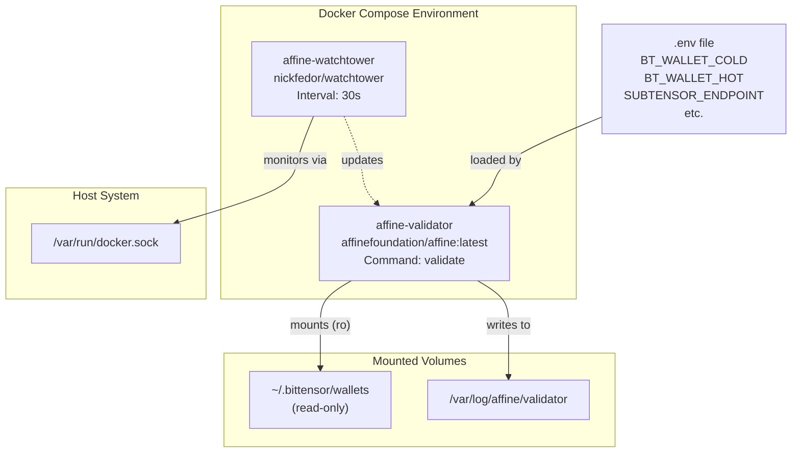
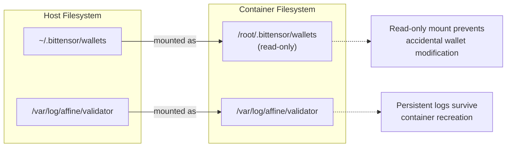
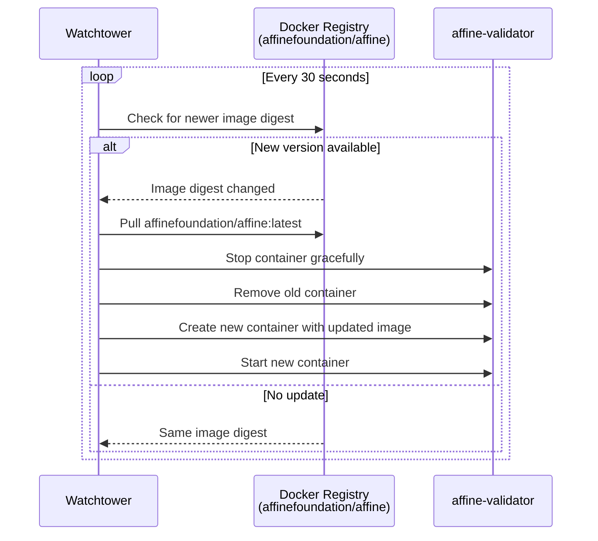
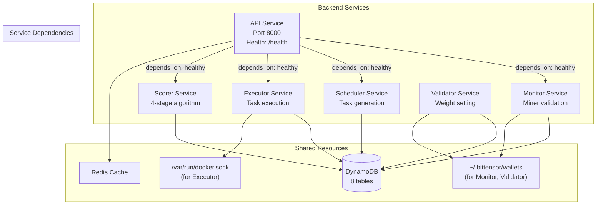

import CollapsibleAside from '../../../../components/CollapsibleAside.astro';
import SourceLink from '../../../../components/SourceLink.astro';
import Table from '../../../../components/Table.astro';

<CollapsibleAside title="Relevant Source Files">
  <SourceLink text="docker-compose.local.yml" href="https://github.com/AffineFoundation/affine-cortex/blob/main/docker-compose.local.yml" />
  <SourceLink text="docker-compose.yml" href="https://github.com/AffineFoundation/affine-cortex/blob/main/docker-compose.yml" />
  <SourceLink text="pyproject.toml" href="https://github.com/AffineFoundation/affine-cortex/blob/main/pyproject.toml" />
  <SourceLink text="uv.lock" href="https://github.com/AffineFoundation/affine-cortex/blob/main/uv.lock" />
</CollapsibleAside>

This page provides guidance for deploying Affine services in production environments using Docker Compose. It covers validator deployment configuration, container orchestration, resource management, and automated updates. For local development setup, see [Local Development Setup](/subnets/deployment-guide/local-development-setup#10.2). For detailed resource requirements and scaling considerations, see [Resource Requirements & Scaling](/subnets/deployment-guide/resource-requirements-scaling#10.3).

---

## Overview

Affine supports two primary Docker deployment configurations:

1. **Validator Deployment** - Single validator service with auto-updates (via `docker-compose.yml`)
2. **Full Backend Deployment** - All six backend services (via `docker-compose.backend.yml`)

Both configurations use pre-built images from the `affinefoundation/affine` Docker registry and support automated updates through Watchtower.

**Sources:** [docker-compose.yml:1-26](), Diagram 6 from high-level architecture

---

## Validator Deployment Architecture

The standard validator deployment consists of two services:



**Sources:** [docker-compose.yml:3-26]()

---

## Service Configuration

### Validator Service

The validator service runs the weight-setting logic that evaluates miner performance and commits weights to the Bittensor blockchain.

<Table>

| Configuration | Value | Purpose |
|--------------|-------|---------|
| **Image** | `affinefoundation/affine:latest` | Pre-built production image |
| **Container Name** | `affine-validator` | Fixed identifier for Watchtower |
| **Restart Policy** | `unless-stopped` | Automatic recovery on failure |
| **Memory Reservation** | `6g` | Guaranteed memory allocation |
| **Memory Limit** | `8g` | Maximum memory cap |
| **Command** | `["-v", "validate"]` | Runs validator in verbose mode |

</Table>


**Environment Variables:**

```bash
SERVICE_MODE=true  # Enables continuous operation loop
```

Additional environment variables are loaded from the `.env` file (see [Configuration](/subnets/getting-started/configuration#2.2) for details).

**Sources:** [docker-compose.yml:4-17]()

---

### Volume Mounts

The validator service requires access to specific host directories:



<Table>

| Mount | Host Path | Container Path | Mode | Purpose |
|-------|-----------|---------------|------|---------|
| Wallets | `~/.bittensor/wallets` | `/root/.bittensor/wallets` | `ro` | Access to coldkey/hotkey for signing |
| Logs | `/var/log/affine/validator` | `/var/log/affine/validator` | `rw` | Persistent log storage |

</Table>


The read-only wallet mount is a security best practice that prevents accidental modifications to sensitive key material.

**Sources:** [docker-compose.yml:14-16]()

---

## Watchtower Auto-Updates

Watchtower provides zero-downtime updates by monitoring Docker images and automatically pulling new versions.

### Configuration

<Table>

| Parameter | Value | Description |
|-----------|-------|-------------|
| **Image** | `nickfedor/watchtower` | Custom Watchtower build |
| **Container Name** | `affine-watchtower` | Fixed identifier |
| **Restart Policy** | `unless-stopped` | Continuous operation |
| **Update Interval** | `30` seconds | Check frequency |
| **Monitored Container** | `affine-validator` | Target for updates |

</Table>


**Update Process:**



The Watchtower service requires access to the Docker socket to manage containers:

```yaml
volumes:
  - /var/run/docker.sock:/var/run/docker.sock
```

This grants Watchtower control plane access to the Docker daemon.

**Sources:** [docker-compose.yml:19-25]()

---

## Full Backend Deployment

For validators running their own backend infrastructure, the `docker-compose.backend.yml` file orchestrates all six backend services:



### Service Startup Order

Services start in the following sequence, controlled by `depends_on` health checks:

1. **API Service** - Initializes database connections and exposes `/health` endpoint
2. **Monitor, Scheduler, Executor, Scorer** - Start after API health check passes
3. **Validator** - Can start independently (reads from database, no API dependency)

The health check configuration ensures the database is initialized before workers begin processing:

```yaml
healthcheck:
  test: ["CMD", "curl", "-f", "http://localhost:8000/health"]
  interval: 60s
  timeout: 10s
  retries: 3
  start_period: 180s  # Grace period for initialization
```

**Note:** The `docker-compose.backend.yml` file is not included in the codebase excerpt provided but is referenced in the deployment architecture. Contact the Affine team for access.

**Sources:** Diagram 6 from high-level architecture, Diagram 1 from system topology

---

## Environment Configuration

### Required Environment Variables

Services load configuration from a `.env` file in the same directory as the Docker Compose file:

<Table>

| Variable | Service | Purpose |
|----------|---------|---------|
| `BT_WALLET_COLD` | Monitor, Validator | Coldkey name for wallet access |
| `BT_WALLET_HOT` | Monitor, Validator | Hotkey name for signing transactions |
| `SUBTENSOR_ENDPOINT` | Monitor, Validator | Bittensor blockchain RPC URL |
| `CHUTES_API_KEY` | Monitor | Authentication for Chutes platform |
| `HF_TOKEN` | Monitor | HuggingFace API access token |
| `AWS_ACCESS_KEY_ID` | All services | DynamoDB access credentials |
| `AWS_SECRET_ACCESS_KEY` | All services | DynamoDB access credentials |
| `AWS_DEFAULT_REGION` | All services | DynamoDB region (e.g., `us-east-1`) |

</Table>


### Service-Specific Environment Variables

Backend services use additional environment variables to control operational modes:

<Table>

| Variable | Default | Description |
|----------|---------|-------------|
| `SERVICE_MODE` | `false` | Enables continuous loop operation |
| `API_URL` | `http://api:8000/api/v1` | Internal service-to-service endpoint |
| `SCORER_SAVE_TO_DB` | `true` | Persist scoring results to database |
| `SCORER_INTERVAL_MINUTES` | `60` | Scoring calculation frequency |

</Table>


For complete configuration details, see [Configuration](/subnets/getting-started/configuration#2.2).

**Sources:** [docker-compose.yml:10-13](), Diagram 6 from high-level architecture

---

## Resource Management

### Memory Limits

The validator service uses Docker's memory management features to ensure stable operation:

```yaml
mem_reservation: "6g"  # Soft limit - guaranteed allocation
mem_limit: "8g"        # Hard limit - OOM kill threshold
```

- **Reservation** (`6g`) - Minimum guaranteed memory; Docker scheduler ensures this is available
- **Limit** (`8g`) - Maximum memory usage; container is killed if exceeded

This configuration prevents memory exhaustion while allowing burst capacity for intensive operations like model evaluation.

### CPU Allocation

CPU resources are not explicitly constrained, allowing services to use available CPU cycles. For production deployments with resource contention, add explicit CPU limits:

```yaml
cpus: "4.0"  # Limit to 4 CPU cores
```

**Sources:** [docker-compose.yml:8-9]()

---

## Networking

### Port Mappings

In the standard validator deployment, no ports are exposed to the host (services communicate via internal Docker networks). For backend deployments, the API service typically exposes port 8000:

```yaml
ports:
  - "8000:8000"  # API service HTTP endpoint
```

### Internal Service Discovery

Services within the same Docker Compose stack communicate using service names as hostnames:

```bash
# From Executor service, reach API at:
http://api:8000/api/v1/tasks/fetch

# Docker's embedded DNS resolves "api" to the API container's IP
```

**Sources:** Diagram 4 from high-level architecture

---

## Deployment Commands

### Starting Services

**Production Validator:**
```bash
docker compose up -d
```

**Backend Services (full stack):**
```bash
docker compose -f docker-compose.backend.yml up -d
```

### Stopping Services

```bash
docker compose down
```

This stops containers but preserves volumes (logs, etc.).

### Viewing Logs

**Real-time logs:**
```bash
docker compose logs -f validator
```

**Persistent logs:**
```bash
tail -f /var/log/affine/validator/validator.log
```

### Updating Services

Watchtower handles updates automatically, but you can manually update:

```bash
docker compose pull validator
docker compose up -d validator
```

**Sources:** [docker-compose.yml:1-26]()

---

## Local Development Override

For local development, use the override configuration to build from source:

```bash
docker compose -f docker-compose.yml -f docker-compose.local.yml up --build
```

This configuration:
- Builds the `affine:local` image from the local `Dockerfile`
- Disables Watchtower (set to `production` profile)
- Maintains the same volume mounts and environment variables

For detailed local development setup, see [Local Development Setup](/subnets/deployment-guide/local-development-setup#10.2).

**Sources:** [docker-compose.local.yml:1-15]()

---

## Troubleshooting

### Container Startup Failures

**Check logs:**
```bash
docker compose logs validator
```

**Common issues:**
- Missing `.env` file → Ensure environment variables are configured
- Wallet not found → Verify `~/.bittensor/wallets` directory exists and contains coldkey/hotkey
- Memory limit exceeded → Increase `mem_limit` or reduce concurrent operations

### Watchtower Not Updating

**Verify Watchtower is running:**
```bash
docker ps | grep watchtower
```

**Check Watchtower logs:**
```bash
docker compose logs watchtower
```

**Common issues:**
- Docker socket permission denied → Ensure Docker socket is mounted with correct permissions
- Image pull rate limits → Docker Hub anonymous pulls are limited; consider authentication

### Service Health Check Failures

For backend deployments, if services fail to start due to health check timeouts:

```bash
# Check API health directly
curl http://localhost:8000/health

# Increase startup period in docker-compose.backend.yml
healthcheck:
  start_period: 300s  # Give more time for initialization
```

**Sources:** [docker-compose.yml:1-26](), Diagram 6 from high-level architecture

---

## Security Considerations

### Read-Only Wallet Mounts

The validator service mounts wallets as read-only (`ro` flag) to prevent accidental modification or deletion of key material:

```yaml
volumes:
  - ~/.bittensor/wallets:/root/.bittensor/wallets:ro
```

This is a critical security practice - wallets contain private keys that control TAO and validator identity.

### Docker Socket Access

Watchtower and the Executor service require Docker socket access. This grants significant privileges (equivalent to root on the host). Only trusted containers should have this access.

### Container Isolation

Each service runs in its own container with isolated filesystem, process namespace, and network namespace. This limits the blast radius of potential security vulnerabilities.

**Sources:** [docker-compose.yml:15](), [docker-compose.yml:24]()

---

## Dependencies and Image Registry

### Container Images

<Table>

| Service | Image | Registry |
|---------|-------|----------|
| Validator | `affinefoundation/affine:latest` | Docker Hub |
| Watchtower | `nickfedor/watchtower` | Docker Hub |

</Table>


### Python Dependencies

The Affine image includes all dependencies specified in `pyproject.toml`, including:

- `bittensor` - Blockchain integration
- `bittensor-cli` - CLI tools
- `fastapi` / `uvicorn` - API service
- `boto3` / `aiobotocore` - DynamoDB access
- `aiohttp` - Async HTTP client
- `affinetes` - Container orchestration
- `basilica-sdk` - Kubernetes integration

Dependencies are locked via `uv.lock` to ensure reproducible builds.

**Sources:** [pyproject.toml:1-53](), [uv.lock:1-100]()

---

## Integration with Other Systems

### Bittensor Blockchain

The validator service communicates with Bittensor's Subtensor blockchain to:
- Read metagraph (miner registrations)
- Set weights (reward distribution)
- Query block numbers

Configuration via `SUBTENSOR_ENDPOINT` environment variable.

### Chutes Platform

The Monitor service validates that miners have deployed models to Chutes (Subnet 64's inference platform). Requires `CHUTES_API_KEY` for authentication.

### HuggingFace

The Monitor service validates miner models hosted on HuggingFace. Requires `HF_TOKEN` for accessing private repositories during the validation window.

### DynamoDB

All backend services share a DynamoDB database for coordination:
- `miners` table - Validation state
- `task_pool` table - Work distribution
- `sample_results` table - Execution results
- `scores` table - Performance metrics
- Additional tables documented in [Database Schema](/subnets/database-storage/database-schema#8.1)

**Sources:** [docker-compose.yml:10-11](), Diagram 1 from system topology
