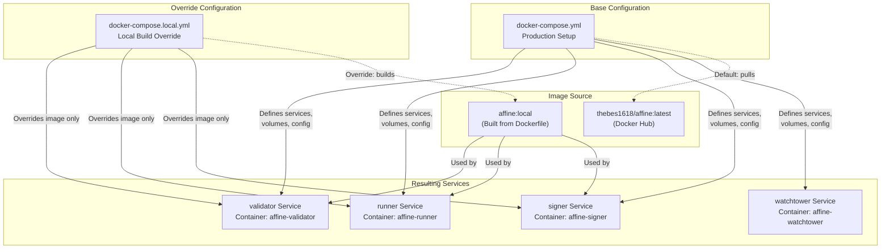
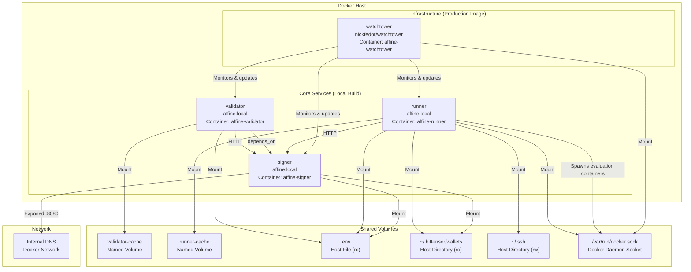
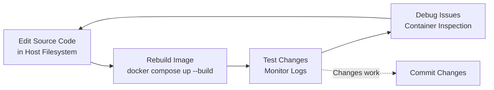

import CollapsibleAside from '../../../../components/CollapsibleAside.astro';
import SourceLink from '../../../../components/SourceLink.astro';
import Table from '../../../../components/Table.astro';

<CollapsibleAside title="Relevant Source Files">
  <SourceLink text="docker-compose.local.yml" href="https://github.com/AffineFoundation/affine-cortex/blob/main/docker-compose.local.yml" />
  <SourceLink text="docker-compose.yml" href="https://github.com/AffineFoundation/affine-cortex/blob/main/docker-compose.yml" />
  <SourceLink text="pyproject.toml" href="https://github.com/AffineFoundation/affine-cortex/blob/main/pyproject.toml" />
  <SourceLink text="uv.lock" href="https://github.com/AffineFoundation/affine-cortex/blob/main/uv.lock" />
</CollapsibleAside>

## Purpose and Scope

This page covers setting up a local development environment for Affine using Docker Compose with locally-built images. This approach enables rapid iteration on code changes during development. For production deployment using pre-built images from Docker Hub, see [Docker Deployment](/subnets/deployment-guide/docker-deployment#10.1). For setting up a native development environment with testing and type checking, see [Development Environment](/subnets/developer-guide/development-environment#11.1).

---

## Overview

The local development setup uses [`docker-compose.local.yml`](docker-compose.local.yml:1-19)() as an override file that extends the base [`docker-compose.yml`](docker-compose.yml:1-78)(). The key difference is that `docker-compose.local.yml` builds the Affine Docker image locally from source rather than pulling `thebes1618/affine:latest` from Docker Hub.

This setup is ideal for:
- Testing code changes before committing
- Debugging validator, runner, or signer behavior
- Experimenting with configuration changes
- Contributing to the Affine codebase

Sources: `docker-compose.local.yml`, `docker-compose.yml`

---

## Architecture: Compose Override Pattern

The local development setup uses Docker Compose's file override mechanism to replace the production image with a locally-built one while maintaining identical service definitions.



**Key Concept**: The anchor `&affine_image` at [`docker-compose.local.yml:6-10`](docker-compose.local.yml:6-10)() defines the local build configuration, which is then applied to all three core services using YAML merge syntax (`&lt;&lt;: *affine_image`).

Sources: `docker-compose.local.yml:1-19`, `docker-compose.yml:4-62`

---

## Prerequisites

Before setting up the local development environment, ensure you have:

<Table>

| Requirement | Description |
|------------|-------------|
| **Docker** | Version 20.10+ with Docker Compose V2 |
| **Source Code** | Cloned repository from `https://github.com/AffineFoundation/affine-cortex` |
| **Configuration** | `.env` file with required environment variables (see [Configuration](/subnets/getting-started/configuration#2.2)) |
| **Bittensor Wallet** | Wallet files in `~/.bittensor/wallets` (for validator/signer) |
| **Disk Space** | ~10GB for Docker images and volumes |

</Table>


The setup does **not** require:
- Python installation on host (runs in containers)
- Manual dependency installation
- Separate virtual environment

Sources: `docker-compose.yml:10-11,33-35,52-53`

---

## Building the Local Image

### Image Build Configuration

The local build configuration is defined using a YAML anchor in [`docker-compose.local.yml:6-10`](docker-compose.local.yml:6-10)():

```yaml
x-affine-image: &affine_image
  image: affine:local
  build:
    context: .
    dockerfile: Dockerfile
```

This configuration:
- Tags the built image as `affine:local`
- Uses the repository root (`.`) as the build context
- References `Dockerfile` in the root directory

### Build Command

To build the local image and start all services:

```bash
docker compose -f docker-compose.yml -f docker-compose.local.yml up --build
```

**Command breakdown:**
- `-f docker-compose.yml` - Load base configuration
- `-f docker-compose.local.yml` - Apply local overrides
- `up` - Start services
- `--build` - Rebuild image before starting

### Build Process

When building, Docker will:
1. Copy source code into the image context
2. Install dependencies specified in `pyproject.toml`
3. Create the `affine:local` image
4. Use this image for `validator`, `runner`, and `signer` services
5. Pull `nickfedor/watchtower` for the `watchtower` service (unchanged)

**Note**: The `watchtower` service is not overridden and continues to use the production image since it doesn't need local code changes.

Sources: `docker-compose.local.yml:6-18`

---

## Service Architecture

The local development environment instantiates the same four services as production, with identical configuration except for the image source.



### Service Descriptions

<Table>

| Service | Command | Purpose | Image |
|---------|---------|---------|-------|
| **validator** | `["-vv", "validate"]` | Runs weight calculation and setting loop | `affine:local` |
| **runner** | `["-vv", "runner", "--enable-monitoring"]` | Executes sampling scheduler and task evaluation | `affine:local` |
| **signer** | `["-v", "signer"]` | Provides signing service for results and weight setting | `affine:local` |
| **watchtower** | `--interval 30 affine-validator affine-runner affine-signer` | Monitors for image updates every 30 seconds | `nickfedor/watchtower` |

</Table>


**Important**: In local development, `watchtower` will not automatically update your services since they use the `affine:local` tag, which is not tracked in a remote registry. This prevents unexpected restarts during development.

Sources: `docker-compose.yml:21,40,62,70`, `docker-compose.local.yml:13-18`

---

## Starting the Development Environment

### Initial Startup

To start all services with a fresh build:

```bash
docker compose -f docker-compose.yml -f docker-compose.local.yml up --build
```

### Subsequent Startups

If you haven't changed the code, you can omit `--build`:

```bash
docker compose -f docker-compose.yml -f docker-compose.local.yml up
```

### Background Mode

To run services in detached mode:

```bash
docker compose -f docker-compose.yml -f docker-compose.local.yml up -d --build
```

### Starting Individual Services

To start only specific services (e.g., for testing just the signer):

```bash
docker compose -f docker-compose.yml -f docker-compose.local.yml up signer --build
```

**Note**: The `validator` service has a dependency on `signer` ([`docker-compose.yml:19-20`](docker-compose.yml:19-20)()), so starting the validator will automatically start the signer.

Sources: `docker-compose.yml:18-21`, `docker-compose.local.yml:1-3`

---

## Development Workflow

### Typical Iteration Cycle



### Making Code Changes

1. **Edit files** in your local repository using your preferred IDE
2. **Rebuild** the image to include changes:
   ```bash
   docker compose -f docker-compose.yml -f docker-compose.local.yml up --build
   ```
3. **Verify** changes are reflected in the running containers

**Files ignored during build**: See [`.gitignore`](.gitignore:1-147)() for patterns excluded from the Docker build context, including:
- `results/`, `tests/`, `tmp/` directories
- `notebooks/` directory
- Python cache files (`__pycache__/`, `*.pyc`)
- Virtual environments (`venv/`, `.venv/`)

### Viewing Logs

To view logs from all services:

```bash
docker compose -f docker-compose.yml -f docker-compose.local.yml logs -f
```

To view logs from a specific service:

```bash
docker compose -f docker-compose.yml -f docker-compose.local.yml logs -f runner
```

**Log verbosity** is controlled by the command arguments:
- `-v` = verbose (info level)
- `-vv` = very verbose (debug level)

See [`docker-compose.yml:21,40,62`](docker-compose.yml:21,40,62)() for default verbosity settings.

### Debugging Inside Containers

To execute a shell inside a running container:

```bash
docker exec -it affine-runner bash
```

To inspect the container's environment:

```bash
docker exec -it affine-runner env
```

To check if the local code is present:

```bash
docker exec -it affine-runner ls -la /app
```

Sources: `docker-compose.yml:21,40,62`, `.gitignore:1-147`

---

## Volume Mounts and Data Persistence

The local development environment uses the same volume configuration as production to ensure consistency.

### Volume Types

<Table>

| Volume | Type | Mode | Purpose |
|--------|------|------|---------|
| `.env` | Bind Mount | Read-only (`ro`) | Environment configuration |
| `~/.bittensor/wallets` | Bind Mount | Read-only (`ro`) | Validator credentials |
| `~/.ssh` | Bind Mount | Read-write (`rw`) | SSH keys for remote operations |
| `/var/run/docker.sock` | Bind Mount | Read-write (`rw`) | Docker daemon access (runner only) |
| `validator-cache` | Named Volume | Read-write (`rw`) | Block data storage |
| `runner-cache` | Named Volume | Read-write (`rw`) | Affine cache directory |

</Table>


### Named Volume Configuration

The named volumes are defined at [`docker-compose.yml:72-77`](docker-compose.yml:72-77)():

```yaml
volumes:
  validator-cache:
    name: affine-validator-cache
  runner-cache:
    name: affine-runner-cache
```

These volumes persist data across container restarts and rebuilds, preserving:
- **validator-cache**: Downloaded block data from R2 storage
- **runner-cache**: Environment containers and evaluation artifacts

### Inspecting Volume Data

To view volume contents:

```bash
docker volume inspect affine-validator-cache
docker volume inspect affine-runner-cache
```

To clean up volumes (destroys cached data):

```bash
docker compose -f docker-compose.yml -f docker-compose.local.yml down -v
```

**Warning**: Using `-v` flag removes all volume data. Only use when you want to start fresh.

Sources: `docker-compose.yml:12-36,72-77`

---

## Environment Variables and Configuration

### Configuration File Location

Both the base and override compose files expect a `.env` file in the repository root. This file is mounted as read-only into all services at [`/app/.env`](docker-compose.yml:13)().

### Required Variables

For local development, ensure your `.env` file contains:

<Table>

| Variable | Required By | Purpose |
|----------|-------------|---------|
| `WALLET_NAME` | signer, runner | Bittensor wallet identifier |
| `WALLET_HOTKEY` | signer, runner | Hotkey name for signing |
| `CHUTES_API_KEY` | runner | Authentication for Chutes.ai API |
| `AFFINE_R2_ENDPOINT` | validator, runner | R2 storage endpoint URL |
| `AFFINE_R2_BUCKET` | validator, runner | R2 bucket name |
| `AFFINE_R2_KEY_ID` | validator, runner | R2 access key ID (optional for public buckets) |
| `AFFINE_R2_KEY` | validator, runner | R2 secret key (optional for public buckets) |

</Table>


### Service-Specific Environment

Additional environment variables are set directly in [`docker-compose.yml`](docker-compose.yml:15-17,38-39,48-50)():

**Validator**:
- `AFFINE_CACHE_DIR=/app/data/blocks` - Cache directory path
- `SIGNER_URL=http://signer:8080` - Signer service endpoint

**Runner**:
- `SIGNER_URL=http://signer:8080` - Signer service endpoint

**Signer**:
- `SIGNER_HOST=0.0.0.0` - Bind to all interfaces
- `SIGNER_PORT=8080` - Service port

These environment variables override any values in the `.env` file.

Sources: `docker-compose.yml:10-17,29-39,46-50`

---

## Monitoring the Development Environment

### Service Health Checks

The signer service includes a health check at [`docker-compose.yml:56-61`](docker-compose.yml:56-61)():

```yaml
healthcheck:
  test: ["CMD", "curl", "-fsS", "http://localhost:8080/healthz"]
  interval: 10s
  timeout: 3s
  retries: 3
  start_period: 5s
```

To check service health status:

```bash
docker compose -f docker-compose.yml -f docker-compose.local.yml ps
```

### Monitoring API

If the runner is started with `--enable-monitoring` (default in [`docker-compose.yml:40`](docker-compose.yml:40)()), the monitoring API is available on port 8765:

```bash
curl http://localhost:8765/status
```

**Note**: The monitoring port is not exposed in the base `docker-compose.yml`. To access it, you may need to add port mapping to the override file or exec into the container.

### Resource Monitoring

To monitor container resource usage:

```bash
docker stats affine-validator affine-runner affine-signer
```

Each service has memory limits defined at [`docker-compose.yml:8-9,27-28`](docker-compose.yml:8-9,27-28)():
- Memory reservation: 6GB
- Memory limit: 8GB

Sources: `docker-compose.yml:8-9,27-28,40,56-61`

---

## Stopping and Cleaning Up

### Stop Services

To stop all services while preserving volumes:

```bash
docker compose -f docker-compose.yml -f docker-compose.local.yml down
```

### Stop and Remove Volumes

To stop services and remove all cached data:

```bash
docker compose -f docker-compose.yml -f docker-compose.local.yml down -v
```

### Remove Built Image

To remove the locally-built image:

```bash
docker rmi affine:local
```

### Complete Cleanup

To remove everything including networks:

```bash
docker compose -f docker-compose.yml -f docker-compose.local.yml down -v --rmi local
```

This removes:
- All containers
- Named volumes (`validator-cache`, `runner-cache`)
- The `affine:local` image
- Docker networks created by compose

Sources: `docker-compose.yml:72-77`, `docker-compose.local.yml:7`

---

## Troubleshooting

### Image Not Rebuilding

**Symptom**: Code changes don't appear in running containers.

**Solutions**:
1. Ensure you're using `--build` flag:
   ```bash
   docker compose -f docker-compose.yml -f docker-compose.local.yml up --build
   ```
2. Force rebuild without cache:
   ```bash
   docker compose -f docker-compose.yml -f docker-compose.local.yml build --no-cache
   ```

### Signer Service Unhealthy

**Symptom**: Validator fails to start with "signer service unhealthy" message.

**Solutions**:
1. Check signer logs:
   ```bash
   docker compose -f docker-compose.yml -f docker-compose.local.yml logs signer
   ```
2. Verify wallet files exist at `~/.bittensor/wallets`
3. Check `.env` has correct `WALLET_NAME` and `WALLET_HOTKEY`

### Runner Cannot Spawn Containers

**Symptom**: Runner fails with "Cannot connect to Docker daemon" errors.

**Solutions**:
1. Ensure Docker socket is mounted: [`docker-compose.yml:35`](docker-compose.yml:35)()
2. Verify Docker daemon is running on host
3. Check socket permissions: `ls -l /var/run/docker.sock`

### Out of Memory Errors

**Symptom**: Services killed with exit code 137.

**Solutions**:
1. Increase Docker daemon memory allocation
2. Reduce number of concurrent services
3. Adjust memory limits in `docker-compose.yml` (see [Resource Requirements](#10.3))

Sources: `docker-compose.yml:8-9,27-28,35,56-61`

---

## Differences from Production Deployment

<Table>

| Aspect | Production ([Docker Deployment](/subnets/deployment-guide/docker-deployment#10.1)) | Local Development |
|--------|----------------------------------------|-------------------|
| **Image Source** | `thebes1618/affine:latest` from Docker Hub | `affine:local` built from source |
| **Build Process** | Pull pre-built image | Build from Dockerfile locally |
| **Update Mechanism** | Watchtower auto-updates every 30 seconds | Manual rebuild required |
| **Primary Use Case** | Long-running validator nodes | Testing and development |
| **Startup Command** | `docker compose up` | `docker compose -f docker-compose.yml -f docker-compose.local.yml up --build` |

</Table>


The service architecture, volume configuration, and networking remain identical between production and local development environments.

Sources: `docker-compose.yml:5,24,43`, `docker-compose.local.yml:6-18`
