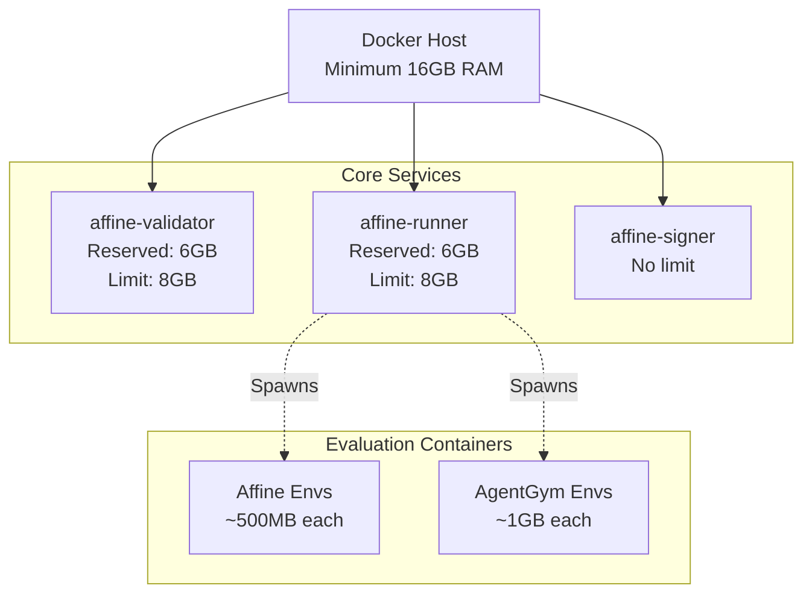
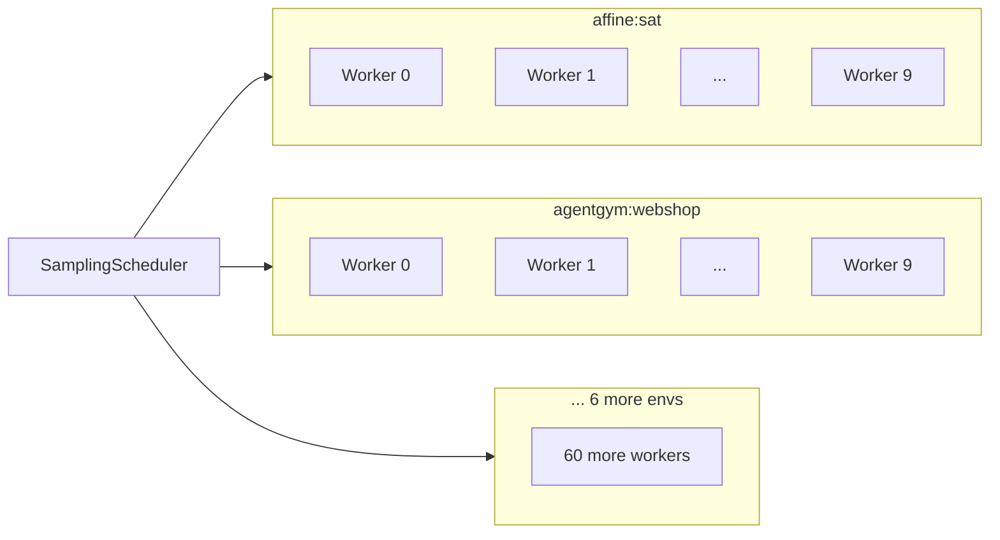
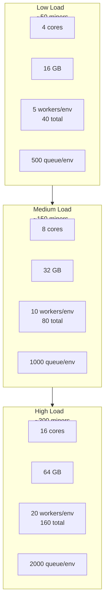

import CollapsibleAside from '../../../../components/CollapsibleAside.astro';
import SourceLink from '../../../../components/SourceLink.astro';
import Table from '../../../../components/Table.astro';

<CollapsibleAside title="Relevant Source Files">
  <SourceLink text="affine/core/environments.py" href="https://github.com/AffineFoundation/affine-cortex/blob/main/affine/core/environments.py" />
  <SourceLink text="affine/database/system_config.json" href="https://github.com/AffineFoundation/affine-cortex/blob/main/affine/database/system_config.json" />
  <SourceLink text="affine/src/executor/config.py" href="https://github.com/AffineFoundation/affine-cortex/blob/main/affine/src/executor/config.py" />
  <SourceLink text="docker-compose.local.yml" href="https://github.com/AffineFoundation/affine-cortex/blob/main/docker-compose.local.yml" />
  <SourceLink text="docker-compose.yml" href="https://github.com/AffineFoundation/affine-cortex/blob/main/docker-compose.yml" />
  <SourceLink text="pyproject.toml" href="https://github.com/AffineFoundation/affine-cortex/blob/main/pyproject.toml" />
  <SourceLink text="uv.lock" href="https://github.com/AffineFoundation/affine-cortex/blob/main/uv.lock" />
</CollapsibleAside>

This document specifies hardware requirements, memory allocation, concurrency settings, and performance tuning strategies for running Affine validators and miners. It covers both minimum requirements for basic operation and scaling strategies for high-throughput deployments.

For deployment instructions, see [Docker Deployment](/subnets/deployment-guide/docker-deployment#10.1) and [Local Development Setup](/subnets/deployment-guide/local-development-setup#10.2). For monitoring resource usage in production, see [Monitoring & Observability](/subnets/for-validators/monitoring-observability#5.5).

---

## Minimum Hardware Requirements

### Validator Node

<Table>

| Resource | Minimum | Recommended | Purpose |
|----------|---------|-------------|---------|
| **CPU** | 4 cores | 8+ cores | Concurrent evaluation workers |
| **RAM** | 16 GB | 32 GB | Container memory + evaluation environments |
| **Disk** | 50 GB | 100 GB+ | Docker images, block cache, logs |
| **Network** | 100 Mbps | 1 Gbps | Chutes API calls, R2 uploads |

</Table>


### Miner Node

<Table>

| Resource | Minimum | Recommended | Purpose |
|----------|---------|-------------|---------|
| **CPU** | 2 cores | 4 cores | Model training, CLI operations |
| **RAM** | 8 GB | 16 GB | Training workspace |
| **Disk** | 20 GB | 50 GB | Model storage, local cache |
| **Network** | 50 Mbps | 100 Mbps | HuggingFace uploads, Chutes deployment |

</Table>


**Sources:** [docker-compose.yml:1-78]()

---

## Container Memory Allocation

The production Docker deployment allocates memory across three core services:



### Memory Reservation vs. Limit

Docker uses two memory constraints defined in [docker-compose.yml:8-9]() and [docker-compose.yml:27-28]():

- **`mem_reservation`**: Soft limit - guaranteed minimum allocation
- **`mem_limit`**: Hard limit - maximum allocation before OOM kill

<Table>

| Container | Reservation | Limit | Usage Pattern |
|-----------|-------------|-------|---------------|
| `affine-validator` | 6 GB | 8 GB | Block cache, weight calculation |
| `affine-runner` | 6 GB | 8 GB | Task queues, worker coordination |
| `affine-signer` | None | None | Lightweight signing service |

</Table>


### Evaluation Container Overhead

The runner spawns short-lived Docker containers for evaluations via [Affinetes](#7.1). Peak memory usage:

- **Affine environments** (`bignickeye/affine:v3`): ~500 MB per container
- **AgentGym environments** (`bignickeye/agentgym:*-v2`): ~1 GB per container

With default settings of 10 workers per environment × 8 environments = 80 concurrent containers:
- Maximum overhead: ~50-80 GB if all workers spawn containers simultaneously
- Typical usage: ~10-20 GB (10-25% utilization)

**Sources:** [docker-compose.yml:8-9](), [docker-compose.yml:27-28](), [affine/scheduler/config.py:11-14]()

---

## Concurrency Configuration

### Worker Parallelism

The scheduler creates worker pools defined by environment variables in [affine/scheduler/config.py:11-14]():

```python
workers_per_env: int = int(os.getenv("AFFINE_WORKERS_PER_ENV", "10"))
```

**Total workers** = `AFFINE_WORKERS_PER_ENV` × number of environments

Example with 8 environments and default settings:
- 10 workers per environment
- **80 total concurrent evaluations**



Worker creation happens in [affine/scheduler/scheduler.py:122-138]():

```python
for env in envs:
    for i in range(self.config.workers_per_env):
        worker = EvaluationWorker(
            worker_id=f"{env.env_name}-{i}",
            task_queue=env_queue,
            result_queue=self.result_queue,
            env=env,
            samplers=self.samplers,
            monitor=self.scheduler_monitor,
        )
        task = asyncio.create_task(worker.run())
        self.evaluation_workers.append(task)
```

**Sources:** [affine/scheduler/config.py:11-14](), [affine/scheduler/scheduler.py:122-138]()

### Queue Sizing

Task queues buffer work between the global sampling loop and evaluation workers. Configuration in [affine/scheduler/config.py:16-19]():

```python
queue_max_size_per_env: int = int(os.getenv("AFFINE_QUEUE_MAX_SIZE_PER_ENV", "1000"))
```

Queue thresholds are auto-calculated in [affine/scheduler/config.py:60-73]():

<Table>

| Threshold | Formula | Default | Purpose |
|-----------|---------|---------|---------|
| Warning | 50% of max | 500 | Log warnings |
| Pause | 75% of max | 750 | Temporarily pause sampling |
| Resume | 25% of max | 250 | Resume after pause |

</Table>


Each environment maintains its own queue (8 queues total by default), created in [affine/scheduler/scheduler.py:110-119]():

```python
for env in envs:
    self.env_queues[env.env_name] = TaskQueue(
        max_size=self.config.queue_max_size_per_env,
        warning_threshold=self.config.queue_warning_threshold,
        pause_threshold=self.config.queue_pause_threshold,
        resume_threshold=self.config.queue_resume_threshold,
        batch_size=self.config.batch_size,
    )
```

**Total queue capacity** = `AFFINE_QUEUE_MAX_SIZE_PER_ENV` × 8 environments = 8,000 tasks

**Sources:** [affine/scheduler/config.py:16-19](), [affine/scheduler/config.py:60-73](), [affine/scheduler/scheduler.py:110-119]()

### Batch Processing

Two batch size parameters control throughput:

**Task Batching** ([affine/scheduler/config.py:31-34]()):
```python
batch_size: int = int(os.getenv("AFFINE_BATCH_SIZE", "30"))
```
- Tasks are dequeued in batches of 30 for fair scheduling
- Affects per-environment worker distribution

**Result Upload Batching** ([affine/scheduler/config.py:21-24]()):
```python
sink_batch_size: int = int(os.getenv("AFFINE_SINK_BATCH_SIZE", "300"))
```
- Results are uploaded to R2 in batches of 300
- Reduces API overhead and improves throughput

Upload logic in [affine/scheduler/scheduler.py:457-463]():

```python
if len(batch) >= self.config.sink_batch_size or \
   (batch and elapsed >= self.config.sink_max_wait):
    await self._upload_batch(batch)
```

**Sources:** [affine/scheduler/config.py:21-34](), [affine/scheduler/scheduler.py:457-463]()

---

## Configuration Environment Variables

### Core Performance Settings

<Table>

| Variable | Default | Range | Impact |
|----------|---------|-------|--------|
| `AFFINE_WORKERS_PER_ENV` | 10 | 1-50 | Evaluation parallelism |
| `AFFINE_QUEUE_MAX_SIZE_PER_ENV` | 1000 | 100-5000 | Memory buffering |
| `AFFINE_SINK_BATCH_SIZE` | 300 | 50-1000 | Upload efficiency |
| `AFFINE_BATCH_SIZE` | 30 | 10-100 | Task scheduling fairness |

</Table>


### Resource Management

<Table>

| Variable | Default | Range | Impact |
|----------|---------|-------|--------|
| `AFFINE_SINK_MAX_WAIT` | 300s | 60-600 | Upload latency |
| `AFFINE_MINER_REFRESH_INTERVAL` | 1800s | 300-3600 | Metagraph sync frequency |

</Table>


### Error Handling

<Table>

| Variable | Default | Range | Impact |
|----------|---------|-------|--------|
| `AFFINE_MAX_CONSECUTIVE_ERRORS` | 3 | 1-10 | Pause sensitivity |
| `AFFINE_CHUTES_ERROR_PAUSE_SECONDS` | 600s | 60-3600 | Initial backoff |
| `AFFINE_MAX_PAUSE_SECONDS` | 86400s | 3600-172800 | Maximum backoff (24h) |

</Table>


All configuration options are defined in [affine/scheduler/config.py:1-78]().

**Sources:** [affine/scheduler/config.py:1-78]()

---

## Storage Requirements

### Local Cache

Two mounted volumes store persistent data:

**Validator Cache** ([docker-compose.yml:14]())
- Path: `/app/data/blocks`
- Purpose: Block-sharded result files
- Growth: ~100 MB per day
- Retention: Configurable via pruning

**Runner Cache** ([docker-compose.yml:36]())
- Path: `/root/.cache/affine`
- Purpose: Sampling state, temporary files
- Growth: Minimal (~10 MB)

### R2 Storage Usage

Results are uploaded to Cloudflare R2 in [affine/scheduler/scheduler.py:488-501]():

```python
async def _upload_batch(self, batch: List[Result]):
    subtensor = await get_subtensor()
    block = await subtensor.get_current_block()
    await sink(self.wallet, batch, block)
```

Typical storage consumption:
- **Per result**: ~2 KB (compact format)
- **Per miner per day**: ~400 KB (200 samples × 2 KB)
- **All miners per day**: ~80 MB (200 miners × 400 KB)
- **Monthly growth**: ~2.4 GB

For storage architecture details, see [R2 Storage Architecture](#8.1).

**Sources:** [docker-compose.yml:14](), [docker-compose.yml:36](), [affine/scheduler/scheduler.py:488-501]()

---

## Network Bandwidth Requirements

### Validator Outbound Traffic

<Table>

| Service | Frequency | Size | Daily Total |
|---------|-----------|------|-------------|
| Chutes API (inference) | ~20,000 calls/day | ~1 KB/call | ~20 MB |
| R2 uploads | Continuous batching | ~600 KB/batch | ~150 MB |
| HuggingFace API | Per miner refresh | ~10 KB/call | ~5 MB |
| Subtensor RPC | Every 30 minutes | ~50 KB/call | ~2 MB |

</Table>


**Total daily outbound**: ~200 MB

### Validator Inbound Traffic

<Table>

| Service | Frequency | Size | Daily Total |
|---------|-----------|------|-------------|
| R2 dataset reads | Weight calculation | Variable | ~100-500 MB |
| Docker image pulls | Auto-updates | ~2 GB/image | Varies |

</Table>


**Steady-state daily inbound**: ~200-500 MB  
**Peak (auto-update)**: +2-5 GB for image pulls

### Miner Traffic

<Table>

| Operation | Frequency | Size | Total |
|-----------|-----------|------|-------|
| Model upload (HF) | Per deployment | ~100 MB - 5 GB | Once |
| Chutes deployment | Per deployment | ~10 KB | Once |
| Blockchain commit | Per deployment | ~1 KB | Once |

</Table>


**Sources:** Estimated from typical operation patterns

---

## Scaling Strategies

### Vertical Scaling (Single Node)



**Scaling configuration**:

1. **Increase `AFFINE_WORKERS_PER_ENV`**
   - Start: 5 workers (low load)
   - Medium: 10 workers (default)
   - High: 20 workers (high load)
   - Monitor CPU utilization via [monitoring API](#5.5)

2. **Increase `AFFINE_QUEUE_MAX_SIZE_PER_ENV`**
   - Proportional to worker count
   - Rule of thumb: 50-100 tasks per worker
   - Example: 20 workers → 2000 queue size

3. **Increase container memory limits**
   - Edit [docker-compose.yml:9]() and [docker-compose.yml:28]()
   - Add 2 GB per 10 additional workers
   - Example: 20 workers → 10 GB limit

4. **Tune batch sizes**
   - Increase `AFFINE_SINK_BATCH_SIZE` to 500-1000 for high throughput
   - Decrease `AFFINE_SINK_MAX_WAIT` to 120-180s for faster uploads

**Sources:** [docker-compose.yml:8-9](), [docker-compose.yml:27-28](), [affine/scheduler/config.py:11-24]()

### Performance Tuning Guidelines

**CPU-bound (high utilization)**:
- Increase `AFFINE_WORKERS_PER_ENV`
- Verify worker efficiency via [monitoring API endpoint `/status/workers`](#5.5)
- Target: 70-80% CPU utilization

**Memory-bound (OOM kills)**:
- Increase container `mem_limit` in docker-compose.yml
- Decrease `AFFINE_WORKERS_PER_ENV`
- Decrease `AFFINE_QUEUE_MAX_SIZE_PER_ENV`

**Queue-bound (frequent pauses)**:
- Increase `AFFINE_QUEUE_MAX_SIZE_PER_ENV`
- Increase `AFFINE_WORKERS_PER_ENV` to drain faster
- Monitor queue stats via [endpoint `/status/queue`](#5.5)

**Upload-bound (result queue backlog)**:
- Increase `AFFINE_SINK_BATCH_SIZE`
- Decrease `AFFINE_SINK_MAX_WAIT`
- Verify R2 upload success rates

**Sources:** [affine/scheduler/config.py:1-78](), [affine/scheduler/monitor.py:1-562](), [affine/scheduler/api.py:1-371]()

---

## Monitoring Resource Usage

### Real-Time Metrics

The monitoring API (port 8765) provides resource utilization data. Key endpoints:

**Worker Utilization** - [affine/scheduler/api.py:248-272]()
```bash
curl http://localhost:8765/status/workers
```

Response includes:
- `total_workers`: Configured worker count
- `active_workers`: Estimated active workers
- `utilization`: 0-1 scale (target: 0.7-0.9)
- `tasks_per_minute`: Current throughput

**Queue Statistics** - [affine/scheduler/api.py:218-246]()
```bash
curl http://localhost:8765/status/queue
```

Response includes:
- `current_size`: Tasks pending across all environments
- `utilization`: Queue fill percentage
- `enqueue_rate` / `dequeue_rate`: Tasks per minute
- `env_breakdown`: Per-environment queue depths

**System Summary** - [affine/scheduler/api.py:69-110]()
```bash
curl http://localhost:8765/status/summary
```

High-level overview:
- Miner counts (active/paused)
- Sampling rates (1h/24h windows)
- Error statistics
- Throughput metrics

### Performance Indicators

**Healthy Operation**:
- Worker utilization: 0.7-0.9
- Queue depth: &lt; 50% of max
- Enqueue rate ≈ Dequeue rate
- Error rate: &lt; 5% of miners with errors

**Scaling Required**:
- Worker utilization: > 0.9 sustained
- Queue depth: > 75% (triggering pauses)
- Enqueue rate >> Dequeue rate
- Growing result queue backlog

Monitoring implementation in [affine/scheduler/monitor.py:148-562]() tracks these metrics using sliding time windows.

**Sources:** [affine/scheduler/api.py:69-316](), [affine/scheduler/monitor.py:148-562]()

---

## Example Configurations

### Small Validator (Development/Testing)

```bash
# .env configuration
AFFINE_WORKERS_PER_ENV=3
AFFINE_QUEUE_MAX_SIZE_PER_ENV=200
AFFINE_SINK_BATCH_SIZE=100
```

**Expected throughput**: ~1,000-2,000 evaluations/day

### Medium Validator (Production - Default)

```bash
# .env configuration (defaults)
AFFINE_WORKERS_PER_ENV=10
AFFINE_QUEUE_MAX_SIZE_PER_ENV=1000
AFFINE_SINK_BATCH_SIZE=300
```

**Expected throughput**: ~10,000-15,000 evaluations/day

### Large Validator (High-Throughput)

```bash
# .env configuration
AFFINE_WORKERS_PER_ENV=20
AFFINE_QUEUE_MAX_SIZE_PER_ENV=2000
AFFINE_SINK_BATCH_SIZE=500
AFFINE_SINK_MAX_WAIT=180
```

**Docker compose modifications**:
```yaml
validator:
  mem_reservation: "12g"
  mem_limit: "16g"

runner:
  mem_reservation: "12g"
  mem_limit: "16g"
```

**Expected throughput**: ~30,000-40,000 evaluations/day

**Sources:** [affine/scheduler/config.py:1-78](), [docker-compose.yml:1-78]()
