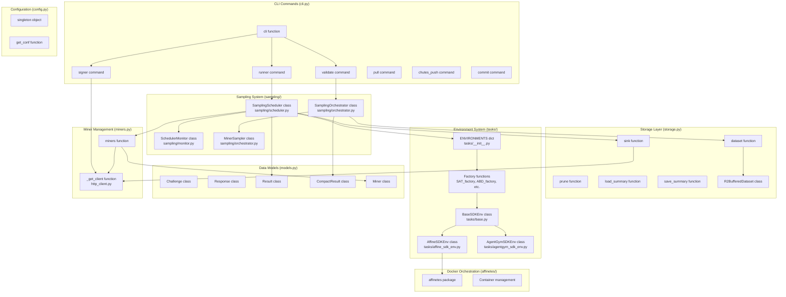
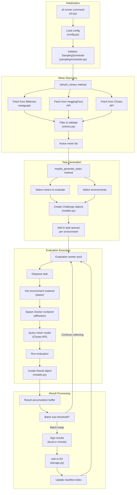
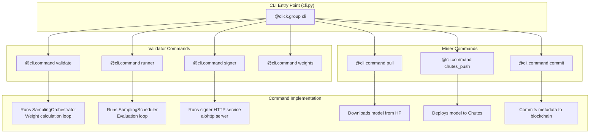
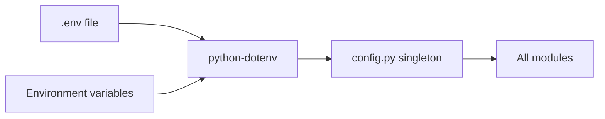
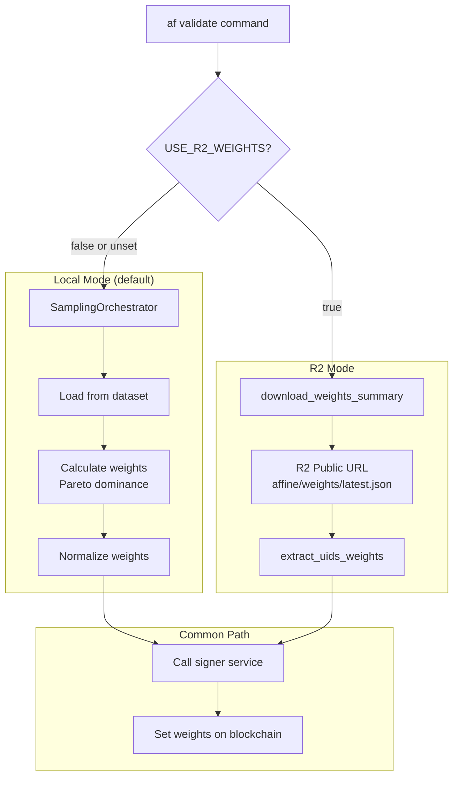

import CollapsibleAside from '../../../components/CollapsibleAside.astro';
import SourceLink from '../../../components/SourceLink.astro';
import Table from '../../../components/Table.astro';

<CollapsibleAside title="Relevant Source Files">
  <SourceLink text=".gitignore" href="https://github.com/AffineFoundation/affine-cortex/blob/main/.gitignore" />
  <SourceLink text="affine/utils/errors.py" href="https://github.com/AffineFoundation/affine-cortex/blob/main/affine/utils/errors.py" />
  <SourceLink text="docker-compose.local.yml" href="https://github.com/AffineFoundation/affine-cortex/blob/main/docker-compose.local.yml" />
  <SourceLink text="docker-compose.yml" href="https://github.com/AffineFoundation/affine-cortex/blob/main/docker-compose.yml" />
  <SourceLink text="pyproject.toml" href="https://github.com/AffineFoundation/affine-cortex/blob/main/pyproject.toml" />
  <SourceLink text="tests/test_error_handling.py" href="https://github.com/AffineFoundation/affine-cortex/blob/main/tests/test_error_handling.py" />
  <SourceLink text="uv.lock" href="https://github.com/AffineFoundation/affine-cortex/blob/main/uv.lock" />
</CollapsibleAside>

This document provides technical guidance for developers who want to extend, modify, or contribute to the Affine codebase. It covers the code organization, architectural patterns, and key development concepts needed to understand and work with the system effectively.

**Scope**: This page focuses on the overall structure and organization of the codebase. For environment setup instructions, see [Development Environment](/subnets/developer-guide/development-environment#11.1). For detailed architectural patterns and design decisions, see [Code Architecture Deep Dive](#11.2). For utility function documentation, see [Utilities & Helper Functions](#11.3).

## Codebase Structure Overview

The Affine repository is organized as a Python package with CLI capabilities, designed to support three primary use cases:
1. **Validator operations** - Running evaluation loops and setting weights
2. **Miner operations** - Deploying models and committing to the blockchain  
3. **SDK usage** - Programmatic access to evaluation environments and data

The codebase follows a modular architecture where each major system is encapsulated in its own module:

```
affine/
├── __init__.py           # Public API exports
├── cli.py                # Click-based command-line interface
├── config.py             # Configuration singleton and environment variables
├── setup.py              # Logging configuration
├── models.py             # Data models (Challenge, Response, Result, Miner)
├── http_client.py        # Shared HTTP client with connection pooling
├── miners.py             # Miner discovery and filtering
├── storage.py            # R2 storage layer (dataset, sink, prune)
├── tasks/                # Environment system
│   ├── __init__.py       # Environment registry and factories
│   ├── base.py           # BaseSDKEnv abstract class
│   ├── affine_sdk_env.py # Affine environments (SAT, ABD, DED)
│   └── agentgym_sdk_env.py # AgentGym environments
├── sampling/             # Validator sampling system
│   ├── scheduler.py      # SamplingScheduler main orchestrator
│   ├── monitor.py        # SchedulerMonitor metrics API
│   └── orchestrator.py   # SamplingOrchestrator weight calculation
├── affinetes/            # Docker orchestration library
├── validate_from_r2.py   # R2 weights mode validator
└── signer.py             # HTTP signing service
```

**Sources**: [affine/__init__.py:1-62]()

## System-to-Code Mapping

The following diagram bridges the conceptual systems described in the architecture documentation to their concrete implementations in the codebase:



**Sources**: [affine/__init__.py:1-62](), [affine/cli.py](), [affine/sampling/scheduler.py](), [affine/storage.py](), [affine/tasks/__init__.py]()

## Package Exports and Public API

The `affine` package exports a carefully curated public API through [affine/__init__.py:1-62](). Understanding these exports is crucial for both SDK users and contributors:

### Core Categories

<Table>

| Category | Exports | Purpose |
|----------|---------|---------|
| **Logging** | `logger`, `setup_logging`, `info`, `debug`, `trace` | Structured logging configuration |
| **Data Models** | `Challenge`, `Response`, `Miner`, `Result` | Core data structures used throughout the system |
| **HTTP Client** | `_get_client` | Shared connection-pooled HTTP client |
| **Miner Discovery** | `miners` | Function to fetch and filter miner metadata |
| **CLI** | `cli` | Main Click-based command group |
| **Storage** | `dataset`, `sink`, `prune`, `load_summary`, `save_summary` | R2 storage operations |
| **Storage Constants** | `FOLDER`, `BUCKET`, `ACCESS`, `SECRET`, `ENDPOINT`, `PUBLIC_READ`, `R2_PUBLIC_BASE` | Configuration values for R2 access |
| **Environment Factories** | `SAT`, `ABD`, `DED`, `ALFWORLD`, `WEBSHOP`, `BABYAI`, `SCIWORLD`, `TEXTCRAFT` | Factory functions for creating evaluation environments |

</Table>


### Public API Usage Pattern

The package is designed to support three import styles:

```python
# SDK-style import for evaluations
import affine as af
env = af.SAT()
results = await env.evaluate(miner_uid=123)

# Direct imports for specific functionality
from affine import miners, dataset
miner_list = await miners()
data = await dataset(blocks=range(1000, 2000))

# CLI access
from affine import cli
# Invoked via: af validate, af runner, etc.
```

**Sources**: [affine/__init__.py:1-62]()

## Module Responsibilities

### Core Modules

#### `affine/config.py` - Configuration Singleton
Manages environment variable loading and provides a global configuration object accessed via `singleton` or `get_conf()`. All configuration values are loaded at startup and cached.

**Key Patterns**:
- Uses a singleton pattern for global state
- Reads from `.env` files via `python-dotenv`
- Provides typed access to configuration values

#### `affine/setup.py` - Logging Infrastructure
Configures structured logging with multiple severity levels (`trace`, `debug`, `info`, `warning`, `error`). Exports convenience functions for logging at different levels.

**Key Patterns**:
- Uses `loguru` for structured logging
- Provides module-level logger instance
- Supports log level configuration via environment variables

#### `affine/models.py` - Data Models
Defines Pydantic models for the core data structures:
- `Challenge`: Task definition sent to miners
- `Response`: Model output from miner inference
- `Result`: Complete evaluation result with scoring
- `CompactResult`: Storage-optimized result format
- `Miner`: Miner metadata from blockchain and external APIs

**Key Patterns**:
- Uses Pydantic for validation and serialization
- Includes custom validators for data integrity
- Supports both full and compact representations

#### `affine/http_client.py` - Shared HTTP Client
Provides connection-pooled HTTP client via `_get_client()`. Used by all modules that make external API calls to Chutes, HuggingFace, and R2.

**Key Patterns**:
- Implements connection pooling for efficiency
- Returns singleton `aiohttp.ClientSession` instance
- Manages connection lifecycle automatically

#### `affine/miners.py` - Miner Discovery
Implements the `miners()` function that fetches miner metadata from Bittensor blockchain, HuggingFace, and Chutes, then filters based on validity and blacklist rules.

**Key Patterns**:
- Async data fetching with caching
- Multi-source data aggregation (blockchain + APIs)
- Filtering pipeline for miner validation

**Sources**: [affine/__init__.py:1-62](), [affine/config.py](), [affine/setup.py](), [affine/models.py](), [affine/http_client.py](), [affine/miners.py]()

### Sampling System (`affine/sampling/`)

The sampling system implements the validator's core evaluation loop:

#### `sampling/scheduler.py` - Task Orchestration
Contains `SamplingScheduler`, the main orchestrator that:
- Refreshes miner list periodically
- Generates evaluation tasks across environments
- Manages task queues per environment
- Coordinates parallel evaluation workers
- Batches results and sinks them to R2 storage

**Key Methods**:
- `refresh_miners()`: Updates the active miner list
- `maybe_generate_tasks()`: Creates new evaluation tasks
- `run_next_evaluation()`: Executes one evaluation cycle
- `run()`: Main event loop

#### `sampling/monitor.py` - Metrics API
Implements `SchedulerMonitor`, a FastAPI service on port 8765 that exposes:
- `/status`: Overall scheduler health
- `/status/miners`: Active miners and their states
- `/status/queue`: Task queue depths per environment
- `/status/workers`: Worker pool utilization

#### `sampling/orchestrator.py` - Weight Calculation
Contains `SamplingOrchestrator` and `MinerSampler` for computing weights:
- Loads historical results from R2
- Implements Pareto dominance comparison
- Applies rank decay for older results
- Normalizes weights to sum to 1.0

**Key Classes**:
- `SamplingOrchestrator`: High-level weight calculation pipeline
- `MinerSampler`: Per-miner score tracking and comparison

**Sources**: [affine/sampling/scheduler.py](), [affine/sampling/monitor.py](), [affine/sampling/orchestrator.py]()

### Storage System (`affine/storage.py`)

Implements the R2 storage layer with these key functions:

#### `dataset(blocks, environments) -> AsyncIterator[Result]`
Loads historical evaluation results from R2 storage. Supports:
- Block range filtering
- Environment filtering
- Buffered reading for efficiency
- Automatic decompression of block files

#### `sink(results, signer_url=None)`
Uploads evaluation results to R2 storage:
- Signs results locally or via remote signer
- Batches uploads for efficiency
- Maintains block-based sharding
- Updates index manifests

#### `prune(blocks, force=False)`
Removes old result blocks from R2 storage (admin operation).

#### `load_summary(block) -> dict`
Loads weight summary for a specific block from R2.

#### `save_summary(summary, block)`
Saves weight summary to R2 storage.

**Implementation Details**:
- Uses `R2BufferedDataset` for efficient streaming reads
- Supports both public (R2.dev) and authenticated (S3 API) access modes
- Implements client-side caching for index manifests
- Uses compression (gzip) for storage efficiency

**Sources**: [affine/storage.py]()

### Environment System (`affine/tasks/`)

The environment system provides a plugin architecture for evaluation tasks:

#### `tasks/__init__.py` - Environment Registry
Maintains the `ENVIRONMENTS` dictionary mapping environment names to their implementations. Exports factory functions for easy instantiation.

#### `tasks/base.py` - Abstract Base Class
Defines `BaseSDKEnv` with the evaluation interface:
- `evaluate(miner, model, base_url)`: Single miner evaluation
- `evaluate_batch(miners_dict)`: Batch evaluation
- `get_available_models()`: List deployed models
- Abstract methods for subclasses to implement

#### `tasks/affine_sdk_env.py` - Affine Environments
Implements three Affine-specific environments:
- **SAT**: Solver for SAT boolean satisfiability problems
- **ABD**: Abductive reasoning tasks
- **DED**: Deductive reasoning tasks

#### `tasks/agentgym_sdk_env.py` - AgentGym Environments
Implements five AgentGym environments:
- **ALFWORLD**: Interactive household tasks
- **WEBSHOP**: E-commerce navigation
- **BABYAI**: Grid-world instruction following
- **SCIWORLD**: Science simulation
- **TEXTCRAFT**: Text-based crafting game

**Key Patterns**:
- Registry pattern for environment discovery
- Factory functions for instantiation
- Async evaluation for parallel execution
- Docker integration via `affinetes` library

**Sources**: [affine/tasks/__init__.py](), [affine/tasks/base.py](), [affine/tasks/affine_sdk_env.py](), [affine/tasks/agentgym_sdk_env.py]()

## Data Flow Architecture

This diagram shows how data flows through the major subsystems during a typical validator evaluation cycle:



**Sources**: [affine/sampling/scheduler.py](), [affine/miners.py](), [affine/storage.py](), [affine/tasks/]()

## Development Patterns and Conventions

### Async/Await Pattern
The codebase is predominantly asynchronous, using `asyncio` for concurrent operations:
- All I/O operations (HTTP, file, storage) use async
- CLI commands use `asyncio.run()` for execution
- Worker pools use `asyncio.create_task()` for parallelism

### Singleton Pattern
Global state is managed through singletons:
- `affine.config.singleton`: Configuration object
- `affine.http_client._get_client()`: HTTP client session
- Environment registry: `affine.tasks.ENVIRONMENTS`

### Factory Pattern
Environments use factory functions for instantiation:
- `SAT_factory()`, `ABD_factory()`, etc. in [affine/__init__.py:50-61]()
- Allows dependency injection and configuration
- Enables testing with mock environments

### Registry Pattern
The environment system uses a registry for dynamic discovery:
- `ENVIRONMENTS` dict maps names to implementations
- `list_available_environments()` provides introspection
- Supports adding new environments without modifying core code

### Pydantic Data Models
All data structures use Pydantic for:
- Runtime validation
- JSON serialization/deserialization
- Schema documentation
- Type safety

### Connection Pooling
External API calls use connection pooling:
- Single `aiohttp.ClientSession` shared across modules
- Reduces connection overhead
- Improves performance for high-frequency operations

### Error Handling Convention
The codebase follows these error handling patterns:
- Use `try/except` at external API boundaries
- Log errors with appropriate severity
- Return `None` or default values for non-critical failures
- Raise exceptions for critical failures that should halt execution

**Sources**: [affine/__init__.py:1-62](), [affine/config.py](), [affine/http_client.py](), [affine/tasks/__init__.py](), [affine/models.py]()

## CLI Architecture

The CLI is built using Click and organized as a command group:



**Key Design Decisions**:
- Each command is a separate `@cli.command()` function
- Commands use `asyncio.run()` to execute async logic
- Options use Click's parameter decorators for validation
- Configuration loaded from environment variables via `config.py`

**Sources**: [affine/cli.py]()

## Configuration System

Configuration is managed through environment variables loaded via `python-dotenv`:

<Table>

| Variable Category | Examples | Module |
|------------------|----------|--------|
| **Bittensor** | `BT_WALLET_COLD`, `BT_WALLET_HOT`, `SUBTENSOR_ENDPOINT` | `config.py` |
| **External APIs** | `CHUTES_API_KEY`, `HF_USER`, `HF_TOKEN` | `config.py`, `miners.py` |
| **R2 Storage** | `R2_FOLDER`, `R2_BUCKET_ID`, `R2_WRITE_ACCESS_KEY_ID` | `storage.py` |
| **Validator** | `AFFINE_MINER_BLACKLIST`, `AFFINETES_HOSTS`, `USE_R2_WEIGHTS` | `config.py`, `sampling/` |
| **Miner** | `CHUTE_USER` | CLI commands |

</Table>


### Configuration Flow



**Best Practices**:
- Never commit `.env` files (use `.env.example` as template)
- Use `get_conf()` function to access configuration
- Validate required config at startup
- Provide sensible defaults where possible

**Sources**: [.env.example:1-99](), [affine/config.py]()

## Weight Calculation Modes

Affine supports two modes for weight calculation:

### Local Computation Mode (Default)
Uses `SamplingOrchestrator` to compute weights from scratch:
1. Load historical results via `dataset()`
2. Calculate per-miner scores using Pareto dominance
3. Apply rank decay for temporal weighting
4. Normalize weights to sum to 1.0
5. Call signer to set weights on blockchain

**Activation**: Default behavior when `USE_R2_WEIGHTS` is not set or is `"false"`

### R2 Weights Mode
Downloads pre-computed weights from official R2 storage:
1. Fetch `latest.json` from R2 public URL
2. Extract UIDs and weights from summary
3. Call signer to set weights on blockchain

**Activation**: Set `USE_R2_WEIGHTS="true"` in environment

**Implementation**: [affine/validate_from_r2.py:1-132]()



**Sources**: [affine/validate_from_r2.py:1-132](), [.env.example:91-99](), [affine/sampling/orchestrator.py]()

## Testing and Type Checking

The codebase uses several tools for quality assurance:

### Type Checking
- Uses Python type hints throughout
- Can be validated with `mypy` or `pyright`
- Critical for async code correctness

### Testing Structure
- Test files are excluded from version control (see [.gitignore:3]())
- Tests can be placed in `tests/` directory
- Use `pytest` for test execution
- Mock external APIs (Chutes, HuggingFace, R2) for unit tests

### Code Quality Tools
- **Linting**: Use `ruff` or `flake8` for style checking
- **Formatting**: Use `black` for consistent code formatting
- **Import sorting**: Use `isort` for organized imports

**Sources**: [.gitignore:1-147]()

## Next Steps

For developers new to the codebase:

1. **Set up your environment**: See [Development Environment](/subnets/developer-guide/development-environment#11.1) for detailed setup instructions
2. **Study the architecture**: Review [Code Architecture Deep Dive](#11.2) for design patterns and rationale
3. **Explore utilities**: Check [Utilities & Helper Functions](#11.3) for reusable components
4. **Understand integrations**: Read [External Integrations](/subnets/developer-guide/external-integrations#11.4) for API usage patterns

For specific development tasks:
- **Adding a new environment**: See [Creating Custom Environments](#7.4)
- **Modifying weight calculation**: See [Weight Calculation System](/subnets/for-validators/weight-calculation-system#5.4)
- **Extending the CLI**: See [CLI Reference](/subnets/cli-reference#9)
- **Working with storage**: See [Storage & Data Management](#8)
