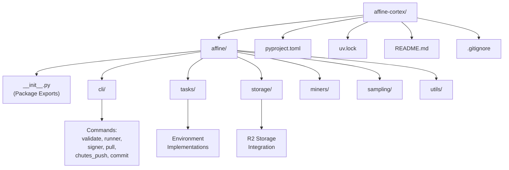
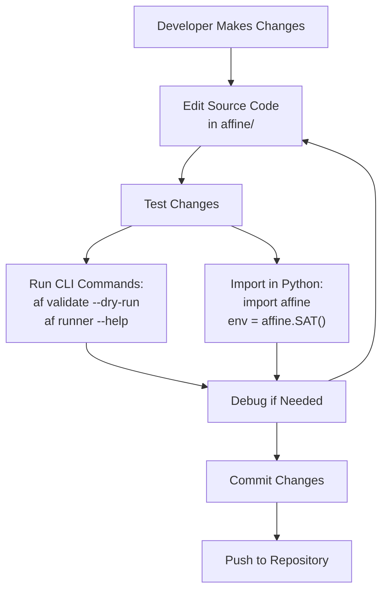

import CollapsibleAside from '../../../../components/CollapsibleAside.astro';
import SourceLink from '../../../../components/SourceLink.astro';
import Table from '../../../../components/Table.astro';

<CollapsibleAside title="Relevant Source Files">
  <SourceLink text="docker-compose.local.yml" href="https://github.com/AffineFoundation/affine-cortex/blob/main/docker-compose.local.yml" />
  <SourceLink text="docker-compose.yml" href="https://github.com/AffineFoundation/affine-cortex/blob/main/docker-compose.yml" />
  <SourceLink text="pyproject.toml" href="https://github.com/AffineFoundation/affine-cortex/blob/main/pyproject.toml" />
  <SourceLink text="uv.lock" href="https://github.com/AffineFoundation/affine-cortex/blob/main/uv.lock" />
</CollapsibleAside>

This page documents how to set up a local development environment for contributing to the Affine codebase. It covers Python requirements, dependency management with `uv`, project structure, and development workflow.

For information about deploying Affine in production, see [Docker Deployment](/subnets/deployment-guide/docker-deployment#10.1). For local testing of validator/miner workflows, see [Local Development Setup](/subnets/deployment-guide/local-development-setup#10.2).

---

## Prerequisites

### Python Version Requirements

Affine requires **Python 3.11 or higher**. This requirement is enforced in [pyproject.toml:33]():

```toml
requires-python = ">=3.11"
```

The lock file [uv.lock:4-7]() indicates resolution for Python 3.11 and 3.12:

```
resolution-markers = [
    "python_full_version >= '3.12'",
    "python_full_version < '3.12'",
]
```

### System Requirements

Development requires:
- A Unix-like environment (Linux or macOS recommended)
- Docker (for running evaluation environments locally)
- Git (for version control)
- Sufficient disk space for caching Docker images and evaluation results

**Sources:** [pyproject.toml:33](), [uv.lock:4-7]()

---

## Dependency Management with uv

Affine uses **uv** as its dependency manager and build tool. `uv` is a fast, Rust-based package manager that replaces traditional tools like `pip` and `virtualenv`.

### Why uv?

- **Speed**: Significantly faster than pip for resolving and installing dependencies
- **Lock file support**: Reproducible builds via `uv.lock`
- **Built-in virtual environment management**
- **Drop-in replacement for pip/virtualenv workflows**

### Installing uv

Install `uv` using the official installer:

```bash
curl -LsSf https://astral.sh/uv/install.sh | sh
```

Or via pip:

```bash
pip install uv
```

### Installing Project Dependencies

Clone the repository and install all dependencies in editable mode:

```bash
git clone https://github.com/AffineFoundation/affine-cortex.git
cd affine-cortex
uv sync
```

The `uv sync` command:
1. Creates a virtual environment in `.venv/`
2. Installs all dependencies from `uv.lock`
3. Installs the `affine` package in editable mode

### Activating the Virtual Environment

```bash
source .venv/bin/activate
```

### Lock File Management

The lock file [uv.lock]() pins exact versions of all transitive dependencies. When modifying dependencies in [pyproject.toml](), regenerate the lock file:

```bash
uv lock
```

**Sources:** [pyproject.toml:1-47](), [uv.lock:1-8]()

---

## Project Structure

### Package Layout



The codebase uses the `affine` package directory for all source code. The package is configured for discovery in [pyproject.toml:42-43]():

```toml
[tool.setuptools.packages.find]
include = ["affine"]
```

### Entry Point Configuration

The CLI entry point `af` is defined in [pyproject.toml:35-36]():

```toml
[project.scripts]
af = "affine:cli"
```

This maps the `af` command to the `cli` function exported from the `affine` package.

**Sources:** [pyproject.toml:35-36](), [pyproject.toml:42-43]()

---

## Core Dependencies

### Major Production Dependencies

The following diagram shows the primary dependencies and their roles:

```mermaid
graph TB
    subgraph "Network Layer"
        AIOHTTP["aiohttp<br/>Async HTTP Client/Server"]
        HTTPX["httpx<br/>Async HTTP Client"]
    end
    
    subgraph "Blockchain Integration"
        BT["bittensor<br/>Network Integration"]
        BTCLI["bittensor-cli<br/>CLI Utilities"]
        SUBSTRATE["async-substrate-interface<br/>Substrate RPC"]
    end
    
    subgraph "Storage"
        BOTO3["boto3<br/>S3/R2 Client"]
        AIOBOTOCORE["aiobotocore<br/>Async S3/R2"]
        AIOFILES["aiofiles<br/>Async File I/O"]
        REDIS["redis<br/>Caching Layer"]
    end
    
    subgraph "Data Processing"
        NUMPY["numpy<br/>Numerical Operations"]
        SCIPY["scipy<br/>Pareto Calculations"]
        DATASETS["datasets<br/>HuggingFace Data"]
        ORJSON["orjson<br/>Fast JSON"]
    end
    
    subgraph "Environment Orchestration"
        AFFINETES["affinetes<br/>Docker Management"]
    end
    
    subgraph "CLI & UI"
        CLICK["click<br/>CLI Framework"]
        ALIVE["alive-progress<br/>Progress Bars"]
        TABULATE["tabulate<br/>Table Formatting"]
    end
    
    subgraph "Validation & Config"
        PYDANTIC["pydantic<br/>Data Validation"]
        DOTENV["python-dotenv<br/>Config Loading"]
    end
    
    subgraph "Monitoring"
        PROMETHEUS["prometheus-client<br/>Metrics Export"]
    end
    
    AFFINE["affine package"]
    
    AFFINE --> AIOHTTP
    AFFINE --> HTTPX
    AFFINE --> BT
    AFFINE --> BTCLI
    AFFINE --> SUBSTRATE
    AFFINE --> BOTO3
    AFFINE --> AIOBOTOCORE
    AFFINE --> AIOFILES
    AFFINE --> REDIS
    AFFINE --> NUMPY
    AFFINE --> SCIPY
    AFFINE --> DATASETS
    AFFINE --> ORJSON
    AFFINE --> AFFINETES
    AFFINE --> CLICK
    AFFINE --> ALIVE
    AFFINE --> TABULATE
    AFFINE --> PYDANTIC
    AFFINE --> DOTENV
    AFFINE --> PROMETHEUS
```



### Key Dependencies Explained

<Table>

| Dependency | Version Constraint | Purpose |
|------------|-------------------|---------|
| `bittensor` | (latest) | Core blockchain integration for subnet 120 |
| `bittensor-cli` | (latest) | CLI utilities for wallet and network operations |
| `async-substrate-interface` | `==1.5.9` | Pinned version for Substrate blockchain RPC |
| `aiohttp` | `>=3.10.11` | HTTP server for monitoring API and async HTTP client |
| `httpx` | `>=0.27.0` | Modern async HTTP client with connection pooling |
| `boto3` / `aiobotocore` | `>=1.34` / `>=2.23.0` | Sync/async Cloudflare R2 access |
| `redis` | `==5.*` | Caching layer for miner metadata |
| `pydantic` | `>=2.6` | Data validation and serialization |
| `numpy` | `>=1.24` | Numerical operations for scoring |
| `scipy` | `>=1.11.0` | Pareto dominance calculations |
| `click` | `>=8.0.0` | CLI framework for `af` commands |
| `prometheus-client` | `>=0.21.0` | Metrics export for monitoring |
| `affinetes` | (latest) | Docker container orchestration for evaluation environments |

</Table>


**Sources:** [pyproject.toml:6-31](), [uv.lock:1-600]()

---

## Development Workflow

### Installing in Editable Mode

The project is configured to install in editable mode via [pyproject.toml:45-46]():

```toml
[tool.uv.sources]
affine = { path = ".", editable = true }
```

When you run `uv sync`, the package is installed as an editable installation, meaning changes to the source code are immediately reflected without reinstalling.

### Running Commands Locally

After activating the virtual environment, the `af` CLI is available:

```bash
# Activate virtual environment
source .venv/bin/activate

# Run CLI commands
af --help
af validate --help
af runner --help
```

### Development Workflow Diagram



**Sources:** [pyproject.toml:35-36](), [pyproject.toml:45-46]()

---

## Testing

While the repository includes a `tests/` directory, it is excluded from version control via [.gitignore:3]():

```
tests/
```

### Running Tests Locally

If you create tests locally:

```bash
# Create tests directory
mkdir -p tests

# Write test files
# tests/test_storage.py
# tests/test_sampling.py
# etc.

# Run with pytest (if configured)
pytest tests/
```

### Manual Testing

For manual testing of components:

**Testing Storage Layer:**
```python
import asyncio
from affine.storage import dataset

async def test_storage():
    async for result in dataset(start_block=1000, end_block=1100):
        print(f"Block {result.block_number}: {result.miner_uid}")

asyncio.run(test_storage())
```

**Testing Environment Evaluation:**
```python
import affine

# Create environment
env = affine.SAT()

# Evaluate a model
result = await env.evaluate(
    model="TheBloke/Llama-2-7B-GGUF",
    base_url="https://api.example.com/v1",
    max_samples=10
)

print(f"Score: {result.score}")
```

**Sources:** [.gitignore:3]()

---

## Type Checking

The project uses type hints throughout the codebase. While a `mypy` configuration is not explicitly provided, type checking can be enabled with:

```bash
# Install mypy
uv add --dev mypy

# Run type checker
mypy affine/
```

### Recommended mypy Configuration

Create `mypy.ini` in the project root:

```ini
[mypy]
python_version = 3.11
warn_return_any = True
warn_unused_configs = True
disallow_untyped_defs = False
disallow_incomplete_defs = False
check_untyped_defs = True
disallow_untyped_decorators = False
no_implicit_optional = True
warn_redundant_casts = True
warn_unused_ignores = True
warn_no_return = True

[mypy-bittensor.*]
ignore_missing_imports = True

[mypy-affinetes.*]
ignore_missing_imports = True
```

**Sources:** [pyproject.toml:33]()

---

## Code Quality Tools

### Formatting

Use `black` or `ruff` for code formatting:

```bash
# Install formatter
uv add --dev ruff

# Format code
ruff format affine/
```

### Linting

```bash
# Run linter
ruff check affine/
```

### Pre-commit Hooks

Consider setting up pre-commit hooks to enforce code quality:

```yaml
# .pre-commit-config.yaml
repos:
  - repo: https://github.com/astral-sh/ruff-pre-commit
    rev: v0.1.0
    hooks:
      - id: ruff
        args: [--fix]
      - id: ruff-format
```

---

## Environment Variables

Development requires certain environment variables. Create a `.env` file in the project root:

```bash
# .env (excluded by .gitignore)
CHUTES_API_KEY=your_key_here
HF_TOKEN=your_huggingface_token
R2_ENDPOINT_URL=https://your-r2-endpoint
R2_ACCESS_KEY_ID=your_access_key
R2_SECRET_ACCESS_KEY=your_secret_key
```

The `.env` file is excluded from version control via [.gitignore:114]():

```
.env
```

**Sources:** [.gitignore:114]()

---

## Excluded Files

The following are excluded from version control and should not be committed:

<Table>

| Pattern | Description |
|---------|-------------|
| `__pycache__/`, `*.pyc` | Python bytecode |
| `*.egg-info/`, `dist/`, `build/` | Build artifacts |
| `.venv/`, `venv/`, `env/` | Virtual environments |
| `.env` | Environment variables |
| `results/`, `tmp/` | Runtime data |
| `notebooks/` | Jupyter notebooks |
| `tests/` | Test files |
| `.mypy_cache/`, `.pytest_cache/` | Tool caches |

</Table>


**Sources:** [.gitignore:1-147]()

---

## Quick Reference: Development Commands

```bash
# Initial setup
git clone https://github.com/AffineFoundation/affine-cortex.git
cd affine-cortex
uv sync
source .venv/bin/activate

# Run CLI
af --help
af validate --dry-run
af runner --help

# Update dependencies
uv lock
uv sync

# Add a new dependency
uv add package-name

# Add a development dependency
uv add --dev pytest
```

**Sources:** [pyproject.toml:1-47](), [uv.lock:1-8]()
