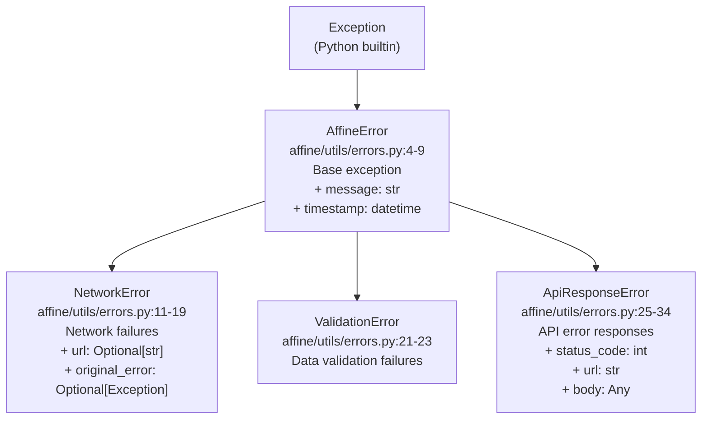
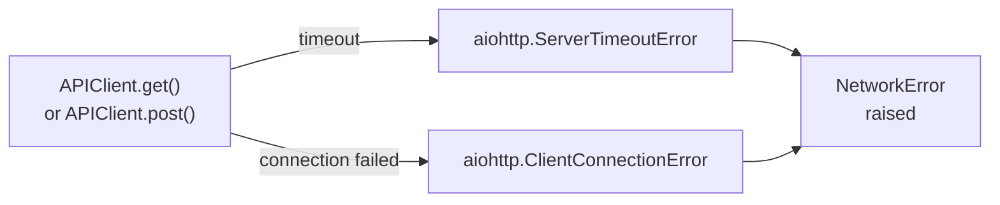
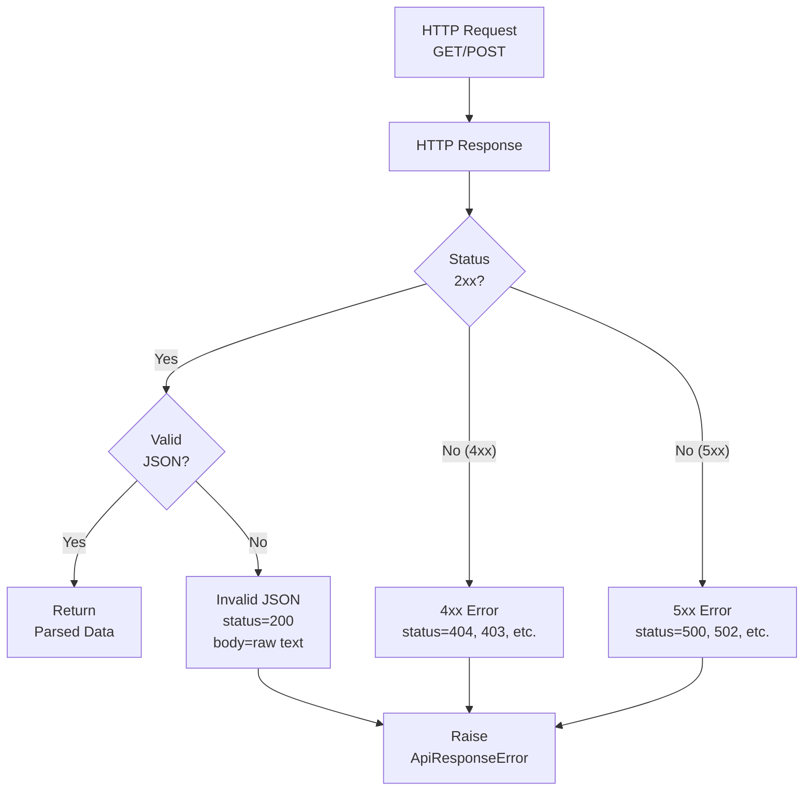
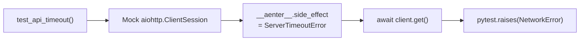
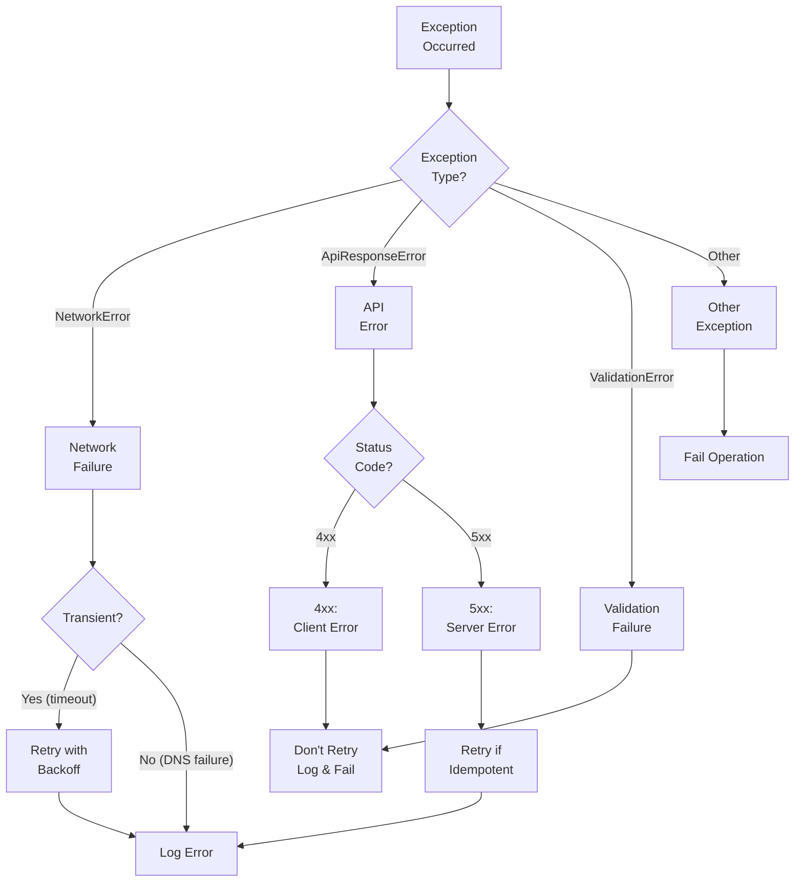

import CollapsibleAside from '../../../../components/CollapsibleAside.astro';
import SourceLink from '../../../../components/SourceLink.astro';
import Table from '../../../../components/Table.astro';

<CollapsibleAside title="Relevant Source Files">
  <SourceLink text=".gitignore" href="https://github.com/AffineFoundation/affine-cortex/blob/main/.gitignore" />
  <SourceLink text="affine/utils/errors.py" href="https://github.com/AffineFoundation/affine-cortex/blob/main/affine/utils/errors.py" />
  <SourceLink text="tests/test_error_handling.py" href="https://github.com/AffineFoundation/affine-cortex/blob/main/tests/test_error_handling.py" />
</CollapsibleAside>

This page documents the error handling system in Affine Cortex, including the custom exception hierarchy, error types, their attributes, and recommended handling patterns. The error system provides structured exception handling for network operations, API interactions, and data validation throughout the codebase.

For information about external API integration error handling, see [External Integrations](/subnets/developer-guide/external-integrations#12.4). For general code architecture patterns, see [Code Architecture Overview](/subnets/developer-guide/code-architecture-overview#12.2).

---

## Error Class Hierarchy

The Affine error system implements a hierarchical exception structure rooted in `AffineError`, with specialized subclasses for different failure scenarios.



**Sources:** [affine/utils/errors.py:1-35]()

---

## Base Error Class: AffineError

All custom exceptions in Affine inherit from `AffineError`, which provides common functionality including automatic timestamping.

### Class Definition

The `AffineError` base class is defined at [affine/utils/errors.py:4-9]() with the following structure:

<Table>

| Attribute | Type | Description |
|-----------|------|-------------|
| `message` | `str` | Human-readable error description |
| `timestamp` | `datetime` | Automatic timestamp of exception creation |

</Table>


### Usage Pattern

```python
# Direct usage (rare - typically use subclasses)
raise AffineError("Generic error message")

# Catching any Affine error
try:
    # Operations
    pass
except AffineError as e:
    logger.error(f"Affine error at {e.timestamp}: {e.message}")
```

**Sources:** [affine/utils/errors.py:4-9]()

---

## NetworkError

`NetworkError` is raised when network operations fail due to connectivity issues, timeouts, or connection errors. This error type preserves the original exception and URL context for debugging.

### Attributes

<Table>

| Attribute | Type | Description |
|-----------|------|-------------|
| `message` | `str` | Error description |
| `url` | `Optional[str]` | The URL that failed (if applicable) |
| `original_error` | `Optional[Exception]` | The underlying exception (e.g., `aiohttp.ServerTimeoutError`) |
| `timestamp` | `datetime` | Inherited from `AffineError` |

</Table>


### String Representation

The `__str__` method at [affine/utils/errors.py:18-19]() formats the error as:
```
NetworkError(url=<url>): <message>
```

### Common Scenarios



### Test Example

The test suite demonstrates NetworkError handling for timeout scenarios at [tests/test_error_handling.py:8-20]():

```python
# Mock timeout scenario
mock_session.get.return_value.__aenter__.side_effect = aiohttp.ServerTimeoutError("Timeout")

# Expected behavior
with pytest.raises(NetworkError) as exc:
    await client.get("/timeout")
assert "Timeout" in str(exc.value)
```

**Sources:** [affine/utils/errors.py:11-19](), [tests/test_error_handling.py:8-20]()

---

## ValidationError

`ValidationError` is raised when data validation fails, such as invalid configuration, malformed input, or constraint violations.

### Class Definition

Defined at [affine/utils/errors.py:21-23]() as a simple subclass with no additional attributes beyond those inherited from `AffineError`.

### Usage Context

```python
# Example validation scenario
if not config.get("required_field"):
    raise ValidationError("Missing required field: required_field")

# Model validation
if model_architecture != "Qwen3-32B":
    raise ValidationError(f"Invalid architecture: {model_architecture}")
```

### Common Use Cases

<Table>

| Validation Type | Example |
|----------------|---------|
| Configuration | Missing required environment variables |
| Model Requirements | Invalid architecture or naming conventions |
| Data Constraints | Out-of-range values or type mismatches |
| Schema Compliance | Missing required fields in database records |

</Table>


**Sources:** [affine/utils/errors.py:21-23]()

---

## ApiResponseError

`ApiResponseError` is raised when the API returns an error response (non-2xx status codes) or when response parsing fails. This error type captures comprehensive response metadata for debugging.

### Attributes

<Table>

| Attribute | Type | Description |
|-----------|------|-------------|
| `message` | `str` | Error description |
| `status_code` | `int` | HTTP status code (e.g., 404, 500) |
| `url` | `str` | The endpoint URL that returned the error |
| `body` | `Any` | Response body (raw text or parsed JSON) |
| `timestamp` | `datetime` | Inherited from `AffineError` |

</Table>


### String Representation

The `__str__` method at [affine/utils/errors.py:33-34]() formats the error as:
```
ApiResponseError(status=<code>, url=<url>): <message>
```

### Error Response Flow



### Test Examples

#### 404 Not Found
Test at [tests/test_error_handling.py:46-63]():
```python
mock_response.status = 404
mock_response.text.return_value = "Not Found"

with pytest.raises(ApiResponseError) as exc:
    await client.get("/404")

assert exc.value.status_code == 404
assert "Not Found" in str(exc.value)
```

#### 500 Internal Server Error
Test at [tests/test_error_handling.py:66-84]():
```python
mock_response.status = 500
mock_response.text.return_value = "Internal Server Error"

with pytest.raises(ApiResponseError) as exc:
    await client.post("/500")

assert exc.value.status_code == 500
```

#### Invalid JSON Response
Test at [tests/test_error_handling.py:23-43]():
```python
mock_response.status = 200
mock_response.json.side_effect = ValueError("Bad JSON")
mock_response.text.return_value = "<html>Not JSON</html>"

with pytest.raises(ApiResponseError) as exc:
    await client.get("/bad-json")

assert "Invalid JSON" in str(exc.value)
assert exc.value.status_code == 200
assert "<html>" in exc.value.body
```

**Sources:** [affine/utils/errors.py:25-34](), [tests/test_error_handling.py:23-84]()

---

## Error Handling Patterns

### Pattern 1: Specific Exception Handling

Handle specific error types when different recovery strategies are needed:

```python
try:
    result = await api_client.get("/miners/123")
except NetworkError as e:
    logger.warning(f"Network failure for {e.url}, retrying...")
    # Retry logic
except ApiResponseError as e:
    if e.status_code == 404:
        logger.info("Miner not found, skipping...")
    elif e.status_code >= 500:
        logger.error(f"Server error: {e.status_code}")
    # No retry for client errors
except ValidationError as e:
    logger.error(f"Invalid data: {e.message}")
    # Don't retry validation errors
```

### Pattern 2: Generic Affine Error Handling

Catch all Affine errors when uniform handling is sufficient:

```python
try:
    process_task()
except AffineError as e:
    logger.error(f"Affine operation failed at {e.timestamp}: {e.message}")
    metrics.increment("affine_errors")
```

### Pattern 3: Error Context Preservation

Preserve original exceptions when wrapping:

```python
try:
    response = await session.get(url, timeout=30)
except aiohttp.ServerTimeoutError as e:
    raise NetworkError(
        message=f"Request timed out after 30s",
        url=url,
        original_error=e
    )
except aiohttp.ClientConnectionError as e:
    raise NetworkError(
        message=f"Connection failed: {e}",
        url=url,
        original_error=e
    )
```

**Sources:** [affine/utils/errors.py:1-35](), [tests/test_error_handling.py:1-85]()

---

## Testing Error Conditions

The test suite at [tests/test_error_handling.py]() demonstrates comprehensive error testing patterns using `pytest` and mocking.

### Mocking Network Failures



### Testing Strategy Summary

<Table>

| Test Case | Mock Strategy | Assertion |
|-----------|---------------|-----------|
| Timeout ([8-20]()) | `side_effect = ServerTimeoutError` | `NetworkError` raised |
| Bad JSON ([23-43]()) | `json.side_effect = ValueError` | `ApiResponseError` with body |
| 404 Error ([46-63]()) | `status = 404` | `status_code == 404` |
| 500 Error ([66-84]()) | `status = 500` | `status_code == 500` |

</Table>


### Mock Setup Pattern

All tests follow this structure:

1. **Create mock response** with status and data
2. **Configure session mock** with context manager behavior
3. **Execute API call** through `APIClient`
4. **Assert exception** type and attributes

Example from [tests/test_error_handling.py:24-43]():
```python
# Step 1: Mock response
mock_response = AsyncMock()
mock_response.status = 200
mock_response.json.side_effect = ValueError("Bad JSON")
mock_response.text.return_value = "<html>Not JSON</html>"

# Step 2: Configure session
mock_session = MagicMock()
mock_get = MagicMock()
mock_get.__aenter__.return_value = mock_response
mock_session.get.return_value = mock_get

# Step 3: Execute
client = APIClient("http://test.com", mock_session)
with pytest.raises(ApiResponseError) as exc:
    await client.get("/bad-json")

# Step 4: Assert
assert "Invalid JSON" in str(exc.value)
assert exc.value.status_code == 200
```

**Sources:** [tests/test_error_handling.py:1-85]()

---

## Best Practices

### 1. Always Use Specific Error Types

**Don't:**
```python
raise Exception("Network request failed")
```

**Do:**
```python
raise NetworkError(
    message="Connection refused",
    url=target_url,
    original_error=conn_error
)
```

### 2. Preserve Error Context

Include the original exception when wrapping:

```python
try:
    data = json.loads(response_text)
except json.JSONDecodeError as e:
    raise ApiResponseError(
        message=f"Invalid JSON: {e}",
        status_code=response.status,
        url=response.url,
        body=response_text
    )
```

### 3. Log with Timestamps

Use the automatic timestamp from `AffineError`:

```python
except AffineError as e:
    logger.error(
        f"[{e.timestamp.isoformat()}] Operation failed: {e.message}",
        extra={"error_type": type(e).__name__}
    )
```

### 4. Handle Errors at Appropriate Levels

<Table>

| Service Layer | Error Handling Strategy |
|---------------|------------------------|
| **API Client** | Raise `NetworkError` or `ApiResponseError` |
| **DAO Layer** | Raise `ValidationError` for constraint violations |
| **Service Layer** | Catch and retry transient errors, log permanent failures |
| **CLI/Entry Point** | Catch `AffineError`, display user-friendly message |

</Table>


### 5. Test All Error Paths

Every error type should have corresponding tests:

```python
@pytest.mark.asyncio
async def test_network_timeout():
    """Test NetworkError raised on timeout."""
    # Setup mock with timeout
    # Execute operation
    # Assert NetworkError with correct attributes

@pytest.mark.asyncio  
async def test_validation_failure():
    """Test ValidationError raised on invalid data."""
    # Setup invalid data
    # Execute validation
    # Assert ValidationError with descriptive message
```

**Sources:** [affine/utils/errors.py:1-35](), [tests/test_error_handling.py:1-85]()

---

## Error Handling Decision Tree



**Sources:** [affine/utils/errors.py:1-35](), [tests/test_error_handling.py:1-85]()
