import CollapsibleAside from '../../../../components/CollapsibleAside.astro';
import SourceLink from '../../../../components/SourceLink.astro';
import Table from '../../../../components/Table.astro';

<CollapsibleAside title="Relevant Source Files">
  <SourceLink text=".env.example" href="https://github.com/AffineFoundation/affine-cortex/blob/main/.env.example" />
  <SourceLink text="README.md" href="https://github.com/AffineFoundation/affine-cortex/blob/main/README.md" />
  <SourceLink text="affine/__init__.py" href="https://github.com/AffineFoundation/affine-cortex/blob/main/affine/__init__.py" />
  <SourceLink text="affine/api/routers/miners.py" href="https://github.com/AffineFoundation/affine-cortex/blob/main/affine/api/routers/miners.py" />
  <SourceLink text="affine/database/dao/miners.py" href="https://github.com/AffineFoundation/affine-cortex/blob/main/affine/database/dao/miners.py" />
  <SourceLink text="affine/database/dao/scores.py" href="https://github.com/AffineFoundation/affine-cortex/blob/main/affine/database/dao/scores.py" />
  <SourceLink text="affine/database/dao/system_config.py" href="https://github.com/AffineFoundation/affine-cortex/blob/main/affine/database/dao/system_config.py" />
  <SourceLink text="affine/src/monitor/miners_monitor.py" href="https://github.com/AffineFoundation/affine-cortex/blob/main/affine/src/monitor/miners_monitor.py" />
  <SourceLink text="affine/utils/model_size_checker.py" href="https://github.com/AffineFoundation/affine-cortex/blob/main/affine/utils/model_size_checker.py" />
  <SourceLink text="affine/utils/template_checker.py" href="https://github.com/AffineFoundation/affine-cortex/blob/main/affine/utils/template_checker.py" />
  <SourceLink text="tests/test_private_repo_workflow.py" href="https://github.com/AffineFoundation/affine-cortex/blob/main/tests/test_private_repo_workflow.py" />
</CollapsibleAside>

This page documents Affine's integration with external services that are critical to its operation. Affine is a decentralized system that relies on several third-party platforms for blockchain consensus, model hosting, inference serving, and data storage.

For information about the internal storage system and data models, see [Storage & Data Management](#8). For deployment configuration including API keys and environment variables, see [Configuration](/subnets/getting-started/configuration#2.2).

---

## Overview of External Dependencies

Affine integrates with four primary external services:

<Table>

| Service | Purpose | Authentication | Required For |
|---------|---------|----------------|--------------|
| **Bittensor Subnet 120** | Blockchain consensus, miner registry, weight setting | Wallet (coldkey/hotkey) | Validators, Miners |
| **HuggingFace Hub** | Model metadata, gating checks, weights verification | `HF_TOKEN` (optional) | All nodes |
| **Chutes.ai** | Serverless inference endpoints, model deployment | `CHUTES_API_KEY` | Validators, Miners |
| **Cloudflare R2** | Evaluation results storage, weight summaries | S3 credentials (write), Public HTTP (read) | Validators |

</Table>


**Integration Flow**

```mermaid
graph TB
    subgraph "Affine Nodes"
        VALIDATOR["Validator Node"]
        MINER["Miner Node"]
        SDK["SDK Users"]
    end
    
    subgraph "Blockchain Layer"
        BT_META["Bittensor Metagraph<br/>get_subtensor()"]
        BT_COMMIT["Commitment Store<br/>get_all_revealed_commitments()"]
        BT_WEIGHTS["Weight Setting<br/>set_weights()"]
    end
    
    subgraph "Model Registry"
        HF_API["HuggingFace API<br/>huggingface.co/api"]
        HF_GATING["Model Gating Check<br/>check_model_gated()"]
        HF_WEIGHTS["Weights SHA Hashes<br/>get_weights_shas()"]
    end
    
    subgraph "Inference Layer"
        CHUTES_API["Chutes API<br/>api.chutes.ai"]
        CHUTES_STATUS["Deployment Status<br/>get_chute()"]
        CHUTES_INFER["Model Inference<br/>/{slug}"]
    end
    
    subgraph "Storage Layer"
        R2_S3["R2 S3 API<br/>aiobotocore"]
        R2_HTTP["R2 Public HTTP<br/>pub-*.r2.dev"]
        R2_INDEX["Index Management<br/>affine/index.json"]
    end
    
    MINER -->|"1. Register Model"| BT_COMMIT
    MINER -->|"2. Upload Model"| HF_API
    MINER -->|"3. Deploy Inference"| CHUTES_API
    
    VALIDATOR -->|"Query Miners"| BT_META
    VALIDATOR -->|"Read Commits"| BT_COMMIT
    VALIDATOR -->|"Verify Model"| HF_GATING
    VALIDATOR -->|"Check Weights"| HF_WEIGHTS
    VALIDATOR -->|"Validate Deployment"| CHUTES_STATUS
    VALIDATOR -->|"Execute Inference"| CHUTES_INFER
    VALIDATOR -->|"Store Results"| R2_S3
    VALIDATOR -->|"Set Weights"| BT_WEIGHTS
    
    SDK -->|"Load History"| R2_HTTP
    SDK -->|"Query Miners"| BT_META
    SDK -->|"Execute Tasks"| CHUTES_INFER
```

**Sources:** [affine/storage.py:1-544](), [affine/miners.py:1-350](), [affine/http_client.py:1-56]()

---

## Bittensor Blockchain Integration

Affine operates as a subnet on the Bittensor network (Subnet 120), using the blockchain for miner discovery, model commitment storage, and incentive distribution.

### Substrate Interface Connection

The system uses `async-substrate-interface` to communicate with Bittensor's blockchain:

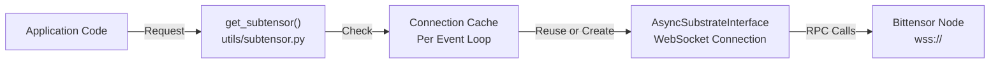

**Key Operations:**

<Table>

| Operation | Method | Purpose | Used By |
|-----------|--------|---------|---------|
| **Metagraph Query** | `metagraph(netuid)` | Retrieve all miner hotkeys and metadata | Validators, SDK |
| **Commitment Retrieval** | `get_all_revealed_commitments(netuid)` | Fetch miner model commitments | Validators, SDK |
| **Current Block** | `get_current_block()` | Get blockchain height for time-based operations | Validators |
| **Weight Setting** | `set_weights()` | Submit validator scores to blockchain | Validators |

</Table>


### Miner Discovery Flow

[affine/miners.py:257-350]() implements the `miners()` function that queries the blockchain:

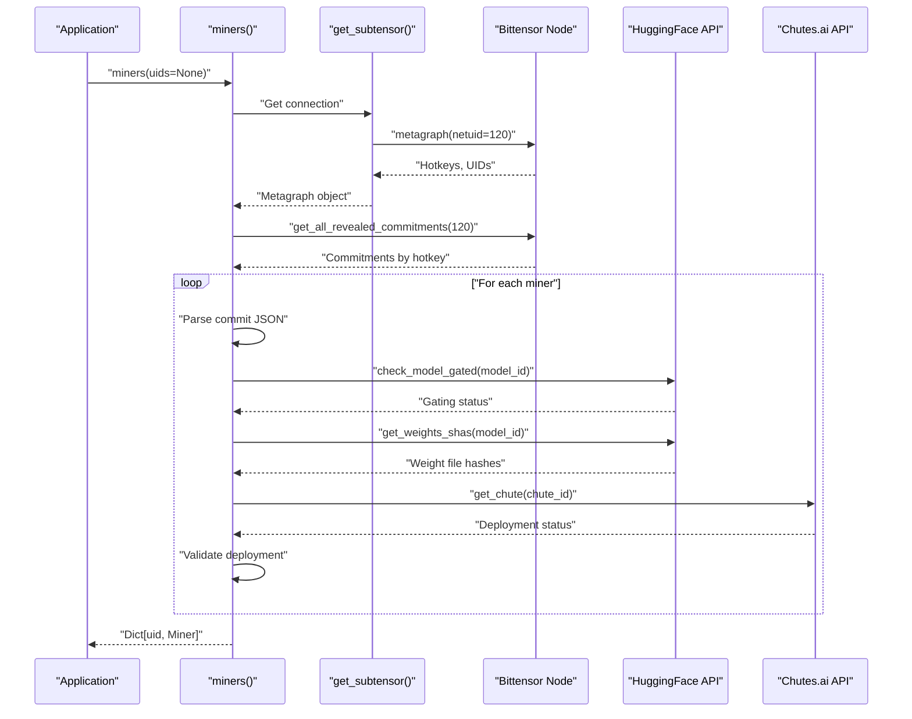

### Commitment Format

Miners commit model metadata to the blockchain in JSON format [affine/miners.py:285-289]():

```
{
  "model": "username/affine-model-name",
  "revision": "abc123def456...",
  "chute_id": "chute_xyz"
}
```

The validator verifies that:
1. The model exists on HuggingFace and is not gated
2. The model name matches the Chutes deployment name
3. The revision matches between commit and deployment
4. The Chutes endpoint is "hot" (active)

### Blacklist Management

[affine/miners.py:196-205]() implements hotkey blacklisting via environment variable:

```
AFFINE_MINER_BLACKLIST=hotkey1,hotkey2,hotkey3
```

Blacklisted miners are filtered out during discovery.

**Sources:** [affine/miners.py:257-350](), [affine/setup.py](), [pyproject.toml:6-31]()

---

## HuggingFace Hub Integration

HuggingFace Hub serves as the model registry, providing metadata verification and weight file validation.

### Model Gating Verification

[affine/miners.py:51-88]() implements cached gating checks:

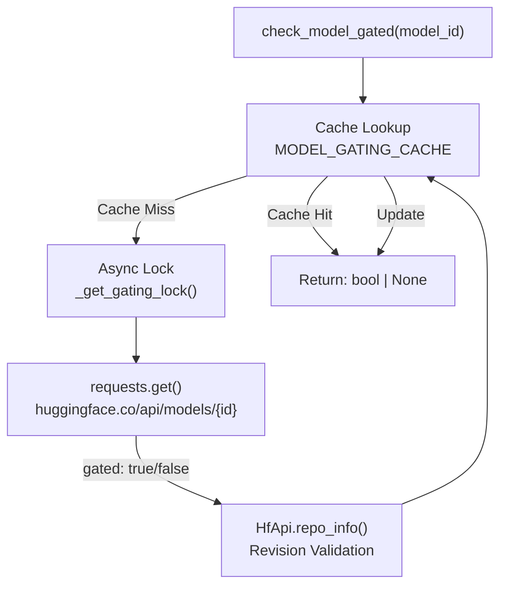

**Caching Strategy:**
- TTL: 3600 seconds (1 hour) [affine/miners.py:18]()
- Per-model cache key: `model_id`
- Thread-safe using `asyncio.Lock`

### Weight File SHA Validation

[affine/miners.py:144-188]() retrieves SHA256 hashes of all `.safetensors` files:

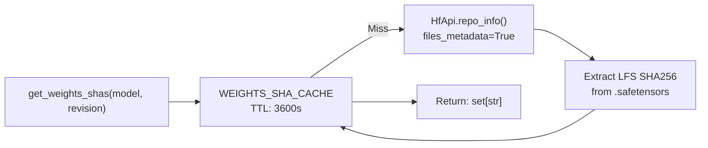

**Weight Deduplication:**

[affine/miners.py:208-240]() implements `_filter_by_earliest_sha()` to prevent model copying:

- Groups miners by their complete SHA set: `frozenset(weights_shas)`
- Keeps only the earliest miner (by block number) for each unique SHA set
- Different SHA sets indicate different models (both kept)

This prevents Sybil attacks where miners copy models to gain multiple reward slots.

### API Authentication

HuggingFace API calls can use optional authentication [affine/miners.py:69]():

```python
HfApi(token=os.getenv("HF_TOKEN"))
```

The token enables:
- Access to gated models (for validation)
- Higher API rate limits
- Private repository access

**Sources:** [affine/miners.py:51-188](), [pyproject.toml:22]()

---

## Chutes.ai Integration

Chutes.ai provides serverless inference endpoints for deployed models. Validators use these endpoints to evaluate miner models.

### Chutes API Endpoints

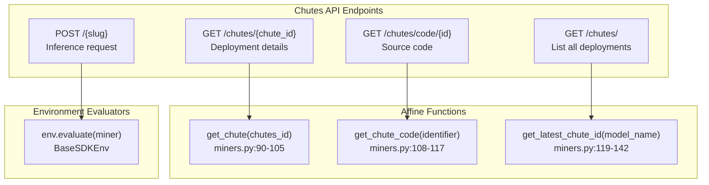

### Deployment Validation

[affine/miners.py:90-105]() validates chute deployments:

```python
chute = await get_chute(chute_id)

# Required validations:
assert chute is not None
assert chute.get("hot") == True  # Deployment is active
assert chute.get("name") == miner.model  # Name matches commit
assert chute.get("revision") == miner.revision  # Revision matches commit
```

**Chute Object Structure:**

```
{
  "chute_id": "...",
  "name": "username/model-name",
  "slug": "unique-deployment-slug",
  "revision": "abc123...",
  "hot": true,
  "image": {...},
  "readme": "...",  // Stripped by get_chute()
  "cords": {...},   // Stripped by get_chute()
  "instances": [...] // Stripped by get_chute()
}
```

### Inference Execution

Evaluators send inference requests to Chutes endpoints using the `slug` identifier. The exact request format depends on the environment but typically follows:

```
POST https://api.chutes.ai/{slug}
Authorization: {CHUTES_API_KEY}
Content-Type: application/json

{request payload}
```

### Authentication Requirements

All Chutes API calls require authentication [affine/miners.py:92-93]():

```python
token = os.getenv("CHUTES_API_KEY", "")
headers = {"Authorization": token}
```

**Required for:**
- Model deployment listing
- Deployment status checks
- Inference execution

**Sources:** [affine/miners.py:90-142](), [affine/tasks/base.py]()

---

## Cloudflare R2 Storage Integration

R2 provides S3-compatible object storage for evaluation results and weight summaries. The system supports both public HTTP access (read) and private S3 API access (write).

### Dual Access Modes

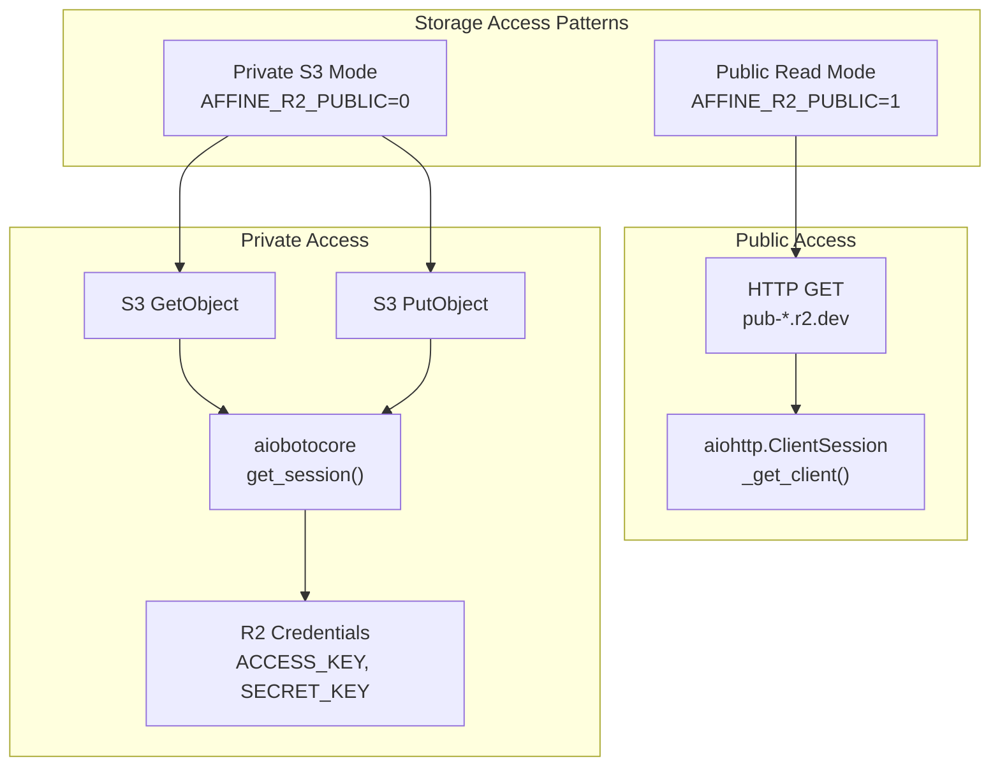

**Configuration** [affine/storage.py:24-37]():

```python
# R2 bucket configuration
FOLDER = os.getenv("R2_FOLDER", "affine")
BUCKET = os.getenv("R2_BUCKET_ID", "...")
ENDPOINT = f"https://{BUCKET}.r2.cloudflarestorage.com"

# Public HTTP base URL
R2_PUBLIC_BASE = f"https://pub-bf429ea7a5694b99adaf3d444cbbe64d.r2.dev"

# Access mode
PUBLIC_READ = os.getenv("AFFINE_R2_PUBLIC", "1") == "1"
```

### Storage Schema

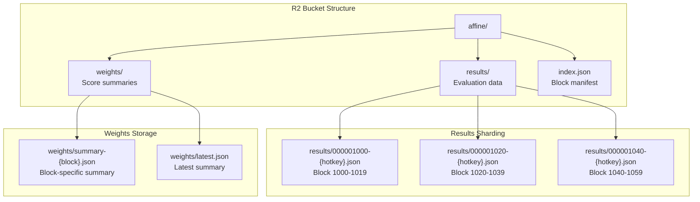

**Sharding Strategy** [affine/storage.py:24-49]():

- Window size: 20 blocks (`WINDOW = 20`)
- Shard key format: `affine/results/{block:09d}-{hotkey}.json`
- Block alignment: `(block // WINDOW) * WINDOW`

Example: Block 12345 → Shard `000012340-{hotkey}.json` (covers blocks 12340-12359)

### Dataset Loading with Fallback

[affine/storage.py:165-243]() implements automatic fallback to public repository:

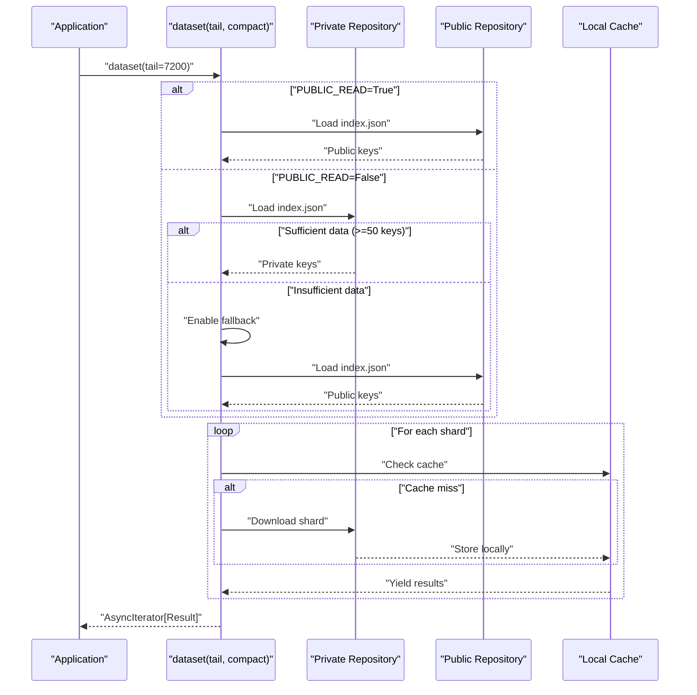

**Compact Result Mode:**

[affine/storage.py:168-179]() supports memory-efficient loading:

```python
async for result in dataset(tail=7200, compact=True):
    # Returns CompactResult instead of full Result
    # ~10x memory reduction for large datasets
    print(result.uid, result.env, result.score)
```

### Result Sinking (Upload)

[affine/storage.py:391-409]() handles batch result uploads:

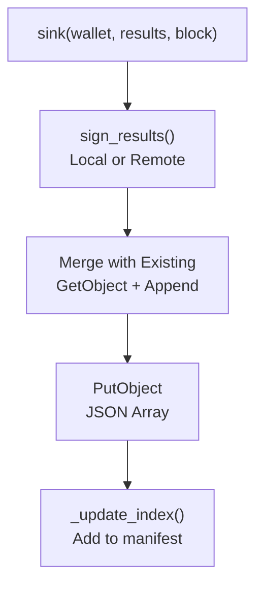

**Signing Strategies** [affine/storage.py:324-389]():

1. **Remote Signing:** Try signer service first
   - URL: `http://signer:8080/sign`
   - Batch signing for performance
   - Fallback on failure

2. **Local Signing:** Wallet-based fallback
   - `wallet.hotkey.sign(data)`
   - Per-result signing

### Index Management

[affine/storage.py:51-73]() maintains a global index of available shards:

```json
[
  "affine/results/000001000-5FHneW...",
  "affine/results/000001020-5FHneW...",
  "affine/results/000001040-5FHneW..."
]
```

New shards are automatically added during `sink()` operations [affine/storage.py:407-408]().

### Caching System

[affine/storage.py:45-128]() implements local file caching:

```
~/.cache/affine/blocks/
  000001000-{hotkey}.jsonl      # Shard data
  000001000-{hotkey}.modified   # Last-Modified timestamp
```

**Cache Invalidation:**
- Modified timestamp comparison via `HEAD` request
- Automatic refresh on mismatch
- Manual pruning via `prune(tail)` function

### Weight Summaries

[affine/storage.py:460-544]() provides weight summary storage:

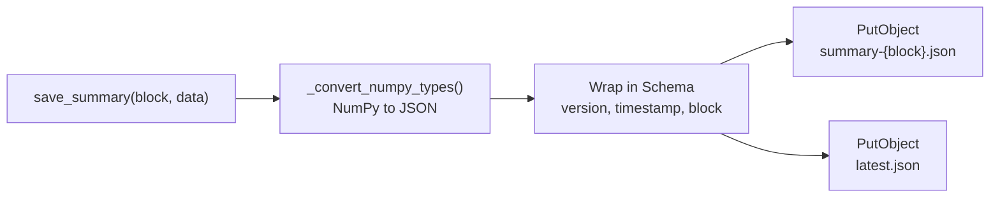

**Schema Version 1.0.0** [affine/storage.py:428-483]():

```json
{
  "schema_version": "1.0.0",
  "timestamp": 1234567890,
  "block": 12345,
  "data": {
    "header": ["UID", "Model", "Score", "..."],
    "rows": [...],
    "miners": {...},
    "stats": {...}
  }
}
```

**Sources:** [affine/storage.py:1-544](), [affine/models.py:168-239]()

---

## HTTP Client Management

Affine uses a shared HTTP client pool for external API calls to optimize connection reuse and concurrency.

### Connection Pool Architecture

[affine/http_client.py:1-56]() implements per-event-loop connection pooling:

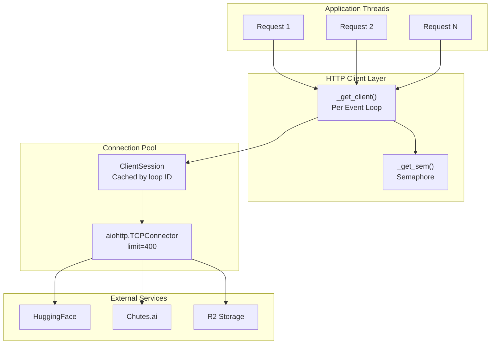

**Configuration** [affine/http_client.py:44-50]():

```python
limit = int(os.getenv("AFFINE_HTTP_CONCURRENCY", "400"))
conn = aiohttp.TCPConnector(
    limit=limit,              # Total connection limit
    limit_per_host=0,         # No per-host limit
    ttl_dns_cache=300,        # DNS cache: 5 minutes
    enable_cleanup_closed=True
)
```

### Per-Loop Isolation

[affine/http_client.py:36-56]() ensures thread-safety:

```python
async def _get_client() -> aiohttp.ClientSession:
    loop = asyncio.get_running_loop()
    key = id(loop)  # Unique per event loop
    
    client = _CLIENTS.get(key)
    if client is None or client.closed:
        client = aiohttp.ClientSession(connector=conn, ...)
        _CLIENTS[key] = client
    
    return client
```

Each event loop gets its own:
- `ClientSession` instance
- `Semaphore` for concurrency control
- Connection pool

### Cleanup Management

[affine/http_client.py:10-22]() handles graceful shutdown:

```python
async def _cleanup_clients():
    for client in _CLIENTS.values():
        if client and not client.closed:
            await client.close()
    _CLIENTS.clear()

atexit.register(_sync_cleanup)
```

Cleanup occurs:
- At process exit (via `atexit`)
- On event loop shutdown

**Sources:** [affine/http_client.py:1-56](), [affine/miners.py:9]()

---

## Authentication & API Keys

Summary of required credentials for external service access:

### Environment Variables

```bash
# Bittensor (Required for validators/miners)
# Configured via wallet setup, not environment variables

# HuggingFace (Optional but recommended)
HF_TOKEN="hf_..."
# - Enables gated model access
# - Higher API rate limits
# - Required for private repositories

# Chutes.ai (Required for validators/miners)
CHUTES_API_KEY="..."
# - Required for all Chutes API calls
# - Deployment validation
# - Inference execution

# Cloudflare R2 (Required for validators writing data)
R2_FOLDER="affine"
R2_BUCKET_ID="..."
R2_WRITE_ACCESS_KEY_ID="..."
R2_WRITE_SECRET_ACCESS_KEY="..."
R2_ACCOUNT_ID="..."

# R2 Access Mode (Default: public read)
AFFINE_R2_PUBLIC="1"  # 1 = public HTTP, 0 = private S3

# HTTP Client Tuning
AFFINE_HTTP_CONCURRENCY="400"     # Connection pool size
AFFINE_META_CONCURRENCY="12"      # HuggingFace API concurrency
```

### Access Patterns by Role

<Table>

| Role | Bittensor | HuggingFace | Chutes.ai | R2 Read | R2 Write |
|------|-----------|-------------|-----------|---------|----------|
| **Validator** | Required | Recommended | Required | Required | Required |
| **Miner** | Required | Optional | Required | No | No |
| **SDK User** | Optional | Optional | Optional | Recommended | No |

</Table>


### Rate Limiting Considerations

1. **HuggingFace API:**
   - Default: ~5000 requests/hour
   - With token: ~100k requests/hour
   - Cached for 1 hour per model [affine/miners.py:18]()

2. **Chutes.ai API:**
   - Rate limits enforced per API key
   - Retry logic with exponential backoff recommended

3. **R2 Storage:**
   - Public HTTP: Higher limits via CDN
   - Private S3: Standard S3 rate limits
   - Retry on 429 status [affine/storage.py:118-125]()

4. **Bittensor Blockchain:**
   - WebSocket connection (no REST rate limits)
   - Connection pooled per event loop

**Sources:** [affine/miners.py:16-23](), [affine/storage.py:24-37](), [affine/http_client.py:32-34]()

---

## Error Handling & Resilience

### Retry Strategies

**R2 Storage** [affine/storage.py:85-127]():
- Max retries: 5
- Base delay: 5 seconds
- Exponential backoff on 429 (rate limit)
- Graceful fallback to public repository

**HTTP Requests:**
- Connection pooling prevents port exhaustion
- Automatic retry on connection errors
- Timeout enforcement via `ClientTimeout`

### Fallback Mechanisms

1. **Data Source Fallback** [affine/storage.py:188-243]():
   ```
   Try: Private R2 → Check data sufficiency → Fallback: Public R2
   ```

2. **Signing Fallback** [affine/storage.py:324-389]():
   ```
   Try: Remote signer → Fallback: Local wallet signing
   ```

3. **Cache Fallback:**
   ```
   Try: Cached data → Check freshness → Fallback: Re-download
   ```

### Logging & Observability

- Trace-level logging for API failures [affine/miners.py:83]()
- Warning-level for fallback activation [affine/storage.py:233]()
- Info-level for successful operations [affine/storage.py:505]()

**Sources:** [affine/storage.py:75-243](), [affine/miners.py:82-87]()
