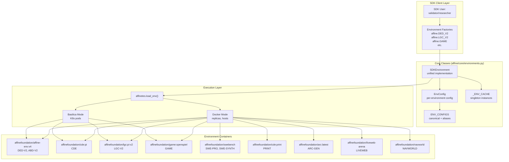
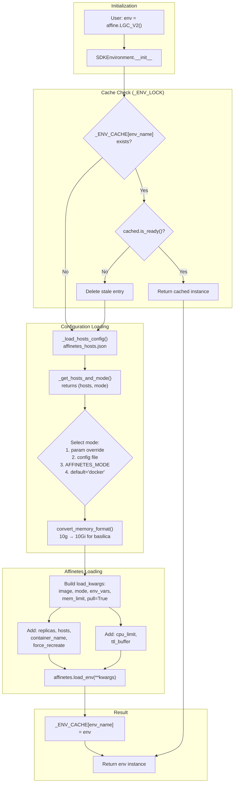
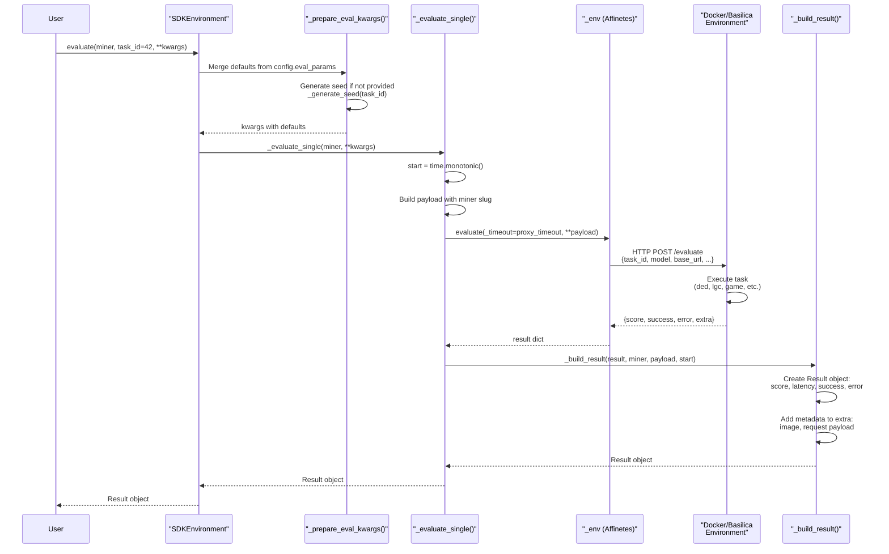

import CollapsibleAside from '../../../components/CollapsibleAside.astro';
import SourceLink from '../../../components/SourceLink.astro';
import Table from '../../../components/Table.astro';

<CollapsibleAside title="Relevant Source Files">
  <SourceLink text="affine/core/environments.py" href="https://github.com/AffineFoundation/affine-cortex/blob/main/affine/core/environments.py" />
  <SourceLink text="affine/database/system_config.json" href="https://github.com/AffineFoundation/affine-cortex/blob/main/affine/database/system_config.json" />
  <SourceLink text="affine/src/executor/config.py" href="https://github.com/AffineFoundation/affine-cortex/blob/main/affine/src/executor/config.py" />
</CollapsibleAside>

## Purpose and Scope

This document covers the evaluation environment system in Affine - the infrastructure that provides the actual tasks and benchmarks used to evaluate miner models. An evaluation environment is a containerized, isolated execution context that presents a specific task or benchmark (e.g., deductive reasoning, logic games, code synthesis, web navigation) and scores model performance.

Evaluation environments serve as the ground truth for miner rankings. Each environment runs in a Docker container orchestrated by [Affinetes](https://github.com/AffineFoundation/affinetes), exposing a standardized HTTP API that accepts model inference endpoints and evaluation parameters. The Executor service (see page 11.4) loads these environments and executes tasks, while the Scorer service (see page 11.5) aggregates results across environments to compute final weights.

**Navigation:**
- For environment system architecture and execution modes, see [Environment System Architecture](/subnets/evaluation-environments/environment-system-architecture#7.1)
- For descriptions of all available environments, see [Environment Catalog](/subnets/evaluation-environments/environment-catalog#7.2)
- For configuration details and sampling parameters, see [Environment Configuration](/subnets/evaluation-environments/environment-configuration#7.3)
- For task scheduling and allocation, see [Task Scheduling System](/subnets/for-validators/task-scheduling-system#5.3)

**Sources:** [affine/core/environments.py:1-699](), [affine/database/system_config.json:1-101]()

## System Overview

Affine Cortex uses **11 evaluation environments** across diverse domains:

<Table>

| Category | Environments | Focus |
|----------|-------------|-------|
| **Reasoning** | DED-V2, ABD-V2 | Deductive/abductive reasoning over code |
| **Code Execution** | CDE, PRINT | Code generation and execution |
| **Logic & Games** | LGC-V2, GAME | Logic puzzle solving and game playing |
| **Software Engineering** | SWE-PRO, SWE-SYNTH | Real-world code editing in repository contexts |
| **Abstract Reasoning** | ARC-GEN | Visual pattern recognition (ARC benchmark) |
| **Web Interaction** | LIVEWEB | Browser-based web navigation and API calls |
| **Planning & Tools** | NAVWORLD | Travel planning with MCP tool servers |

</Table>


Each environment runs in an isolated Docker container exposing a standardized HTTP API. This architecture provides:

- **Reproducibility**: Clean container state per evaluation with fixed dependencies
- **Isolation**: Miners cannot access each other's state or training data  
- **Scalability**: Environments can be replicated across multiple Docker hosts or deployed to Kubernetes (Basilica mode)
- **Caching**: Container images and environment instances cached for performance
- **Flexibility**: Two execution modes (Docker, Basilica) for different deployment scenarios

**Sources:** [affine/core/environments.py:83-302](), [affine/database/system_config.json:3-100]()

## Environment Characteristics

The following table summarizes key characteristics of each environment. For detailed descriptions, see [Environment Catalog](/subnets/evaluation-environments/environment-catalog#7.2).

<Table>

| Environment | Enabled | Sampling Count | Min Completeness | Docker Image | Memory Limit |
|------------|---------|----------------|------------------|--------------|--------------|
| **DED-V2** | ✓ | Default | 0.9 | `affinefoundation/affine-env:v4` | 10g |
| **ABD-V2** | ✓ | Default | 0.9 | `affinefoundation/affine-env:v4` | 10g |
| **CDE** | ✓ | Default | 0.9 | `affinefoundation/cde:pi` | 25g |
| **LGC-V2** | ✓ | 250 | 0.9 | `affinefoundation/lgc:pi-v2` | 20g |
| **GAME** | ✓ | 200 | 0.8 | `affinefoundation/game:openspiel` | 8g |
| **SWE-PRO** | ✓ | Default | 0.9 | `affinefoundation/swebench:pro` | 10g |
| **SWE-SYNTH** | ✓ | 100 | 0.8 | `affinefoundation/swebench:synth` | 10g |
| **PRINT** | ✓ | 200 | 0.9 | `affinefoundation/cde:print` | 10g |
| **ARC-GEN** | ✗ | 20 | 0.5 | `affinefoundation/arc:latest` | 10g |
| **LIVEWEB** | ✓ | 200 | 0.8 | `affinefoundation/liveweb-arena:latest` | 20g |
| **NAVWORLD** | Sampling Only | 50 | 0.8 | `affinefoundation/navworld:latest` | 5g |

</Table>


**Notes:**
- **Sampling Count**: Number of tasks rotated per sampling period (see [Environment Configuration](/subnets/evaluation-environments/environment-configuration#7.3))
- **Min Completeness**: Minimum fraction of miners that must complete tasks before scoring (0.5-0.9)
- **Enabled**: Whether environment is used for both sampling and scoring
- **NAVWORLD** is enabled for sampling but disabled for scoring (testing phase)
- **ARC-GEN** is fully disabled

**Sources:** [affine/database/system_config.json:3-100](), [affine/core/environments.py:83-260]()

## Environment Architecture Diagram



**Architecture Overview:**

The environment system uses a unified `SDKEnvironment` class ([affine/core/environments.py:317-613]()) that replaces the previous inheritance hierarchy. Key components:

1. **Environment Factories**: Pre-configured factory functions for each environment (e.g., `DED_V2_factory`, `LGC_V2_factory`)
2. **EnvConfig**: Dataclass storing environment-specific configuration (image, memory, timeout, eval_params)
3. **ENV_CONFIGS**: Dictionary mapping environment names and aliases to canonical `EnvConfig` instances
4. **_ENV_CACHE**: Global cache storing loaded environment instances with thread-safe access
5. **SDKEnvironment**: Unified class handling environment loading, evaluation, and lifecycle management

**Sources:** [affine/core/environments.py:18-22](), [affine/core/environments.py:58-78](), [affine/core/environments.py:83-313](), [affine/core/environments.py:317-613]()

## Core Components

### SDKEnvironment Class

The `SDKEnvironment` class ([affine/core/environments.py:317-613]()) is the unified implementation for all environments, replacing the previous inheritance hierarchy.

**Key Properties:**
- `config`: `EnvConfig` instance containing environment-specific settings
- `env_name`: Canonical environment name (e.g., `"ded-v2"`, `"lgc-v2"`)
- `env_type`: Environment type string (e.g., `"affine"`, `"swebench"`, `"liveweb"`)
- `docker_image`: Docker image name
- `_env`: Loaded Affinetes environment instance (cached)
- `_mode_override`: Optional execution mode override (`"docker"` or `"basilica"`)

**Core Methods:**

<Table>

| Method | Purpose |
|--------|---------|
| `__init__(env_name, mode=None)` | Initialize environment, load or retrieve from cache |
| `evaluate(miner, **kwargs)` | Evaluate single miner or dictionary of miners |
| `evaluate_batch(miners, **kwargs)` | Evaluate multiple miners in parallel |
| `_load_environment()` | Load environment via Affinetes with mode selection |
| `_prepare_eval_kwargs(**kwargs)` | Prepare evaluation parameters (seed, defaults) |
| `_generate_seed(task_id)` | Generate deterministic seed from env_name + task_id |

</Table>


**Sources:** [affine/core/environments.py:317-613]()

### EnvConfig Dataclass

The `EnvConfig` dataclass ([affine/core/environments.py:58-78]()) stores environment-specific configuration:

```python
@dataclass
class EnvConfig:
    name: str                                    # Environment name
    docker_image: str                            # Docker image
    env_type: str = "affine"                     # Environment type
    env_vars: Dict[str, str] = field(...)       # Container env vars
    required_env_vars: List[str] = field(...)   # Host env vars to forward
    mem_limit: str = "10g"                       # Memory limit
    volumes: Optional[Dict] = None               # Volume mounts
    eval_params: Dict[str, Any] = field(...)    # Default eval parameters
    proxy_timeout: int = 600                     # HTTP timeout
    cpu_limit: Optional[str] = None              # CPU limit (Basilica)
```

**Examples:**

- **DED-V2**: `docker_image="affinefoundation/affine-env:v4"`, `eval_params={"task_type": "ded", "temperature": 0.0, "timeout": 600}`
- **LGC-V2**: `mem_limit="20g"`, `proxy_timeout=1820`, `eval_params={"timeout": 1800}`
- **SWE-SYNTH**: `required_env_vars=["DOCKER_HUB_USERNAME", "DOCKER_HUB_TOKEN", "HF_TOKEN"]`, `volumes={"/var/run/docker.sock": ...}`
- **NAVWORLD**: `required_env_vars=["AMAP_MAPS_API_KEY"]`, `cpu_limit="2000m"`

**Sources:** [affine/core/environments.py:58-78](), [affine/core/environments.py:83-260]()

### ENV_CONFIGS Dictionary

The `ENV_CONFIGS` dictionary ([affine/core/environments.py:305-313]()) maps environment names (canonical and aliases) to `EnvConfig` instances:

**Canonical Names:**
- `"affine:ded-v2"`, `"affine:abd-v2"` - Affine reasoning environments
- `"cde"`, `"lgc-v2"`, `"game"`, `"print"` - PrimeIntellect environments
- `"swe-pro"`, `"swe-synth"` - SWE-bench environments
- `"arc-gen"`, `"liveweb"`, `"navworld"` - Specialized environments

**Aliases** (all map to canonical configs):
- `"DED"`, `"ded"`, `"ded-v2"` → `"affine:ded-v2"`
- `"LGC-V2"`, `"LGC-v2"`, `"LGC"` → `"lgc-v2"`
- `"GAME"` → `"game"`
- `"SWE-PRO"` → `"swe-pro"`

**Sources:** [affine/core/environments.py:263-313]()

## Environment Loading and Caching

**Diagram: Environment Loading Flow**



**Caching Strategy:**

The `_ENV_CACHE` dictionary ([affine/core/environments.py:20]()) stores loaded environment instances:

1. **Thread Safety**: `_ENV_LOCK` ([affine/core/environments.py:21]()) protects concurrent access
2. **Singleton Per Environment**: Each `env_name` has at most one cached instance
3. **Ready Check**: Before returning cached instance, `is_ready()` verifies container health
4. **Stale Removal**: Non-ready instances deleted and reloaded

**Mode Selection Priority** ([affine/core/environments.py:452-486]()):

1. **Parameter Override**: `mode` argument to `SDKEnvironment.__init__()`
2. **Config File**: `affinetes_hosts.json` with per-environment or default mode
3. **Environment Variable**: `AFFINETES_MODE=docker|basilica`
4. **Default**: `"docker"`

**Hosts Configuration** ([affine/core/environments.py:372-451]()):

Config file locations (checked in order):
- `$AFFINETES_HOSTS_CONFIG` (env var)
- `./affinetes_hosts.json` (current directory)
- `~/.affine/hosts.json` (home directory)
- `/etc/affine/hosts.json` (system-wide)

Format:
```json
{
  "lgc-v2": {
    "hosts": ["host1.example.com", "host2.example.com"],
    "mode": "docker"
  },
  "default": {
    "hosts": ["localhost"],
    "mode": "docker"
  }
}
```

**Sources:** [affine/core/environments.py:18-22](), [affine/core/environments.py:452-528](), [affine/core/environments.py:372-451]()

## Evaluation Flow

**Diagram: Single Miner Evaluation**



**Evaluation Steps:**

1. **Preparation** ([affine/core/environments.py:536-549]()):
   - Merge `config.eval_params` with user-provided `kwargs`
   - Generate deterministic seed: `SHA256(env_name:task_id) % 2^32`
   - Ensure `task_id` is present

2. **Payload Construction** ([affine/core/environments.py:551-566]()):
   - Start latency timer
   - Build payload with miner's Chutes slug: `base_url = "https://{slug}.chutes.ai/v1"`
   - Include all eval parameters (task_id, seed, temperature, timeout, etc.)

3. **Affinetes Call** ([affine/core/environments.py:564]()):
   - Call `_env.evaluate(_timeout=config.proxy_timeout, **payload)`
   - Proxy timeout covers network overhead + task timeout
   - Returns dict: `{score, success, error, extra}`

4. **Result Building** ([affine/core/environments.py:568-586]()):
   - Create `Result` object with score, latency, success flag
   - Copy `extra` dict from response
   - Add metadata: `docker_image`, `request` payload
   - Calculate `latency_seconds = time.monotonic() - start`

5. **Error Handling**:
   - Affinetes returns `success=False` with error message on failures
   - Timeouts caught by Affinetes HTTP client

**Sources:** [affine/core/environments.py:536-586](), [affine/core/environments.py:530-534]()

## SDK Usage and Factory Functions

### Direct Factory Usage

The SDK exposes pre-configured factory functions for each environment:

```python
import affine

# Reasoning environments
env = affine.DED_V2()
env = affine.ABD_V2()

# Code execution
env = affine.CDE()
env = affine.PRINT()

# Logic and games
env = affine.LGC_V2()
env = affine.GAME()

# Software engineering
env = affine.SWE_PRO()
env = affine.SWE_SYNTH()

# Specialized
env = affine.ARC_GEN()
env = affine.LIVEWEB()
env = affine.NAVWORLD()
```

**Factory Functions** ([affine/core/environments.py:659-698]()):
- Each factory is a lambda that calls `create_environment(env_name, mode=mode)`
- Optional `mode` parameter: `affine.LGC_V2(mode="basilica")`
- Returns `SDKEnvironment` instance

### Dynamic Environment Creation

The `create_environment()` function ([affine/core/environments.py:617-624]()) creates environments by name:

```python
from affine.core.environments import create_environment

# Create by canonical name
env = create_environment("lgc-v2")

# Create by alias
env = create_environment("LGC-V2")

# Override execution mode
env = create_environment("game", mode="basilica")
```

### List Available Environments

The `list_available_environments()` function ([affine/core/environments.py:627-637]()) returns all environments grouped by type:

```python
from affine.core.environments import list_available_environments

envs = list_available_environments()
# Returns:
# {
#   "affine": ["affine:abd-v2", "affine:ded-v2", ...],
#   "swebench": ["swe-pro", "swe-synth"],
#   "liveweb": ["liveweb"],
#   ...
# }
```

### Environment Aliases

The `_ENV_ALIASES` dictionary ([affine/core/environments.py:263-302]()) maps common names to canonical configs:

<Table>

| Aliases | Canonical |
|---------|-----------|
| `"DED"`, `"ded"`, `"ded-v2"`, `"affine:ded"` | `"affine:ded-v2"` |
| `"ABD"`, `"abd"`, `"abd-v2"`, `"affine:abd"` | `"affine:abd-v2"` |
| `"LGC"`, `"LGC-V2"`, `"LGC-v2"` | `"lgc-v2"` |
| `"GAME"` | `"game"` |
| `"SWE-PRO"` | `"swe-pro"` |
| `"SWE-SYNTH"` | `"swe-synth"` |
| `"PRINT"` | `"print"` |
| `"LIVEWEB"`, `"liveweb-arena"` | `"liveweb"` |
| `"NAVWORLD"`, `"NavWorld"` | `"navworld"` |

</Table>


**Sources:** [affine/core/environments.py:617-637](), [affine/core/environments.py:659-698](), [affine/core/environments.py:263-302]()

## Configuration and Parameters

### EnvConfig Settings

Each environment's `EnvConfig` ([affine/core/environments.py:83-260]()) specifies:

**Container Configuration:**
- `docker_image`: Image name (e.g., `"affinefoundation/lgc:pi-v2"`)
- `mem_limit`: Memory limit (`"10g"`, `"20g"`, `"25g"`)
- `cpu_limit`: CPU limit for Basilica mode (e.g., `"2000m"`)
- `volumes`: Volume mounts (e.g., Docker socket for SWE-bench)

**Execution Configuration:**
- `env_vars`: Container environment variables (e.g., `{"UVICORN_WORKERS": "30"}`)
- `required_env_vars`: Host env vars to forward (e.g., `["HF_TOKEN"]`)
- `proxy_timeout`: HTTP timeout in seconds (600-7400)

**Evaluation Parameters:**
- `eval_params`: Default evaluation parameters dict
  - Common: `temperature`, `timeout`
  - Affine: `task_type` (e.g., `"ded"`)
  - AgentGym-like: `max_iterations` (e.g., 30 for SWE-SYNTH)
  - Specialized: `num_train` (ARC-GEN), `max_concurrency` (LIVEWEB)

**Example Configurations:**

<Table>

| Environment | Memory | Workers | Timeout | Special Config |
|------------|--------|---------|---------|----------------|
| LGC-V2 | 20g | 30 | 1800s | High worker count for concurrency |
| GAME | 8g | 50 | 7200s | CPU limit 2000m, long timeout |
| SWE-SYNTH | 10g | 10 | 7200s | Docker socket mount, required env vars |
| LIVEWEB | 20g | 4 | 7200s | Cache volume, COINGECKO_API_KEY |
| NAVWORLD | 5g | - | 1200s | AMAP_MAPS_API_KEY, temperature 0.7 |

</Table>


**Sources:** [affine/core/environments.py:58-78](), [affine/core/environments.py:83-260]()

### Runtime Evaluation Parameters

The `evaluate()` method ([affine/core/environments.py:588-600]()) accepts dynamic parameters that override defaults:

```python
result = await env.evaluate(
    miner,
    task_id=42,           # Specific task (required)
    seed=12345,           # Random seed (auto-generated if omitted)
    temperature=0.7,      # Override default temperature
    timeout=900,          # Override default timeout
    # Environment-specific parameters also supported
)
```

**Parameter Merging** ([affine/core/environments.py:536-549]()):
1. User-provided `kwargs` passed to `evaluate()`
2. Merged with `config.eval_params` (user kwargs take precedence)
3. Seed auto-generated if not provided: `SHA256(env_name:task_id) % 2^32`

**Sources:** [affine/core/environments.py:536-549](), [affine/core/environments.py:588-600]()

### System Configuration

The `system_config.json` ([affine/database/system_config.json:1-101]()) file controls per-environment sampling and scoring parameters. See [Environment Configuration](/subnets/evaluation-environments/environment-configuration#7.3) for details.

**Key Settings:**
- `enabled_for_sampling`: Whether to generate tasks for this environment
- `enabled_for_scoring`: Whether to include in weight calculation
- `min_completeness`: Minimum fraction of miners that must complete tasks (0.5-0.9)
- `sampling_config`: Task rotation parameters (count, interval, weight)

**Sources:** [affine/database/system_config.json:1-101]()

## Result Object

Evaluations return a `Result` object ([affine/core/models.py]()) containing:

<Table>

| Field | Type | Description |
|-------|------|-------------|
| `miner_hotkey` | `str` | Miner's hotkey (empty string if evaluating custom model) |
| `model_revision` | `str` | Model revision/commit hash |
| `env` | `str` | Environment name (e.g., `"lgc-v2"`) |
| `score` | `float` | Normalized score (0.0-1.0 typically) |
| `latency_seconds` | `float` | Total evaluation duration |
| `success` | `bool` | Whether evaluation succeeded |
| `error` | `Optional[str]` | Error message if failed |
| `task_id` | `Optional[int]` | Task index evaluated |
| `extra` | `Dict[str, Any]` | Additional metadata |
| `timestamp` | `float` | Unix timestamp |

</Table>


**Extra Metadata** ([affine/core/environments.py:568-586]()):
- `image`: Docker image used (e.g., `"affinefoundation/lgc:pi-v2"`)
- `request`: Full evaluation request payload (task_id, seed, temperature, etc.)
- Environment-specific data returned by container (e.g., conversation history, trajectories)

**Building Results** ([affine/core/environments.py:568-586]()):
```python
def _build_result(self, result, miner, payload, start_time):
    extra = result.get("extra", {}).copy()
    extra["image"] = self.docker_image
    extra["request"] = payload.copy()
    
    return Result(
        miner_hotkey=miner.hotkey if miner else "",
        model_revision=miner.revision if miner else "",
        env=self.env_name,
        score=float(result.get("score", 0.0)),
        latency_seconds=time.monotonic() - start_time,
        success=bool(result.get("success", False)),
        error=result.get("error"),
        task_id=payload.get("task_id"),
        extra=extra,
        timestamp=time.time()
    )
```

**Sources:** [affine/core/environments.py:568-586](), [affine/core/models.py]()

## Required Environment Variables

### All Environments

```bash
CHUTES_API_KEY=<required>           # Chutes.ai API key for model inference
```

Set in host environment, automatically forwarded to containers ([affine/core/environments.py:348-370]()).

### Environment-Specific Requirements

Certain environments require additional credentials forwarded from the host:

**SWE-SYNTH** ([affine/core/environments.py:172-191]()):
```bash
DOCKER_HUB_USERNAME=<required>      # Docker Hub username for image pulls
DOCKER_HUB_TOKEN=<required>         # Docker Hub access token
HF_TOKEN=<required>                 # HuggingFace token for dataset access
```

**LIVEWEB** ([affine/core/environments.py:215-234]()):
```bash
COINGECKO_API_KEY=<required>        # CoinGecko API for web tasks
```

**NAVWORLD** ([affine/core/environments.py:240-259]()):
```bash
AMAP_MAPS_API_KEY=<required>        # AMap API for travel planning tools
```

If a required env var is missing, `_get_env_vars()` raises `ValueError` ([affine/core/environments.py:356-363]()).

### Deployment Configuration

**Mode Selection:**
```bash
AFFINETES_MODE=docker|basilica      # Execution mode (default: docker)
```

**Hosts Configuration:**
```bash
AFFINETES_HOSTS_CONFIG=/path/to/affinetes_hosts.json  # Config file location
```

Alternatively, use `affinetes_hosts.json` in current directory, `~/.affine/hosts.json`, or `/etc/affine/hosts.json`.

**Sources:** [affine/core/environments.py:348-370](), [affine/core/environments.py:172-259](), [affine/core/environments.py:386-405]()

## Cleanup

The `cleanup_all_environments()` function removes all cached environment instances:

```python
from affine.tasks import cleanup_all_environments

# Clean up all cached environments (stops containers, releases resources)
cleanup_all_environments()
```

This is automatically called during validator shutdown but can be invoked manually for testing or maintenance.

**Sources:** [affine/tasks.py:671-684]()
