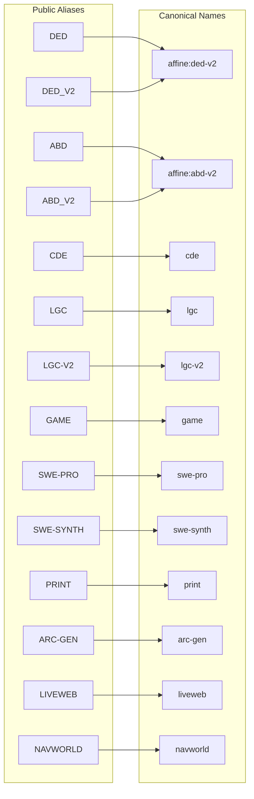
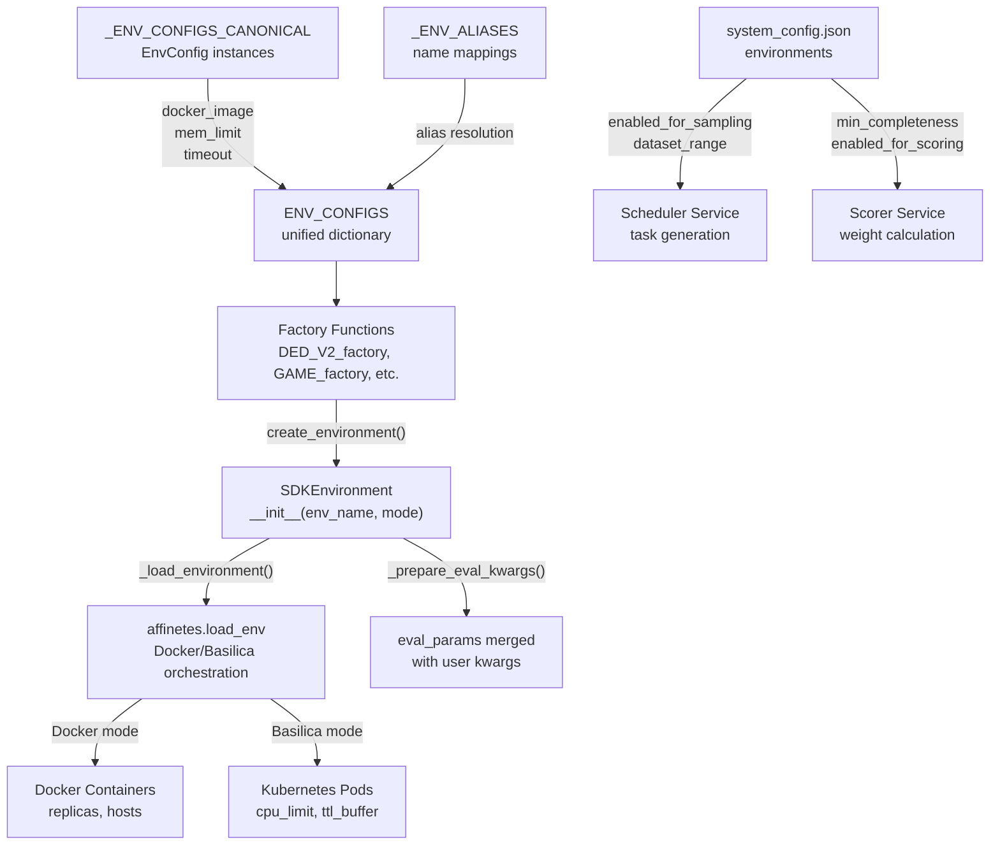
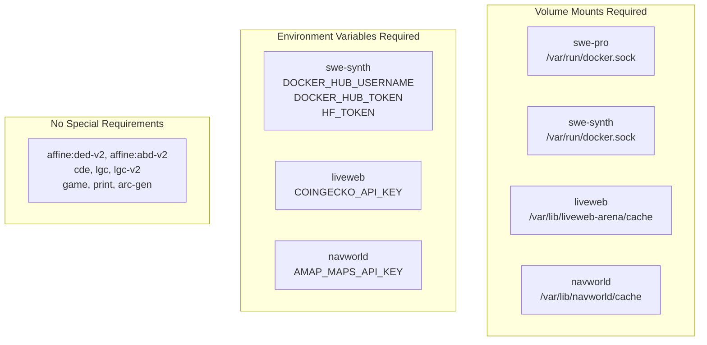

import CollapsibleAside from '../../../../components/CollapsibleAside.astro';
import SourceLink from '../../../../components/SourceLink.astro';
import Table from '../../../../components/Table.astro';

<CollapsibleAside title="Relevant Source Files">
  <SourceLink text="affine/core/environments.py" href="https://github.com/AffineFoundation/affine-cortex/blob/main/affine/core/environments.py" />
  <SourceLink text="affine/database/system_config.json" href="https://github.com/AffineFoundation/affine-cortex/blob/main/affine/database/system_config.json" />
  <SourceLink text="affine/src/executor/config.py" href="https://github.com/AffineFoundation/affine-cortex/blob/main/affine/src/executor/config.py" />
</CollapsibleAside>

This page provides a comprehensive catalog of all evaluation environments available in the Affine Cortex system. Each environment represents a distinct reinforcement learning task used to evaluate miner models. For information about the environment execution architecture and `SDKEnvironment` class, see [Environment System Architecture](/subnets/evaluation-environments/environment-system-architecture#7.1). For details on sampling and scoring configuration parameters, see [Environment Configuration](/subnets/evaluation-environments/environment-configuration#7.3).

## Environment Overview

The system supports 12 distinct environments across 4 environment types (`env_type`). All environments are defined in `_ENV_CONFIGS_CANONICAL` [affine/core/environments.py:83-260]() and mapped to factory functions for SDK access.

### Complete Environment Inventory

<Table>

| Environment Name | Aliases | Docker Image | Type | Memory | Timeout (s) | Status |
|-----------------|---------|--------------|------|--------|-------------|--------|
| `affine:ded-v2` | `ded`, `ded-v2`, `DED_V2` | `affinefoundation/affine-env:v4` | `affine` | 10g | 600 | Active |
| `affine:abd-v2` | `abd`, `abd-v2`, `ABD_V2` | `affinefoundation/affine-env:v4` | `affine` | 10g | 600 | Active |
| `cde` | `CDE` | `affinefoundation/cde:pi` | `affine` | 25g | 600 | Active |
| `lgc` | `LGC` | `affinefoundation/lgc:pi` | `affine` | 20g | 1200 | Active |
| `lgc-v2` | `LGC-V2`, `LGC-v2` | `affinefoundation/lgc:pi-v2` | `affine` | 20g | 1800 | Active |
| `game` | `GAME` | `affinefoundation/game:openspiel` | `affine` | 8g | 7200 | Active |
| `swe-pro` | `SWE-PRO` | `affinefoundation/swebench:pro` | `swebench` | 10g | 1800 | Active |
| `swe-synth` | `SWE-SYNTH` | `affinefoundation/swebench:synth` | `swebench` | 10g | 7200 | Active |
| `print` | `PRINT` | `affinefoundation/cde:print` | `affine` | 10g | 600 | Active |
| `arc-gen` | `ARC-GEN`, `ARCGEN` | `affinefoundation/arc:latest` | `affine` | 10g | 600 | Disabled |
| `liveweb` | `LIVEWEB`, `liveweb-arena` | `affinefoundation/liveweb-arena:latest` | `liveweb` | 20g | 7200 | Active |
| `navworld` | `NAVWORLD`, `NavWorld` | `affinefoundation/navworld:latest` | `navworld` | 5g | 1200 | Sampling Only |

</Table>


**Sources:** [affine/core/environments.py:83-260](), [affine/database/system_config.json:3-100]()

## Environment Type Taxonomy

```mermaid
graph TB
    subgraph "affine type"
        DED["affine:ded-v2<br/>task_type=ded"]
        ABD["affine:abd-v2<br/>task_type=abd"]
        CDE["cde<br/>(no task_type)"]
        LGC["lgc<br/>(no task_type)"]
        LGCV2["lgc-v2<br/>(no task_type)"]
        GAME["game<br/>(no task_type)"]
        PRINT["print<br/>(no task_type)"]
        ARCGEN["arc-gen<br/>(no task_type)"]
    end
    
    subgraph "swebench type"
        SWEPRO["swe-pro<br/>Docker-in-Docker"]
        SWESYNTH["swe-synth<br/>Docker-in-Docker"]
    end
    
    subgraph "liveweb type"
        LIVEWEB["liveweb<br/>Browser-based"]
    end
    
    subgraph "navworld type"
        NAVWORLD["navworld<br/>MCP Tools"]
    end
    
    EnvConfig["EnvConfig.env_type"]
    
    EnvConfig --> DED
    EnvConfig --> ABD
    EnvConfig --> CDE
    EnvConfig --> LGC
    EnvConfig --> LGCV2
    EnvConfig --> GAME
    EnvConfig --> PRINT
    EnvConfig --> ARCGEN
    EnvConfig --> SWEPRO
    EnvConfig --> SWESYNTH
    EnvConfig --> LIVEWEB
    EnvConfig --> NAVWORLD
```



**Sources:** [affine/core/environments.py:63]()

## Affine-Type Environments

### DED-V2 (Deductive Reasoning)

**Canonical Name:** `affine:ded-v2`  
**Factory Function:** `DED_V2_factory` [affine/core/environments.py:662]()  
**Configuration:** [affine/core/environments.py:84-93]()

```python
EnvConfig(
    name="affine:ded-v2",
    docker_image="affinefoundation/affine-env:v4",
    env_vars={"UVICORN_WORKERS": "10"},
    eval_params={
        "task_type": "ded",
        "temperature": 0.0,
        "timeout": 600,
    }
)
```

**Key Characteristics:**
- **Task Type:** Deductive reasoning tasks requiring logical inference
- **Environment Variable:** `ENV_NAME=ded` [affine/core/environments.py:366-367]()
- **Memory Limit:** 10g (10Gi in Basilica mode)
- **Worker Count:** 10 uvicorn workers
- **Timeout:** 600 seconds (10 minutes)
- **Sampling Status:** Currently disabled in `system_config.json`

**Sources:** [affine/core/environments.py:84-93]()

---

### ABD-V2 (Abductive Reasoning)

**Canonical Name:** `affine:abd-v2`  
**Factory Function:** `ABD_V2_factory` [affine/core/environments.py:663]()  
**Configuration:** [affine/core/environments.py:94-103]()

```python
EnvConfig(
    name="affine:abd-v2",
    docker_image="affinefoundation/affine-env:v4",
    env_vars={"UVICORN_WORKERS": "10"},
    eval_params={
        "task_type": "abd",
        "temperature": 0.0,
        "timeout": 600,
    }
)
```

**Key Characteristics:**
- **Task Type:** Abductive reasoning tasks requiring hypothesis generation
- **Environment Variable:** `ENV_NAME=abd` [affine/core/environments.py:366-367]()
- **Memory Limit:** 10g
- **Worker Count:** 10 uvicorn workers
- **Timeout:** 600 seconds
- **Sampling Status:** Currently disabled in `system_config.json`

**Sources:** [affine/core/environments.py:94-103]()

---

### CDE (Code Execution)

**Canonical Name:** `cde`  
**Factory Function:** `CDE_factory` [affine/core/environments.py:664]()  
**Configuration:** [affine/core/environments.py:106-115]()

```python
EnvConfig(
    name="cde",
    docker_image="affinefoundation/cde:pi",
    mem_limit="25g",
    env_vars={"UVICORN_WORKERS": "4"},
    eval_params={
        "temperature": 0.0,
        "timeout": 600,
    }
)
```

**Key Characteristics:**
- **Task Type:** Code execution and validation tasks
- **Memory Limit:** 25g (highest among affine environments)
- **Worker Count:** 4 uvicorn workers (lower due to higher memory per worker)
- **Timeout:** 600 seconds
- **Sampling Status:** Currently disabled in `system_config.json`

**Sources:** [affine/core/environments.py:106-115]()

---

### LGC (Logic Grid Puzzles)

**Canonical Name:** `lgc`  
**Factory Function:** `LGC_factory` [affine/core/environments.py:665]()  
**Configuration:** [affine/core/environments.py:116-126]()

```python
EnvConfig(
    name="lgc",
    mem_limit="20g",
    docker_image="affinefoundation/lgc:pi",
    env_vars={"UVICORN_WORKERS": "15"},
    eval_params={
        "temperature": 0.0,
        "timeout": 1200,
    },
    proxy_timeout=1300,
)
```

**Key Characteristics:**
- **Task Type:** Logic grid constraint satisfaction puzzles
- **Memory Limit:** 20g
- **Worker Count:** 15 uvicorn workers
- **Timeout:** 1200 seconds (20 minutes)
- **Proxy Timeout:** 1300 seconds [affine/core/environments.py:125]()
- **Sampling Status:** Currently disabled in `system_config.json`

**Sources:** [affine/core/environments.py:116-126]()

---

### LGC-V2 (Logic Grid Puzzles V2)

**Canonical Name:** `lgc-v2`  
**Factory Function:** `LGC_V2_factory` [affine/core/environments.py:666]()  
**Configuration:** [affine/core/environments.py:127-137]()  
**Sampling Configuration:** [affine/database/system_config.json:17-29]()

```python
EnvConfig(
    name="lgc-v2",
    mem_limit="20g",
    docker_image="affinefoundation/lgc:pi-v2",
    env_vars={"UVICORN_WORKERS": "30"},
    eval_params={
        "temperature": 0.0,
        "timeout": 1800,
    },
    proxy_timeout=1820,
)
```

**System Config:**
```json
{
  "enabled_for_sampling": true,
  "enabled_for_scoring": true,
  "min_completeness": 0.9,
  "sampling_config": {
    "dataset_range": [[0, 899999999]],
    "sampling_count": 250,
    "rotation_enabled": true,
    "rotation_count": 3,
    "rotation_interval": 3600,
    "scheduling_weight": 1.0
  }
}
```

**Key Characteristics:**
- **Task Type:** Enhanced logic grid puzzles with increased difficulty
- **Memory Limit:** 20g
- **Worker Count:** 30 uvicorn workers (doubled from v1)
- **Timeout:** 1800 seconds (30 minutes)
- **Proxy Timeout:** 1820 seconds
- **Dataset Range:** 0 to 899,999,999
- **Sampling Count:** 250 tasks per rotation
- **Max Concurrent:** 300 tasks [affine/src/executor/config.py:8]()

**Sources:** [affine/core/environments.py:127-137](), [affine/database/system_config.json:17-29](), [affine/src/executor/config.py:6-11]()

---

### GAME (Game Theory - OpenSpiel)

**Canonical Name:** `game`  
**Factory Function:** `GAME_factory` [affine/core/environments.py:667]()  
**Configuration:** [affine/core/environments.py:138-149]()  
**Sampling Configuration:** [affine/database/system_config.json:30-42]()

```python
EnvConfig(
    name="game",
    docker_image="affinefoundation/game:openspiel",
    env_vars={"UVICORN_WORKERS": "50"},
    eval_params={
        "temperature": 0.0,
        "timeout": 7200,
    },
    proxy_timeout=7400,
    cpu_limit="2000m",
    mem_limit="8g",
)
```

**System Config:**
```json
{
  "enabled_for_sampling": true,
  "enabled_for_scoring": true,
  "min_completeness": 0.8,
  "sampling_config": {
    "dataset_range": [[0, 500000000],[600000000, 800000000]],
    "sampling_count": 200,
    "rotation_enabled": true,
    "rotation_count": 2,
    "rotation_interval": 3600,
    "scheduling_weight": 3.0
  }
}
```

**Key Characteristics:**
- **Task Type:** Game-theoretic reasoning using OpenSpiel framework
- **Memory Limit:** 8g (lower than most environments)
- **CPU Limit:** 2000m (2 cores) in Basilica mode [affine/core/environments.py:147]()
- **Worker Count:** 50 uvicorn workers (highest worker count)
- **Timeout:** 7200 seconds (2 hours)
- **Proxy Timeout:** 7400 seconds
- **Dataset Range:** Two disjoint ranges [0-500M] and [600M-800M]
- **Scheduling Weight:** 3.0 (highest priority, 3x normal allocation)
- **Max Concurrent:** 500 tasks [affine/src/executor/config.py:7]()

**Sources:** [affine/core/environments.py:138-149](), [affine/database/system_config.json:30-42](), [affine/src/executor/config.py:6-11]()

---

### PRINT (Print Debugging)

**Canonical Name:** `print`  
**Factory Function:** `PRINT_factory` [affine/core/environments.py:670]()  
**Configuration:** [affine/core/environments.py:192-200]()  
**Sampling Configuration:** [affine/database/system_config.json:4-16]()

```python
EnvConfig(
    name="print",
    docker_image="affinefoundation/cde:print",
    env_vars={"UVICORN_WORKERS": "15"},
    eval_params={
        "temperature": 0.0,
        "timeout": 600,
    }
)
```

**System Config:**
```json
{
  "enabled_for_sampling": true,
  "enabled_for_scoring": true,
  "min_completeness": 0.9,
  "sampling_config": {
    "dataset_range": [[0, 1000000000]],
    "sampling_count": 200,
    "rotation_enabled": true,
    "rotation_count": 3,
    "rotation_interval": 3600,
    "scheduling_weight": 1.0
  }
}
```

**Key Characteristics:**
- **Task Type:** Code debugging tasks requiring print statement insertion
- **Docker Image:** Reuses CDE image with `:print` tag
- **Memory Limit:** 10g
- **Worker Count:** 15 uvicorn workers
- **Timeout:** 600 seconds
- **Dataset Range:** 0 to 1 billion

**Sources:** [affine/core/environments.py:192-200](), [affine/database/system_config.json:4-16]()

---

### ARC-GEN (Abstraction and Reasoning Corpus)

**Canonical Name:** `arc-gen`  
**Factory Function:** `ARC_GEN_factory` [affine/core/environments.py:689]()  
**Configuration:** [affine/core/environments.py:202-212]()  
**Sampling Configuration:** [affine/database/system_config.json:61-73]()

```python
EnvConfig(
    name="arc-gen",
    docker_image="affinefoundation/arc:latest",
    env_vars={"UVICORN_WORKERS": "10"},
    eval_params={
        "temperature": 0.0,
        "timeout": 600,
        "num_train": 3,
    },
    proxy_timeout=620,
)
```

**System Config:**
```json
{
  "enabled_for_sampling": false,
  "enabled_for_scoring": false,
  "min_completeness": 0.5,
  "sampling_config": {
    "dataset_range": [[0, 40000000000]],
    "sampling_count": 20,
    "rotation_enabled": true,
    "rotation_count": 2,
    "rotation_interval": 3600,
    "scheduling_weight": 0.5
  }
}
```

**Key Characteristics:**
- **Task Type:** Abstract pattern recognition and reasoning
- **Status:** Currently disabled (both sampling and scoring)
- **Memory Limit:** 10g
- **Worker Count:** 10 uvicorn workers
- **Timeout:** 600 seconds
- **Special Parameter:** `num_train=3` training examples [affine/core/environments.py:209]()

**Sources:** [affine/core/environments.py:202-212](), [affine/database/system_config.json:61-73]()

---

## SWE-Bench Environments

Both SWE-bench environments require Docker-in-Docker (DOOD) access via volume mount [affine/core/environments.py:158-163]() and [affine/core/environments.py:179-184]().

### SWE-PRO (SWE-Bench Production)

**Canonical Name:** `swe-pro`  
**Factory Function:** `SWE_PRO_factory` [affine/core/environments.py:668]()  
**Configuration:** [affine/core/environments.py:152-170]()

```python
EnvConfig(
    name="swe-pro",
    docker_image="affinefoundation/swebench:pro",
    env_type="swebench",
    env_vars={"UVICORN_WORKERS": "10"},
    mem_limit="10g",
    volumes={
        "/var/run/docker.sock": {
            "bind": "/var/run/docker.sock",
            "mode": "rw"
        }
    },
    eval_params={
        "max_iterations": 200,
        "temperature": 0.0,
        "timeout": 1800,
    },
    proxy_timeout=2000,
)
```

**Key Characteristics:**
- **Task Type:** Software engineering benchmarks from real GitHub issues
- **Environment Type:** `swebench` [affine/core/environments.py:155]()
- **Memory Limit:** 10g
- **Worker Count:** 10 uvicorn workers
- **Timeout:** 1800 seconds (30 minutes)
- **Max Iterations:** 200 agentic iterations
- **Required Volume:** `/var/run/docker.sock` for test execution
- **Sampling Status:** Currently disabled in `system_config.json`

**Sources:** [affine/core/environments.py:152-170]()

---

### SWE-SYNTH (SWE-Bench Synthetic)

**Canonical Name:** `swe-synth`  
**Factory Function:** `SWE_SYNTH_factory` [affine/core/environments.py:669]()  
**Configuration:** [affine/core/environments.py:172-191]()  
**Sampling Configuration:** [affine/database/system_config.json:43-60]()

```python
EnvConfig(
    name="swe-synth",
    docker_image="affinefoundation/swebench:synth",
    env_type="swebench",
    env_vars={"UVICORN_WORKERS": "10"},
    required_env_vars=["DOCKER_HUB_USERNAME", "DOCKER_HUB_TOKEN", "HF_TOKEN"],
    mem_limit="10g",
    volumes={
        "/var/run/docker.sock": {
            "bind": "/var/run/docker.sock",
            "mode": "rw"
        }
    },
    eval_params={
        "max_iterations": 30,
        "temperature": 0.0,
        "timeout": 7200,
    },
    proxy_timeout=7300,
)
```

**System Config:**
```json
{
  "enabled_for_sampling": true,
  "enabled_for_scoring": true,
  "min_completeness": 0.8,
  "sampling_config": {
    "dataset_range": [[300, 400]],
    "dataset_range_source": {
      "url": "https://pub-4b43a94ed07d4ac38fae3f4cb5070d6c.r2.dev/bugs/metadata.json",
      "field": "tasks.completed_up_to",
      "range_type": "zero_to_value"
    },
    "sampling_count": 100,
    "rotation_enabled": true,
    "rotation_count": 3,
    "rotation_interval": 3600,
    "scheduling_weight": 1.0
  }
}
```

**Key Characteristics:**
- **Task Type:** Synthetically generated software engineering tasks
- **Environment Type:** `swebench`
- **Memory Limit:** 10g
- **Worker Count:** 10 uvicorn workers
- **Timeout:** 7200 seconds (2 hours)
- **Max Iterations:** 30 (significantly lower than SWE-PRO)
- **Required Environment Variables:** [affine/core/environments.py:177]()
  - `DOCKER_HUB_USERNAME`: Docker Hub credentials
  - `DOCKER_HUB_TOKEN`: Docker Hub credentials
  - `HF_TOKEN`: HuggingFace token for dataset/artifact access
- **Dynamic Dataset Range:** Loaded from external R2 metadata [affine/database/system_config.json:49-53]()
- **Fallback Range:** [300, 400] if metadata unavailable

**Sources:** [affine/core/environments.py:172-191](), [affine/database/system_config.json:43-60]()

---

## LiveWeb Environment

### LIVEWEB (Browser-Based Web Interaction)

**Canonical Name:** `liveweb`  
**Factory Function:** `LIVEWEB_factory` [affine/core/environments.py:693]()  
**Configuration:** [affine/core/environments.py:215-234]()  
**Sampling Configuration:** [affine/database/system_config.json:74-86]()

```python
EnvConfig(
    name="liveweb",
    docker_image="affinefoundation/liveweb-arena:latest",
    env_type="liveweb",
    mem_limit="20g",
    env_vars={"UVICORN_WORKERS": "4"},
    required_env_vars=["COINGECKO_API_KEY"],
    volumes={
        "/var/lib/liveweb-arena/cache": {
            "bind": "/var/lib/liveweb-arena/cache",
            "mode": "rw",
        },
    },
    eval_params={
        "temperature": 0.0,
        "timeout": 7200,
        "max_concurrency": 10,
    },
    proxy_timeout=7300,
)
```

**System Config:**
```json
{
  "enabled_for_sampling": true,
  "enabled_for_scoring": true,
  "min_completeness": 0.8,
  "sampling_config": {
    "dataset_range": [[0, 78060000]],
    "sampling_count": 200,
    "rotation_enabled": true,
    "rotation_count": 3,
    "rotation_interval": 3600,
    "scheduling_weight": 1.0
  }
}
```

**Key Characteristics:**
- **Task Type:** Web navigation and interaction using browser automation
- **Environment Type:** `liveweb` [affine/core/environments.py:218]()
- **Memory Limit:** 20g (browser instances require significant memory)
- **Worker Count:** 4 uvicorn workers (low due to high per-worker memory)
- **Timeout:** 7200 seconds (2 hours)
- **Max Concurrency:** 10 browser instances [affine/core/environments.py:231]()
- **Required Environment Variable:** `COINGECKO_API_KEY` [affine/core/environments.py:221]()
- **Persistent Cache:** `/var/lib/liveweb-arena/cache` volume mount [affine/core/environments.py:222-226]()
- **Max Concurrent:** 50 tasks [affine/src/executor/config.py:9]()
- **Dataset Range:** 0 to 78,060,000

**Sources:** [affine/core/environments.py:215-234](), [affine/database/system_config.json:74-86](), [affine/src/executor/config.py:6-11]()

---

## NavWorld Environment

### NAVWORLD (Travel Planning with MCP Tools)

**Canonical Name:** `navworld`  
**Factory Function:** `NAVWORLD_factory` [affine/core/environments.py:697]()  
**Configuration:** [affine/core/environments.py:240-259]()  
**Sampling Configuration:** [affine/database/system_config.json:87-99]()

```python
EnvConfig(
    name="navworld",
    docker_image="affinefoundation/navworld:latest",
    env_type="navworld",
    mem_limit="5g",
    env_vars={"QQR_CACHE_DIR": "/var/lib/navworld/cache"},
    required_env_vars=["AMAP_MAPS_API_KEY"],
    volumes={
        "/var/lib/navworld/cache": {
            "bind": "/var/lib/navworld/cache",
            "mode": "rw",
        },
    },
    eval_params={
        "temperature": 0.7,
        "timeout": 1200,
    },
    proxy_timeout=1260,
    cpu_limit="2000m",
)
```

**System Config:**
```json
{
  "enabled_for_sampling": true,
  "enabled_for_scoring": false,
  "min_completeness": 0.8,
  "sampling_config": {
    "dataset_range": [[0, 1000000000]],
    "sampling_count": 50,
    "rotation_enabled": true,
    "rotation_count": 3,
    "rotation_interval": 3600,
    "scheduling_weight": 1.0
  }
}
```

**Key Characteristics:**
- **Task Type:** Travel planning using MCP (Model Context Protocol) tool servers
- **Environment Type:** `navworld` [affine/core/environments.py:243]()
- **Memory Limit:** 5g (lowest among all environments)
- **CPU Limit:** 2000m (2 cores) in Basilica mode [affine/core/environments.py:258]()
- **Temperature:** 0.7 (only environment with non-zero temperature) [affine/core/environments.py:254]()
- **Timeout:** 1200 seconds (20 minutes)
- **Required Environment Variable:** `AMAP_MAPS_API_KEY` for POI/routing/weather tools [affine/core/environments.py:246]()
- **Cache Directory:** `QQR_CACHE_DIR` for geographic data [affine/core/environments.py:245]()
- **Persistent Cache:** `/var/lib/navworld/cache` volume mount [affine/core/environments.py:247-251]()
- **Max Concurrent:** 50 tasks [affine/src/executor/config.py:10]()
- **Scoring Status:** Sampling enabled but scoring disabled [affine/database/system_config.json:89]()

**Sources:** [affine/core/environments.py:240-259](), [affine/database/system_config.json:87-99](), [affine/src/executor/config.py:6-11]()

---

## Environment Alias Resolution



The `_ENV_ALIASES` dictionary [affine/core/environments.py:263-302]() maps multiple name variants to canonical environment names. All aliases resolve through `ENV_CONFIGS` [affine/core/environments.py:305-312]().

**Alias Examples:**
- `"ded"`, `"ded-v2"`, `"affine:ded"` → `"affine:ded-v2"`
- `"abd"`, `"abd-v2"`, `"affine:abd"` → `"affine:abd-v2"`
- `"LGC-V2"`, `"LGC-v2"` → `"lgc-v2"`

**Sources:** [affine/core/environments.py:263-312]()

---

## Configuration Integration Flow



**Configuration Layers:**

1. **Static Code Configuration** [affine/core/environments.py:83-260]()
   - `_ENV_CONFIGS_CANONICAL`: Docker images, memory limits, timeouts
   - `_ENV_ALIASES`: Name resolution
   - `ENV_CONFIGS`: Final merged dictionary

2. **Dynamic Database Configuration** [affine/database/system_config.json:3-100]()
   - `enabled_for_sampling`: Task generation control
   - `enabled_for_scoring`: Weight calculation inclusion
   - `sampling_config`: Rotation parameters, dataset ranges
   - `min_completeness`: Minimum sample threshold for scoring

3. **Runtime Configuration**
   - `affinetes_hosts.json`: Host distribution and execution mode
   - Environment variables: `AFFINETES_MODE`, `AFFINETES_HOSTS`
   - Per-environment credential requirements: `required_env_vars`

**Sources:** [affine/core/environments.py:58-313](), [affine/database/system_config.json:1-101]()

---

## Resource Requirements Summary

### Memory Allocation by Environment

<Table>

| Environment | Memory Limit | Worker Count | Memory per Worker (approx) |
|-------------|--------------|--------------|---------------------------|
| `cde` | 25g | 4 | 6.25g |
| `lgc` | 20g | 15 | 1.33g |
| `lgc-v2` | 20g | 30 | 0.67g |
| `liveweb` | 20g | 4 | 5g |
| `swe-pro` | 10g | 10 | 1g |
| `swe-synth` | 10g | 10 | 1g |
| `affine:ded-v2` | 10g | 10 | 1g |
| `affine:abd-v2` | 10g | 10 | 1g |
| `print` | 10g | 15 | 0.67g |
| `arc-gen` | 10g | 10 | 1g |
| `game` | 8g | 50 | 0.16g |
| `navworld` | 5g | varies | varies |

</Table>


**Sources:** [affine/core/environments.py:68](), [affine/core/environments.py:83-260]()

### Timeout Characteristics

<Table>

| Timeout Range | Environments |
|---------------|--------------|
| 600s (10min) | `ded-v2`, `abd-v2`, `cde`, `print`, `arc-gen` |
| 1200s (20min) | `lgc`, `navworld` |
| 1800s (30min) | `lgc-v2`, `swe-pro` |
| 7200s (2hr) | `game`, `swe-synth`, `liveweb` |

</Table>


**Sources:** [affine/core/environments.py:70-74]()

### Execution Concurrency Limits

<Table>

| Environment | Max Concurrent Tasks |
|-------------|---------------------|
| `game` | 500 |
| `lgc-v2` | 300 |
| `default` | 200 |
| `liveweb` | 50 |
| `navworld` | 50 |

</Table>


Concurrency limits prevent resource exhaustion and ensure fair task distribution. Defined in `ENV_MAX_CONCURRENT` [affine/src/executor/config.py:6-11]().

**Sources:** [affine/src/executor/config.py:1-26]()

---

## Special Requirements Matrix



**Volume Mount Purposes:**
- **Docker Socket** (`/var/run/docker.sock`): Enables Docker-in-Docker for SWE-bench test execution [affine/core/environments.py:158-163]()
- **Cache Directories**: Persistent storage for downloaded assets, browser profiles, geographic data

**Environment Variable Validation:**  
The `_get_env_vars()` method [affine/core/environments.py:348-370]() validates that all `required_env_vars` are present before container launch, raising `ValueError` if missing.

**Sources:** [affine/core/environments.py:67](), [affine/core/environments.py:177](), [affine/core/environments.py:221](), [affine/core/environments.py:246]()

---

## SDK Access Patterns

### Factory Function Usage

```python
import affine

# Method 1: Factory functions
env = affine.DED_V2_factory()
env = affine.GAME_factory(mode="basilica")

# Method 2: Generic factory
env = affine.create_environment("lgc-v2", mode="docker")

# Method 3: Direct instantiation
from affine.core.environments import SDKEnvironment
env = SDKEnvironment("swe-synth", mode="basilica")
```

**Sources:** [affine/core/environments.py:617-624](), [affine/core/environments.py:659-698]()

### Environment Discovery

```python
import affine

# List all environments by type
envs = affine.list_available_environments()
# Returns:
# {
#     "affine": ["affine:abd-v2", "affine:ded-v2", "cde", ...],
#     "swebench": ["swe-pro", "swe-synth"],
#     "liveweb": ["liveweb"],
#     "navworld": ["navworld"]
# }
```

**Sources:** [affine/core/environments.py:627-637]()

---

## Environment Status Overview

### Active Environments (Sampling + Scoring)

Currently enabled in production [affine/database/system_config.json:1-100]():

<Table>

| Environment | Dataset Size | Sampling Count | Rotation Interval |
|-------------|--------------|----------------|-------------------|
| `PRINT` | 1B | 200 | 3600s (1hr) |
| `LGC-v2` | 900M | 250 | 3600s (1hr) |
| `GAME` | 800M (split) | 200 | 3600s (1hr) |
| `SWE-SYNTH` | Dynamic | 100 | 3600s (1hr) |
| `LIVEWEB` | 78M | 200 | 3600s (1hr) |

</Table>


### Sampling-Only Environments

<Table>

| Environment | Reason |
|-------------|--------|
| `NAVWORLD` | `enabled_for_scoring: false` - experimental phase |

</Table>


### Disabled Environments

<Table>

| Environment | Reason |
|-------------|--------|
| `affine:ded-v2` | Not in `system_config.json` |
| `affine:abd-v2` | Not in `system_config.json` |
| `cde` | Not in `system_config.json` |
| `lgc` | Superseded by `lgc-v2` |
| `swe-pro` | Not in `system_config.json` |
| `arc-gen` | `enabled_for_sampling: false`, `enabled_for_scoring: false` |

</Table>


**Sources:** [affine/database/system_config.json:3-100]()
