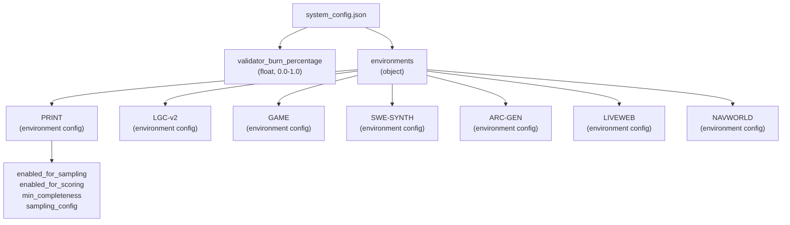
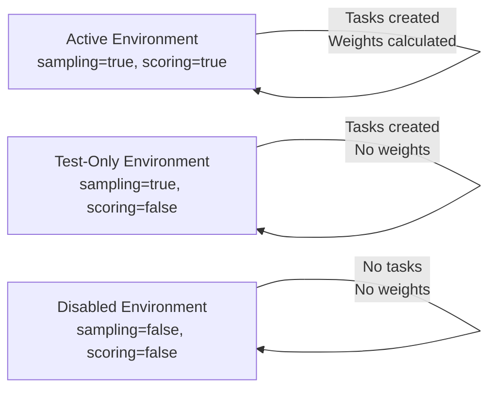
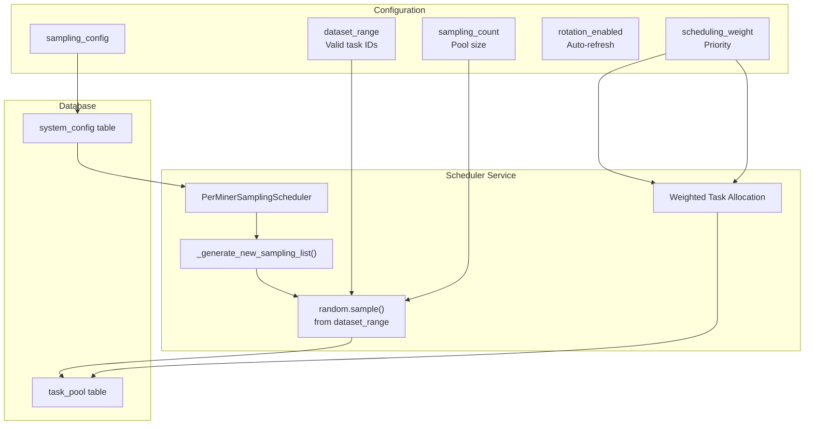
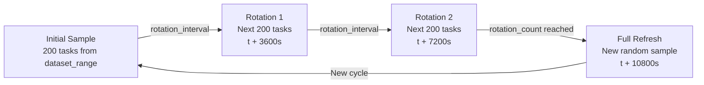
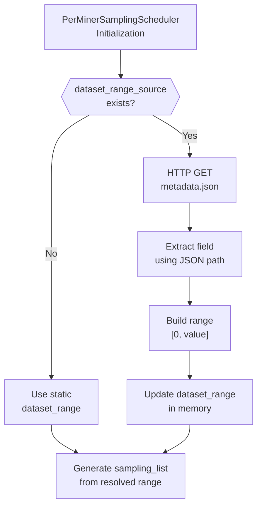
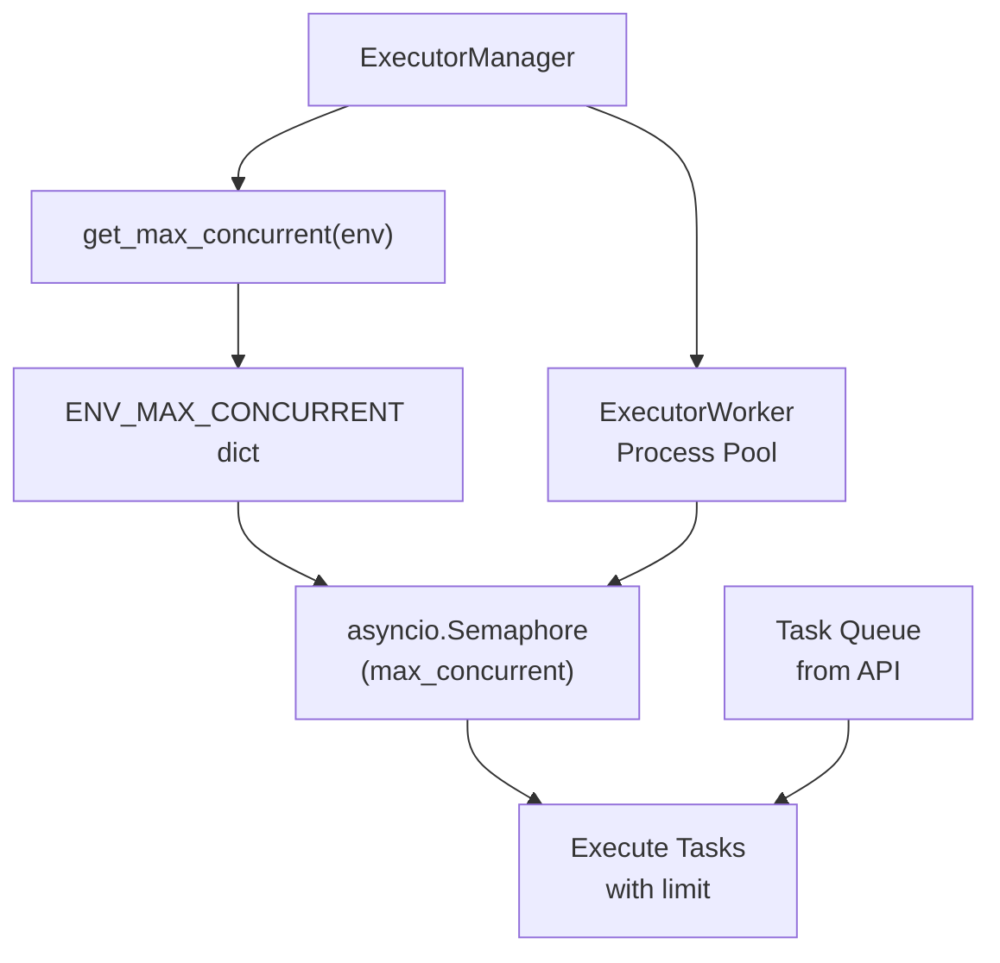
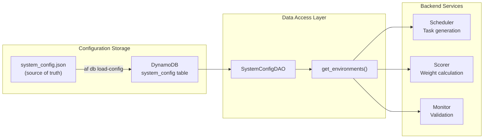

import CollapsibleAside from '../../../../components/CollapsibleAside.astro';
import SourceLink from '../../../../components/SourceLink.astro';
import Table from '../../../../components/Table.astro';

<CollapsibleAside title="Relevant Source Files">
  <SourceLink text="affine/core/environments.py" href="https://github.com/AffineFoundation/affine-cortex/blob/main/affine/core/environments.py" />
  <SourceLink text="affine/database/system_config.json" href="https://github.com/AffineFoundation/affine-cortex/blob/main/affine/database/system_config.json" />
  <SourceLink text="affine/src/executor/config.py" href="https://github.com/AffineFoundation/affine-cortex/blob/main/affine/src/executor/config.py" />
</CollapsibleAside>

This page documents the system-level configuration of evaluation environments through the `system_config.json` file and related configuration mechanisms. This configuration controls which environments are active, how tasks are sampled and distributed, and scoring parameters.

For implementation details of environment execution and the `EnvConfig` class, see [Environment System Architecture](/subnets/evaluation-environments/environment-system-architecture#7.1). For descriptions of individual environments and their evaluation criteria, see [Environment Catalog](/subnets/evaluation-environments/environment-catalog#7.2).

---

## Configuration File Structure

The primary configuration file is located at [affine/database/system_config.json:1-101](). This JSON file is loaded into the `system_config` DynamoDB table during initialization and controls validator behavior across all backend services.

**Top-Level Structure:**



**Sources:** [affine/database/system_config.json:1-101]()

---

## Environment-Specific Settings

Each environment key in the `environments` object contains four top-level fields that control its behavior in the system:

<Table>

| Field | Type | Purpose | Example Values |
|-------|------|---------|----------------|
| `enabled_for_sampling` | boolean | Whether scheduler creates tasks for this environment | `true`, `false` |
| `enabled_for_scoring` | boolean | Whether scorer includes this environment in weight calculations | `true`, `false` |
| `min_completeness` | float | Minimum fraction of tasks that must be completed for scoring (0.0-1.0) | `0.9`, `0.8`, `0.5` |
| `sampling_config` | object | Task sampling and rotation configuration | See below |

</Table>


**Configuration States:**



**Example Configurations:**

- **PRINT** [affine/database/system_config.json:4-16](): Fully active with 90% completeness requirement
- **NAVWORLD** [affine/database/system_config.json:87-99](): Active for sampling but disabled for scoring (test mode)
- **ARC-GEN** [affine/database/system_config.json:61-73](): Completely disabled (both flags false)

**Sources:** [affine/database/system_config.json:1-101]()

---

## Sampling Configuration

The `sampling_config` object controls how the Scheduler service generates tasks for each environment. This configuration directly influences the PerMinerSamplingScheduler and task allocation algorithms.

### Core Sampling Parameters

<Table>

| Parameter | Type | Description | Range/Format |
|-----------|------|-------------|--------------|
| `dataset_range` | array of ranges | Valid task ID ranges to sample from | `[[start, end], ...]` |
| `sampling_count` | integer | Number of unique tasks in rotation pool | 20-250 typical |
| `rotation_enabled` | boolean | Whether to rotate sampling list periodically | `true`/`false` |
| `rotation_count` | integer | Number of rotation cycles before complete refresh | 2-3 typical |
| `rotation_interval` | integer | Seconds between rotations | 3600 (1 hour) typical |
| `scheduling_weight` | float | Relative priority for task allocation | 0.5-3.0 typical |

</Table>


**Sampling Configuration Flow:**



**Sources:** [affine/database/system_config.json:8-15](), [affine/database/system_config.json:21-28](), [affine/database/system_config.json:34-41]()

### Dataset Range Specification

The `dataset_range` field defines valid task IDs that can be sampled. It supports multiple non-contiguous ranges:

**Single Contiguous Range:**
```json
"dataset_range": [[0, 1000000000]]
```
Used by: PRINT, LGC-v2, NAVWORLD

**Multiple Disjoint Ranges:**
```json
"dataset_range": [[0, 500000000], [600000000, 800000000]]
```
Used by: GAME [affine/database/system_config.json:35]() - excludes task IDs 500M-600M

**Small Fixed Range:**
```json
"dataset_range": [[300, 400]]
```
Used by: SWE-SYNTH [affine/database/system_config.json:48]() - limited to 100 tasks initially

**Sources:** [affine/database/system_config.json:9](), [affine/database/system_config.json:35](), [affine/database/system_config.json:48]()

### Rotation Mechanism

When `rotation_enabled` is `true`, the scheduler periodically refreshes the sampling list to prevent memorization:

**Rotation Parameters Example (GAME):**
```json
{
  "rotation_enabled": true,
  "rotation_count": 2,
  "rotation_interval": 3600
}
```

**Behavior:**
- Every 3600 seconds (1 hour), rotate to the next batch of tasks
- After 2 rotations, generate a completely new sampling list
- Total cycle duration: 2 × 3600 = 2 hours before full refresh

**Rotation Cycle:**



**Sources:** [affine/database/system_config.json:37-39]()

### Scheduling Weight

The `scheduling_weight` parameter controls relative task allocation priority when multiple environments compete for miner capacity:

<Table>

| Environment | Weight | Interpretation |
|-------------|--------|----------------|
| GAME | 3.0 | 3× more tasks than default |
| PRINT, LGC-v2, LIVEWEB | 1.0 | Standard allocation |
| ARC-GEN | 0.5 | Half the standard allocation |

</Table>


**Allocation Formula:**

For a miner with `N` available task slots:
```
tasks_for_env = floor(N × (env_weight / sum_all_weights))
```

**Example:** Miner with 6 slots, active environments: GAME (3.0), PRINT (1.0), LGC-v2 (1.0)
- Total weight: 3.0 + 1.0 + 1.0 = 5.0
- GAME allocation: floor(6 × 3.0/5.0) = 3 tasks
- PRINT allocation: floor(6 × 1.0/5.0) = 1 task
- LGC-v2 allocation: floor(6 × 1.0/5.0) = 1 task
- Remaining 1 slot distributed via round-robin

**Sources:** [affine/database/system_config.json:14](), [affine/database/system_config.json:40](), [affine/database/system_config.json:71]()

---

## Dynamic Dataset Ranges

Some environments use dynamically-fetched dataset ranges instead of static values. This is configured via the optional `dataset_range_source` field.

### Configuration Schema

```json
{
  "dataset_range_source": {
    "url": "https://example.com/metadata.json",
    "field": "tasks.completed_up_to",
    "range_type": "zero_to_value"
  }
}
```

<Table>

| Field | Type | Description |
|-------|------|-------------|
| `url` | string | HTTP(S) endpoint returning JSON metadata |
| `field` | string | JSON path to extract (dot-notation) |
| `range_type` | string | How to interpret the value: `"zero_to_value"` creates range `[0, value]` |

</Table>


**Example: SWE-SYNTH**

[affine/database/system_config.json:49-53]()

```json
{
  "dataset_range": [[300, 400]],
  "dataset_range_source": {
    "url": "https://pub-4b43a94ed07d4ac38fae3f4cb5070d6c.r2.dev/bugs/metadata.json",
    "field": "tasks.completed_up_to",
    "range_type": "zero_to_value"
  }
}
```

**Resolution Flow:**



**Behavior:**
1. Static `dataset_range` serves as fallback if fetch fails
2. Dynamic fetch happens at scheduler initialization/rotation
3. Enables expanding dataset as new tasks become available without config changes

**Sources:** [affine/database/system_config.json:49-53]()

---

## Executor Concurrency Configuration

In addition to `system_config.json`, environment-specific execution limits are defined in [affine/src/executor/config.py:1-26]().

### ENV_MAX_CONCURRENT Settings

This configuration controls the maximum number of concurrent task executions per environment in the Executor service:

```python
ENV_MAX_CONCURRENT = {
    "GAME": 500,
    "LGC-v2": 300,
    "LIVEWEB": 50,
    "NAVWORLD": 50,
}

DEFAULT_MAX_CONCURRENT = 200
```

**Rationale for Limits:**

<Table>

| Environment | Limit | Reason |
|-------------|-------|--------|
| GAME | 500 | Lightweight game simulations, high throughput |
| LGC-v2 | 300 | Medium complexity logic puzzles |
| LIVEWEB | 50 | Browser automation, high memory/CPU per task |
| NAVWORLD | 50 | External API calls (AMap), rate limiting |
| (default) | 200 | Conservative limit for unknown environments |

</Table>


**Integration with Executor:**



**Sources:** [affine/src/executor/config.py:6-14](), [affine/src/executor/config.py:17-25]()

---

## Configuration Lifecycle

### Loading Configuration

The configuration is loaded from JSON into DynamoDB during system initialization:

**CLI Command:**
```bash
af db load-config
```

**Process:**
1. Read [affine/database/system_config.json:1-101]()
2. Parse JSON structure
3. Write to `system_config` table with key `validator_burn_percentage` and `environments`
4. Services read from DynamoDB (not filesystem) during runtime

### Runtime Configuration Access

Backend services access configuration through DAO classes:



**Key Methods:**
- `SystemConfigDAO.get_environments()` - Returns all environment configs
- `SystemConfigDAO.get_environment(name)` - Returns single environment config
- `SystemConfigDAO.update_environment(name, config)` - Updates environment config

**Sources:** [affine/database/system_config.json:1-101]()

---

## Configuration Examples

### High-Throughput Environment (GAME)

```json
{
  "enabled_for_sampling": true,
  "enabled_for_scoring": true,
  "min_completeness": 0.8,
  "sampling_config": {
    "dataset_range": [[0, 500000000], [600000000, 800000000]],
    "sampling_count": 200,
    "rotation_enabled": true,
    "rotation_count": 2,
    "rotation_interval": 3600,
    "scheduling_weight": 3.0
  }
}
```

**Characteristics:**
- Large dataset (800M tasks with gap)
- High scheduling weight (3×)
- Lower completeness threshold (80%)
- Frequent rotation (every hour)
- High executor concurrency (500)

**Sources:** [affine/database/system_config.json:30-42]()

### Dynamic Dataset Environment (SWE-SYNTH)

```json
{
  "enabled_for_sampling": true,
  "enabled_for_scoring": true,
  "min_completeness": 0.8,
  "sampling_config": {
    "dataset_range": [[300, 400]],
    "dataset_range_source": {
      "url": "https://pub-4b43a94ed07d4ac38fae3f4cb5070d6c.r2.dev/bugs/metadata.json",
      "field": "tasks.completed_up_to",
      "range_type": "zero_to_value"
    },
    "sampling_count": 100,
    "rotation_enabled": true,
    "rotation_count": 3,
    "rotation_interval": 3600,
    "scheduling_weight": 1.0
  }
}
```

**Characteristics:**
- Small static fallback range (100 tasks)
- Dynamic range expansion as new tasks are completed
- Standard scheduling weight
- Moderate sampling count

**Sources:** [affine/database/system_config.json:43-60]()

### Test-Only Environment (NAVWORLD)

```json
{
  "enabled_for_sampling": true,
  "enabled_for_scoring": false,
  "min_completeness": 0.8,
  "sampling_config": {
    "dataset_range": [[0, 1000000000]],
    "sampling_count": 50,
    "rotation_enabled": true,
    "rotation_count": 3,
    "rotation_interval": 3600,
    "scheduling_weight": 1.0
  }
}
```

**Characteristics:**
- Tasks are generated and executed
- Results collected but not used for scoring
- Allows testing new environments before enabling for weight calculation
- Lower sampling count (50 vs 200+)

**Sources:** [affine/database/system_config.json:87-99]()

### Disabled Environment (ARC-GEN)

```json
{
  "enabled_for_sampling": false,
  "enabled_for_scoring": false,
  "min_completeness": 0.5,
  "sampling_config": {
    "dataset_range": [[0, 40000000000]],
    "sampling_count": 20,
    "rotation_enabled": true,
    "rotation_count": 2,
    "rotation_interval": 3600,
    "scheduling_weight": 0.5
  }
}
```

**Characteristics:**
- Completely disabled (no tasks, no scoring)
- Configuration preserved for potential future re-enablement
- Very low completeness threshold (50%)
- Minimal sampling count (20)

**Sources:** [affine/database/system_config.json:61-73]()

---

## Configuration Best Practices

### Completeness Thresholds

<Table>

| Threshold | Use Case | Example |
|-----------|----------|---------|
| 0.9 (90%) | Stable, well-tested environments | PRINT, LGC-v2 |
| 0.8 (80%) | Standard production environments | GAME, LIVEWEB, SWE-SYNTH |
| 0.5 (50%) | Experimental or unstable environments | ARC-GEN (disabled) |

</Table>


Lower thresholds allow scoring with incomplete data but may reduce accuracy.

### Sampling Count Selection

```
sampling_count = rotation_interval × expected_miner_count / rotation_count
```

**Example:** If expecting 20 active miners, 1-hour rotation:
- Want each miner to get ~10 unique tasks per rotation
- sampling_count = 3600s × 20 miners / 3 rotations ≈ 200 tasks

### Scheduling Weight Guidelines

- **Default (1.0):** Standard priority, equal allocation
- **High (2.0-3.0):** Important environments requiring more coverage
- **Low (0.3-0.5):** Supplementary environments, limited allocation
- **Test (1.0):** Keep standard weight even when `enabled_for_scoring=false`

**Sources:** [affine/database/system_config.json:1-101]()
