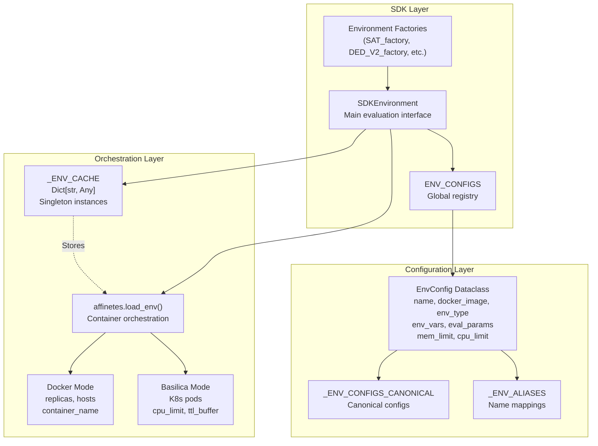
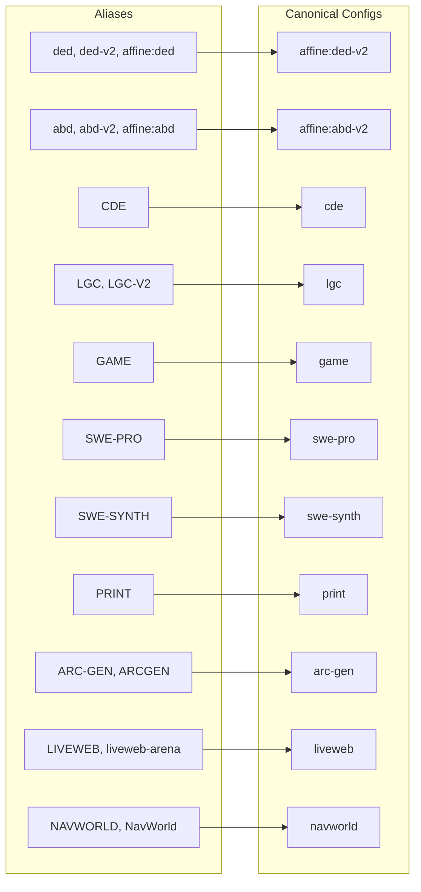
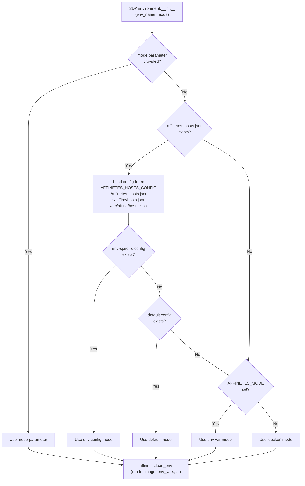
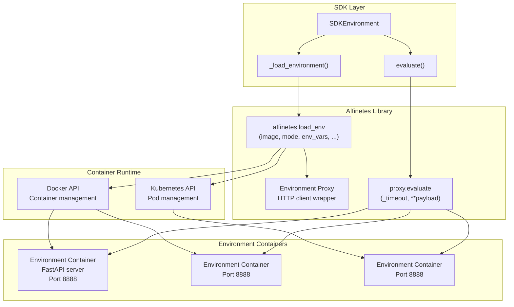
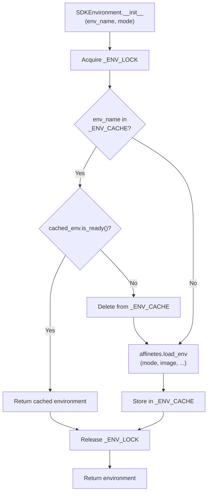
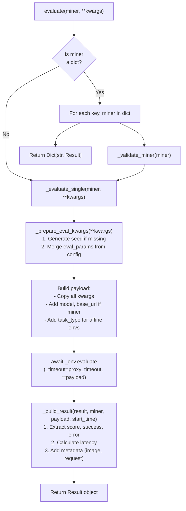
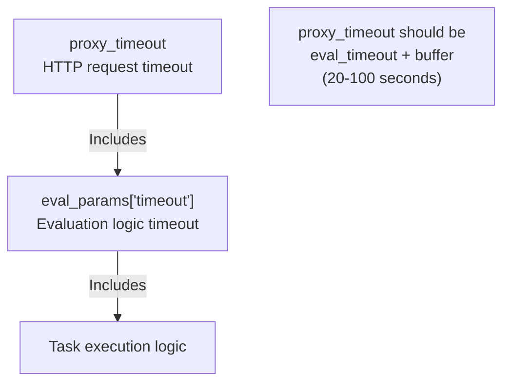

import CollapsibleAside from '../../../../components/CollapsibleAside.astro';
import SourceLink from '../../../../components/SourceLink.astro';
import Table from '../../../../components/Table.astro';

<CollapsibleAside title="Relevant Source Files">
  <SourceLink text="affine/core/environments.py" href="https://github.com/AffineFoundation/affine-cortex/blob/main/affine/core/environments.py" />
  <SourceLink text="affine/database/system_config.json" href="https://github.com/AffineFoundation/affine-cortex/blob/main/affine/database/system_config.json" />
  <SourceLink text="affine/src/executor/config.py" href="https://github.com/AffineFoundation/affine-cortex/blob/main/affine/src/executor/config.py" />
</CollapsibleAside>

## Purpose and Scope

This document describes the architecture of the environment execution system, which provides a unified interface for evaluating models across different RL environments. The system abstracts away the complexity of container orchestration, supports multiple execution modes (Docker and Basilica/Kubernetes), and manages environment lifecycle through caching and resource pooling.

For information about specific environments and their evaluation characteristics, see [Environment Catalog](/subnets/evaluation-environments/environment-catalog#7.2). For environment configuration in the database, see [Environment Configuration](/subnets/evaluation-environments/environment-configuration#7.3).

**Sources:** [affine/core/environments.py:1-699]()

---

## Core Components

The environment system consists of three primary components that work together to provide a clean abstraction over container-based evaluation.

### Component Overview



**Sources:** [affine/core/environments.py:18-21](), [affine/core/environments.py:56-78](), [affine/core/environments.py:317-613]()

---

### SDKEnvironment Class

The `SDKEnvironment` class is the primary interface for environment evaluation. It wraps container orchestration logic and provides a consistent API across all environment types.

**Key Responsibilities:**
- Load and cache environment instances
- Manage execution mode (Docker vs Basilica)
- Prepare evaluation payloads
- Handle miner/model evaluation
- Generate deterministic seeds
- Build result objects

**Class Structure:**

<Table>

| Property/Method | Purpose | Return Type |
|----------------|---------|-------------|
| `__init__(env_name, mode)` | Initialize environment with optional mode override | None |
| `env_name` | Get environment name | str |
| `env_type` | Get environment type (affine, swebench, liveweb, etc.) | str |
| `docker_image` | Get Docker image name | str |
| `evaluate(miner, **kwargs)` | Evaluate single miner or dict of miners | Result or Dict[str, Result] |
| `evaluate_batch(miners, **kwargs)` | Evaluate multiple miners in parallel | List[Result] |
| `_load_environment()` | Load or retrieve cached environment instance | Any |
| `_prepare_eval_kwargs(**kwargs)` | Merge config params with user kwargs | Dict[str, Any] |
| `_generate_seed(task_id)` | Generate deterministic seed from task_id | int |

</Table>


**Sources:** [affine/core/environments.py:317-613]()

---

### EnvConfig Dataclass

The `EnvConfig` dataclass defines environment-specific configuration. Each environment in the system has exactly one canonical `EnvConfig` instance, though multiple names may alias to it.

**Configuration Fields:**

```python
@dataclass
class EnvConfig:
    name: str                              # Canonical environment name
    docker_image: str                      # Docker image to use
    env_type: str = "affine"              # Environment type/category
    env_vars: Dict[str, str]              # Container environment variables
    required_env_vars: List[str]          # Host vars to forward
    mem_limit: str = "10g"                # Memory limit (Docker: "10g", K8s: "10Gi")
    volumes: Optional[Dict[str, Dict]]    # Volume mounts (Docker socket, cache dirs)
    eval_params: Dict[str, Any]           # Default evaluation parameters
    proxy_timeout: int = 600              # Request timeout in seconds
    cpu_limit: Optional[str] = None       # CPU limit for Basilica mode (e.g., "2000m")
```

**Example Configurations:**

<Table>

| Environment | Image | Memory | CPU | Special Requirements |
|-------------|-------|--------|-----|---------------------|
| `affine:ded-v2` | `affinefoundation/affine-env:v4` | 10g | - | None |
| `game` | `affinefoundation/game:openspiel` | 8g | 2000m | Long timeout (7200s) |
| `swe-synth` | `affinefoundation/swebench:synth` | 10g | - | Docker socket, HF_TOKEN, DOCKER_HUB credentials |
| `liveweb` | `affinefoundation/liveweb-arena:latest` | 20g | - | COINGECKO_API_KEY, cache volume |
| `navworld` | `affinefoundation/navworld:latest` | 5g | 2000m | AMAP_MAPS_API_KEY, cache volume |

</Table>


**Sources:** [affine/core/environments.py:58-78](), [affine/core/environments.py:83-260]()

---

### Environment Registry

The environment registry maintains a mapping from environment names to `EnvConfig` instances. It supports both canonical names and aliases.

**Registry Structure:**



**Implementation Details:**
- Canonical configs stored in `_ENV_CONFIGS_CANONICAL` dict
- Aliases defined in `_ENV_ALIASES` dict
- Final `ENV_CONFIGS` dict merges both
- Lookup time: O(1) for both canonical names and aliases
- Case-sensitive matching (but common variants included)

**Sources:** [affine/core/environments.py:83-313]()

---

## Execution Modes

The system supports two execution modes for running environment containers: Docker mode (multi-host replication) and Basilica mode (Kubernetes orchestration).

### Mode Selection Flow



**Priority Order:**
1. `mode` parameter passed to `SDKEnvironment.__init__()`
2. `mode` from environment-specific config in `affinetes_hosts.json`
3. `mode` from default config in `affinetes_hosts.json`
4. `AFFINETES_MODE` environment variable
5. Default to `"docker"`

**Sources:** [affine/core/environments.py:407-451](), [affine/core/environments.py:452-528]()

---

### Docker Mode

Docker mode runs environment containers on one or more Docker hosts with automatic replication and load balancing.

**Configuration Parameters:**

<Table>

| Parameter | Type | Purpose | Example |
|-----------|------|---------|---------|
| `mode` | str | Set to `"docker"` | `"docker"` |
| `replicas` | int | Number of container instances | `3` |
| `hosts` | List[str] | Docker host addresses | `["host1.example.com", "host2.example.com"]` |
| `container_name` | str | Base container name | `"lgc-v2"` |
| `force_recreate` | bool | Recreate on each load | `True` |
| `mem_limit` | str | Memory limit (Docker format) | `"10g"`, `"512m"` |
| `volumes` | Dict | Volume mounts | `{"/var/run/docker.sock": {"bind": "/var/run/docker.sock", "mode": "rw"}}` |

</Table>


**Host Configuration Format (`affinetes_hosts.json`):**

```json
{
  "lgc-v2": {
    "hosts": ["validator-1.local", "validator-2.local", "validator-3.local"],
    "mode": "docker"
  },
  "game": {
    "hosts": ["gpu-host-1.local", "gpu-host-2.local"],
    "mode": "docker"
  },
  "default": {
    "hosts": ["localhost"],
    "mode": "docker"
  }
}
```

**Load Balancing:**
- Affinetes distributes evaluation requests across replicas
- Round-robin or random selection (implementation-dependent)
- Each replica serves requests independently
- No shared state between replicas

**Sources:** [affine/core/environments.py:372-406](), [affine/core/environments.py:493-509]()

---

### Basilica Mode

Basilica mode deploys environment containers as Kubernetes pods with automatic TTL-based cleanup and resource limits.

**Configuration Parameters:**

<Table>

| Parameter | Type | Purpose | Example |
|-----------|------|---------|---------|
| `mode` | str | Set to `"basilica"` | `"basilica"` |
| `cpu_limit` | str | CPU limit (K8s format) | `"2000m"` (2 cores) |
| `mem_limit` | str | Memory limit (K8s format) | `"10Gi"`, `"512Mi"` |
| `ttl_buffer` | int | Pod TTL in seconds | `7400` |
| `volumes` | Dict | Volume mounts | Same as Docker |

</Table>


**Memory Format Conversion:**

The system automatically converts memory formats between Docker and Kubernetes:
- Docker format: `"10g"`, `"512m"`
- Kubernetes format: `"10Gi"`, `"512Mi"`
- Conversion handled by `convert_memory_format()` function

**TTL Configuration:**

TTL (time-to-live) is set to `proxy_timeout` value from `EnvConfig`:
- Ensures pod doesn't terminate mid-evaluation
- Automatic cleanup after evaluation completes
- Example: `game` environment has `proxy_timeout=7400` seconds

**K8s-Specific Considerations:**
- No manual replica management (K8s handles scaling)
- Pods created on-demand
- Resource limits enforced at pod level
- Volume mounts work same as Docker

**Sources:** [affine/core/environments.py:26-53](), [affine/core/environments.py:510-523]()

---

## Affinetes Integration

The `SDKEnvironment` class integrates with the `affinetes` library, which provides a unified interface for container orchestration across Docker and Kubernetes.

### Integration Architecture



**Key Integration Points:**

1. **Environment Loading** ([affine/core/environments.py:452-528]()):
   - `SDKEnvironment._load_environment()` calls `affinetes.load_env()`
   - Passes mode-specific parameters (replicas, hosts, cpu_limit, etc.)
   - Returns proxy object for HTTP communication

2. **Evaluation Execution** ([affine/core/environments.py:551-586]()):
   - `SDKEnvironment._evaluate_single()` calls `proxy.evaluate()`
   - Passes `_timeout` parameter from `EnvConfig.proxy_timeout`
   - Payload includes model URL, task_id, seed, and eval_params

3. **Environment Variables** ([affine/core/environments.py:348-370]()):
   - `CHUTES_API_KEY` always forwarded for miner inference
   - `required_env_vars` from `EnvConfig` forwarded from host
   - `env_vars` from `EnvConfig` set in container

**Sources:** [affine/core/environments.py:348-370](), [affine/core/environments.py:452-528](), [affine/core/environments.py:551-586]()

---

## Environment Lifecycle

### Loading and Caching

The environment system implements singleton caching to avoid redundant container deployments.

**Cache Mechanism:**



**Cache Characteristics:**
- Global singleton: `_ENV_CACHE: Dict[str, Any]` ([affine/core/environments.py:20]())
- Thread-safe: Protected by `_ENV_LOCK` ([affine/core/environments.py:21]())
- Key: Environment name (string)
- Value: Affinetes proxy object
- Validation: Checks `is_ready()` before reusing
- Invalidation: Manual cleanup via `cleanup_all_environments()`

**Sources:** [affine/core/environments.py:18-22](), [affine/core/environments.py:452-528](), [affine/core/environments.py:640-654]()

---

### Evaluation Flow

The evaluation process transforms user requests into container API calls and returns structured results.

**Evaluation Pipeline:**



**Key Functions:**

1. **`_prepare_eval_kwargs()`** ([affine/core/environments.py:536-549]()):
   - Validates `task_id` presence
   - Generates deterministic seed: `SHA256(f"{env_name}:{task_id}")[:8]`
   - Merges `eval_params` from config (user kwargs take precedence)

2. **`_build_result()`** ([affine/core/environments.py:568-586]()):
   - Creates `Result` object with standardized fields
   - Stores request payload in `extra` field
   - Includes `docker_image` for reproducibility
   - Calculates `latency_seconds` from start time

3. **`_validate_miner()`** ([affine/core/environments.py:608-612]()):
   - Checks `miner.model` and `miner.slug` attributes
   - Returns `False` for invalid miners (skipped in batch operations)

**Sources:** [affine/core/environments.py:536-586](), [affine/core/environments.py:588-612]()

---

### Cleanup

The system provides manual cleanup for cached environments, primarily used in long-running services or test suites.

**Cleanup Function:**

```python
def cleanup_all_environments():
    """Clean up all cached environments"""
    with _ENV_LOCK:
        logger.info("Cleaning up all cached environments")
        for name, env in list(_ENV_CACHE.items()):
            try:
                loop = asyncio.get_event_loop()
                if not loop.is_running():
                    loop.run_until_complete(env.cleanup())
                logger.debug(f"Cleaned up environment: {name}")
            except Exception as e:
                logger.warning(f"Error cleaning up environment {name}: {e}")
        
        _ENV_CACHE.clear()
```

**Cleanup Behavior:**
- Iterates over all cached environments
- Calls `env.cleanup()` (affinetes cleanup method)
- Swallows exceptions (logs warnings)
- Clears entire cache
- Thread-safe (acquires `_ENV_LOCK`)

**When to Use:**
- Service shutdown (e.g., Executor service termination)
- Test suite teardown
- Manual cache invalidation after config changes
- Memory pressure situations

**Sources:** [affine/core/environments.py:640-654]()

---

## Configuration System

### EnvConfig Parameter Reference

Complete reference for all `EnvConfig` fields and their usage.

**Core Fields:**

<Table>

| Field | Type | Required | Default | Description |
|-------|------|----------|---------|-------------|
| `name` | str | Yes | - | Canonical environment name |
| `docker_image` | str | Yes | - | Docker image name (e.g., `affinefoundation/game:openspiel`) |
| `env_type` | str | No | `"affine"` | Environment type category (affine, swebench, liveweb, navworld) |
| `env_vars` | Dict[str, str] | No | `{}` | Environment variables to set in container |
| `required_env_vars` | List[str] | No | `[]` | Host environment variables to forward |
| `mem_limit` | str | No | `"10g"` | Memory limit (Docker: "10g", K8s: "10Gi") |
| `volumes` | Dict | No | `None` | Volume mount configuration |
| `eval_params` | Dict[str, Any] | No | `{"temperature": 0.0, "timeout": 600}` | Default evaluation parameters |
| `proxy_timeout` | int | No | `600` | HTTP request timeout (seconds) |
| `cpu_limit` | str | No | `None` | CPU limit for Basilica mode (e.g., "2000m") |

</Table>


**Environment Variables:**

All environments automatically receive:
- `CHUTES_API_KEY`: For miner inference API calls
- `API_KEY`: Alias of CHUTES_API_KEY
- `ENV_NAME`: Task type (only for affine environments with `task_type` in eval_params)

Additional variables from `env_vars` dict merged in.

**Required Environment Variables:**

Some environments require host environment variables to be forwarded:
- `swe-synth`: `DOCKER_HUB_USERNAME`, `DOCKER_HUB_TOKEN`, `HF_TOKEN`
- `liveweb`: `COINGECKO_API_KEY`
- `navworld`: `AMAP_MAPS_API_KEY`

Missing required variables raises `ValueError` at environment load time.

**Sources:** [affine/core/environments.py:58-78](), [affine/core/environments.py:348-370]()

---

### Volume Mount Configuration

Some environments require volume mounts for Docker socket access (DOOD pattern) or persistent caching.

**Volume Mount Examples:**

```python
# Docker socket for SWE-bench environments (DOOD)
volumes = {
    "/var/run/docker.sock": {
        "bind": "/var/run/docker.sock",
        "mode": "rw"
    }
}

# Cache directory for LiveWeb Arena
volumes = {
    "/var/lib/liveweb-arena/cache": {
        "bind": "/var/lib/liveweb-arena/cache",
        "mode": "rw",
    },
}

# Cache directory for NavWorld
volumes = {
    "/var/lib/navworld/cache": {
        "bind": "/var/lib/navworld/cache",
        "mode": "rw",
    },
}
```

**Volume Use Cases:**

<Table>

| Environment | Volume | Purpose |
|-------------|--------|---------|
| `swe-pro`, `swe-synth` | `/var/run/docker.sock` | Docker-out-of-Docker (DOOD) for test container execution |
| `liveweb` | `/var/lib/liveweb-arena/cache` | Persistent browser cache and downloaded data |
| `navworld` | `/var/lib/navworld/cache` | QQR (tool server) cache storage |

</Table>


**Sources:** [affine/core/environments.py:152-191](), [affine/core/environments.py:214-260]()

---

### Host Configuration File

The `affinetes_hosts.json` configuration file specifies which hosts to use and which execution mode to run for each environment.

**Configuration File Locations (Priority Order):**
1. `$AFFINETES_HOSTS_CONFIG` environment variable path
2. `./affinetes_hosts.json` (current directory)
3. `~/.affine/hosts.json` (user home directory)
4. `/etc/affine/hosts.json` (system-wide)

**Configuration Format:**

```json
{
  "lgc-v2": {
    "hosts": ["validator-1.example.com", "validator-2.example.com"],
    "mode": "docker"
  },
  "game": {
    "hosts": ["gpu-host-1.example.com"],
    "mode": "docker"
  },
  "liveweb": {
    "mode": "basilica"
  },
  "default": {
    "hosts": ["localhost"],
    "mode": "docker"
  }
}
```

**Configuration Keys:**

<Table>

| Key | Type | Purpose |
|-----|------|---------|
| Environment name | Dict | Configuration for specific environment |
| `hosts` | List[str] | Docker host addresses (Docker mode only) |
| `mode` | str | Execution mode ("docker" or "basilica") |
| `default` | Dict | Fallback configuration for unlisted environments |

</Table>


**Backward Compatibility:**

Legacy format (list of hosts) is still supported:
```json
{
  "lgc-v2": ["host1", "host2", "host3"],
  "default": ["localhost"]
}
```
Automatically interpreted as Docker mode.

**Sources:** [affine/core/environments.py:372-451]()

---

## Resource Management

### Memory Limits

Memory limits are specified differently for Docker and Basilica modes and are automatically converted.

**Format Conversion:**

```python
def convert_memory_format(mem_limit: str, mode: str) -> str:
    if mode == "basilica":
        if mem_limit.endswith("g"):
            return mem_limit.replace("g", "Gi")
        elif mem_limit.endswith("m"):
            return mem_limit.replace("m", "Mi")
    return mem_limit
```

**Conversion Examples:**

<Table>

| Docker Format | Basilica Format |
|---------------|-----------------|
| `"10g"` | `"10Gi"` |
| `"512m"` | `"512Mi"` |
| `"25g"` | `"25Gi"` |

</Table>


**Memory Limits by Environment:**

<Table>

| Environment | Memory Limit | Reason |
|-------------|--------------|--------|
| `affine:ded-v2`, `affine:abd-v2` | 10g | Standard size for Affine environments |
| `lgc`, `lgc-v2` | 20g | Large code generation, syntax parsing |
| `cde` | 25g | Compiler/decompiler heavy memory usage |
| `liveweb` | 20g | Browser engine and page caching |
| `navworld` | 5g | Lightweight tool server integration |
| `game` | 8g | Game state simulation |

</Table>


**Sources:** [affine/core/environments.py:26-53](), [affine/core/environments.py:83-260]()

---

### Concurrency Controls

The executor service implements per-environment concurrency limits to prevent resource exhaustion.

**Concurrency Configuration:**

```python
# affine/src/executor/config.py
ENV_MAX_CONCURRENT = {
    "GAME": 500,
    "LGC-v2": 300,
    "LIVEWEB": 50,
    "NAVWORLD": 50,
}

DEFAULT_MAX_CONCURRENT = 200

def get_max_concurrent(env: str) -> int:
    return ENV_MAX_CONCURRENT.get(env, DEFAULT_MAX_CONCURRENT)
```

**Rationale:**

<Table>

| Environment | Limit | Reason |
|-------------|-------|--------|
| `GAME` | 500 | Fast evaluation (OpenSpiel games), high throughput |
| `LGC-v2` | 300 | Moderate resource usage per task |
| `LIVEWEB` | 50 | Heavy browser instances, long-running tasks |
| `NAVWORLD` | 50 | External API rate limits (AMap) |
| Default | 200 | Safe default for most environments |

</Table>


**Implementation:**

Concurrency limits are enforced at the executor worker level, not in `SDKEnvironment`. The environment system provides the infrastructure; the executor service manages task scheduling.

**Sources:** [affine/src/executor/config.py:1-26]()

---

### Timeout Configuration

Each environment specifies two timeout values for different purposes.

**Timeout Types:**

<Table>

| Timeout | Field | Purpose | Default |
|---------|-------|---------|---------|
| Evaluation Timeout | `eval_params["timeout"]` | Maximum execution time for evaluation logic | 600s |
| Proxy Timeout | `proxy_timeout` | HTTP request timeout (includes network latency) | 600s |

</Table>


**Timeout Hierarchy:**



**Example Configurations:**

<Table>

| Environment | eval_timeout | proxy_timeout | Buffer |
|-------------|--------------|---------------|--------|
| `affine:ded-v2` | 600s | 600s | 0s |
| `lgc-v2` | 1800s | 1820s | 20s |
| `game` | 7200s | 7400s | 200s |
| `swe-synth` | 7200s | 7300s | 100s |
| `liveweb` | 7200s | 7300s | 100s |

</Table>


**Timeout Enforcement:**

1. **Proxy Level**: Affinetes HTTP client times out after `proxy_timeout`
2. **Environment Level**: Container evaluation logic enforces `eval_params["timeout"]`
3. **Task Level**: Individual tasks may have shorter timeouts (environment-specific)

**Sources:** [affine/core/environments.py:83-260]()

---

## Factory Functions and Backward Compatibility

The system provides factory functions for easy environment instantiation and maintains backward compatibility with legacy class-based APIs.

**Factory Function Pattern:**

```python
def create_environment(env_name: str, mode: Optional[str] = None) -> SDKEnvironment:
    """Create environment by name"""
    return SDKEnvironment(env_name, mode=mode)

# Environment-specific factories
DED_V2_factory = lambda mode=None: create_environment("ded-v2", mode=mode)
LGC_V2_factory = lambda mode=None: create_environment("lgc-v2", mode=mode)
GAME_factory = lambda mode=None: create_environment("game", mode=mode)
# ... etc
```

**Legacy Class Aliases:**

```python
# Old usage: env = affine.DED_V2()
DED_V2 = DED_V2_factory
LGC_V2 = LGC_V2_factory
GAME = GAME_factory
LIVEWEB = LIVEWEB_factory
NAVWORLD = NAVWORLD_factory
```

**Usage Examples:**

```python
# Modern factory usage
env = affine.create_environment("ded-v2", mode="basilica")

# Legacy class usage (still supported)
env = affine.DED_V2(mode="basilica")

# Direct instantiation
env = affine.SDKEnvironment("ded-v2", mode="basilica")
```

**Available Factory Functions:**

<Table>

| Factory Function | Canonical Name | Legacy Alias |
|------------------|----------------|--------------|
| `SAT_factory` | `affine:sat` | `SAT` |
| `DED_factory` | `affine:ded-v2` | `DED` |
| `DED_V2_factory` | `affine:ded-v2` | `DED_V2` |
| `ABD_factory` | `affine:abd-v2` | `ABD` |
| `ABD_V2_factory` | `affine:abd-v2` | `ABD_V2` |
| `CDE_factory` | `cde` | `CDE` |
| `LGC_factory` | `lgc` | `LGC` |
| `LGC_V2_factory` | `lgc-v2` | `LGC_V2` |
| `GAME_factory` | `game` | `GAME` |
| `PRINT_factory` | `print` | `PRINT` |
| `SWE_PRO_factory` | `swe-pro` | `SWE_PRO` |
| `SWE_SYNTH_factory` | `swe-synth` | `SWE_SYNTH` |
| `ARC_GEN_factory` | `arc-gen` | `ARC_GEN` |
| `LIVEWEB_factory` | `liveweb` | `LIVEWEB` |
| `NAVWORLD_factory` | `navworld` | `NAVWORLD` |

</Table>


**Sources:** [affine/core/environments.py:615-699]()

---

## System Configuration Integration

While `EnvConfig` defines environment-level configuration, the system also reads environment settings from the database `system_config` table.

**Database Configuration Structure:**

```json
{
  "environments": {
    "PRINT": {
      "enabled_for_sampling": true,
      "enabled_for_scoring": true,
      "min_completeness": 0.9,
      "sampling_config": {
        "dataset_range": [[0, 1000000000]],
        "sampling_count": 200,
        "rotation_enabled": true,
        "rotation_count": 3,
        "rotation_interval": 3600,
        "scheduling_weight": 1.0
      }
    }
  }
}
```

**Configuration Separation:**

<Table>

| System | Configuration Type | Storage | Purpose |
|--------|-------------------|---------|---------|
| `EnvConfig` | Execution configuration | Code ([affine/core/environments.py]()) | Container orchestration, resource limits, image names |
| `system_config` | Operational configuration | Database (DynamoDB) | Task sampling, scoring weights, dataset ranges |

</Table>


**Key Differences:**

- `EnvConfig` is immutable and version-controlled
- `system_config` is mutable and updated via database operations
- `EnvConfig` affects how environments run
- `system_config` affects which tasks are generated and how they're scored

For detailed information on the database configuration, see [Environment Configuration](/subnets/evaluation-environments/environment-configuration#7.3).

**Sources:** [affine/database/system_config.json:1-101]()
