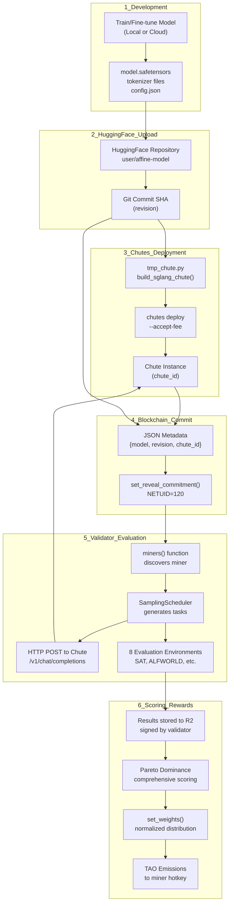
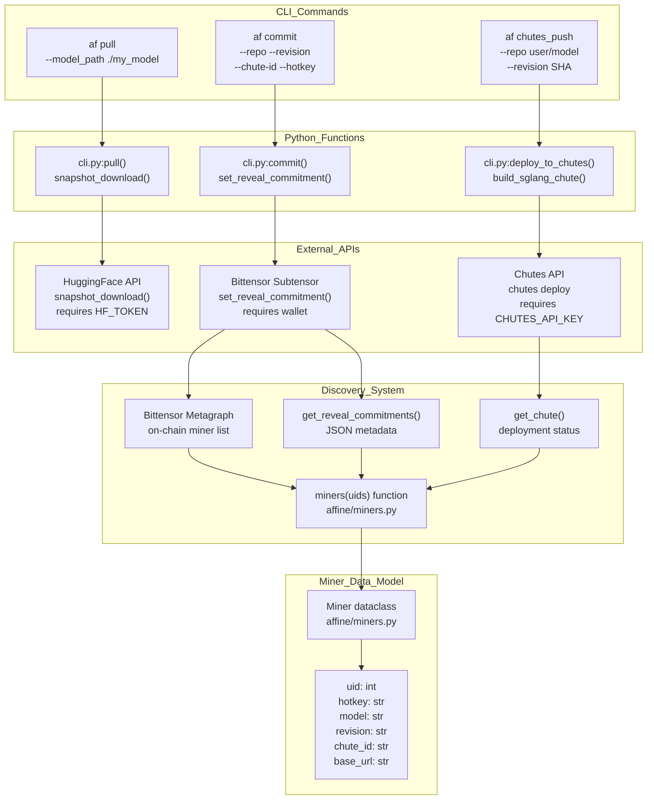
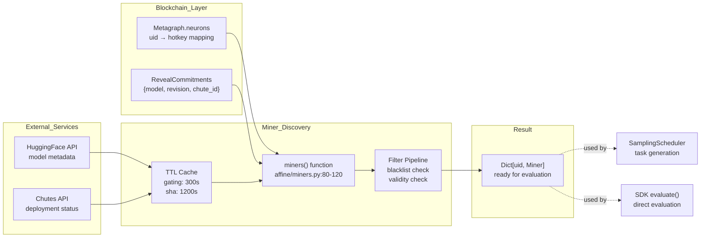

import CollapsibleAside from '../../../components/CollapsibleAside.astro';
import SourceLink from '../../../components/SourceLink.astro';
import Table from '../../../components/Table.astro';

<CollapsibleAside title="Relevant Source Files">
  <SourceLink text="affine/api/routers/miners.py" href="https://github.com/AffineFoundation/affine-cortex/blob/main/affine/api/routers/miners.py" />
  <SourceLink text="affine/api/routers/samples.py" href="https://github.com/AffineFoundation/affine-cortex/blob/main/affine/api/routers/samples.py" />
  <SourceLink text="affine/cli/main.py" href="https://github.com/AffineFoundation/affine-cortex/blob/main/affine/cli/main.py" />
  <SourceLink text="affine/cli/types.py" href="https://github.com/AffineFoundation/affine-cortex/blob/main/affine/cli/types.py" />
  <SourceLink text="affine/database/dao/miners.py" href="https://github.com/AffineFoundation/affine-cortex/blob/main/affine/database/dao/miners.py" />
  <SourceLink text="affine/database/dao/scores.py" href="https://github.com/AffineFoundation/affine-cortex/blob/main/affine/database/dao/scores.py" />
  <SourceLink text="affine/database/dao/system_config.py" href="https://github.com/AffineFoundation/affine-cortex/blob/main/affine/database/dao/system_config.py" />
  <SourceLink text="affine/src/miner/commands.py" href="https://github.com/AffineFoundation/affine-cortex/blob/main/affine/src/miner/commands.py" />
  <SourceLink text="affine/src/miner/main.py" href="https://github.com/AffineFoundation/affine-cortex/blob/main/affine/src/miner/main.py" />
  <SourceLink text="affine/src/monitor/miners_monitor.py" href="https://github.com/AffineFoundation/affine-cortex/blob/main/affine/src/monitor/miners_monitor.py" />
  <SourceLink text="affine/utils/model_size_checker.py" href="https://github.com/AffineFoundation/affine-cortex/blob/main/affine/utils/model_size_checker.py" />
  <SourceLink text="affine/utils/template_checker.py" href="https://github.com/AffineFoundation/affine-cortex/blob/main/affine/utils/template_checker.py" />
</CollapsibleAside>

This guide covers the complete process of participating in Affine as a miner—training models, deploying them to serverless inference endpoints, and earning rewards based on performance across evaluation environments.

**Scope**: This page provides an architectural overview of the miner role, workflow, and system interactions. For detailed operational guides, see:
- [Miner Overview](/subnets/for-miners/miner-overview#4.1) - Role definition, requirements, and rewards structure
- [Model Development](#4.2) - Training process and best practices
- [Deployment Workflow](/subnets/for-miners/deployment-workflow#4.3) - Step-by-step deployment instructions
- [Miner CLI Reference](/subnets/for-miners/miner-cli-reference#4.4) - Complete CLI command documentation

For validator-specific information, see [For Validators](/subnets/for-validators#5).

---

## What is a Miner?

A miner in Affine is a participant who trains reinforcement learning models and deploys them as publicly accessible inference endpoints. Unlike traditional cryptocurrency mining, Affine miners compete on model performance rather than computational proof-of-work.

**Key Responsibilities**:
- Train or fine-tune language models for agentic reasoning tasks
- Deploy models to Chutes.ai serverless infrastructure
- Maintain model availability for validator evaluation
- Continuously improve models to stay competitive

**Economic Model**: Miners earn $TAO emissions proportional to their model's performance across multiple evaluation environments, calculated using Pareto dominance scoring ([detailed in section 5.4](#5.4)).

Sources: <SourceLink text="README.md:1-15" href="https://github.com/AffineFoundation/affine-cortex/blob/main/README.md#L1-L15" />, <SourceLink text="FAQ.md:6-21" href="https://github.com/AffineFoundation/affine-cortex/blob/main/FAQ.md#L6-L21" />

---

## Miner Workflow Architecture

The following diagram illustrates the complete miner lifecycle, from model development through reward distribution:



Sources: <SourceLink text="README.md:76-138" href="https://github.com/AffineFoundation/affine-cortex/blob/main/README.md#L76-L138" />, <SourceLink text="affine/cli.py:303-473" href="https://github.com/AffineFoundation/affine-cortex/blob/main/affine/cli.py#L303-L473" />

---

## Miner-System Integration

This diagram maps the natural language workflow to specific code entities miners interact with:



Sources: <SourceLink text="affine/cli.py:303-473" href="https://github.com/AffineFoundation/affine-cortex/blob/main/affine/cli.py#L303-L473" />, <SourceLink text="affine/miners.py:1-200" href="https://github.com/AffineFoundation/affine-cortex/blob/main/affine/miners.py#L1-L200" />

---

## Prerequisites

Before mining on Affine, ensure you have the following:

<Table>

| Requirement | Details | Configuration |
|-------------|---------|---------------|
| **Bittensor Wallet** | Coldkey and hotkey registered on subnet 120 | `btcli subnet register --wallet.name <cold> --wallet.hotkey <hot>` |
| **HuggingFace Account** | For hosting model weights | Set `HF_TOKEN` in `.env` |
| **Chutes.ai Account** | For serverless model deployment | Set `CHUTES_API_KEY` in `.env` |
| **Chutes Funding** | TAO balance to pay for GPU inference time | Send TAO to address in `~/.chutes/config.ini` |
| **Model Training Infrastructure** | GPUs or cloud compute for RL training | Not provided by Affine |

</Table>


**Registration Commands**:
```bash
# Register Chutes account
chutes register

# Register on Bittensor subnet 120
btcli subnet register --wallet.name default --wallet.hotkey default --netuid 120
```

Sources: <SourceLink text="README.md:76-99" href="https://github.com/AffineFoundation/affine-cortex/blob/main/README.md#L76-L99" />, <SourceLink text="FAQ.md:17-23" href="https://github.com/AffineFoundation/affine-cortex/blob/main/FAQ.md#L17-L23" />

---

## Condensed Deployment Workflow

The complete miner workflow consists of six stages. Each stage must be completed successfully before proceeding to the next:

### 1. Pull Existing Model (Optional)
```bash
af pull <uid> --model_path ./base_model
```
Downloads the current top-performing model to use as a starting point. Uses [snapshot_download()]() from `huggingface_hub`.

### 2. Train/Improve Model
```bash
# Your RL training code here
# Output: model.safetensors, tokenizer files, config.json
```
This is where the "magic RL stuff" happens—not provided by Affine. See [Model Development](#4.2) for strategies.

### 3. Upload to HuggingFace
```bash
# Manual upload using huggingface-cli or git-lfs
huggingface-cli upload <user>/<repo> ./model_files
```
Obtain the commit SHA after upload—this becomes your `revision`.

### 4. Deploy to Chutes
```bash
af chutes_push --repo <user>/<repo> --revision <sha>
```
Generates [tmp_chute.py](), calls `chutes deploy`, returns `chute_id` in JSON output.

### 5. Commit to Blockchain
```bash
af commit --repo <user>/<repo> --revision <sha> --chute-id <id> --hotkey <hot>
```
Writes metadata to blockchain via [set_reveal_commitment()]() on subnet 120.

### 6. Monitor Performance
Access the live dashboard at [affine.io](https://affine.io) to track your model's scores across environments.

Sources: <SourceLink text="README.md:101-138" href="https://github.com/AffineFoundation/affine-cortex/blob/main/README.md#L101-L138" />, <SourceLink text="affine/cli.py:303-473" href="https://github.com/AffineFoundation/affine-cortex/blob/main/affine/cli.py#L303-L473" />

---

## Key Miner Concepts

### Model Commitment Structure
Each miner's on-chain commitment contains:
```json
{
  "model": "user/repo-name",
  "revision": "abc123def456...",  // HF commit SHA
  "chute_id": "cht_xyz789..."     // Chutes deployment ID
}
```
This links your blockchain identity (`uid`, `hotkey`) to your deployed inference endpoint.

### Chute Configuration
The `chutes_push` command generates a deployment specification using [build_sglang_chute()]():

<Table>

| Parameter | Default | Purpose |
|-----------|---------|---------|
| `image` | `chutes/sglang:nightly-2025081600` | SGLang runtime version |
| `concurrency` | `20` | Simultaneous inference requests |
| `gpu_count` | `1` | GPUs per instance |
| `include` | `["a100", "h100"]` | Allowed GPU types |
| `max_instances` | `1` | Maximum parallel instances |
| `shutdown_after_seconds` | `3600` | Idle timeout before shutdown |

</Table>


Modify these in [affine/cli.py:366-380]() before deploying.

### Validator Sampling
Validators use [miners()]() to discover your deployment:
1. Fetch metagraph from subnet 120
2. Read commitments via [get_reveal_commitments()]()
3. Verify Chute status via Chutes API
4. Filter out invalid/unavailable miners
5. Sample tasks across environments

If your Chute is "cold" (shut down), validators cannot evaluate it until it restarts.

Sources: <SourceLink text="affine/cli.py:344-429" href="https://github.com/AffineFoundation/affine-cortex/blob/main/affine/cli.py#L344-L429" />, <SourceLink text="affine/miners.py:50-150" href="https://github.com/AffineFoundation/affine-cortex/blob/main/affine/miners.py#L50-L150" />, <SourceLink text="FAQ.md:60-69" href="https://github.com/AffineFoundation/affine-cortex/blob/main/FAQ.md#L60-L69" />

---

## Evaluation and Scoring

### Environment Coverage
Miners are evaluated across 8 diverse environments:

**Affine Environments** (3):
- `SAT` - Boolean satisfiability problems
- `ABD` - Abstract behavioral description
- `DED` - Deductive reasoning tasks

**AgentGym Environments** (5):
- `ALFWORLD` - Interactive household tasks
- `WEBSHOP` - E-commerce navigation
- `BABYAI` - Grid-world instruction following
- `SCIWORLD` - Scientific reasoning
- `TEXTCRAFT` - Text-based crafting game

See [Evaluation Environments](/subnets/evaluation-environments#7) for detailed specifications.

### Pareto Dominance Scoring
Instead of winner-takes-all, Affine uses **comprehensive Pareto scoring**:
- A model earns points for dominating (outperforming) all other models on any subset of environments
- Scoring layers (`L1` through `L8`) represent subset sizes
- Models can specialize in specific environment combinations
- This prevents a single generalist model from capturing all rewards

Detailed algorithm in [Weight Calculation System](/subnets/for-validators/weight-calculation-system#5.4).

### Anti-Exploit Mechanisms
Affine implements multiple security measures:

<Table>

| Exploit Type | Prevention Method | Implementation |
|--------------|-------------------|----------------|
| **Model Copying** | Statistical significance testing | Beta distribution confidence intervals |
| **Timestamp Gaming** | First commit advantage | Block number tracking in commitments |
| **Sybil Attacks** | Hotkey-Chute binding | One Chute per hotkey verification |
| **Overfitting** | Diverse environments + sampling | 8 different task domains |

</Table>


Sources: <SourceLink text="FAQ.md:37-47" href="https://github.com/AffineFoundation/affine-cortex/blob/main/FAQ.md#L37-L47" />, <SourceLink text="README.md:9-13" href="https://github.com/AffineFoundation/affine-cortex/blob/main/README.md#L9-L13" />, <SourceLink text="affine/cal_weights.py:1-500" href="https://github.com/AffineFoundation/affine-cortex/blob/main/affine/cal_weights.py#L1-L500" />

---

## Miner Data Flow

This diagram shows how miner metadata flows through the system:



Sources: <SourceLink text="affine/miners.py:80-180" href="https://github.com/AffineFoundation/affine-cortex/blob/main/affine/miners.py#L80-L180" />, <SourceLink text="affine/scheduler/scheduler.py:100-200" href="https://github.com/AffineFoundation/affine-cortex/blob/main/affine/scheduler/scheduler.py#L100-L200" />

---

## Miner CLI Command Reference

The Affine CLI provides three miner-specific commands:

### `af pull`
Downloads an existing model from HuggingFace based on a miner's UID.

**Signature**: [affine/cli.py:303-342]()
```
af pull <uid> --model_path <path> [--hf-token <token>]
```

**Implementation**:
1. Calls [miners(uids=uid)]() to fetch miner metadata
2. Extracts `miner.model` and `miner.revision`
3. Uses `snapshot_download()` with specified revision
4. Downloads to local directory

### `af chutes_push`
Deploys a HuggingFace model to Chutes serverless infrastructure.

**Signature**: <SourceLink text="affine/cli.py:344-429" href="https://github.com/AffineFoundation/affine-cortex/blob/main/affine/cli.py#L344-L429" />
```
af chutes_push --repo <user/repo> --revision <sha> [--chutes-api-key <key>]
```

**Implementation**:
1. Generates [tmp_chute.py]() with `build_sglang_chute()` config
2. Executes `chutes deploy` subprocess
3. Parses output for deployment success
4. Calls [get_latest_chute_id()]() to retrieve `chute_id`
5. Returns JSON with deployment details

### `af commit`
Commits model metadata to Bittensor blockchain.

**Signature**: [affine/cli.py:431-473]()
```
af commit --repo <user/repo> --revision <sha> --chute-id <id> --hotkey <hot>
```

**Implementation**:
1. Constructs JSON: `{"model": repo, "revision": sha, "chute_id": id}`
2. Calls [set_reveal_commitment()]() on subnet 120
3. Handles `SpaceLimitExceeded` by waiting for next block
4. Returns success/failure JSON

For detailed usage examples, see [Miner CLI Reference](/subnets/for-miners/miner-cli-reference#4.4).

Sources: <SourceLink text="affine/cli.py:303-473" href="https://github.com/AffineFoundation/affine-cortex/blob/main/affine/cli.py#L303-L473" />

---

## Cost Considerations

Mining on Affine incurs the following costs:

<Table>

| Cost Category | Typical Amount | Payment Method |
|---------------|----------------|----------------|
| **Model Training** | Variable (cloud GPUs: $1-10/hr) | Your infrastructure |
| **HuggingFace Storage** | Free (public repos) | N/A |
| **Chutes Inference** | ~$0.50-2/hr per active hour | TAO to Chutes wallet |
| **Blockchain Transactions** | ~0.001 TAO per commit | From your hotkey |

</Table>


**Chutes Cost Management**:
- Configure `shutdown_after_seconds` to balance availability vs. cost
- Monitor your Chutes balance at `~/.chutes/config.ini`
- Chutes only charges when your instance is active (receiving requests)

**Breakeven Analysis**:
- Typical subnet emissions: ~300-500 TAO/day distributed across all miners
- Top performers (L8 dominance): 20-40% of emissions
- Mid-tier performers: 5-10% of emissions
- Ensure your model's emissions exceed Chutes + training costs

Sources: <SourceLink text="README.md:85-94" href="https://github.com/AffineFoundation/affine-cortex/blob/main/README.md#L85-L94" />, <SourceLink text="FAQ.md:60-69" href="https://github.com/AffineFoundation/affine-cortex/blob/main/FAQ.md#L60-L69" />

---

## Common Miner Issues

### Issue: Chute Stays Cold
**Symptoms**: No evaluation requests, zero samples on dashboard

**Causes**:
- Default `shutdown_after_seconds=3600` causes shutdown after 1 hour idle
- Validators only sample "hot" miners

**Solutions**:
1. Increase `shutdown_after_seconds` in [affine/cli.py:379]()
2. Implement a keepalive script to ping your Chute every 5-10 minutes
3. Monitor Chutes dashboard for instance status

### Issue: Model Not Appearing on Leaderboard
**Symptoms**: Successful deployment but no scores

**Diagnosis Steps**:
1. Verify on-chain commit: `btcli wallet overview --netuid 120`
2. Check Chute status on chutes.ai dashboard
3. Confirm `revision` matches between commit and Chute deployment
4. Wait 10,000+ blocks (~1-2 days) for sufficient sampling

### Issue: Chute Deployment Fails
**Error**: `Chutes deploy failed`

**Common Causes**:
- Outdated `image` version in [affine/cli.py:370]()
- Corrupted `model.safetensors` on HuggingFace
- Invalid `engine_args` syntax
- Insufficient Chutes balance

**Debugging**: Retrieve logs using Chutes API with your instance ID (see pinned Discord message for guide)

Sources: <SourceLink text="FAQ.md:60-82" href="https://github.com/AffineFoundation/affine-cortex/blob/main/FAQ.md#L60-L82" />

---

## Development Cycle Best Practices

### Iterative Improvement Strategy
1. **Baseline**: Start by pulling the current L8 winner: `af pull <top_uid>`
2. **Targeted Training**: Focus RL training on environments where baseline underperforms
3. **Incremental Deployment**: Deploy improved model and monitor 1-2 environment scores
4. **Full Evaluation**: Wait for comprehensive scoring across all environments
5. **Repeat**: If performance improves, continue training; if not, investigate failure modes

### Model Evaluation Before Deployment
Test locally using the SDK before committing resources:
```python
import affine as af

# Evaluate against specific environments
env = af.SAT()
result = await env.evaluate(
    model="your-local-model-path",
    base_url="http://localhost:8000/v1"
)
print(f"Local score: {result.score}")
```

### Version Control
- Tag each HuggingFace commit with training metadata
- Maintain a log of: training hyperparameters, dataset versions, evaluation scores
- This enables rollback if a new version underperforms

Sources: <SourceLink text="README.md:164-222" href="https://github.com/AffineFoundation/affine-cortex/blob/main/README.md#L164-L222" />, <SourceLink text="FAQ.md:32-36" href="https://github.com/AffineFoundation/affine-cortex/blob/main/FAQ.md#L32-L36" />

---

## Security Considerations

### Hotkey Protection
Your hotkey controls your mining rewards. Protect it:
- Store wallet files with restricted permissions: `chmod 600 ~/.bittensor/wallets/*/hotkeys/*`
- Use separate hotkeys for different subnets
- Never commit wallet files to version control

### Chutes API Key Security
The `CHUTES_API_KEY` grants deployment and billing access:
- Store in `.env`, never in code
- Rotate keys periodically via chutes.ai dashboard
- Use separate keys for development vs. production

### Model Intellectual Property
Models deployed to Chutes are **publicly accessible**:
- Any validator or user can query your model
- Consider this when training on proprietary datasets
- Affine's anti-copying mechanisms provide economic disincentives, not technical prevention

Sources: [affine/cli.py:344-429]()

---

## Next Steps

Now that you understand the miner workflow, proceed to:

1. **[Miner Overview](/subnets/for-miners/miner-overview#4.1)** - Detailed role definition and economic analysis
2. **[Model Development](#4.2)** - RL training strategies and best practices
3. **[Deployment Workflow](/subnets/for-miners/deployment-workflow#4.3)** - Step-by-step deployment guide with troubleshooting
4. **[Miner CLI Reference](/subnets/for-miners/miner-cli-reference#4.4)** - Complete CLI documentation with examples

For SDK-based development and testing, see [SDK Reference](/subnets/sdk-reference#6).

For understanding how validators evaluate your model, see [For Validators](/subnets/for-validators#5).

Sources: <SourceLink text="README.md:1-223" href="https://github.com/AffineFoundation/affine-cortex/blob/main/README.md#L1-L223" />, <SourceLink text="FAQ.md:1-100" href="https://github.com/AffineFoundation/affine-cortex/blob/main/FAQ.md#L1-L100" />
