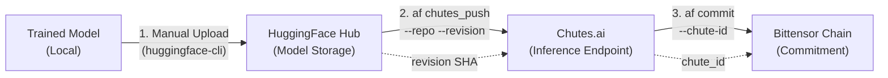
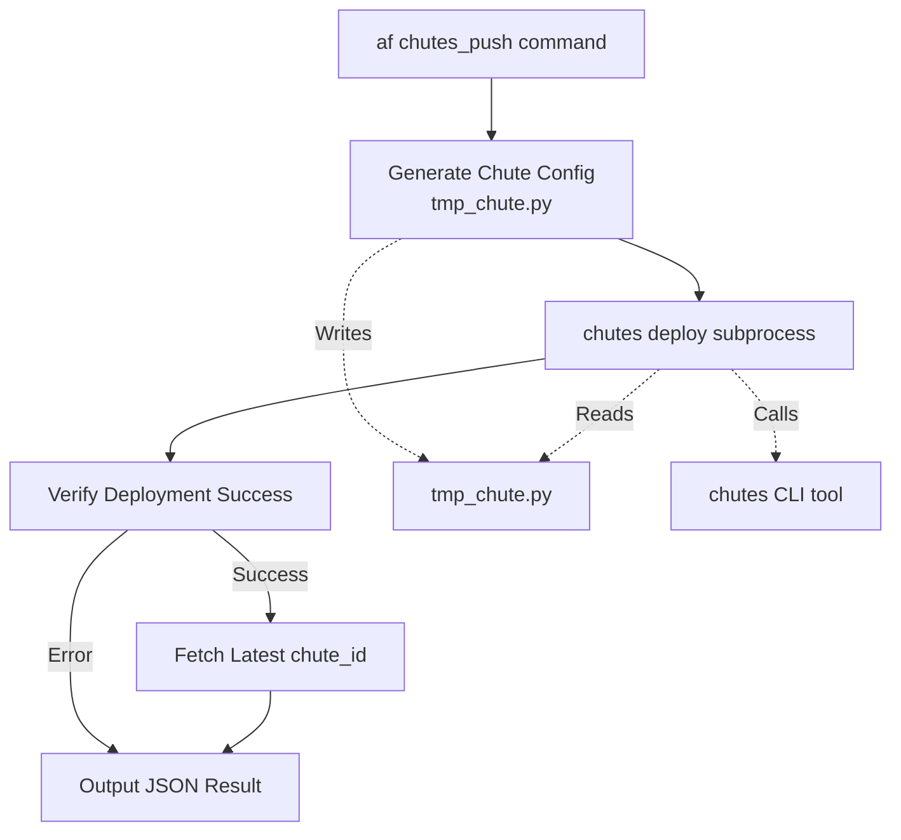
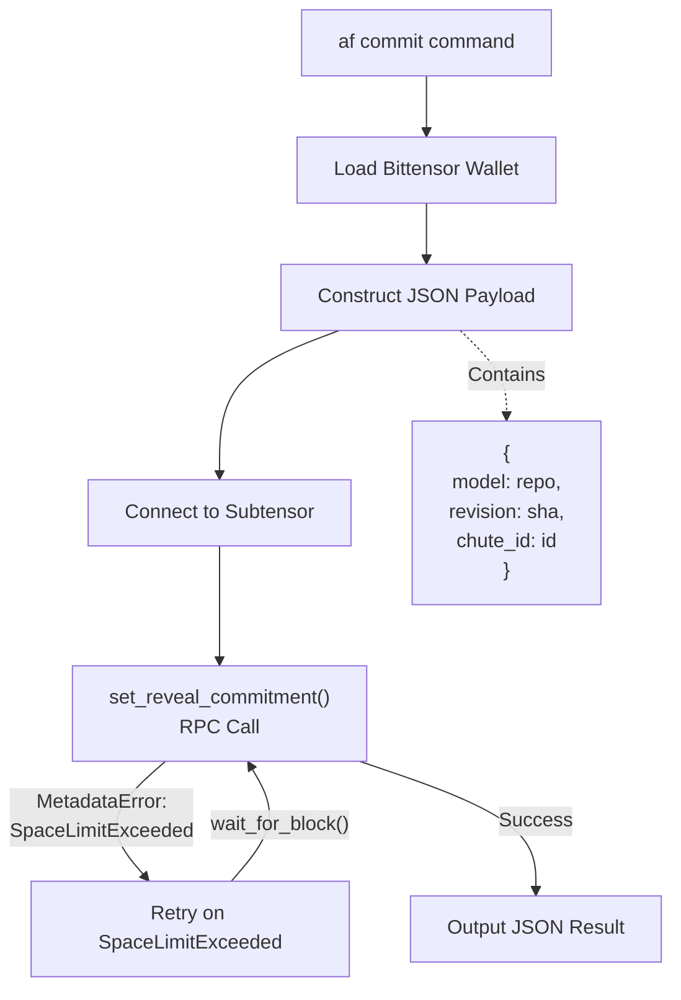

import CollapsibleAside from '../../../../components/CollapsibleAside.astro';
import SourceLink from '../../../../components/SourceLink.astro';
import Table from '../../../../components/Table.astro';

<CollapsibleAside title="Relevant Source Files">
  <SourceLink text=".env.example" href="https://github.com/AffineFoundation/affine-cortex/blob/main/.env.example" />
  <SourceLink text="README.md" href="https://github.com/AffineFoundation/affine-cortex/blob/main/README.md" />
  <SourceLink text="affine/__init__.py" href="https://github.com/AffineFoundation/affine-cortex/blob/main/affine/__init__.py" />
  <SourceLink text="affine/api/routers/samples.py" href="https://github.com/AffineFoundation/affine-cortex/blob/main/affine/api/routers/samples.py" />
  <SourceLink text="affine/cli/main.py" href="https://github.com/AffineFoundation/affine-cortex/blob/main/affine/cli/main.py" />
  <SourceLink text="affine/cli/types.py" href="https://github.com/AffineFoundation/affine-cortex/blob/main/affine/cli/types.py" />
  <SourceLink text="affine/src/miner/commands.py" href="https://github.com/AffineFoundation/affine-cortex/blob/main/affine/src/miner/commands.py" />
  <SourceLink text="affine/src/miner/main.py" href="https://github.com/AffineFoundation/affine-cortex/blob/main/affine/src/miner/main.py" />
  <SourceLink text="tests/test_private_repo_workflow.py" href="https://github.com/AffineFoundation/affine-cortex/blob/main/tests/test_private_repo_workflow.py" />
</CollapsibleAside>

## Purpose and Scope

This page documents the complete deployment workflow for miners on the Affine subnet. It covers the three-phase process of getting a trained model into production: uploading to HuggingFace Hub, deploying to Chutes.ai for serverless inference, and committing the deployment on-chain to the Bittensor blockchain.

For information about model training and development prior to deployment, see [Model Development](#4.2). For details on the CLI commands themselves, see [Miner CLI Reference](/subnets/for-miners/miner-cli-reference#4.4).

**Sources:** [README.md:76-138](), [affine/cli.py:303-473]()

---

## Overview: Three-Phase Deployment

The miner deployment workflow is strictly sequential and consists of three distinct phases:



**Diagram: End-to-End Miner Deployment Process**

Each phase produces artifacts required by the next phase:
- **Phase 1** produces a HuggingFace `revision` (commit SHA)
- **Phase 2** produces a `chute_id` (deployment identifier)
- **Phase 3** writes the complete commitment to blockchain metadata

**Sources:** [README.md:101-137](), [affine/cli.py:344-473]()

---

## Prerequisites

Before beginning deployment, ensure you have:

<Table>

| Requirement | Description | Configuration |
|------------|-------------|---------------|
| **HuggingFace Account** | Public repository for model hosting | Token stored in `HF_TOKEN` env var |
| **Chutes.ai Account** | Registered with `chutes register` command | API key in `CHUTES_API_KEY` env var |
| **Chutes Funding** | TAO balance for GPU compute costs | Payment address in `~/.chutes/config.ini` |
| **Bittensor Registration** | Registered on subnet 120 | Wallet configured with coldkey/hotkey |
| **Trained Model** | Local model artifacts ready for upload | Compatible with SGLang runtime |

</Table>


**Important:** The Chutes account must be registered with the **same hotkey** used for mining on Affine to avoid developer deposit requirements.

**Sources:** [README.md:79-99](), [FAQ.md:17-22]()

---

## Phase 1: Upload to HuggingFace

The first phase is a **manual process** where you upload your trained model to HuggingFace Hub. Affine does not provide automation for this step.

### Step 1.1: Create or Select Repository

Choose an existing HuggingFace model repository or create a new one:
- Repository naming convention: `<username>/Affine-<descriptive-name>`
- Must be a **model** repository (not dataset or space)
- Repository should be public for validator access

### Step 1.2: Upload Model Artifacts

Upload your model files using your preferred method:
- `huggingface-cli upload` command
- Git LFS for large files
- HuggingFace web interface

Required artifacts depend on your model architecture, but typically include:
- `model.safetensors` or `pytorch_model.bin`
- `config.json`
- `tokenizer.json` and tokenizer configuration files
- Any additional model-specific files

### Step 1.3: Obtain Commit SHA

After uploading, obtain the **full commit SHA** (40-character hex string) for the revision you want to deploy. This is available:
- From the HuggingFace web UI in the commit history
- From `git log` if using Git LFS workflow
- From the response of `huggingface-cli upload` command

**Example:**
```bash
# Example commit SHA (not a real value)
revision="a1b2c3d4e5f6g7h8i9j0k1l2m3n4o5p6q7r8s9t0"
```

**Sources:** [README.md:111-114](), [affine/cli.py:303-341]()

---

## Phase 2: Deploy to Chutes

The second phase deploys your HuggingFace model to Chutes.ai as a serverless inference endpoint using the `af chutes_push` command.

### Command Syntax

```bash
af -vvv chutes_push \
  --repo <user/repo> \
  --revision <commit-sha> \
  --chutes-api-key <api-key>
```

### Deployment Process



**Diagram: chutes_push Command Flow**

### Generated Configuration

The command generates a temporary Chute configuration file at [affine/cli.py:359-382]():

```python
# Template used by deploy_to_chutes() function
chute = build_sglang_chute(
    username="{chute_user}",           # From CHUTE_USER env var
    readme="{repo}",                   # HuggingFace repo id
    model_name="{repo}",               # Same as readme
    image="chutes/sglang:nightly-...", # SGLang Docker image
    concurrency=20,                     # Request concurrency
    revision="{revision}",              # HF commit SHA
    node_selector=NodeSelector(
        gpu_count=1,
        include=["a100", "h100"],      # GPU requirements
    ),
    max_instances=1,                    # Max replicas
    scale_threshold=0.5,                # Scaling trigger
    shutdown_after_seconds=3600,        # Idle shutdown (1 hour)
)
```

### Customizing Deployment Settings

To customize deployment parameters (GPU type, concurrency, scaling, etc.), you must **modify the source code** at [affine/cli.py:359-382]():

1. Open `affine/cli.py`
2. Locate the `deploy_to_chutes()` function inside `chutes_push` command
3. Edit the arguments passed to `build_sglang_chute()`
4. Refer to [Chutes documentation](https://github.com/chutesai/chutes) for available options

**Key Configuration Parameters:**

<Table>

| Parameter | Description | Default | Recommendations |
|-----------|-------------|---------|-----------------|
| `concurrency` | Simultaneous inference requests | 20 | Increase for high demand |
| `gpu_count` | GPUs per instance | 1 | Increase for large models |
| `include` | Allowed GPU types | `["a100", "h100"]` | Match model requirements |
| `max_instances` | Maximum replicas | 1 | Increase for redundancy |
| `shutdown_after_seconds` | Idle timeout | 3600 | Increase to stay "hot" |

</Table>


### Command Output

On success, the command outputs JSON containing the deployment information:

```json
{
  "success": true,
  "chute_id": "chute_abc123...",
  "chute": {
    "id": "chute_abc123...",
    "name": "user-repo-revision",
    "status": "active",
    "endpoint": "https://..."
  },
  "repo": "user/repo",
  "revision": "a1b2c3d4..."
}
```

**Save the `chute_id` value** - it is required for Phase 3.

**Sources:** [affine/cli.py:344-428](), [README.md:117-133]()

---

## Phase 3: Commit to Blockchain

The final phase commits your model deployment information to the Bittensor blockchain using the `af commit` command. This makes your model visible to validators for evaluation.

### Command Syntax

```bash
af -vvv commit \
  --repo <user/repo> \
  --revision <commit-sha> \
  --chute-id <chute-id> \
  --coldkey <wallet-name> \
  --hotkey <hotkey-name>
```

### Commitment Process



**Diagram: Blockchain Commitment Flow**

### Implementation Details

The commit operation is handled at [affine/cli.py:443-457]():

1. **Construct Commitment Data**: JSON-encoded string containing model metadata
   ```python
   data = json.dumps({
       "model": repo,
       "revision": revision,
       "chute_id": chute_id
   })
   ```

2. **Call Subtensor RPC**: Uses `set_reveal_commitment()` with `blocks_until_reveal=1`
   - `wallet`: Your coldkey/hotkey pair
   - `netuid`: Subnet 120 (NETUID constant)
   - `data`: JSON payload
   - `blocks_until_reveal`: Set to 1 for immediate reveal

3. **Handle SpaceLimitExceeded**: If blockchain metadata space is full, wait for next block and retry

### Wallet Configuration

The command accepts optional wallet parameters:
- `--coldkey`: Defaults to `BT_WALLET_COLD` env var or `"default"`
- `--hotkey`: Defaults to `BT_WALLET_HOT` env var or `"default"`

Wallet files must exist in `~/.bittensor/wallets/`:
```
~/.bittensor/wallets/
├── <coldkey>/
│   └── hotkeys/
│       └── <hotkey>
```

### Command Output

On success:
```json
{
  "success": true,
  "repo": "user/repo",
  "revision": "a1b2c3d4...",
  "chute_id": "chute_abc123..."
}
```

On failure:
```json
{
  "success": false,
  "error": "MetadataError: ..."
}
```

**Sources:** [affine/cli.py:431-473](), [README.md:134-137]()

---

## Verification and Monitoring

After completing all three phases, verify your deployment is working correctly.

### Verification Checklist

<Table>

| Check | Method | Expected Result |
|-------|--------|-----------------|
| **HuggingFace Commit** | Visit `https://huggingface.co/<repo>/tree/<revision>` | Files visible, correct SHA |
| **Chute Status** | Use Chutes CLI or web dashboard | Status: "active" or "idle" |
| **Blockchain Commitment** | Query metagraph or use block explorer | Metadata contains your commitment |
| **Validator Evaluation** | Monitor Affine dashboard at affine.io | UID appears with evaluation results |

</Table>


### Monitoring Chute Health

Check your Chute logs for errors using the Chutes CLI:

```bash
# Get instance logs (see Discord pinned message for detailed guide)
chutes logs <instance-id> --api-key <CHUTES_API_KEY>
```

Common log checks:
- Model loading successfully
- Inference requests being processed
- No CUDA out-of-memory errors
- No timeout errors

### Keeping Chutes "Hot"

Chutes automatically shut down after `shutdown_after_seconds` of inactivity to save costs. To ensure validator evaluation requests don't hit a cold Chute:

1. **Increase shutdown timeout** in deployment config (e.g., 3600 seconds = 1 hour)
2. **Implement keep-alive script** that periodically sends inference requests
3. **Monitor validator sampling patterns** to anticipate request timing

**Sources:** [FAQ.md:60-78](), [README.md:122-128]()

---

## Troubleshooting

### Common Deployment Issues

<Table>

| Issue | Symptoms | Solution |
|-------|----------|----------|
| **Invalid HF Token** | `chutes_push` fails with authentication error | Set `HF_TOKEN` env var or use `--hf-token` |
| **Insufficient Chutes Balance** | Deployment succeeds but Chute never starts | Fund Chutes account with TAO at payment address |
| **SpaceLimitExceeded** | `commit` command loops indefinitely | Wait for blockchain space to clear, automatic retry |
| **Chute Deployment Failed** | Log shows "ERROR" in output | Check Chute logs with `chutes logs <instance-id>` |
| **Model Not on Leaderboard** | Commitment succeeds but no evaluation | Wait 10,000 blocks (~1 day) for evaluation window |

</Table>


### Deployment Fails with "ERROR" Log

When `chutes_push` fails at [affine/cli.py:408-410](), the issue is almost always in the Chute configuration:

1. **Check for typos** in `engine_args` or other parameters
2. **Verify image version** matches required format: `chutes/sglang:YYYYMMDDHH`
3. **Ensure model files** are complete and not corrupted on HuggingFace
4. **Review Chute logs** for specific error messages

### Chute Shows as "Cold"

If validators cannot query your model because it's shut down:

1. Edit `shutdown_after_seconds` in [affine/cli.py:379]() to a higher value
2. Redeploy with `af chutes_push`
3. Create a simple keep-alive script:
   ```python
   # Example keep-alive (not in codebase)
   import httpx
   import asyncio
   
   async def keep_warm():
       while True:
           await httpx.post("https://your-chute.chutes.ai/v1/completions", 
                          json={"prompt": "test", "max_tokens": 1})
           await asyncio.sleep(300)  # Every 5 minutes
   ```

### Commitment Mismatch

If your on-chain commitment doesn't match your deployed Chute:

1. Verify `revision` SHA matches exactly between HuggingFace, Chutes, and blockchain
2. Confirm `chute_id` from `chutes_push` output matches `commit` command input
3. Check `repo` format is `username/reponame` (no prefix or suffix)
4. Re-run `commit` command with correct parameters if needed

**Sources:** [FAQ.md:50-82](), [affine/cli.py:403-415]()

---

## Complete Workflow Example

Here is a complete example of the three-phase deployment:

```bash
# Prerequisites: Set environment variables
export CHUTES_API_KEY="your-chutes-api-key"
export HF_TOKEN="your-hf-token"
export CHUTE_USER="your-chutes-username"
export BT_WALLET_COLD="my_coldkey"
export BT_WALLET_HOT="my_hotkey"

# PHASE 1: Upload to HuggingFace (manual)
# Assume you've uploaded and obtained revision:
REPO="myusername/Affine-MyModel"
REVISION="a1b2c3d4e5f6g7h8i9j0k1l2m3n4o5p6q7r8s9t0"

# PHASE 2: Deploy to Chutes
af -vvv chutes_push \
  --repo $REPO \
  --revision $REVISION \
  --chutes-api-key $CHUTES_API_KEY

# Output will contain:
# {
#   "success": true,
#   "chute_id": "chute_abc123xyz...",
#   ...
# }

# Save the chute_id
CHUTE_ID="chute_abc123xyz..."

# PHASE 3: Commit to blockchain
af -vvv commit \
  --repo $REPO \
  --revision $REVISION \
  --chute-id $CHUTE_ID \
  --coldkey $BT_WALLET_COLD \
  --hotkey $BT_WALLET_HOT

# Output:
# {
#   "success": true,
#   "repo": "myusername/Affine-MyModel",
#   "revision": "a1b2c3d4...",
#   "chute_id": "chute_abc123xyz..."
# }

# Deployment complete! Monitor at https://affine.io/
```

**Sources:** [README.md:101-137](), [affine/cli.py:303-473]()

---

## Related Commands

For pulling existing models from the network, see the `pull` command documented at [affine/cli.py:303-341](). This command downloads a model from another miner's HuggingFace repository:

```bash
af pull <uid> --model_path ./my_model
```

This is useful for:
- Downloading the current Pareto frontier model to improve upon
- Inspecting competitor models for training insights
- Creating a local baseline for testing

**Sources:** [affine/cli.py:303-341](), [README.md:101-104]()
