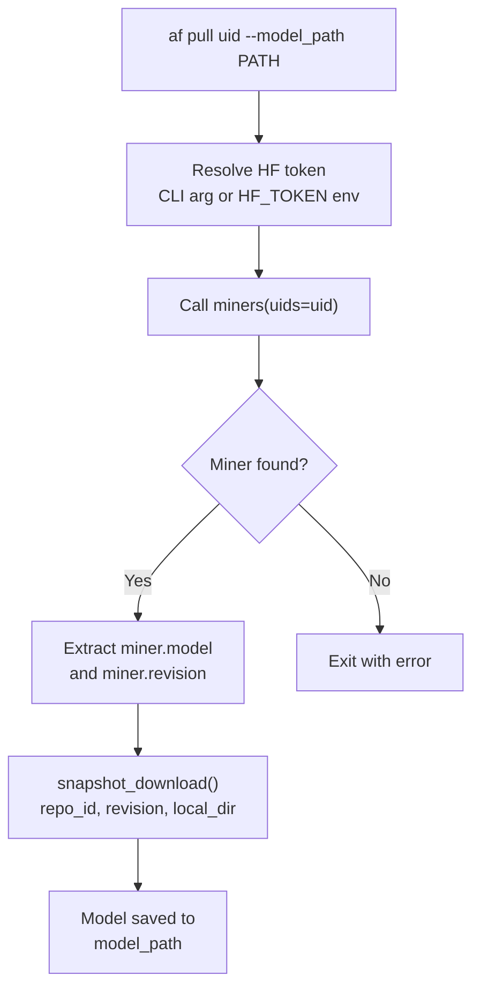
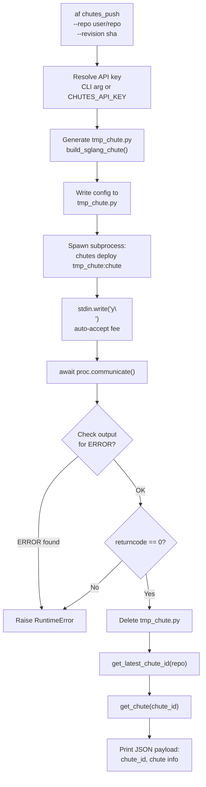
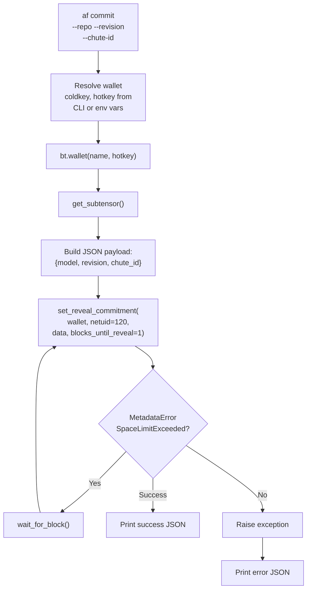
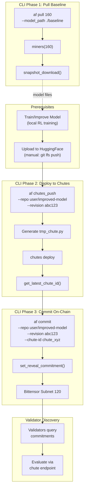

import CollapsibleAside from '../../../../components/CollapsibleAside.astro';
import SourceLink from '../../../../components/SourceLink.astro';
import Table from '../../../../components/Table.astro';

<CollapsibleAside title="Relevant Source Files">
  <SourceLink text="affine/api/routers/samples.py" href="https://github.com/AffineFoundation/affine-cortex/blob/main/affine/api/routers/samples.py" />
  <SourceLink text="affine/cli/main.py" href="https://github.com/AffineFoundation/affine-cortex/blob/main/affine/cli/main.py" />
  <SourceLink text="affine/cli/types.py" href="https://github.com/AffineFoundation/affine-cortex/blob/main/affine/cli/types.py" />
  <SourceLink text="affine/src/miner/commands.py" href="https://github.com/AffineFoundation/affine-cortex/blob/main/affine/src/miner/commands.py" />
  <SourceLink text="affine/src/miner/main.py" href="https://github.com/AffineFoundation/affine-cortex/blob/main/affine/src/miner/main.py" />
</CollapsibleAside>

This page provides detailed technical documentation for the three CLI commands used by miners to deploy models on the Affine network: `pull`, `chutes_push`, and `commit`. These commands form the core miner deployment workflow.

For a step-by-step guide to the deployment process, see [Deployment Workflow](/subnets/for-miners/deployment-workflow#4.3). For information about the miner role and requirements, see [Miner Overview](/subnets/for-miners/miner-overview#4.1).

---

## Overview

The Affine miner workflow consists of three distinct phases, each implemented as a separate CLI command:

<Table>

| Command | Purpose | Primary Operations |
|---------|---------|-------------------|
| `af pull` | Download existing model | Query blockchain → Fetch from HuggingFace |
| `af chutes_push` | Deploy to serverless | Generate config → Deploy to Chutes → Get chute_id |
| `af commit` | Register on blockchain | Commit metadata → Set reveal commitment |

```mermaid
graph LR
    subgraph "Phase 1: Model Acquisition"
        PULL["af pull uid"]
        MINERS["miners(uid)"]
        HF_DOWN["snapshot_download()"]
    end
    
    subgraph "Phase 2: Deployment"
        PUSH["af chutes_push"]
        CONFIG["Generate chutes_config.py"]
        DEPLOY["chutes deploy"]
        CHUTE_ID["get_latest_chute_id()"]
    end
    
    subgraph "Phase 3: Registration"
        COMMIT["af commit"]
        SET_COMMIT["set_reveal_commitment()"]
        BLOCKCHAIN["Bittensor Chain"]
    end
    
    PULL --> MINERS
    MINERS --> HF_DOWN
    
    PUSH --> CONFIG
    CONFIG --> DEPLOY
    DEPLOY --> CHUTE_ID
    
    COMMIT --> SET_COMMIT
    SET_COMMIT --> BLOCKCHAIN
    
    HF_DOWN -.->|model files| PUSH
    CHUTE_ID -.->|chute_id| COMMIT
```

</Table>




**Sources:** [affine/cli.py:303-473]()

---

## af pull

The `pull` command downloads a model from HuggingFace for a given miner UID. This is typically used to obtain the current best model as a starting point for training.

### Command Signature

```bash
af pull UID --model_path PATH [--hf-token TOKEN]
```

### Parameters

<Table>

| Parameter | Type | Required | Default | Description |
|-----------|------|----------|---------|-------------|
| `UID` | int | Yes | - | The Bittensor UID of the miner whose model to download |
| `--model_path` / `-p` | Path | Yes | `./model_path` | Local directory to save the downloaded model |
| `--hf-token` | str | No | `$HF_TOKEN` | HuggingFace API token for authentication |

</Table>


### Execution Flow



### Implementation Details

The command performs the following operations:

1. **Token Resolution**: Retrieves HuggingFace token from CLI argument or `HF_TOKEN` environment variable via `get_conf()` [affine/cli.py:317]()

2. **Miner Discovery**: Calls `miners(uids=uid)` to fetch miner metadata from the blockchain and Chutes API [affine/cli.py:319]()

3. **Validation**: Checks if miner exists for the given UID; exits with error if not found [affine/cli.py:322-324]()

4. **Download**: Uses `huggingface_hub.snapshot_download()` with the following parameters:
   - `repo_id`: Miner's HuggingFace repository (`miner.model`)
   - `revision`: Specific commit SHA (`miner.revision`)
   - `local_dir`: Destination path
   - `resume_download=True`: Enables resumption of interrupted downloads [affine/cli.py:329-336]()

### Usage Examples

```bash
# Download model from UID 160 to default path
af pull 160 --model_path ./my_model

# Download with explicit HF token
af pull 160 --model_path ./my_model --hf-token hf_...

# Use environment variable for token
export HF_TOKEN=hf_...
af pull 160 -p ./models/baseline
```

### Error Handling

<Table>

| Error Condition | Exit Code | Message |
|----------------|-----------|---------|
| Miner not found | 1 | `No miner found for UID {uid}` |
| Download failure | 1 | `Error pulling model: {exception}` |

</Table>


**Sources:** [affine/cli.py:303-341](), [affine/miners.py]()

---

## af chutes_push

The `chutes_push` command deploys a HuggingFace model to the Chutes.ai serverless inference platform. This creates a "chute" (serverless endpoint) that validators can query.

### Command Signature

```bash
af chutes_push --repo REPO --revision SHA [--chutes-api-key KEY]
```

### Parameters

<Table>

| Parameter | Type | Required | Default | Description |
|-----------|------|----------|---------|-------------|
| `--repo` | str | Yes | - | HuggingFace repository ID (format: `user/repo`) |
| `--revision` | str | Yes | - | Git commit SHA of the model to deploy |
| `--chutes-api-key` | str | No | `$CHUTES_API_KEY` | Chutes API key for authentication |

</Table>


### Execution Flow



### Chutes Configuration Template

The command generates a Python configuration file with the following structure [affine/cli.py:359-381]():

```python
import os
from chutes.chute import NodeSelector
from chutes.chute.template.sglang import build_sglang_chute

os.environ["NO_PROXY"] = "localhost,127.0.0.1"

chute = build_sglang_chute(
    username="{chute_user}",              # From CHUTE_USER env var
    readme="{repo}",                       # HF repo name
    model_name="{repo}",                   # Model identifier
    image="chutes/sglang:nightly-2025081600",  # SGLang image version
    concurrency=20,                        # Max concurrent requests
    revision="{revision}",                 # Git commit SHA
    node_selector=NodeSelector(
        gpu_count=1,
        include=["a100", "h100"],         # Accepted GPU types
    ),
    max_instances=1,                       # Scaling limit
    scale_threshold=0.5,                   # Scale trigger (50% utilization)
    shutdown_after_seconds=3600,           # Idle timeout (1 hour)
)
```

### Deployment Process

1. **Configuration Generation**: Creates a temporary `tmp_chute.py` with deployment parameters [affine/cli.py:383-385]()

2. **Subprocess Execution**: Spawns `chutes deploy tmp_chute:chute --accept-fee` command [affine/cli.py:388-394]()

3. **Auto-Confirmation**: Automatically accepts fee prompt by writing `y\n` to stdin [affine/cli.py:396-399]()

4. **Output Validation**: Parses output for ERROR patterns using regex [affine/cli.py:405-413]()

5. **Cleanup**: Removes temporary configuration file [affine/cli.py:414]()

6. **Metadata Retrieval**: Fetches `chute_id` and full chute details [affine/cli.py:419-420]()

7. **Result Output**: Prints JSON payload with deployment information [affine/cli.py:421-428]()

### Output Format

```json
{
  "success": true,
  "chute_id": "chute_abc123...",
  "chute": {
    "id": "chute_abc123...",
    "status": "active",
    "endpoint": "https://..."
  },
  "repo": "user/model-repo",
  "revision": "a1b2c3d4..."
}
```

### Customization

To modify deployment parameters (GPU type, concurrency, scaling), edit the `build_sglang_chute()` call in [affine/cli.py:366-380](). See the [Chutes documentation](https://github.com/chutesai/chutes) for available options.

### Common Issues

<Table>

| Issue | Cause | Solution |
|-------|-------|----------|
| `ERROR` in output | Invalid config parameters | Check Chutes logs; verify `engine_args` syntax |
| `returncode != 0` | Deployment failure | Ensure model exists at specified revision |
| Insufficient funds | Low Chutes balance | Fund account at address in `~/.chutes/config.ini` |
| Image version error | Outdated SGLang image | Update `image` parameter to required version |

</Table>


**Sources:** [affine/cli.py:344-428](), [affine/miners.py:get_latest_chute_id](), [affine/miners.py:get_chute]()

---

## af commit

The `commit` command registers deployment metadata on the Bittensor blockchain, making the miner discoverable by validators. This is the final step in the deployment workflow.

### Command Signature

```bash
af commit --repo REPO --revision SHA --chute-id ID [--coldkey KEY] [--hotkey KEY]
```

### Parameters

<Table>

| Parameter | Type | Required | Default | Description |
|-----------|------|----------|---------|-------------|
| `--repo` | str | Yes | - | HuggingFace repository ID |
| `--revision` | str | Yes | - | Git commit SHA |
| `--chute-id` | str | Yes | - | Chutes deployment ID (from `chutes_push`) |
| `--coldkey` | str | No | `$BT_WALLET_COLD` or `"default"` | Bittensor cold wallet name |
| `--hotkey` | str | No | `$BT_WALLET_HOT` or `"default"` | Bittensor hot wallet name |

</Table>


### Execution Flow



### Implementation Details

1. **Wallet Resolution**: Loads Bittensor wallet from CLI arguments or environment variables [affine/cli.py:439-441]()

2. **Subtensor Connection**: Establishes connection to Bittensor network via `get_subtensor()` [affine/cli.py:444]()

3. **Payload Construction**: Creates JSON string with model metadata [affine/cli.py:445]():
   ```json
   {
     "model": "user/repo",
     "revision": "a1b2c3d4...",
     "chute_id": "chute_abc123..."
   }
   ```

4. **Commitment Submission**: Calls `set_reveal_commitment()` with:
   - `wallet`: Bittensor wallet object
   - `netuid`: 120 (Affine subnet ID)
   - `data`: JSON payload string
   - `blocks_until_reveal`: 1 (immediate reveal) [affine/cli.py:448-450]()

5. **Error Handling**: Retries on `SpaceLimitExceeded` by waiting for next block [affine/cli.py:452-456]()

### Commitment System

The Bittensor commitment mechanism works as follows:

- **Commitment**: Metadata is hashed and stored on-chain
- **Reveal**: After `blocks_until_reveal` blocks, the data is revealed
- **Discovery**: Validators query commitments to discover miners

Setting `blocks_until_reveal=1` ensures immediate availability to validators.

### Output Formats

**Success:**
```json
{
  "success": true,
  "repo": "user/model-repo",
  "revision": "a1b2c3d4...",
  "chute_id": "chute_abc123..."
}
```

**Failure:**
```json
{
  "success": false,
  "error": "MetadataError: ..."
}
```

### Environment Variables

<Table>

| Variable | Purpose | Default |
|----------|---------|---------|
| `BT_WALLET_COLD` | Cold wallet name | `"default"` |
| `BT_WALLET_HOT` | Hot wallet name | `"default"` |

</Table>


### Usage Examples

```bash
# Commit with default wallets
af commit --repo user/my-model --revision a1b2c3d4 --chute-id chute_abc123

# Commit with specific wallets
af commit \
  --repo user/my-model \
  --revision a1b2c3d4 \
  --chute-id chute_abc123 \
  --coldkey my_cold \
  --hotkey my_hot
```

### Error Scenarios

<Table>

| Error | Description | Resolution |
|-------|-------------|------------|
| `SpaceLimitExceeded` | Too many commitments in current block | Automatically retried after next block |
| `MetadataError` (other) | Invalid data or wallet issue | Check wallet access and data format |
| Connection failure | Subtensor unreachable | Verify network connection and endpoint |

</Table>


**Sources:** [affine/cli.py:431-473](), [affine/utils/subtensor.py:get_subtensor](), [affine/setup.py:NETUID]()

---

## Complete Deployment Workflow

The following diagram shows how the three commands work together in a complete miner deployment:



### Data Flow Summary

<Table>

| Stage | Input | Output | Storage/Network |
|-------|-------|--------|-----------------|
| Pull | UID | Model files | HuggingFace → Local filesystem |
| Push | HF repo + SHA | chute_id | Local → Chutes platform |
| Commit | Metadata | Blockchain record | Local → Bittensor chain |

</Table>


**Sources:** [affine/cli.py:303-473](), [README.md:76-138]()

---

## Related Configuration

### Environment Variables

All three commands use the following configuration system:

```python
from affine.config import get_conf

# Examples from the commands
hf_token = get_conf("HF_TOKEN")
chutes_api_key = get_conf("CHUTES_API_KEY")
coldkey = get_conf("BT_WALLET_COLD", "default")
hotkey = get_conf("BT_WALLET_HOT", "default")
```

The `get_conf()` function [affine/config.py]() reads from:
1. Command-line arguments (highest priority)
2. `.env` file
3. Environment variables
4. Default values (lowest priority)

### Required Variables by Command

<Table>

| Command | Required Variables | Optional Variables |
|---------|-------------------|-------------------|
| `pull` | - | `HF_TOKEN` |
| `chutes_push` | `CHUTES_API_KEY`, `CHUTE_USER` | - |
| `commit` | - | `BT_WALLET_COLD`, `BT_WALLET_HOT` |

</Table>


### Setting Up Configuration

```bash
# Copy example configuration
cp .env.example .env

# Edit .env file
vim .env

# Required for chutes_push
CHUTES_API_KEY=your_chutes_api_key
CHUTE_USER=your_chutes_username

# Optional - defaults to "default" wallet
BT_WALLET_COLD=my_cold_wallet
BT_WALLET_HOT=my_hot_wallet

# Optional - for private HF repos
HF_TOKEN=hf_...
```

**Sources:** [affine/config.py:get_conf](), [affine/cli.py:303-473](), [README.md:79-83]()

---

## Troubleshooting

### Common Issues

**Pull Command**

```bash
# Error: "No miner found for UID X"
# Cause: UID not registered or commitment not set
# Solution: Verify UID is registered on subnet 120
btcli subnet list | grep 120

# Error: Authentication failure on HuggingFace
# Cause: Missing or invalid HF_TOKEN
# Solution: Set token in .env or use --hf-token
export HF_TOKEN=hf_...
```

**Chutes Push Command**

```bash
# Error: "Chutes deploy failed"
# Cause: Invalid configuration or insufficient funds
# Solution: Check Chutes balance and logs
chutes balance
chutes logs <instance_id>

# Error: "Must use image='chutes/sglang:YYYYMMDDHH'"
# Cause: Outdated SGLang image version
# Solution: Update image parameter in cli.py:370
```

**Commit Command**

```bash
# Error: "SpaceLimitExceeded" (retried automatically)
# Cause: Too many commitments in current block
# Action: Command automatically waits and retries

# Error: "MetadataError" (other)
# Cause: Invalid wallet or permissions
# Solution: Verify wallet files exist
ls ~/.bittensor/wallets/<coldkey>/hotkeys/<hotkey>
```

### Debugging Tips

Enable verbose logging:
```bash
# Increase verbosity
af -vv pull 160 --model_path ./model    # INFO level
af -vvv chutes_push --repo ... --revision ...  # DEBUG/TRACE level
```

Inspect generated files:
```bash
# Chutes config is temporarily created at ./tmp_chute.py
# Add debug logging before line 414 to inspect it
```

**Sources:** [affine/cli.py:49-58](), [affine/setup.py:setup_logging](), [FAQ.md:50-82]()
