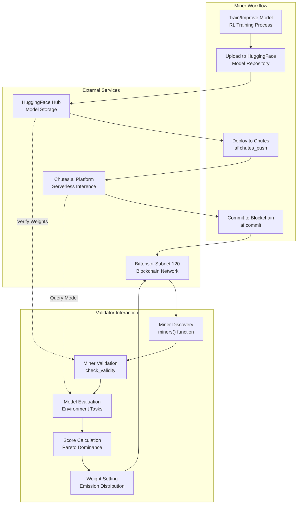
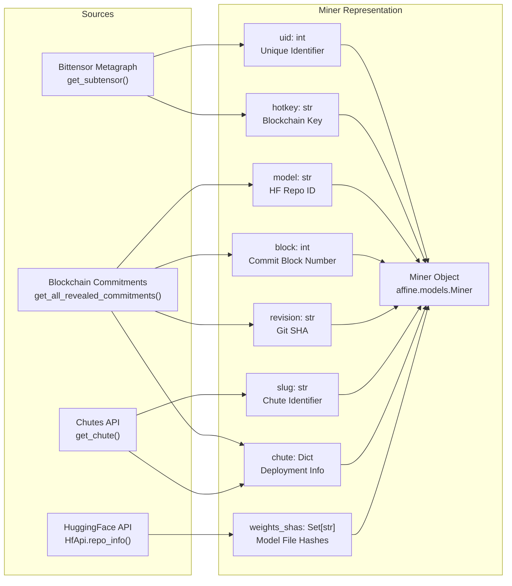
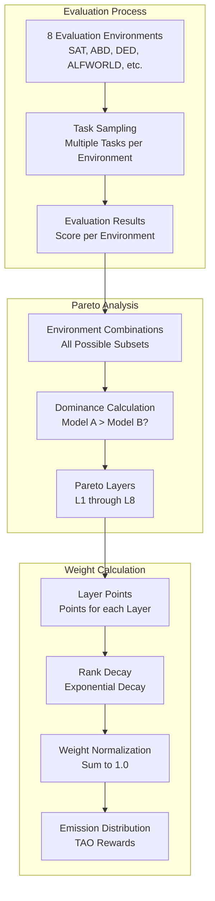
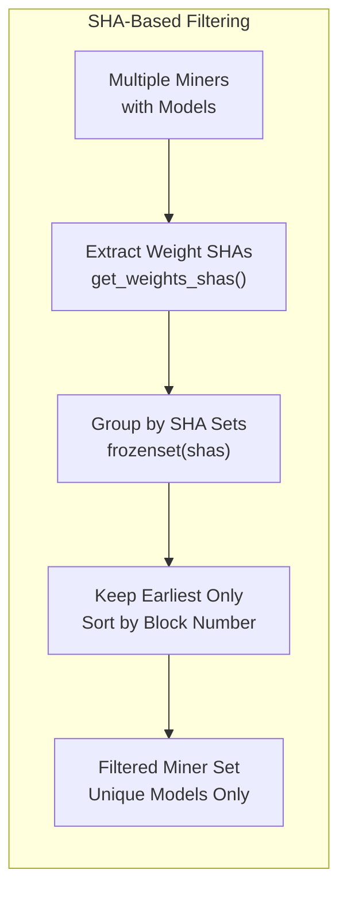
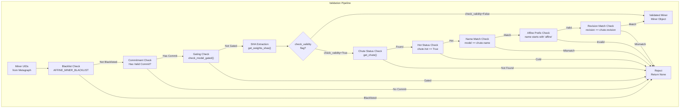
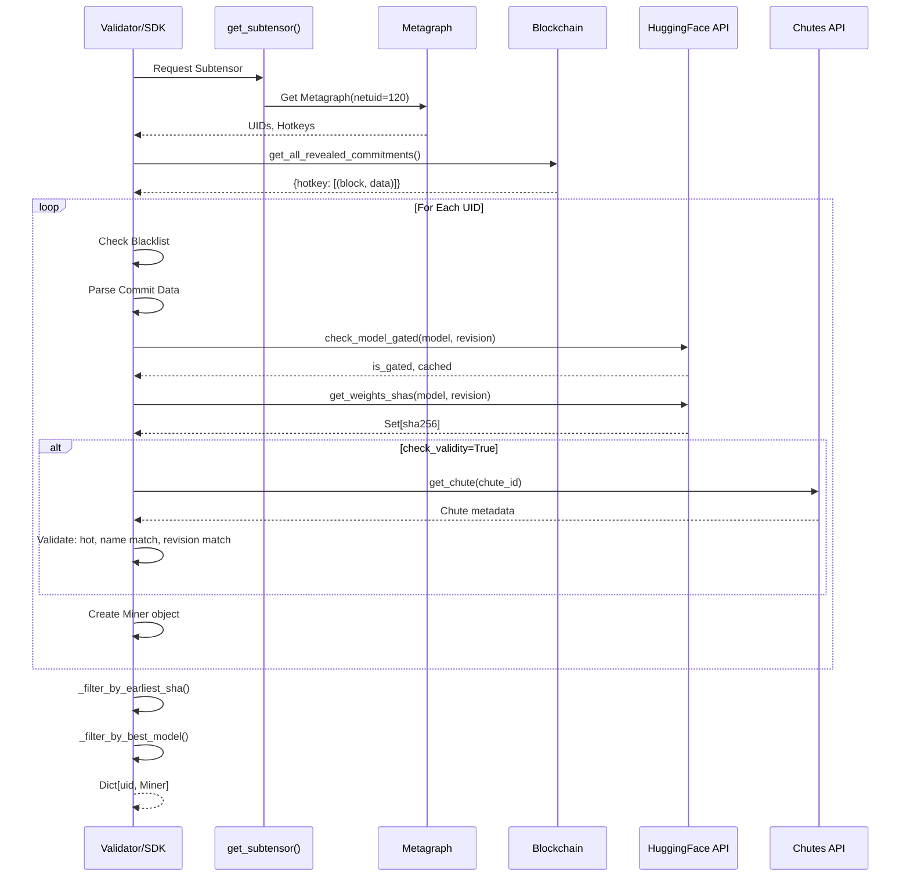
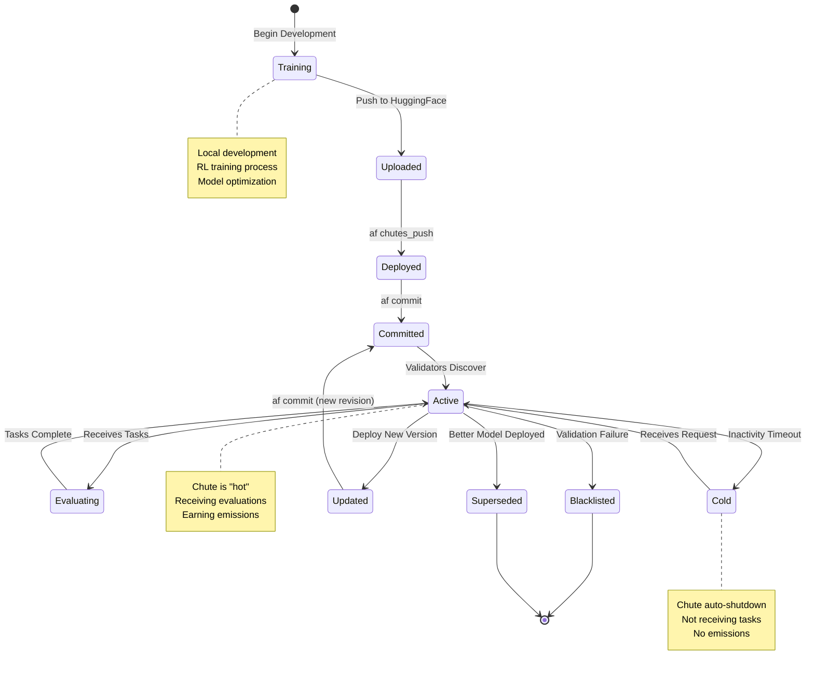

import CollapsibleAside from '../../../../components/CollapsibleAside.astro';
import SourceLink from '../../../../components/SourceLink.astro';
import Table from '../../../../components/Table.astro';

<CollapsibleAside title="Relevant Source Files">
  <SourceLink text="affine/api/routers/miners.py" href="https://github.com/AffineFoundation/affine-cortex/blob/main/affine/api/routers/miners.py" />
  <SourceLink text="affine/database/dao/miners.py" href="https://github.com/AffineFoundation/affine-cortex/blob/main/affine/database/dao/miners.py" />
  <SourceLink text="affine/database/dao/scores.py" href="https://github.com/AffineFoundation/affine-cortex/blob/main/affine/database/dao/scores.py" />
  <SourceLink text="affine/database/dao/system_config.py" href="https://github.com/AffineFoundation/affine-cortex/blob/main/affine/database/dao/system_config.py" />
  <SourceLink text="affine/src/monitor/miners_monitor.py" href="https://github.com/AffineFoundation/affine-cortex/blob/main/affine/src/monitor/miners_monitor.py" />
  <SourceLink text="affine/src/scorer/config.py" href="https://github.com/AffineFoundation/affine-cortex/blob/main/affine/src/scorer/config.py" />
  <SourceLink text="affine/src/scorer/models.py" href="https://github.com/AffineFoundation/affine-cortex/blob/main/affine/src/scorer/models.py" />
  <SourceLink text="affine/src/scorer/stage1_collector.py" href="https://github.com/AffineFoundation/affine-cortex/blob/main/affine/src/scorer/stage1_collector.py" />
  <SourceLink text="affine/src/scorer/stage2_pareto.py" href="https://github.com/AffineFoundation/affine-cortex/blob/main/affine/src/scorer/stage2_pareto.py" />
  <SourceLink text="affine/src/scorer/stage4_weights.py" href="https://github.com/AffineFoundation/affine-cortex/blob/main/affine/src/scorer/stage4_weights.py" />
  <SourceLink text="affine/src/scorer/utils.py" href="https://github.com/AffineFoundation/affine-cortex/blob/main/affine/src/scorer/utils.py" />
  <SourceLink text="affine/utils/model_size_checker.py" href="https://github.com/AffineFoundation/affine-cortex/blob/main/affine/utils/model_size_checker.py" />
  <SourceLink text="affine/utils/template_checker.py" href="https://github.com/AffineFoundation/affine-cortex/blob/main/affine/utils/template_checker.py" />
</CollapsibleAside>

## Purpose and Scope

This document explains the miner role in the Affine network: what miners do, how they earn rewards, technical requirements, and the deployment workflow. For step-by-step instructions on training and deploying models, see [Model Development](#4.2). For detailed CLI command reference, see [Miner CLI Reference](/subnets/for-miners/miner-cli-reference#4.4).

## What is a Miner?

In the Affine network, miners are participants who train and deploy machine learning models to earn rewards. Unlike traditional cryptocurrency mining, Affine miners do not run computational mining hardware. Instead, they:

1. **Train or improve models** using reinforcement learning techniques
2. **Deploy models as serverless inference endpoints** on the Chutes.ai platform
3. **Register their deployments** to the Bittensor blockchain (Subnet 120)
4. **Earn rewards** based on their model's performance across multiple evaluation environments

Miners compete in a **Pareto dominance** system where models that outperform others across various environment combinations receive higher weights and greater emissions.

**Key Characteristics:**
- No mining hardware required
- Focus on model training and optimization
- Serverless inference through Chutes.ai
- On-chain registration and verification
- Performance-based rewards

Sources: <SourceLink text="README.md:1-139" href="https://github.com/AffineFoundation/affine-cortex/blob/main/README.md#L1-L139" />, <SourceLink text="FAQ.md:1-100" href="https://github.com/AffineFoundation/affine-cortex/blob/main/FAQ.md#L1-L100" />

## Miner Architecture and Data Flow

### Miner in the System

Sources: <SourceLink text="README.md:76-138" href="https://github.com/AffineFoundation/affine-cortex/blob/main/README.md#L76-L138" />, <SourceLink text="FAQ.md:9-16" href="https://github.com/AffineFoundation/affine-cortex/blob/main/FAQ.md#L9-L16" />

### Miner Data Model

Sources: <SourceLink text="affine/miners.py:257-349" href="https://github.com/AffineFoundation/affine-cortex/blob/main/affine/miners.py#L257-L349" />

## Miner Requirements

### Account and Infrastructure Requirements

<Table>

| Requirement | Description | Purpose |
|------------|-------------|---------|
| **HuggingFace Account** | Free account at huggingface.co | Host trained model weights |
| **HF Token** | `HF_TOKEN` environment variable | Required for private model access |
| **Chutes.ai Account** | Registered using same hotkey as miner | Deploy serverless inference endpoints |
| **Chutes API Key** | `CHUTES_API_KEY` environment variable | Authenticate Chutes deployments |
| **Chutes Funding** | TAO balance in Chutes account | Pay for GPU hours during inference |
| **Bittensor Wallet** | Coldkey and hotkey pair | Register on Subnet 120, sign commits |

</Table>

Sources: <SourceLink text="README.md:78-99" href="https://github.com/AffineFoundation/affine-cortex/blob/main/README.md#L78-L99" />, <SourceLink text="FAQ.md:19-23" href="https://github.com/AffineFoundation/affine-cortex/blob/main/FAQ.md#L19-L23" />

### Technical Requirements

**Model Requirements:**
- Model must be uploaded to HuggingFace as a public or accessible repository
- Model name on Chutes must match HuggingFace repository name exactly
- Repository name must start with "Affine" (case-insensitive first 6 characters)
- Model must not be gated (accessible without special permissions)
- Model revision (Git SHA) on Chutes must match committed revision

**Deployment Requirements:**
- Chute must be in "hot" (active) state to receive evaluation requests
- Chute configuration must use compatible sglang image versions
- Model must respond to OpenAI-compatible inference API
- Adequate GPU resources allocated for model size

**Blockchain Requirements:**
- Registered UID on Bittensor Subnet 120
- Valid commitment containing: `model`, `revision`, and `chute_id` fields
- Hotkey must have sufficient TAO for transaction fees

Sources: <SourceLink text="affine/miners.py:274-334" href="https://github.com/AffineFoundation/affine-cortex/blob/main/affine/miners.py#L274-L334" />, <SourceLink text="FAQ.md:70-78" href="https://github.com/AffineFoundation/affine-cortex/blob/main/FAQ.md#L70-L78" />

## Rewards Structure

### Pareto Dominance Scoring

Affine uses a **Pareto dominance** algorithm rather than a simple winner-takes-all system. This rewards miners for specialization across different environment combinations:

**Layer System:**
- `L1`: Points for dominating single environments
- `L2`: Points for dominating pairs of environments
- `L3-L7`: Points for dominating larger environment combinations
- `L8`: Points for dominating all 8 environments simultaneously

This encourages diverse model development rather than a single generalist solution.

Sources: <SourceLink text="FAQ.md:97-100" href="https://github.com/AffineFoundation/affine-cortex/blob/main/FAQ.md#L97-L100" />, <SourceLink text="README.md:9-13" href="https://github.com/AffineFoundation/affine-cortex/blob/main/README.md#L9-L13" />

### Emission Distribution

Validators set weights on the blockchain based on comprehensive scoring calculations. Higher weights lead to greater emission distribution:

1. **Continuous Evaluation**: Validators sample miners across all environments
2. **Statistical Significance**: New models must show statistically significant improvement
3. **Block Window**: Scoring calculated over large windows (e.g., 10,000 blocks)
4. **Weight Updates**: Validators periodically update weights on-chain

**Special Cases:**
- **UID 0**: Reserved for emissions burning during critical issues
- **Blacklisted Miners**: Can be excluded via `AFFINE_MINER_BLACKLIST` environment variable
- **Duplicate Models**: Filtered out through SHA-based deduplication

Sources: <SourceLink text="FAQ.md:87-94" href="https://github.com/AffineFoundation/affine-cortex/blob/main/FAQ.md#L87-L94" />, <SourceLink text="affine/miners.py:196-255" href="https://github.com/AffineFoundation/affine-cortex/blob/main/affine/miners.py#L196-L255" />

## Anti-Exploit Architecture

### Model Copying Prevention

The system implements multiple layers of protection against model copying:

**1. Weight SHA Deduplication**

The `_filter_by_earliest_sha()` function <SourceLink text="affine/miners.py:208-241" href="https://github.com/AffineFoundation/affine-cortex/blob/main/affine/miners.py#L208-L241" /> compares SHA-256 hashes of all `.safetensors` files:

- **Complete Match Required**: Two miners are considered copies only if ALL weight file hashes match
- **First Commit Advantage**: Among duplicates, the earliest block number wins
- **Partial Differences Preserved**: If any file differs, both models are kept

Sources: [affine/miners.py:208-241](), <SourceLink text="FAQ.md:38-47" href="https://github.com/AffineFoundation/affine-cortex/blob/main/FAQ.md#L38-L47" />

**2. Statistical Significance Testing**

Validators use Beta distribution confidence intervals to determine if performance differences are meaningful:

- Models must show statistically significant improvement over existing models
- Random variance alone cannot cause a copied model to outscore the original
- Prevents exploitation of statistical noise in scoring

Sources: <SourceLink text="FAQ.md:43-46" href="https://github.com/AffineFoundation/affine-cortex/blob/main/FAQ.md#L43-L46" />

**3. Block-Based Ordering**

The `block` field [affine/miners.py:284]() tracks when a model was first committed:

- Earlier commits receive priority in tie-breaking scenarios
- Prevents "race condition" copying where miners watch for new models
- Incentivizes genuine innovation over rapid redeployment

Sources: <SourceLink text="affine/miners.py:233-235" href="https://github.com/AffineFoundation/affine-cortex/blob/main/affine/miners.py#L233-L235" />

### Deployment Validation

The `miners()` function implements comprehensive validation:

Sources: <SourceLink text="affine/miners.py:274-337" href="https://github.com/AffineFoundation/affine-cortex/blob/main/affine/miners.py#L274-L337" />

### Gating and Access Control

**Model Gating Check** <SourceLink text="affine/miners.py:51-88" href="https://github.com/AffineFoundation/affine-cortex/blob/main/affine/miners.py#L51-L88" />:
- Checks if HuggingFace model requires special access
- Uses TTL-based caching (1 hour) to reduce API load
- Validates specific revision accessibility
- Rejects gated models to ensure fair evaluation

**Chutes Hot Status**:
- Only "hot" (active) Chutes receive evaluation requests
- Cold Chutes are skipped to prevent evaluation failures
- Miners must maintain adequate funding to keep Chutes active

Sources: [affine/miners.py:51-88](), <SourceLink text="affine/miners.py:308-312" href="https://github.com/AffineFoundation/affine-cortex/blob/main/affine/miners.py#L308-L312" />, <SourceLink text="FAQ.md:60-68" href="https://github.com/AffineFoundation/affine-cortex/blob/main/FAQ.md#L60-L68" />

## Miner Discovery Process

### Discovery Flow

Sources: <SourceLink text="affine/miners.py:257-349" href="https://github.com/AffineFoundation/affine-cortex/blob/main/affine/miners.py#L257-L349" />

### Caching Strategy

The miner discovery system uses multiple caching layers to reduce external API load:

<Table>

| Cache | TTL | Purpose | Implementation |
|-------|-----|---------|----------------|
| **Gating Cache** | 3600s (1 hour) | HuggingFace gating status | `MODEL_GATING_CACHE` [affine/miners.py:16-18]() |
| **Weights SHA Cache** | 3600s (1 hour) | Model file hashes | `WEIGHTS_SHA_CACHE` [affine/miners.py:20-22]() |
| **Concurrency Control** | N/A | Rate limiting for HF/Chutes APIs | `AFFINE_META_CONCURRENCY` <SourceLink text="affine/miners.py:272" href="https://github.com/AffineFoundation/affine-cortex/blob/main/affine/miners.py#L272" /> |

</Table>

**Concurrency Management:**
- Default: 12 concurrent metadata requests
- Configurable via `AFFINE_META_CONCURRENCY` environment variable
- Prevents overwhelming external APIs
- Balances discovery speed with API rate limits

Sources: <SourceLink text="affine/miners.py:16-48" href="https://github.com/AffineFoundation/affine-cortex/blob/main/affine/miners.py#L16-L48" />, [affine/miners.py:272]()

### Filtering Pipeline

After initial discovery, miners go through two filtering stages:

**1. SHA-Based Deduplication** [affine/miners.py:208-241]():
- Groups miners by complete SHA set (frozenset of all weight file hashes)
- For each duplicate set, keeps only the earliest block number
- Removes later copies that have identical weights

**2. Best Model Selection** [affine/miners.py:243-255]():
- Groups miners by HuggingFace model repository name
- For each model name, keeps only the earliest block number
- Ensures one miner per unique model repository

This two-stage process prevents both exact copies and multiple UIDs pointing to the same model.

Sources: <SourceLink text="affine/miners.py:208-255" href="https://github.com/AffineFoundation/affine-cortex/blob/main/affine/miners.py#L208-L255" />

## Miner Lifecycle States

Sources: <SourceLink text="README.md:76-138" href="https://github.com/AffineFoundation/affine-cortex/blob/main/README.md#L76-L138" />, <SourceLink text="FAQ.md:60-68" href="https://github.com/AffineFoundation/affine-cortex/blob/main/FAQ.md#L60-L68" />

## Integration with System Components

### Miner-Validator Interaction

Miners interact with validators through standardized interfaces:

**Discovery:**
- Validators call `miners()` function periodically <SourceLink text="affine/miners.py:257-349" href="https://github.com/AffineFoundation/affine-cortex/blob/main/affine/miners.py#L257-L349" />
- Refresh interval controlled by scheduler configuration
- Discovers new miners and removes invalid ones

**Evaluation:**
- Validators query miners through Chutes.ai inference endpoints
- OpenAI-compatible API used for model inference
- Task results stored and aggregated for scoring

**Weight Setting:**
- Validators calculate weights based on Pareto dominance
- Weights committed to blockchain via signer service
- Emission distribution follows blockchain weights

Sources: [affine/miners.py:257-349](), <SourceLink text="README.md:139-163" href="https://github.com/AffineFoundation/affine-cortex/blob/main/README.md#L139-L163" />

### CLI Command Integration

Miners use three primary CLI commands:

<Table>

| Command | Purpose | Key Function | Section |
|---------|---------|--------------|---------|
| `af pull` | Download existing model from network | Fetch model from UID | [#4.4](#4.4) |
| `af chutes_push` | Deploy model to Chutes.ai platform | `deploy_to_chutes()` in [affine/cli.py]() | [#4.4](#4.4) |
| `af commit` | Register deployment on blockchain | Submit commitment to Subnet 120 | [#4.4](#4.4) |

</Table>

Sources: <SourceLink text="README.md:102-137" href="https://github.com/AffineFoundation/affine-cortex/blob/main/README.md#L102-L137" />

### HTTP Client Usage

Miner discovery uses a shared HTTP client for efficient API access:

**Connection Pooling** [affine/http_client.py:36-56]():
- Singleton `ClientSession` per event loop
- Configurable connection limit via `AFFINE_HTTP_CONCURRENCY` (default: 400)
- DNS caching with 300-second TTL
- Automatic cleanup on process exit

**Semaphore Control** [affine/http_client.py:24-34]():
- Rate limiting for concurrent requests
- Prevents overwhelming HuggingFace and Chutes APIs
- Configurable via `AFFINE_HTTP_CONCURRENCY` environment variable

Sources: <SourceLink text="affine/http_client.py:1-56" href="https://github.com/AffineFoundation/affine-cortex/blob/main/affine/http_client.py#L1-L56" />

## Summary

Miners in the Affine network:

1. **Train models** using reinforcement learning techniques on challenging evaluation environments
2. **Deploy models** as serverless inference endpoints on Chutes.ai (not traditional mining hardware)
3. **Earn rewards** through Pareto dominance scoring across multiple environment combinations
4. **Must satisfy** strict validation requirements including SHA verification, hot status, and name matching
5. **Compete fairly** through anti-exploit measures including statistical significance testing and first-commit advantage
6. **Integrate** with the broader system through standardized APIs and blockchain commitments

For practical guidance on training and deploying models, proceed to [Model Development](#4.2). For detailed command documentation, see [Miner CLI Reference](/subnets/for-miners/miner-cli-reference#4.4).

Sources: <SourceLink text="README.md:1-223" href="https://github.com/AffineFoundation/affine-cortex/blob/main/README.md#L1-L223" />, <SourceLink text="FAQ.md:1-100" href="https://github.com/AffineFoundation/affine-cortex/blob/main/FAQ.md#L1-L100" />, <SourceLink text="affine/miners.py:1-350" href="https://github.com/AffineFoundation/affine-cortex/blob/main/affine/miners.py#L1-L350" />
