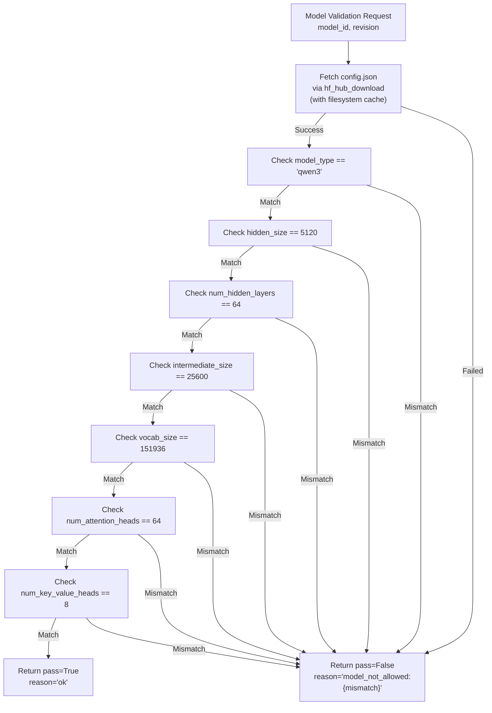
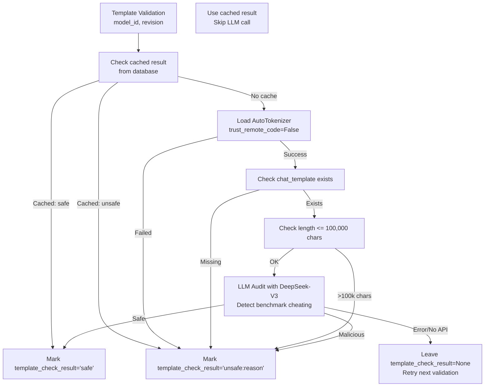
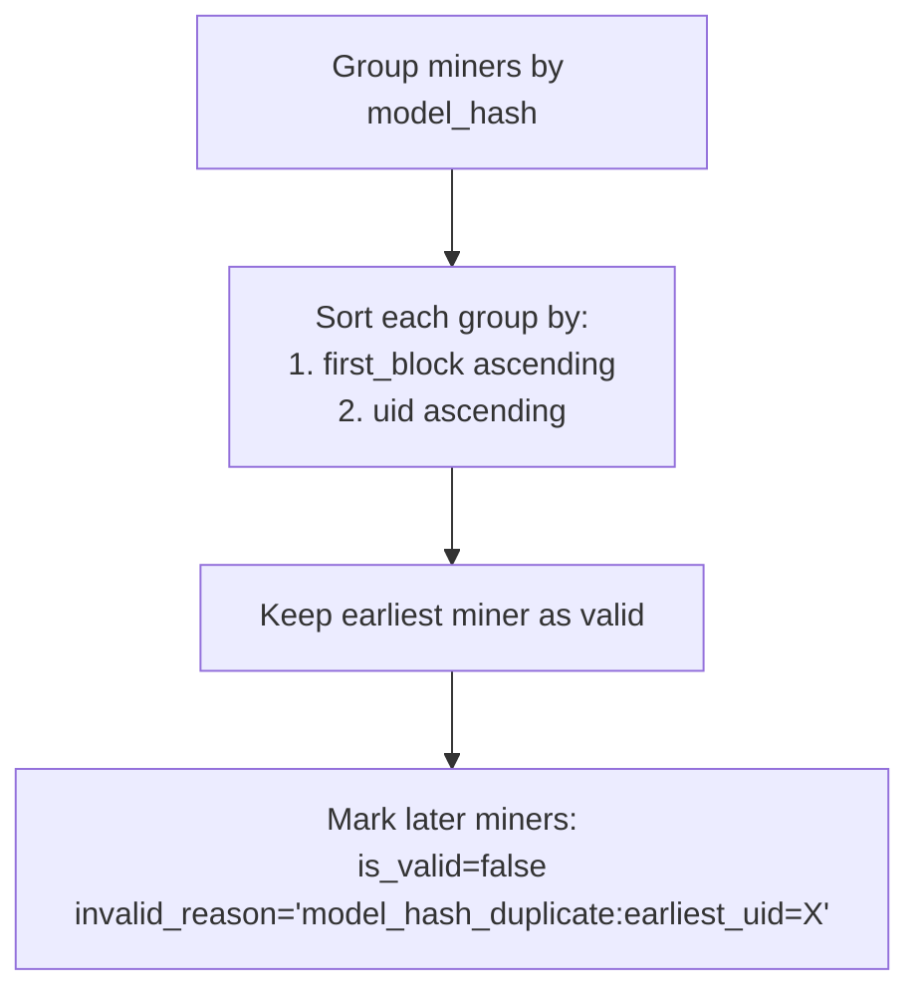
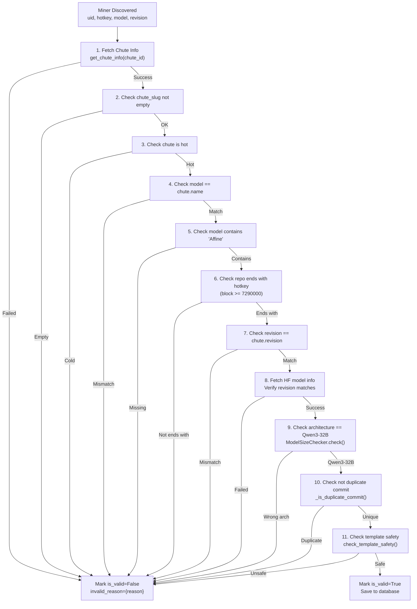

import CollapsibleAside from '../../../../components/CollapsibleAside.astro';
import SourceLink from '../../../../components/SourceLink.astro';
import Table from '../../../../components/Table.astro';

<CollapsibleAside title="Relevant Source Files">
  <SourceLink text="affine/api/routers/miners.py" href="https://github.com/AffineFoundation/affine-cortex/blob/main/affine/api/routers/miners.py" />
  <SourceLink text="affine/database/dao/miners.py" href="https://github.com/AffineFoundation/affine-cortex/blob/main/affine/database/dao/miners.py" />
  <SourceLink text="affine/database/dao/scores.py" href="https://github.com/AffineFoundation/affine-cortex/blob/main/affine/database/dao/scores.py" />
  <SourceLink text="affine/database/dao/system_config.py" href="https://github.com/AffineFoundation/affine-cortex/blob/main/affine/database/dao/system_config.py" />
  <SourceLink text="affine/src/monitor/miners_monitor.py" href="https://github.com/AffineFoundation/affine-cortex/blob/main/affine/src/monitor/miners_monitor.py" />
  <SourceLink text="affine/utils/model_size_checker.py" href="https://github.com/AffineFoundation/affine-cortex/blob/main/affine/utils/model_size_checker.py" />
  <SourceLink text="affine/utils/template_checker.py" href="https://github.com/AffineFoundation/affine-cortex/blob/main/affine/utils/template_checker.py" />
</CollapsibleAside>

## Purpose and Scope

This document specifies the technical requirements that miner models must satisfy to participate in the Affine Cortex network. It covers architecture validation, naming conventions, template safety, and anti-plagiarism mechanisms enforced by the Monitor service during miner registration.

For information about the complete deployment workflow, see [Deployment Workflow](/subnets/for-miners/deployment-workflow#4.3). For miner CLI commands, see [Miner CLI Reference](/subnets/for-miners/miner-cli-reference#4.4). For the Monitor service implementation, see [Monitor Service](/subnets/backend-services-deep-dive/monitor-service#11.2).

---

## Architecture Specification

### Required Model: Qwen3-32B

All miner models must use the **Qwen3-32B** architecture. This requirement is enforced by inspecting the `config.json` file from the HuggingFace repository and verifying exact parameter matches.

#### Required Configuration Parameters

<Table>

| Parameter | Required Value | Purpose |
|-----------|---------------|---------|
| `model_type` | `"qwen3"` | Identifies model family |
| `hidden_size` | `5120` | Hidden layer dimension |
| `num_hidden_layers` | `64` | Number of transformer layers |
| `intermediate_size` | `25600` | FFN intermediate dimension |
| `vocab_size` | `151936` | Tokenizer vocabulary size |
| `num_attention_heads` | `64` | Number of attention heads |
| `num_key_value_heads` | `8` | Number of KV cache heads (GQA) |

</Table>


**Sources:** [affine/utils/model_size_checker.py:32-40]()

### Why These Exact Parameters?

1. **Quantization-proof**: Architecture validation checks parameter counts rather than file sizes, making it robust to quantization (FP16, INT8, etc.)
2. **Manipulation-resistant**: Faking these parameters breaks vLLM loading, preventing trivial bypasses
3. **Fine-tune compatible**: Fine-tuned models retain the same architecture parameters while having different weights

### Validation Mechanism



**Diagram: Model Architecture Validation Flow**

**Sources:** [affine/utils/model_size_checker.py:43-106]()

### Exemptions

- **UID 0**: Test/admin miner, skips architecture validation
- **UIDs > 1000**: System miners (benchmark models), skip architecture validation

**Sources:** [affine/src/monitor/miners_monitor.py:419-429]()

---

## Naming Conventions

### Repository Name Requirements

Miner models must follow strict naming conventions to be considered valid:

#### 1. Must Contain "Affine"

The model repository name must contain the string `"Affine"` or `"affine"` (case-insensitive).

**Format:** `owner/model-name-with-Affine`

**Example:** `john_smith/Qwen3-32B-Affine-v1`

**Enforcement:** Checked at [affine/src/monitor/miners_monitor.py:375-379]()

#### 2. Must End with Hotkey

Starting at **block 7,290,000**, the repository name must end with the miner's hotkey (case-insensitive).

**Format:** `owner/repo-name-{hotkey}`

**Example:** If hotkey is `5F3sa2TJAWMqDhXG6jhV4N8ko9SxwGy8TpaNS1repo5EYjQX`, the repo name must end with this string.

**Enforcement:** Checked at [affine/src/monitor/miners_monitor.py:382-390]()

### Validation Rules Summary

<Table>

| Rule | Applies To | Enforced Since | Validation Logic |
|------|-----------|----------------|------------------|
| Contains "Affine" | All miners except UID 0 | Always | Case-insensitive substring match |
| Ends with hotkey | All miners except UID 0 | Block 7,290,000+ | Case-insensitive suffix match |

</Table>


### Model-Chute Name Consistency

The model name committed on-chain must match the name registered on the Chutes platform:

```python
# Committed data
{
  "model": "owner/Qwen3-32B-Affine-hotkey",
  "revision": "abc123...",
  "chute_id": "550e8400-e29b-..."
}

# Chutes deployment must have:
chute.name == "owner/Qwen3-32B-Affine-hotkey"  # Must match
```

**Sources:** [affine/src/monitor/miners_monitor.py:365-372]()

---

## Template Safety Requirements

### Chat Template Validation

All models must include a valid `chat_template` in their tokenizer configuration. This template is inspected for malicious code that could give unfair advantages on benchmark tasks.

### Validation Steps



**Diagram: Template Safety Validation Flow**

### Rejection Criteria

#### 1. Missing Template

Models without a `chat_template` are rejected:

```python
if template_length == 0:
    return TemplateCheckResult(
        safe=False,
        reason="missing_chat_template"
    )
```

**Sources:** [affine/utils/template_checker.py:122-127]()

#### 2. Template Exceeds Context Limit

Templates exceeding 100,000 characters are rejected (DeepSeek-V3 has 128K token context):

```python
TEMPLATE_LENGTH_REJECT = 100000

if template_length > TEMPLATE_LENGTH_REJECT:
    return TemplateCheckResult(
        safe=False,
        reason=f"template_exceeds_context_limit:{template_length}"
    )
```

**Sources:** [affine/utils/template_checker.py:22-135]()

#### 3. LLM Audit Failure

Templates containing benchmark-cheating code patterns are rejected by DeepSeek-V3 audit:

**Detected Patterns:**
- Built-in solvers (sudoku, game of 24, cryptarithmetic, etc.)
- Problem type detection logic
- Answer injection based on problem type
- Complex algorithms (backtracking, permutation, brute-force search)
- Excessive complexity (many nested loops, recursive logic)

**Audit Prompt Format:**

```
You are a security auditor for HuggingFace models. 
Analyze the following chat_template to detect benchmark cheating code.

[Full prompt includes normal vs. cheating characteristics]

Output JSON only:
{
  "is_malicious": true/false,
  "confidence": 0.0-1.0,
  "reason": "brief explanation",
  "detected_issues": ["issue1", "issue2", ...]
}
```

**Sources:** [affine/utils/template_checker.py:36-72](), [affine/utils/template_checker.py:215-273]()

### Caching Strategy

Template validation results are cached in the database to avoid redundant LLM API calls:

<Table>

| Cache Key | Cache Value | Cache Location | TTL |
|-----------|-------------|----------------|-----|
| `(uid, model, revision)` | `"safe"` or `"unsafe:reason"` | `miners.template_check_result` | Indefinite |

</Table>


**Cache Behavior:**
1. If cached result exists and model/revision unchanged → use cached result
2. If no cache or model/revision changed → execute LLM audit
3. If LLM audit fails (API error) → leave cache as `None`, retry next validation cycle

**Sources:** [affine/src/monitor/miners_monitor.py:332-341](), [affine/src/monitor/miners_monitor.py:450-487]()

---

## Anti-Plagiarism Mechanisms

### Model Hash Computation

Each model's weights are fingerprinted using SHA256 hashes of all `.safetensors` and `.bin` files:

```python
# Extract LFS SHA256 from HuggingFace siblings
shas = {
    str(getattr(s, "lfs", {})["sha256"])
    for s in siblings
    if (
        isinstance(getattr(s, "lfs", None), dict)
        and _name(s).endswith((".safetensors", ".bin"))
        and "sha256" in getattr(s, "lfs", {})
    )
}

# Compute aggregate hash (sorted for determinism)
import hashlib
model_hash = hashlib.sha256("".join(sorted(shas)).encode()).hexdigest()
```

**Sources:** [affine/src/monitor/miners_monitor.py:204-225]()

### Plagiarism Detection Rules

#### 1. Model Hash Comparison

Miners with identical `model_hash` are considered duplicates. Only the miner with the earliest `first_block` is kept valid:



**Diagram: Model Hash Plagiarism Detection**

**Sources:** [affine/src/monitor/miners_monitor.py:493-534]()

#### 2. Duplicate Commit Detection

Models with commits titled `"Duplicate from xxx"` are rejected:

```python
for commit in commits:
    title = getattr(commit, "title", "") or ""
    if title.lower().startswith("duplicate from"):
        duplicate_source = title[len("Duplicate from"):].strip()
        # Reject with reason: f"duplicate_repo:from={duplicate_source}"
        break
```

**Sources:** [affine/src/monitor/miners_monitor.py:229-248]()

#### 3. Suspicious Commit History

Models are rejected if:
- More than 100 commits in history → `"blocked:too_many_commits"`
- Any commit message exceeds 200 characters → `"blocked:commit_msg_too_long"`

**Sources:** [affine/src/monitor/miners_monitor.py:233-243]()

### Temporal Priority

The `first_block` field establishes temporal priority for plagiarism resolution:

<Table>

| Scenario | Miner A (block 100) | Miner B (block 200) | Result |
|----------|---------------------|---------------------|--------|
| Same hash | Valid | Invalid (plagiarism) | A keeps priority |
| Different hash | Valid | Valid | Both valid |
| B commits first, then A | Invalid (if same hash) | Valid | First on-chain wins |

</Table>


**Database Schema:**

```python
# miners table
{
  "uid": 42,
  "first_block": 7290000,  # Block when miner first committed
  "model_hash": "a1b2c3...",
  "is_valid": True,
  "invalid_reason": None
}
```

**Sources:** [affine/database/dao/miners.py:34-89]()

---

## Complete Validation Pipeline

### 11-Step Validation Process

The Monitor service executes the following validation steps for each miner:



**Diagram: Complete Miner Validation Pipeline (MinersMonitor._validate_miner)**

**Sources:** [affine/src/monitor/miners_monitor.py:288-491]()

### Validation State Storage

All validation results are persisted to the `miners` table:

```python
await self.dao.save_miner(
    uid=miner.uid,
    hotkey=miner.hotkey,
    model=miner.model,
    revision=miner.revision,
    chute_id=miner.chute_id,
    chute_slug=miner.chute_slug,
    model_hash=miner.model_hash,  # For plagiarism detection
    chute_status=miner.chute_status,
    is_valid=miner.is_valid,
    invalid_reason=miner.invalid_reason,
    block_number=current_block,
    first_block=miner.block,
    template_check_result=miner.template_check_result,  # Cache LLM audit
)
```

**Sources:** [affine/src/monitor/miners_monitor.py:700-715]()

### Exemptions and Special Cases

#### UID 0 (Test Miner)

- Skips all validation steps except Chutes checks
- Always marked as valid
- Used for testing and admin operations

**Sources:** [affine/src/monitor/miners_monitor.py:368-372](), [affine/src/monitor/miners_monitor.py:375-379](), [affine/src/monitor/miners_monitor.py:445-448]()

#### System Miners (UID > 1000)

System miners are benchmark models (GPT-4o, Claude, etc.) that participate in scoring but don't receive rewards:

- Virtual hotkeys: `SYSTEM-1`, `SYSTEM-2`, etc.
- Virtual revisions: `SYSTEM-1`, `SYSTEM-2`, etc.
- Skip all validation steps (always valid)
- Configured in `system_config.system_miners`

**Configuration Format:**

```json
{
  "1001": {"model": "openai/gpt-4o"},
  "1002": {"model": "anthropic/claude-3.5-sonnet"}
}
```

**Sources:** [affine/src/monitor/miners_monitor.py:668-697](), [affine/database/dao/system_config.py:291-339]()

#### Multiple Commits Policy

Starting at **block 7,679,000**, miners are disqualified if they have more than one commit:

```python
_MULTI_COMMIT_ENFORCE_BLOCK = 7679000
first_commit_block = int(commits[hotkey][0][0])

if uid != 0 and len(commits[hotkey]) > 1 and first_commit_block >= _MULTI_COMMIT_ENFORCE_BLOCK:
    # Mark invalid: "multiple_commits:count={len(commits[hotkey])}"
```

**Rationale:** Prevents miners from iteratively testing models or gaming the system through multiple deployments.

**Sources:** [affine/src/monitor/miners_monitor.py:610-626]()

---

## Requirements Checklist

Use this checklist to verify your model meets all requirements before deployment:

### Pre-Deployment Checklist

- [ ] **Architecture**
  - [ ] Model is based on Qwen3-32B (verify `config.json`)
  - [ ] All architecture parameters match requirements
  - [ ] Model loads successfully in vLLM

- [ ] **Naming**
  - [ ] Repository name contains "Affine" or "affine"
  - [ ] Repository name ends with your hotkey (case-insensitive)
  - [ ] Chutes deployment name matches repository name exactly

- [ ] **Template**
  - [ ] Model has `chat_template` in tokenizer config
  - [ ] Template length &lt; 100,000 characters
  - [ ] Template contains no benchmark-specific solving code
  - [ ] Test template with sample prompts

- [ ] **Anti-Plagiarism**
  - [ ] Model weights are original or fine-tuned (not copied)
  - [ ] No "Duplicate from" commits in Git history
  - [ ] Less than 100 commits in repository
  - [ ] All commit messages under 200 characters

- [ ] **Deployment**
  - [ ] Private HuggingFace repository created
  - [ ] Model uploaded to private repo
  - [ ] Chutes deployment completed (chute is hot)
  - [ ] Blockchain commitment made
  - [ ] Repository made public after commitment

### Post-Deployment Verification

Query your miner status via API or CLI:

```bash
# Check validation status
af get-miner --uid YOUR_UID

# Expected response for valid miner:
{
  "uid": YOUR_UID,
  "is_valid": true,
  "invalid_reason": null,
  "model_hash": "a1b2c3...",
  "template_check_result": "safe"
}
```

**Sources:** [affine/api/routers/miners.py:19-62]()

---

## Common Validation Failures

### Architecture Mismatches

**Error:** `"model_check:hidden_size=4096 (expected 5120)"`

**Cause:** Using wrong model architecture (e.g., Qwen2-7B instead of Qwen3-32B)

**Fix:** Ensure you're using the exact Qwen3-32B base model for fine-tuning

### Naming Violations

**Error:** `"model_name_missing_affine"`

**Cause:** Repository name doesn't contain "Affine"

**Fix:** Rename repository to include "Affine" (e.g., `owner/Qwen3-32B-Affine-hotkey`)

**Error:** `"repo_name_not_ending_with_hotkey:repo=my-model"`

**Cause:** Repository name doesn't end with hotkey

**Fix:** Append your hotkey to repository name: `owner/model-name-{hotkey}`

### Template Issues

**Error:** `"missing_chat_template"`

**Cause:** Tokenizer config doesn't include `chat_template`

**Fix:** Add `chat_template` to `tokenizer_config.json` (copy from Qwen3-32B base model if missing)

**Error:** `"malicious_template:detected_sudoku_solver"`

**Cause:** Template contains benchmark-specific solving code

**Fix:** Remove all problem-solving logic from template, use only message formatting

### Plagiarism Detection

**Error:** `"model_hash_duplicate:earliest_uid=42"`

**Cause:** Model weights match another miner who committed first

**Fix:** Ensure your model is original or fine-tuned (not copied). If this is your model deployed from a different UID, contact validators.

**Error:** `"duplicate_repo:from=owner/source-model"`

**Cause:** Git history shows "Duplicate from xxx" commit

**Fix:** Don't use HuggingFace's duplicate repository feature. Create a fresh repository and push your model.

---

## Summary

Model requirements enforce fair competition and prevent gaming:

<Table>

| Requirement Category | Validation Method | Enforcement Point |
|---------------------|-------------------|-------------------|
| Architecture | `config.json` inspection | `ModelSizeChecker.check()` |
| Naming | String pattern matching | `MinersMonitor._validate_miner()` |
| Template Safety | LLM audit (DeepSeek-V3) | `check_template_safety()` |
| Anti-Plagiarism | SHA256 weight hash comparison | `MinersMonitor._detect_plagiarism()` |

</Table>


All validation results are cached in the `miners` table and queried via the API for task scheduling and scoring.

**Sources:** [affine/src/monitor/miners_monitor.py](), [affine/utils/model_size_checker.py](), [affine/utils/template_checker.py](), [affine/database/dao/miners.py]()
