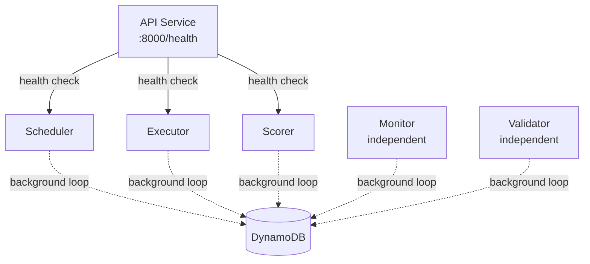
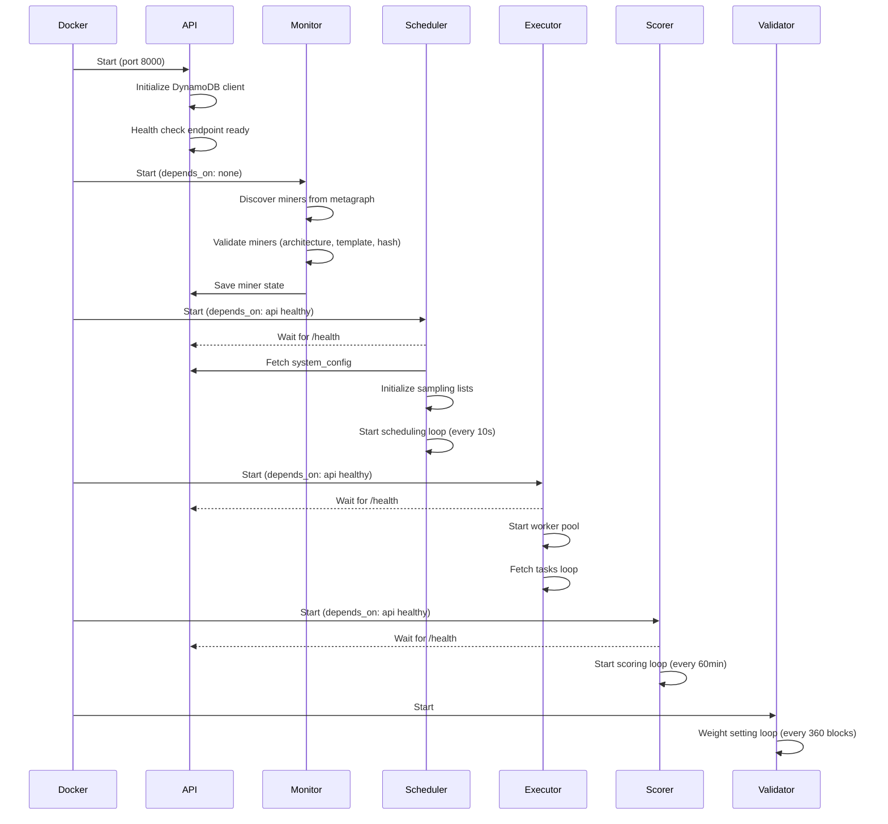
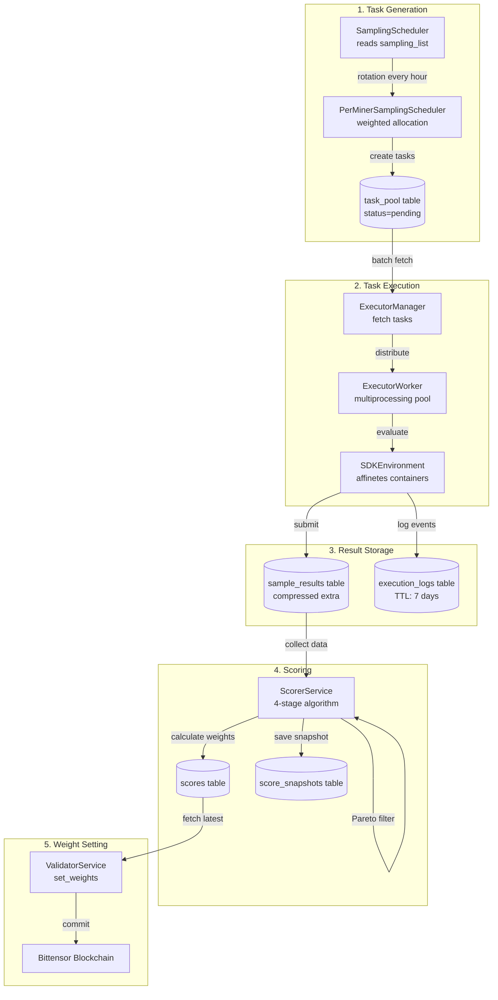
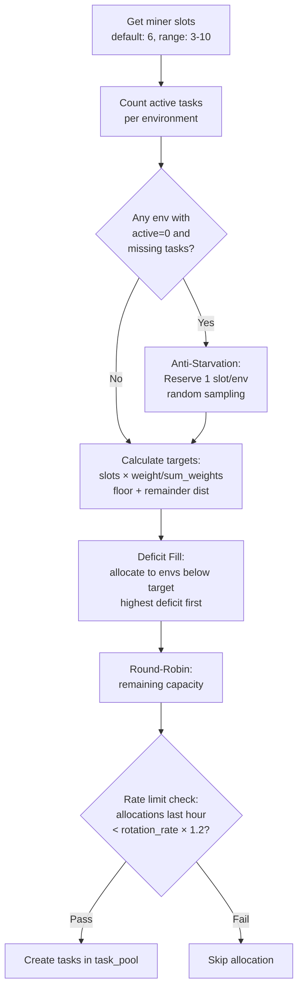
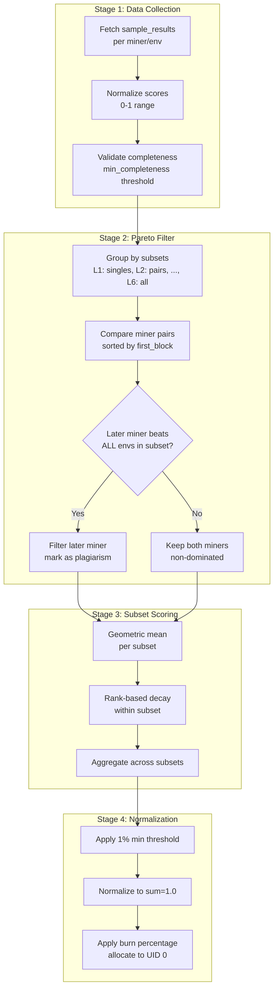

import CollapsibleAside from '../../../components/CollapsibleAside.astro';
import SourceLink from '../../../components/SourceLink.astro';
import Table from '../../../components/Table.astro';

<CollapsibleAside title="Relevant Source Files">
  <SourceLink text="affine/database/cli.py" href="https://github.com/AffineFoundation/affine-cortex/blob/main/affine/database/cli.py" />
  <SourceLink text="affine/src/scheduler/sampling_scheduler.py" href="https://github.com/AffineFoundation/affine-cortex/blob/main/affine/src/scheduler/sampling_scheduler.py" />
  <SourceLink text="docker-compose.local.yml" href="https://github.com/AffineFoundation/affine-cortex/blob/main/docker-compose.local.yml" />
  <SourceLink text="docker-compose.yml" href="https://github.com/AffineFoundation/affine-cortex/blob/main/docker-compose.yml" />
  <SourceLink text="pyproject.toml" href="https://github.com/AffineFoundation/affine-cortex/blob/main/pyproject.toml" />
  <SourceLink text="uv.lock" href="https://github.com/AffineFoundation/affine-cortex/blob/main/uv.lock" />
</CollapsibleAside>

This page provides a comprehensive guide for validators operating on Affine Cortex (Bittensor Subnet 64). It covers validator responsibilities, deployment, configuration, and operational workflows. For detailed information on specific subsystems, see the child pages: [Validator Overview](/subnets/for-validators/validator-overview#5.1), [Running a Validator](/subnets/for-validators/running-a-validator#5.2), [Task Scheduling System](/subnets/for-validators/task-scheduling-system#5.3), [Weight Calculation System](/subnets/for-validators/weight-calculation-system#5.4), and [Monitoring & Observability](/subnets/for-validators/monitoring-observability#5.5). For miner-specific operations, see [For Miners](/subnets/for-miners#4).

---

## Validator Role and Responsibilities

Validators in Affine Cortex orchestrate a distributed evaluation system for language models submitted by miners. Unlike traditional Bittensor subnets where validators query miners directly, Affine validators run a complete backend infrastructure that:

1. **Discovers and validates miners** via the Monitor service
2. **Generates evaluation tasks** using weighted sampling algorithms
3. **Executes tasks** in isolated Docker/Basilica environments
4. **Calculates performance scores** with anti-plagiarism filtering
5. **Sets on-chain weights** to distribute TAO rewards proportionally

**Key Distinction**: Validators do not interact with miner models in real-time. Instead, they evaluate pre-deployed models on Chutes (a serverless inference platform) through standardized task pools stored in DynamoDB.

**Sources**: Diagram 1, Diagram 2 from high-level diagrams

---

## Backend Services Architecture

Validators run six microservices coordinated through Docker Compose. Each service has a specific role in the evaluation pipeline.

### Service Topology

```mermaid
graph TB
    subgraph "External Dependencies"
        BT[Bittensor Blockchain<br/>Subtensor RPC]
        Chutes[Chutes Platform<br/>Model Inference API]
        HF[HuggingFace<br/>Model Repository]
        DB[(DynamoDB<br/>AWS/Local)]
    end
    
    subgraph "Backend Services"
        API[API Service<br/>FastAPI on :8000<br/>affine.src.api.main]
        
        Monitor[Monitor Service<br/>MinerMonitor<br/>affine.src.monitor.main]
        
        Scheduler[Scheduler Service<br/>SamplingScheduler<br/>PerMinerSamplingScheduler]
        
        Executor[Executor Service<br/>ExecutorManager<br/>ExecutorWorker]
        
        Scorer[Scorer Service<br/>ScorerService<br/>4-stage algorithm]
        
        Validator[Validator Service<br/>ValidatorService<br/>Weight setter]
    end
    
    subgraph "Shared Resources"
        Wallets[~/.bittensor/wallets<br/>mounted read-only]
        DockerSock[/var/run/docker.sock<br/>for affinetes]
    end
    
    API -->|REST API| DB
    
    Monitor -->|discover miners| BT
    Monitor -->|validate chutes| Chutes
    Monitor -->|verify models| HF
    Monitor -->|save state| DB
    Monitor -->|use credentials| Wallets
    
    Scheduler -->|read config| DB
    Scheduler -->|create tasks| DB
    Scheduler -->|depends_on health| API
    
    Executor -->|fetch tasks| API
    Executor -->|submit results| API
    Executor -->|orchestrate| DockerSock
    Executor -->|depends_on health| API
    
    Scorer -->|read samples| API
    Scorer -->|save scores| DB
    Scorer -->|query block| BT
    Scorer -->|depends_on health| API
    
    Validator -->|read scores| DB
    Validator -->|set weights| BT
    Validator -->|use credentials| Wallets
```

**Sources**: [docker-compose.yml:1-26](), [affine/src/api/main.py](), [affine/src/monitor/main.py](), [affine/src/scheduler/main.py](), [affine/src/executor/main.py](), [affine/src/scorer/main.py](), Diagram 6

---

### Service Descriptions

<Table>

| Service | Entry Point | Key Responsibilities | Dependencies |
|---------|-------------|---------------------|--------------|
| **API** | `affine.src.api.main` | REST endpoints, authentication, rate limiting | DynamoDB, Redis (optional) |
| **Monitor** | `affine.src.monitor.main` | Miner discovery, validation (architecture, template, hash) | Subtensor, Chutes, HuggingFace |
| **Scheduler** | `affine.src.scheduler.main` | Task generation with weighted allocation, sampling list rotation | API (health check), DynamoDB |
| **Executor** | `affine.src.executor.main` | Task execution in isolated environments, multi-worker architecture | API (health check), Docker socket |
| **Scorer** | `affine.src.scorer.main` | Weight calculation using 4-stage algorithm (Pareto filtering) | API (health check), Subtensor, DynamoDB |
| **Validator** | CLI: `af servers validate` | On-chain weight setting, burn percentage handling | Subtensor, Wallets, DynamoDB |

</Table>


**Sources**: Diagram 6 from high-level diagrams, [docker-compose.yml:1-26]()

---

## Deployment Configurations

Affine supports three deployment configurations depending on your use case.

### Production Deployment

Use the main `docker-compose.yml` for production validators running the full stack.

```mermaid
graph LR
    subgraph "docker-compose.yml"
        V[validator service<br/>affinefoundation/affine:latest<br/>command: validate]
        W[watchtower service<br/>auto-update every 30s]
    end
    
    ENV[.env file<br/>BT_WALLET_COLD<br/>BT_WALLET_HOT<br/>SUBTENSOR_ENDPOINT<br/>CHUTES_API_KEY]
    
    WALLETS[~/.bittensor/wallets<br/>mounted read-only]
    
    LOGS[/var/log/affine/validator<br/>persistent logs]
    
    ENV --> V
    WALLETS --> V
    V --> LOGS
    W -->|monitors| V
```

**Command**:
```bash
docker compose up -d
```

**Configuration**:
- Image: `affinefoundation/affine:latest` (pre-built)
- Memory: 6GB reservation, 8GB limit
- Restart policy: `unless-stopped`
- Auto-update: Watchtower pulls new images every 30 seconds

**Sources**: [docker-compose.yml:1-26]()

---

### Backend Services Stack

For validators who want to run all backend services independently:

```bash
docker compose -f docker-compose.backend.yml up -d
```

This runs all 5 backend services (API, Monitor, Scheduler, Executor, Scorer) plus the Validator service. Each service has `SERVICE_MODE=true` to enable continuous operation.

**Service Dependencies**:


**Sources**: Diagram 6 from high-level diagrams

---

### Local Development

For development and testing with rapid iteration:

```bash
docker compose -f docker-compose.yml -f docker-compose.local.yml up --build
```

This:
- Builds `affine:local` image from local Dockerfile
- Overrides production image with local build
- Disables Watchtower (production profile only)

**Sources**: [docker-compose.local.yml:1-15]()

---

## Configuration Management

Validators manage configuration through three mechanisms: environment variables, database parameters, and system configuration files.

### Environment Variables (.env)

Required credentials and endpoints:

<Table>

| Variable | Purpose | Example |
|----------|---------|---------|
| `BT_WALLET_COLD` | Coldkey name for blockchain ops | `validator_coldkey` |
| `BT_WALLET_HOT` | Hotkey name for signing | `validator_hotkey` |
| `SUBTENSOR_ENDPOINT` | Bittensor network RPC | `wss://entrypoint-finney.opentensor.ai:443` |
| `CHUTES_API_KEY` | Chutes platform authentication | `chutes_abc123...` |
| `HF_TOKEN` | HuggingFace API access (optional) | `hf_xyz456...` |
| `AWS_REGION` | DynamoDB region | `us-east-1` |
| `DYNAMODB_TABLE_PREFIX` | Table naming prefix | `dev_` or `prod_` |

</Table>


**Service-Specific**:
- `SERVICE_MODE=true`: Enables continuous loops (scheduler, scorer)
- `API_URL=http://api:8000/api/v1`: Internal service communication
- `SCORER_INTERVAL_MINUTES=60`: Scoring calculation frequency
- `SCORER_SAVE_TO_DB=true`: Enable database persistence

**Sources**: [docker-compose.yml:10-11](), Diagram 6

---

### Database Configuration

System configuration is stored in the `system_config` DynamoDB table and managed via the CLI.

#### Loading Configuration from JSON

```bash
af db load-config --json-file /path/to/system_config.json
```

This command performs the following operations:

1. **Loads environment definitions** with sampling and scoring configurations
2. **Initializes sampling lists** from `initial_range` (if provided) or preserves existing lists
3. **Sets validator burn percentage** (default: 0.0)
4. **Manages blacklist** for invalid hotkeys

**Configuration Structure**:
```json
{
  "validator_burn_percentage": 0.05,
  "environments": {
    "SAT": {
      "enabled_for_sampling": true,
      "enabled_for_scoring": true,
      "sampling_config": {
        "dataset_range": [[0, 1000]],
        "sampling_count": 100,
        "rotation_enabled": true,
        "rotation_count": 10,
        "rotation_interval": 3600,
        "scheduling_weight": 2.0
      },
      "scoring_config": {
        "weights": {"accuracy": 1.0}
      }
    }
  }
}
```

**Sources**: [affine/database/cli.py:106-276]()

---

### CLI Database Commands

Complete database management interface:

<Table>

| Command | Purpose | Example |
|---------|---------|---------|
| `af db init` | Initialize all DynamoDB tables | Creates 8 tables with schemas |
| `af db reset` | Delete and recreate all tables | **WARNING**: Deletes all data |
| `af db reset-table --table <name>` | Reset single table | `af db reset-table --table task_pool` |
| `af db load-config` | Load system configuration | See above |
| `af db get-config` | Display current configuration | Shows all environments, blacklist, burn % |
| `af db blacklist list` | Show blacklisted hotkeys | |
| `af db blacklist add <hotkey1> <hotkey2>` | Blacklist miners | Prevents task allocation |
| `af db blacklist remove <hotkey1>` | Un-blacklist miners | |
| `af db set-burn <percentage>` | Set validator burn % | `af db set-burn 0.05` (5%) |
| `af db get-burn` | Get current burn % | |
| `af db cleanup-inactive-miners --days <N>` | Remove inactive miners | Deletes miners inactive >N days with zero weight |

</Table>


**Sources**: [affine/database/cli.py:26-886]()

---

## Operational Workflows

### Validator Startup Sequence



**Sources**: Diagram 6, [docker-compose.yml:1-26]()

---

### Task Lifecycle

The complete lifecycle from task generation to weight setting:



**Sources**: [affine/src/scheduler/sampling_scheduler.py:1-1166](), Diagram 2, Diagram 3

---

### Task Scheduling Strategy

The `PerMinerSamplingScheduler` implements a sophisticated weighted allocation algorithm to ensure fair task distribution across environments.

#### Weighted Allocation Algorithm



**Key Features**:

1. **Weighted Targets**: Each environment gets `total_slots × (weight / sum_weights)` tasks
2. **Anti-Starvation**: Environments with 0 active tasks get priority allocation
3. **Deficit Filling**: Allocates to environments furthest below their target
4. **Rate Limiting**: Prevents memorization attacks by limiting allocation rate to `rotation_rate × 1.2`
5. **Minimum Rate Guarantee**: Ensures `sampling_count / 48` per hour minimum to complete within 2 days

**Sources**: [affine/src/scheduler/sampling_scheduler.py:554-716]()

---

### Sampling List Rotation

The `SamplingScheduler` manages sampling list rotation to ensure miners don't memorize answers.

```mermaid
graph LR
    subgraph "Rotation Trigger"
        Timer[Every rotation_interval<br/>default: 3600s]
        Check{rotation_enabled<br/>and elapsed > interval?}
    end
    
    subgraph "Rotation Process"
        Manager[SamplingListManager<br/>RangeSet-based]
        Remove[Remove rotation_count tasks<br/>from head]
        Add[Add rotation_count tasks<br/>from dataset_range]
        Update[Update last_rotation_at]
    end
    
    subgraph "Cleanup"
        Cleanup[Delete rotated tasks<br/>from task_pool]
    end
    
    Timer --> Check
    Check -->|Yes| Manager
    Manager --> Remove
    Remove --> Add
    Add --> Update
    Update --> Cleanup
```

**Configuration Parameters**:
- `rotation_enabled`: Enable/disable rotation (boolean)
- `rotation_count`: Tasks to rotate per interval (integer)
- `rotation_interval`: Seconds between rotations (default: 3600)

**Sources**: [affine/src/scheduler/sampling_scheduler.py:1-1166](), Diagram 2

---

## Weight Calculation and Setting

### 4-Stage Scoring Algorithm

The `ScorerService` implements a multi-stage algorithm with anti-plagiarism filtering:



**Sources**: Diagram 5, Diagram 2

---

### Validator Burn Percentage

Validators can allocate a percentage of weight to UID 0 (burn address) to reduce circulating TAO supply.

**Set Burn Percentage**:
```bash
af db set-burn 0.05  # 5% burn
```

**Get Current Burn**:
```bash
af db get-burn
```

This is applied in Stage 4 of the scoring algorithm after normalization.

**Sources**: [affine/database/cli.py:376-420]()

---

## Monitoring and Observability

### Database Statistics

Query current system state:

```bash
# View all configuration
af db get-config

# View miner statistics
af db get-stats

# View task pool status
af db get-pools
```

**Output Example**:
```
Total environments: 11

Environment: SAT [sampling+scoring]
  Dataset range: [[0, 1000]]
  Sampling list: 100 tasks
  Rotation: 10 tasks/hour

Environment: DED_V2 [sampling+scoring]
  Dataset range: [[0, 500]]
  Sampling list: 50 tasks
  Rotation: disabled
```

**Sources**: [affine/database/cli.py:423-540]()

---

### Health Checks

**API Service**:
```bash
curl http://localhost:8000/health
```

**Service Logs**:
```bash
# View validator logs
docker logs affine-validator -f

# View API logs
docker logs affine-api -f

# View all services
docker compose logs -f
```

**Log Locations** (persistent volumes):
- `/var/log/affine/validator/`
- `/var/log/affine/api/`

**Sources**: [docker-compose.yml:16]()

---

## Troubleshooting

### Common Issues

<Table>

| Issue | Cause | Solution |
|-------|-------|----------|
| **Service won't start** | Missing .env file | Create .env with required variables |
| **API health check fails** | DynamoDB connection error | Check AWS credentials and region |
| **No tasks generated** | Invalid system_config | Run `af db get-config` to verify |
| **Executor fails** | Docker socket not mounted | Ensure `/var/run/docker.sock` volume |
| **Weight setting fails** | Wallet permissions | Check wallet mount is read-only |
| **High memory usage** | Executor worker count | Reduce workers or increase memory limit |

</Table>


**Sources**: [docker-compose.yml:1-26]()

---

### Cleanup Commands

**Remove Inactive Miners**:
```bash
af db cleanup-inactive-miners --days 30
```
Removes miners with zero weight that haven't been updated in 30+ days.

**Reset Task Pool**:
```bash
af db reset-table --table task_pool
```
Clears all pending/assigned tasks.

**Delete Invalid Samples**:
```bash
# Delete samples with empty conversation
af db delete-samples-empty-conversation

# Delete samples by task range
af db delete-samples-by-range --env SAT --start 0 --end 100
```

**Sources**: [affine/database/cli.py:597-670]()

---

## Next Steps

For detailed information on specific subsystems:

- **[Validator Overview](/subnets/for-validators/validator-overview#5.1)**: Responsibilities and system requirements
- **[Running a Validator](/subnets/for-validators/running-a-validator#5.2)**: Step-by-step deployment guide
- **[Task Scheduling System](/subnets/for-validators/task-scheduling-system#5.3)**: Deep dive into sampling algorithms
- **[Weight Calculation System](/subnets/for-validators/weight-calculation-system#5.4)**: Detailed scoring methodology
- **[Monitoring & Observability](/subnets/for-validators/monitoring-observability#5.5)**: Advanced monitoring and debugging

For understanding the broader system context:
- **[System Architecture](/subnets/system-architecture#3)**: High-level architecture overview
- **[Database & Storage](/subnets/database-storage#8)**: DynamoDB schema and data management
- **[Backend Services Deep Dive](/subnets/backend-services-deep-dive#11)**: Implementation details for each service
