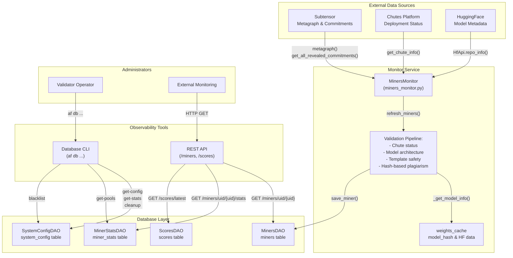
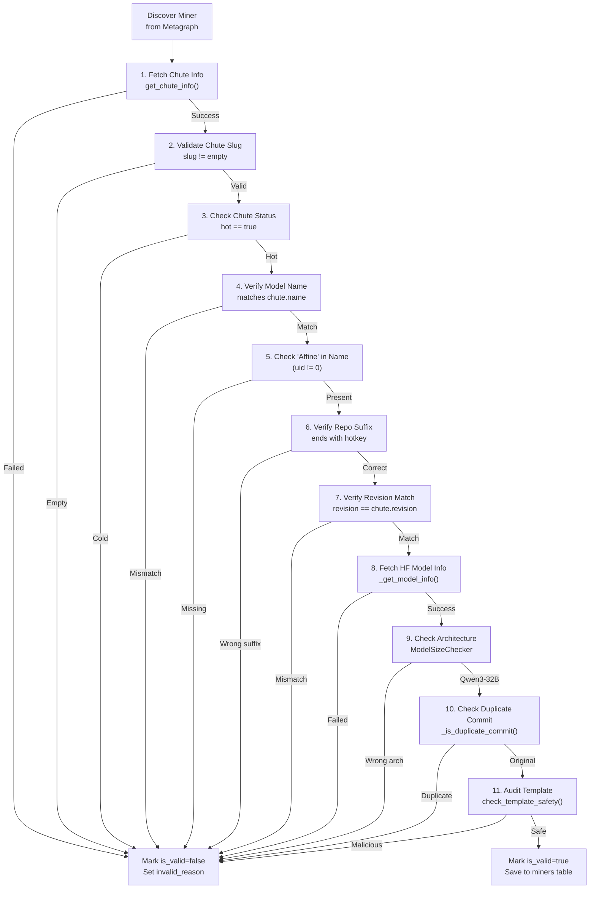
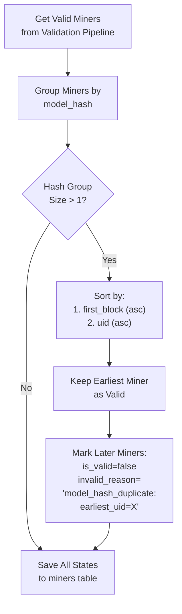
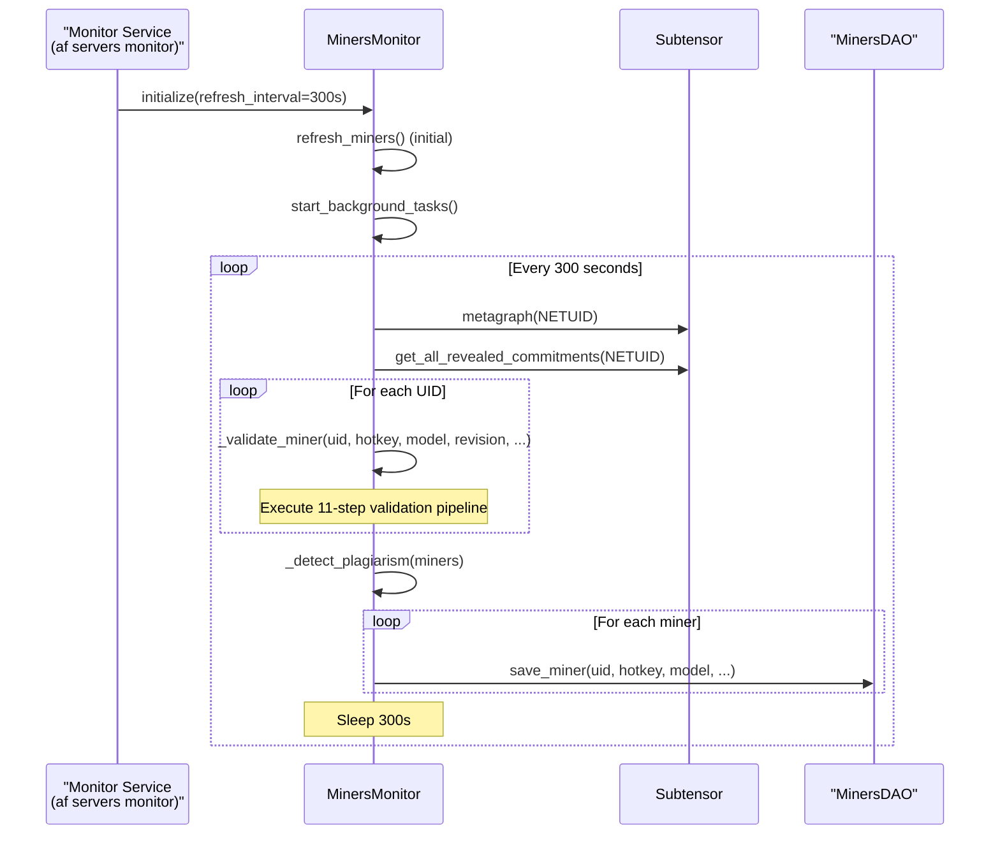

import CollapsibleAside from '../../../../components/CollapsibleAside.astro';
import SourceLink from '../../../../components/SourceLink.astro';
import Table from '../../../../components/Table.astro';

<CollapsibleAside title="Relevant Source Files">
  <SourceLink text="affine/api/routers/miners.py" href="https://github.com/AffineFoundation/affine-cortex/blob/main/affine/api/routers/miners.py" />
  <SourceLink text="affine/database/cli.py" href="https://github.com/AffineFoundation/affine-cortex/blob/main/affine/database/cli.py" />
  <SourceLink text="affine/database/dao/miners.py" href="https://github.com/AffineFoundation/affine-cortex/blob/main/affine/database/dao/miners.py" />
  <SourceLink text="affine/database/dao/scores.py" href="https://github.com/AffineFoundation/affine-cortex/blob/main/affine/database/dao/scores.py" />
  <SourceLink text="affine/database/dao/system_config.py" href="https://github.com/AffineFoundation/affine-cortex/blob/main/affine/database/dao/system_config.py" />
  <SourceLink text="affine/src/monitor/miners_monitor.py" href="https://github.com/AffineFoundation/affine-cortex/blob/main/affine/src/monitor/miners_monitor.py" />
  <SourceLink text="affine/src/scheduler/sampling_scheduler.py" href="https://github.com/AffineFoundation/affine-cortex/blob/main/affine/src/scheduler/sampling_scheduler.py" />
  <SourceLink text="affine/utils/model_size_checker.py" href="https://github.com/AffineFoundation/affine-cortex/blob/main/affine/utils/model_size_checker.py" />
  <SourceLink text="affine/utils/template_checker.py" href="https://github.com/AffineFoundation/affine-cortex/blob/main/affine/utils/template_checker.py" />
</CollapsibleAside>

## Purpose & Scope

This document describes the monitoring and observability tools for Affine validators. The system provides visibility into:

1. **Miner Validation Status** - Real-time validation state, anti-plagiarism detection, and invalidation reasons
2. **Sampling Statistics** - Per-miner sampling rates, task completion, and allocation tracking
3. **Database Health** - Configuration state, table statistics, and data retention
4. **System Configuration** - Environment settings, blacklist management, and system parameters

The monitoring system consists of:
- **MinersMonitor Service** - Continuous validation and state tracking ([affine/src/monitor/miners_monitor.py:1-764]())
- **Database CLI Tools** - Administrative commands for inspection and management ([affine/database/cli.py:1-1091]())
- **REST API Endpoints** - Programmatic access to miner and system state ([affine/api/routers/miners.py:1-127]())

For information about task scheduling, see [Task Scheduling System](/subnets/for-validators/task-scheduling-system#5.3). For scoring algorithms, see [Weight Calculation System](/subnets/for-validators/weight-calculation-system#5.4).


**Sources:** [affine/src/monitor/miners_monitor.py:1-764](), [affine/database/cli.py:1-1091](), [affine/api/routers/miners.py:1-127]()

## System Architecture

The monitoring system consists of three interconnected components providing different levels of observability.



**Sources:** [affine/src/monitor/miners_monitor.py:50-764](), [affine/database/cli.py:26-1091](), [affine/api/routers/miners.py:1-127](), [affine/database/dao/scores.py:129-277]()

## MinersMonitor Service

The `MinersMonitor` class continuously validates miners and tracks their state in the database. It runs as a background service with configurable refresh intervals.

### Miner Validation Pipeline

The monitor executes an 11-step validation pipeline for each discovered miner:



Each validation failure sets a specific `invalid_reason` field for debugging.

**Sources:** [affine/src/monitor/miners_monitor.py:288-492](), [affine/utils/model_size_checker.py:85-122](), [affine/utils/template_checker.py:99-169]()

### Data Models

The monitor uses two primary data structures:

<Table>

| Class | Purpose | Key Fields |
|-------|---------|------------|
| `MinerInfo` | In-memory validation state | `uid`, `hotkey`, `model`, `revision`, `chute_id`, `is_valid`, `invalid_reason`, `model_hash`, `template_check_result` |
| `miners` table (DB) | Persistent validation state | `pk`, `uid`, `hotkey`, `model`, `revision`, `chute_id`, `chute_slug`, `model_hash`, `chute_status`, `is_valid`, `invalid_reason`, `block_number`, `first_block`, `template_check_result` |

</Table>


**Sources:** [affine/src/monitor/miners_monitor.py:28-48](), [affine/database/dao/miners.py:34-89]()

### Anti-Plagiarism Detection

The monitor implements hash-based plagiarism detection with temporal priority:



The `model_hash` is computed from LFS SHA256 hashes of all `.safetensors` files in the HuggingFace repo, sorted lexicographically to ensure deterministic comparison.

**Sources:** [affine/src/monitor/miners_monitor.py:493-534](), [affine/src/monitor/miners_monitor.py:159-262]()

### Refresh Lifecycle

The monitor runs continuously with automatic refresh:



**Sources:** [affine/src/monitor/miners_monitor.py:93-130](), [affine/src/monitor/miners_monitor.py:536-764]()

## Database CLI Tools

The `af db` command suite provides administrative access to system state and statistics.

### Command Structure

```mermaid
graph TB
    DB["af db"]
    
    subgraph "Configuration"
        LoadConfig["load-config<br/>--json-file"]
        GetConfig["get-config"]
        SetBurn["set-burn"]
        GetBurn["get-burn"]
    end
    
    subgraph "Blacklist"
        BLList["blacklist list"]
        BLAdd["blacklist add"]
        BLRemove["blacklist remove"]
        BLClear["blacklist clear"]
    end
    
    subgraph "Statistics"
        GetStats["get-stats"]
        GetPools["get-pools"]
    end
    
    subgraph "Maintenance"
        Init["init"]
        Reset["reset"]
        ResetTable["reset-table"]
        Cleanup["cleanup-inactive-miners"]
        UpdateMiners["update-miners"]
    end
    
    DB --> LoadConfig
    DB --> GetConfig
    DB --> SetBurn
    DB --> GetBurn
    DB --> BLList
    DB --> BLAdd
    DB --> BLRemove
    DB --> BLClear
    DB --> GetStats
    DB --> GetPools
    DB --> Init
    DB --> Reset
    DB --> ResetTable
    DB --> Cleanup
    DB --> UpdateMiners
```



**Sources:** [affine/database/cli.py:889-1091]()

### Key Commands

<Table>

| Command | Purpose | Example |
|---------|---------|---------|
| `get-config` | Display system configuration | `af db get-config` |
| `load-config` | Load config from JSON | `af db load-config --json-file config.json` |
| `blacklist list` | Show blacklisted hotkeys | `af db blacklist list` |
| `blacklist add` | Add hotkey to blacklist | `af db blacklist add 5F3sa2TJ...` |
| `cleanup-inactive-miners` | Remove old zero-weight miners | `af db cleanup-inactive-miners --days 30` |
| `get-stats` | Show miner statistics (legacy) | `af db get-stats` |

</Table>


**Sources:** [affine/database/cli.py:423-540](), [affine/database/cli.py:279-373](), [affine/database/cli.py:622-670]()

### Configuration Inspection

#### `af db get-config`

Display complete system configuration including environments, blacklist, and burn percentage.

**Output Format:**
```
================================================================================
VALIDATOR BURN PERCENTAGE
================================================================================
Value: 0.0%
Updated: 2024-01-15 10:30:00
Updated by: cli_set_burn_percentage

================================================================================
BLACKLIST
================================================================================
Count: 2 hotkey(s)
  1. 5F3sa2TJt...
  2. 5Cwd8hK9q...

================================================================================
ENVIRONMENTS CONFIGURATION
================================================================================
Total environments: 11

────────────────────────────────────────────────────────────────────────────────
Environment: SAT
────────────────────────────────────────────────────────────────────────────────
Status: [sampling+scoring]

Sampling Configuration:
  Dataset range: [[0, 9999]]
  Sampling count: 100
  Sampling list: 100 tasks
    Tasks: [0, 1, 2, 3, 4, '...', 95, 96, 97, 98, 99]
  Rotation enabled: True
  Rotation count: 10 tasks/rotation
  Rotation interval: 3600s (1.0 hours)
  Last rotation: 1800s ago (0.5 hours)

Scoring Configuration:
  Weights: {
    "L1": 0.1,
    "L2": 0.15,
    "L3": 0.2,
    "L4": 0.25,
    "L5": 0.2,
    "L6": 0.1
}
```

**Sources:** [affine/database/cli.py:423-540]()

#### `af db cleanup-inactive-miners`

Remove miners that have been inactive for a specified period and have never received weight.

**Usage:**
```bash
af db cleanup-inactive-miners --days 30
```

**Output:**
```
Found 15 inactive miners (>30 days, zero weight):

1. 5F3sa2TJ...#a1b2c3d4... (last_updated: 2023-12-01, weight: 0.0)
2. 5Cwd8hK9...#e5f6g7h8... (last_updated: 2023-11-28, weight: 0.0)
... and 13 more

WARNING: Delete 15 miners? Type 'yes' to confirm: yes
✓ Cleanup completed: 15 miners deleted
```

**Sources:** [affine/database/cli.py:622-670]()

## REST API Endpoints

The API service exposes miner and system state through HTTP endpoints. All endpoints require authentication except `/health`.

### Miner Status Endpoints

#### `GET /miners/uid/{uid}`

Retrieve complete miner information by UID.

**Response Structure:**
```json
{
  "uid": 42,
  "hotkey": "5F3sa2TJt...",
  "model": "user/affine-model-5F3sa2TJt",
  "revision": "a1b2c3d4e5f6...",
  "chute_id": "uuid-chute-id",
  "chute_slug": "user-affine-model",
  "chute_status": "hot",
  "model_hash": "sha256hash...",
  "is_valid": "true",
  "invalid_reason": null,
  "block_number": 7654321,
  "first_block": 7500000,
  "template_check_result": "safe"
}
```

**Validation Status:**
- `is_valid: "true"` - Miner passed all validation checks
- `is_valid: "false"` - Miner failed validation, see `invalid_reason`

**Common Invalid Reasons:**
- `"no_commit"` - No blockchain commitment found
- `"chute_not_hot"` - Chute deployment is cold
- `"model_hash_duplicate:earliest_uid=X"` - Plagiarism detected
- `"model_check:model_not_allowed"` - Wrong architecture (not Qwen3-32B)
- `"malicious_template:<reason>"` - Template safety audit failed
- `"blacklisted"` - Hotkey is blacklisted

**Sources:** [affine/api/routers/miners.py:19-62](), [affine/database/dao/miners.py:34-89]()

#### `GET /miners/uid/{uid}/stats`

Retrieve sampling statistics for a miner.

**Response Structure:**
```json
{
  "uid": 42,
  "hotkey": "5F3sa2TJt...",
  "revision": "a1b2c3d4e5f6...",
  "sampling_stats": {
    "last_15min": {
      "total_samples": 12,
      "total_allocations": 15
    },
    "last_1hour": {
      "total_samples": 45,
      "total_allocations": 52
    },
    "last_6hours": {
      "total_samples": 250,
      "total_allocations": 280
    },
    "last_24hours": {
      "total_samples": 950,
      "total_allocations": 1080
    }
  },
  "env_stats": {
    "SAT": {
      "last_1hour": {
        "samples": 8,
        "allocations": 10
      }
    },
    "LGC-V2": {
      "last_1hour": {
        "samples": 12,
        "allocations": 14
      }
    }
  }
}
```

**Metric Definitions:**
- `total_samples` - Completed task executions
- `total_allocations` - Tasks assigned (may exceed samples if some failed)

**Sources:** [affine/api/routers/miners.py:65-127]()

### Scoring Endpoints

#### `GET /scores/latest`

Retrieve the most recent score snapshot for all miners.

**Response Structure:**
```json
{
  "block_number": 7654321,
  "calculated_at": 1704067200,
  "scores": [
    {
      "block_number": 7654321,
      "miner_hotkey": "5F3sa2TJt...",
      "uid": 42,
      "model_revision": "a1b2c3d4e5f6...",
      "model": "user/affine-model-5F3sa2TJt",
      "first_block": 7500000,
      "calculated_at": 1704067200,
      "overall_score": 0.0234,
      "average_score": 0.789,
      "scores_by_layer": {
        "L1": 0.682,
        "L2": 0.745,
        "L3": 0.801,
        "L4": 0.834,
        "L5": 0.812,
        "L6": 0.760
      },
      "scores_by_env": {
        "SAT": {
          "score": 0.823,
          "sample_count": 100,
          "completeness": 1.0
        },
        "LGC-V2": {
          "score": 0.756,
          "sample_count": 100,
          "completeness": 1.0
        }
      },
      "total_samples": 1100
    }
  ]
}
```

**Sources:** [affine/database/dao/scores.py:129-171]()

#### `GET /scores/weights/latest`

Retrieve weights in format suitable for chain setting.

**Response Structure:**
```json
{
  "block_number": 7654321,
  "calculated_at": 1704067200,
  "weights": {
    "5F3sa2TJt...": 0.0234,
    "5Cwd8hK9q...": 0.0189
  },
  "uids": {
    "42": 0.0234,
    "57": 0.0189,
    "1001": 0.0150
  }
}
```

Note: UIDs > 1000 are system miners whose weights get allocated to UID 0 by the validator.

**Sources:** [affine/database/dao/scores.py:233-277]()

## Deployment & Configuration

### Running Monitor Service

Start the monitor as a standalone service:

```bash
af servers monitor --refresh-interval 300
```

**Configuration Options:**

<Table>

| Flag | Default | Description |
|------|---------|-------------|
| `--refresh-interval` | `300` | Seconds between validation refreshes |

</Table>


The monitor runs continuously and saves validation state to the `miners` table after each refresh cycle.

**Sources:** Implied from [affine/src/monitor/miners_monitor.py:63-130]()

### Environment Variables

The monitor service requires the following environment variables:

<Table>

| Variable | Purpose | Required |
|----------|---------|----------|
| `HF_TOKEN` | HuggingFace API token for model access | Yes |
| `CHUTES_API_KEY` | Chutes platform API key | Yes |
| `AFFINE_MINER_BLACKLIST` | Comma-separated hotkeys to blacklist | No |

</Table>


**Blacklist Sources:**
The system merges blacklists from two sources:
1. Environment variable `AFFINE_MINER_BLACKLIST`
2. Database parameter `miner_blacklist` (managed via `af db blacklist` commands)

**Sources:** [affine/src/monitor/miners_monitor.py:132-157]()

### Docker Deployment

In docker-compose.backend.yml, the monitor runs independently:

```yaml
services:
  monitor:
    image: affinefoundation/affine:latest
    command: af servers monitor --refresh-interval 300
    environment:
      - HF_TOKEN=${HF_TOKEN}
      - CHUTES_API_KEY=${CHUTES_API_KEY}
      - AFFINE_MINER_BLACKLIST=${AFFINE_MINER_BLACKLIST:-}
    volumes:
      - ~/.bittensor/wallets:/root/.bittensor/wallets:ro
```

**Sources:** Implied from Diagram 6 in high-level architecture

## Common Monitoring Workflows

### 1. Check Miner Validation Status

```bash
# Get all valid miners
curl http://localhost:8000/api/v1/miners/valid | jq

# Check specific miner by UID
curl http://localhost:8000/api/v1/miners/uid/42 | jq

# Check invalid reason
curl http://localhost:8000/api/v1/miners/uid/42 | jq '.invalid_reason'
```

**Key Fields:**
- `is_valid`: `"true"` or `"false"`
- `invalid_reason`: Specific validation failure (e.g., `"model_hash_duplicate:earliest_uid=15"`)
- `template_check_result`: `"safe"`, `"unsafe:reason"`, or `null`
- `chute_status`: `"hot"` or `"cold"`

### 2. Identify Plagiarism Cases

```bash
# Find all miners with duplicate model hashes
curl http://localhost:8000/api/v1/miners/invalid | jq '.[] | select(.invalid_reason | startswith("model_hash_duplicate"))'

# Get the earliest miner for a hash
curl http://localhost:8000/api/v1/miners/uid/42 | jq '{uid, model_hash, first_block}'
```

### 3. Monitor Sampling Progress

```bash
# Get sampling stats for a miner
curl http://localhost:8000/api/v1/miners/uid/42/stats | jq

# Check per-environment progress
curl http://localhost:8000/api/v1/miners/uid/42/stats | jq '.env_stats'
```

**Useful Metrics:**
- `sampling_stats.last_1hour.total_samples`: Recent activity
- `sampling_stats.last_24hours.total_samples`: Daily throughput
- `env_stats.<ENV>.last_1hour.samples`: Per-environment completion

### 4. Inspect System Configuration

```bash
# View all configuration
af db get-config

# Check specific environment settings
af db get-config | grep -A 20 "Environment: SAT"

# View blacklist
af db blacklist list
```

### 5. Investigate Invalid Miners

```bash
# Get detailed validation errors from database
af db get-config | grep -A 5 "invalid_reason"

# Check template safety results
curl http://localhost:8000/api/v1/miners/uid/42 | jq '.template_check_result'
```

**Common Validation Failures:**

<Table>

| Invalid Reason | Meaning | Action |
|----------------|---------|--------|
| `no_commit` | No blockchain commitment | Wait for miner to commit |
| `chute_not_hot` | Chute deployment failed | Check Chutes platform |
| `model_check:model_not_allowed:...` | Wrong architecture | Verify model is Qwen3-32B |
| `malicious_template:...` | Template safety failed | Review chat_template code |
| `model_hash_duplicate:earliest_uid=X` | Plagiarism detected | Compare with UID X |
| `blacklisted` | Hotkey blacklisted | Check blacklist reason |

</Table>


**Sources:** [affine/api/routers/miners.py:19-127](), [affine/database/cli.py:423-540]()

## Validation Check Reference

### Architecture Validation

The `ModelSizeChecker` enforces exact architecture requirements:

**Required Configuration (Qwen3-32B):**
```python
REQUIRED_MODEL_CONFIG = {
    "model_type": "qwen3",
    "hidden_size": 5120,
    "num_hidden_layers": 64,
    "intermediate_size": 25600,
    "vocab_size": 151936,
    "num_attention_heads": 64,
    "num_key_value_heads": 8,
}
```

Any mismatch results in rejection with `invalid_reason: "model_check:model_not_allowed:<field>=<actual> (expected <expected>)"`

**Sources:** [affine/utils/model_size_checker.py:32-52]()

### Template Safety Audit

The `TemplateChecker` uses LLM-based analysis to detect malicious code:

**Audit Process:**
1. Extract `chat_template` from `tokenizer_config.json`
2. Verify template exists (missing = rejection)
3. Check length &lt; 100KB (too large = auto-reject)
4. Submit to DeepSeek-V3 for analysis
5. Parse JSON response for `is_malicious` verdict

**Rejection Reasons:**
- `"missing_chat_template"` - No template defined
- `"template_exceeds_context_limit:<bytes>"` - Too large for LLM
- `"llm_audit_failed:<reason>"` - LLM detected malicious patterns

**Cached Results:**
The `template_check_result` field is cached in the database to avoid redundant audits. It persists across validation cycles unless the model/revision changes.

**Sources:** [affine/utils/template_checker.py:76-169](), [affine/src/monitor/miners_monitor.py:443-488]()

### Hash-Based Plagiarism

The system computes a deterministic hash from model weight files:

**Hash Calculation:**
```python
# 1. Get LFS SHA256 for all .safetensors files
siblings = hf_api.repo_info(model_id, revision).siblings
shas = [file.lfs["sha256"] for file in siblings if file.rfilename.endswith(".safetensors")]

# 2. Sort lexicographically and hash
model_hash = hashlib.sha256("".join(sorted(shas)).encode()).hexdigest()
```

**Duplicate Detection:**
- Group all valid miners by `model_hash`
- Within each group, sort by `first_block` (earliest first)
- Keep earliest miner as valid
- Mark later miners as `invalid_reason: "model_hash_duplicate:earliest_uid=<uid>"`

**Sources:** [affine/src/monitor/miners_monitor.py:159-262](), [affine/src/monitor/miners_monitor.py:493-534]()

### Commit History Checks

The monitor inspects HuggingFace commit messages for suspicious patterns:

**Automatic Blocks:**
- `> 100 commits` → `"blocked:too_many_commits"`
- `commit message > 200 chars` → `"blocked:commit_msg_too_long"`
- `commit starts with "Duplicate from"` → `"duplicate_repo:from=<source>"`

These checks prevent miners from using automated duplication tools that leave traces in git history.

**Sources:** [affine/src/monitor/miners_monitor.py:228-286]()

## Troubleshooting

### Monitor Not Initializing

**Symptom:** No monitoring API available, no logs about monitoring startup

**Possible Causes:**
1. Monitoring not enabled: Use `--enable-monitoring` flag
2. Port conflict: Change `--monitor-port` to unused port
3. FastAPI/uvicorn not installed: Check dependencies

**Debug:**
```bash
# Check if monitoring is enabled
ps aux | grep "af runner"

# Test port availability
netstat -tuln | grep 8765
```

### Historical Data Not Loading

**Symptom:** All counters show zero immediately after startup

**Check logs for:**
```
[Monitor] Loading last 7200 blocks to initialize sample counters
[Monitor] Loaded X samples: Y in last 1h, Z in last 24h
```

**If missing:**
- R2 storage may be unavailable
- No historical data exists (new deployment)
- `dataset()` function failing silently

**Sources:** [affine/scheduler/monitor.py:172-228]()

### Inaccurate Metrics

**Symptom:** Sample counts don't match expected values

**Common Issues:**
1. **Time zone mismatch**: All timestamps are Unix epoch (UTC)
2. **Deque overflow**: Events older than 1 hour are automatically dropped
3. **Monitor restart**: Counters reset unless historical data loads successfully

**Verification:**
```bash
# Check if historical load succeeded
grep "Monitor.*Loaded.*samples" logs.txt

# Verify timestamps in responses
curl http://localhost:8765/status/miners/42 | jq '.last_error_time'
```

### High Memory Usage

**Symptom:** Monitoring process consuming excessive memory

**Cause:** Each miner has a deque with `maxlen=3600` for samples and errors. With many miners and high sampling rates, this can add up.

**Calculation:**
```
Memory per miner ≈ 3600 events * 2 deques * ~100 bytes/event ≈ 720 KB
For 100 miners ≈ 72 MB
```

This is generally acceptable, but with thousands of miners, consider reducing `maxlen` or sampling fewer miners.

**Sources:** [affine/scheduler/monitor.py:156-157]()

---

**Complete Sources for This Document:**
- [affine/scheduler/monitor.py:1-562]()
- [affine/scheduler/api.py:1-371]()
- [affine/scheduler/scheduler.py:1-540]()
- [affine/cli.py:60-124]()
- [affine/scheduler/config.py:1-78]()
- [affine/scheduler/sampler.py:1-91]()
