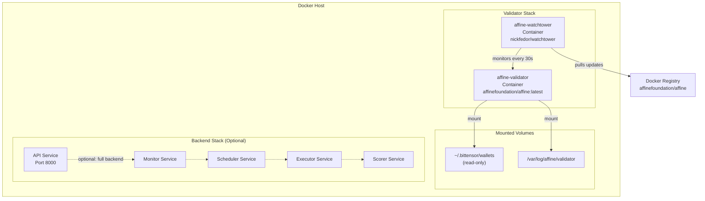
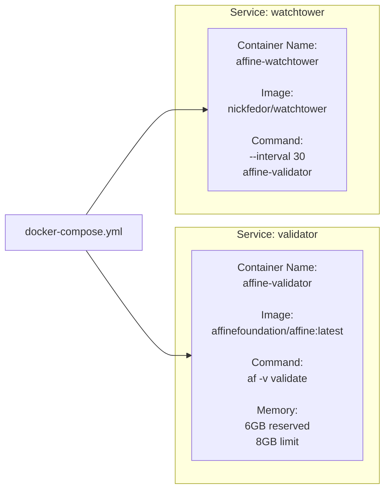
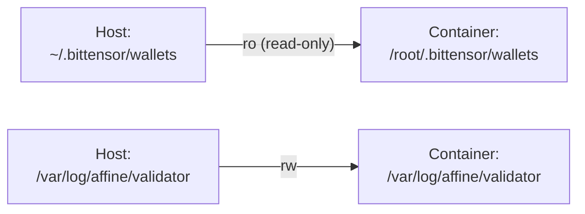
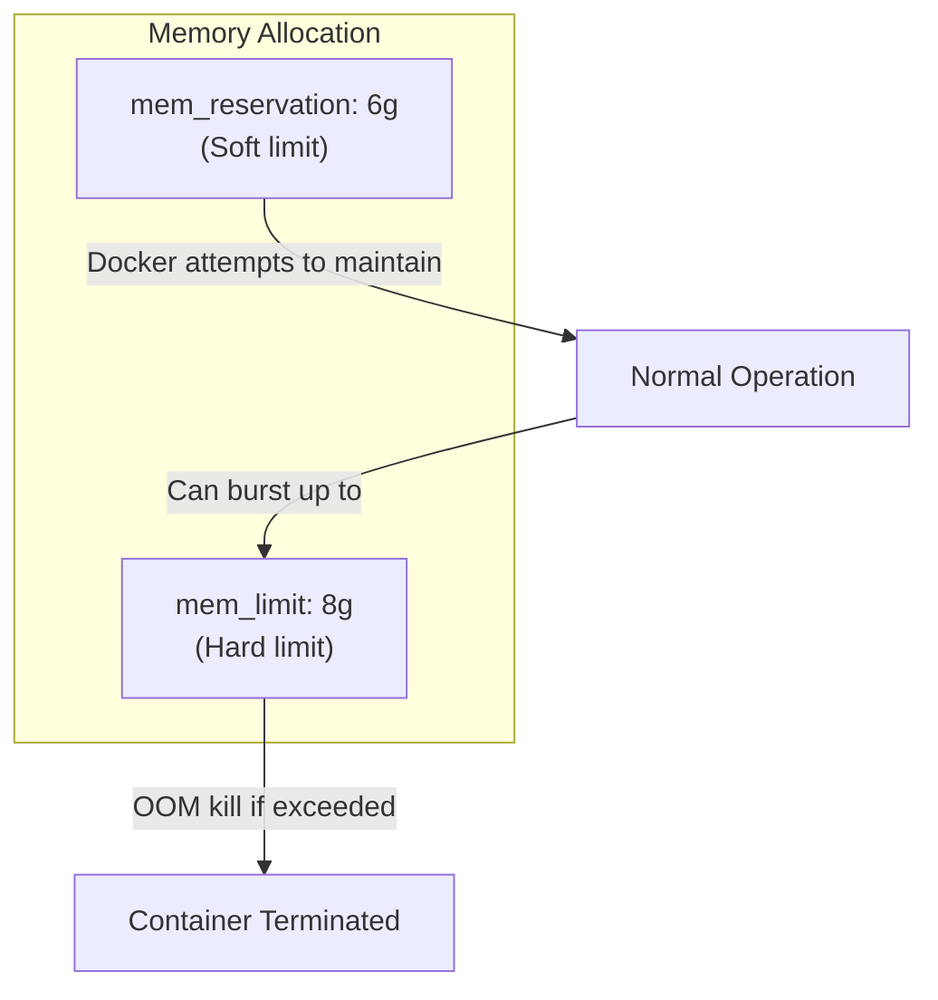
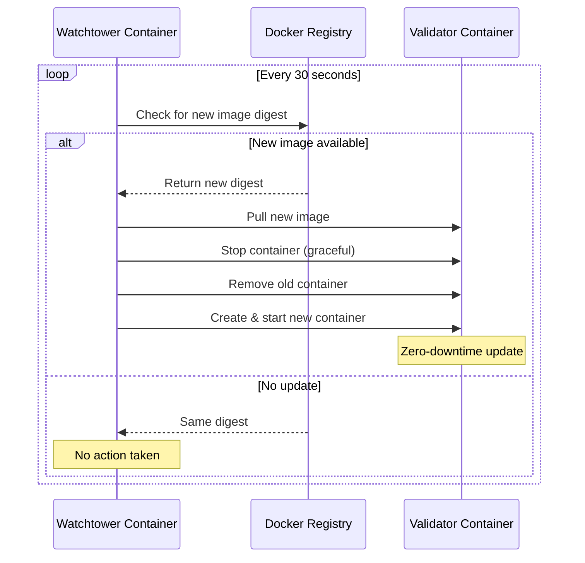
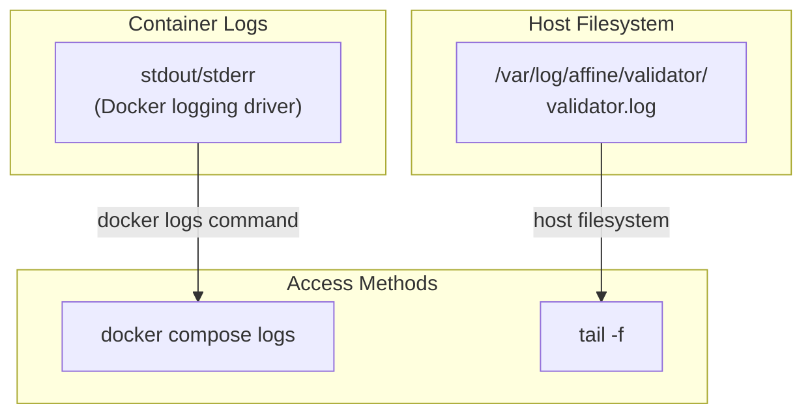

import CollapsibleAside from '../../../../components/CollapsibleAside.astro';
import SourceLink from '../../../../components/SourceLink.astro';
import Table from '../../../../components/Table.astro';

<CollapsibleAside title="Relevant Source Files">
  <SourceLink text="docker-compose.local.yml" href="https://github.com/AffineFoundation/affine-cortex/blob/main/docker-compose.local.yml" />
  <SourceLink text="docker-compose.yml" href="https://github.com/AffineFoundation/affine-cortex/blob/main/docker-compose.yml" />
  <SourceLink text="pyproject.toml" href="https://github.com/AffineFoundation/affine-cortex/blob/main/pyproject.toml" />
  <SourceLink text="uv.lock" href="https://github.com/AffineFoundation/affine-cortex/blob/main/uv.lock" />
</CollapsibleAside>

This guide covers the practical steps for deploying and operating a validator node on Affine Cortex using Docker Compose. It focuses on the deployment configuration, service management, and operational procedures. For conceptual information about validator responsibilities, see [Validator Overview](/subnets/for-validators/validator-overview#5.1). For details on the internal systems (task scheduling, scoring, monitoring), see sections [5.3](#5.3), [5.4](#5.4), and [5.5](#5.5).

---

## Prerequisites

Before deploying a validator, ensure the following requirements are met:

### System Requirements

<Table>

| Resource | Minimum | Recommended |
|----------|---------|-------------|
| CPU | 4 cores | 8+ cores |
| RAM | 16 GB | 32 GB |
| Storage | 100 GB SSD | 500 GB SSD |
| Network | 100 Mbps | 1 Gbps |

</Table>


### Required Software

- **Docker Engine** 20.10+
- **Docker Compose** 2.0+
- **uv** (Python package manager) for local development

### Bittensor Configuration

- Registered Bittensor wallet with coldkey and hotkey
- Wallet must be registered on **Subnet 64**
- Sufficient TAO for transaction fees

### External Service Access

- **Subtensor Endpoint**: Access to Bittensor blockchain node
- **Chutes API Key**: For model deployment validation
- **HuggingFace Token**: For model repository access
- **AWS Credentials**: For DynamoDB and S3 (if using AWS services)

**Sources:** [pyproject.toml:1-53](), [docker-compose.yml:1-26]()

---

## Configuration Setup

### Environment File Structure

Create a `.env` file in the repository root with the following variables:

```bash
# Bittensor Configuration
BT_WALLET_COLD=<coldkey_name>
BT_WALLET_HOT=<hotkey_name>
SUBTENSOR_ENDPOINT=wss://entrypoint-finney.opentensor.ai:443
SUBTENSOR_NETWORK=finney

# External Services
CHUTES_API_KEY=<chutes_api_key>
HF_TOKEN=<huggingface_token>

# AWS Configuration (if using AWS)
AWS_ACCESS_KEY_ID=<aws_access_key>
AWS_SECRET_ACCESS_KEY=<aws_secret_key>
AWS_DEFAULT_REGION=us-east-1

# Service Configuration
SERVICE_MODE=true
API_URL=http://api:8000/api/v1
```

### Wallet Directory Structure

Ensure Bittensor wallets are located at `~/.bittensor/wallets` with the following structure:

```
~/.bittensor/wallets/
└── <coldkey_name>/
    └── hotkeys/
        └── <hotkey_name>
```

The validator service mounts this directory as **read-only** for security.

**Sources:** [docker-compose.yml:11-16]()

---

## Deployment Architecture

### Container Topology



**Sources:** [docker-compose.yml:1-26](), [docker-compose.local.yml:1-15]()

---

## Deployment Options

### Option 1: Production Validator (Recommended)

This deploys a single validator service with automatic updates via Watchtower.

#### Service Definition Mapping



#### Deployment Steps

1. **Pull the latest image:**
   ```bash
   docker pull affinefoundation/affine:latest
   ```

2. **Start the validator:**
   ```bash
   docker compose up -d
   ```

3. **Verify services are running:**
   ```bash
   docker compose ps
   ```

   Expected output:
   ```
   NAME                 IMAGE                           STATUS
   affine-validator     affinefoundation/affine:latest  Up
   affine-watchtower    nickfedor/watchtower           Up
   ```

**Sources:** [docker-compose.yml:4-25]()

---

### Option 2: Local Development Build

For testing changes before production deployment.

#### Build and Deploy

```bash
# Build local image and start validator
docker compose -f docker-compose.yml -f docker-compose.local.yml up --build
```

This configuration:
- Builds image from local `Dockerfile` as `affine:local`
- Disables Watchtower (using profiles)
- Suitable for rapid iteration

**Key differences from production:**

<Table>

| Aspect | Production | Local Development |
|--------|-----------|-------------------|
| Image Source | Registry (`affinefoundation/affine:latest`) | Local build (`affine:local`) |
| Watchtower | Enabled | Disabled |
| Updates | Automatic every 30s | Manual rebuild required |

</Table>


**Sources:** [docker-compose.local.yml:1-15]()

---

### Option 3: Full Backend Services

Deploys all microservices for complete validator infrastructure. This is typically used when running a validator with custom monitoring or debugging requirements.

```bash
docker compose -f docker-compose.backend.yml up -d
```

This deploys six services: API, Monitor, Scheduler, Executor, Scorer, Validator. See [Backend Services](/subnets/system-architecture/backend-services#3.2) for details on each component.

**Sources:** High-level architecture diagrams

---

## Service Configuration Reference

### Validator Service Parameters

The validator service is configured through environment variables and command-line flags.

#### Environment Variables

<Table>

| Variable | Purpose | Example | Source |
|----------|---------|---------|--------|
| `SERVICE_MODE` | Enable continuous loop | `true` | [docker-compose.yml:13]() |
| `BT_WALLET_COLD` | Coldkey name | `my_coldkey` | `.env` |
| `BT_WALLET_HOT` | Hotkey name | `my_hotkey` | `.env` |
| `SUBTENSOR_ENDPOINT` | Blockchain RPC | `wss://entrypoint-finney.opentensor.ai:443` | `.env` |

</Table>


#### Volume Mounts



**Read-only wallet mount** (`ro` flag) prevents accidental modification of private keys from within the container.

**Sources:** [docker-compose.yml:14-16]()

#### Command Execution

The validator runs the following command:

```bash
af -v validate
```

This maps to the `af` CLI defined in [pyproject.toml:42](), which executes the validator service logic.

**Sources:** [docker-compose.yml:17](), [pyproject.toml:41-42]()

---

## Resource Management

### Memory Limits



- **Reservation (6 GB):** Docker scheduler ensures this memory is available
- **Limit (8 GB):** Container cannot exceed this threshold; OOM killer engages if violated

**Sources:** [docker-compose.yml:8-9]()

---

## Watchtower Auto-Update System

### Update Mechanism



**Watchtower Configuration:**
- **Interval:** 30 seconds ([docker-compose.yml:25]())
- **Target:** `affine-validator` container only
- **Socket Mount:** `/var/run/docker.sock` for Docker API access

**Disabling Watchtower:**

For manual update control, comment out the watchtower service in `docker-compose.yml` or use profiles:

```yaml
watchtower:
  profiles:
    - production  # Only starts with --profile production
```

**Sources:** [docker-compose.yml:19-25](), [docker-compose.local.yml:13-15]()

---

## Operational Procedures

### Starting the Validator

```bash
# Start in detached mode
docker compose up -d

# View startup logs
docker compose logs -f validator
```

### Stopping the Validator

```bash
# Graceful shutdown
docker compose down

# Force stop (if unresponsive)
docker compose kill validator
docker compose rm -f validator
```

### Viewing Logs

```bash
# Live log streaming
docker compose logs -f validator

# Last 100 lines
docker compose logs --tail=100 validator

# Host filesystem logs
tail -f /var/log/affine/validator/validator.log
```

### Checking Service Status

```bash
# Container status
docker compose ps

# Resource usage
docker stats affine-validator

# Health checks
docker inspect affine-validator | jq '.[0].State.Health'
```

### Manual Image Updates

If Watchtower is disabled:

```bash
# Pull latest image
docker compose pull

# Recreate containers
docker compose up -d --force-recreate
```

**Sources:** [docker-compose.yml:1-26]()

---

## Log Management

### Log Locations



### Log Rotation

Docker's default JSON logging driver does not rotate logs automatically. Configure log rotation in `/etc/docker/daemon.json`:

```json
{
  "log-driver": "json-file",
  "log-opts": {
    "max-size": "100m",
    "max-file": "5"
  }
}
```

Restart Docker daemon after changes:

```bash
sudo systemctl restart docker
```

**Sources:** [docker-compose.yml:16]()

---

## Troubleshooting

### Common Issues and Solutions

<Table>

| Issue | Symptoms | Resolution |
|-------|----------|------------|
| **Wallet not found** | `Error: Wallet 'X' not found` | Verify wallet path: `ls ~/.bittensor/wallets` |
| **Permission denied** | `PermissionError: /root/.bittensor/wallets` | Check mount permissions: `ls -la ~/.bittensor/wallets` |
| **Out of memory** | Container restarts, OOM in `dmesg` | Increase `mem_limit` or reduce concurrent tasks |
| **Network unreachable** | `Connection refused` to Subtensor | Verify `SUBTENSOR_ENDPOINT` in `.env` |
| **Invalid signature** | `AuthenticationError` | Check wallet has correct permissions on subnet 64 |

</Table>


### Diagnostic Commands

```bash
# Verify environment variables
docker compose config

# Check container health
docker inspect affine-validator --format='{{.State.Health.Status}}'

# View recent errors
docker compose logs validator | grep -i error

# Check wallet mount
docker exec affine-validator ls -la /root/.bittensor/wallets

# Test Subtensor connectivity
docker exec affine-validator ping -c 3 entrypoint-finney.opentensor.ai
```

### Emergency Recovery

If the validator becomes unresponsive:

1. **Force restart:**
   ```bash
   docker compose restart validator
   ```

2. **Full cleanup and restart:**
   ```bash
   docker compose down
   docker compose up -d
   ```

3. **Reset state (nuclear option):**
   ```bash
   docker compose down -v  # Removes volumes
   docker system prune -a  # Cleans images/cache
   docker compose up -d
   ```

**Sources:** [docker-compose.yml:1-26]()

---

## Maintenance Schedule

### Daily Tasks

- Monitor validator logs for errors
- Verify weight-setting transactions on-chain
- Check resource usage (CPU, memory, disk)

### Weekly Tasks

- Review log rotation status
- Audit wallet balance for transaction fees
- Verify subnet registration status

### Monthly Tasks

- Update Docker Engine and Compose
- Review and optimize memory limits
- Audit security configurations

**Sources:** [docker-compose.yml:1-26]()

---

## Advanced Configuration

### Custom Entry Point

Override the default command for debugging:

```yaml
services:
  validator:
    command: ["bash"]  # Start interactive shell
    stdin_open: true
    tty: true
```

Then attach to the container:

```bash
docker attach affine-validator
```

### Network Configuration

For custom network setups:

```yaml
services:
  validator:
    networks:
      - affine_network
    extra_hosts:
      - "subtensor.local:192.168.1.100"
      
networks:
  affine_network:
    driver: bridge
```

### Environment Variable Override

Override `.env` variables at runtime:

```bash
docker compose run -e SUBTENSOR_ENDPOINT=ws://localhost:9944 validator
```

**Sources:** [docker-compose.yml:1-26]()

---

## Upgrading the Validator

### Automatic Upgrades (Watchtower Enabled)

No action required. Watchtower checks every 30 seconds and updates automatically.

### Manual Upgrades

```bash
# Stop validator
docker compose down

# Pull latest image
docker pull affinefoundation/affine:latest

# Start with new image
docker compose up -d

# Verify new version
docker exec affine-validator af --version
```

### Rollback Procedure

If an update causes issues:

```bash
# Stop current version
docker compose down

# Tag and use previous version
docker tag affinefoundation/affine:<previous_tag> affinefoundation/affine:latest

# Restart
docker compose up -d
```

**Sources:** [docker-compose.yml:5](), [docker-compose.yml:19-25]()

---

## Security Considerations

### Wallet Protection

- **Read-only mount:** Prevents accidental key modification ([docker-compose.yml:15]())
- **File permissions:** Ensure wallet files are `0600` (owner read/write only)
- **Backup strategy:** Maintain encrypted offline backups of wallet files

### Container Isolation

- **No privileged mode:** Validator runs without elevated privileges
- **Resource limits:** Prevents resource exhaustion attacks
- **Network isolation:** Use Docker networks to isolate services

### Environment Variable Security

Avoid committing `.env` to version control:

```bash
# Add to .gitignore
echo ".env" >> .gitignore
```

Use Docker secrets for production:

```yaml
services:
  validator:
    secrets:
      - bt_wallet_cold
      - bt_wallet_hot
      
secrets:
  bt_wallet_cold:
    file: ./secrets/wallet_cold.txt
  bt_wallet_hot:
    file: ./secrets/wallet_hot.txt
```

**Sources:** [docker-compose.yml:10-16]()
