import CollapsibleAside from '../../../../components/CollapsibleAside.astro';
import SourceLink from '../../../../components/SourceLink.astro';
import Table from '../../../../components/Table.astro';

<CollapsibleAside title="Relevant Source Files">
  <SourceLink text="affine/database/cli.py" href="https://github.com/AffineFoundation/affine-cortex/blob/main/affine/database/cli.py" />
  <SourceLink text="affine/src/scheduler/__init__.py" href="https://github.com/AffineFoundation/affine-cortex/blob/main/affine/src/scheduler/__init__.py" />
  <SourceLink text="affine/src/scheduler/main.py" href="https://github.com/AffineFoundation/affine-cortex/blob/main/affine/src/scheduler/main.py" />
  <SourceLink text="affine/src/scheduler/sampling_scheduler.py" href="https://github.com/AffineFoundation/affine-cortex/blob/main/affine/src/scheduler/sampling_scheduler.py" />
</CollapsibleAside>

The Task Scheduling System is responsible for generating, allocating, and managing evaluation tasks for all miners in the network. It implements a sophisticated weighted allocation strategy with fairness guarantees, anti-starvation mechanisms, and rate limiting to prevent answer memorization attacks. This system runs as the Scheduler Service and coordinates with the database and other services to maintain an optimal task distribution across environments.

For information about task execution, see [Executor Service](/subnets/backend-services-deep-dive/executor-service#11.4). For details on how miners are validated before receiving tasks, see [Monitor Service](/subnets/backend-services-deep-dive/monitor-service#11.2). For task pool database structure, see [Task Pool Management](/subnets/database-storage/task-pool-management#8.3).

---

## Architecture Overview

The scheduler service consists of three independent schedulers that work together to manage the complete task lifecycle:

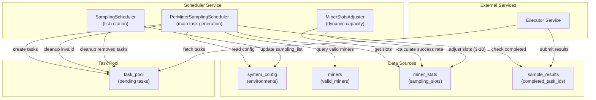

**Scheduler Components:**

<Table>

| Component | File | Purpose | Frequency |
|-----------|------|---------|-----------|
| `PerMinerSamplingScheduler` | [affine/src/scheduler/sampling_scheduler.py:22-949]() | Main task generation with weighted allocation, anti-starvation, rate limiting | Every 10 seconds |
| `SamplingScheduler` | [affine/src/scheduler/sampling_scheduler.py:951-1179]() | Sampling list rotation and size adjustment | Every 5 minutes |
| `MinerSlotsAdjuster` | [affine/src/scheduler/slots_adjuster.py]() | Dynamic slot adjustment based on success rates | Every 5 minutes |

</Table>


**Sources:** [affine/src/scheduler/main.py:19-109](), [affine/src/scheduler/sampling_scheduler.py:22-76](), [affine/src/scheduler/sampling_scheduler.py:951-969]()

---

## Per-Miner Task Generation

The `PerMinerSamplingScheduler` is the core scheduling component that generates tasks independently for each miner. It runs every 10 seconds to incrementally allocate tasks based on available capacity and configured weights.

### Scheduling Loop Flow

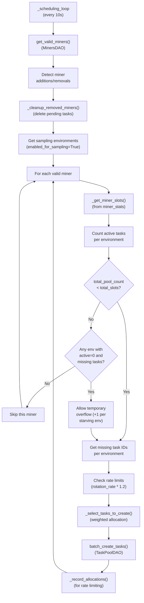

**Sources:** [affine/src/scheduler/sampling_scheduler.py:125-189](), [affine/src/scheduler/sampling_scheduler.py:355-469]()

### Capacity Management

Each miner has a dynamic number of **sampling slots** (3-10, default 6) stored in the `miner_stats` table. The scheduler enforces capacity limits while allowing temporary overflow for anti-starvation:

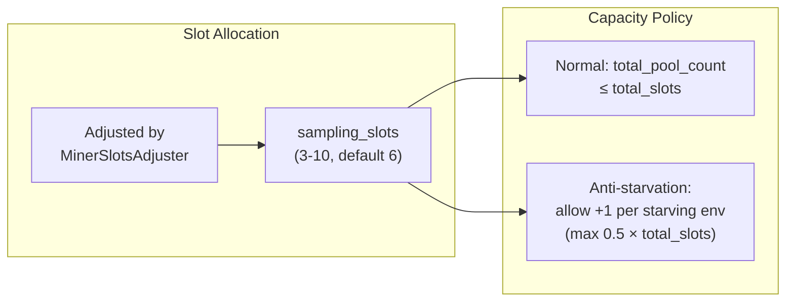

**Key Parameters:**

<Table>

| Parameter | Default | Range | Location |
|-----------|---------|-------|----------|
| `DEFAULT_SLOTS` | 6 | - | [affine/src/scheduler/sampling_scheduler.py:37]() |
| `MIN_SLOTS` | 3 | - | [affine/src/scheduler/sampling_scheduler.py:38]() |
| `MAX_SLOTS` | 10 | - | [affine/src/scheduler/sampling_scheduler.py:39]() |
| `scheduling_interval` | 10s | - | [affine/src/scheduler/sampling_scheduler.py:51]() |

</Table>


**Sources:** [affine/src/scheduler/sampling_scheduler.py:37-76](), [affine/src/scheduler/sampling_scheduler.py:190-206](), [affine/src/scheduler/sampling_scheduler.py:355-469]()

---

## Weighted Task Allocation

Tasks are distributed across environments using a weighted allocation strategy with fairness guarantees. Each environment has a `scheduling_weight` parameter (default 1.0) that determines its relative priority.

### Allocation Algorithm

The `_select_tasks_to_create` method implements a three-stage allocation strategy:

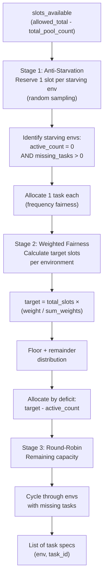

**Example:** With `total_slots=6`, weights: `game=2`, `lgc-v2=1`, `print=1` (sum=4):
- `game` target: 6 × 2/4 = **3 slots**
- `lgc-v2` target: 6 × 1/4 = 1.5 → **2 slots** (ceiling for fairness)
- `print` target: 6 × 1/4 = 1.5 → **1 slot** (floor to not exceed total)

If `game` has 1 active, `lgc-v2` has 0, `print` has 2, with `slots_available=5`:
- `game` deficit: 3-1 = 2 → **allocate 2**
- `lgc-v2` deficit: 2-0 = 2 → **allocate 2** (anti-starvation gets it prioritized)
- `print` deficit: 1-2 = 0 → **allocate 0**
- Total: 4 allocated, 1 remaining → round-robin

**Sources:** [affine/src/scheduler/sampling_scheduler.py:554-716](), [affine/src/scheduler/sampling_scheduler.py:208-224]()

### Configuration Parameters

Weights are configured in `system_config.json` under each environment's `sampling_config`:

```json
{
  "environments": {
    "game": {
      "enabled_for_sampling": true,
      "sampling_config": {
        "scheduling_weight": 2.0,
        "sampling_count": 500,
        "rotation_count": 50,
        "rotation_interval": 3600
      }
    }
  }
}
```

**Sources:** [affine/database/cli.py:106-276](), [affine/src/scheduler/sampling_scheduler.py:208-224]()

---

## Anti-Starvation Mechanisms

The scheduler implements multiple anti-starvation mechanisms to ensure all environments receive tasks even when capacity is constrained.

### Starvation Detection

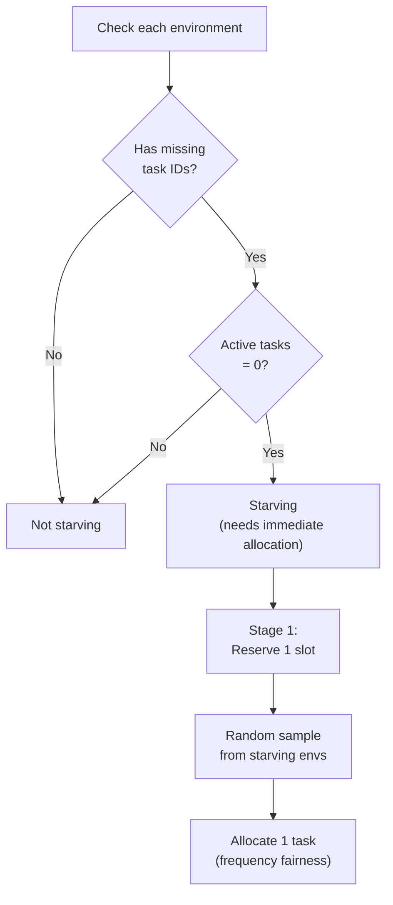

**Anti-Starvation Policies:**

<Table>

| Policy | Trigger | Action | Location |
|--------|---------|--------|----------|
| Stage 1 Reservation | `active_count = 0` AND `missing_tasks > 0` | Allocate 1 task via random sampling | [affine/src/scheduler/sampling_scheduler.py:616-631]() |
| Temporary Overflow | All starving envs AND `total_pool_count ≥ total_slots` | Allow overflow up to `ceil(0.5 × total_slots)` | [affine/src/scheduler/sampling_scheduler.py:426-451]() |
| Deficit Prioritization | `active_count &lt; target_slots` | Allocate by deficit magnitude first | [affine/src/scheduler/sampling_scheduler.py:665-687]() |

</Table>


**Sources:** [affine/src/scheduler/sampling_scheduler.py:426-451](), [affine/src/scheduler/sampling_scheduler.py:616-631]()

---

## Rate Limiting (Anti-Memorization)

To prevent miners from memorizing answers through repeated task allocation, the scheduler implements rate limiting based on the configured rotation rate.

### Rate Limiting Logic

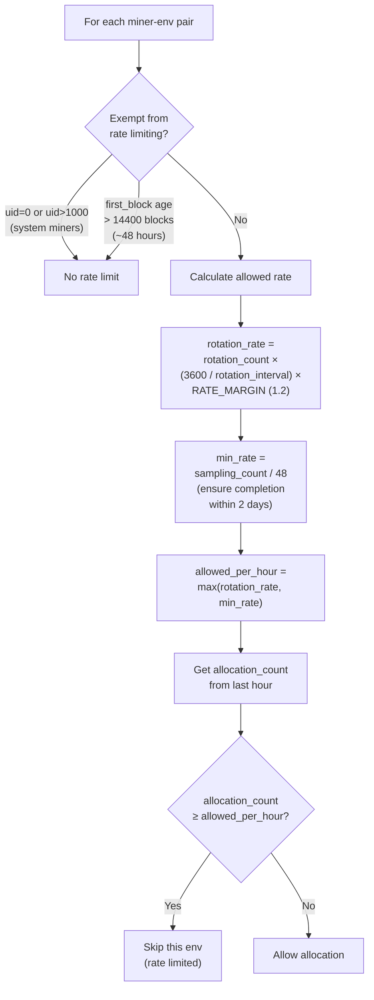

**Key Constants:**

<Table>

| Constant | Value | Purpose | Location |
|----------|-------|---------|----------|
| `RATE_MARGIN` | 1.2 | Allow actual rate to exceed rotation rate by 20% | [affine/src/scheduler/sampling_scheduler.py:42]() |
| Minimum rate | `sampling_count / 48` | Guarantee completion within 48 hours | [affine/src/scheduler/sampling_scheduler.py:333]() |
| Exemption threshold | 14400 blocks (~48h) | Exempt miners after initial sampling period | [affine/src/scheduler/sampling_scheduler.py:316-319]() |

</Table>


**Internal Tracking:**

The scheduler maintains an in-memory sliding window of allocation timestamps per miner-environment pair in `_allocation_timestamps`:

- **Key format:** `"{hotkey}#{revision}#{env}"`
- **Value:** List of Unix timestamps
- **Cleanup:** Expired timestamps removed on each check
- **Recording:** Timestamps added after task creation

**Sources:** [affine/src/scheduler/sampling_scheduler.py:42-43](), [affine/src/scheduler/sampling_scheduler.py:286-354](), [affine/src/scheduler/sampling_scheduler.py:226-284]()

---

## Sampling List Management

The `SamplingScheduler` handles rotation and size adjustment of sampling lists. It runs independently every 5 minutes.

### Rotation Process

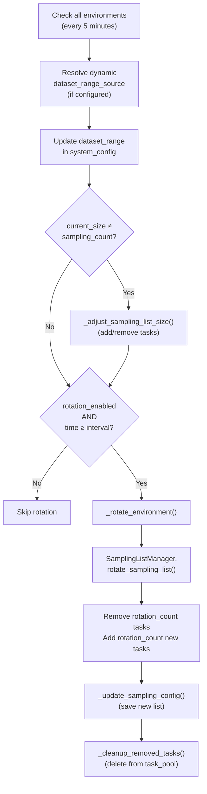

**Rotation Parameters:**

<Table>

| Parameter | Location | Description |
|-----------|----------|-------------|
| `rotation_enabled` | `sampling_config` | Enable/disable automatic rotation |
| `rotation_count` | `sampling_config` | Number of tasks to rotate per cycle |
| `rotation_interval` | `sampling_config` | Seconds between rotations (default 3600) |
| `last_rotation_at` | `sampling_config` | Unix timestamp of last rotation |
| `prioritize_new` | computed | If `dataset_range_source` exists, prioritize unsampled tasks |

</Table>


**Sources:** [affine/src/scheduler/sampling_scheduler.py:987-1067](), [affine/src/scheduler/sampling_scheduler.py:1069-1095](), [affine/src/scheduler/sampling_scheduler.py:1117-1147]()

### Dynamic Dataset Range Resolution

For environments with `dataset_range_source`, the scheduler periodically resolves the range from a remote source (e.g., GitHub API for SWE-Bench dataset sizes):

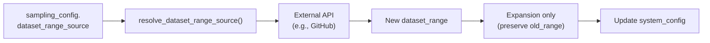

**Sources:** [affine/src/scheduler/sampling_scheduler.py:1000-1033](), [affine/database/cli.py:168-186]()

---

## Dynamic Slot Adjustment

The `MinerSlotsAdjuster` automatically adjusts each miner's `sampling_slots` (3-10) based on their recent success rate across all environments.

### Adjustment Strategy

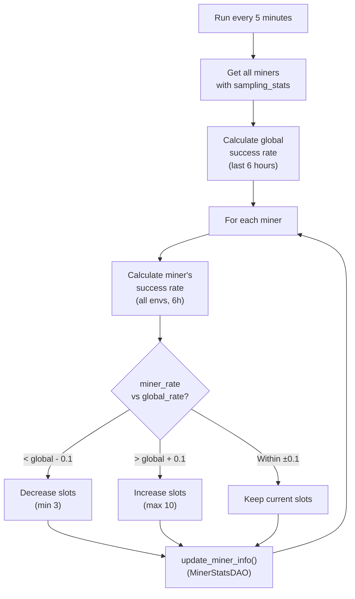

**Adjustment Logic:**

```python
# Slot adjustment thresholds
if miner_success_rate < global_success_rate - 0.1:
    new_slots = max(current_slots - 1, MIN_SLOTS)  # Decrease
elif miner_success_rate > global_success_rate + 0.1:
    new_slots = min(current_slots + 1, MAX_SLOTS)  # Increase
else:
    new_slots = current_slots  # Keep unchanged
```

**Success Rate Calculation:**

- **Window:** Last 6 hours of sampling statistics
- **Metrics:** `success / (success + rate_limit_errors + timeout_errors + other_errors)`
- **Source:** `env_stats` in `miner_stats` table
- **Aggregation:** Sum across all enabled environments

**Sources:** [affine/src/scheduler/slots_adjuster.py]() (referenced but not provided in full)

---

## Task Priority and Selection

When selecting which tasks to allocate, the scheduler prioritizes tasks from the **tail** of the sampling list to minimize rotation risk.

### Priority Ordering

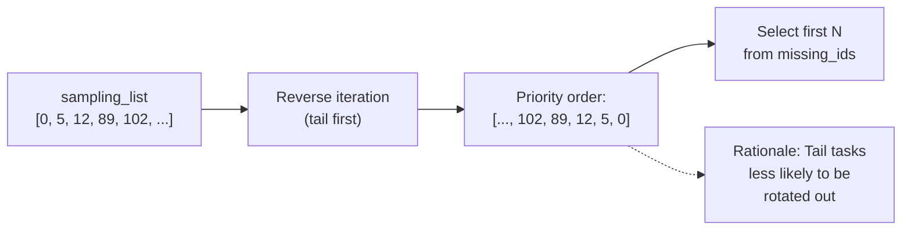

**Implementation:**

```python
# Prioritize tasks from tail (reverse order)
priority_order = []
for task_id in reversed(sampling_list):
    if task_id in missing_ids:
        priority_order.append(task_id)
```

**Sources:** [affine/src/scheduler/sampling_scheduler.py:521-527]()

---

## Cleanup Mechanisms

The scheduler performs multiple cleanup operations to maintain task pool consistency.

### Cleanup Operations

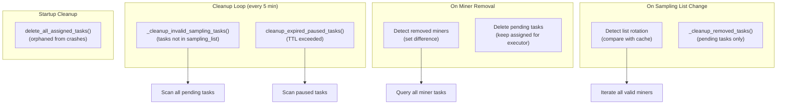

**Cleanup Types:**

<Table>

| Type | Trigger | Target | Location |
|------|---------|--------|----------|
| Invalid sampling tasks | Every 5 min | Tasks where env disabled OR task_id not in sampling_list | [affine/src/scheduler/sampling_scheduler.py:833-948]() |
| Expired paused tasks | Every 5 min | Paused tasks with `paused_until &lt; current_time` | [affine/src/scheduler/sampling_scheduler.py:823]() |
| Removed miner tasks | On miner removal detection | Pending tasks only (keep assigned) | [affine/src/scheduler/sampling_scheduler.py:744-805]() |
| Rotated task IDs | After rotation | Pending tasks for removed task_ids | [affine/src/scheduler/sampling_scheduler.py:1149-1179]() |
| Orphaned assigned tasks | Service startup | All assigned tasks (likely from crashes) | [affine/src/scheduler/main.py:32-38]() |

</Table>


**Sources:** [affine/src/scheduler/sampling_scheduler.py:807-948](), [affine/src/scheduler/main.py:32-38]()

---

## Configuration Reference

### System Config Structure

The scheduler reads configuration from the `system_config` table's `environments` parameter:

```json
{
  "environments": {
    "game": {
      "enabled_for_sampling": true,
      "enabled_for_scoring": true,
      "sampling_config": {
        "dataset_range": [[0, 500]],
        "dataset_range_source": null,
        "sampling_count": 500,
        "sampling_list": [12, 45, 89, ...],
        "last_rotation_at": 1704067200,
        "rotation_enabled": true,
        "rotation_count": 50,
        "rotation_interval": 3600,
        "scheduling_weight": 2.0
      },
      "scoring_config": {
        "weights": {...}
      }
    }
  }
}
```

**Key Parameters:**

<Table>

| Parameter | Type | Description | Used By |
|-----------|------|-------------|---------|
| `enabled_for_sampling` | boolean | Include in task generation | PerMinerSamplingScheduler |
| `sampling_count` | integer | Target size of sampling_list | SamplingScheduler |
| `sampling_list` | integer[] | Active task IDs to distribute | PerMinerSamplingScheduler |
| `scheduling_weight` | float | Relative priority (default 1.0) | PerMinerSamplingScheduler |
| `rotation_enabled` | boolean | Enable automatic rotation | SamplingScheduler |
| `rotation_count` | integer | Tasks to rotate per cycle | SamplingScheduler |
| `rotation_interval` | integer | Seconds between rotations | SamplingScheduler |
| `dataset_range` | integer[][] | Valid task ID ranges | SamplingListManager |
| `dataset_range_source` | string | Remote source URL (optional) | SamplingScheduler |

</Table>


**Sources:** [affine/database/cli.py:151-275](), [affine/src/scheduler/sampling_scheduler.py:163-171]()

### Environment Variables

<Table>

| Variable | Default | Description |
|----------|---------|-------------|
| `SCHEDULER_CLEANUP_INTERVAL` | 300 | Seconds between cleanup operations |

</Table>


**Sources:** [affine/src/scheduler/main.py:130]()

---

## Database Interactions

### Read Operations

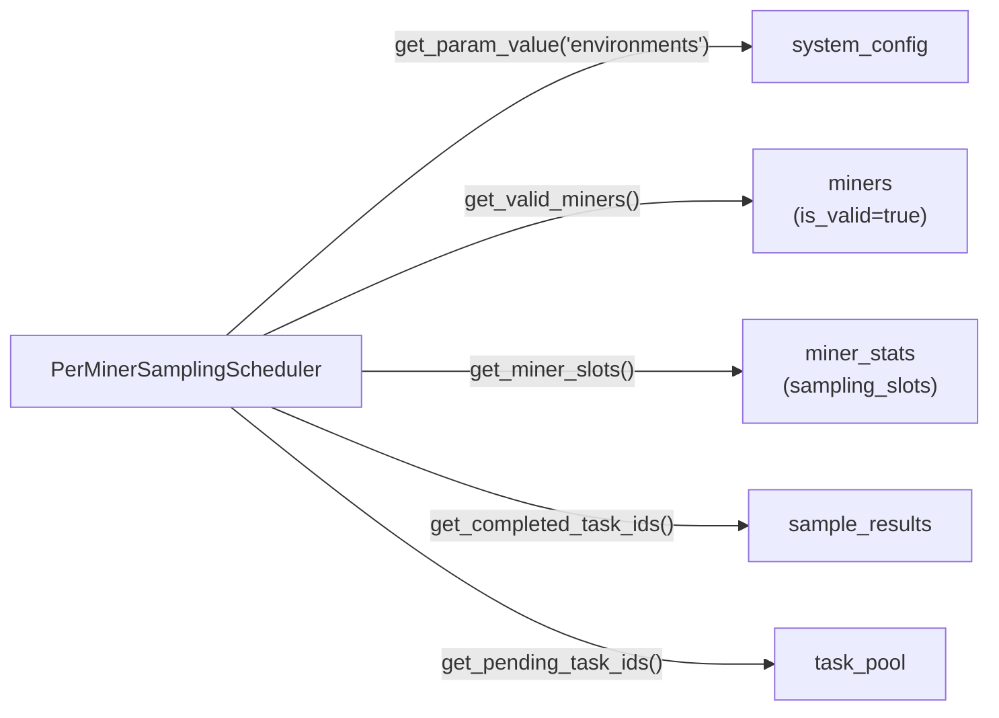

### Write Operations

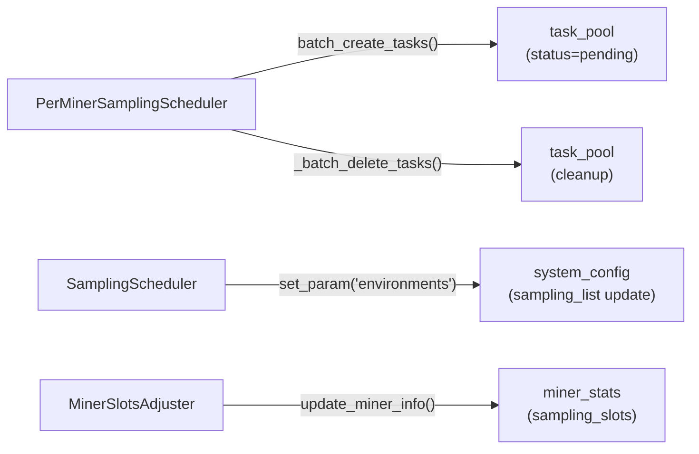

**Sources:** [affine/src/scheduler/sampling_scheduler.py:44-57](), [affine/src/scheduler/sampling_scheduler.py:718-741]()

---

## Service Startup and Lifecycle

### Initialization Sequence

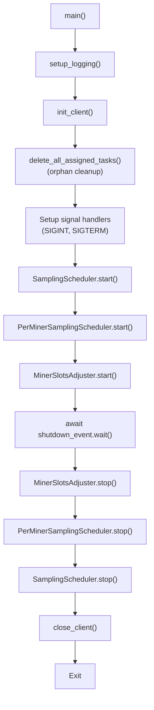

**Scheduler Tasks:**

<Table>

| Scheduler | Loop Interval | Initial Delay | Shutdown Behavior |
|-----------|---------------|---------------|-------------------|
| `SamplingScheduler` | 300s (5 min) | 0s | Cancel task, await completion |
| `PerMinerSamplingScheduler` | 10s | 0s | Cancel both loops, await completion |
| `MinerSlotsAdjuster` | 300s (5 min) | 0s | Cancel task, await completion |

</Table>


**Cleanup Task in PerMinerSamplingScheduler:**

- **Loop interval:** 300s (5 min)
- **Initial delay:** 60s (stabilization)
- **Operations:** Invalid task cleanup + expired paused task cleanup

**Sources:** [affine/src/scheduler/main.py:19-109](), [affine/src/scheduler/sampling_scheduler.py:78-107](), [affine/src/scheduler/sampling_scheduler.py:807-831]()

---

## Error Handling and Resilience

The scheduler implements multiple resilience patterns to handle failures gracefully:

### Per-Miner Error Isolation

```python
# Error handling at miner level
for miner in miners:
    try:
        await self._schedule_miner(miner, sampling_envs, environments)
    except Exception as e:
        logger.error(
            f"Error scheduling miner {miner['hotkey'][:8]}...: {e}",
            exc_info=True
        )
        # Continue with next miner
```

### Loop-Level Recovery

```python
while self._running:
    try:
        await self._schedule_all_miners()
        await asyncio.sleep(self.scheduling_interval)
    except asyncio.CancelledError:
        logger.info("Scheduling loop cancelled")
        break
    except Exception as e:
        logger.error(f"Scheduling loop error: {e}", exc_info=True)
        await asyncio.sleep(10)  # Backoff on error
```

**Error Patterns:**

<Table>

| Error Type | Handling | Impact |
|------------|----------|--------|
| Single miner scheduling failure | Log and continue | Other miners unaffected |
| Database query failure | Log, sleep 10s, retry loop | Temporary pause |
| Config parsing error | Log and skip environment | Other envs continue |
| Task creation failure | Log and continue | Retry next cycle |
| Signal (SIGINT/SIGTERM) | Graceful shutdown all schedulers | Clean exit |

</Table>


**Sources:** [affine/src/scheduler/sampling_scheduler.py:125-189](), [affine/src/scheduler/sampling_scheduler.py:987-998]()
