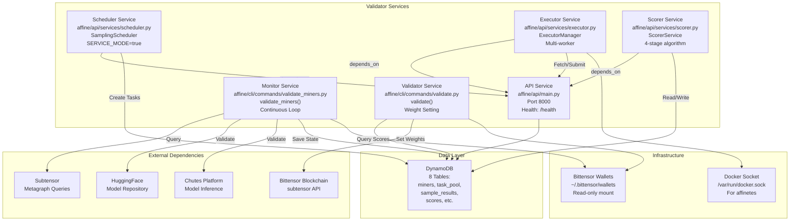
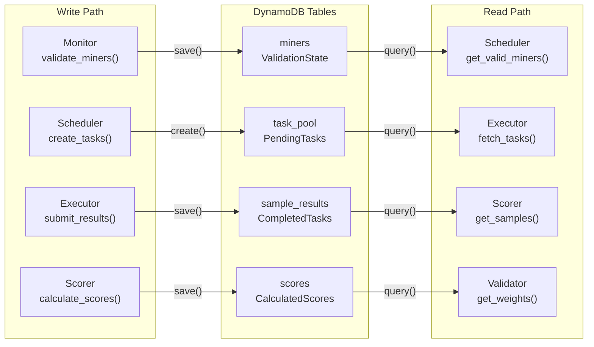
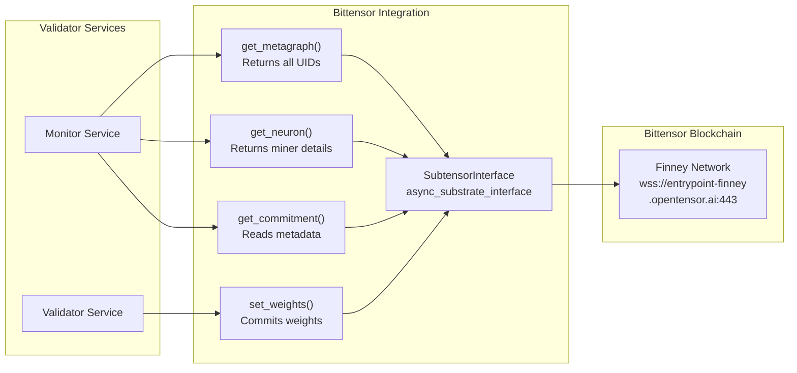

import CollapsibleAside from '../../../../components/CollapsibleAside.astro';
import SourceLink from '../../../../components/SourceLink.astro';
import Table from '../../../../components/Table.astro';

<CollapsibleAside title="Relevant Source Files">
  <SourceLink text="docker-compose.local.yml" href="https://github.com/AffineFoundation/affine-cortex/blob/main/docker-compose.local.yml" />
  <SourceLink text="docker-compose.yml" href="https://github.com/AffineFoundation/affine-cortex/blob/main/docker-compose.yml" />
  <SourceLink text="pyproject.toml" href="https://github.com/AffineFoundation/affine-cortex/blob/main/pyproject.toml" />
  <SourceLink text="uv.lock" href="https://github.com/AffineFoundation/affine-cortex/blob/main/uv.lock" />
</CollapsibleAside>

## Purpose and Scope

This page provides an overview of the validator role in the Affine Cortex system. Validators are network participants responsible for evaluating miner models, calculating performance scores, and setting weights on the Bittensor blockchain (Subnet 64). This page covers validator responsibilities, system architecture, deployment requirements, and integration points.

For step-by-step deployment instructions, see [Running a Validator](/subnets/for-validators/running-a-validator#5.2). For details on task scheduling mechanisms, see [Task Scheduling System](/subnets/for-validators/task-scheduling-system#5.3). For the scoring algorithm implementation, see [Weight Calculation System](/subnets/for-validators/weight-calculation-system#5.4).

---

## Validator Responsibilities

Validators perform five primary functions in the Affine Cortex network:

<Table>

| Responsibility | Service | Description |
|---------------|---------|-------------|
| **Miner Discovery & Validation** | Monitor | Continuously discovers miners via metagraph, validates model architecture (Qwen3-32B), checks Chutes deployment, audits chat templates for safety, and detects plagiarism via model hash comparison |
| **Task Generation** | Scheduler | Creates evaluation tasks with weighted allocation based on miner performance, implements anti-starvation mechanisms, and enforces rate limiting to prevent memorization |
| **Task Execution** | Executor | Fetches pending tasks, executes them in isolated Docker containers via `affinetes`, submits results with scores, latency, and conversation logs |
| **Score Calculation** | Scorer | Implements 4-stage algorithm: data collection, Pareto dominance filtering (anti-plagiarism), subset scoring with geometric means, and normalization with 1% minimum threshold |
| **Weight Setting** | Validator | Fetches latest scores from database, formats weights for Bittensor API, commits weights on-chain via `subtensor`, and distributes TAO rewards proportionally |

</Table>


Sources: <SourceLink text="Diagram 2: Miner Lifecycle and Workflows" href="https://github.com/AffineFoundation/affine-cortex/blob/main/Diagram" />, <SourceLink text="docker-compose.yml:4-17" href="https://github.com/AffineFoundation/affine-cortex/blob/main/docker-compose.yml#L4-L17" />

---

## System Architecture

### Backend Services

Validators operate as a microservices architecture with six independent services coordinated through a shared API gateway and DynamoDB database:



**Service Dependencies:**
- The `API` service must be healthy (responds to `/health` endpoint) before `Scheduler`, `Executor`, and `Scorer` start
- Services operate independently with no direct inter-service communication
- All coordination happens through DynamoDB and the API gateway
- Services restart independently on failure without cascading effects

Sources: <SourceLink text="docker-compose.yml:1-26" href="https://github.com/AffineFoundation/affine-cortex/blob/main/docker-compose.yml#L1-L26" />, <SourceLink text="Diagram 1: Complete System Topology" href="https://github.com/AffineFoundation/affine-cortex/blob/main/Diagram" />, <SourceLink text="Diagram 6: Service Orchestration and Deployment" href="https://github.com/AffineFoundation/affine-cortex/blob/main/Diagram" />

---

### Validator Execution Loop

The validator continuously cycles through validation activities with configurable intervals:

```mermaid
graph TB
    Start[Validator Start]
    
    Start --> Monitor
    
    subgraph "Monitor Cycle (Continuous)"
        Monitor["1. Monitor Service<br/>validate_miners()"]
        FetchMeta["Fetch Metagraph<br/>subtensor.get_metagraph()"]
        CheckValid["For each miner:<br/>- Validate architecture<br/>- Check Chutes status<br/>- Audit template<br/>- Compute model_hash"]
        SaveMiners["Update miners table<br/>is_valid, model_hash,<br/>template_check"]
        
        Monitor --> FetchMeta
        FetchMeta --> CheckValid
        CheckValid --> SaveMiners
        SaveMiners --> Monitor
    end
    
    subgraph "Scheduler Cycle (Continuous)"
        Scheduler["2. Scheduler Service<br/>SamplingScheduler.run()"]
        CalcSlots["Calculate sampling_slots<br/>based on performance"]
        AllocTasks["Weighted task allocation<br/>with anti-starvation"]
        CreateTasks["Create tasks in task_pool<br/>status=pending"]
        
        SaveMiners -.triggers.-> Scheduler
        Scheduler --> CalcSlots
        CalcSlots --> AllocTasks
        AllocTasks --> CreateTasks
        CreateTasks --> Scheduler
    end
    
    subgraph "Executor Cycle (Continuous)"
        Executor["3. Executor Service<br/>ExecutorManager.run()"]
        FetchTasks["Fetch batch from API<br/>/tasks/fetch"]
        ExecuteTasks["Execute in containers<br/>SDKEnvironment.evaluate()"]
        SubmitResults["Submit to API<br/>/tasks/submit"]
        
        CreateTasks -.triggers.-> Executor
        Executor --> FetchTasks
        FetchTasks --> ExecuteTasks
        ExecuteTasks --> SubmitResults
        SubmitResults --> Executor
    end
    
    subgraph "Scorer Cycle (Hourly)"
        Scorer["4. Scorer Service<br/>ScorerService.run()"]
        CollectData["Stage 1: Collect data<br/>from sample_results"]
        ParetoFilter["Stage 2: Pareto filter<br/>anti-plagiarism"]
        CalcScores["Stage 3: Subset scoring<br/>geometric means"]
        Normalize["Stage 4: Normalize<br/>min 1%, sum=1.0"]
        SaveScores["Save to scores +<br/>score_snapshots"]
        
        SubmitResults -.triggers.-> Scorer
        Scorer --> CollectData
        CollectData --> ParetoFilter
        ParetoFilter --> CalcScores
        CalcScores --> Normalize
        Normalize --> SaveScores
        SaveScores --> Scorer
    end
    
    subgraph "Validator Cycle (Periodic)"
        ValidatorSvc["5. Validator Service<br/>validate()"]
        FetchWeights["Fetch latest scores<br/>from score_snapshots"]
        SetWeights["Set weights on-chain<br/>subtensor.set_weights()"]
        
        SaveScores -.triggers.-> ValidatorSvc
        ValidatorSvc --> FetchWeights
        FetchWeights --> SetWeights
        SetWeights --> ValidatorSvc
    end





```



**Loop Characteristics:**
- **Monitor**: Runs continuously, validates all miners in metagraph every iteration
- **Scheduler**: Runs continuously, generates tasks based on `sampling_list` rotation and miner performance
- **Executor**: Runs continuously with configurable worker count, processes tasks in parallel
- **Scorer**: Runs at configurable intervals (default: 60 minutes via `SCORER_INTERVAL_MINUTES`)
- **Validator**: Runs at intervals determined by Bittensor tempo (approximately every 360 blocks)

Sources: <SourceLink text="affine/cli/commands/validate_miners.py" href="https://github.com/AffineFoundation/affine-cortex/blob/main/affine/cli/commands/validate_miners.py" />, <SourceLink text="affine/api/services/scheduler.py" href="https://github.com/AffineFoundation/affine-cortex/blob/main/affine/api/services/scheduler.py" />, <SourceLink text="affine/api/services/executor.py" href="https://github.com/AffineFoundation/affine-cortex/blob/main/affine/api/services/executor.py" />, <SourceLink text="affine/api/services/scorer.py" href="https://github.com/AffineFoundation/affine-cortex/blob/main/affine/api/services/scorer.py" />, <SourceLink text="affine/cli/commands/validate.py" href="https://github.com/AffineFoundation/affine-cortex/blob/main/affine/cli/commands/validate.py" />

---

## System Requirements

### Hardware Requirements

<Table>

| Resource | Minimum | Recommended | Purpose |
|----------|---------|-------------|---------|
| **RAM** | 6 GB | 8 GB | API service memory limit (see [docker-compose.yml:8-9]()) |
| **CPU** | 4 cores | 8+ cores | Executor parallel task execution |
| **Storage** | 50 GB | 100 GB | Docker images, environment containers, logs |
| **Network** | 10 Mbps | 100 Mbps | Model downloads, task execution, blockchain sync |

</Table>


### Required Credentials

Validators require the following credentials configured in `.env` file:

```
# Bittensor Configuration
BT_WALLET_COLD=<coldkey_name>
BT_WALLET_HOT=<hotkey_name>
BT_NETUID=64
SUBTENSOR_ENDPOINT=wss://entrypoint-finney.opentensor.ai:443

# External Platforms
CHUTES_API_KEY=<api_key>
HF_TOKEN=<huggingface_token>

# Database (if using custom endpoint)
DYNAMODB_ENDPOINT_URL=http://localhost:8000
DYNAMODB_REGION=us-east-1

# Service Configuration
SERVICE_MODE=true
API_URL=http://api:8000/api/v1
SCORER_INTERVAL_MINUTES=60
SCORER_SAVE_TO_DB=true
```

**Credential Purposes:**
- `BT_WALLET_COLD/HOT`: Validator identity and signature authority for weight setting
- `SUBTENSOR_ENDPOINT`: Bittensor blockchain connection for metagraph queries and weight commits
- `CHUTES_API_KEY`: Validates miner model deployments on Chutes platform (Subnet 64)
- `HF_TOKEN`: Accesses private/gated HuggingFace repositories during model validation
- `SERVICE_MODE=true`: Enables continuous loop operation for all services

Sources: <SourceLink text="docker-compose.yml:10-16" href="https://github.com/AffineFoundation/affine-cortex/blob/main/docker-compose.yml#L10-L16" />, <SourceLink text="pyproject.toml:1-53" href="https://github.com/AffineFoundation/affine-cortex/blob/main/pyproject.toml#L1-L53" />

### Software Dependencies

Validators depend on the following external systems:

<Table>

| Dependency | Version | Purpose |
|------------|---------|---------|
| **Docker** | 20.10+ | Container orchestration for service deployment and environment execution |
| **Docker Compose** | v3.8+ | Multi-service orchestration (see [docker-compose.yml:1]()) |
| **Python** | 3.11+ | Runtime for all services (see [pyproject.toml:39]()) |
| **DynamoDB** | N/A | Data persistence (AWS DynamoDB or local DynamoDB Docker) |
| **Bittensor** | Latest | Blockchain integration via `substrate-interface` (see <SourceLink text="pyproject.toml:7" href="https://github.com/AffineFoundation/affine-cortex/blob/main/pyproject.toml#L7" />) |
| **Affinetes** | Latest | Container orchestration library (see [pyproject.toml:30]()) |

</Table>


Sources: <SourceLink text="pyproject.toml:1-53" href="https://github.com/AffineFoundation/affine-cortex/blob/main/pyproject.toml#L1-L53" />, <SourceLink text="docker-compose.yml:1-26" href="https://github.com/AffineFoundation/affine-cortex/blob/main/docker-compose.yml#L1-L26" />

---

## Data Management

### Database Schema Overview

Validators interact with 8 DynamoDB tables to manage state:

<Table>

| Table | Purpose | Primary Key | TTL |
|-------|---------|-------------|-----|
| `miners` | Miner registration and validation state | `uid` (int) | None |
| `miner_stats` | Performance tracking, slot allocation | `uid` (int) | None |
| `task_pool` | Active task queue | `uid` (int), `task_key` (str) | Varies |
| `sample_results` | Completed task outcomes | `uid` (int), `sample_key` (str) | 30 days |
| `execution_logs` | Debug trail | `log_id` (str) | 7 days |
| `scores` | Detailed per-miner scores | `uid` (int) | None |
| `score_snapshots` | Block-level score metadata | `block` (int) | None |
| `system_config` | Environment configs, blacklist | `config_key` (str) | None |

</Table>


**Key Data Flows:**
1. **Monitor → miners**: Saves validation results (`is_valid`, `model_hash`, `template_check`)
2. **Scheduler → task_pool**: Creates pending tasks with environment and task parameters
3. **Executor → sample_results**: Saves completed task results with compressed conversation logs
4. **Scorer → scores/score_snapshots**: Saves calculated weights and metadata
5. **Validator → Bittensor**: Reads final weights from `score_snapshots` and commits on-chain

Sources: <SourceLink text="Diagram 3: Data Flow and Storage Architecture" href="https://github.com/AffineFoundation/affine-cortex/blob/main/Diagram" />, <SourceLink text="affine/api/daos/" href="https://github.com/AffineFoundation/affine-cortex/blob/main/affine/api/daos/" />

### State Synchronization

Services maintain eventual consistency through DynamoDB:



**Consistency Guarantees:**
- **Read-after-write**: Services may see stale data due to DynamoDB eventual consistency
- **Idempotency**: All write operations are idempotent via unique composite keys
- **TTL Cleanup**: Automatic deletion of expired tasks (varies), logs (7 days), results (30 days)

Sources: <SourceLink text="affine/api/daos/miners_dao.py" href="https://github.com/AffineFoundation/affine-cortex/blob/main/affine/api/daos/miners_dao.py" />, <SourceLink text="affine/api/daos/task_pool_dao.py" href="https://github.com/AffineFoundation/affine-cortex/blob/main/affine/api/daos/task_pool_dao.py" />, <SourceLink text="affine/api/daos/sample_results_dao.py" href="https://github.com/AffineFoundation/affine-cortex/blob/main/affine/api/daos/sample_results_dao.py" />, <SourceLink text="affine/api/daos/scores_dao.py" href="https://github.com/AffineFoundation/affine-cortex/blob/main/affine/api/daos/scores_dao.py" />

---

## Deployment Model

### Docker Compose Architecture

Validators deploy using Docker Compose with two primary configurations:

**Production Deployment** ([docker-compose.yml]()):
```yaml
services:
  validator:
    image: affinefoundation/affine:latest
    mem_reservation: "6g"
    mem_limit: "8g"
    volumes:
      - ~/.bittensor/wallets:/root/.bittensor/wallets:ro
      - /var/log/affine/validator:/var/log/affine/validator
    command: ["-v", "validate"]
  
  watchtower:
    image: nickfedor/watchtower
    command: --interval 30 affine-validator
```

**Development Deployment** ([docker-compose.local.yml]()):
```yaml
services:
  validator:
    image: affine:local
    build:
      context: .
      dockerfile: Dockerfile
```

**Key Features:**
- **Auto-updates**: Watchtower monitors Docker Hub every 30 seconds and pulls new `affinefoundation/affine:latest` images
- **Memory limits**: Hard limit at 8GB, soft reservation at 6GB to prevent OOM kills
- **Wallet isolation**: Bittensor wallets mounted read-only for security
- **Log persistence**: Validator logs persisted to `/var/log/affine/validator` on host
- **Service mode**: `SERVICE_MODE=true` enables continuous operation

Sources: <SourceLink text="docker-compose.yml:1-26" href="https://github.com/AffineFoundation/affine-cortex/blob/main/docker-compose.yml#L1-L26" />, <SourceLink text="docker-compose.local.yml:1-15" href="https://github.com/AffineFoundation/affine-cortex/blob/main/docker-compose.local.yml#L1-L15" />

### Service Entry Points

All validator services are invoked via the `af` CLI command:

<Table>

| Command | Service | Implementation | Description |
|---------|---------|----------------|-------------|
| `af servers api` | API | [affine/cli/commands/api.py:api()]() | Starts FastAPI server on port 8000 |
| `af servers monitor` | Monitor | [affine/cli/commands/validate_miners.py:validate_miners()]() | Continuous miner validation loop |
| `af servers scheduler` | Scheduler | [affine/cli/commands/scheduler.py:scheduler()]() | Wraps `SamplingScheduler.run()` |
| `af servers executor` | Executor | [affine/cli/commands/executor.py:executor()]() | Wraps `ExecutorManager.run()` |
| `af servers scorer` | Scorer | [affine/cli/commands/scorer.py:scorer()]() | Wraps `ScorerService.run()` |
| `af validate` | Validator | [affine/cli/commands/validate.py:validate()]() | Weight-setting loop |

</Table>


**CLI Configuration:**
- Entry point: <SourceLink text="pyproject.toml:41-42" href="https://github.com/AffineFoundation/affine-cortex/blob/main/pyproject.toml#L41-L42" /> defines `af = "affine.cli.main:main"`
- Service mode detection: Checks `SERVICE_MODE` environment variable
- Continuous operation: Services run in infinite loops when `SERVICE_MODE=true`

Sources: <SourceLink text="affine/cli/main.py" href="https://github.com/AffineFoundation/affine-cortex/blob/main/affine/cli/main.py" />, <SourceLink text="affine/cli/commands/" href="https://github.com/AffineFoundation/affine-cortex/blob/main/affine/cli/commands/" />, [pyproject.toml:41-42]()

---

## Key Integrations

### Bittensor Blockchain Integration

Validators interact with Bittensor via `substrate-interface` and `async-substrate-interface`:



**Integration Points:**
- **Metagraph Queries**: Monitor fetches all registered miners (`get_metagraph()`)
- **Neuron Details**: Monitor reads individual miner metadata (hotkey, coldkey, IP, port)
- **Commitment Reads**: Monitor validates miner model commitments (`chute_id`, `model_hash`)
- **Weight Setting**: Validator commits calculated weights to blockchain every tempo

Sources: <SourceLink text="affine/cli/commands/validate_miners.py" href="https://github.com/AffineFoundation/affine-cortex/blob/main/affine/cli/commands/validate_miners.py" />, <SourceLink text="affine/cli/commands/validate.py" href="https://github.com/AffineFoundation/affine-cortex/blob/main/affine/cli/commands/validate.py" />, [pyproject.toml:7]()

### External Platform Validation

Validators verify miner models on two external platforms:

**HuggingFace Repository Validation:**
- Fetch model architecture via HuggingFace Hub API
- Download `config.json` to verify Qwen3-32B parameters
- Download `tokenizer_config.json` to extract chat template
- Compute `model_hash` from `.safetensors` LFS SHA256 hashes
- Requires `HF_TOKEN` for private repositories

**Chutes Platform Validation:**
- Query Chutes API to verify model deployment status
- Check slug format: `{coldkey[:8]}/{hotkey[:8]}/{chute_id}`
- Verify "hot" status (model actively serving inference)
- Validate deployment matches on-chain commitment

Sources: <SourceLink text="affine/cli/commands/validate_miners.py" href="https://github.com/AffineFoundation/affine-cortex/blob/main/affine/cli/commands/validate_miners.py" />, <SourceLink text="Diagram 2: Miner Lifecycle and Workflows" href="https://github.com/AffineFoundation/affine-cortex/blob/main/Diagram" />

---

## Security Considerations

### Wallet Protection

Validators must protect Bittensor wallets containing TAO tokens:

**Best Practices:**
- Mount wallets **read-only** in Docker containers ([docker-compose.yml:15]())
- Never expose wallet passwords in environment variables
- Use separate coldkey and hotkey (coldkey offline, hotkey for signing)
- Regularly rotate hotkeys and update metagraph registration

### API Authentication

The API service implements signature-based authentication for internal services:

```
X-Hotkey: <validator_hotkey>
X-Signature: <timestamp_signed_by_hotkey>
X-Timestamp: <unix_timestamp>
```

**Security Features:**
- 60-second timestamp window prevents replay attacks
- Signature verification uses `sr25519` cryptography
- Rate limiting: 1 request/minute for `/scoring`, higher for read/write
- Prevents unauthorized task submission or score manipulation

Sources: <SourceLink text="affine/api/middlewares/auth.py" href="https://github.com/AffineFoundation/affine-cortex/blob/main/affine/api/middlewares/auth.py" />, <SourceLink text="Diagram 4: SDK and API Integration Architecture" href="https://github.com/AffineFoundation/affine-cortex/blob/main/Diagram" />

### Network Security

Validators expose minimal attack surface:

- **Single public port**: Only API service exposes port 8000
- **Container isolation**: Services run in separate Docker containers
- **No direct DB access**: All database operations through DAOs with parameterized queries
- **No credential logging**: Sensitive values never written to logs

Sources: <SourceLink text="docker-compose.yml:1-26" href="https://github.com/AffineFoundation/affine-cortex/blob/main/docker-compose.yml#L1-L26" />, <SourceLink text="affine/api/" href="https://github.com/AffineFoundation/affine-cortex/blob/main/affine/api/" />

---

## Monitoring and Observability

### Health Checks

The API service exposes a health endpoint for service orchestration:

```
GET /health
Response: {"status": "healthy", "timestamp": 1234567890}
```

**Service Dependencies:**
- Scheduler, Executor, and Scorer declare `depends_on: api: condition: service_healthy`
- Health check runs every 60 seconds with 180-second startup grace period
- Failed health checks trigger container restart

Sources: <SourceLink text="docker-compose.yml:1-26" href="https://github.com/AffineFoundation/affine-cortex/blob/main/docker-compose.yml#L1-L26" />, <SourceLink text="affine/api/main.py" href="https://github.com/AffineFoundation/affine-cortex/blob/main/affine/api/main.py" />

### Logging

Each service logs to separate files:

```
/var/log/affine/validator/validator.log
/var/log/affine/api/api.log
/var/log/affine/monitor/monitor.log
/var/log/affine/scheduler/scheduler.log
/var/log/affine/executor/executor.log
/var/log/affine/scorer/scorer.log
```

**Log Levels:**
- `-v` flag increases verbosity (DEBUG level)
- Default: INFO level
- Structured logging with timestamps and service identifiers

Sources: <SourceLink text="docker-compose.yml:16" href="https://github.com/AffineFoundation/affine-cortex/blob/main/docker-compose.yml#L16" />, <SourceLink text="affine/cli/commands/" href="https://github.com/AffineFoundation/affine-cortex/blob/main/affine/cli/commands/" />

### Metrics

Validators can optionally export Prometheus metrics:

- `prometheus-client>=0.21.0` dependency (<SourceLink text="pyproject.toml:28" href="https://github.com/AffineFoundation/affine-cortex/blob/main/pyproject.toml#L28" />)
- Metrics exposed on `/metrics` endpoint (if enabled)
- Track: task throughput, execution latency, scoring duration, weight-setting success

Sources: [pyproject.toml:28]()

---

## Next Steps

After understanding the validator overview:

1. **Deploy a validator**: Follow step-by-step instructions in [Running a Validator](/subnets/for-validators/running-a-validator#5.2)
2. **Understand task scheduling**: Learn weighted allocation and fairness mechanisms in [Task Scheduling System](/subnets/for-validators/task-scheduling-system#5.3)
3. **Review scoring algorithm**: Study the 4-stage calculation in [Weight Calculation System](/subnets/for-validators/weight-calculation-system#5.4)
4. **Monitor operations**: Set up observability tools in [Monitoring & Observability](/subnets/for-validators/monitoring-observability#5.5)

Sources: Table of Contents structure
