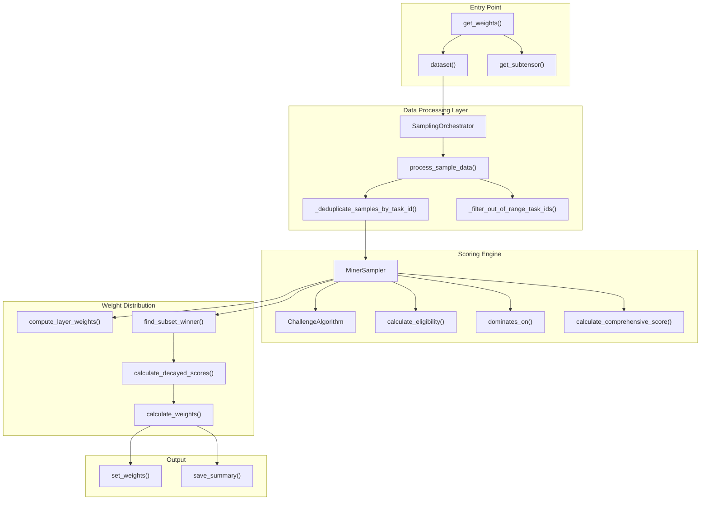
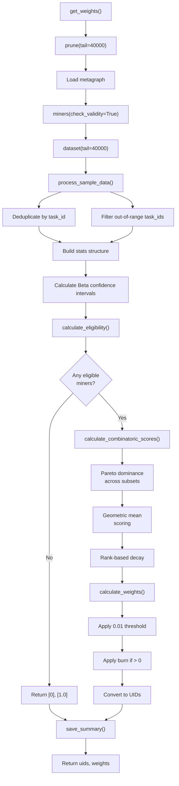
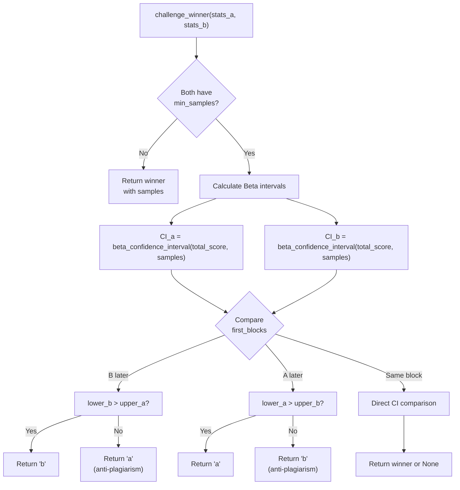
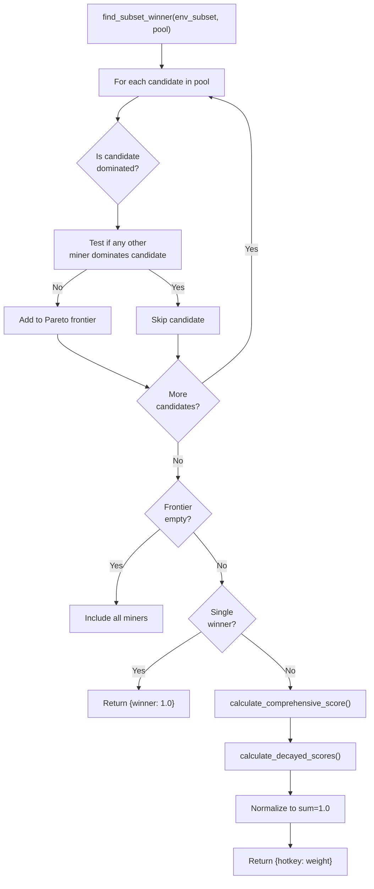
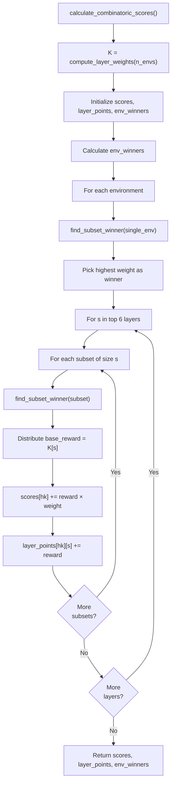

import CollapsibleAside from '../../../../components/CollapsibleAside.astro';
import SourceLink from '../../../../components/SourceLink.astro';
import Table from '../../../../components/Table.astro';

<CollapsibleAside title="Relevant Source Files">
  <SourceLink text="affine/api/config.py" href="https://github.com/AffineFoundation/affine-cortex/blob/main/affine/api/config.py" />
  <SourceLink text="affine/api/models.py" href="https://github.com/AffineFoundation/affine-cortex/blob/main/affine/api/models.py" />
  <SourceLink text="affine/api/routers/scores.py" href="https://github.com/AffineFoundation/affine-cortex/blob/main/affine/api/routers/scores.py" />
  <SourceLink text="affine/src/miner/rank.py" href="https://github.com/AffineFoundation/affine-cortex/blob/main/affine/src/miner/rank.py" />
  <SourceLink text="affine/src/scorer/config.py" href="https://github.com/AffineFoundation/affine-cortex/blob/main/affine/src/scorer/config.py" />
  <SourceLink text="affine/src/scorer/main.py" href="https://github.com/AffineFoundation/affine-cortex/blob/main/affine/src/scorer/main.py" />
  <SourceLink text="affine/src/scorer/models.py" href="https://github.com/AffineFoundation/affine-cortex/blob/main/affine/src/scorer/models.py" />
  <SourceLink text="affine/src/scorer/scorer.py" href="https://github.com/AffineFoundation/affine-cortex/blob/main/affine/src/scorer/scorer.py" />
  <SourceLink text="affine/src/scorer/stage1_collector.py" href="https://github.com/AffineFoundation/affine-cortex/blob/main/affine/src/scorer/stage1_collector.py" />
  <SourceLink text="affine/src/scorer/stage2_pareto.py" href="https://github.com/AffineFoundation/affine-cortex/blob/main/affine/src/scorer/stage2_pareto.py" />
  <SourceLink text="affine/src/scorer/stage4_weights.py" href="https://github.com/AffineFoundation/affine-cortex/blob/main/affine/src/scorer/stage4_weights.py" />
  <SourceLink text="affine/src/scorer/utils.py" href="https://github.com/AffineFoundation/affine-cortex/blob/main/affine/src/scorer/utils.py" />
</CollapsibleAside>

## Purpose and Scope

This document describes the weight calculation system used by validators to score miners and set blockchain weights. The system implements a challenge-based Pareto dominance algorithm that evaluates miner performance across multiple environments using Bayesian confidence intervals, geometric mean scoring, and exponential layer weighting.

For information about running the validator node that triggers these calculations, see [Running a Validator](/subnets/for-validators/running-a-validator#5.2). For details on the sampling scheduler that generates evaluation data, see [Sampling Scheduler](#5.3). For blockchain weight setting, see [Signer Service](#5.6).

---

## System Architecture

The weight calculation system consists of three main components that process evaluation results into normalized blockchain weights:



**Sources:** [affine/sampling.py:1-937](), [affine/cal_weights.py:1-435]()

---

## Configuration Parameters

The `SamplingConfig` class defines all tunable parameters for the weight calculation system:

<Table>

| Parameter | Default Value | Purpose |
|-----------|--------------|---------|
| `TAIL` | 40,000 | Number of historical blocks to include in calculations |
| `SCALE` | 1.0 | Base scaling factor for layer weights |
| `SMALL_DATASET_THRESHOLD` | 400 | Dataset size threshold for deduplication rules |
| `CONFIDENCE_LEVEL` | 0.8 | Confidence level for Beta distribution intervals |
| `BETA_PRIOR_ALPHA` | 0.5 | Jeffrey's prior alpha parameter |
| `BETA_PRIOR_BETA` | 0.5 | Jeffrey's prior beta parameter |
| `SCORE_POWER` | 2.0 | Exponent applied to comprehensive scores |
| `RANK_DECAY_RATE` | 0.5 | Exponential decay factor for subsequent ranks |

</Table>


**Sources:** [affine/sampling.py:12-57]()

### Environment Score Normalization

Different environments use different score ranges. The system normalizes all scores to [0, 1]:

<Table>

| Environment | Raw Score Range | Normalized Range |
|-------------|----------------|------------------|
| `agentgym:sciworld` | [-100, 100] | [0, 1] |
| All others | [0, 1] | [0, 1] |

</Table>


The `normalize_score()` method handles this conversion:

```
normalized = (score - min_score) / (max_score - min_score)
```

**Sources:** [affine/sampling.py:38-56]()

---

## Weight Calculation Pipeline

The `get_weights()` function orchestrates the entire weight calculation process:



**Sources:** [affine/cal_weights.py:226-434]()

---

## Data Processing

### Task ID Deduplication

The `_deduplicate_samples_by_task_id()` method ensures each miner is evaluated fairly by removing duplicate evaluations:

**Algorithm:**
1. Group samples by `(hotkey, env, task_id)`
2. For duplicate task_ids, keep only the sample with the latest timestamp
3. For small datasets (&lt; 400 tasks): duplicate each unique sample 2x
4. For large datasets (≥ 400 tasks): keep 1 sample per task_id

**Rationale:** Small datasets allow more sampling attempts per task to build statistical confidence, while large datasets enforce strict uniqueness to prevent overfitting.

**Sources:** [affine/sampling.py:683-737]()

### Sample Statistics Structure

The `process_sample_data()` method builds the core statistics structure used throughout the system:

```python
stats = {
    hotkey: {
        env: {
            'samples': int,          # Number of deduplicated samples
            'total_score': float,    # Sum of normalized scores
            'first_block': int       # First block where model appeared
        }
    }
}
```

This structure is passed to all subsequent scoring functions for consistency.

**Sources:** [affine/sampling.py:739-868]()

---

## Challenge Algorithm: Bayesian Comparison

The `ChallengeAlgorithm` class implements single-environment miner comparison using Bayesian statistics:



### Beta Confidence Interval Calculation

The `beta_confidence_interval()` method uses Jeffrey's prior for robust small-sample estimation:

**Formula:**
```
α_posterior = 0.5 + total_score
β_posterior = 0.5 + (samples - total_score)

lower = Beta_CDF^(-1)(0.1, α_posterior, β_posterior)
upper = Beta_CDF^(-1)(0.9, α_posterior, β_posterior)
```

**Key Properties:**
- Uses Jeffrey's prior `Beta(0.5, 0.5)` - uninformative and performs well for extreme proportions
- 80% confidence level (configurable via `CONFIDENCE_LEVEL`)
- Returns `(0.0, 0.0)` for miners with zero samples
- Clamps results to valid [0, 1] range

**Sources:** [affine/sampling.py:59-188]()

### Anti-Plagiarism Protection

The challenge algorithm includes anti-plagiarism logic based on `first_block` timestamps:

- **Later submitter must significantly outperform:** If miner B submits after miner A, B only wins if `lower_b > upper_a` (confidence intervals don't overlap)
- **Earlier submitter wins ties:** If confidence intervals overlap, the earlier submitter wins
- **Prevents copy-cats:** This mechanism discourages miners from copying existing models

**Sources:** [affine/sampling.py:164-187]()

---

## Pareto Dominance Scoring

### Dominance Definition

The `dominates_on()` method checks if miner A Pareto-dominates miner B on a given environment subset:

**Conditions for A to dominate B:**
1. **Non-decreasing:** A must be ≥ B on ALL environments (no environment where B wins)
2. **Strictly better:** A must be > B on AT LEAST ONE environment (at least one where A wins)

**Algorithm:**
```
for each environment in subset:
    winner = challenge_winner(stats_a, stats_b)
    if winner == 'b':
        return False  // B wins somewhere, A doesn't dominate
    elif winner == 'a':
        at_least_one_strict_win = True
return at_least_one_strict_win
```

**Sources:** [affine/sampling.py:251-308]()

### Pareto Frontier Calculation

The `find_subset_winner()` method identifies miners on the Pareto frontier:



**Sources:** [affine/sampling.py:404-476]()

---

## Comprehensive Ability Scoring

The `calculate_comprehensive_score()` method measures overall miner performance using geometric mean:

**Formula:**
```
scores = [normalized_score_env1, normalized_score_env2, ..., normalized_score_envN]
comprehensive_score = (score1 × score2 × ... × scoreN)^(1/N)
```

**Properties:**
- **Penalizes specialization:** A score of 0 in any environment results in 0 overall
- **Rewards balance:** Geometric mean naturally favors balanced performance
- **Normalized range:** Output is in [0, 1]

**Example:**
- Miner with [0.9, 0.9, 0.9] across 3 envs: `(0.9 × 0.9 × 0.9)^(1/3) = 0.900`
- Miner with [1.0, 1.0, 0.5] across 3 envs: `(1.0 × 1.0 × 0.5)^(1/3) = 0.794`
- Miner with [1.0, 1.0, 0.0] across 3 envs: `0.0` (penalized for failing one env)

**Sources:** [affine/sampling.py:310-354]()

---

## Score-Based Weighting with Rank Decay

The `calculate_decayed_scores()` method applies a winner-takes-more distribution while ensuring later ranks receive progressively less weight:

**Algorithm:**
1. **Rank by comprehensive score** (descending)
2. **Apply power function:** `powered_score = score^SCORE_POWER`
3. **Apply rank decay:** `rank_multiplier = RANK_DECAY_RATE^rank`
4. **Combine:** `decayed_score = powered_score × rank_multiplier`

**Configuration Impact:**

<Table>

| Parameter | Value | Effect |
|-----------|-------|--------|
| `SCORE_POWER = 2.0` | Higher values | Amplify differences between top performers |
| `RANK_DECAY_RATE = 0.5` | 0.0 | Winner takes all |
|  | 1.0 | No decay (proportional to scores) |
|  | 0.5 | Exponential decay (default) |

</Table>


**Example Distribution:**

```
Rank 0: score=0.9 → (0.9^2) × (0.5^0) = 0.81 × 1.0 = 0.810
Rank 1: score=0.8 → (0.8^2) × (0.5^1) = 0.64 × 0.5 = 0.320
Rank 2: score=0.7 → (0.7^2) × (0.5^2) = 0.49 × 0.25 = 0.123
```

**Sources:** [affine/sampling.py:356-402]()

---

## Layer Weight Distribution

The `compute_layer_weights()` method assigns weights to environment subset layers:

### Layer System

For a system with N environments, layers represent subsets of different sizes:
- **Layer 1:** Individual environments (e.g., SAT alone)
- **Layer 2:** Pairs of environments (e.g., SAT + ABD)
- **Layer N:** All N environments together

### Weight Formula

**Top 6 layers only:** To focus on comprehensive performance, only layers `max(1, N-5)` to `N` are evaluated.

**For layer s with C(N, s) subsets:**
```
layer_total_weight = SCALE × 2^s
K_s = layer_total_weight / C(N, s)
```

**Example for N=8 environments:**

<Table>

| Layer | Subsets | Total Weight | Per-Subset Weight |
|-------|---------|--------------|-------------------|
| L3 | C(8,3)=56 | 1.0 × 2³ = 8 | 8/56 = 0.143 |
| L4 | C(8,4)=70 | 1.0 × 2⁴ = 16 | 16/70 = 0.229 |
| L5 | C(8,5)=56 | 1.0 × 2⁵ = 32 | 32/56 = 0.571 |
| L6 | C(8,6)=28 | 1.0 × 2⁶ = 64 | 64/28 = 2.286 |
| L7 | C(8,7)=8 | 1.0 × 2⁷ = 128 | 128/8 = 16.0 |
| L8 | C(8,8)=1 | 1.0 × 2⁸ = 256 | 256/1 = 256.0 |

</Table>


**Rationale:**
- **Exponential growth:** Higher layers receive exponentially more weight, strongly incentivizing multi-environment performance
- **Fair distribution:** Weight is evenly distributed among all subsets within each layer
- **Focus on comprehensiveness:** Low layers (L1, L2) contribute negligibly under exponential growth

**Sources:** [affine/sampling.py:478-509]()

---

## Combinatoric Scoring

The `calculate_combinatoric_scores()` method aggregates scores across all environment subsets:



**Reward Distribution:**
1. For each environment subset of size s
2. Calculate base reward: `K[s]` (from layer weights)
3. Find Pareto frontier winners on that subset
4. Distribute reward proportionally based on comprehensive ability
5. Track per-layer points for transparency

**Sources:** [affine/sampling.py:511-567]()

---

## Weight Normalization and Finalization

### Eligibility Requirements

The `calculate_eligibility()` method determines which miners can receive weights:

**Requirement:** Each environment requires `samples >= SMALL_DATASET_THRESHOLD` (400) to be eligible.

**Logic:**
```python
eligible = {
    hk for hk in active_hks
    if hk in queryable_hks and all(cnt[hk][e] >= 400 for e in envs)
}
```

**Sources:** [affine/sampling.py:223-249]()

### Weight Calculation

The `calculate_weights()` method normalizes scores into final weights:

**Algorithm:**
1. **Sum total points:** `total = sum(scores[hk] for hk in eligible)`
2. **Normalize:** `weight[hk] = scores[hk] / total`
3. **Apply threshold:** Reassign weights &lt; 0.01 to `base_hotkey` (UID 0)
4. **Apply burn:** If `burn > 0`, scale eligible weights by `(1 - burn)` and assign burn amount to `base_hotkey`

**Fallback:** If no eligible miners or total_points ≤ 0, assign weight 1.0 to UID 0.

**Sources:** [affine/sampling.py:890-936](), [affine/cal_weights.py:363-434]()

### Burn Mechanism

The `apply_burn()` method implements a burn allocation:

**Purpose:** Allows validators to burn a percentage of rewards to a base address (UID 0).

**Formula:**
```
For each eligible miner:
    weight_new = weight_old × (1 - burn)
base_hotkey weight += burn
```

**Sources:** [affine/sampling.py:569-597]()

---

## Summary Generation

The weight calculation process generates a comprehensive summary structure saved to R2 storage:

### Summary Structure

```python
{
    "header": ["UID", "Hotkey", "Model", "Rev", ...envs..., ...layers..., "Pts", "Elig", "FirstBlk", "Wgt"],
    "rows": [...],  # Legacy format for table display
    "miners": {
        hotkey: {
            "uid": int,
            "hotkey": str,
            "model": str,
            "revision": str,
            "environments": {
                env: {
                    "accuracy": float,
                    "count": int,
                    "confidence_interval": {"lower": float, "upper": float},
                    "is_winner": bool
                }
            },
            "layer_points": {"L3": float, "L4": float, ...},
            "total_score": float,
            "eligible": bool,
            "first_block": int,
            "weight": float
        }
    },
    "stats": {
        "eligible_count": int,
        "active_count": int,
        "queryable_count": int,
        "total_miners": int
    },
    "env_winners": {env: hotkey},
    "environments": [env_names]
}
```

**Sources:** [affine/cal_weights.py:152-224]()

---

## Usage Example

### Validator Weight Setting

The `validate` command calls `get_weights()` every 180 blocks (tempo):

```python
# In validator loop
uids, weights = await get_weights(burn=0.0)
await retry_set_weights(wallet, uids=uids, weights=weights)
```

**Sources:** [affine/cli.py:236-296]()

### Manual Weight Computation

The `weights` CLI command allows manual weight calculation:

```bash
# Display latest weights from R2
af weights

# Recompute weights from scratch (without saving to R2)
af weights -r

# Load summary from specific block
af weights -b 4000000
```

**Sources:** [affine/weights.py:85-117]()

---

## Key Design Decisions

### Why Geometric Mean for Comprehensive Scoring?

**Problem:** How to combine performance across multiple environments into a single score?

**Solution:** Geometric mean naturally penalizes specialization while rewarding balanced performance.

**Alternatives Considered:**
- **Arithmetic mean:** Allows perfect performance in one env to compensate for failure in others
- **Minimum:** Too harsh, a single failure eliminates a miner entirely
- **Geometric mean:** Requires non-zero performance in all environments, naturally discourages specialization

**Sources:** [affine/sampling.py:310-354]()

### Why Beta Distribution Confidence Intervals?

**Problem:** How to compare miners with different sample counts reliably?

**Solution:** Bayesian Beta distribution with Jeffrey's prior provides robust confidence intervals even for small samples.

**Properties:**
- Works well with small sample sizes (&lt; 10 samples)
- Handles extreme proportions (0% or 100% success) gracefully
- Jeffrey's prior `Beta(0.5, 0.5)` is uninformative and mathematically elegant

**Sources:** [affine/sampling.py:68-103]()

### Why Exponential Layer Weighting?

**Problem:** How to incentivize comprehensive multi-environment performance?

**Solution:** Exponential growth (`2^s`) makes higher layers dramatically more valuable.

**Impact:** For 8 environments:
- Layer 8 (all environments): 256x more valuable than Layer 1
- Layer 7 (7 environments): 128x more valuable than Layer 1
- Strongly incentivizes models that work across all environments

**Sources:** [affine/sampling.py:478-509]()

---

## Related Systems

- **Data Collection:** See [Sampling Scheduler](#5.3) for how evaluation results are generated
- **Blockchain Integration:** See [Signer Service](#5.6) for how weights are set on-chain
- **Storage:** See [Storage & Data Management](#8) for how results and summaries are persisted
- **Environments:** See [Evaluation Environments](/subnets/evaluation-environments#7) for details on the 8 evaluation tasks
