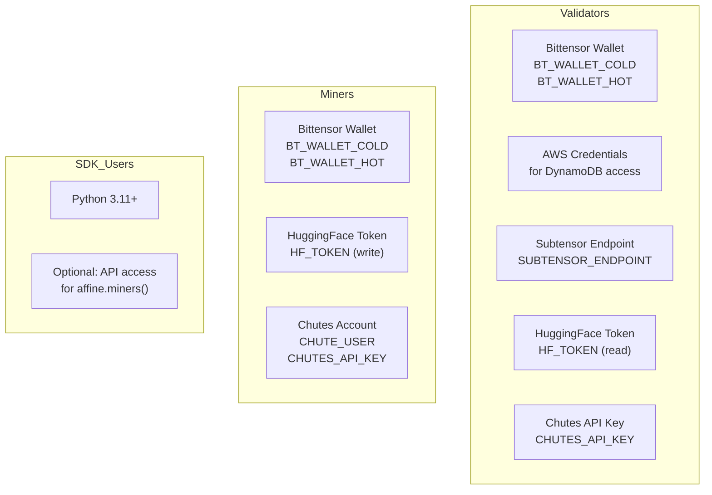
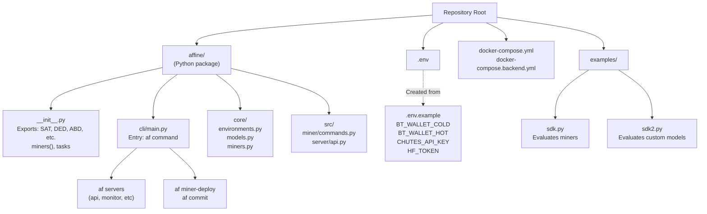
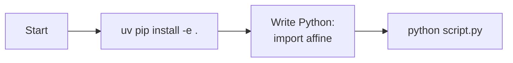
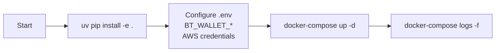
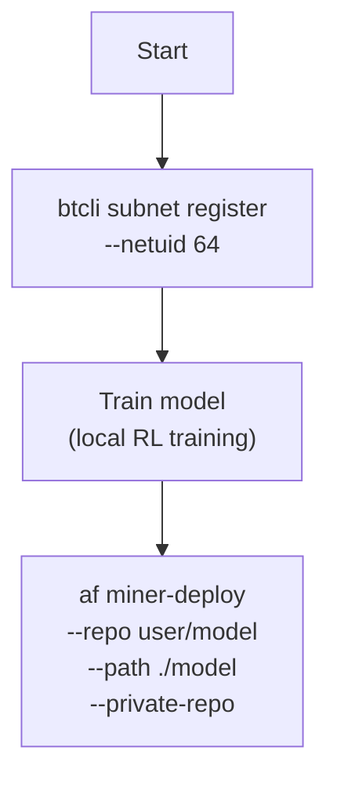
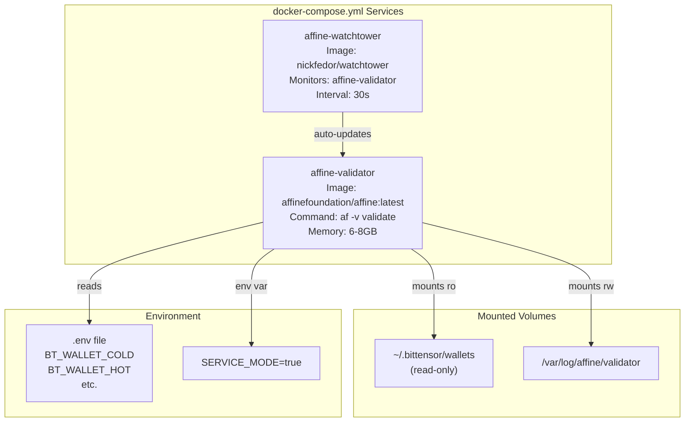

import CollapsibleAside from '../../../components/CollapsibleAside.astro';
import SourceLink from '../../../components/SourceLink.astro';
import Table from '../../../components/Table.astro';

<CollapsibleAside title="Relevant Source Files">
  <SourceLink text=".env.example" href="https://github.com/AffineFoundation/affine-cortex/blob/main/.env.example" />
  <SourceLink text="README.md" href="https://github.com/AffineFoundation/affine-cortex/blob/main/README.md" />
  <SourceLink text="affine/__init__.py" href="https://github.com/AffineFoundation/affine-cortex/blob/main/affine/__init__.py" />
  <SourceLink text="docker-compose.local.yml" href="https://github.com/AffineFoundation/affine-cortex/blob/main/docker-compose.local.yml" />
  <SourceLink text="docker-compose.yml" href="https://github.com/AffineFoundation/affine-cortex/blob/main/docker-compose.yml" />
  <SourceLink text="pyproject.toml" href="https://github.com/AffineFoundation/affine-cortex/blob/main/pyproject.toml" />
  <SourceLink text="tests/test_private_repo_workflow.py" href="https://github.com/AffineFoundation/affine-cortex/blob/main/tests/test_private_repo_workflow.py" />
  <SourceLink text="uv.lock" href="https://github.com/AffineFoundation/affine-cortex/blob/main/uv.lock" />
</CollapsibleAside>

This page provides a practical guide for new users to install, configure, and begin using Affine. It covers the initial setup process, basic configuration, and entry points for the three primary user roles: validators, miners, and SDK users.

For detailed information about specific topics, see:
- Installation details and dependency management: [Installation & Dependencies](/subnets/getting-started/installation-dependencies#2.1)
- Environment variables and configuration files: [Configuration](/subnets/getting-started/configuration#2.2)
- Working code examples for each role: [Quick Start Examples](/subnets/getting-started/quick-start-examples#2.3)
- Running a validator node: [For Validators](/subnets/for-validators#5)
- Deploying models as a miner: [For Miners](/subnets/for-miners#4)
- Programmatic evaluation with the SDK: [SDK Reference](/subnets/sdk-reference#6)

---

## User Roles

Affine supports three distinct user roles, each with different requirements and workflows:

<Table>

| Role | Purpose | Key Requirements | Entry Point |
|------|---------|------------------|-------------|
| **Validator** | Run backend services to evaluate miners and set weights on Subnet 64 | Bittensor wallet, AWS credentials (DynamoDB), Docker | `docker-compose up` or `af servers` commands |
| **Miner** | Train and deploy models to earn TAO rewards | Bittensor wallet, HuggingFace account with write token, Chutes API key | `af miner-deploy`, `af commit` |
| **SDK User** | Evaluate models programmatically using environments | Python 3.11+, optional API access for miner queries | `import affine` |

</Table>


**Sources:** [README.md:1-95](), [pyproject.toml:1-53](), [docker-compose.yml:1-26]()

---

## Prerequisites

### System Requirements

- **Python**: Version 3.11 or higher
- **Operating System**: Linux (recommended), macOS, or Windows with WSL
- **Hardware** (Validators only): 
  - Minimum 8GB RAM (16GB+ recommended)
  - Docker support with access to `/var/run/docker.sock`
  - Sufficient disk space for block cache (~10GB+)

### External Accounts and Credentials

Different roles require different external accounts:



**Account Setup Details:**

1. **Bittensor Wallet**: Created via `btcli wallet new_coldkey` and `btcli wallet new_hotkey`. Validator and miner specify wallet names in `.env` as `BT_WALLET_COLD` and `BT_WALLET_HOT`
2. **HuggingFace Token**: Generate at https://huggingface.co/settings/tokens. Miners need **Write** scope to upload models; validators need **Read** scope to download
3. **Chutes Account**: Register at chutes.ai. Set `CHUTE_USER` (username) and `CHUTES_API_KEY` in `.env`
4. **AWS Credentials**: Validators need IAM credentials with DynamoDB access (configured outside `.env`)
5. **Subtensor Endpoint**: Set to `"finney"` for mainnet or custom endpoint

**Sources:** [.env.example:1-62](), [README.md:19-32]()

---

## Installation Overview

Affine uses `uv` (Astral's Python package manager) for fast, reliable dependency management. The basic installation process:

```bash
# 1. Install uv
curl -LsSf https://astral.sh/uv/install.sh | sh

# 2. Clone repository
git clone https://github.com/AffineFoundation/affine.git
cd affine

# 3. Create virtual environment and install
uv venv && source .venv/bin/activate && uv pip install -e .

# 4. Verify installation
af
```

### Project Structure and Key Code Entities



**Key Code Entities:**

<Table>

| Entity | Path | Purpose |
|--------|------|---------|
| `af` command | [pyproject.toml:41-42]() | Main CLI entry point via `affine.cli.main:main` |
| Environment factories | [affine/__init__.py:36-52]() | SDK exports: `SAT`, `DED_V2`, `LGC`, etc. |
| `miners()` function | [affine/__init__.py:22-29]() | Lazy-loaded miner query to avoid CLI conflicts |
| `list_available_environments` | [affine/__init__.py:51]() | Lists all registered environments |

</Table>


**Sources:** [README.md:19-32](), [pyproject.toml:1-53](), [affine/__init__.py:1-60]()

---

## Configuration Overview

Affine configuration is managed through environment variables defined in a `.env` file. Create it from the template:

```bash
cp .env.example .env
# Edit .env with your credentials
```

### Required Variables by Role

<Table>

| Variable | Validator | Miner | SDK | Purpose |
|----------|-----------|-------|-----|---------|
| `BT_WALLET_COLD` | ✓ | ✓ | - | Bittensor coldkey name (e.g., "default") |
| `BT_WALLET_HOT` | ✓ | ✓ | - | Bittensor hotkey name (e.g., "default") |
| `SUBTENSOR_ENDPOINT` | ✓ | ✓ | - | Subtensor network ("finney" for mainnet) |
| `SUBTENSOR_FALLBACK` | ✓ | ✓ | - | Fallback subtensor endpoint |
| `CHUTES_API_KEY` | ✓ | ✓ | - | Chutes API key (starts with `cpk_`) |
| `HF_TOKEN` | ✓ (read) | ✓ (write) | - | HuggingFace token (starts with `hf_`) |
| `CHUTE_USER` | - | ✓ | - | Chutes username |

</Table>


**Miner-Specific: Private Repo Workflow**

For miners using `af miner-deploy --private-repo`, the workflow creates a private HuggingFace repo, commits to blockchain, then makes the repo public. This prevents copying before commitment:

```bash
# Private repo deployment
af miner-deploy -r myuser/model -p ./my_model --private-repo
```

The `HF_TOKEN` is automatically stored as a Chutes secret to allow Chutes to access the private repo during deployment.

**Sources:** [.env.example:1-62](), [README.md:19-32]()

---

## Quick Start Paths

Choose your path based on your role:

### Path 1: SDK User (Simplest)

For users who want to evaluate models programmatically without running infrastructure:



**Minimal example:**
```python
import affine

# List available environments
envs = affine.tasks.list_available_environments()

# Create environment instance
env = affine.DED_V2()

# Evaluate a miner by UID (requires API access)
miner = affine.miners(uid=160)
result = await env.evaluate_miner(miner)

# Or evaluate a custom model directly
result = await env.evaluate_model(
    model="Qwen/Qwen3-32B",
    base_url="https://llm.chutes.ai/v1"
)
```

The SDK uses lazy imports to avoid Bittensor CLI conflicts. See [affine/__init__.py:22-29]() for `miners()` implementation.

**Sources:** [affine/__init__.py:1-60](), [README.md:72-87]()

### Path 2: Validator

For users running a validator node to evaluate miners and set weights:



**Docker Compose Services:**

The validator runs a single service defined in [docker-compose.yml:4-17]():

```bash
# Start validator service with watchtower (auto-updates)
docker-compose up -d

# View logs
docker-compose logs -f validator

# Stop services
docker-compose down
```

The validator service runs `af validate` command with `SERVICE_MODE=true` for continuous operation.

**Sources:** [docker-compose.yml:1-26](), [README.md:58-67]()

### Path 3: Miner

For users training and deploying models:



**Unified Deployment Command:**

The `af miner-deploy` command handles the complete deployment workflow (see page [4.3](#4.3) for details):

```bash
# Standard deployment
af miner-deploy -r username/model-name -p ./my_model

# Private repo workflow (recommended)
af miner-deploy -r username/model-name -p ./my_model --private-repo
```

**Private Repo Workflow Steps:**
1. Creates **private** HuggingFace repo
2. Uploads model to private repo
3. Stores `HF_TOKEN` as Chutes secret
4. Deploys to Chutes
5. Commits to blockchain
6. Makes HuggingFace repo **public** after commit

This prevents other miners from copying your model before on-chain commitment.

**Sources:** [README.md:44-55](), [.env.example:47-62]()

---

## Environment System

Affine evaluates models across 11+ reinforcement learning environments using Docker containers managed by [Affinetes](https://github.com/AffineFoundation/affinetes):

### Available Environments

<Table>

| Factory Function | Environment Name | Description |
|-----------------|------------------|-------------|
| `affine.SAT()` | SAT | Satisfiability reasoning |
| `affine.DED_V2()` | DED-V2 | Deductive reasoning (v2) |
| `affine.ABD_V2()` | ABD-V2 | Abductive reasoning (v2) |
| `affine.CDE()` | CDE | Causal deductive reasoning |
| `affine.LGC()` | LGC | Logic reasoning |
| `affine.LGC_V2()` | LGC-V2 | Logic reasoning (v2) |
| `affine.GAME()` | GAME | Game theory |
| `affine.SWEPRO()` | SWE-PRO | Software engineering (production) |
| `affine.SWESYNTH()` | SWE-SYNTH | Software engineering (synthetic) |
| `affine.PRINT()` | PRINT | Print task |
| `affine.ARCGEN()` | ARC-GEN | ARC generation |

</Table>


### SDK Usage

```python
import affine

# List all available environments
envs = affine.tasks.list_available_environments()

# Create environment instance
env = affine.DED_V2()

# Evaluate miner by UID
miner = affine.miners(uid=160)
result = await env.evaluate_miner(miner)

# Or evaluate custom model
result = await env.evaluate_model(
    model="Qwen/Qwen3-32B",
    base_url="https://llm.chutes.ai/v1",
    temperature=0.7
)
```

All factory functions are defined in [affine/__init__.py:36-52]() and delegate to `affine.core.environments` module.

**Sources:** [affine/__init__.py:36-52](), [README.md:72-87]()

---

## Docker Deployment

Production validators run via Docker Compose with two services:

### Production Deployment Architecture



### Deployment Commands

```bash
# Production deployment with auto-updates
docker-compose pull
docker-compose up -d

# View logs
docker-compose logs -f validator

# Stop services
docker-compose down
```

### Local Development

For local development, use the override file [docker-compose.local.yml:1-15]():

```bash
# Build and run local image
docker compose -f docker-compose.yml -f docker-compose.local.yml up --build
```

This builds the `affine:local` image from the Dockerfile instead of pulling `affinefoundation/affine:latest`.

**Sources:** [docker-compose.yml:1-26](), [docker-compose.local.yml:1-15](), [README.md:58-67]()

---

## Monitoring

Validators can monitor their operation through Docker logs:

```bash
# Follow validator logs
docker-compose logs -f validator

# View recent logs
docker-compose logs --tail=100 validator

# Check container status
docker-compose ps
```

The validator service runs with `SERVICE_MODE=true` which enables continuous operation. Memory limits are set to 6-8GB as configured in [docker-compose.yml:8-9]().

**Sources:** [docker-compose.yml:1-26]()

---

## Next Steps

After completing initial setup, proceed to:

1. **For detailed installation**: [Installation & Dependencies](/subnets/getting-started/installation-dependencies#2.1)
2. **For configuration details**: [Configuration](/subnets/getting-started/configuration#2.2)
3. **For working examples**: [Quick Start Examples](/subnets/getting-started/quick-start-examples#2.3)
4. **To understand the architecture**: [System Architecture](/subnets/system-architecture#3)
5. **To run a validator**: [For Validators](/subnets/for-validators#5)
6. **To become a miner**: [For Miners](/subnets/for-miners#4)
7. **To use the SDK**: [SDK Reference](/subnets/sdk-reference#6)
8. **To understand environments**: [Evaluation Environments](/subnets/evaluation-environments#7)

For troubleshooting common issues, see [Troubleshooting & FAQ](/subnets/troubleshooting-faq#13).

**Sources:** [README.md:1-223](), [FAQ.md:1-100]()
