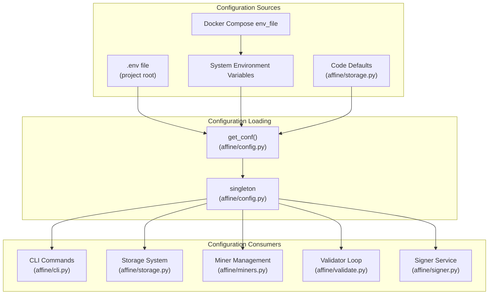
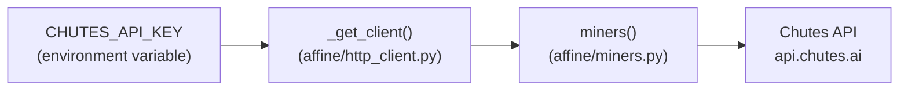
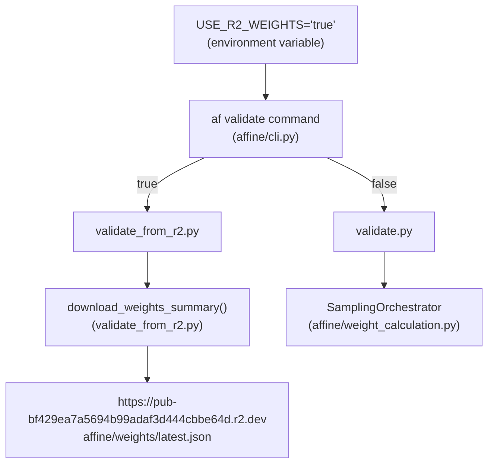
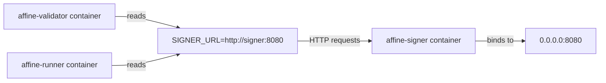
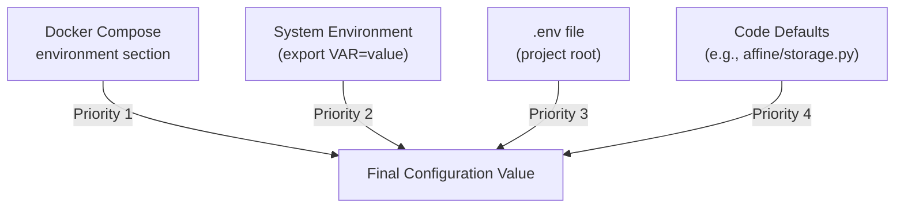

import CollapsibleAside from '../../../../components/CollapsibleAside.astro';
import SourceLink from '../../../../components/SourceLink.astro';
import Table from '../../../../components/Table.astro';

<CollapsibleAside title="Relevant Source Files">
  <SourceLink text=".env.example" href="https://github.com/AffineFoundation/affine-cortex/blob/main/.env.example" />
  <SourceLink text="README.md" href="https://github.com/AffineFoundation/affine-cortex/blob/main/README.md" />
  <SourceLink text="affine/__init__.py" href="https://github.com/AffineFoundation/affine-cortex/blob/main/affine/__init__.py" />
  <SourceLink text="docker-compose.local.yml" href="https://github.com/AffineFoundation/affine-cortex/blob/main/docker-compose.local.yml" />
  <SourceLink text="docker-compose.yml" href="https://github.com/AffineFoundation/affine-cortex/blob/main/docker-compose.yml" />
  <SourceLink text="pyproject.toml" href="https://github.com/AffineFoundation/affine-cortex/blob/main/pyproject.toml" />
  <SourceLink text="tests/test_private_repo_workflow.py" href="https://github.com/AffineFoundation/affine-cortex/blob/main/tests/test_private_repo_workflow.py" />
  <SourceLink text="uv.lock" href="https://github.com/AffineFoundation/affine-cortex/blob/main/uv.lock" />
</CollapsibleAside>

This document covers all configuration options for Affine, including environment variables, .env file setup, and role-specific settings for validators and miners. For Docker deployment specifics, see [Docker Deployment](/subnets/deployment-guide/docker-deployment#10.1). For storage system configuration details, see [R2 Storage Architecture](#8.1).

## Configuration Overview

Affine uses environment variables for configuration, typically loaded from a `.env` file. Configuration is accessed via the `get_conf()` singleton defined in [`affine/config.py`](). The system distinguishes between:

- **Common configuration**: Required by all roles (Bittensor wallet, Chutes API)
- **Validator configuration**: Storage credentials, monitoring settings
- **Miner configuration**: Deployment settings, Chutes user identity
- **SDK configuration**: Optional credentials for programmatic access



**Sources:** [.env.example:1-99](), [affine/__init__.py:8](), [docker-compose.yml:10-11,29-30,46-47]()

## Configuration File Setup

### Creating the .env File

Copy the example configuration and edit with your credentials:

```bash
cp .env.example .env
```

The `.env` file is loaded automatically by the application and by Docker Compose. In Docker deployments, it is mounted read-only into containers:

```yaml
# From docker-compose.yml
volumes:
  - ./.env:/app/.env:ro
```

**Sources:** [README.md:43-45](), [docker-compose.yml:13,32,52]()

## Core Configuration Variables

### Bittensor Wallet Configuration

<Table>

| Variable | Required | Description | Example |
|----------|----------|-------------|---------|
| `BT_WALLET_COLD` | **All roles** | Coldkey wallet name | `default` |
| `BT_WALLET_HOT` | **All roles** | Hotkey wallet name | `default` |

</Table>


These are **wallet names** (not SS58 addresses or file paths) used when creating wallets via `btcli wallet new_coldkey` and `btcli wallet new_hotkey`. The wallet files must exist in `~/.bittensor/wallets/`.

In Docker deployments, wallets are mounted read-only:

```yaml
# From docker-compose.yml
volumes:
  - ~/.bittensor/wallets:/root/.bittensor/wallets:ro
```

**Sources:** [.env.example:8-19](), [docker-compose.yml:33,53]()

### Subtensor Network Configuration

<Table>

| Variable | Required | Description | Example |
|----------|----------|-------------|---------|
| `SUBTENSOR_ENDPOINT` | Optional | Primary subtensor endpoint | `finney` |
| `SUBTENSOR_FALLBACK` | Optional | Fallback WebSocket endpoint | `wss://lite.sub.latent.to:443` |

</Table>


Default behavior uses the Finney mainnet. These values are consumed by the `get_subtensor()` utility function.

**Sources:** [.env.example:37-39]()

## External Service Configuration

### Chutes API Configuration

<Table>

| Variable | Required | Description | Format |
|----------|----------|-------------|--------|
| `CHUTES_API_KEY` | **Validators, Miners, SDK** | Chutes authentication key | `cpk_xxx.xxx.xxx` |

</Table>


The Chutes API key is required for:
- **Validators**: Querying miner deployment status via [`affine/miners.py`]()
- **Miners**: Deploying models via `af chutes_push` command
- **SDK**: Evaluating miners via `af.miners()` function

This credential is used by the HTTP client to authenticate with `https://api.chutes.ai`:



**Sources:** [.env.example:1-6](), [affine/http_client.py](), [affine/miners.py]()

### HuggingFace Configuration

<Table>

| Variable | Required | Description | Format |
|----------|----------|-------------|--------|
| `HF_USER` | **Miners, Validators** | HuggingFace username | `myaccount` |
| `HF_TOKEN` | **Miners, Validators** | HuggingFace access token | `hf_xxxxx` |

</Table>


**Miners** require write access to upload models. **Validators** require read access to download model metadata. The token is obtained from https://huggingface.co/settings/tokens.

**Sources:** [.env.example:21-35]()

## Validator-Specific Configuration

### Storage Configuration (Cloudflare R2)

Validators require R2 credentials to store evaluation results and read historical data:

<Table>

| Variable | Required | Description | Example |
|----------|----------|-------------|---------|
| `R2_FOLDER` | **Validators** | R2 bucket name | `affine` |
| `R2_BUCKET_ID` | **Validators** | Cloudflare account ID | `00523074f51300584834607253cae0fa` |
| `R2_ACCOUNT_ID` | **Validators** | Same as R2_BUCKET_ID | `00523074f51300584834607253cae0fa` |
| `R2_WRITE_ACCESS_KEY_ID` | **Validators** | R2 API access key | *(secret)* |
| `R2_WRITE_SECRET_ACCESS_KEY` | **Validators** | R2 API secret key | *(secret)* |
| `AFFINE_R2_PUBLIC` | Optional | Use public R2.dev URLs | `1` (default) |

</Table>


These variables are consumed by the storage module:

```python
# From affine/storage.py
FOLDER = os.getenv("R2_FOLDER", "affine")
BUCKET = os.getenv("R2_BUCKET_ID", "")
ACCESS = os.getenv("R2_WRITE_ACCESS_KEY_ID")
SECRET = os.getenv("R2_WRITE_SECRET_ACCESS_KEY")
ENDPOINT = f"https://{BUCKET}.r2.cloudflarestorage.com"
PUBLIC_READ = os.getenv("AFFINE_R2_PUBLIC", "1") == "1"
R2_PUBLIC_BASE = f"https://pub-{BUCKET}.r2.dev"
```

**Public vs. Authenticated Access:**
- When `AFFINE_R2_PUBLIC=1`: Reads use public `https://pub-*.r2.dev` URLs (faster, no auth)
- When `AFFINE_R2_PUBLIC=0`: All operations use S3 API with authentication

**Sources:** [.env.example:50-76](), [affine/storage.py:42-48]()

### R2 Weights Mode

<Table>

| Variable | Required | Description | Default |
|----------|----------|-------------|---------|
| `USE_R2_WEIGHTS` | Optional | Download pre-computed weights from R2 | `false` |

</Table>


When enabled, the validator downloads weights from the official Affine R2 bucket instead of computing them locally:



The official weights URL is hardcoded in [`affine/validate_from_r2.py:18-19`]():

```python
R2_PUBLIC_URL = "https://pub-bf429ea7a5694b99adaf3d444cbbe64d.r2.dev"
WEIGHTS_KEY = "affine/weights/latest.json"
```

**Sources:** [.env.example:91-98](), [affine/validate_from_r2.py:1-132]()

### Miner Blacklist

<Table>

| Variable | Required | Description | Example |
|----------|----------|-------------|---------|
| `AFFINE_MINER_BLACKLIST` | Optional | Comma-separated hotkeys to exclude | `5ABC123...,5DEF456...` |

</Table>


Validators use this to filter out specific miners during the sampling process. The blacklist is processed by the miner filtering pipeline in [`affine/miners.py`]().

**Sources:** [.env.example:78-81]()

### Environment Deployment Configuration

<Table>

| Variable | Required | Description | Example |
|----------|----------|-------------|---------|
| `AFFINETES_HOSTS` | Optional | Remote Docker hosts for environments | `localhost,ssh://user@host` |

</Table>


Configures where evaluation environments are deployed via the Affinetes orchestration system:

- `localhost`: Deploy containers on the same host as the runner
- `ssh://user@host`: Deploy containers on remote hosts via SSH

Multiple hosts enable distributed evaluation:

```
AFFINETES_HOSTS="localhost,ssh://root@192.168.1.100,ssh://root@192.168.1.101"
```

Remote hosts require:
- SSH access configured (keys in `~/.ssh`)
- Docker daemon running
- Network connectivity to Chutes endpoints

In Docker deployments, the runner mounts SSH keys and Docker socket:

```yaml
# From docker-compose.yml
volumes:
  - ~/.ssh:/root/.ssh
  - /var/run/docker.sock:/var/run/docker.sock
```

**Sources:** [.env.example:83-89](), [docker-compose.yml:34-35]()

## Miner-Specific Configuration

### Chutes Deployment Configuration

<Table>

| Variable | Required | Description | Example |
|----------|----------|-------------|---------|
| `CHUTE_USER` | **Miners** | Chutes username | `myusername` |

</Table>


The Chutes username is set during `chutes register` and identifies your account on the Chutes platform. This is used by the `af chutes_push` command when deploying models.

**Sources:** [.env.example:42-48]()

## Docker-Specific Configuration

### Service Configuration

Docker Compose injects additional environment variables at runtime:

<Table>

| Variable | Service | Description | Default |
|----------|---------|-------------|---------|
| `SIGNER_URL` | validator, runner | HTTP endpoint of signer service | `http://signer:8080` |
| `AFFINE_CACHE_DIR` | validator | Block data cache directory | `/app/data/blocks` |
| `SIGNER_HOST` | signer | Bind address for signer API | `0.0.0.0` |
| `SIGNER_PORT` | signer | Port for signer API | `8080` |

</Table>


These are set in [`docker-compose.yml`]() and enable inter-service communication:



**Sources:** [docker-compose.yml:16-17,39,48-50]()

### Volume Configuration

Docker services mount configuration as read-only and data directories as read-write:

```yaml
# Validator volumes
volumes:
  - ./.env:/app/.env:ro                    # Configuration (read-only)
  - validator-cache:/app/data/blocks       # Block cache (read-write)

# Runner volumes
volumes:
  - ./.env:/app/.env:ro                    # Configuration (read-only)
  - ~/.bittensor/wallets:/root/.bittensor/wallets:ro  # Wallets (read-only)
  - ~/.ssh:/root/.ssh                      # SSH keys (read-write)
  - /var/run/docker.sock:/var/run/docker.sock  # Docker API (read-write)
  - runner-cache:/root/.cache/affine       # Environment cache (read-write)
```

**Sources:** [docker-compose.yml:12-36]()

### Resource Limits

Memory allocation for validator and runner services:

```yaml
# From docker-compose.yml
mem_reservation: "6g"  # Soft limit (guaranteed)
mem_limit: "8g"        # Hard limit (maximum)
```

For tuning resource allocation, see [Resource Requirements & Scaling](/subnets/deployment-guide/resource-requirements-scaling#10.3).

**Sources:** [docker-compose.yml:8-9,27-28]()

## Configuration Priority

Configuration values are resolved in the following order (highest to lowest priority):

1. **Docker Compose environment variables** (in `docker-compose.yml`)
2. **System environment variables**
3. **`.env` file values**
4. **Code defaults** (in `affine/storage.py` and other modules)



**Sources:** [docker-compose.yml:15-16](), [affine/storage.py:42-48]()

## Configuration Validation

Configuration errors are typically caught at runtime:

- **Missing required variables**: Services fail to start with error messages indicating missing credentials
- **Invalid credentials**: HTTP 401/403 errors when accessing external APIs (Chutes, HuggingFace, R2)
- **Invalid wallet names**: Bittensor operations fail with wallet-not-found errors

For troubleshooting configuration issues, see [Troubleshooting & FAQ](/subnets/troubleshooting-faq#13).

**Sources:** [affine/cli.py](), [affine/miners.py](), [affine/storage.py]()
