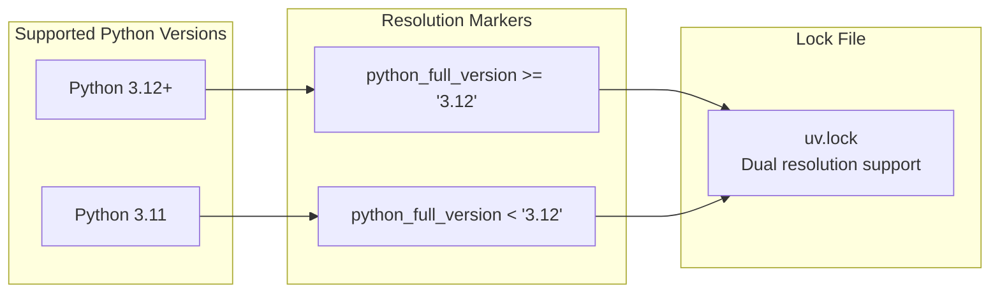
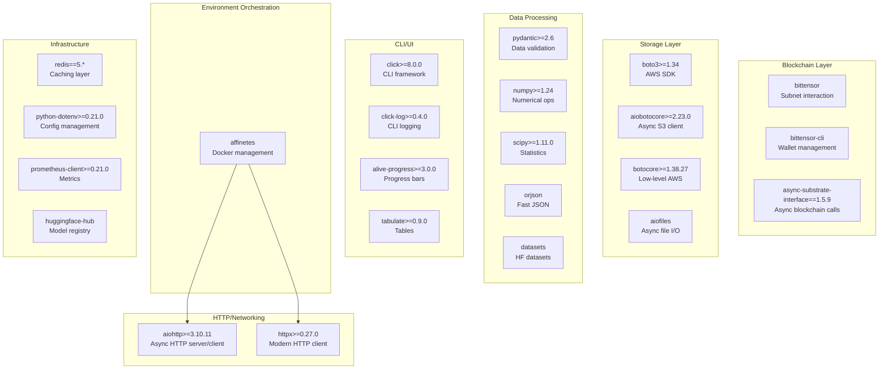
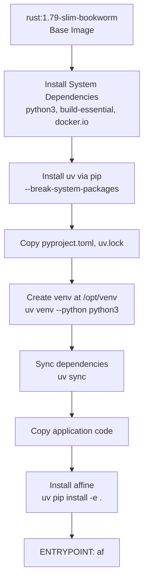
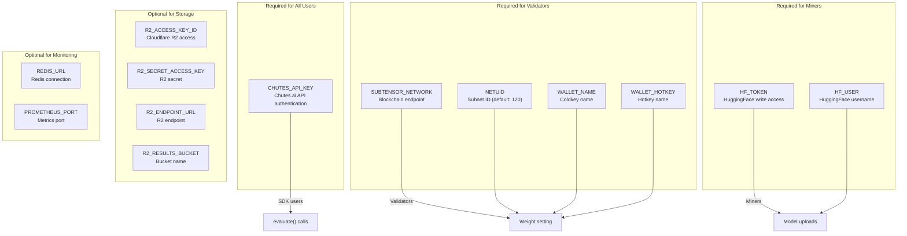
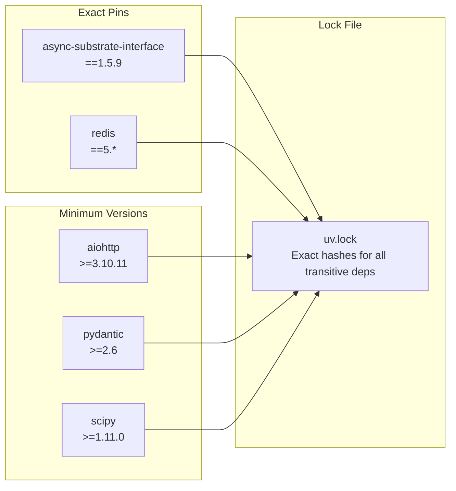

import CollapsibleAside from '../../../../components/CollapsibleAside.astro';
import SourceLink from '../../../../components/SourceLink.astro';
import Table from '../../../../components/Table.astro';

<CollapsibleAside title="Relevant Source Files">
  <SourceLink text="docker-compose.local.yml" href="https://github.com/AffineFoundation/affine-cortex/blob/main/docker-compose.local.yml" />
  <SourceLink text="docker-compose.yml" href="https://github.com/AffineFoundation/affine-cortex/blob/main/docker-compose.yml" />
  <SourceLink text="pyproject.toml" href="https://github.com/AffineFoundation/affine-cortex/blob/main/pyproject.toml" />
  <SourceLink text="uv.lock" href="https://github.com/AffineFoundation/affine-cortex/blob/main/uv.lock" />
</CollapsibleAside>

This document covers the installation process, Python version requirements, and dependency management for Affine. It includes instructions for both local development and production deployment using the `uv` package manager.

For runtime configuration after installation, see [Configuration](/subnets/getting-started/configuration#2.2). For quick start examples showing how to use the installed system, see [Quick Start Examples](/subnets/getting-started/quick-start-examples#2.3).

---

## Overview

Affine requires Python 3.11 or higher and uses `uv` as its package manager for fast, deterministic dependency resolution. The codebase has three main installation contexts: validators (evaluating miners), miners (training and deploying models), and SDK users (programmatic evaluation).

**Sources:** [pyproject.toml:1-47](), [Dockerfile:1-30]()

---

## Python Version Requirements



<Table>

| Python Version | Support Status | Notes |
|----------------|----------------|-------|
| 3.11.x | ✅ Fully Supported | Minimum required version |
| 3.12.x | ✅ Fully Supported | Tested and locked |
| 3.13.x | ⚠️ Partial | Some typing extensions differ |
| &lt; 3.11 | ❌ Not Supported | Incompatible syntax and features |

</Table>


The lock file maintains separate resolution markers for Python 3.11 and 3.12+, ensuring compatibility across both versions.

**Sources:** [pyproject.toml:33](), [uv.lock:3-7]()

---

## Package Manager: uv

Affine uses `uv` for dependency management instead of pip or poetry. `uv` provides:

- **Fast resolution**: 10-100x faster than pip
- **Deterministic installs**: Lock file ensures reproducibility
- **Virtual environment management**: Integrated venv creation
- **Editable installs**: Development mode support

### Installing uv

```bash
# System-wide installation
pip install uv

# Or using Docker (handled automatically)
# See Dockerfile for automated setup
```

### uv Commands Used in Affine

<Table>

| Command | Purpose | Usage Context |
|---------|---------|---------------|
| `uv venv` | Create virtual environment | Initial setup |
| `uv sync` | Install all locked dependencies | Production/CI |
| `uv pip install -e .` | Install affine in editable mode | Development |
| `uv lock` | Update lock file | Dependency changes |

</Table>


**Sources:** [Dockerfile:12-23](), [pyproject.toml:1-47]()

---

## Core Dependencies



### Dependency Categories

**Sources:** [pyproject.toml:6-31](), [uv.lock:18-76]()

---

## Installation Methods

### Method 1: Local Development Installation

```bash
# 1. Ensure Python 3.11+ is installed
python3 --version  # Should be >= 3.11

# 2. Install uv
pip install uv

# 3. Clone the repository
git clone https://github.com/AffineFoundation/affine-cortex
cd affine-cortex

# 4. Create virtual environment and install dependencies
uv venv
source .venv/bin/activate  # On Windows: .venv\Scripts\activate

# 5. Sync dependencies from lock file
uv sync

# 6. Install affine in editable mode
uv pip install -e .

# 7. Verify installation
af --help
```

The editable install (`-e .`) allows you to modify source code without reinstalling.

**Sources:** [pyproject.toml:35-36](), [Dockerfile:19-27]()

---

### Method 2: Docker Installation



The Dockerfile implements a multi-stage build process:

1. **Base Layer**: Uses Rust 1.79 on Debian Bookworm for substrate-interface compilation
2. **System Dependencies**: Installs Python, build tools, Docker CLI, and SSH
3. **uv Installation**: Installs uv using pip with `--break-system-packages` flag
4. **Dependency Resolution**: Copies only `pyproject.toml` and `uv.lock` first for layer caching
5. **Virtual Environment**: Creates venv at `/opt/venv` and adds to PATH
6. **Dependency Installation**: Uses `uv sync` for reproducible installs
7. **Application Installation**: Copies code and installs in editable mode

Key environment variables set:
- `VENV_DIR=/opt/venv`
- `VIRTUAL_ENV=$VENV_DIR`
- `PATH="$VENV_DIR/bin:$PATH"`

**Sources:** [Dockerfile:1-30]()

---

## Dependency Breakdown by Use Case

### Validator Dependencies

Validators need the full dependency set for evaluation and weight setting:

<Table>

| Dependency | Purpose | Critical? |
|------------|---------|-----------|
| `bittensor` | Metagraph access, weight setting | ✅ Yes |
| `affinetes` | Docker container orchestration | ✅ Yes |
| `aiobotocore` | R2 storage for results | ✅ Yes |
| `httpx` | Chutes API queries | ✅ Yes |
| `scipy` | Pareto dominance calculations | ✅ Yes |
| `prometheus-client` | Metrics export | ⚠️ Optional |
| `redis` | Caching layer | ⚠️ Optional |

</Table>


**Sources:** [pyproject.toml:6-31]()

---

### Miner Dependencies

Miners need a smaller subset focused on deployment:

<Table>

| Dependency | Purpose | Critical? |
|------------|---------|-----------|
| `bittensor-cli` | Wallet management, commits | ✅ Yes |
| `huggingface-hub` | Model uploads | ✅ Yes |
| `httpx` | Chutes deployment API | ✅ Yes |
| `click` | CLI interface | ✅ Yes |
| `python-dotenv` | Environment configuration | ✅ Yes |

</Table>


Miners do not need `affinetes`, `scipy`, or the full evaluation stack.

**Sources:** [pyproject.toml:6-31]()

---

### SDK User Dependencies

SDK users evaluating models programmatically need:

<Table>

| Dependency | Purpose | Critical? |
|------------|---------|-----------|
| `affinetes` | Environment execution | ✅ Yes |
| `httpx` | Model inference calls | ✅ Yes |
| `pydantic` | Data models | ✅ Yes |
| `aiohttp` | Async HTTP operations | ✅ Yes |
| `python-dotenv` | Config loading | ⚠️ Recommended |

</Table>


SDK usage does not require `bittensor`, `boto3`, or blockchain dependencies.

**Sources:** [examples/sdk.py:1-52](), [examples/sdk2.py:1-41]()

---

## Environment Variables



### Environment Variable Setup

Create a `.env` file in the project root:

```bash
# Required for SDK/Validators/Miners (Chutes API)
CHUTES_API_KEY=your_chutes_api_key_here

# Required for Miners (HuggingFace)
HF_TOKEN=hf_your_token_here
HF_USER=your_hf_username

# Required for Validators (Bittensor)
SUBTENSOR_NETWORK=finney
NETUID=120
WALLET_NAME=default
WALLET_HOTKEY=default

# Optional: R2 Storage (defaults to public read)
R2_ACCESS_KEY_ID=your_r2_access_key
R2_SECRET_ACCESS_KEY=your_r2_secret_key
R2_ENDPOINT_URL=https://your-account.r2.cloudflarestorage.com
R2_RESULTS_BUCKET=affine-120-results

# Optional: Redis caching
REDIS_URL=redis://localhost:6379

# Optional: Prometheus metrics
PROMETHEUS_PORT=8765
```

The `python-dotenv` package automatically loads `.env` files when importing affine:

```python
from dotenv import load_dotenv
load_dotenv()  # Loads .env from current directory

import affine as af
# Environment variables now accessible
```

**Sources:** [examples/sdk.py:3-19](), [scripts/evaluate_local_model.py:27-28](), [pyproject.toml:8]()

---

## Verification Steps

After installation, verify the setup:

```bash
# 1. Check CLI is accessible
af --help

# 2. Verify Python version
python --version  # Should be >= 3.11

# 3. Check affine can be imported
python -c "import affine; print(affine.__version__)"

# 4. Verify key dependencies
python -c "import bittensor, aiohttp, pydantic, affinetes"

# 5. Check environment variables (validators/miners)
python -c "import os; print('CHUTES_API_KEY:', 'SET' if os.getenv('CHUTES_API_KEY') else 'NOT SET')"
```

**Sources:** [examples/sdk.py:1-12]()

---

## Common Installation Issues

### Issue: uv not found

**Symptom**: `bash: uv: command not found`

**Solution**: Install uv globally:
```bash
pip install --user uv
# Or system-wide:
sudo pip install uv
```

### Issue: Python version too old

**Symptom**: `requires-python = ">=3.11"` error

**Solution**: Install Python 3.11+ using your system package manager or pyenv:
```bash
# Ubuntu/Debian
sudo apt install python3.11

# macOS with Homebrew
brew install python@3.11
```

### Issue: Docker socket permission denied (validators)

**Symptom**: `Permission denied while connecting to docker.sock`

**Solution**: Add user to docker group:
```bash
sudo usermod -aG docker $USER
# Logout and login again
```

This is required because validators spawn evaluation containers via [affinetes](https://github.com/AffineFoundation/affinetes).

### Issue: CHUTES_API_KEY not set

**Symptom**: `❌ CHUTES_API_KEY environment variable not set`

**Solution**: Obtain API key from Chutes and add to `.env`:
```bash
echo "CHUTES_API_KEY=your_key_here" >> .env
```

**Sources:** [examples/sdk.py:14-19](), [scripts/evaluate_local_model.py:286-295]()

---

## Dependency Version Pinning

Affine uses specific version constraints to ensure stability:



- **Exact pins** (`==`): Critical dependencies where version matters
- **Minimum versions** (`>=`): Compatibility requirements
- **Lock file**: All dependencies (including transitive) pinned with SHA256 hashes

To update dependencies:
```bash
# Update lock file with latest compatible versions
uv lock --upgrade

# Update specific package
uv lock --upgrade-package pydantic
```

**Sources:** [pyproject.toml:6-31](), [uv.lock:1-7]()

---

## Next Steps

After successful installation:
- Configure environment variables and wallet settings: [Configuration](/subnets/getting-started/configuration#2.2)
- Run your first evaluation: [Quick Start Examples](/subnets/getting-started/quick-start-examples#2.3)
- Set up a validator node: [Running a Validator](/subnets/for-validators/running-a-validator#5.2)
- Deploy as a miner: [Deployment Workflow](/subnets/for-miners/deployment-workflow#4.3)

**Sources:** [pyproject.toml:1-47](), [Dockerfile:1-30](), [uv.lock:1-76]()
