import CollapsibleAside from '../../../../components/CollapsibleAside.astro';
import SourceLink from '../../../../components/SourceLink.astro';
import Table from '../../../../components/Table.astro';

<CollapsibleAside title="Relevant Source Files">
  <SourceLink text=".env.example" href="https://github.com/AffineFoundation/affine-cortex/blob/main/.env.example" />
  <SourceLink text="README.md" href="https://github.com/AffineFoundation/affine-cortex/blob/main/README.md" />
  <SourceLink text="affine/__init__.py" href="https://github.com/AffineFoundation/affine-cortex/blob/main/affine/__init__.py" />
  <SourceLink text="tests/test_private_repo_workflow.py" href="https://github.com/AffineFoundation/affine-cortex/blob/main/tests/test_private_repo_workflow.py" />
</CollapsibleAside>

This page provides practical, working examples for the three primary use cases of Affine: using the SDK to evaluate models, running a validator node, and deploying models as a miner. Each example includes complete command-line invocations, code patterns, and workflow diagrams.

For detailed information about installation and dependencies, see [Installation & Dependencies](/subnets/getting-started/installation-dependencies#2.1). For configuration options and environment variables, see [Configuration](/subnets/getting-started/configuration#2.2). For comprehensive CLI reference, see [CLI Reference](/subnets/cli-reference#9).

---

## SDK Evaluation Examples

The Affine SDK allows programmatic evaluation of models across all eight environments. The SDK can evaluate models either through Chutes (using miner UIDs) or directly via any OpenAI-compatible endpoint.

### Basic Miner Evaluation

Evaluate a registered miner by UID across any environment:

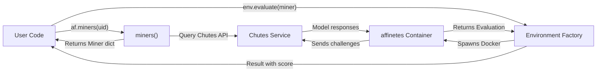

**Example: Evaluating Miner UID 160 on DED Environment**

The pattern shown in [examples/sdk.py:13-33]() demonstrates the basic workflow:

1. Load environment variables and configure logging
2. Query miner information using `af.miners(uid)`
3. Create environment instance using factory function
4. Call `evaluate(miner)` to run evaluation
5. Access score and extra metrics from result

Key code entities:
- `af.miners()`: Defined in [affine/miners.py](), returns dict of `Miner` objects
- `af.DED()`: Factory function from [affine/__init__.py:54](), creates `AffineSDKEnv` instance
- `env.evaluate()`: Method on `BaseSDKEnv`, spawns environment via `affinetes`

**Source:** [examples/sdk.py:1-52](), [README.md:167-208]()

---

### Direct Model Evaluation

Evaluate any OpenAI-compatible model endpoint without requiring miner registration:

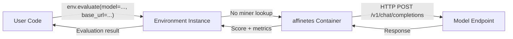

**Example: Evaluating DeepSeek-V3 via Chutes Public Endpoint**

The pattern in [examples/sdk2.py:20-37]() shows direct evaluation:

```python
alfworld_env = af.ALFWORLD()
evaluation = await alfworld_env.evaluate(
    model="deepseek-ai/DeepSeek-V3",
    base_url="https://llm.chutes.ai/v1",
    task_id=2
)
```

This bypasses the `miners()` call and directly queries the specified endpoint. Useful for:
- Testing local models during development
- Evaluating external models not registered on subnet
- CI/CD integration testing

**Source:** [examples/sdk2.py:1-41](), [scripts/evaluate_local_model.py:190-218]()

---

### Environment-Specific Evaluation Patterns

Different environment types support different evaluation parameters:

<Table>

| Environment Type | Task ID Support | Example Factory | Required Parameters |
|-----------------|-----------------|-----------------|---------------------|
| Affine Envs (SAT, ABD, DED) | No | `af.SAT()` | `miner` or `model + base_url` |
| AgentGym Envs (ALFWORLD, WEBSHOP, etc.) | Yes | `af.ALFWORLD()` | Same + optional `task_id` |

</Table>


**Example: Task-Specific AgentGym Evaluation**

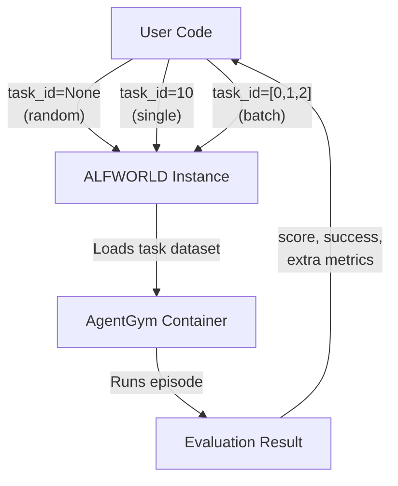

As shown in [README.md:191-200]():
- **Random task**: `await alfworld_env.evaluate(miner)` (default)
- **Single task**: `await alfworld_env.evaluate(miner, task_id=10)`
- **Multiple tasks**: `await alfworld_env.evaluate(miner, task_id=[0, 1, 2])`

Task IDs correspond to specific episodes in the environment's dataset (e.g., ALFWORLD has 134 tasks, WEBSHOP has 500).

**Source:** [README.md:191-201](), [scripts/evaluate_local_model.py:32-34]()

---

### Complete SDK Example

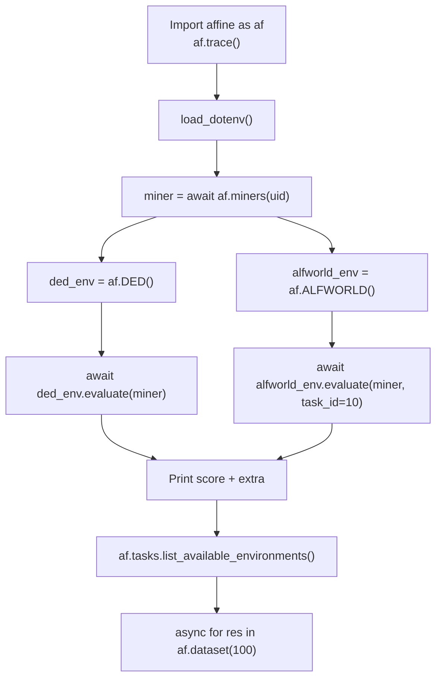

The complete pattern from [examples/sdk.py:13-51]() demonstrates:

1. **Logging setup**: `af.trace()` enables detailed logging
2. **Environment loading**: `load_dotenv()` loads configuration
3. **Miner discovery**: `await af.miners(uid)` fetches miner metadata
4. **Environment creation**: Factory functions like `af.DED()`
5. **Evaluation**: Async `evaluate()` calls return `Evaluation` objects
6. **Discovery**: `list_available_environments()` shows all 8 environments
7. **Historical data**: `af.dataset(blocks)` provides async iterator over past results

Key SDK exports from [affine/__init__.py:50-61]():
- Environment factories: `SAT`, `ABD`, `DED`, `ALFWORLD`, `WEBSHOP`, `BABYAI`, `SCIWORLD`, `TEXTCRAFT`
- Miner query: `miners()`
- Data access: `dataset()`, `load_summary()`
- Environment listing: `tasks.list_available_environments()`

**Source:** [examples/sdk.py:1-52](), [affine/__init__.py:50-62]()

---

### Using the Evaluation Script

The repository includes a comprehensive evaluation script with advanced features:

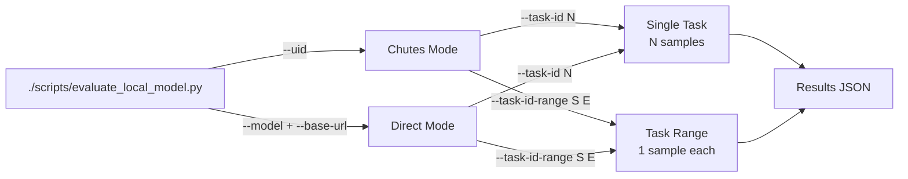

**Command Examples:**

<Table>

| Use Case | Command |
|----------|---------|
| Evaluate miner on ABD | `./scripts/evaluate_local_model.py --env ABD --uid 7` |
| Evaluate local model | `./scripts/evaluate_local_model.py --env ABD --model your-model --base-url http://172.17.0.1:30000/v1 --samples 10` |
| Specific ALFWORLD task | `./scripts/evaluate_local_model.py --env ALFWORLD --task-id 2 --uid 7 --samples 5` |
| Task range evaluation | `./scripts/evaluate_local_model.py --env ALFWORLD --task-id-range 0 9 --model your-model --base-url http://172.17.0.1:30000/v1` |
| Save results to file | `./scripts/evaluate_local_model.py --env ABD --uid 7 --output ./results.json` |

</Table>


The script implements the evaluation logic in [scripts/evaluate_local_model.py:102-262]() with support for:
- Progress tracking
- Result aggregation
- JSON output
- Statistical summaries
- Error handling

**Source:** [scripts/evaluate_local_model.py:1-451]()

---

## Starting a Validator

Validators evaluate miners and set weights on the blockchain. Validators can run locally for development or in production Docker containers.

### Validator Architecture Overview

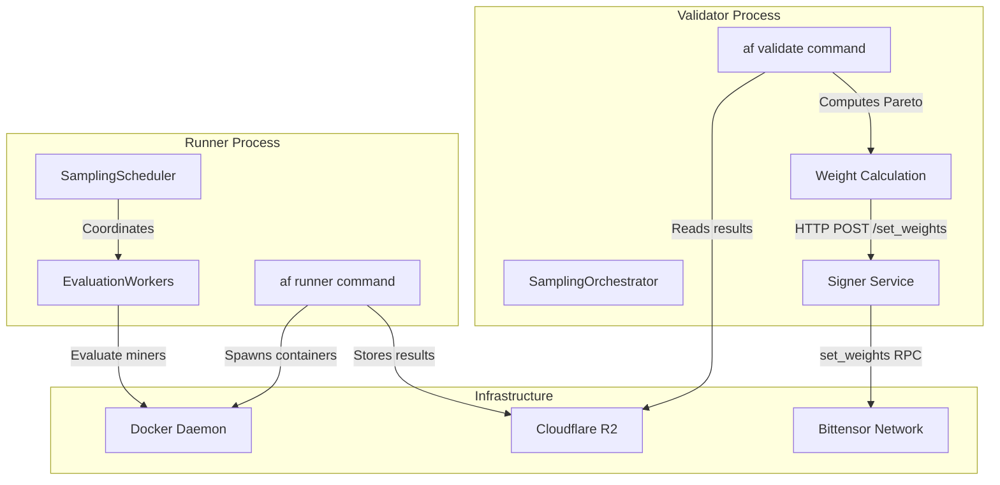

Validators consist of two main processes:
- **Runner**: Continuous sampling and evaluation via `SamplingScheduler`
- **Validator**: Weight calculation and blockchain submission via `SamplingOrchestrator`

**Source:** [README.md:39-74]()

---

### Local Development Validator

For development and testing without Docker:

```bash
# Start validator with debug logging
af -vv validate
```

The `-vv` flag enables verbose logging (defined in [affine/setup.py]()). The `validate` command:

1. **Loads configuration** from `.env` file
2. **Initializes SamplingOrchestrator** to process results
3. **Calculates Pareto dominance weights** across all miners
4. **Communicates with signer service** at `http://localhost:8080` (or `http://affine-signer:8080` in Docker)
5. **Sets weights on blockchain** every epoch (100 blocks)

The validator requires:
- `CHUTES_API_KEY`: For querying miner information
- `R2_WRITE_ACCESS_KEY_ID` and `R2_WRITE_SECRET_ACCESS_KEY`: For storing results
- Bittensor wallet configured via `BT_WALLET_COLD` and `BT_WALLET_HOT`

**Source:** [README.md:70-74](), [.env.example:1-99]()

---

### Production Docker Validator

The recommended production setup uses `docker-compose` with automatic updates:

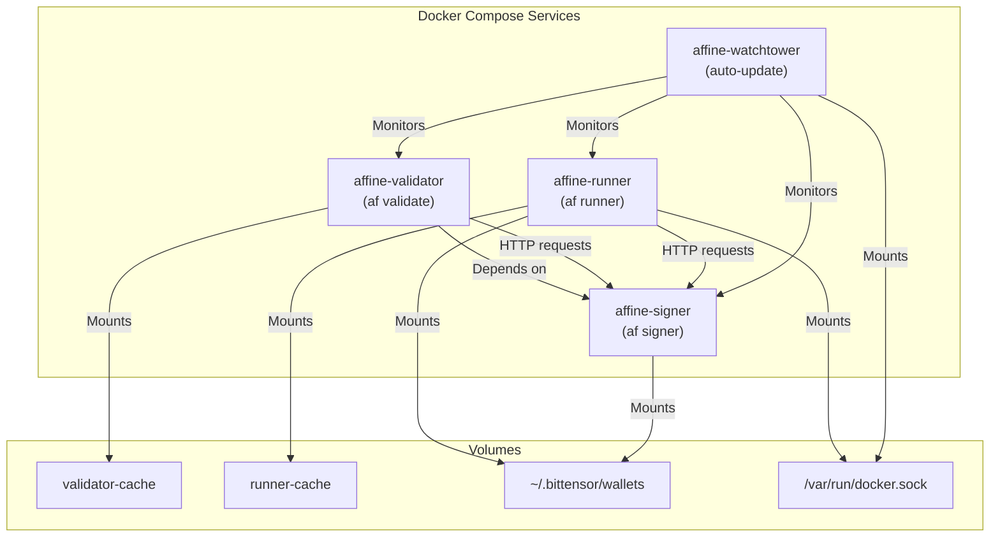

**Production Deployment Commands:**

```bash
# Copy and configure environment variables
cp .env.example .env
# Edit .env with your credentials

# Start with watchtower auto-update
docker-compose down && docker-compose pull && docker-compose up -d

# View logs
docker-compose logs -f

# Recreate on OOM or errors
docker compose up -d --force-recreate
```

The Docker setup defined in [Dockerfile:1-30]() includes:
- Rust base image for Bittensor dependencies
- Python 3 + uv for dependency management
- Docker daemon access for spawning environment containers
- SSH client for remote host deployment (via `AFFINETES_HOSTS`)

**Memory Allocation:**

<Table>

| Service | Reserved | Limit | Purpose |
|---------|----------|-------|---------|
| validator | 6GB | 8GB | Weight calculation and data processing |
| runner | 6GB | 8GB | Sampling scheduler and worker coordination |
| signer | 1GB | 2GB | Blockchain transaction signing |

</Table>


**Source:** [README.md:54-68](), [Dockerfile:1-30]()

---

### Local Development with Docker

For local development while testing Docker integration:

```bash
# Build local image and start services
docker compose -f docker-compose.yml -f docker-compose.local.yml down --remove-orphans
docker compose -f docker-compose.yml -f docker-compose.local.yml up -d --build --remove-orphans

# Follow logs
docker compose -f docker-compose.yml -f docker-compose.local.yml logs -f
```

The `docker-compose.local.yml` override file enables:
- Local image building from source
- Development bind mounts
- Modified entrypoints for debugging

**Source:** [README.md:63-68]()

---

### Running with Monitoring

Enable the scheduler monitoring API for real-time metrics:

```bash
# Start runner with monitoring on port 8765
af runner --enable-monitoring
```

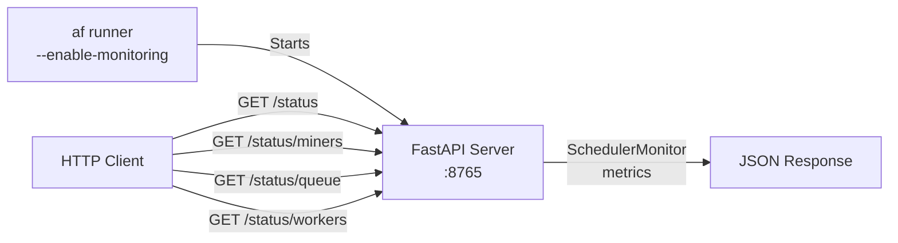

**Monitoring Endpoints:**

<Table>

| Endpoint | Purpose | Key Metrics |
|----------|---------|-------------|
| `GET /status` | Overall status | Uptime, total evaluations, active miners |
| `GET /status/miners` | Per-miner stats | Samples, recent scores, queue depth |
| `GET /status/queue` | Queue state | Pending tasks per environment |
| `GET /status/workers` | Worker pool | Active workers, concurrency utilization |

</Table>


The monitoring system is implemented via `SchedulerMonitor` class and detailed in the [Sampling Scheduler Guide](docs/SAMPLING_SCHEDULER.md).

**Source:** [README.md:156-162]()

---

### R2 Weights Mode

Validators can download pre-computed weights instead of computing locally:

```bash
# Set in .env
USE_R2_WEIGHTS="true"

# Start validator
af validate
```

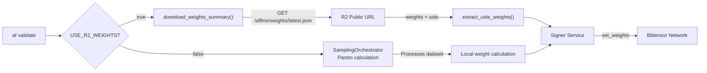

R2 weights mode:
- Downloads from: `https://pub-bf429ea7a5694b99adaf3d444cbbe64d.r2.dev/affine/weights/latest.json`
- Implemented in [affine/validate_from_r2.py:1-132]()
- Functions: `download_weights_summary()`, `extract_uids_weights()`, `get_weights_from_r2()`
- Useful for validators with limited compute resources
- Always uses official Affine R2 bucket

**Source:** [affine/validate_from_r2.py:1-132](), [.env.example:91-99]()

---

## Miner Deployment Workflow

Miners train models and deploy them to Chutes for evaluation by validators. The workflow consists of three phases: model development, deployment, and blockchain commitment.

### Complete Miner Workflow

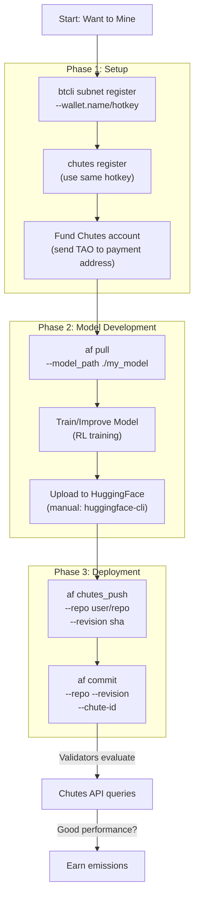

**Source:** [README.md:76-138](), [FAQ.md:9-22]()

---

### Phase 1: Initial Setup

Before deploying models, miners must complete one-time setup:

**1. Register on Affine Subnet (SN120)**

```bash
btcli subnet register --wallet.name <your_coldkey> --wallet.hotkey <your_hotkey>
```

This registers your hotkey on subnet 120 and assigns you a UID.

**2. Register on Chutes**

```bash
chutes register
```

**Important**: Use the **same hotkey** for Chutes registration to avoid developer deposits. The registration process:
- Creates `~/.chutes/config.ini` with your configuration
- Generates a payment address for funding
- Links your Chutes account to your Bittensor hotkey

**3. Fund Your Chutes Account**

```bash
# Find your payment address in ~/.chutes/config.ini
# Send TAO to this address before deploying
```

Chutes charges for GPU compute time based on:
- GPU type (e.g., A100, H100)
- Uptime duration
- Request load

**Source:** [README.md:78-94](), [FAQ.md:18-22]()

---

### Phase 2: Model Development

#### Pulling an Existing Model

```bash
af -vvv pull <uid> --model_path ./my_model
```

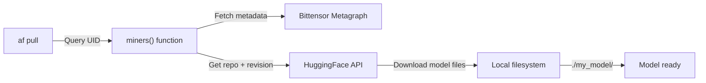

The `pull` command:
1. Queries the miner's on-chain commitment for repo and revision
2. Downloads model files from HuggingFace using `HF_TOKEN`
3. Saves to specified `--model_path`

This is useful for:
- Bootstrapping from current frontier models
- Analyzing competitor approaches
- Fine-tuning existing solutions

**Training Process**

```bash
# The actual training is not provided by Affine
... magic RL stuff ...
```

Miners are responsible for their own training pipelines. The subnet is environment-agnostic regarding training methods. Successful approaches include:
- Reinforcement learning (PPO, DPO)
- Supervised fine-tuning on generated trajectories
- Self-play and curriculum learning
- Multi-environment transfer learning

See [Model Development](#4.2) for training guidelines.

**Source:** [README.md:102-109]()

---

### Phase 3: Deployment to Chutes

#### Uploading to HuggingFace

```bash
# Manual upload process (not automated by Affine)
huggingface-cli login
huggingface-cli upload <user>/<repo> ./my_model --revision <sha>
```

Before deploying to Chutes, the model must be on HuggingFace:
1. Create or choose a repository (e.g., `myuser/Affine-Model`)
2. Push model files (`.safetensors`, `tokenizer.json`, etc.)
3. Note the exact commit SHA you want to deploy

**Important**: You must specify the commit SHA when deploying, not just "main" or a branch name.

**Source:** [README.md:111-115]()

---

#### Deploying to Chutes

```bash
af -vvv chutes_push \
    --repo myuser/Affine-Model \
    --revision a1b2c3d4e5f6... \
    --chutes-api-key $CHUTES_API_KEY
```

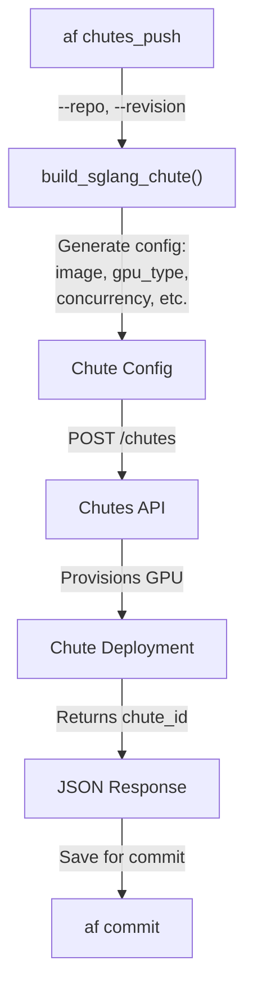

The `chutes_push` command output includes:
```json
{
  "chute_id": "cht_abc123def456",
  "status": "deploying",
  "endpoint": "https://cht-abc123def456.chutes.ai"
}
```

**Configuring Deployment Settings**

The deployment configuration can be customized by editing [affine/cli.py]() in the `deploy_to_chutes()` function:

```python
# Example configuration parameters
chute = build_sglang_chute(
    image="chutes/sglang:2024120100",  # SGLang version
    gpu_type="A100_80GB",               # GPU type
    concurrency=16,                     # Max parallel requests
    max_scale=3,                        # Max replicas
    shutdown_after_seconds=1800,        # Keep warm duration
    # ... other parameters
)
```

Refer to [chutesai/chutes](https://github.com/chutesai/chutes) documentation for all available options.

**Source:** [README.md:117-130](), [FAQ.md:60-68]()

---

#### Committing to Blockchain

```bash
af -vvv commit \
    --repo myuser/Affine-Model \
    --revision a1b2c3d4e5f6... \
    --chute-id cht_abc123def456 \
    --coldkey my_coldkey \
    --hotkey my_hotkey
```

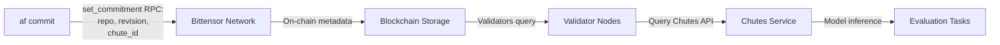

The `commit` command:
1. Creates blockchain commitment with model metadata
2. Validators discover the commitment in next refresh cycle
3. Validators query Chutes API to verify deployment status
4. If active, validators begin sending evaluation tasks
5. Performance determines weight allocation (Pareto dominance)

**Commitment Metadata Structure:**

<Table>

| Field | Source | Purpose |
|-------|--------|---------|
| `repo` | HuggingFace | Model repository identifier |
| `revision` | HuggingFace commit | Exact model version SHA |
| `chute_id` | Chutes deployment | Inference endpoint identifier |
| `block` | Blockchain | First commitment timestamp |

</Table>


The commitment creates a cryptographic link between:
- Your Bittensor UID (identity)
- Your HuggingFace model (intellectual property)
- Your Chutes deployment (evaluation endpoint)
- The commitment block (first-commit advantage for tie-breaking)

**Source:** [README.md:135-137](), [FAQ.md:38-46]()

---

### Common Miner Issues and Solutions

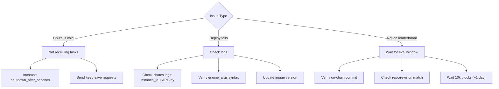

**Chute Cold State:**
- Chutes auto-shutdown after inactivity (default: 5-10 minutes)
- Validators only sample "hot" (active) miners
- **Solution**: Increase `shutdown_after_seconds` in Chute config or implement keep-alive script

**Deployment Failures:**
- Most common cause: configuration errors
- **Solution**: Check Chutes logs using instance ID and API key (see pinned Discord message)
- Common errors:
  - Invalid `engine_args` syntax
  - Outdated Docker image version
  - Corrupted model files on HuggingFace

**Missing from Leaderboard:**
- Evaluations use large block windows (10,000+ blocks)
- Takes 1+ day for new models to accumulate sufficient samples
- **Solution**: Verify on-chain commitment matches deployed revision, then wait

**Source:** [FAQ.md:60-82]()

---

## Summary: Quick Command Reference

### SDK Evaluation
```bash
# Run example script
python examples/sdk.py

# Evaluate specific miner
python examples/sdk.py  # Edit UID in file

# Use evaluation script
./scripts/evaluate_local_model.py --env ABD --uid 7 --samples 10
```

### Validator Operations
```bash
# Local development
af -vv validate

# Docker production
docker-compose up -d
docker-compose logs -f

# With monitoring
af runner --enable-monitoring
```

### Miner Workflow
```bash
# Setup (one-time)
btcli subnet register --wallet.name <cold> --wallet.hotkey <hot>
chutes register
# Fund Chutes account with TAO

# Deployment cycle
af pull <uid> --model_path ./model
# ... train model ...
# ... upload to HuggingFace ...
af chutes_push --repo <user/repo> --revision <sha>
af commit --repo <user/repo> --revision <sha> --chute-id <id> --coldkey <cold> --hotkey <hot>
```

**Sources:** [README.md:1-223](), [examples/sdk.py:1-52](), [scripts/evaluate_local_model.py:1-451](), [.env.example:1-99](), [FAQ.md:1-100]()
