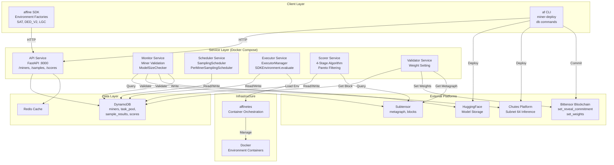
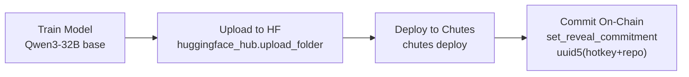
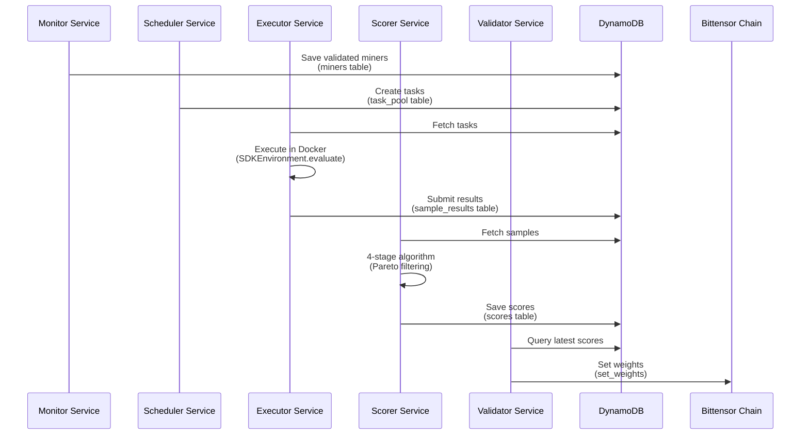
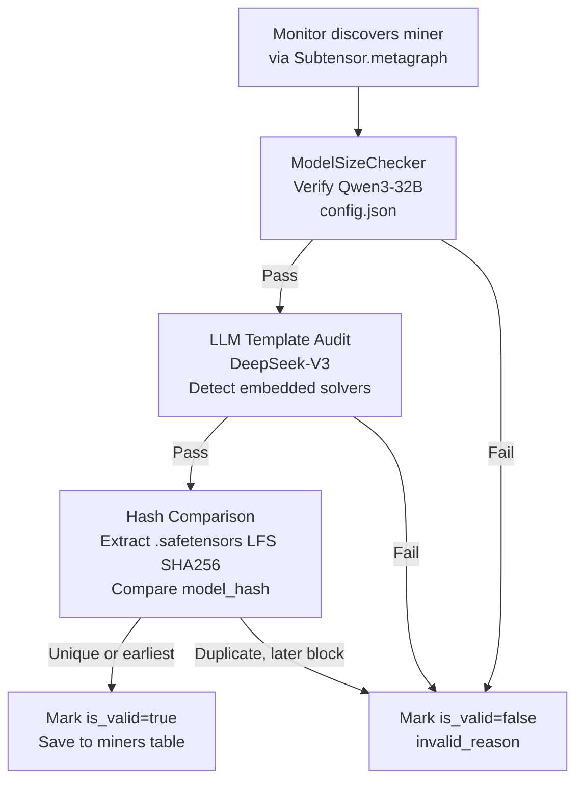
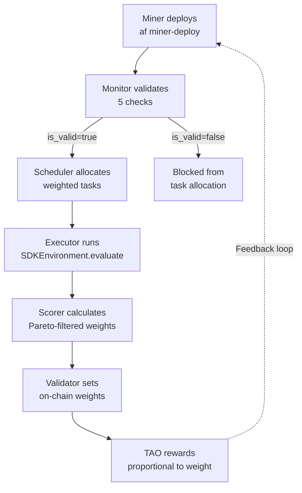

import CollapsibleAside from '../../../components/CollapsibleAside.astro';
import SourceLink from '../../../components/SourceLink.astro';
import Table from '../../../components/Table.astro';

<CollapsibleAside title="Relevant Source Files">
  <SourceLink text=".env.example" href="https://github.com/AffineFoundation/affine-cortex/blob/main/.env.example" />
  <SourceLink text="README.md" href="https://github.com/AffineFoundation/affine-cortex/blob/main/README.md" />
  <SourceLink text="affine/__init__.py" href="https://github.com/AffineFoundation/affine-cortex/blob/main/affine/__init__.py" />
  <SourceLink text="docker-compose.local.yml" href="https://github.com/AffineFoundation/affine-cortex/blob/main/docker-compose.local.yml" />
  <SourceLink text="docker-compose.yml" href="https://github.com/AffineFoundation/affine-cortex/blob/main/docker-compose.yml" />
  <SourceLink text="pyproject.toml" href="https://github.com/AffineFoundation/affine-cortex/blob/main/pyproject.toml" />
  <SourceLink text="tests/test_private_repo_workflow.py" href="https://github.com/AffineFoundation/affine-cortex/blob/main/tests/test_private_repo_workflow.py" />
  <SourceLink text="uv.lock" href="https://github.com/AffineFoundation/affine-cortex/blob/main/uv.lock" />
</CollapsibleAside>

## Purpose and Scope

This wiki documents **Affine Cortex**, an incentivized reinforcement learning (RL) environment operating on Bittensor Subnet 64. Affine Cortex enables decentralized model evaluation and improvement through economic incentives, where miners submit models and validators evaluate them across multiple RL environments using a Pareto dominance-based scoring mechanism.

This page provides a high-level overview of the system architecture, core concepts, and key workflows. For specific operational guides:
- **Miners**: See [For Miners](/subnets/for-miners#4) for deployment workflows and model requirements
- **Validators**: See [For Validators](/subnets/for-validators#5) for running validator infrastructure
- **Developers**: See [SDK Reference](/subnets/sdk-reference#6) for programmatic model evaluation

**Sources:** [README.md:1-95](), [affine/__init__.py:1-60]()

---

## What is Affine Cortex?

Affine Cortex is a distributed system that pays miners in TAO (Bittensor's native token) for submitting models that dominate the **Pareto frontier**—models that outperform all other models across all evaluation environments simultaneously. The mechanism is designed to be:

- **Sybil-proof**: Miners cannot game rewards through multiple identities
- **Copy-proof**: Anti-plagiarism detection via model hash comparison and Pareto filtering
- **Overfitting-proof**: Task rotation and rate limiting prevent memorization attacks
- **Decoy-proof**: Template safety audits detect benchmark-specific solvers

The system coordinates three participant types:

<Table>

| Role | Function | Blockchain Interaction |
|------|----------|----------------------|
| **Miners** | Submit fine-tuned models to HuggingFace and Chutes | Commit model metadata on-chain via `set_reveal_commitment` |
| **Validators** | Run evaluation infrastructure, score models, set weights | Set weights on-chain via `set_weights` extrinsic |
| **Evaluators** | Use SDK to evaluate miners or custom models | Read-only access via REST API |

</Table>


**Sources:** [README.md:7-17](), [pyproject.toml:1-53]()

---

## System Architecture



**Architecture Description:**

The system operates in four layers:

1. **Client Layer**: Python SDK (`affine` package) and CLI (`af` command) for programmatic and command-line access
2. **Service Layer**: Six independent microservices coordinating through a REST API gateway
3. **Data Layer**: DynamoDB for persistent storage, Redis for caching
4. **Infrastructure Layer**: `affinetes` for containerized environment execution (Docker or Basilica K8s)

External dependencies include HuggingFace for model storage, Chutes (Subnet 64) for load-balanced inference, and Bittensor blockchain for coordination and incentive distribution.

**Sources:** [docker-compose.yml:1-26](), [affine/__init__.py:36-59](), [pyproject.toml:30-36]()

---

## Core Components

### Miners and Model Deployment

Miners fine-tune models (required architecture: Qwen3-32B) and deploy them through a multi-step workflow:



The **private repo workflow** (`--private-repo` flag in [.env.example:47-62]()) prevents model copying before blockchain commit:
1. Create private HuggingFace repo via `HfApi.create_repo(private=True)`
2. Upload model to private repo
3. Store `HF_TOKEN` as Chutes secret for private repo access
4. Deploy to Chutes
5. Commit to blockchain
6. Make repo public via `update_repo_settings(private=False)`

**Sources:** [.env.example:1-62](), [tests/test_private_repo_workflow.py:1-270]()

### Evaluation Environments

The system evaluates models across 12+ RL environments managed by `SDKEnvironment` class:

<Table>

| Environment | Factory Function | Purpose |
|-------------|-----------------|---------|
| SAT | `affine.SAT()` | SAT solving |
| DED_V2 | `affine.DED_V2()` | Deductive reasoning |
| ABD_V2 | `affine.ABD_V2()` | Abductive reasoning |
| CDE | `affine.CDE()` | Code editing |
| LGC | `affine.LGC()` | Logic puzzles |
| GAME | `affine.GAME()` | Game playing |
| SWEPRO | `affine.SWEPRO()` | Software engineering |

</Table>


Environments are lazy-loaded into `_ENV_CACHE` singleton and execute in isolated Docker containers via `affinetes.load_env()`.

**Sources:** [affine/__init__.py:36-52]()

### Service Coordination



Services communicate asynchronously through database tables with distinct lifecycles:
- **task_pool**: Transient (TTL varies by retry count)
- **sample_results**: 30-day TTL with compression
- **execution_logs**: 7-day TTL
- **scores**: Persistent

**Sources:** [docker-compose.yml:3-26]()

---

## Anti-Plagiarism Mechanisms

Affine implements multi-layered plagiarism detection:

### 1. Registration Validation (Monitor Service)



**Key Validations:**
- **Architecture enforcement**: `ModelSizeChecker` inspects `config.json` for exact Qwen3-32B parameters (num_hidden_layers, hidden_size)
- **Template safety**: LLM audits `chat_template` in `tokenizer_config.json` for benchmark-specific solvers
- **Hash-based detection**: Computes `model_hash` from sorted concatenation of `.safetensors` LFS SHA256 hashes, prioritizes by `first_block`

**Sources:** [README.md:9-13]()

### 2. Pareto Dominance Filtering (Scorer Service)

The Scorer implements a four-stage algorithm where **Stage 2: Pareto Filtering** catches plagiarized models:

1. Group miners by environment subsets (L1: singles, L2: pairs, ..., L6: all envs)
2. Within each subset, compare miner pairs sorted by `first_block` (temporal priority)
3. Later miner is filtered only if it beats earlier miner in **ALL** environments within the subset above statistically-derived thresholds
4. Threshold = `earlier_avg_score + z_score × SE`, bounded by `MIN_IMPROVEMENT`/`MAX_IMPROVEMENT`

This strict "all environments" rule prevents filtering based on partial improvements, only catching clear plagiarism or genuine superiority.

**Sources:** [README.md:13-14]()

---

## Key Technologies

<Table>

| Technology | Role | Configuration |
|------------|------|---------------|
| **Bittensor** | Blockchain coordination, TAO rewards | `SUBTENSOR_ENDPOINT`, `BT_WALLET_COLD`, `BT_WALLET_HOT` |
| **HuggingFace** | Model storage and versioning | `HF_TOKEN` (read/write scopes) |
| **Chutes** | Subnet 64 load-balanced inference | `CHUTES_API_KEY`, `CHUTE_USER` |
| **Affinetes** | Container orchestration (Docker/K8s) | Git dependency in [pyproject.toml:30]() |
| **DynamoDB** | Distributed NoSQL database | 8 tables with TTL policies |
| **FastAPI** | REST API gateway on port 8000 | Timestamp-based signature auth |
| **Docker Compose** | Service orchestration | [docker-compose.yml:1-26]() |

</Table>


**Sources:** [pyproject.toml:6-37](), [.env.example:1-62]()

---

## Data Flow: Miner Lifecycle



**Lifecycle Stages:**

1. **Deployment**: Miner runs `af miner-deploy --private-repo` to upload model, deploy to Chutes, and commit on-chain
2. **Validation**: Monitor service discovers via `metagraph`, validates architecture/template/hash, sets `is_valid` flag
3. **Allocation**: Scheduler allocates tasks using weighted distribution (3-10 slots per miner based on performance)
4. **Execution**: Executor workers fetch tasks, evaluate in Docker containers, submit results
5. **Scoring**: Scorer aggregates results, applies Pareto filtering, normalizes weights
6. **Incentivization**: Validator sets weights on-chain, TAO rewards distributed proportionally

**Sources:** [README.md:11-14]()

---

## Client SDK Usage

The `affine` package provides a Python SDK for programmatic model evaluation:

```python
import affine

# List available environments
envs = affine.tasks.list_available_environments()

# Create environment instance
env = affine.DED_V2()

# Evaluate a miner by UID
result = await env.evaluate_miner(uid=42, task_id=100)

# Evaluate a custom model
result = await env.evaluate_model(
    model="deepseek-ai/DeepSeek-V3",
    base_url="https://api.chutes.ai/v1",
    task_id=100
)

# Query miner information
miner_list = affine.miners()  # Lazy-loaded to avoid CLI conflicts
```

Key SDK components:
- **Environment factories**: [affine/__init__.py:38-52]() expose 12+ environments
- **Lazy imports**: `affine.miners()` function wrapper prevents Bittensor CLI interference
- **Evaluation modes**: Target miners by UID or custom models by `base_url`

**Sources:** [affine/__init__.py:1-60](), [README.md:72-88]()

---

## Getting Started

**For Miners:**
- Review model requirements: [For Miners](/subnets/for-miners#4)
- Follow deployment workflow: [Deployment Workflow](/subnets/for-miners/deployment-workflow#4.3)
- Use CLI commands: [Miner CLI Reference](/subnets/for-miners/miner-cli-reference#4.4)

**For Validators:**
- Set up infrastructure: [Running a Validator](/subnets/for-validators/running-a-validator#5.2)
- Understand scoring: [Weight Calculation System](/subnets/for-validators/weight-calculation-system#5.4)
- Monitor operations: [Monitoring & Observability](/subnets/for-validators/monitoring-observability#5.5)

**For Developers:**
- Install SDK: [SDK Overview & Setup](/subnets/sdk-reference/sdk-overview-setup#6.1)
- Evaluate models: [Environment Evaluation](/subnets/sdk-reference/environment-evaluation#6.2)
- Query network data: [Data Access & History](/subnets/sdk-reference/data-access-history#6.4)

**For System Administrators:**
- Deploy services: [Docker Deployment](/subnets/deployment-guide/docker-deployment#10.1)
- Scale resources: [Resource Requirements & Scaling](/subnets/deployment-guide/resource-requirements-scaling#10.3)
- Manage database: [Database Commands](/subnets/cli-reference/database-commands#9.4)

**Sources:** [README.md:44-88]()
