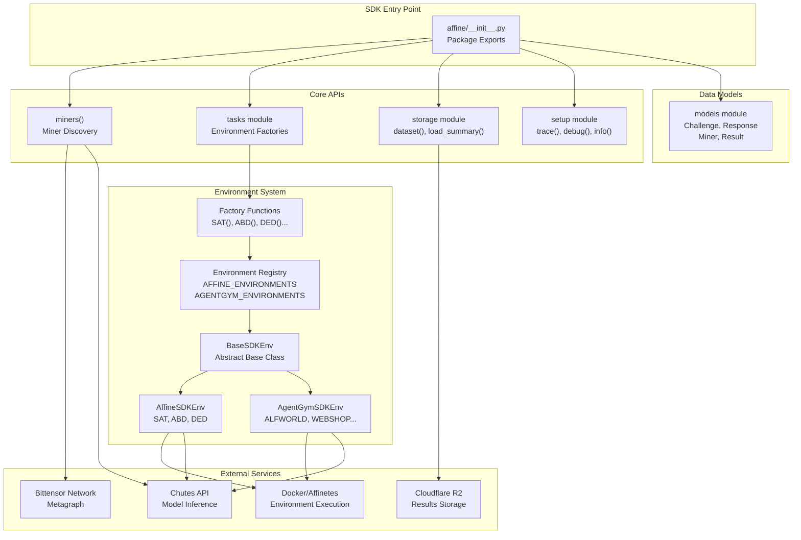
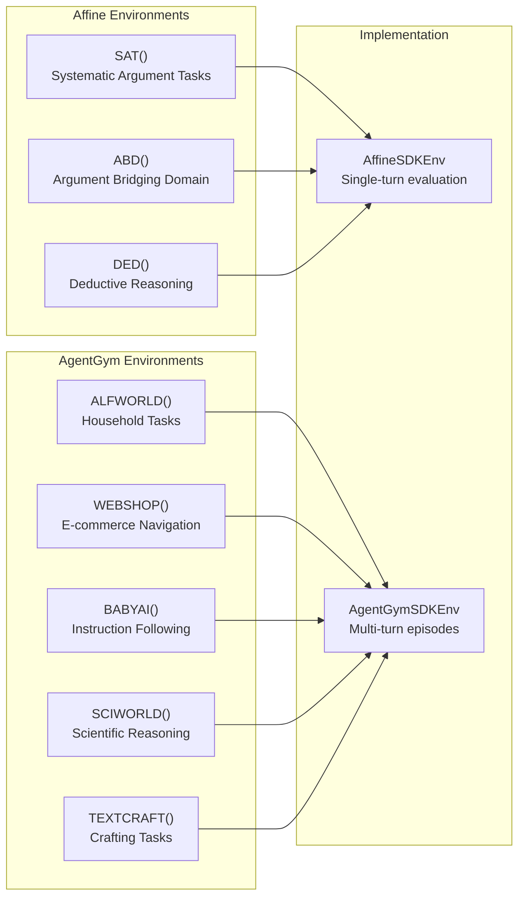
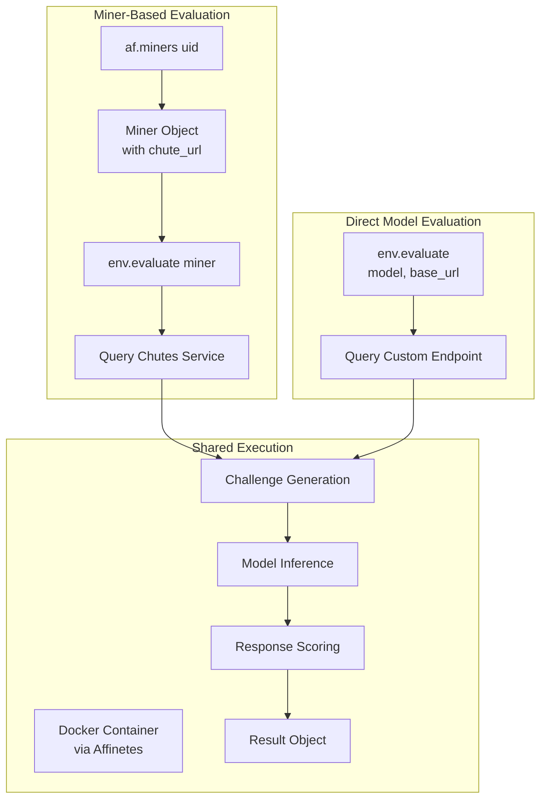

import CollapsibleAside from '../../../components/CollapsibleAside.astro';
import SourceLink from '../../../components/SourceLink.astro';
import Table from '../../../components/Table.astro';

<CollapsibleAside title="Relevant Source Files">
  <SourceLink text=".env.example" href="https://github.com/AffineFoundation/affine-cortex/blob/main/.env.example" />
  <SourceLink text="README.md" href="https://github.com/AffineFoundation/affine-cortex/blob/main/README.md" />
  <SourceLink text="affine/__init__.py" href="https://github.com/AffineFoundation/affine-cortex/blob/main/affine/__init__.py" />
  <SourceLink text="tests/test_private_repo_workflow.py" href="https://github.com/AffineFoundation/affine-cortex/blob/main/tests/test_private_repo_workflow.py" />
</CollapsibleAside>

This section documents the Affine Python SDK, which provides programmatic access to the Affine evaluation platform. The SDK allows developers to evaluate language models against the same environments that validators use, query miner metadata, and access historical evaluation data.

For CLI usage, see [CLI Reference](/subnets/cli-reference#9). For validator-specific operations, see [For Validators](/subnets/for-validators#5). For environment details, see [Evaluation Environments](/subnets/evaluation-environments#7).

---

## Purpose and Scope

The Affine SDK enables external developers, researchers, and miners to:

- **Evaluate models** against 8 production environments (3 Affine + 5 AgentGym)
- **Query miner metadata** from the Bittensor network and Chutes deployment status
- **Access historical results** from R2 storage for analysis and benchmarking
- **Discover available environments** and their configurations programmatically

The SDK is designed for synchronous or asynchronous use in Python applications, notebooks, and scripts. It shares the same evaluation infrastructure as validators, ensuring consistent results.

---

## SDK Architecture

The SDK is structured around four primary subsystems:



**Key Design Principles:**

- **Factory Pattern**: Environment creation uses factory functions (e.g., `af.SAT()`) that return configured instances
- **Dual Evaluation Modes**: Supports both miner-based evaluation (via UID) and direct model evaluation (via model + base_url)
- **Async-First**: All I/O operations use `async`/`await` for efficient concurrent execution
- **Shared Infrastructure**: SDK uses the same Docker containers, API clients, and evaluation logic as validators

Sources: <SourceLink text="affine/__init__.py:1-62" href="https://github.com/AffineFoundation/affine-cortex/blob/main/affine/__init__.py#L1-L62" />, <SourceLink text="README.md:164-222" href="https://github.com/AffineFoundation/affine-cortex/blob/main/README.md#L164-L222" />

---

## Main SDK Components

### Package Exports

The `affine` package exports the following public API:

<Table>

| Category | Symbol | Purpose |
|----------|--------|---------|
| **Logging** | `trace()`, `debug()`, `info()` | Configure logging verbosity |
| **Data Models** | `Challenge`, `Response`, `Miner`, `Result` | Core data structures |
| **Miner Discovery** | `miners(uid)` | Query miner metadata and deployment info |
| **Environments** | `SAT()`, `ABD()`, `DED()`, `ALFWORLD()`, etc. | Factory functions for 8 environments |
| **Storage** | `dataset()`, `load_summary()`, `sink()`, `prune()` | Access historical evaluation data |
| **Configuration** | `singleton`, `get_conf()` | Access global configuration |

</Table>


Sources: <SourceLink text="affine/__init__.py:1-62" href="https://github.com/AffineFoundation/affine-cortex/blob/main/affine/__init__.py#L1-L62" />

### Environment Factories

Eight environment factory functions are exported at the top level:



**Usage Pattern:**
```python
import affine as af

# Create environment instance
env = af.SAT()

# Evaluate using miner UID
result = await env.evaluate(miner)

# Or evaluate using direct model endpoint
result = await env.evaluate(
    model="deepseek-ai/DeepSeek-V3",
    base_url="https://llm.chutes.ai/v1"
)
```

Sources: <SourceLink text="affine/__init__.py:50-61" href="https://github.com/AffineFoundation/affine-cortex/blob/main/affine/__init__.py#L50-L61" />, <SourceLink text="examples/sdk.py:1-52" href="https://github.com/AffineFoundation/affine-cortex/blob/main/examples/sdk.py#L1-L52" />

### Data Access Functions

The SDK provides access to historical evaluation data stored in R2:

<Table>

| Function | Purpose | Return Type |
|----------|---------|-------------|
| `dataset(n_blocks)` | Async iterator over recent evaluation results | `AsyncIterator[Result]` |
| `load_summary(block)` | Load weight summary for a specific block | `dict` |
| `save_summary(block, data)` | Save weight summary (validator-only) | `None` |
| `sink(results)` | Upload evaluation results to R2 (validator-only) | `None` |
| `prune()` | Clean up old local cache files | `None` |

</Table>


**Example:**
```python
import affine as af

# Iterate over last 100 blocks of results
async for result in af.dataset(100):
    print(f"UID {result.uid}: {result.score}")

# Load latest weight summary
summary = await af.load_summary(block=None)  # None = latest
print(summary['data']['miners'])
```

Sources: <SourceLink text="affine/__init__.py:39-44" href="https://github.com/AffineFoundation/affine-cortex/blob/main/affine/__init__.py#L39-L44" />, <SourceLink text="README.md:217-218" href="https://github.com/AffineFoundation/affine-cortex/blob/main/README.md#L217-L218" />

---

## Installation and Configuration

### Installation

```bash
# Clone repository
git clone https://github.com/AffineFoundation/affine.git
cd affine

# Install using uv (recommended)
curl -LsSf https://astral.sh/uv/install.sh | sh
uv venv && source .venv/bin/activate
uv pip install -e .

# Or using pip
pip install -e .
```

Sources: <SourceLink text="README.md:16-27" href="https://github.com/AffineFoundation/affine-cortex/blob/main/README.md#L16-L27" />, <SourceLink text="Dockerfile:11-27" href="https://github.com/AffineFoundation/affine-cortex/blob/main/Dockerfile#L11-L27" />

### Required Environment Variables

The SDK requires specific environment variables depending on usage:

<Table>

| Variable | Required For | Purpose |
|----------|-------------|---------|
| `CHUTES_API_KEY` | Miner evaluation | Authenticate with Chutes inference service |
| `HF_TOKEN` | Miner discovery | Access Hugging Face API for model metadata |
| `HF_USER` | Miner discovery | Your Hugging Face username |

</Table>


**Setup:**
```bash
# Copy example configuration
cp .env.example .env

# Edit .env with your credentials
CHUTES_API_KEY=cpk_xxxx...
HF_TOKEN=hf_xxxx...
HF_USER=myusername
```

For direct model evaluation (non-Chutes), you can provide a dummy `CHUTES_API_KEY` as the Docker environments require it for initialization:

```python
import os
os.environ["CHUTES_API_KEY"] = "fake-test-key-for-local-testing"
```

Sources: <SourceLink text=".env.example:1-36" href="https://github.com/AffineFoundation/affine-cortex/blob/main/.env.example#L1-L36" />, <SourceLink text="README.md:40-52" href="https://github.com/AffineFoundation/affine-cortex/blob/main/README.md#L40-L52" />, <SourceLink text="scripts/evaluate_local_model.py:286-295" href="https://github.com/AffineFoundation/affine-cortex/blob/main/scripts/evaluate_local_model.py#L286-L295" />

---

## Quick Start

### Basic Evaluation

```python
import asyncio
import affine as af
from dotenv import load_dotenv

# Enable debug logging (optional)
af.trace()  # or af.debug() or af.info()

# Load environment variables
load_dotenv()

async def main():
    # Query miner by UID
    miner_dict = await af.miners(160)
    miner = miner_dict.get(160)
    
    if not miner:
        print("Miner not found")
        return
    
    # Create environment
    ded_env = af.DED()
    
    # Evaluate miner
    evaluation = await ded_env.evaluate(miner)
    print(f"Score: {evaluation[160].score}")
    print(f"Success: {evaluation[160].success}")
    print(f"Latency: {evaluation[160].latency_seconds}s")

if __name__ == "__main__":
    asyncio.run(main())
```

Sources: <SourceLink text="README.md:167-188" href="https://github.com/AffineFoundation/affine-cortex/blob/main/README.md#L167-L188" />, <SourceLink text="examples/sdk.py:13-33" href="https://github.com/AffineFoundation/affine-cortex/blob/main/examples/sdk.py#L13-L33" />

### Direct Model Evaluation

```python
import asyncio
import affine as af

async def main():
    # Create environment
    abd_env = af.ABD()
    
    # Evaluate using model endpoint directly (no miner object needed)
    result = await abd_env.evaluate(
        model="deepseek-ai/DeepSeek-V3",
        base_url="https://llm.chutes.ai/v1",
        temperature=0.7
    )
    
    print(f"Score: {result.score}")
    print(f"Extra: {result.extra}")

if __name__ == "__main__":
    asyncio.run(main())
```

Sources: <SourceLink text="README.md:202-207" href="https://github.com/AffineFoundation/affine-cortex/blob/main/README.md#L202-L207" />, <SourceLink text="examples/sdk2.py:12-41" href="https://github.com/AffineFoundation/affine-cortex/blob/main/examples/sdk2.py#L12-L41" />

### Environment Discovery

```python
import affine as af

# List all available environments
envs = af.tasks.list_available_environments()

for env_type, env_names in envs.items():
    print(f"\n{env_type}:")
    for name in env_names:
        print(f"  - {name}")
```

Output:
```
affine:
  - SAT
  - ABD
  - DED

agentgym:
  - ALFWORLD
  - WEBSHOP
  - BABYAI
  - SCIWORLD
  - TEXTCRAFT
```

Sources: <SourceLink text="README.md:209-214" href="https://github.com/AffineFoundation/affine-cortex/blob/main/README.md#L209-L214" />, <SourceLink text="examples/sdk.py:42-48" href="https://github.com/AffineFoundation/affine-cortex/blob/main/examples/sdk.py#L42-L48" />

---

## Evaluation Modes

The SDK supports two distinct evaluation modes:



### Mode 1: Miner-Based Evaluation

Used when evaluating a registered miner on the Bittensor network:

```python
# Query miner metadata
miner_dict = await af.miners(7)  # UID 7
miner = miner_dict[7]

# Miner object contains:
# - miner.uid: Bittensor UID
# - miner.model: Model name (e.g., "deepseek-ai/DeepSeek-V3")
# - miner.chute_url: Chutes inference endpoint
# - miner.hotkey: Bittensor hotkey address

# Evaluate
result = await env.evaluate(miner)
# Returns: Dict[int, Result] keyed by UID
```

### Mode 2: Direct Model Evaluation

Used for testing local models or external endpoints:

```python
# Direct evaluation (no miner object needed)
result = await env.evaluate(
    model="my-model-name",
    base_url="http://localhost:8000/v1",  # OpenAI-compatible endpoint
    temperature=0.7
)
# Returns: Result object directly (not dict)
```

This mode is useful for:
- Testing models before deployment
- Evaluating models hosted on custom infrastructure
- Benchmarking against external APIs (OpenAI, Anthropic, etc.)

Sources: <SourceLink text="README.md:179-207" href="https://github.com/AffineFoundation/affine-cortex/blob/main/README.md#L179-L207" />, <SourceLink text="scripts/evaluate_local_model.py:102-218" href="https://github.com/AffineFoundation/affine-cortex/blob/main/scripts/evaluate_local_model.py#L102-L218" />

---

## API Surface Overview

### Top-Level Imports

```python
import affine as af

# Logging configuration
af.trace()              # Enable trace-level logging
af.debug()              # Enable debug-level logging  
af.info()               # Enable info-level logging (default)

# Miner discovery
miners = await af.miners(uid)          # Single UID
miners = await af.miners([1, 2, 3])    # Multiple UIDs
miners = await af.miners()             # All miners

# Environment factories (8 total)
env = af.SAT()          # Affine: Systematic Argument Tasks
env = af.ABD()          # Affine: Argument Bridging Domain
env = af.DED()          # Affine: Deductive Reasoning
env = af.ALFWORLD()     # AgentGym: Household tasks
env = af.WEBSHOP()      # AgentGym: E-commerce navigation
env = af.BABYAI()       # AgentGym: Instruction following
env = af.SCIWORLD()     # AgentGym: Scientific reasoning
env = af.TEXTCRAFT()    # AgentGym: Crafting tasks

# Data access
async for result in af.dataset(100):  # Last 100 blocks
    process(result)

summary = await af.load_summary(block=None)  # Latest weights

# Environment discovery
envs = af.tasks.list_available_environments()
```

Sources: <SourceLink text="affine/__init__.py:1-62" href="https://github.com/AffineFoundation/affine-cortex/blob/main/affine/__init__.py#L1-L62" />

### Environment Interface

All environment instances expose a consistent interface:

```python
class BaseSDKEnv:
    async def evaluate(
        self,
        miner: Optional[Miner] = None,
        model: Optional[str] = None,
        base_url: Optional[str] = None,
        temperature: float = 0.7,
        task_id: Optional[int | List[int]] = None,  # AgentGym only
        **kwargs
    ) -> Result | Dict[int, Result]:
        """
        Evaluate a model against this environment.
        
        Args:
            miner: Miner object from af.miners() (Mode 1)
            model: Model name for direct evaluation (Mode 2)
            base_url: Inference endpoint for direct evaluation (Mode 2)
            temperature: Sampling temperature
            task_id: Specific task(s) for AgentGym environments
            
        Returns:
            - Dict[int, Result] if miner provided (keyed by UID)
            - Result directly if model + base_url provided
        """
```

Sources: <SourceLink text="README.md:179-207" href="https://github.com/AffineFoundation/affine-cortex/blob/main/README.md#L179-L207" />, <SourceLink text="examples/sdk.py:29-39" href="https://github.com/AffineFoundation/affine-cortex/blob/main/examples/sdk.py#L29-L39" />

---

## Error Handling

### Common Exceptions

```python
import affine as af

async def safe_evaluation():
    try:
        # Miner not found
        miner_dict = await af.miners(999)
        if 999 not in miner_dict:
            print("Miner not registered")
            return
        
        # Evaluation failures
        env = af.DED()
        result = await env.evaluate(miner_dict)
        
        if not result[999].success:
            print(f"Evaluation failed: {result[999].error}")
            
    except KeyError:
        print("Missing API key in environment")
    except TimeoutError:
        print("Chutes service timeout")
    except Exception as e:
        print(f"Unexpected error: {e}")
```

### API Key Requirements

```python
import os
import sys

# Check for required API keys
if not os.getenv("CHUTES_API_KEY"):
    print("❌ CHUTES_API_KEY environment variable not set")
    print("   Get your key from: https://chutes.ai")
    sys.exit(1)

if not os.getenv("HF_TOKEN"):
    print("❌ HF_TOKEN environment variable not set")
    print("   Create token at: https://huggingface.co/settings/tokens")
    sys.exit(1)
```

Sources: <SourceLink text="examples/sdk.py:13-18" href="https://github.com/AffineFoundation/affine-cortex/blob/main/examples/sdk.py#L13-L18" />, <SourceLink text="scripts/evaluate_local_model.py:286-290" href="https://github.com/AffineFoundation/affine-cortex/blob/main/scripts/evaluate_local_model.py#L286-L290" />

---

## Performance Considerations

### Concurrency

The SDK is designed for concurrent evaluation across multiple miners or environments:

```python
import asyncio
import affine as af

async def evaluate_all_miners():
    # Get all miners
    miners = await af.miners()
    
    # Create environment
    env = af.SAT()
    
    # Evaluate all miners concurrently
    tasks = [env.evaluate({uid: miner}) for uid, miner in miners.items()]
    results = await asyncio.gather(*tasks, return_exceptions=True)
    
    # Process results
    for uid, result in zip(miners.keys(), results):
        if isinstance(result, Exception):
            print(f"UID {uid} failed: {result}")
        else:
            print(f"UID {uid} score: {result[uid].score}")
```

### Caching

The SDK caches certain API responses to reduce external calls:

- **Miner metadata**: Cached with TTL (gating strategy)
- **HuggingFace model info**: Cached per SHA revision
- **R2 index files**: Cached locally per block

Sources: <SourceLink text="README.md:189-218" href="https://github.com/AffineFoundation/affine-cortex/blob/main/README.md#L189-L218" />

---

## Related Documentation

- **[SDK Overview & Setup](/subnets/sdk-reference/sdk-overview-setup#6.1)**: Detailed installation and configuration
- **[Environment Evaluation](/subnets/sdk-reference/environment-evaluation#6.2)**: Deep dive into evaluation modes and environment-specific parameters
- **[Miner Discovery API](/subnets/sdk-reference/miner-discovery-api#6.3)**: Complete `miners()` function reference and filtering
- **[Data Access & History](/subnets/sdk-reference/data-access-history#6.4)**: Working with `dataset()` and historical result analysis
- **[Evaluation Environments](/subnets/evaluation-environments#7)**: Environment system architecture and individual environment specs
- **[CLI Reference](/subnets/cli-reference#9)**: Command-line tools for validators and miners

Sources: <SourceLink text="affine/__init__.py:1-62" href="https://github.com/AffineFoundation/affine-cortex/blob/main/affine/__init__.py#L1-L62" />, <SourceLink text="README.md:164-222" href="https://github.com/AffineFoundation/affine-cortex/blob/main/README.md#L164-L222" />, <SourceLink text="examples/sdk.py:1-52" href="https://github.com/AffineFoundation/affine-cortex/blob/main/examples/sdk.py#L1-L52" />, <SourceLink text="examples/sdk2.py:1-41" href="https://github.com/AffineFoundation/affine-cortex/blob/main/examples/sdk2.py#L1-L41" />, <SourceLink text="scripts/evaluate_local_model.py:1-451" href="https://github.com/AffineFoundation/affine-cortex/blob/main/scripts/evaluate_local_model.py#L1-L451" />
