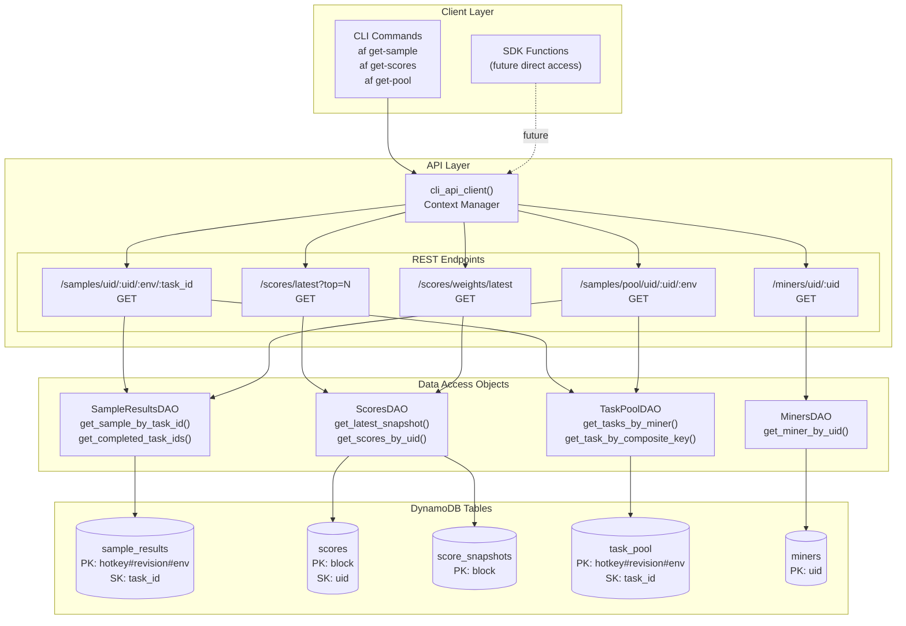
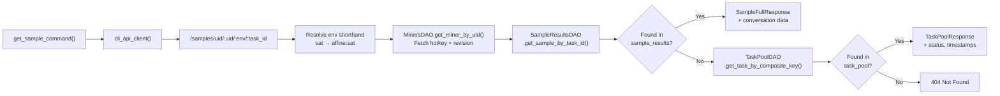
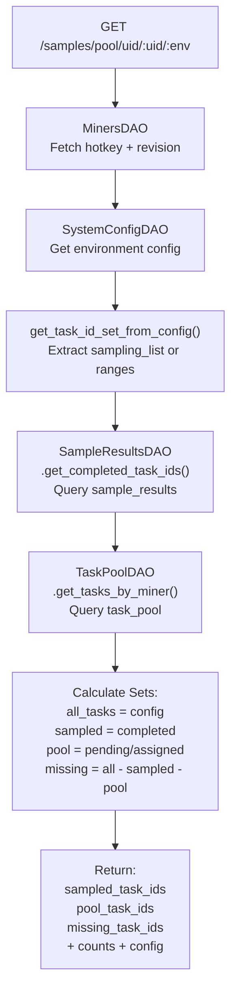
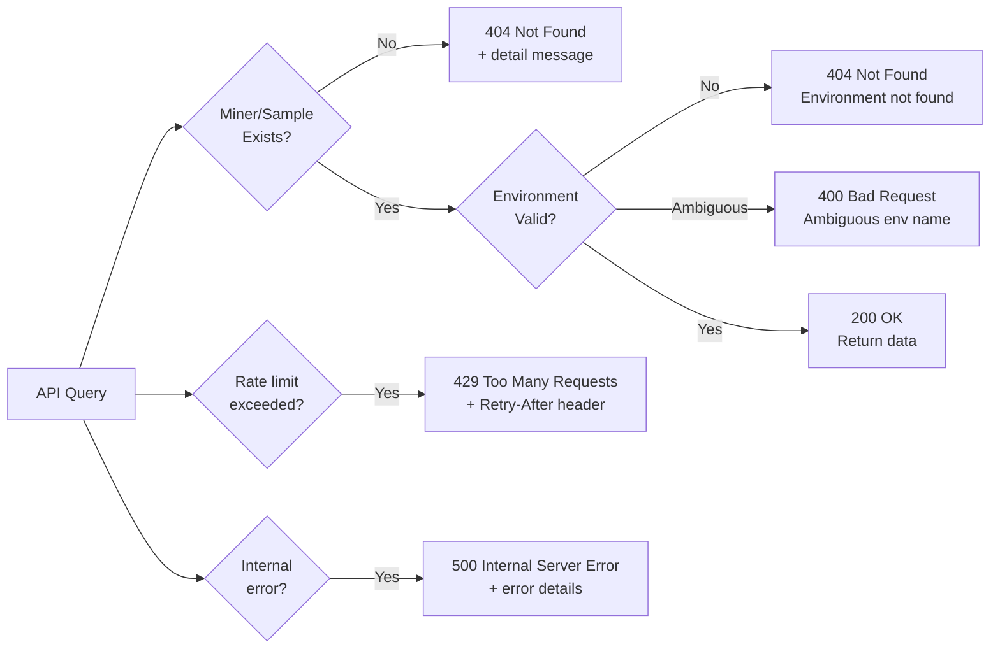

import CollapsibleAside from '../../../../components/CollapsibleAside.astro';
import SourceLink from '../../../../components/SourceLink.astro';
import Table from '../../../../components/Table.astro';

<CollapsibleAside title="Relevant Source Files">
  <SourceLink text="affine/api/routers/samples.py" href="https://github.com/AffineFoundation/affine-cortex/blob/main/affine/api/routers/samples.py" />
  <SourceLink text="affine/cli/main.py" href="https://github.com/AffineFoundation/affine-cortex/blob/main/affine/cli/main.py" />
  <SourceLink text="affine/cli/types.py" href="https://github.com/AffineFoundation/affine-cortex/blob/main/affine/cli/types.py" />
  <SourceLink text="affine/src/miner/commands.py" href="https://github.com/AffineFoundation/affine-cortex/blob/main/affine/src/miner/commands.py" />
  <SourceLink text="affine/src/miner/main.py" href="https://github.com/AffineFoundation/affine-cortex/blob/main/affine/src/miner/main.py" />
</CollapsibleAside>

This page documents querying historical execution data, scores, and task pool status via the SDK and CLI. The Affine system stores comprehensive execution history including sample results, scores, and task pool state that can be queried programmatically or via command-line tools.

For programmatic environment evaluation, see [Environment Evaluation](/subnets/sdk-reference/environment-evaluation#6.2). For querying miner metadata, see [Miner Discovery API](/subnets/sdk-reference/miner-discovery-api#6.3). For database schema details, see [Database Schema](/subnets/database-storage/database-schema#8.1).

---

## Overview

The data access system provides query interfaces to three primary data categories:

<Table>

| Data Type | Primary Table | Access Methods | Retention |
|-----------|--------------|----------------|-----------|
| Sample Results | `sample_results` | CLI, API, SDK | 30 days TTL |
| Scores & Weights | `scores`, `score_snapshots` | CLI, API | Permanent |
| Task Pool Status | `task_pool` | CLI, API | Varies by retry count |
| Execution Logs | `execution_logs` | Database direct | 7 days TTL |

</Table>


All queries route through the API service with rate limiting and authentication. The CLI provides convenience commands wrapping API calls with formatted output.

**Sources:** [affine/cli/main.py:194-343](), [affine/src/miner/commands.py:465-655](), [affine/api/routers/samples.py:1-344]()

---

## Data Access Architecture



**Sources:** [affine/src/miner/commands.py:465-655](), [affine/api/routers/samples.py:30-343](), [affine/utils/api_client.py]()

---

## Sample Results Access

### Query by UID, Environment, and Task ID

Sample results contain completed task executions including conversation history, scores, and latency metrics. Queries require three natural key components.

**CLI Command:**

```bash
af get-sample <uid> <env> <task_id>
```

**Parameters:**

<Table>

| Parameter | Type | Description | Example |
|-----------|------|-------------|---------|
| `uid` | int | Miner UID (supports `n` prefix for negative) | `42`, `n1` (for -1) |
| `env` | str | Environment name (full or shorthand) | `affine:sat`, `sat` |
| `task_id` | str | Task identifier | `task_123` |

</Table>


**Implementation Flow:**



**Response Structure:**

```json
{
  "hotkey": "5F3sa...",
  "model_revision": "abc123...",
  "env": "affine:sat",
  "task_id": "task_123",
  "score": 0.85,
  "latency": 12.5,
  "conversation": [...],
  "extra": {
    "metadata": "..."
  }
}
```

**Sources:** [affine/src/miner/commands.py:465-484](), [affine/api/routers/samples.py:92-188](), [affine/cli/main.py:194-205]()

### Environment Name Resolution

The API supports both full environment names and shorthands:

<Table>

| Shorthand | Full Name | Resolution Logic |
|-----------|-----------|------------------|
| `sat` | `affine:sat` | Suffix match |
| `webshop` | `agentgym:webshop` | Suffix match |
| `alfworld` | `agentgym:alfworld` | Suffix match |
| `affine:sat` | `affine:sat` | Direct match |

</Table>


Ambiguous shorthands (matching multiple environments) return `400 Bad Request` with matching candidates.

**Sources:** [affine/api/routers/samples.py:115-138]()

---

## Score & Weight Queries

### Latest Scores Query

Retrieves top N miners by score from the most recent scoring calculation.

**CLI Command:**

```bash
af get-scores [--top N]
```

**API Endpoint:**

```
GET /scores/latest?top={N}
```

**Default:** `top=10`

**Response Structure:**

```json
{
  "block": 123456,
  "timestamp": "2024-01-15T10:30:00Z",
  "scores": [
    {
      "uid": 42,
      "hotkey": "5F3sa...",
      "score": 0.92,
      "scores_by_env": {
        "affine:sat": 0.95,
        "agentgym:webshop": 0.89
      },
      "filtered_subsets": []
    }
  ]
}
```

**Sources:** [affine/src/miner/commands.py:562-573](), [affine/cli/main.py:243-257]()

### Latest Weights Query

Retrieves normalized weights suitable for on-chain weight setting via the validator service.

**CLI Command:**

```bash
af get-weights
```

**API Endpoint:**

```
GET /scores/weights/latest
```

**Response Structure:**

```json
{
  "block": 123456,
  "timestamp": "2024-01-15T10:30:00Z",
  "weights": [
    {"uid": 0, "weight": 0.0023},
    {"uid": 1, "weight": 0.0045},
    {"uid": 42, "weight": 0.0891}
  ],
  "statistics": {
    "total_miners": 256,
    "nonzero_weights": 128,
    "min_weight": 0.01,
    "max_weight": 0.0891
  }
}
```

**Weight Normalization:**
- Sum of all weights = 1.0
- Minimum threshold: 1% (0.01)
- Zero weights for filtered miners

**Sources:** [affine/src/miner/commands.py:548-559](), [affine/cli/main.py:226-240]()

### Single Miner Score Query

Retrieves detailed score breakdown for a specific miner.

**CLI Command:**

```bash
af get-score <uid>
```

**API Endpoint:**

```
GET /scores/uid/{uid}
```

**Response includes:**
- Per-environment scores
- Per-layer scores (L1-L6 subsets)
- Filtered subsets (Pareto-dominated)
- Raw and normalized scores

**Sources:** [affine/src/miner/commands.py:576-587](), [affine/cli/main.py:260-273]()

---

## Task Pool Status

### Query Pool Status

Retrieves task distribution for a miner in a specific environment, showing completed, pending, and missing tasks.

**CLI Command:**

```bash
af get-pool <uid> <env> [--full]
```

**Parameters:**

<Table>

| Flag | Description |
|------|-------------|
| `--full` | Print complete task ID lists without truncation |
| (default) | Truncate lists to first 5 and last 5 task IDs |

</Table>


**API Endpoint:**

```
GET /samples/pool/uid/{uid}/{env}
```

**Data Flow:**



**Response Structure:**

```json
{
  "uid": 100,
  "hotkey": "5F3sa...",
  "model_revision": "abc123...",
  "env": "agentgym:webshop",
  "sampling_config": {
    "sampling_count": 100,
    "rotation_rate": 10
  },
  "total_tasks": 500,
  "sampled_count": 85,
  "pool_count": 15,
  "missing_count": 400,
  "sampled_task_ids": [1, 2, 5, 7, ...],
  "pool_task_ids": [3, 4, 6, 8, ...],
  "missing_task_ids": [9, 10, 11, ...]
}
```

**Task ID Sources Priority:**
1. `sampling_list` (explicit task IDs)
2. `dataset_range_source` (dynamic range from dataset)
3. `sampling_range` (static range fallback)

**Sources:** [affine/src/miner/commands.py:590-640](), [affine/api/routers/samples.py:221-343](), [affine/cli/main.py:276-289]()

---

## Miner Information Query

### Get Miner Details

Retrieves complete miner metadata and validation status.

**CLI Command:**

```bash
af get-miner <uid>
```

**API Endpoint:**

```
GET /miners/uid/{uid}
```

**Response includes:**
- Hotkey and UID
- Model repository and revision
- Chute ID and deployment status
- Validation flags (`is_valid`, `invalid_reason`)
- Template check results
- Model hash (anti-plagiarism)
- First seen block and timestamps

**Sampling Statistics:**

The command also fetches and displays per-miner sampling statistics across multiple time windows:

```
GLOBAL SAMPLING STATISTICS
==================================================
last_15min:
  Samples: 12
  Success: 11
  Success rate: 91.67%
  Samples/min: 0.80
  Rate limit errors: 1
  Timeout errors: 0
  Other errors: 0

PER-ENVIRONMENT STATISTICS
==================================================
[affine:sat]
  last_15min:
    Samples: 5
    Success: 5
    Success rate: 100.00%
    ...
```

**Sources:** [affine/src/miner/commands.py:486-544](), [affine/cli/main.py:208-223]()

---

## API Client Usage

### CLI API Client Context Manager

All CLI commands use a shared API client with proper connection management.

**Implementation:**

```python
from affine.utils.api_client import cli_api_client

async def get_sample_command(uid, env, task_id):
    async with cli_api_client() as client:
        endpoint = f"/samples/uid/{uid}/{env}/{task_id}"
        data = await client.get(endpoint)
        
        if data:
            print(json.dumps(data, indent=2, ensure_ascii=False))
```

**Key Features:**

<Table>

| Feature | Implementation |
|---------|----------------|
| Base URL | From `API_URL` env var or `http://localhost:8000/api/v1` |
| Connection pooling | `aiohttp.ClientSession` with shared connector |
| Timeout | Configurable per request |
| Error handling | HTTP status code exceptions |
| JSON serialization | Automatic for requests and responses |

</Table>


**Sources:** [affine/src/miner/commands.py:478-483](), [affine/utils/api_client.py]()

### Rate Limiting

API endpoints enforce different rate limits based on endpoint category:

<Table>

| Endpoint Pattern | Rate Limit | Purpose |
|------------------|------------|---------|
| `/samples/scoring` | 1/min | Scorer service polling |
| `/samples/*` (read) | Higher | General queries |
| `/scores/*` | Higher | Score queries |
| `/miners/*` | Higher | Miner metadata |

</Table>


Rate limit errors return `429 Too Many Requests` with retry-after headers.

**Sources:** [affine/api/routers/samples.py:19](), [affine/api/dependencies.py]()

---

## Environment Configuration Query

### Get Environment Settings

Retrieves current environment configurations including sampling and rotation settings.

**CLI Command:**

```bash
af get-envs
```

**API Endpoint:**

```
GET /config/environments
```

**Response Structure:**

```json
{
  "affine:sat": {
    "enabled": true,
    "sampling_config": {
      "sampling_count": 100,
      "rotation_rate": 10,
      "sampling_list": [1, 2, 3, ...]
    },
    "scoring_config": {
      "weight": 1.0,
      "normalize": true
    }
  },
  "agentgym:webshop": {
    "enabled": true,
    "sampling_config": {...},
    "scoring_config": {...}
  }
}
```

**Sources:** [affine/src/miner/commands.py:643-654](), [affine/cli/main.py:309-323]()

---

## Error Handling

### Common Error Scenarios



### Error Response Format

All API errors return structured JSON:

```json
{
  "detail": "Miner not found for UID=42"
}
```

CLI commands output errors to stderr and exit with non-zero status codes.

**Sources:** [affine/api/routers/samples.py:78-89](), [affine/api/routers/samples.py:337-343]()

---

## Query Response Models

### SampleFullResponse

Returned when sample found in `sample_results` table.

**Fields:**

<Table>

| Field | Type | Description |
|-------|------|-------------|
| `hotkey` | str | Miner hotkey |
| `model_revision` | str | Model revision hash |
| `env` | str | Environment name |
| `task_id` | str | Task identifier |
| `score` | float | Task score (0.0-1.0) |
| `latency` | float | Execution latency (seconds) |
| `conversation` | list | Full conversation history |
| `extra` | dict | Additional metadata (compressed) |

</Table>


**Sources:** [affine/api/models.py](), [affine/api/routers/samples.py:64]()

### TaskPoolResponse

Returned when task found in `task_pool` table but not yet completed.

**Fields:**

<Table>

| Field | Type | Description |
|-------|------|-------------|
| `hotkey` | str | Miner hotkey |
| `model_revision` | str | Model revision hash |
| `env` | str | Environment name |
| `task_id` | int | Task identifier |
| `status` | str | `pending`, `assigned`, or `failed` |
| `created_at` | str | ISO timestamp |
| `retry_count` | int | Number of retries |
| `ttl` | int | Expiration timestamp |

</Table>


**Sources:** [affine/api/models.py](), [affine/api/routers/samples.py:76]()
